# 07. MW Equipment

> **Version:** CE Express v7.2

1. Objective
This tutorial will show you how to add new MW links, manage and do predictions.
At the end of the exercise you will be able to:
- Create and import MW equipment.
- Create MW links in the project.
- Do MW Predictions.
2. Initial data
Prepared project with:
- Geodata.
- Equipment and [models](#kw:31-models:ce-express-tr-models).
3. Manage MW equipment
Navigate to C:\CE_Course\MW_Equipment\Project and run Project.aprx file to open the
prepared project for RL Introduction exercise.
Microwave links involve additional equipment settings compared to point-to-area predictions.
These settings include frequency plans, radio equipment, and parabolic antennas, which are
used for predicting power budget, interference, or availability. In this section, we will cover
how to create and, if necessary, import this data into the project.

## 3.1 Parabolic antennas

Open Antenna Viewer in CE RLP tab, and change antenna type from Sector to Parabolic.
All parabolic antennas will be displayed.

---

Close Antenna Viewer tool. To import a new parabolic antenna, open Import/Export Antenna

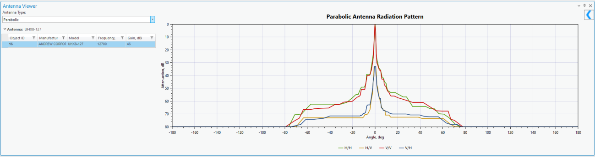

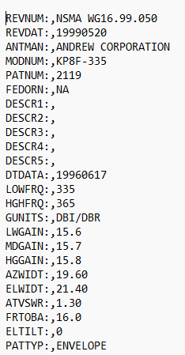

Files tool. Parabolic antenna import supports:
- Andrew format:
- NSMA format:

---

Select Parabolic (NSMA Format).
Click on Select Antenna Model Files
Browse to C:\CE_Course\RL_Prediction\Equipment\Antennas, select Antenna10GHz.txt file

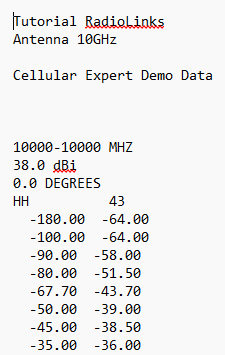

and press OK button. It will appear in Import/Export Antenna Files dialog.
Select Check box near the antenna and press Import Antennas button.

---

Antenna will be imported successfully. Now choose Andrew format.
Click on Select Antenna Model Files
Browse to C:\CE_Course\RL_Prediction\Equipment\Antennas, select a2119.adf antenna

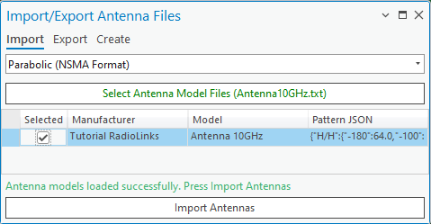

and press OK button to add it.
Select Check box near the antenna and press Import Antennas button.
Now open Antenna Viewer tool to review these antennas.

---

Close Antenna Viewer and Import tools.

## 3.2 Radios

This equipment category encompasses details about radio transceivers utilized in microwave

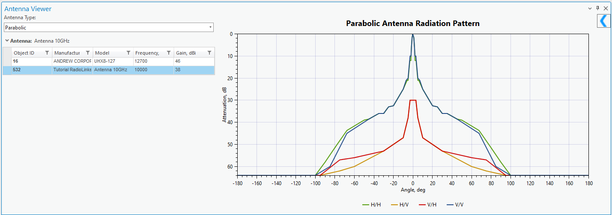

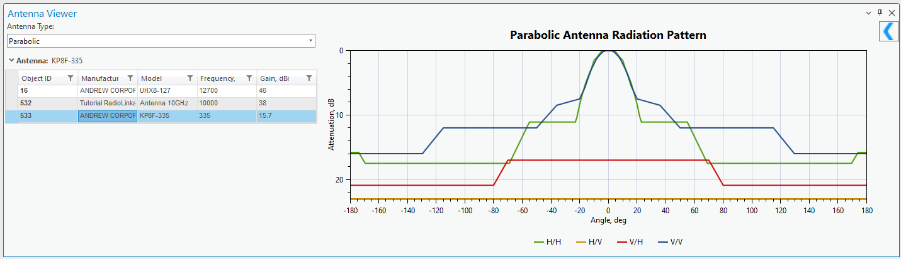

links. It comprises information on transmitter power, receiver sensitivity, noise figure,
nonlinearity characteristics, and maximum data capacity.
Open [Radios](#kw:710-radios:ce-pro-rlp) tool in CE RLP tab and preview available Radio within default CE workspace.

---

It has parameter section, and Modulations section.
Click on Add button in top right corner of the dialog.

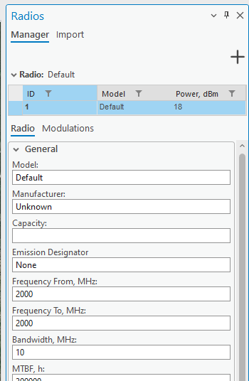

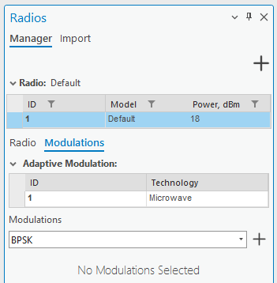

Define the same parameters as defined below:
- Model: RL Radio
- Manufacture: CE

---

- Frequency From, MHz: 9500
- Frequency To, MHz: 10500
- Bandwidth, MHz: 10
- MTBF, h: 300000
- MTTR, h: 24
- Bit Rate, kbps: 2048
- Block Size, bits: 2048
- Burst Errors: 1
- Dispersive Fade Margin, dB: 50
- BER 10-3 Threshold, dBm: -76
- BER 10-6 Threshold, dBm: -72
- Noise Figure, dB: 5
- Residual BER: 1E-12
- IIP2, dBm: 30
- IIP3, dBm: 29
- XPIF, dB: 20
- Power, dBm: 20
- Power Low, dBm: 10
- Power High, dBm: 26
- Automatic Transfer Power Control Range, dB: 20

---

Click on Modulations tab, and include these modulations:
You can do it simply selecting modulation from the list and press + button to add it for the

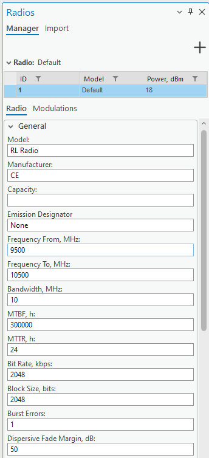

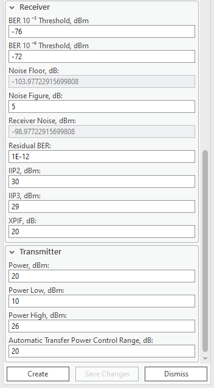

radio.
Each modulation has its own default parameters.

---

Leave default parameters and press Create button. The new radio will be added in the list.

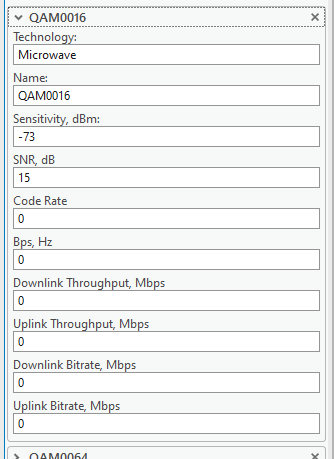

Click on Import tab.
Click on Seleted Data File and navigate to C:\CE_Course\MW_Equipment\Equipment\Radio,
select Aur24_1E1.raf and press OK button.

---

New radio with the parameters will be added to the dialog. Press Import button to import it
to the database.
Close Radio tool.

## 3.3 Frequency plans

Frequency planning is important for microwave link design, optimizing spectrum use, and
preventing interference. By strategically allocating frequency bands, it enhances efficiency,

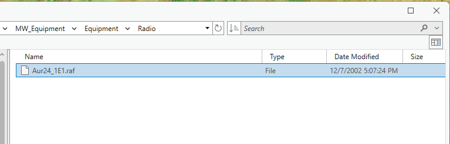

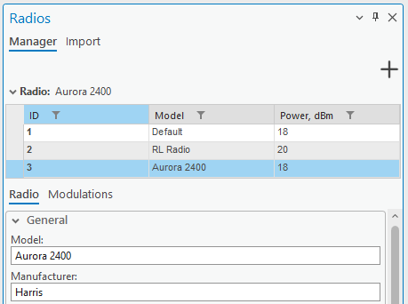

complies with regulations, and coordinates with other services. This planning considers
propagation characteristics and facilitates scalability, ensuring optimal performance for
microwave links in various environments and supporting future technology upgrades.
Frequency plans can be imported from a text file, or created manually.
3.3.1 Create manually
Open Frequency Plans tool in CE RLP tab.

---

Click on Add section and define:
- Frequency Plan Name: FP 10MHz 8 Carriers
- Low Frequency, MHz: 9800
- Carrier Spacing, MHz: 50
- Duplex Spacing, MHz: 300
- Carriers: 8
High Frequency, MHz will be filled automatically.
Press Add Frequency Plan button.
The new frequency plan will appear in the main dialog.

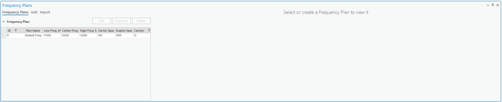

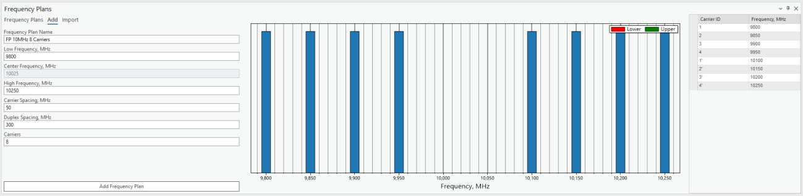

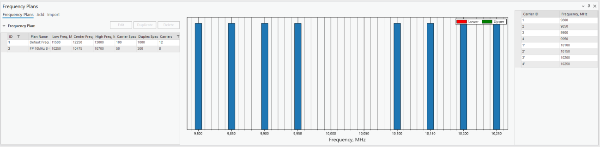

3.3.2 Import
Click on Import option, and then on Select Data Files.

---

Navigate to C:\CE_Course\RL_Prediction\Equipment\FrequencyPlans, select all files and

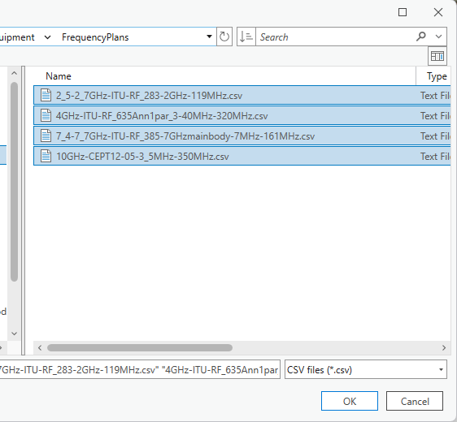

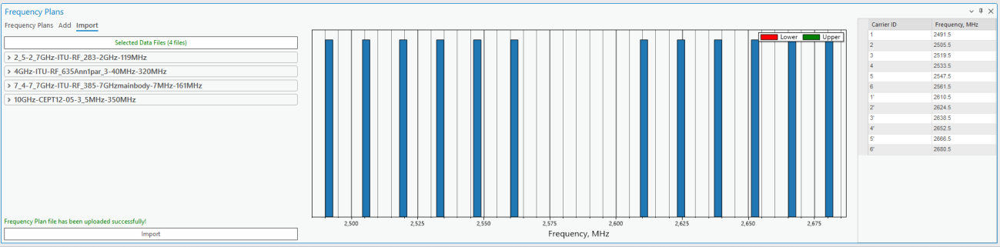

press OK button.
Frequency Plans will be added to the preview.

---

Press Import button and they will be imported to the database.

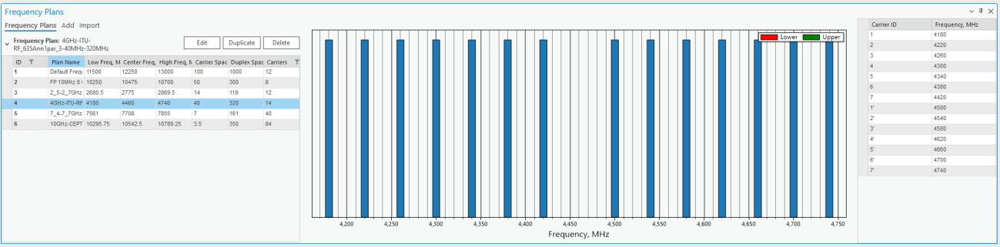

Close Frequency Plans dialog.

---
