# Creating Workspace

## Objective

This module provides a step-by-step, best-practice-driven introduction to creating and
managing workspaces in CE Server-Express. The material is designed from an RF planning
and optimization perspective, focusing not only on how to perform actions, but also why they
matter in real-world network design workflows.

By the end of this exercise, participants will be able to:
- Create and configure a workspace correctly
- Understand workspace structure and scope
- Manage and visualize layers efficiently
- Switch between 2D and 3D environments for RF-relevant analysis
- Prepare the workspace for further RF planning and optimization tasks

## Initial data

The following data is pre-configured for this exercise:
- Prepared geodata (high-resolution terrain and [clutter](#kw:clutter-classification-values:ce-express-geodata))
- Predefined external services for visualization

## Understanding the Workspace Concept

A Workspace in CE Express represents a project container that holds:
- [Network objects](#kw:object-types:ce-express-network-objects) (sites, cells, links, etc.)
- Geodata used for propagation modeling
- Additional visualization layers (GIS, 3D meshes, administrative boundaries)

Workspaces can be:
- Assigned to one or multiple user groups
- Used collaboratively by RF planners, optimization engineers, and managers
- Reused as templates for similar geographic areas

## Step 1 – Accessing CE Express

1. Open the following URL in your web browser: https://cecom2.cellular-expert.com/ce_express/
2. On the login page, select Login as ArcGIS.

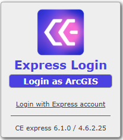

3. Enter your User Name and Password (that information is provided separetely for each
student)

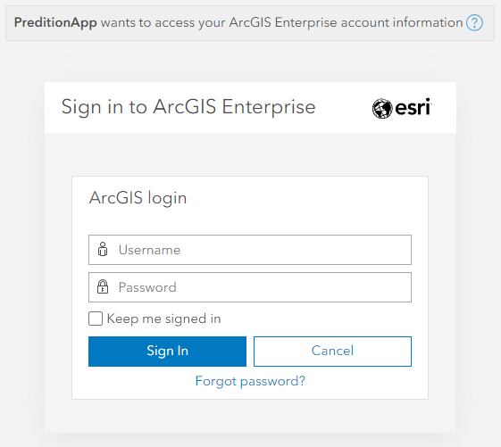

4. After successful authentication, the system displays all workspaces available to your
user group.

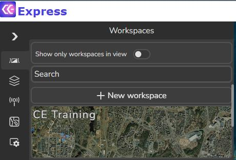

*Best practice:* Always verify you are working in the correct workspace before making
changes to avoid unintended modifications.

## Step 2 – Reviewing an Existing Workspace

1. From the workspace list, click on a provided workspace.

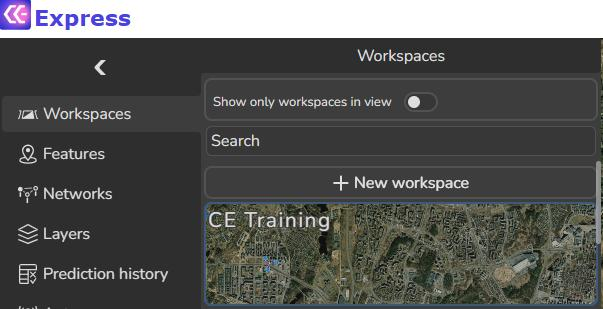

2. The map automatically zooms to the workspace extent.
3. Review visible objects and layers.

*Trainer insight:* Encourage users to explore existing workspaces to understand naming
conventions, layer organization, and visualization standards.

## Step 3 – Creating a New Workspace

1. Open the Workspaces tool.
2. Click + New Workspace.
3. In the dialog window, define the following parameters:

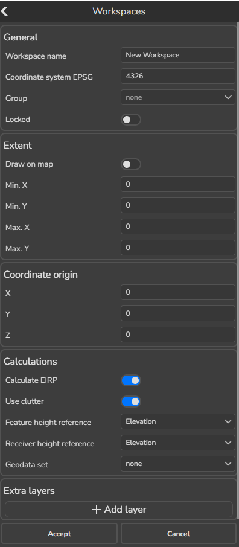

Workspace Parameters
- Workspace Name: Use your name (e.g., John_Smith_Training)
- Geodata Set: Select Vilnius_1m
- Extent:
  - Click Copy from geodata set
  - Ensures spatial alignment between workspace and terrain data

4. Adding Extra Layers

Click + Add layer and include the following services:
- Administrative regions:
https://cecom2.cellular-expert.com/server/rest/services/Hosted/Regions/FeatureServer/0
- Google 3D Mesh:
https://tile.googleapis.com/v1/3dtiles/root.json
- OpenStreetMap 3D Buildings:
https://basemaps3d.arcgis.com/arcgis/rest/services/OpenStreetMap3D_Buildings_v1/SceneServer

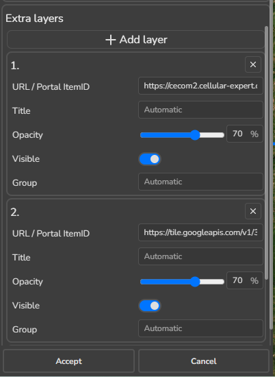

4. Click Accept to create the workspace.

## Step 4 – Opening and Locating the Workspace

1. Return to the Workspaces tool.
2. Use the Search function to find your newly created workspace.

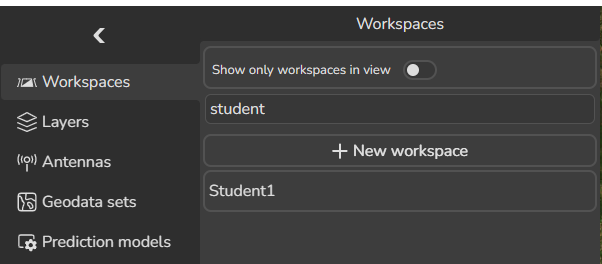

3. Click on it to load.

The map zooms to the workspace area. Blue contours indicate the workspace extent.

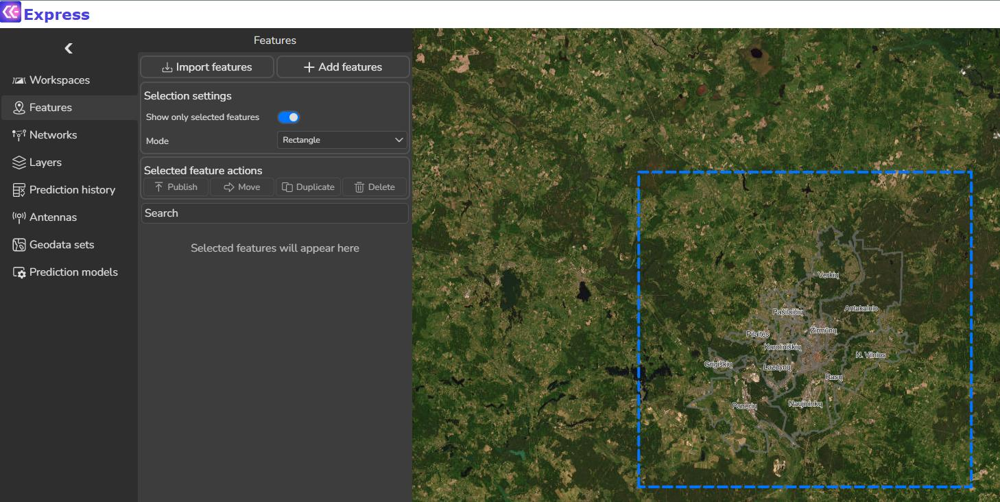

## Step 5 – Layer Management Overview

Open the Layers tool. It is divided into logical sections:

1. Preview available layers.

**1. Features**
- Displays all [network objects](#kw:object-types:ce-express-network-objects)
- Includes sites, cells, links, and other RF elements

**2. Geodata**
- Terrain, [clutter](#kw:clutter-classification-values:ce-express-geodata), and elevation data
- Used directly in propagation calculations

**3. Other**
- Additional GIS and visualization layers
- Can be used for RF planning – such as statistical calculations.

2. In the Other section, switch OFF the Regions layer.

Observe changes on the map.

## Step 6 – Switching Between 2D and 3D Views

1. Click the 3D button to switch from 2D to 3D view.

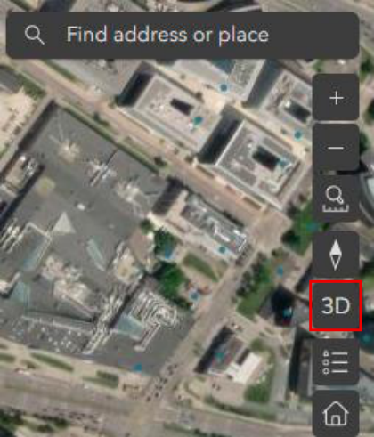

2. Zoom into the workspace area.
3. Switch OFF the OpenStreetMap3D Buildings layer.

The map now displays the Google 3D Mesh, which provides realistic urban morphology.

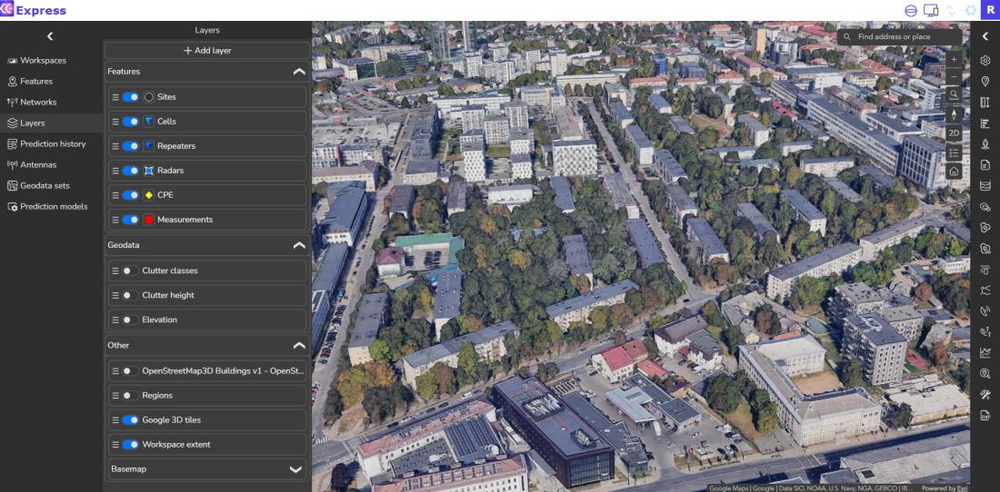

RF planning value: 3D meshes help validate antenna heights, LOS conditions, and urban canyon effects.

4. Switch OFF Google 3D tiles.
5. Enable OpenStreetMap3D Buildings again.

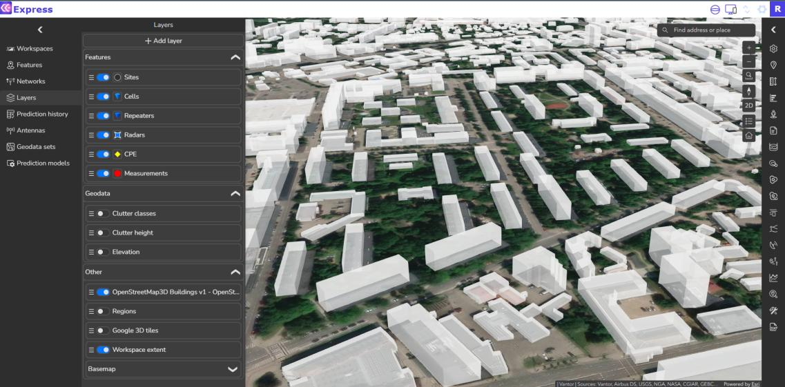

You can also visualize 3D objects, such as polygons, lines and zones.

6. Return to 2D view.

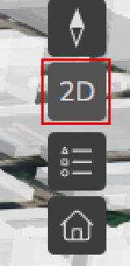

## Step 7 – Basemap Configuration

1. Expand the [Basemap](#kw:37-step-7-basemap-configuration:none) options in Layers tool.

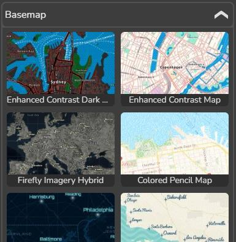
   
2. Review available ESRI basemaps.
3. Enable each [basemap](#kw:37-step-7-basemap-configuration:none) briefly to understandd differences.
4. Leave Topographic basemap enabled.

## Step 8 – Enabling and Reviewing Geodata

1. In the Geodata section, enable the Elevation layer.

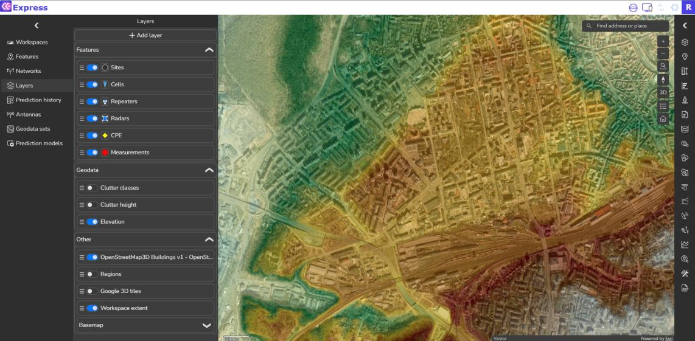

This layer:
- Visualizes terrain height
- Helps quickly identify hills, valleys, and potential shadowing areas

2. Review [Clutter](#kw:clutter-classification-values:ce-express-geodata) height and [Clutter classes](#kw:clutter-classification-values:ce-express-geodata) layers.
3. If Geodata Is Not Visible
   1. Open Settings.

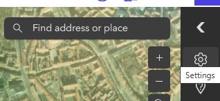

2. Enable Load geodata when opening workspace.

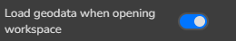

3. Refresh the workspace:
      - Open Workspaces tool
      - Click on your workspace again
  
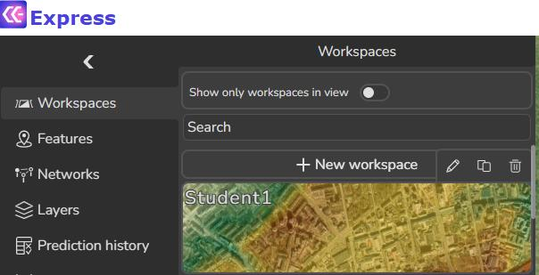

4. Return to Layers and verify geodata visibility.

## Step 9 – Editing an Existing Workspace

1. Open the Workspaces tool.
2. Hover over your workspace name to reveal options.
3. Click Edit workspace.

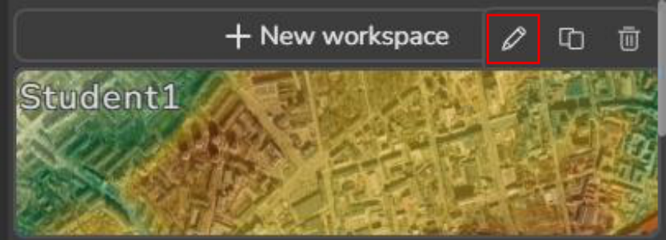

**Adding an Additional Layer**

Add the following service:
- https://cecom2.cellular-expert.com/server/rest/services/Hosted/Adresai_Vilnius/FeatureServer/82

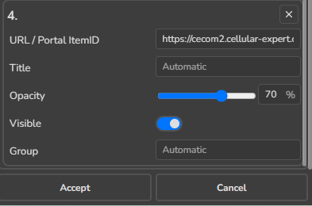

4. Click Accept.
5. Verify the new layer (Adresai Vilnius) is visible on the map.

## Step 10 – Using the Identify Tool

1. Open the [Identify tool](#kw:310-step-10-using-the-identify-tool:none).

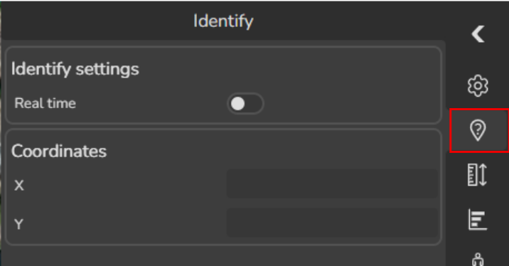

2. Click on one of the address points.
3. Review the popup information.

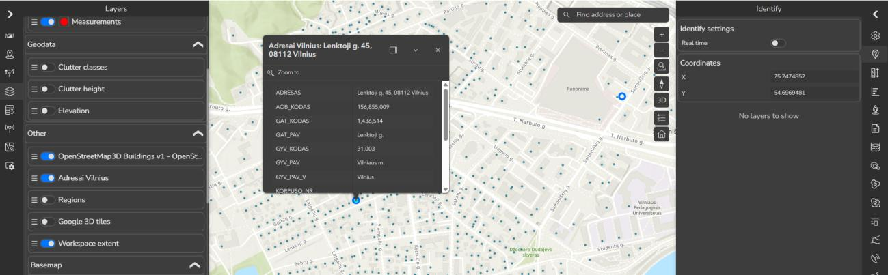

## Summary and Key Takeaways

- A well-configured workspace is the foundation of reliable RF planning
- [Layer management](#kw:35-step-5-layer-management-overview:none) improves clarity and performance
- 3D visualization enhances understanding of real-world propagation challenges
