# CE Express Only Administrator Guide v7.2

> **Version:** CE Express v7.2

Cellular Expert Express Administrator Guide 7.2

About Cellular Expert
Cellular Expert UAB (CE) developed ultra-fast wave
propagation, communication systems deployment planning
and radio/optical visibility calculation software for ESRI’s
ArcGIS mapping environment, which is widely used within
Telecom, Defense, IoT, and other companies and
organizations.
CE’s communication network planning, network asset
management, operational support software and customer-
tailored solutions enhance the intelligence and business
efficiency of more than 170 communication network
companies, regulators, and defense organizations in more
than 50 countries.
Copyright © 2026 UAB CELLULAR EXPERT. All rights
reserved. Cellular Expert and Cellular Expert logo are
registered trademarks, @cellular-expert.com and
www.cellular-expert.com are service marks of UAB
CELLULAR EXPERT in Lithuania and some other countries.
Confidential Cellular Expert, 2026 Page | 3

---

Cellular Expert Express Administrator Guide 5.8
1. System requirements
Welcome to Cellular Expert. This chapter will guide you through the minimal hardware and software
requirements.
Note: requirements can vary significantly, depending on acceptable calculation time task complexity, and
size of the database.

## 1.1 Minimum hardware requirements

Processor (CPU):
 Minimum: 4 cores, hyperthreaded
 Recommended: 8 cores
 Optimal: 16 cores
Optional Requirements for GPU-accelerated calculations
 GPU – any NVIDIA GPU with CUDA capabilities (https://developer.nvidia.com/cuda-gpus)
 Driver version: 456.38 or later
 CUDA Toolkit 11.or to 12.4 (recommended)
Memory/RAM
 Minimum: 16 GB
 Recommended: 32 GB
 Optimal: 64 GB or more
Storage
 Minimum: 500 GB of free space
 Recommended: 2TB or more of free space on a solid-state drive (SSD)

## 1.2 Minimum requirements for software

Cellular Expert Express runs on Microsoft Windows Server 2016 or higher. It requires:
 ArcGIS Enterprise server 10.8.1 or later (11.5 supported) Standard or Advanced licence (Portal for
ArcGIS included) with:
- ArcGIS DataStore
- WebAdapter for IIS to configure ArcGIS server
- WebAdapter for IIS to configure ArcGIS portal
 IIS webserver (or Apache server) with SSL enabled: required for ArcGIS server and CE Express
 SQL Database management system PostgreSQL (download from my.esri.com)
 Microsoft Visual C++ 2015-202x for ESRI products
Confidential Cellular Expert, 2026 Page | 4

---

Cellular Expert Express Administrator Guide 5.8

## 1.3 CE Express architecture examples

1.3.1 ArcGIS Enterprise & CE Server-Express on premises deployment simplified architecture
Clients Servers
1: ArcGIS Web Adaptor
ArcGIS Portal
Web Browser ArcGIS GIS Server
Users (Editors &
ArcGIS Datastore
Viewers)
CE Express Frontend
3. ArcGIS Pro
+ CE Desktop 2. CE Express backend, API
for Advanced
PostgreSQL
Users
Technical requirements:
1. Server for ArcGIS SW:
ArcGIS Web Adaptor (Esri ref URL);
ArcGIS Portal (Esri ref URL);
ArcGIS GIS Server (Esri ref URL);
ArcGIS Data Store (Esri ref URL);
CE Frontend (it could be installed together with the CE Express backend)
CPU:
Minimum 1 core
Recommended 8 cores
Optimal 16 cores
RAM:
Minimum 8 GB
Recommended 16 GB
Optimal 32 GB
Storage:
Minimum 500 GB of free space
Confidential Cellular Expert, 2026 Page | 5
SPTTH

---

Cellular Expert Express Administrator Guide 5.8
Recommended 2TB (Note 1)
2. CE Express:
CPU: 32 cores
RAM: 64 GB
Storage: 1+ TB (Note 2)
3. ArcGIS Pro:
CPU: 4 cores
RAM: 16 GB
Storage: 1 TB
Optional Requirements for GPU-accelerated calculations:
GPU – any NVIDIA GPU with CUDA capabilities (https://developer.nvidia.com/cuda-gpus)
Driver version: 456.38 or later
 CUDA Toolkit 11.0 to 12
1.3.2 ArcGIS Enterprise & CE Server-Express on premises or cloud deployment architecture
Clients Servers
2. Portal for
ArcGIS
1: ArcGIS
Web Browser
WebAdaptor
Users (Editors &
Viewers)
3. ArcGIS 4. ArcGIS
GIS Server DataStore
7. ArcGIS Pro 5. CE
+ CE Desktop Express
for Advanced backend +
Users PostgreSQL
6: CE
Frontend
(IIS)
Confidential Cellular Expert, 2026 Page | 6

SPTTH

---

Cellular Expert Express Administrator Guide 5.8
Technical requirements:
1. ArcGIS Web Adaptor (Esri ref URL):
CPU: 1 core
RAM: 32 GB
Storage: 512 GB
2. ArcGIS Portal (Esri ref URL):
CPU: 4 cores
RAM: 32 GB
Storage: 1 TB
3. ArcGIS GIS Server (Esri ref URL):
CPU: 4 cores
RAM: 32 GB
Storage: 512 GB
4. ArcGIS Data Store (Esri ref URL):
CPU: 1 core
RAM: 32 GB
Storage: 1+ TB (Note 1)
5. CE Server-Express:
CPU: 32 cores
RAM: 64 GB
Storage: 1+ TB (Note 2)
6. CE Frontend (it could be installed together with the ArcGIS Webadaptor):
CPU: 1 core
RAM: 8 GB
Storage: 128 GB
7. ArcGIS Pro:
CPU: 4 cores
RAM: 16 GB
Storage: 1 TB
Note 1: ArcGIS Data Store shall contain the background maps, imaging and other general GIS data. The
required storage capacity is to be confirmed in consultation with the client and/or GIS data vendor.
Note 2: CE Server-Express shall store locally the GIS raster data (GeoTIFF) needed for calculations (DEM,
DSM, DHM). The required storage capacity to be confirmed in consultation with the client and/or GIS data
vendor and dependent on the ultimate choice for GIS resolution: 0.2/0.5/1/2 m. or lower. Likely some
combination of resolutions may be logical (e.g. 1 m or below for urban/suburban areas, and 2 m or 5 m for
rural), also possible limiting the GIS data coverage to just the Area of interests.
2. Installation Guide
This topic provides detailed instructions for Cellular Expert Server solution installation. It describes the
installation, configuration, data loading path and steps to setup and start Cellular Expert Express solution.

## 2.1 Installation files

1. CE Express Setup file provided “CE_Express_7.2_winInstall(x64).exe”. It will automatically install:
Confidential Cellular Expert, 2026 Page | 7

---

Cellular Expert Express Administrator Guide 5.8
 CE Express DB schema
 CE Express (frontend and backend)
 CE Express demo data

## 2.2 Prerequisites

2.2.1 ArcGIS Server
Install ArcGIS for Server following the official installation guide:
https://enterprise.arcgis.com/en/server/latest/install/windows/steps-to-get-arcgis-for-server-up-and-running.htm
Use FQDN everywhere in the installation.
Arcgis Image Server is recommended but optional for publishing layers from CE Express.
2.2.2 PostgreSQL
Install PostgreSQL following the guide:
https://www.enterprisedb.com/docs/supported-open-source/postgresql/installer/02_installing_postgresql_with_the_graphical_installation_wizard/windows/

## 2.3 Install CE Express

Execute the provided CE Express installation file (“CE_Express_6.0_winInstall(x64).exe”) and proceed by

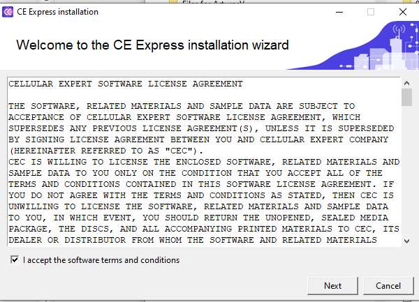
following the instructions displayed on the screen.
2.3.1 Accept the software terms and conditions
Confidential Cellular Expert, 2026 Page | 8

---

Cellular Expert Express Administrator Guide 5.8
2.3.2 Prepare installation folders
 CE express server installation and CE Express data folders could be left as default.
 CE Express frontend folder could be set under IIS webserver, usually “C:/inetpub/wwwroot”. The
folder "ceexp" needs to be created manually if it doesn't exist.
2.3.3 Prepare CE Express server configuration:
 Enter Portal for ArcGIS URL.
 Enter Portal for ArcGIS username, which will be used to login into CE Express. The same user will

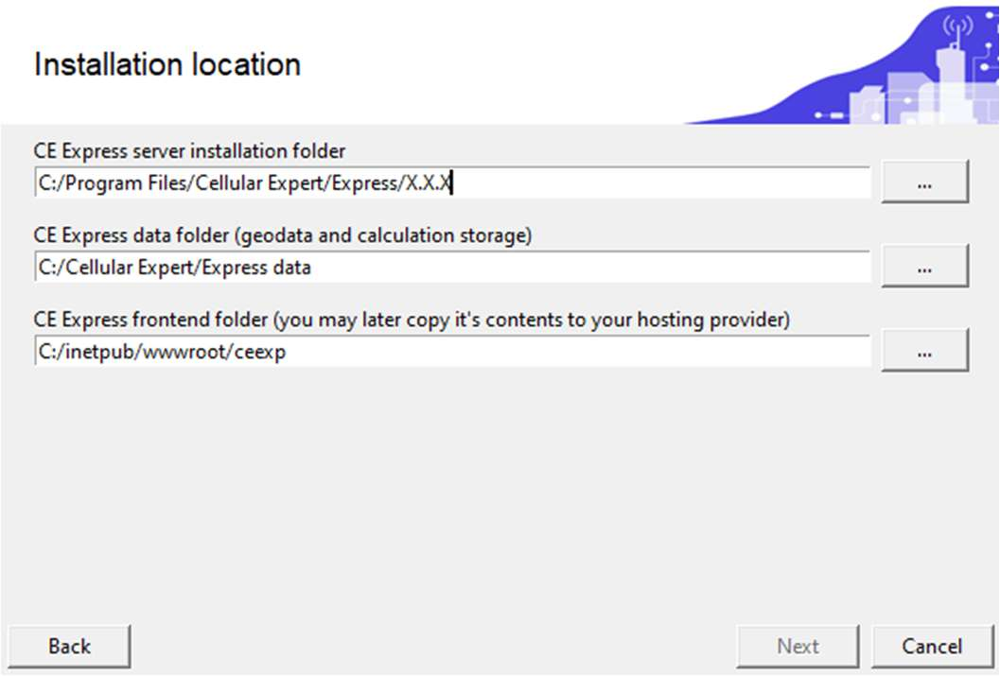

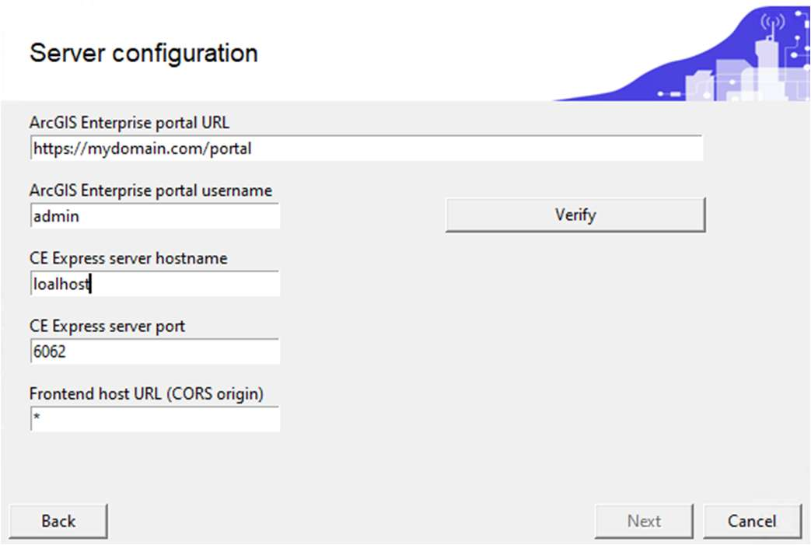
be assigned to the administrator group.
 Enter CE Express server hostname. Use FQDN for the hostname.
 Enter CE express server port. It could be changed if 6062 will be occupied after verification.
 Enter CE express frontend host URL (http(s)://[hostname]) or leave the “*”
 Click verify and wait for the messages:
Confidential Cellular Expert, 2026 Page | 9

---

Cellular Expert Express Administrator Guide 5.8
 Click “Next”
2.3.4 Prepare CE Express server DB configuration.
 Enter the hostname of PostgreSQL database. If the database is on the same server, could be left

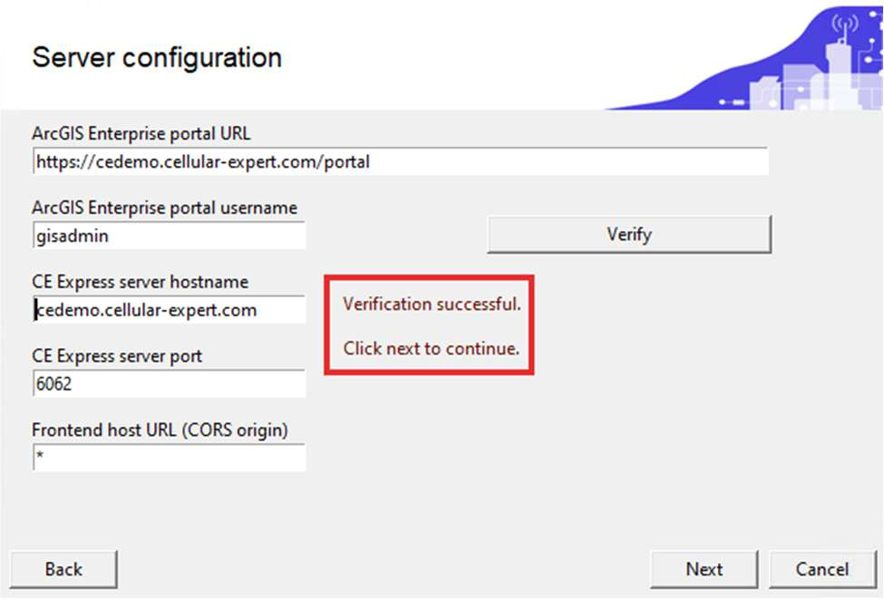

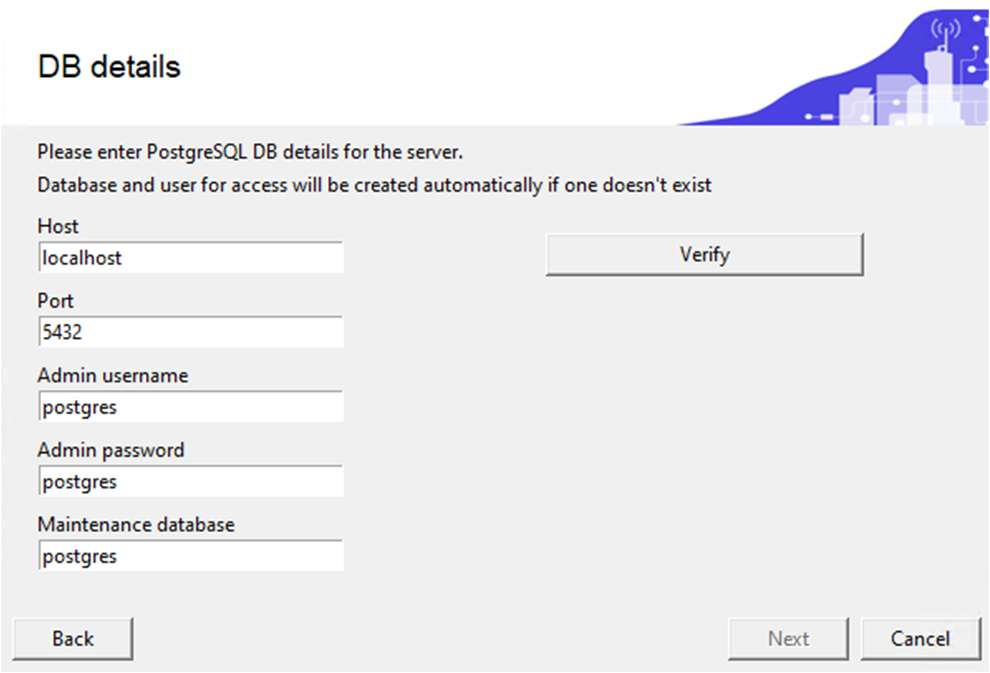
“localhost”.
 Enter the port of the PostgreSQL database. Usually, it is 5432.
 Enter admin user of PostgreSQL database. Usually, it is “postgres”.
 Enter the password for the admin user of the PostgreSQL database.
 Enter the maintenance database of the PostgreSQL database. Usually it is “postgres”.
 Click on the “Verify” button and wait for the messages:
Confidential Cellular Expert, 2026 Page | 10

---

Cellular Expert Express Administrator Guide 5.8
If a database schema named "ce_express" exists, you will be notified during the installation process. In

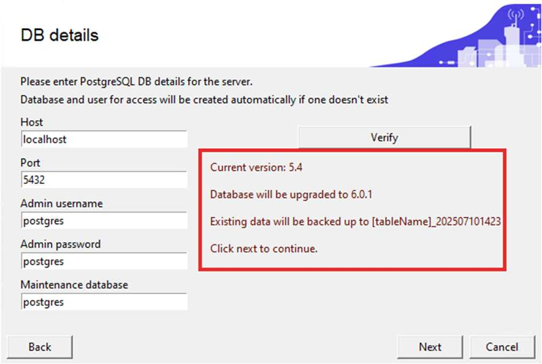

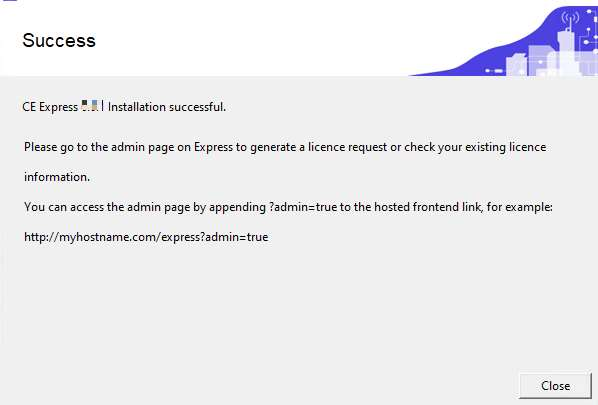

such a case, the tables will be copied with the postfix "_date" to avoid conflicts:
 Click “Next”. Installation will continue till finish:
2.3.5 Check Installation and the licence of the CE Express software.
Check windows services and there should be 3 CE Express services running:
Confidential Cellular Expert, 2026 Page | 11

---

Cellular Expert Express Administrator Guide 5.8
If windows services are running, open web browser and start CE Express administrator tool:
http://CE_express_hostname/ceexpressfrontenfolder/?admin=true
(Example: http://localhost/ceexp/?admin=true)
 Obtain the licence request file by clicking on the designated section.
 Send the obtained file to Cellular Expert support.
 Once you receive the license file, apply it by either clicking on the "Import License File" section or

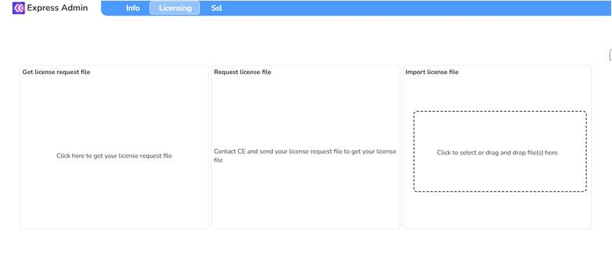

by dragging and dropping the file into that section:
Note: The browser could always redirect to https instead of using http. The administrator needs to include
the URL of CE Express to the insecure content list. It could be done using the browser’s settings:
 Chrome: chrome://settings/content/insecureContent
 Edge: edge://settings/content/insecureContent
Another way is to enable SSL support on CE Express (see chapter “Enable SSL support (optional)).
Confidential Cellular Expert, 2026 Page | 12

---

Cellular Expert Express Administrator Guide 5.8
2.3.6 Enable SSL support (optional)
To enable SSL support prepare SSL certificate files. Into CE Express could be imported the pfx file
(password required) (Optional: ssl.crt and ssl_pem.key could be imported).
To import SSL files for CE Express open the CE admin tool using URL:
http://CE_express_hostname/ceexpressfrontenfolder/?admin=true
 Open SSL tab:
 Import prepared SSL pfx file using “Import .pfx certificate file” section.
 After importing the SSL certificate, it needs to edit the configuration file located under CE Express
frontend folder as described in section 2.3.2. Example “C:/inetpub/wwwroot/ceexp”
 Open “config.json” file with the text editor and change from “http” to “https” in the parameter
“ceApiUrl”. Example:
From "ceApiUrl": "http://[CE_express_hostname]:6062"
To "ceApiUrl": "https://[CE_express_hostname]:6062"
 Restart Windows services:
The “Coordinator” service must be started the last.
When SSL is enabled use https protocol to access the CE Express application

https://CE_express_hostname/ceexpressfrontenfolder (Example: https://localhost/ceexp ).
2.3.7 Configure CE Express to publish objects to the Portal for ArcGIS (optional)
2.3.7.1 Option: Arcgis Server without Image Server
 Publish provided geoprocessing tool "publishTif.sd" using Arcgis Server manager. The published
Confidential Cellular Expert, 2026 Page | 13

---

Cellular Expert Express Administrator Guide 5.8
GP tool example view:
 Find and copy the GP tool's Rest URL:
 Edit C:\Program Files\Cellular Expert\Express\config.json and change the three (3) parameters
required for publishing:
"PUBLISH_GEOPROCESSOR": "https://<CE Server hostname>/server/rest/services/publishTif/GPServer",
"PUBLISH_USERNAME": "USERNAME",
"PUBLISH_PASSWORD": "PASSWORD"
USERNAME and PASSWORD are Portal’s for Arcgis user's username and password. This user will be
used to publish, and the published objects (raster or features) will be visible under this user's content.

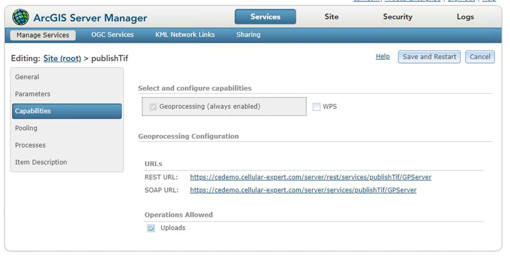
 Restart Windows services. The “Coordinator” service must be started last.
2.3.7.2 Option: Arcgis Server with Image Server
 Edit C:\Program Files\Cellular Expert\Express\config.json and change the two (2) parameters
required for publishing:
"PUBLISH_GEOPROCESSOR": "",
"PUBLISH_USERNAME": "USERNAME",
"PUBLISH_PASSWORD": "PASSWORD"
USERNAME and PASSWORD are Portal’s for Arcgis user's username and password. This user will be
used to publish, and the published objects (raster or features) will be visible under this user's content.
 Restart Windows CE services. The “Coordinator” service must be started last.
Confidential Cellular Expert, 2026 Page | 14

---

Cellular Expert Express Administrator Guide 5.8
2.3.8 Configure CE Express to send notifications (optional)
You can enable email notifications to alert recipients when changes occur in the database. This feature is
managed through the configuration file.
 Open the configuration file C:\Program Files\Cellular Expert\Express\config.json
 Locate and edit the following parameters to match your email service or SMTP server settings:
"EMAIL_SERVICE_PROVIDER": "",
"EMAIL_USERNAME": "",
"EMAIL_PASSWORD": "",
"SMTP_HOST": "",
"SMTP_PORT": "",
"SMTP_SECURE": false,
"SMTP_TLS_CIPHERS": "SSLv3",
"SMTP_TLS_REJECT_UNAUTHORIZED": false
Leave "EMAIL_SERVICE_PROVIDER" empty if you are configuring notifications using a custom SMTP
server.
Ensure the remaining SMTP parameters (SMTP_HOST, SMTP_PORT, etc.) are correctly filled in according
to your email provider’s requirements.
 Restart Windows CE services. The “Coordinator” service must be started last.
3. Prepare the application with own data

## 3.1 Prepare data files

In this chapter, you will find a description of the geographical file types that are used in Cellular Expert.
Use the “Geodata sets” tool to upload all the required data to the CE Express:
Confidential Cellular Expert, 2026 Page | 15

---

Cellular Expert Express Administrator Guide 5.8
How to prepare geodata tif files is described below in this CE Express Administrator Guide.
3.1.1 General information
The CE tools make use of three distinct GIS data layers to obtain high precision modelling of radio wave
propagation losses:
1. Digital Terrain Model (DTM), also known as Digital Elevation Model (DEM), which describes Earth
surface, i.e., path [terrain profile](#kw:reading-the-profile-graph:ce-express-profile) in terms of ground elevation above uniform sea level.
2. [Clutter](#kw:clutter-classification-values:ce-express-geodata) height layer, delineating buildings and other such objects above Earth surface that may
be considered to be principal impediments for radio wave propagation.
3. [Clutter](#kw:clutter-classification-values:ce-express-geodata) class layer, each pixel defines the ID of the [clutter](#kw:clutter-classification-values:ce-express-geodata) class, which the area belongs to. Usually
derived from land use data. If building heights are included in the clutter height raster, the clutter
classes raster must have building outlines separated into their own class ID.
These types of GIS data describing the radio wave propagation path are illustrated in Fig. 1, which shows

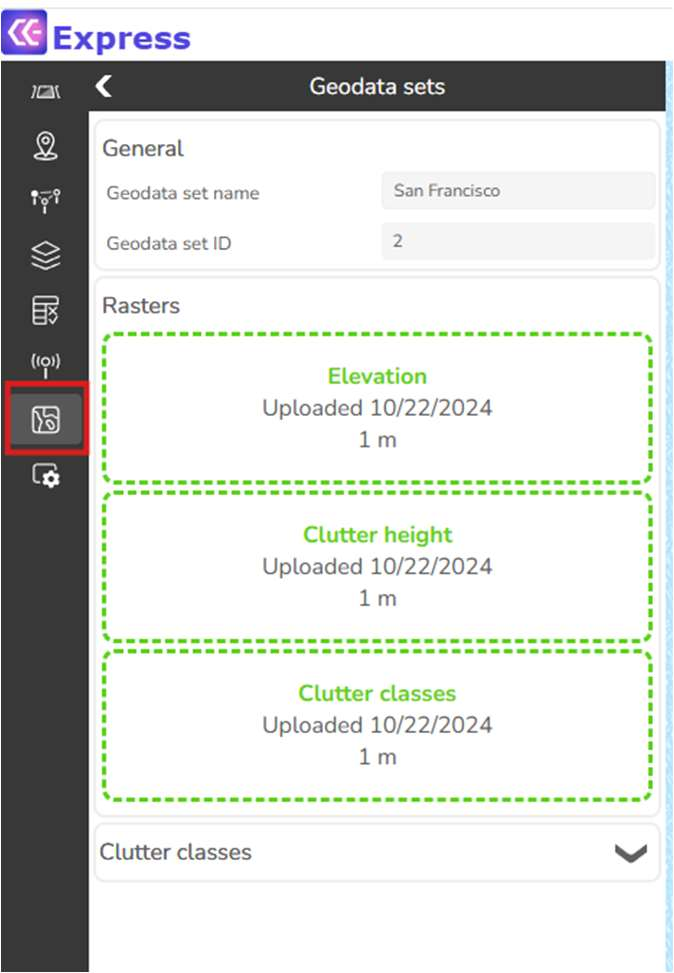

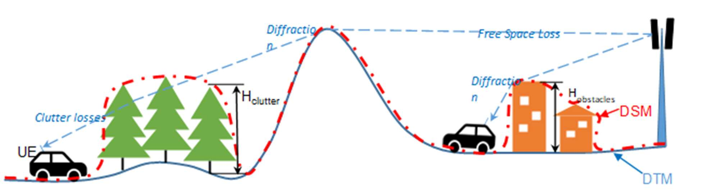
the key propagation effects with corresponding types of path loss components: Free Space Loss (FSL),
losses due to diffraction over terrain protrusions and obstacles, and losses due to clutter penetration.
Confidential Cellular Expert, 2026 Page | 16

---

Cellular Expert Express Administrator Guide 5.8
Sometimes users may have the Digital Surface Model (DSM) elevation data to represent the path profile.
The DSM is usually obtained by air-based scanning of surface of the Earth that cannot distinguish between
the actual terrain level and the elevation due to buildings, forests, or other types of ground cover. The well

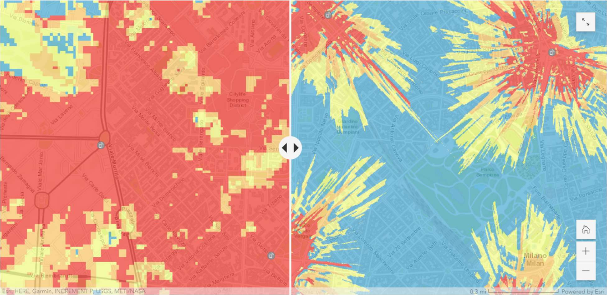
known and widely available sets of global DSM data include the USGS SRTM-1 and SRTM-3 as well as
ASTER. Although a single path profile layer with DSM data could be used to model radio wave propagation,
the path loss model will interpret it as a pure DTM, i.e., as if representing the homogeneous (and
impenetrable for radio waves) Earth surface. Therefore, the results of calculated path losses, and
accordingly the forecasted network coverage signal levels, will not be as precise and nuanced as if using
distinct types of DTM and clutter layers.
Another important factor defining the precision of path loss modelling is the resolution of GIS data used to
represent DTM and clutter, or the DSM. For instance, based on our practical experience with available GIS
data sets and the modern computational capabilities of our tools, CE recommends using the following
resolution of path [profiling](#kw:42-step-2-profiling-pointtopoint-analysis:ce-express-tr-los) data for modelling coverage of 4G/5G cellular networks:
 Rural areas: preferably 10 m, and at most 25 m,
 Urban areas: preferably 1 m, and at most 5 m.
The comparative precision of modelling signal coverage in dense urban conditions when using respectively
25 m resolution ASTER DSM data and 1 m resolution Maxar DTM & Buildings data is shown in Fig. 2.
To summarize, it is of critical importance to gather, configure and use suitable types of path [profiling](#kw:42-step-2-profiling-pointtopoint-analysis:ce-express-tr-los) data
with appropriate resolution to obtain reliable results of network coverage simulations. Only then the user
may be confident in simulated results of network coverage in terms of calculated received signal levels and
other derivative operational parameters.
All three layers could be prepared using ArcGIS Pro tools: Projection, Copy Raster and Raster Calculator.
3.1.2 Geographic data
Supported geographical data types:
Confidential Cellular Expert, 2026 Page | 17

---

Cellular Expert Express Administrator Guide 5.8
Only GeoTIFF is supported.
Mandatory geographical data:
Elevation, or Digital Terrain Model (DTM) grid.
Uploaded rasters have the following requirements:
 Must be in [projected coordinate](#kw:what-is-a-projected-[crs](#kw:check-crs:ce-express-geodata):ce-express-geodata) system
 Coordinate system units must be meters
 All rasters must have the same coordinate system
 Raster resolution in X and Y axis must match
3.1.2.1 Elevation, or Digital Terrain Model (DTM) Grid (Mandatory)
The Digital Terrain Model (DTM), also known as Digital Elevation Model (DEM), represents the Earth’s
ground level above sea level. Each raster pixel has its height value.
A sample DTM raster is presented below. Each pixel represents 5 square meters with its height value. In
reality, within a one-pixel area, the height is not the same everywhere. Thus, the pixel’s height value is the
height in its center or the maximum. The smaller the pixels, the more accurate is the grid - but also more
data to calculate.
Prepare DTM raster
3.1.2.1.1.1 Projection
The raster must use a [Projected Coordinate](#kw:what-is-a-projected-[crs](#kw:check-crs:ce-express-geodata):ce-express-geodata) System. To check the coordinate system of your raster, use
the Properties function in ArcGIS Pro. Add the raster to your project, right-click on it, and select Properties.

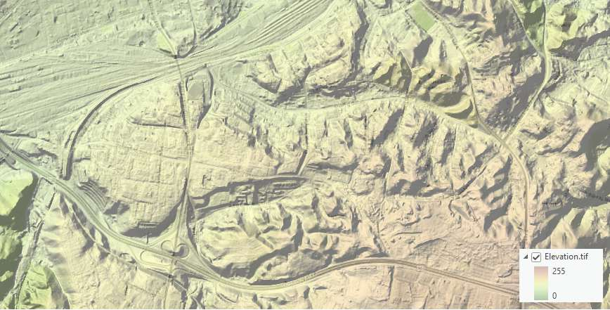
Then, go to the Source tab > Spatial Reference and check the Coordinate System type parameter to confirm
it is in a [Projected Coordinate](#kw:what-is-a-projected-[crs](#kw:check-crs:ce-express-geodata):ce-express-geodata) System.
Confidential Cellular Expert, 2026 Page | 18

---

Cellular Expert Express Administrator Guide 5.8
If your raster is in a Geographic Coordinate System or needs a different projection, use the Geoprocessing

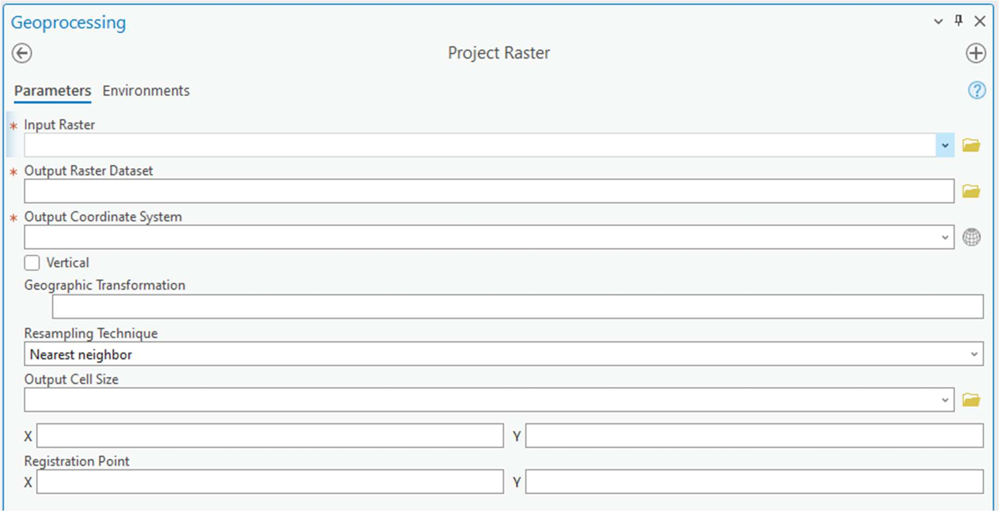
> [Project Raster](#kw:33-project-raster:ce-express-tr-geodata) tool to update it.
In the Output Coordinate System, specify a new coordinate system. It is recommended to use a [UTM](#kw:what-is-a-projected-crs:ce-express-geodata)
coordinate system under the WGS 1984 projection.
Confidential Cellular Expert, 2026 Page | 19

---

Cellular Expert Express Administrator Guide 5.8
You can find the appropriate [UTM](#kw:what-is-a-projected-crs:ce-express-geodata) zone for your area here:
https://www.arcgis.com/apps/mapviewer/index.html?layers=b294795270aa4fb3bd25286bf09edc51
3.1.2.2 [Clutter classes](#kw:clutter-classification-values:ce-express-geodata) grid
This raster type provides information about land use. The naming and classification of land use types may

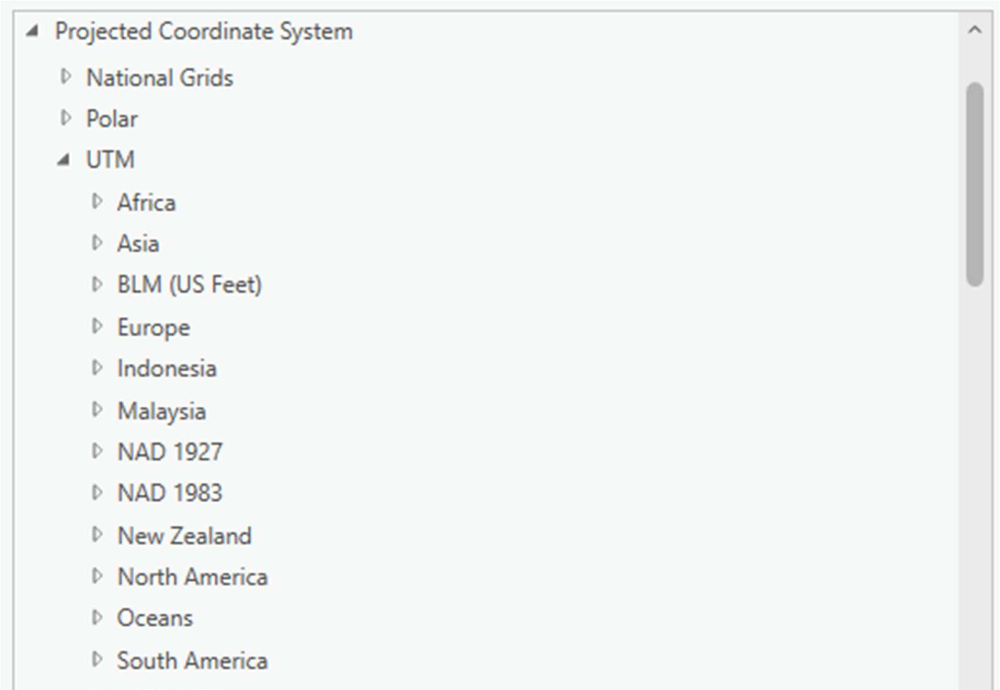

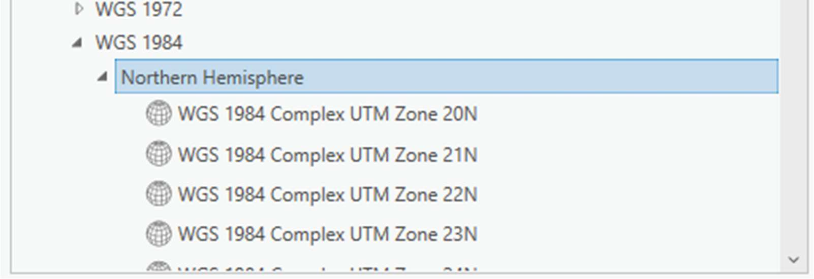
vary. An example is the Sentinel-2 Land Cover dataset from the Living Atlas: Living Atlas Sentinel-2 Land
Cover
Confidential Cellular Expert, 2026 Page | 20

---

Cellular Expert Express Administrator Guide 5.8
This data is freely available worldwide.
Prepare [Clutter Classes](#kw:clutter-classification-values:ce-express-geodata) raster
3.1.2.2.1.1 Projection
It must have the same coordinate system as your elevation.tif raster. If your raster has different coordinate

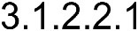

system, then use the Geoprocessing tool → [Project Raster](#kw:33-project-raster:ce-express-tr-geodata) to fix it.
Confidential Cellular Expert, 2026 Page | 21

---

Cellular Expert Express Administrator Guide 5.8
In the Output Coordinate System you would need to define the same coordinate system as your elevation.tif

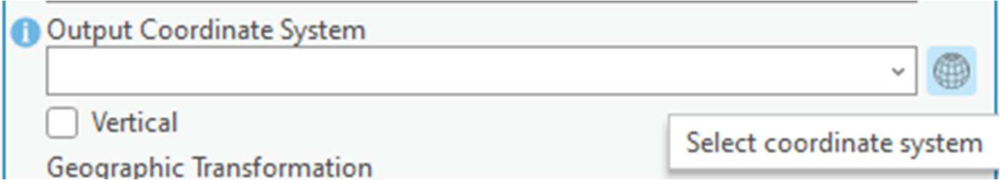

raster. Click on Select Coordinate System button.
And choose the same coordinate system as your elevation.tif.
3.1.2.3 Clutter height
Represents actual clutter heights, which override the default heights specified in the Clutter table. The
clutter heights raster requires the accompanying [clutter classes](#kw:clutter-classification-values:ce-express-geodata) raster and cannot be used independently.
Confidential Cellular Expert, 2026 Page | 22

---

Cellular Expert Express Administrator Guide 5.8
A clutter height raster can be derived from a Digital Surface Model (DSM) raster and a Digital Terrain Model

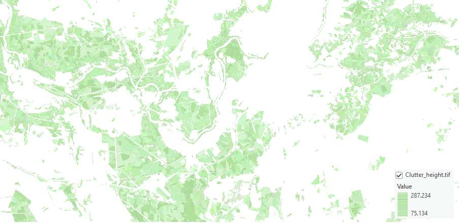
(DTM) raster using the ArcGIS Raster Calculator tool. To access this tool, open Geoprocessing tools and
navigate to Spatial Analyst > Map Algebra > Raster Calculator. Use the following formula:
DSM – DTM
Confidential Cellular Expert, 2026 Page | 23

---

Cellular Expert Express Administrator Guide 5.8
The calculation output will be the difference between the DSM and DTM grids, representing the clutter
heights.
Prepare Clutter Height raster
3.1.2.3.1.1 Projection
It must have the same coordinate system as your elevation.tif raster. If your raster has different coordinate

system, then use the Geoprocessing tool → Project Raster to fix it.
Confidential Cellular Expert, 2026 Page | 24

---

Cellular Expert Express Administrator Guide 5.8
In the Output Coordinate System you would need to define the same coordinate system as your elevation.tif

raster. Click on Select Coordinate System button.
And choose the same coordinate system as your elevation.tif.
Confidential Cellular Expert, 2026 Page | 25

---

Cellular Expert Express Administrator Guide 5.8
3.1.3 Antennas
The [Antenna pattern](#kw:managing-the-antenna-library:ce-express-antenna) files in .txt format should be prepared and could be imported into the CE database
using the CE Express antenna import tool. The CE Express application uses the Planet [antenna pattern](#kw:managing-the-antenna-library:ce-express-antenna)

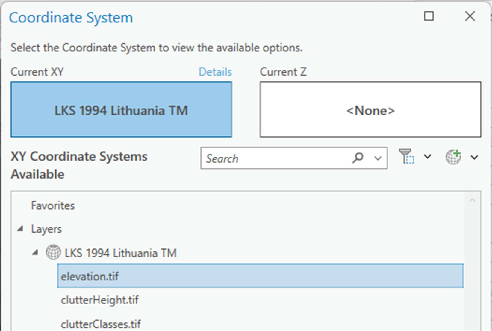

format. This format consists of a header, horizontal and vertical records. Example:
After import of the antenna, the antenna id could be used in the cells data table.
Confidential Cellular Expert, 2026 Page | 26

---

Cellular Expert Express Administrator Guide 5.8

## 3.2 Create new workspace in CE Express

To create a new workspace using start CE Express using URL

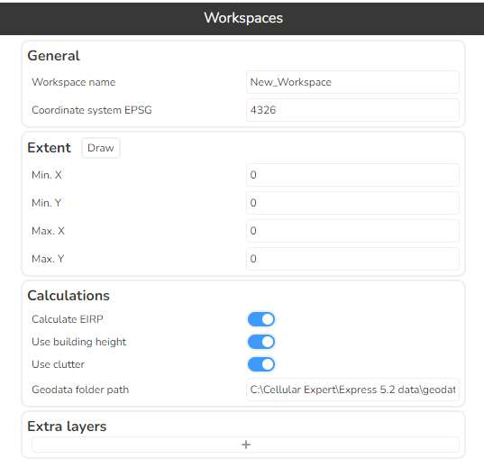
http://CE_express_hostname/ceexpressfrontenfolder
(Example: http://localhost/ceexp )
 Login as user with administrator rights (user provided during setup)
 In the workspace list click “+ new Workspace” button:
 In the window describe the workspace:
Workspace name: must be the name of a newly created folder.
Geodata folder path: must be the physical path of the newly created folder.
Coordinate system [EPSG](#kw:what-is-a-projected-crs:ce-express-geodata): enter coordinate system’s code. 4326 is [WGS84](#kw:what-is-a-projected-crs:ce-express-geodata).
Extent: describe the extent of the workspace.
Calculations: enable or disable parameters if they are not used.
Extra layers: add additional layers form the other sources to be visualized in this new workspace.
For the administrators the new workspace will be visible after creation.
Confidential Cellular Expert, 2026 Page | 27

---

Cellular Expert Express Administrator Guide 5.8
Antennas or cells for the new workspace could be loaded using CE Express environment and tools.
Confidential Cellular Expert, 2026 Page | 28

---
