# CE Express Administrator Guide v7.2

> **Version:** CE Express v7.2

Cellular Expert Express Administrator Guide 7.2

Table of Contents
1. System requirements 5

1.1 Minimum hardware requirements 5

1.2 Minimum requirements for software 5

1.3 CE Express architecture examples 6

1.3.1 ArcGIS Enterprise & CE Server-Express on premises deployment simplified architecture 6
1.3.2 ArcGIS Enterprise & CE Server-Express on premises or cloud deployment architecture 7
2. Installation Guide 8

2.1 Installation files 8

2.2 Prerequisites 9

2.2.1 ArcGIS Server 9
2.2.2 PostgreSQL 9
2.2.3 PHP server 9

2.3 Install CE Express 11

2.3.1 Accept the software terms and conditions 11
2.3.2 Prepare installation folders 12
2.3.3 Prepare CE Express server configuration: 12
2.3.4 Prepare CE Express server DB configuration. 13
2.3.5 Check Installation and the licence of the CE Express software. 14
2.3.6 Enable SSL support (optional) 16
2.3.7 Configure CE Express to publish objects to the Portal for ArcGIS (optional) 16
2.3.8 Configure CE Express to send notifications (optional) 18
2.3.9 Creating the Inventory3D Database structure and insert initial data 18
2.3.10 Installing Inventory3D webapplication package 18
2.3.11 Webapplication in Portal for ArcGIS 19
2.3.12 CE Inventory3D folder structure 20

2.4 Information about CE Express Inventory3D database 23

2.4.1 Tables structure 23
2.4.2 Register licence for the CE Inventory3D 28
2.4.3 Testing the CE Inventory3D webview installation 28
3. Prepare the application with own data 29

3.1 Prepare data files 29

Confidential Cellular Expert, 2026 Page | 2

---

Cellular Expert Express Administrator Guide 7.2
3.1.1 General information 30
3.1.2 Geographic data 31
3.1.3 Antennas 40

3.2 Create new workspace in CE Express 41

4. CE Inventory3D webapplication functions for administrators 42

4.1 Set defaults 42

4.2 Generate PDF reports 42

4.3 Run script 43

4.4 Import CSV 43

4.5 History 45

4.6 User Management 46

4.7 System tables 52

4.8 Delete object permanently 52

4.9 Restore deleted image 52

4.10 Column and table aliasing 53

4.11 Reset password 53

Confidential Cellular Expert, 2026 Page | 3

---

Cellular Expert Express Administrator Guide 7.2
About Cellular Expert
Cellular Expert UAB (CE) developed ultra-fast wave
propagation, communication systems deployment planning
and radio/optical visibility calculation software for ESRI’s
ArcGIS mapping environment, which is widely used within
Telecom, Defense, IoT, and other companies and
organizations.
CE’s communication network planning, network asset
management, operational support software and customer-
tailored solutions enhance the intelligence and business
efficiency of more than 170 communication network
companies, regulators, and defense organizations in more
than 50 countries.
Copyright © 2026 UAB CELLULAR EXPERT. All rights
reserved. Cellular Expert and Cellular Expert logo are
registered trademarks, @cellular-expert.com and
www.cellular-expert.com are service marks of UAB
CELLULAR EXPERT in Lithuania and some other countries.
Confidential Cellular Expert, 2026 Page | 4

---

Cellular Expert Express Administrator Guide 7.2
1. System requirements
Welcome to Cellular Expert. This chapter will guide you through the minimal hardware and software
requirements.
Note: requirements can vary significantly, depending on acceptable calculation time task complexity, and
size of the database.

## 1.1 Minimum hardware requirements

Processor (CPU):
 Minimum: 8 cores, hyperthreaded
 Recommended: 16 cores
 Optimal: 32 cores
Optional Requirements for GPU-accelerated calculations
 GPU – any NVIDIA GPU with CUDA capabilities (https://developer.nvidia.com/cuda-gpus)
 Driver version: 456.38 or later
 CUDA Toolkit 11.0 to 12.4 (recommended)
Memory/RAM
 Minimum: 16 GB
 Recommended: 32 GB
 Optimal: 64 GB or more
Storage
 Minimum: 500 GB to 1TB of free space
 Recommended: 2TB or more of free space on a solid-state drive (SSD)

## 1.2 Minimum requirements for software

Cellular Expert Express runs on Microsoft Windows Server 2016 or higher. It requires:
 ArcGIS Enterprise server 10.8.1 or later (11.5 supported) Standard or Advanced licence (Portal for
ArcGIS included) with:
- ArcGIS DataStore
- WebAdapter for IIS to configure ArcGIS server
- WebAdapter for IIS to configure ArcGIS portal
 IIS webserver (or Apache server) with SSL enabled: required for ArcGIS server and CE Express
 PHP server for IIS(or for Apache server) version 8.5 or less
 SQL Database management system PostgreSQL (download from my.esri.com)
 Microsoft Visual C++ 2015-202x for ESRI products
Confidential Cellular Expert, 2026 Page | 5

---

Cellular Expert Express Administrator Guide 7.2

## 1.3 CE Express architecture examples

1.3.1 ArcGIS Enterprise & CE Server-Express on premises deployment simplified architecture
Clients Servers
1: ArcGIS Web Adaptor
ArcGIS Portal
Web Browser ArcGIS GIS Server
Users (Editors &
ArcGIS Datastore
Viewers)
CE Express Frontend+PHP
3. ArcGIS Pro
+ CE Desktop 2. CE Express backend, API
for Advanced
PostgreSQL
Users
Technical requirements:
1. Server for ArcGIS SW:
ArcGIS Web Adaptor (Esri ref URL);
ArcGIS Portal (Esri ref URL);
ArcGIS GIS Server (Esri ref URL);
ArcGIS Data Store (Esri ref URL);
CE Frontend (it could be installed together with the CE Express backend)
CPU:
Minimum 1 core
Recommended 8 cores
Optimal 16 cores
RAM:
Minimum 8 GB
Recommended 16 GB
Optimal 32 GB
Storage:
Minimum 500 GB of free space
Confidential Cellular Expert, 2026 Page | 6
SPTTH

---

Cellular Expert Express Administrator Guide 7.2
Recommended 2TB (Note 1)
2. CE Express:
CPU: 32cores
RAM: 64 GB
Storage: 1+ TB (Note 2)
3. ArcGIS Pro:
CPU: 4 cores
RAM: 16 GB
Storage: 1 TB
Optional Requirements for GPU-accelerated calculations:
GPU – any NVIDIA GPU with CUDA capabilities (https://developer.nvidia.com/cuda-gpus)
Driver version: 456.38 or later
 CUDA Toolkit 11.0 to 12
1.3.2 ArcGIS Enterprise & CE Server-Express on premises or cloud deployment architecture
Clients Servers
2. Portal for
ArcGIS
1: ArcGIS
Web Browser
WebAdaptor
Users (Editors &
Viewers)
3. ArcGIS 4. ArcGIS
GIS Server DataStore
7. ArcGIS Pro 5. CE
+ CE Desktop Express
for Advanced backend +
Users PostgreSQL
6: CE
Frontend
(IIS+PHP)
Confidential Cellular Expert, 2026 Page | 7

SPTTH

---

Cellular Expert Express Administrator Guide 7.2
Technical requirements:
1. ArcGIS Web Adaptor (Esri ref URL):
CPU: 1 core
RAM: 32 GB
Storage: 512 GB
2. ArcGIS Portal (Esri ref URL):
CPU: 4 cores
RAM: 32 GB
Storage: 1 TB
3. ArcGIS GIS Server (Esri ref URL):
CPU: 4 cores
RAM: 32 GB
Storage: 512 GB
4. ArcGIS Data Store (Esri ref URL):
CPU: 1 core
RAM: 32 GB
Storage: 1+ TB (Note 1)
5. CE Server-Express:
CPU: 16 cores
RAM: 64 GB
Storage: 1+ TB (Note 2)
6. CE Frontend (it could be installed together with the ArcGIS Webadaptor):
CPU: 1 core
RAM: 8 GB
Storage: 128 GB
7. ArcGIS Pro:
CPU: 4 cores
RAM: 16 GB
Storage: 1 TB
Note 1: ArcGIS Data Store shall contain the background maps, imaging and other general GIS data. The
required storage capacity is to be confirmed in consultation with the client and/or GIS data vendor.
Note 2: CE Server-Express shall store locally the GIS raster data (GeoTIFF) needed for calculations (DEM,
DSM, DHM). The required storage capacity to be confirmed in consultation with the client and/or GIS data
vendor and dependent on the ultimate choice for GIS resolution: 0.2/0.5/1/2 m. or lower. Likely some
combination of resolutions may be logical (e.g. 1 m or below for urban/suburban areas, and 2 m or 5 m for
rural), also possible limiting the GIS data coverage to just the Area of interests.
2. Installation Guide
This topic provides detailed instructions for Cellular Expert Server solution installation. It describes the
installation, configuration, data loading path and steps to setup and start Cellular Expert Express solution.

## 2.1 Installation files

1. CE Express Setup file provided “CE_Express_7.2_winInstall(x64).exe”. It will automatically install:
Confidential Cellular Expert, 2026 Page | 8

---

Cellular Expert Express Administrator Guide 7.2
 CE Express DB schema
 CE Express (frontend and backend)
 CE Express demo data
2. Zip file (ceexp_db.zip) with Cellular Expert Inventory3D web application - frontend
3. Zip file (ceexp_db_scripts.zip) with Cellular Expert Inventory3D installation DB scripts

## 2.2 Prerequisites

2.2.1 ArcGIS Server
Install ArcGIS for Server following the official installation guide:
https://enterprise.arcgis.com/en/server/latest/install/windows/steps-to-get-arcgis-for-server-up-and-running.htm
Use FQDN everywhere in the installation.
Arcgis Image Server is recommended but optional for publishing layers from CE Express.
2.2.2 PostgreSQL
Install PostgreSQL following the guide:
https://www.enterprisedb.com/docs/supported-open-source/postgresql/installer/02_installing_postgresql_with_the_graphical_installation_wizard/windows/
2.2.3 PHP server
The PHP server can be installed and configured under IIS or under an Apache server. If PHP will use an
Apache server, Apache must be configured to use a different http port if the IIS is installed.
Apache server:
The easiest way to download and install Apache and PHP server is to install WAMP:
http://wampserver.aviatechno.net/
IIS server:
Download PHP from https://windows.php.net/download/.
(Installation instructions: https://www.php.net/manual/en/install.windows.manual.php)
After PHP for IIS installation check the php.ini file under PHP installation folder (example C:\php). There
could be two files php.ini-development and php.ini-production. Copy one of them to “php.ini and then edit
the new php.ini to configure it for the CE Inventory3D.
Create missing folders under C:\php:
 temp (ex c:\php\temp)
 logs
 sessions
2.2.3.1 PHP server configuration
Open the php.ini configuration file with the text editor and edit it.
Confidential Cellular Expert, 2026 Page | 9

---

Cellular Expert Express Administrator Guide 7.2
If you want to use another DBMS, it is required to enable additional PHP extensions depending on which
DBMS will be used. For the PostgreSQL database edit in the php.ini configuration file:
extension=pdo_pgsql
extension=pgsql
Other parameters in php.ini to be changed and checked:
log_errors = on
error_log = " c:\php\logs\php_errors.log”
upload_tmp_dir = " c:\php\temp "
session.save_path = " c:\php\sessions"
upload_max_filesize = 1024M
post_max_size = 1024M
memory_limit = 512M
session.gc_maxlifetime= 86400
extension=bz2
extension=curl
extension=fileinfo
extension=gd
extension=mbstring
extension=exif
At the end of php.ini add rows for the installed php version (example is for PHP 8.5):
For version 8.5.x:
[SG]
extension=ixed.8.5ts.win
The extension file should be provided in the installation package in ceexp_db.zip. Copy “ixed.8.5ts.win”
under c:\php\ext
Important php server parameters in the php.ini configuration file that can affect the Inventory3D usage:
1. Parameters for the size of the files uploaded to the server, required for attachments.
Example:
upload_max_filesize = 1024M
post_max_size = 1024M
2. Parameter for the maximum amount of memory a script may consume. This memory limit can
affect the number of records. If a table has many records, the value should be increased.
Example: memory_limit = 512M
3. A parameter that specifies the number of seconds after which the data will be viewed as
'garbage' and potentially cleaned up. This parameter should have a larger value than the
Inventory3D configuration parameter $sessionInactivityTimeout * 60 in the conf.inc file.
Confidential Cellular Expert, 2026 Page | 10

---

Cellular Expert Express Administrator Guide 7.2
Example: session.gc_maxlifetime=43500
2.2.3.2 IIS configuration for PHP
If the IIS is installed on the server, double-check if the CGI feature is installed. If the CGI feature isn’t

installed open the Server Manager and:
 Select Manage > Add roles and features
 Select Role Webserver (IIS) > Application Development > check CGI
 Click “Install”
When the CGI role is installed, open the IIS Manager and
 Select Site > Handler Mappings > Add Module Mapping:
o Set Request Path - *.php
o Set Module – FastCGIModule
o Set Executable – C:\php\php-cgi.exe
o Set Name – PHP
o Click Request Restriction button:
o Select “File or Folder”
o Click “OK”
o Click OK > Yes
 Select Site > Default Documents > Add
o Set index.php
 Restart IIS server

## 2.3 Install CE Express

Execute the provided CE Express installation file (“CE_Express_6.0_winInstall(x64).exe”) and proceed by
following the instructions displayed on the screen.
2.3.1 Accept the software terms and conditions
Confidential Cellular Expert, 2026 Page | 11

---

Cellular Expert Express Administrator Guide 7.2
2.3.2 Prepare installation folders
 CE express server installation and CE Express data folders could be left as default.
 CE Express frontend folder could be set under IIS webserver, usually “C:/inetpub/wwwroot”. The
folder "ceexp" needs to be created manually if it doesn't exist.
2.3.3 Prepare CE Express server configuration:
 Enter Portal for ArcGIS URL.
 Enter Portal for ArcGIS username, which will be used to login into CE Express. The same user will

be assigned to the administrator group.
 Enter CE Express server hostname. Use FQDN or leave “localhost” if SSL is not enabled.
 Enter CE express server port. It could be changed if 6062 will be occupied after verification.
 Enter CE express frontend host URL (http(s)://[hostname]) or leave the “*”
 Click verify and wait for the messages:
Confidential Cellular Expert, 2026 Page | 12

---

Cellular Expert Express Administrator Guide 7.2
 Click “Next”
2.3.4 Prepare CE Express server DB configuration.
 Enter the hostname of PostgreSQL database. If the database is on the same server, could be left

“localhost”.
 Enter the port of the PostgreSQL database. Usually, it is 5432.
 Enter admin user of PostgreSQL database. Usually, it is “postgres”.
 Enter the password for the admin user of the PostgreSQL database.
 Enter the maintenance database of the PostgreSQL database. Usually it is “postgres”.
 Click on the “Verify” button and wait for the messages:
Confidential Cellular Expert, 2026 Page | 13

---

Cellular Expert Express Administrator Guide 7.2
If a database schema named "ce_express" exists, you will be notified during the installation process. In

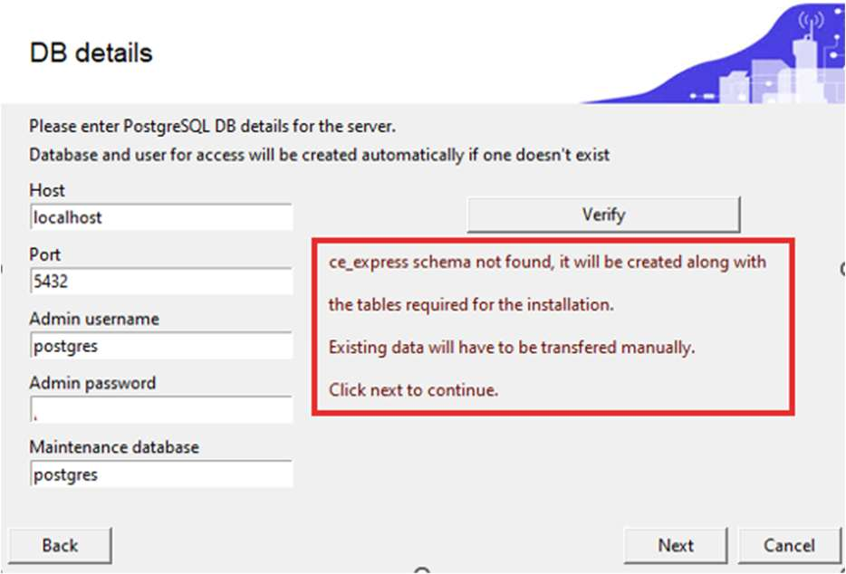

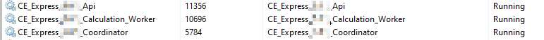
such a case, the tables will be copied with the postfix "_date" to avoid conflicts:
 Click “Next”. Installation will continue till finish:
2.3.5 Check Installation and the licence of the CE Express software.
Check windows services and there should be 3 CE Express services running:
Confidential Cellular Expert, 2026 Page | 14

---

Cellular Expert Express Administrator Guide 7.2
If windows services are running, open web browser and start CE Express administrator tool:
http://CE_express_hostname/ceexpressfrontenfolder/?admin=true
(Example: http://localhost/ceexp/?admin=true)
 Obtain the licence request file by clicking on the designated section.
 Send the obtained file to Cellular Expert support.
 Once you receive the license file, apply it by either clicking on the "Import License File" section or

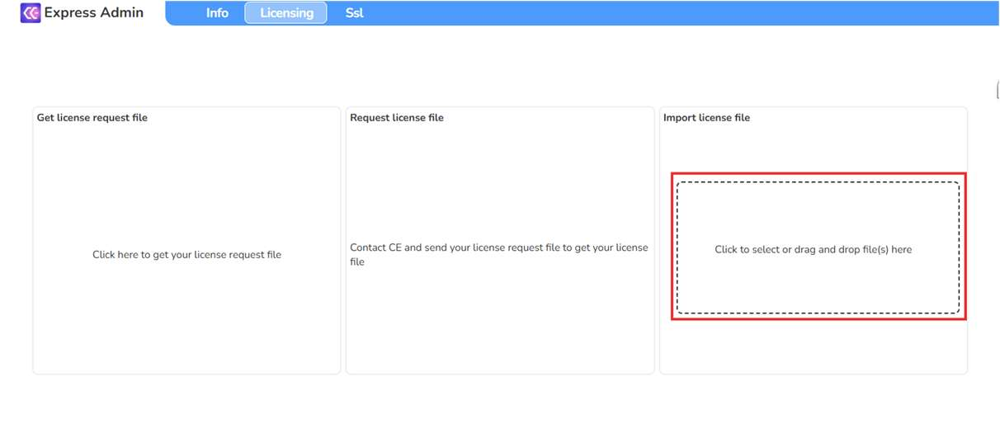

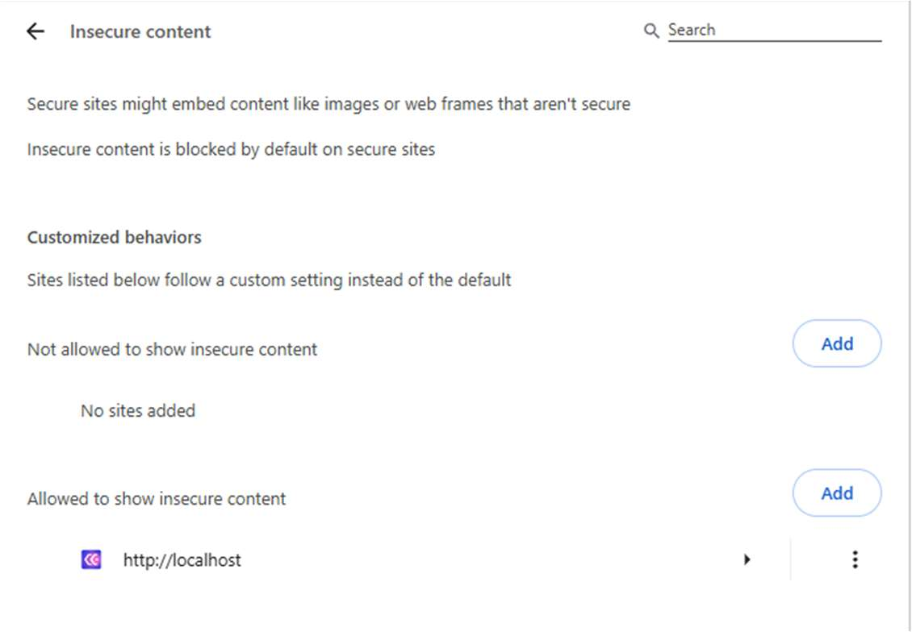
by dragging and dropping the file into that section:
Note: The browser could always redirect to https instead of using http. The administrator needs to include
the URL of CE Express to the insecure content list. It could be done using the browser’s settings:
 Chrome: chrome://settings/content/insecureContent
 Edge: edge://settings/content/insecureContent
Another way is to enable SSL support on CE Express (see chapter “Enable SSL support (optional)).
Confidential Cellular Expert, 2026 Page | 15

---

Cellular Expert Express Administrator Guide 7.2
2.3.6 Enable SSL support (optional)
To enable SSL support prepare SSL certificate files. Into CE Express could be imported the pfx file
(password required) (Optional: ssl.crt and ssl_pem.key could be imported).
To import SSL files for CE Express open the CE admin tool using URL:
http://CE_express_hostname/ceexpressfrontenfolder/?admin=true
 Open SSL tab:
 Import prepared SSL pfx file using “Import .pfx certificate file” section.
 After importing the SSL certificate, it needs to edit the configuration file located under CE Express
frontend folder as described in section 2.3.2. Example “C:/inetpub/wwwroot/ceexp”
 Open “config.json” file with the text editor and change from “http” to “https” in the parameter
“ceApiUrl”. Example:
From "ceApiUrl": "http://[CE_express_hostname]:6062"
To "ceApiUrl": "https://[CE_express_hostname]:6062"
 Restart Windows services:
The “Coordinator” service must be started the last.
When SSL is enabled use https protocol to access the CE Express application

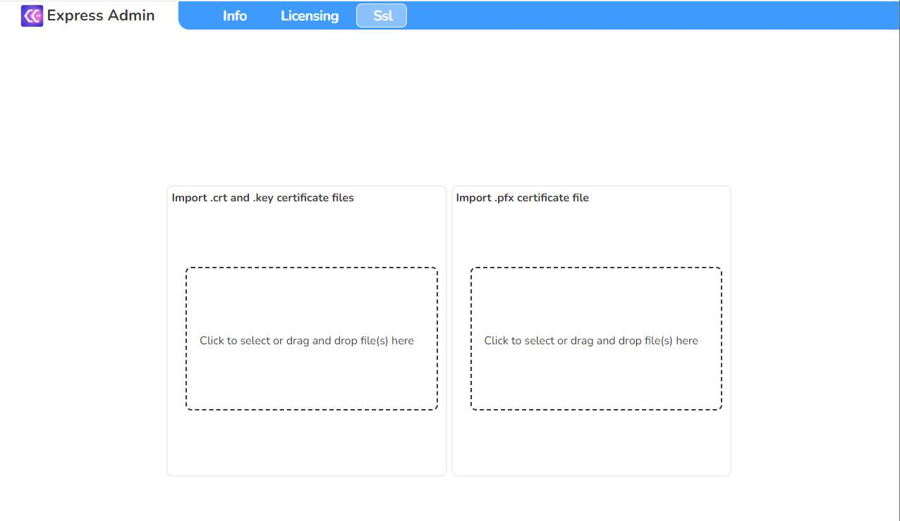

https://CE_express_hostname/ceexpressfrontenfolder (Example: https://localhost/ceexp ).
2.3.7 Configure CE Express to publish objects to the Portal for ArcGIS (optional)
2.3.7.1 Option: Arcgis Server without Image Server
 Publish provided geoprocessing tool "publishTif.sd" using Arcgis Server manager. The published
Confidential Cellular Expert, 2026 Page | 16

---

Cellular Expert Express Administrator Guide 7.2
GP tool example view:
 Find and copy the GP tool's Rest URL:
 Edit C:\Program Files\Cellular Expert\Express\config.json and change the three (3) parameters
required for publishing:
"PUBLISH_GEOPROCESSOR": "https://<CE Server hostname>/server/rest/services/publishTif/GPServer",
"PUBLISH_USERNAME": "USERNAME",
"PUBLISH_PASSWORD": "PASSWORD"
USERNAME and PASSWORD are Portal’s for Arcgis user's username and password. This user will be
used to publish, and the published objects (raster or features) will be visible under this user's content.

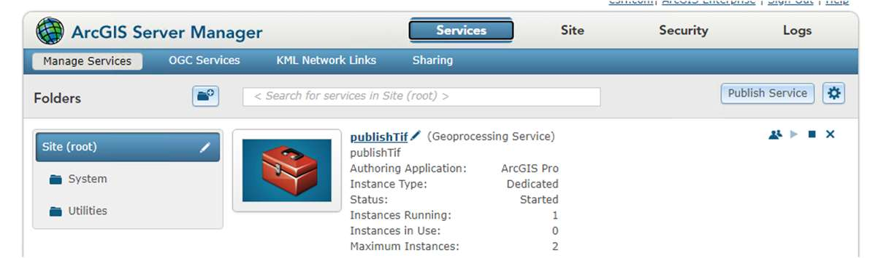

 Restart Windows services. The “Coordinator” service must be started last.
2.3.7.2 Option: Arcgis Server with Image Server
 Edit C:\Program Files\Cellular Expert\Express\config.json and change the two (2) parameters
required for publishing:
"PUBLISH_GEOPROCESSOR": "",
"PUBLISH_USERNAME": "USERNAME",
"PUBLISH_PASSWORD": "PASSWORD"
USERNAME and PASSWORD are Portal’s for Arcgis user's username and password. This user will be
used to publish, and the published objects (raster or features) will be visible under this user's content.
 Restart Windows CE services. The “Coordinator” service must be started last.
Confidential Cellular Expert, 2026 Page | 17

---

Cellular Expert Express Administrator Guide 7.2
2.3.8 Configure CE Express to send notifications (optional)
You can enable email notifications to alert recipients when changes occur in the database. This feature is

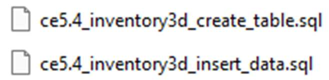
managed through the configuration file.
 Open the configuration file C:\Program Files\Cellular Expert\Express\config.json
 Locate and edit the following parameters to match your email service or SMTP server settings:
"EMAIL_SERVICE_PROVIDER": "",
"EMAIL_USERNAME": "",
"EMAIL_PASSWORD": "",
"SMTP_HOST": "",
"SMTP_PORT": "",
"SMTP_SECURE": false,
"SMTP_TLS_CIPHERS": "SSLv3",
"SMTP_TLS_REJECT_UNAUTHORIZED": false
Leave "EMAIL_SERVICE_PROVIDER" empty if you are configuring notifications using a custom SMTP
server.
Ensure the remaining SMTP parameters (SMTP_HOST, SMTP_PORT, etc.) are correctly filled in
according to your email provider’s requirements.
 Restart Windows CE services. The “Coordinator” service must be started last.
2.3.9 Creating the Inventory3D Database structure and insert initial data
1. Unzip ceexp_db_scripts.zip file somewhere on computer
2. Start the PostgreSQL pgAdmin app (or another PostgreSQL database management tool)
3. Connect as CE Express admin user provided during CE Express setup (section 2.3.4).
4. Open the DB schema (ce_express) prepared during CE Express setup (section 2.3.4).
5. Click the “Open File” button and select “ce7.2_inventory3d_create_table.sql”
6. Execute script and create Inventory3D tables
7. Click the “Open File” button and select “ce7.2_inventory3d_insert_data.sql”
8. Execute script to insert Inventory3D initial data
2.3.10 Installing Inventory3D webapplication package
To install Inventory3D express webapplication copy the two folders from the provided zip file
(ceexp_db.zip) to C:\inetpub\wwwroot if IIS will be used and a PHP server has been configured (or under
C:\wampXX\\www for Apache server from WAMP package). If IIS will be used, grant write permissions for
Confidential Cellular Expert, 2026 Page | 18

---

Cellular Expert Express Administrator Guide 7.2
“IIS_IUSRS” user to the “ceexp_db” folder.
Example of folders structure:
The folder “ceexp_server” is required for Inventory3D logics.
The folder “ceexp_db” is the Inventory3D folder described below.
The “ceexp” folder is already created under C:\inetpub\wwwroot during CE Express setup (section

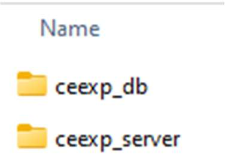

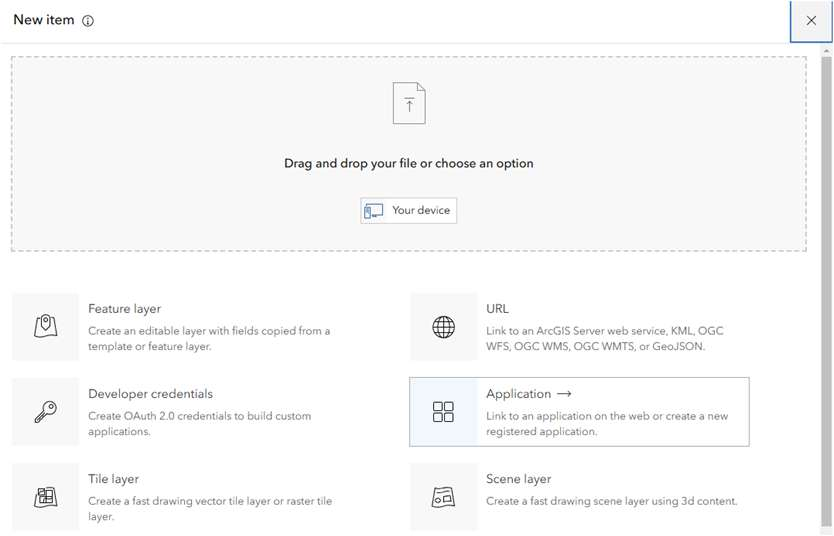

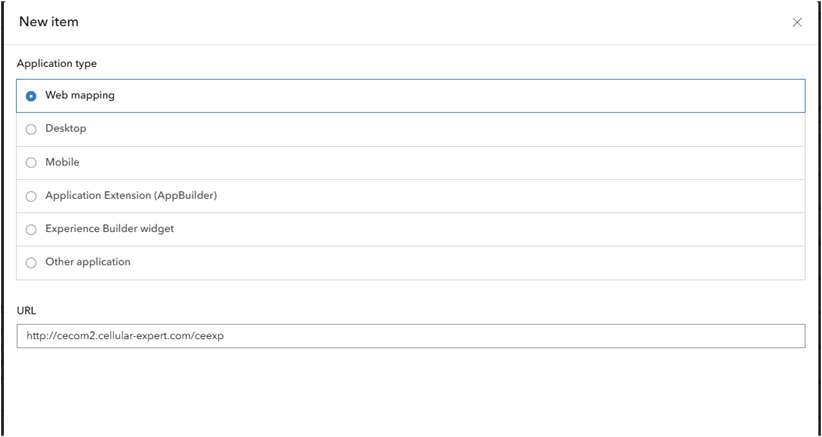
2.3.3).
2.3.11 Webapplication in Portal for ArcGIS
It is a required webapplication in Portal for ArcGIS to use ArcGIS login in the Inventory3D.
 Login to Portal for ArcGIS and go to “Content”
 New Item > Application
 Select “Web mapping”
 URL: enter the CE Express application URL and click “Next”:
 Name the new application and describe it. Click “Save”:
Confidential Cellular Expert, 2026 Page | 19

---

Cellular Expert Express Administrator Guide 7.2
 Choose “Settings”:
 Go to the “Credentials” and click “Register application”:
 Add CE Express Inventory3D URL into to section “Redirect URLs” and click “Register”:
 The “Client ID” is required for the Inventory3D configuration.
2.3.12 CE Inventory3D folder structure
Example of “ceexp_db” folder structure:
Confidential Cellular Expert, 2026 Page | 20

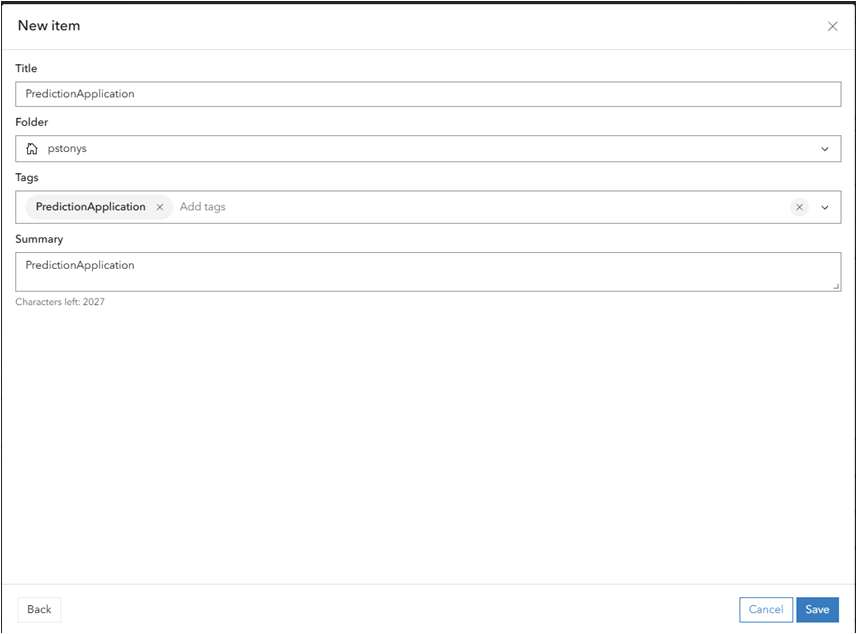

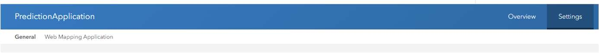

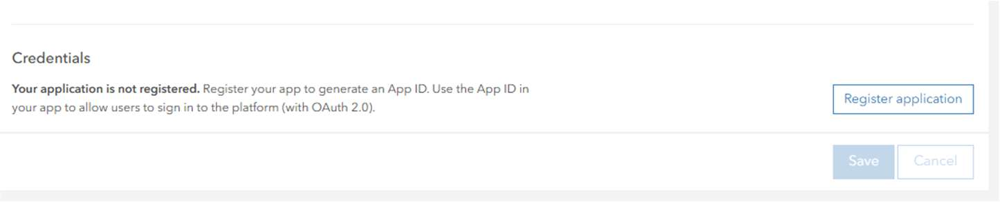

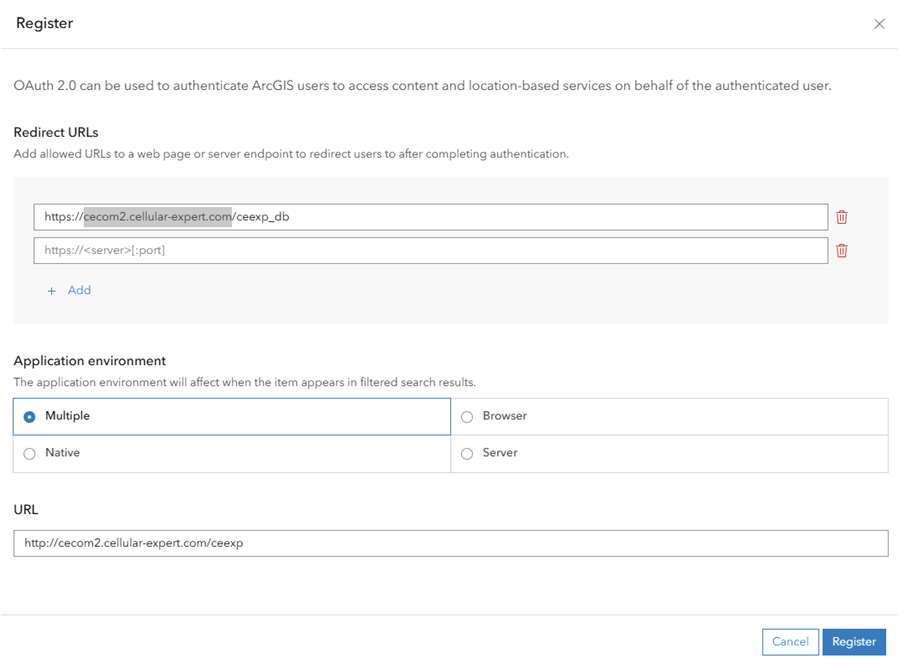

---

Cellular Expert Express Administrator Guide 7.2
The main folders and files are:
Folders “images” or “data” – for attachments and images taken from mobile devices
Folder “deleted” – for files that were attached to objects and have been removed by a user with the Remove
Record Tool
Folder “logs” – here log files will be created for debugging, and debugging will be enabled in the conf.inc

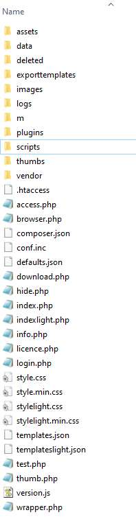
file
Folder “exporttemplates” – for configuration files for creating
Folder “plugins” – for CE Inventory3D plugins like “Map”
Folder “scripts” – for scripts that can be run manually by the administrator
Folder “temp” – temporary folder that can be cleaned periodically
Confidential Cellular Expert, 2026 Page | 21

---

Cellular Expert Express Administrator Guide 7.2
Folder “thumbs” – for the thumb image files
File “conf.inc “ – configuration file. This file is very important and contains the credentials for the connection

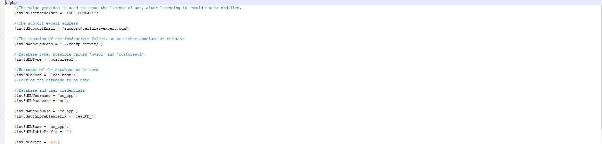

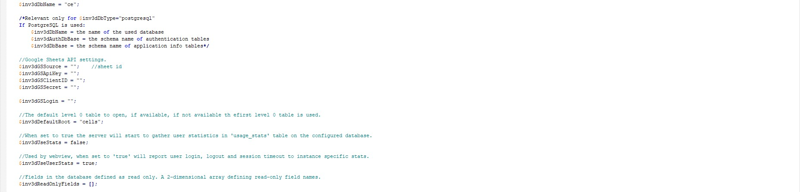

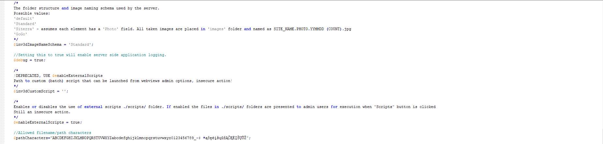

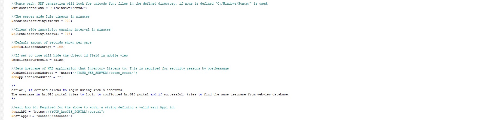

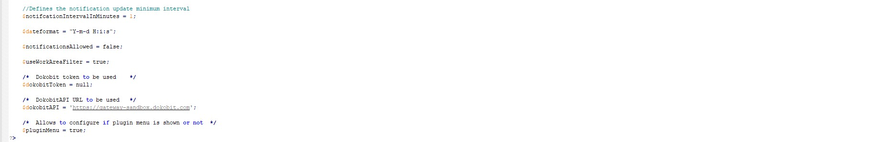
to the database as well as other important information related to the database. The credentials can be
changed according to the database server information.
Confidential Cellular Expert, 2026 Page | 22

---

Cellular Expert Express Administrator Guide 7.2
The main parameters to change for the other installations are:
$inv3dLicenceHolder = "/*YOUR Company Name*/";
$inv3dWebViewPath = "../ceexp_server/"; /*The location of the Inventory3D server part*/
$inv3dDbUsername = "ce_express"; /* DB username provided during Setup (section 2.3.3)*/
$inv3dDbPassword = "ce"; /* password*/
$inv3dAuthDbBase = "ce_express"; /* the schema name of authentication tables*/
$inv3dAuthDbTablePrefix = "ceauth_";
$inv3dDbBase = "ce_express"; /* the schema name of application info tables*/
$inv3dDbTablePrefix = "";
$inv3dDbPort = 5432; /*PostgreSQL port*/
$inv3dDbName = "ce"; /* the name of the used database */
$wabApplicationAddress = "https://{your_web_server_url}/ceexp"; /*URL to CE Express
frontend*/
$esriAPI = "https://{ArcGIS Portal}/portal";/*URL to ArcGIS portal*/
$esriAppID = "[id]"; /*Client id of web application created on the ArcGIS Portal used for
authentication*/ (Section 2.3.11)
Change database credentials as required to connect to the database. For the Demo application, everything
has already been prepared.
The parameter for external API calls configuration:
$extrenalAPIConf
The file conf_template.inc has examples of possible configurations.
File “defaults.json” – set default values for different fields. Changes in this file can be entered with the
webapp feature “Set defaults…” described below. The file cannot be empty and must contain the characters
“[]”.

## 2.4 Information about CE Express Inventory3D database

Some information about the requirements.
2.4.1 Tables structure
Simplified database schema for the CE Inventory3D system:
Confidential Cellular Expert, 2026 Page | 23

---

Cellular Expert Express Administrator Guide 7.2
Confidential Cellular Expert, 2026 Page | 24

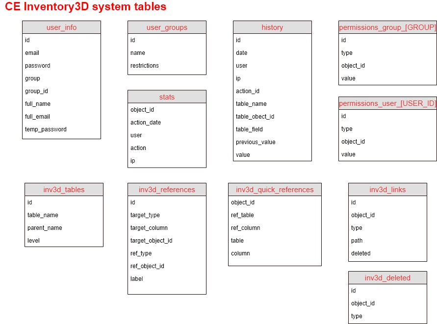

---

Cellular Expert Express Administrator Guide 7.2
2.4.1.1 Table “inv3d_tables”
The table “inv3d_tables” is required to describe all the tables used in Cellular Expert Express Inventory3D.
All correctly described tables will appear in the application. Table “inv3d_tables” has 3 columns:
id – table identifier
table_name – the exact name of the table as described in the DB schema
parent_name – exact name of the parent table
In this field could be written system keywords:
inv3d_hidden – means that the table is hidden for all users and visible only for the administrator
inv3d_system – means that the admin can access the table from “System_tables” (see section 4.7)
level – the level in which the table should appear in the application. The table with level 0 will appear in the
first level. The table with level 1 will appear in the second level records will be child records of a table from

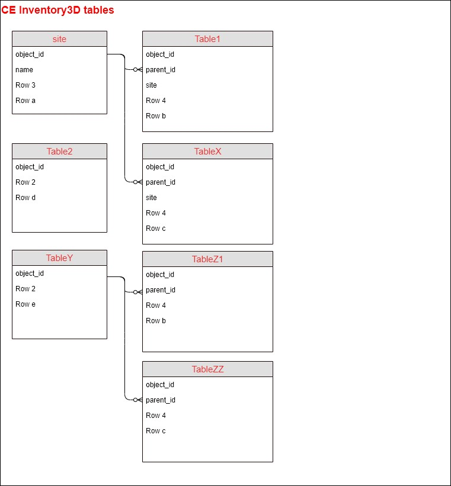
level 0 and described in the column “parent_name”.
Example for a database schema:
id table_name parent_name level
Confidential Cellular Expert, 2026 Page | 25

---

Cellular Expert Express Administrator Guide 7.2
| 1 | site |  | 0 |
|---|---|---|---|
| 2 | Table1 | site | 1 |
| 3 | TableX | site | 1 |
| 4 | Table2 |  | 0 |
| 5 | TableY |  | 0 |
| 6 | TableZ1 | TableY | 1 |
| 7 | TableZZ | TableY | 1 |
2.4.1.2 Table “inv3d_references”
The table “inv3d_references” stores the information about the references between records. This feature is
described in the User Guide section 5.2.3
2.4.1.3 Table “inv3d_quick_references”
Quick references are defined by the administrator and allow users to open a reference object in an own
browser tab. The administrator describes the Quick references in the table "inv3d_quick_references" using
the webapplication (or directly in the database).
This table comprises the information-rules about the references between two tables and columns. The
Quick reference feature is described in the User Guide section 6.5
2.4.1.4 Table “inv3d_links”
This table is required for registering the attachment paths to the database. The attachments are uploaded
to the files system, but the attachments meta data are stored in this table for the application performance.
2.4.1.5 Table “site”
The table “site” stores information about sites (locations). Important columns are:
object_id – unique site identifier type Integer. It should be set as Primary key and Autoincrement if the
webapp will be used to create new records.
name – site’s name
All other attributes (rows), and as many as required, will be visible in the Inventory3D webapp.
2.4.1.6 Tables TABLE1 and TABLEX
Those tables are “child” tables of the “site” table (see DB schema), and they are visible only when the user
opens a given site. Important columns are:
object_id – unique object identifier type Integer. It should be set as Primary Key and Autoincrement if the
Confidential Cellular Expert, 2026 Page | 26

---

Cellular Expert Express Administrator Guide 7.2
webapp will be used to create new records
parent_id – site’s object_id
site – site’s name
date – date information when checking an object. If the table does not have a “date” column, the “check
object” feature will not be active. The type of this attribute is Char (Varchar).
All other attributes (columns), and as many as required, will be visible in the webapp.
2.4.1.7 Table TABLE2
This table could be a separate table, and it is visible on the “site” level (level 0). There could be several
such tables described in the database. Important columns are:
object_id – unique object identifier. If such a column does not exist, the data cannot be edited.
date – if a table has a column “date”, the table has a “check” option for all records in that table.
All other attributes (columns), and as many as required, will be visible in the webapp.
2.4.1.8 Tables TABLEY and TABLEZ
Those tables are separate tables from the “site” table. TABLEY is the first level (level 0) table and TABLEZ
is the second level (level 1) table. Important columns are:
object_id – unique object identifier. Critical column enabling to edit the data in the webapp.
date – if such a column exists in a table, the Inventory3D application has a “check” option for the respective
table.
All other attributes (columns), and as many as required, will be visible in the webapp.
Note that each Inventory3D table may have special attributes:
photo_name – photo identifier. The photo attachment names are filled in automatically.
2.4.1.9 Tables user_Info and user_Groups
Those two tables are required to administer users, user groups and put restrictions for the users by the
administrator. The usage of those tables is described in the section “User management”.
2.4.1.10 Tables permissions_user USER_ID and permissions_group GROUP
Those two tables are required to administer users and user groups. Both tables are created automatically,
but the administrator can add restrictions manually. The use of those tables will be described in the
upcoming CE Inventory3D release.
2.4.1.11 Table history
The table history is required to register the users` actions with the data. Administrators can then check who
performed changes and prepare reports about the database usage.
2.4.1.12 Table stats
The table “stats” is needed to register all user logins, logouts, or session expirations. Admins can then
Confidential Cellular Expert, 2026 Page | 27

---

Cellular Expert Express Administrator Guide 7.2
follow who has used the webapplication.
2.4.1.13 Table deleted
The table deleted is used to keep information about removed records. The administrator can “restore”
removed records simply by deleting a record from this table. Alternatively, the administrator can delete
removed records using SQL scripts.
2.4.2 Register licence for the CE Inventory3D
Inventory3D webview application will be accessible:
http(s):// {your_web_server_url}/ceexp_db
The first access of the application will show that the application is unlicenced:
To obtain a licence use such php script:
http(s)://{your_web_server_url}/ceexp_db/licence.php
It will generate a request key. Copy the provided information with the request key and send it to Cellular

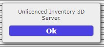

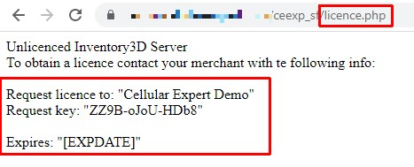
Expert (support@cellular-expert.com) to get a licence key:
After receiving the licence key, use the following script:
http(s)://{your_web_server_url}/ceexp_db/licence.php?serial=[LICENCE_KEY]
to licence the application
2.4.3 Testing the CE Inventory3D webview installation
To login to the application use:
http(s):// {your_web_server_url}/ceexp_db
The user will receive the login window:
Confidential Cellular Expert, 2026 Page | 28

---

Cellular Expert Express Administrator Guide 7.2
Use the Login as ArcGIS button to login with an ArcGIS Enterprise account (section 2.3.3). It will allow to
access the Network [Data Management](#kw:31-data-management-tools:inventory3d-user-guide) view for database management and the [Map view](#kw:switching-between-views:ce-express-login) for analysis,
calculations, etc.
All ArcGIS users should be created and administrated on the Portal for ArcGIS.
Use Login with Express account to login with a Cellular Expert Express account. It will allow to access only
the Network [Data Management](#kw:31-data-management-tools:inventory3d-user-guide) view. To reach [Map view](#kw:switching-between-views:ce-express-login) you will be able to log in with an ArcGIS Enterprise
account later
By default “Login with Express account’ option is enabled and the user’s “admin” password is set to
“admin_ce”. To change the password or to see the other default users and passwords use the database
management tool (example pgadmin) and check in the “ceauth_user_info” table.
3. Prepare the application with own data

## 3.1 Prepare data files

In this chapter, you will find a description of the geographical file types that are used in Cellular Expert. Use

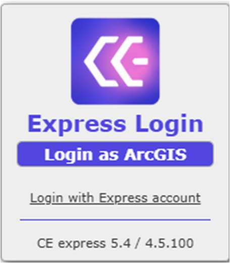

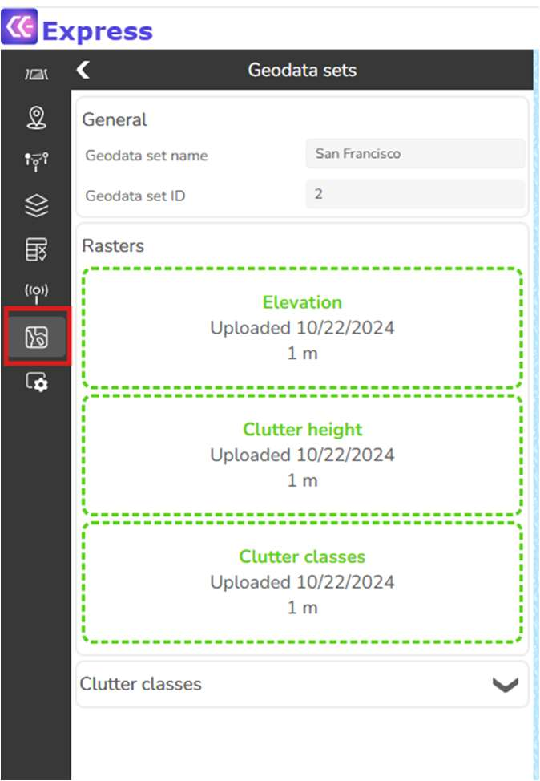
the “Geodata sets” tool to upload all the required data to the CE Express:
Confidential Cellular Expert, 2026 Page | 29

---

Cellular Expert Express Administrator Guide 7.2
How to prepare geodata tif files is described below in this CE Express Administrator Guide.
3.1.1 General information
The CE tools make use of three distinct GIS data layers to obtain high precision modelling of radio wave
propagation losses:
1. Digital Terrain Model (DTM), also known as Digital Elevation Model (DEM), which describes Earth
surface, i.e., path [terrain profile](#kw:reading-the-profile-graph:ce-express-profile) in terms of ground elevation above uniform sea level.
2. [Clutter](#kw:clutter-classification-values:ce-express-geodata) height layer, delineating buildings and other such objects above Earth surface that may
be considered to be principal impediments for radio wave propagation.
3. [Clutter](#kw:clutter-classification-values:ce-express-geodata) class layer, each pixel defines the ID of the [clutter](#kw:clutter-classification-values:ce-express-geodata) class, which the area belongs to. Usually
derived from land use data. If building heights are included in the clutter height raster, the clutter
classes raster must have building outlines separated into their own class ID.
These types of GIS data describing the radio wave propagation path are illustrated in Fig. 1, which shows
the key propagation effects with corresponding types of path loss components: Free Space Loss (FSL),
losses due to diffraction over terrain protrusions and obstacles, and losses due to clutter penetration.
Sometimes users may have the Digital Surface Model (DSM) elevation data to represent the path profile.
The DSM is usually obtained by air-based scanning of surface of the Earth that cannot distinguish between
the actual terrain level and the elevation due to buildings, forests, or other types of ground cover. The well

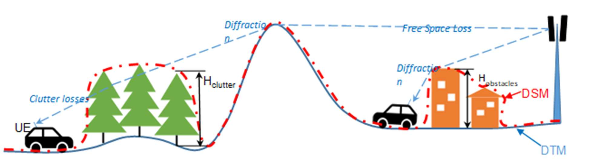
known and widely available sets of global DSM data include the USGS SRTM-1 and SRTM-3 as well as
ASTER. Although a single path profile layer with DSM data could be used to model radio wave propagation,
the path loss model will interpret it as a pure DTM, i.e., as if representing the homogeneous (and
impenetrable for radio waves) Earth surface. Therefore, the results of calculated path losses, and
accordingly the forecasted network coverage signal levels, will not be as precise and nuanced as if using
distinct types of DTM and clutter layers.
Another important factor defining the precision of path loss modelling is the resolution of GIS data used to
represent DTM and clutter, or the DSM. For instance, based on our practical experience with available GIS
data sets and the modern computational capabilities of our tools, CE recommends using the following
resolution of path [profiling](#kw:42-step-2-profiling-pointtopoint-analysis:ce-express-tr-los) data for modelling coverage of 4G/5G cellular networks:
 Rural areas: preferably 10 m, and at most 25 m,
 Urban areas: preferably 1 m, and at most 5 m.
The comparative precision of modelling signal coverage in dense urban conditions when using respectively
25 m resolution ASTER DSM data and 1 m resolution Maxar DTM & Buildings data is shown in Fig. 2.
Confidential Cellular Expert, 2026 Page | 30

---

Cellular Expert Express Administrator Guide 7.2
To summarize, it is of critical importance to gather, configure and use suitable types of path [profiling](#kw:42-step-2-profiling-pointtopoint-analysis:ce-express-tr-los) data
with appropriate resolution to obtain reliable results of network coverage simulations. Only then the user
may be confident in simulated results of network coverage in terms of calculated received signal levels and
other derivative operational parameters.
All three layers could be prepared using ArcGIS Pro tools: Projection, Copy Raster and Raster Calculator.
3.1.2 Geographic data
Supported geographical data types:
Only GeoTIFF is supported.
Mandatory geographical data:
Elevation, or Digital Terrain Model (DTM) grid.
Uploaded rasters have the following requirements:
 Must be in [projected coordinate](#kw:what-is-a-projected-[crs](#kw:check-crs:ce-express-geodata):ce-express-geodata) system
 Coordinate system units must be meters
 All rasters must have the same coordinate system
 Raster resolution in X and Y axis must match
3.1.2.1 Elevation, or Digital Terrain Model (DTM) Grid (Mandatory)
The Digital Terrain Model (DTM), also known as Digital Elevation Model (DEM), represents the Earth’s
ground level above sea level. Each raster pixel has its height value.
A sample DTM raster is presented below. Each pixel represents 5 square meters with its height value. In
reality, within a one-pixel area, the height is not the same everywhere. Thus, the pixel’s height value is the

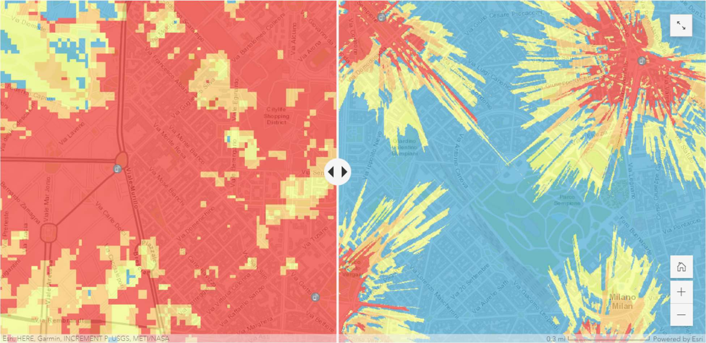
height in its center or the maximum. The smaller the pixels, the more accurate is the grid - but also more
data to calculate.
Confidential Cellular Expert, 2026 Page | 31

---

Cellular Expert Express Administrator Guide 7.2
Prepare DTM raster
3.1.2.1.1.1 Projection
The raster must use a [Projected Coordinate](#kw:what-is-a-projected-[crs](#kw:check-crs:ce-express-geodata):ce-express-geodata) System. To check the coordinate system of your raster, use
the Properties function in ArcGIS Pro. Add the raster to your project, right-click on it, and select Properties.

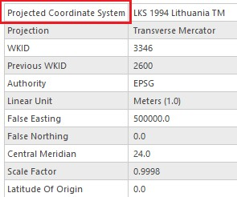
Then, go to the Source tab > Spatial Reference and check the Coordinate System type parameter to confirm
it is in a [Projected Coordinate](#kw:what-is-a-projected-[crs](#kw:check-crs:ce-express-geodata):ce-express-geodata) System.
If your raster is in a Geographic Coordinate System or needs a different projection, use the Geoprocessing
> [Project Raster](#kw:33-project-raster:ce-express-tr-geodata) tool to update it.
Confidential Cellular Expert, 2026 Page | 32

---

Cellular Expert Express Administrator Guide 7.2
In the Output Coordinate System, specify a new coordinate system. It is recommended to use a [UTM](#kw:what-is-a-projected-crs:ce-express-geodata)

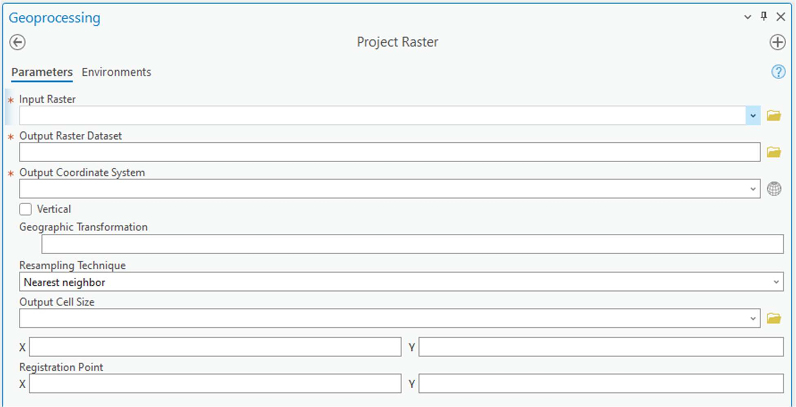
coordinate system under the WGS 1984 projection.
Confidential Cellular Expert, 2026 Page | 33

---

Cellular Expert Express Administrator Guide 7.2
You can find the appropriate [UTM](#kw:what-is-a-projected-crs:ce-express-geodata) zone for your area here:
https://www.arcgis.com/apps/mapviewer/index.html?layers=b294795270aa4fb3bd25286bf09edc51
3.1.2.2 [Clutter classes](#kw:clutter-classification-values:ce-express-geodata) grid
This raster type provides information about land use. The naming and classification of land use types may

vary. An example is the Sentinel-2 Land Cover dataset from the Living Atlas: Living Atlas Sentinel-2 Land
Cover
Confidential Cellular Expert, 2026 Page | 34

---

Cellular Expert Express Administrator Guide 7.2
This data is freely available worldwide.
Prepare [Clutter Classes](#kw:clutter-classification-values:ce-express-geodata) raster
3.1.2.2.1.1 Projection
It must have the same coordinate system as your elevation.tif raster. If your raster has different coordinate

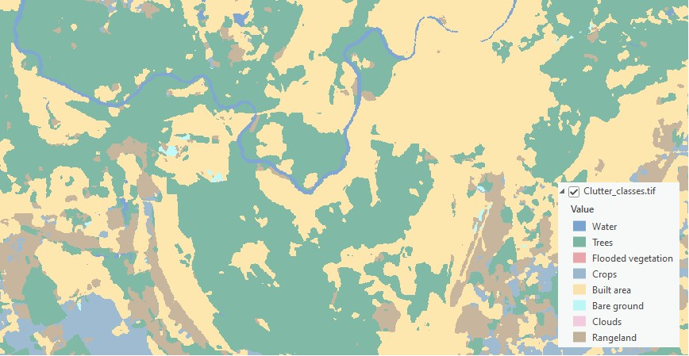

system, then use the Geoprocessing tool → [Project Raster](#kw:33-project-raster:ce-express-tr-geodata) to fix it.
Confidential Cellular Expert, 2026 Page | 35

---

Cellular Expert Express Administrator Guide 7.2
In the Output Coordinate System you would need to define the same coordinate system as your elevation.tif

raster. Click on Select Coordinate System button.
And choose the same coordinate system as your elevation.tif.
3.1.2.3 Clutter height
Represents actual clutter heights, which override the default heights specified in the Clutter table. The
clutter heights raster requires the accompanying [clutter classes](#kw:clutter-classification-values:ce-express-geodata) raster and cannot be used independently.
Confidential Cellular Expert, 2026 Page | 36

---

Cellular Expert Express Administrator Guide 7.2
A clutter height raster can be derived from a Digital Surface Model (DSM) raster and a Digital Terrain Model

(DTM) raster using the ArcGIS Raster Calculator tool. To access this tool, open Geoprocessing tools and
navigate to Spatial Analyst > Map Algebra > Raster Calculator. Use the following formula:
DSM – DTM
Confidential Cellular Expert, 2026 Page | 37

---

Cellular Expert Express Administrator Guide 7.2
The calculation output will be the difference between the DSM and DTM grids, representing the clutter
heights.
Prepare Clutter Height raster
3.1.2.3.1.1 Projection
It must have the same coordinate system as your elevation.tif raster. If your raster has different coordinate

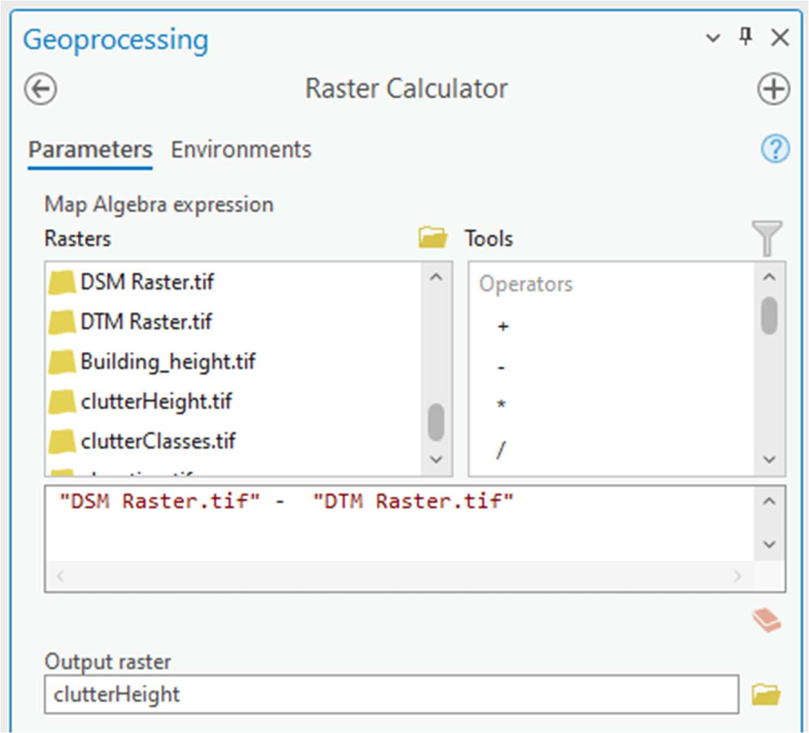
system, then use the Geoprocessing tool → Project Raster to fix it.
Confidential Cellular Expert, 2026 Page | 38

---

Cellular Expert Express Administrator Guide 7.2
In the Output Coordinate System you would need to define the same coordinate system as your elevation.tif

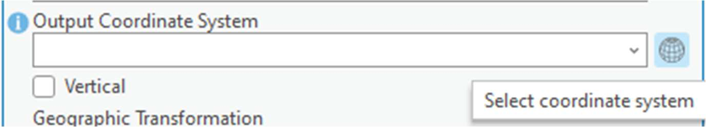
raster. Click on Select Coordinate System button.
And choose the same coordinate system as your elevation.tif.
Confidential Cellular Expert, 2026 Page | 39

---

Cellular Expert Express Administrator Guide 7.2
3.1.3 Antennas
The [Antenna pattern](#kw:managing-the-antenna-library:ce-express-antenna) files in .txt format should be prepared and could be imported into the CE database
using the CE Express antenna import tool. The CE Express application uses the Planet [antenna pattern](#kw:managing-the-antenna-library:ce-express-antenna)

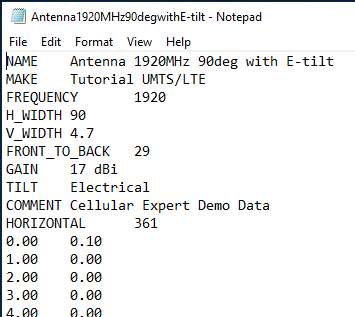
format. This format consists of a header, horizontal and vertical records. Example:
After import of the antenna, the antenna id could be used in the cells data table.
Confidential Cellular Expert, 2026 Page | 40

---

Cellular Expert Express Administrator Guide 7.2

## 3.2 Create new workspace in CE Express

To create a new workspace using start CE Express using URL

http://CE_express_hostname/ceexpressfrontenfolder
(Example: http://localhost/ceexp )
 Login as user with administrator rights (user provided during setup)
 In the workspace list click “+ new Workspace” button:
 In the window describe the workspace:
Workspace name: must be the name of a newly created folder.
Geodata folder path: must be the physical path of the newly created folder.
Coordinate system [EPSG](#kw:what-is-a-projected-crs:ce-express-geodata): enter coordinate system’s code. 4326 is [WGS84](#kw:what-is-a-projected-crs:ce-express-geodata).
Extent: describe the extent of the workspace.
Calculations: enable or disable parameters if they are not used.
Extra layers: add additional layers form the other sources to be visualized in this new workspace.
For the administrators the new workspace will be visible after creation.
Confidential Cellular Expert, 2026 Page | 41

---

Cellular Expert Express Administrator Guide 7.2
Antennas or cells for the new workspace could be loaded using CE Express environment and tools.
4. CE Inventory3D webapplication functions for administrators

## 4.1 Set defaults

Columns can be designed in a way that their record contents do not have to be entered by hand but are
chosen from a list of defaults, eg active/inactive or planned/active/closed. To do so, click on a column

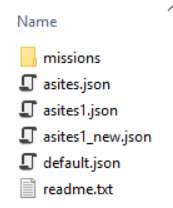

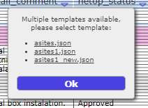
header, and select “Set defaults” from the dropdown menu. A new window opens with the currently active
default values. Enter at least 2 defaults and click OK.

## 4.2 Generate PDF reports

Prior to using the PDF report feature, the administrator has to prepare a template json file. An example
“default.json” file and a “readme” file with explanation can be found in the folder
“ceexp_db/exporttemplates”. All new templates must be stored there. The name of the template file must
include the table name from where the user will run the operation “Generate report as PDF”.
Example:
site.json
site_1.json
site_new.json
All three template files are prepared for the table “site”:
After the selection of the template, a dialog will open:
Confidential Cellular Expert, 2026 Page | 42

---

Cellular Expert Express Administrator Guide 7.2
Click “here” to open a new window with the PDF report.
The report configuration including the text with the header, description and/or signature field can be
configured by the administrator in the template json file.
If there are errors in the template json file and the json syntax is invalid, the webapp application will inform

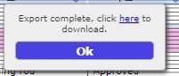

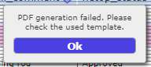

the user:

## 4.3 Run script

It is possible to run a script on the server and load updated data to the tables. The “Run Script” tool could
be configured into “CE API tool”
Important Note (!): This action is not secure. Before performing this action, the script must be tested by an
administrator. Otherwise, it could destroy the database.
The script should be described in the conf.inc configuration file section $enableExternalScripts = true; and
the scripts placed into the “scripts” folder on the server.
The parameter $inv3dCustomScript is deprecated.

## 4.4 Import CSV

Administrators can create a new table (level 0) or add a child table to an existing parent table (level 1) with
the tool “Import CSV”. This tool could be configured into “CE API tool”.
Clicking the “Import CSV” tool opens a new window.
Level 0 table - define the name for the new table (do not use space or other special symbols), and click the
icon to select the CSV file
Level 1 table – define the name for the new table, enter the name of the parent table and select the CSV
file
Confidential Cellular Expert, 2026 Page | 43

---

Cellular Expert Express Administrator Guide 7.2
Requirements:
The data in the CSV file should be separated by the symbol “;”
Level 0 table – CSV file must comprise a column object_id
Level 1 table – CSV file must comprise a column object_id and a column parent_id, with the parent_id value
equal to the object_id of the parent table
If it is required to upload data to an existing table, there will be a table menu to choose from:
Partial Import:
The Partial Import feature allows to add records to an already existing table.
If the checkbox "Partial import” is ticked, the imported records will be added to the defined table:
Confidential Cellular Expert, 2026 Page | 44

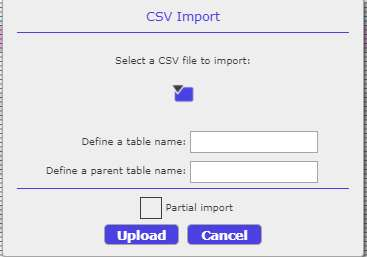

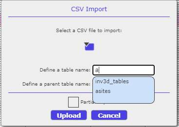

---

Cellular Expert Express Administrator Guide 7.2

## 4.5 History

Admins can monitor the changes made in the database, more precisely, the records that were changed.
Select an object and click on the “History” button from the “Settings” menu:
The log tab will open. It shows when an object’s parameter was changed and what was changed:
If no object is selected and the “History” button is clicked, all actions made within the application are shown:

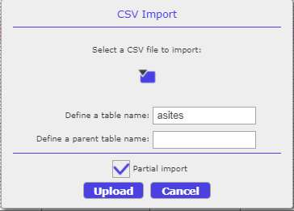

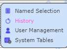

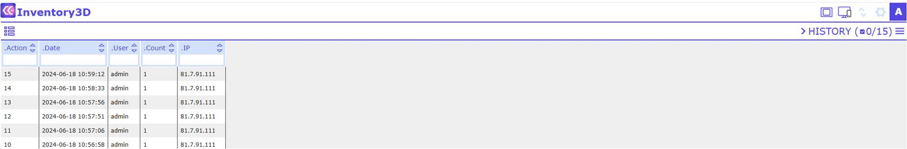

Confidential Cellular Expert, 2026 Page | 45

---

Cellular Expert Express Administrator Guide 7.2

## 4.6 User Management

Administrators may restrict access to tables and attributes for individual users and user groups. The User
Management is opened from the “Settings” menu:
The user list opens in a separate window and comprises the fields User name, e-mail, Name and Group:
To change from user list to groups list (and vice versa) click on the tab:
User groups:
A new user group can be added by clicking on (Note that new users are added only directly in the
database)
For editing user group restrictions, enter the edit mode in the column “Restrictions”. For example, for editing

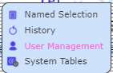

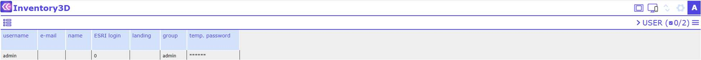

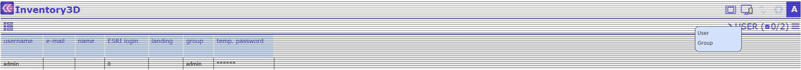

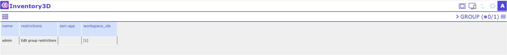

the restrictions of the group “users” hold the ctrl key and right mouse click here:
a) Restricting access of the group “users” to all tables
Determine the visibility/editability of newly added items here:
Confidential Cellular Expert, 2026 Page | 46

---

Cellular Expert Express Administrator Guide 7.2
Select one of the three options from the dropdown menu:
Everybody: New items are visible / editable for everybody
User group: New items are visible / editable for the members of the group “users” (note: the users in a

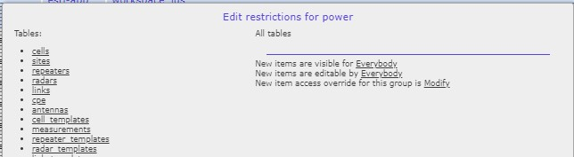

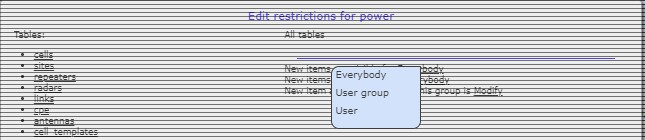
group may change and restrictions to all elements are inherited)
User: New items are visible / editable only for the user who created them
Determine the access of the group “users” here:
Confidential Cellular Expert, 2026 Page | 47

---

Cellular Expert Express Administrator Guide 7.2
Select one of three options from the dropdown menu:
Restrict: Enables restrictions posed by other groups
Read: Enables the members of the group “users” to view items
Modify: Enables the members of the group “users” to view and edit items
Note that the selection “access for this group” may override the per item access rights. For the

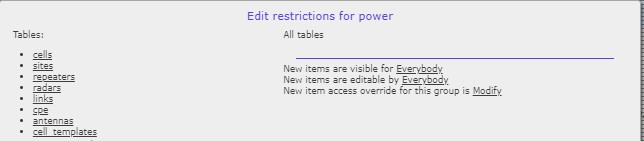

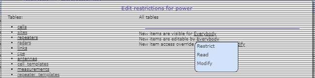
restrictions posed by other groups, this value must be set to “Restrict”.
b) Restricting access of the group “users” to selected tables and attributes
For example, table “checklist”:
Confidential Cellular Expert, 2026 Page | 48

---

Cellular Expert Express Administrator Guide 7.2
Edit restrictions of the group “users” for table “checklist”:
Choose option “entire table” or select the attributes that shall be restricted. Using the eye and lock symbols,

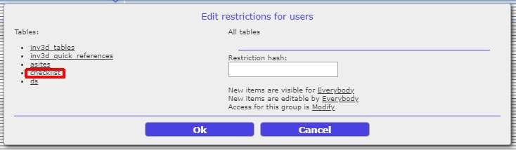

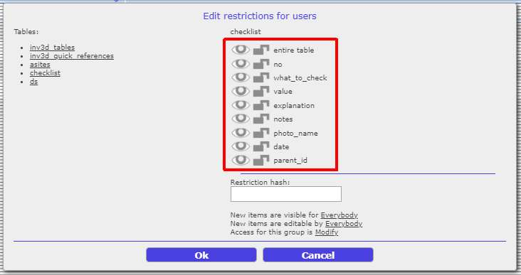

restrictions can be set for visibility and editability:
visible invisible
editable not editable
Restrict the visibility / editability of newly added items:
Confidential Cellular Expert, 2026 Page | 49

---

Cellular Expert Express Administrator Guide 7.2
Choose from dropdown menu:
Confidential Cellular Expert, 2026 Page | 50

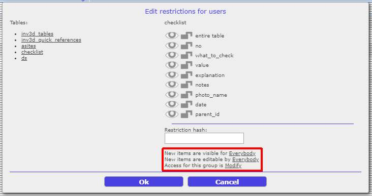

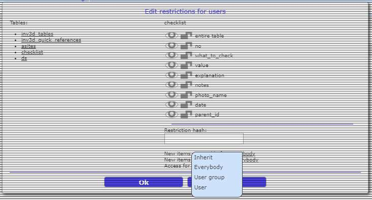

---

Cellular Expert Express Administrator Guide 7.2
Inherit: If restrictions for all tables are defined (see above), those settings are inherited for the selected table
“checklist”.
Everybody: Newly added items to table “checklist” are visible / editable for everybody
User group: Newly added items to table “checklist” are visible / editable for the members of the group “users”
(note: the users in a group may change and restrictions to all elements are inherited)
User: Newly added items to table “checklist” are visible / editable only for the user who created them
Determine the access of the group “users” and choose from the dropdown menu (as above):
Restrict: Enables restrictions posed by other groups
Read: Enables everybody to view the newly items created by the group “users” in table “checklist”
Modify: Enables everybody to view and edit the newly created items by the group “users” in table “checklist”
Note: the selection “access for this group” may override the per item access rights and affects how the
members of this group interact with the selected table. For the restrictions posed by other groups this value
must be set to “Restrict”.
Restrictions are implemented according to the following principles:
Any items created are visible and editable by the owner (even if the owner moved to another group).
Restrictions are applied during the creation of an element.
The selection “New items are visible/editable” will determine if users may view and modify new elements.
A write restriction is not applied during runtime, only after synchronization. Any invalid changes are
discarded during the sync operation.
Users of the 'admin' group have no restrictions
Confidential Cellular Expert, 2026 Page | 51

---

Cellular Expert Express Administrator Guide 7.2

## 4.7 System tables

If tables are marked as System Tables, administrators can edit the tables in the webapp using the tool
“System Tables” from the settings menu:
System Tables can be tables for additional features implemented in the CE Inventory3D:
Via the function System Tables the administrator can add, edit or delete records from predefined tables
directly from the webapplication.

## 4.8 Delete object permanently

Users can remove objects from the database, but only an administrator can delete a removed object
permanently. When a user removes an object, said object is marked as strikethrough. Administrators delete

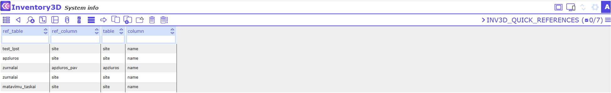

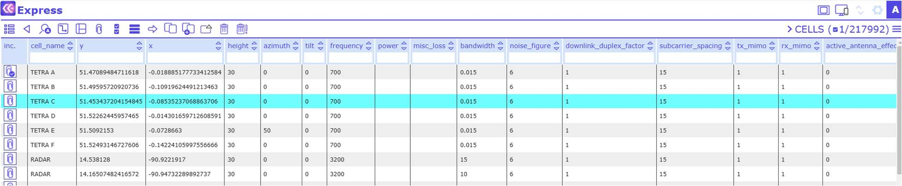

the object permanently by selecting the strikethrough object and clicking :

## 4.9 Restore deleted image

When a user deletes an image, said image is marked as strikethrough on the File Server:
Confidential Cellular Expert, 2026 Page | 52

---

Cellular Expert Express Administrator Guide 7.2
Administrators may restore the image by selecting the strikethrough object and clicking .

## 4.10 Column and table aliasing

Table and column names are displayed as specified in the table requirements. However, sometimes it is
preferred to display a different table name in the application.
Therefore, administrators may add table or column aliases, and those aliases will then be visible in the
application.
For this feature to work it is required that the administrator has configured the System Table inv3d_aliases:

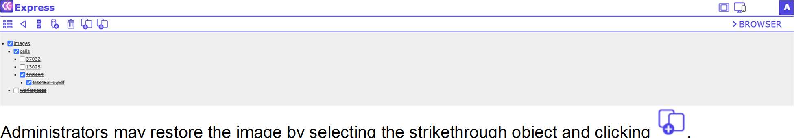

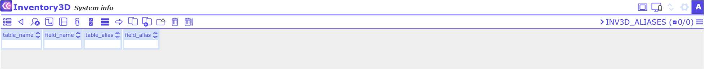

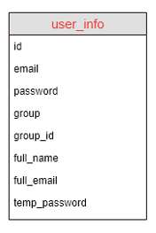
Table inv3d_aliases comprises the columns table_name, field_name, table_alias and field_alias.

## 4.11 Reset password

Users login with their user name and password combination. The user information is stored in the System
Table user_info:
Note: Before using the “Reset Password feature” the server should be configured as mail server and have
the possibility to send Emails.
Confidential Cellular Expert, 2026 Page | 53

---

Cellular Expert Express Administrator Guide 7.2
Once users are registered with their Email address they may change their password for login as CE Express

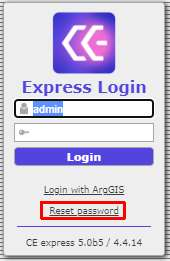

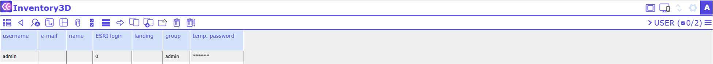
account any time by clicking “Reset password”:
Users can ask an Inventory3D administrator to reset their password. The administrator can set a temporary
password using the CE Inventory3D application and send it to the user:
The user will be asked to change the password during the first login with the temporary password.
Confidential Cellular Expert, 2026 Page | 54

---

Cellular Expert Express Administrator Guide 7.2

---
