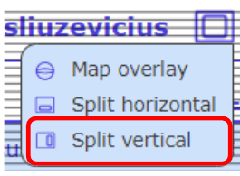
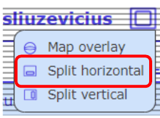

# Map / Table View Modes

In this section, users can adjust the data view. For example, turn on the Map view, Table view, or turn on
both of them, etc.

## 3.5.1 Map view

Map view widget.

Turns on the map view.

## 3.5.2 Display data table full screen

Turns on the Network Data Management view in full screen.

## 3.5.3 Split window vertically

The screen can be divided into Map view and Table view. In the previous options, the tables were placed
on top of the Map view.

 This means that the tables cover the widgets.

Users can adjust the Table and Map view proportions by using the slider function: Move the mouse cursor

on top of the blue line, click on it and change the proportions.

## 3.5.4 Split window horizontally

The screen can be divided into Map view and Table view. In the previous options, the tables were placed
on top of the Map view. This means that the tables cover the widgets

Users can adjust the Table and Map view proportions by using the slider function: Move the mouse cursor
on top of the blue line, click on it and change the proportions.

