# CE Express User Guide v7.3

> **Version:** CE Express v7.2

Cellular Expert Express User Guide 7.3

Table of Contents
1. Introduction 7
2. CE Express application 7

2.1 Log in to the Express Network Data Management application 7

2.2 Open the Express Map view 10

2.3 Log out 11

3. [Map view](#kw:switching-between-views:ce-express-login) 11

3.1 Cellular Expert Express tools 12

3.1.1 Workspaces 12
3.1.2 Features 18
3.1.3 Networks 53
3.1.4 Layers 59
3.1.5 [Prediction history](#kw:44-step-4-prediction-history-and-result-management:ce-express-tr-rf) 73
3.1.6 Antennas 75
3.1.7 Geodata sets 84
3.1.8 Feature templates 87
3.1.9 Prediction [models](#kw:31-models:ce-express-tr-models) 89
3.1.10 Settings 121
3.1.11 Identify 124
3.1.12 Measurement tool 126
3.1.13 Network statistics 130
3.1.14 [Street view](#kw:navigating-street-view:ce-express-street-view) 134
3.1.15 Feature report 135
3.1.16 Profile 142
3.1.17 [Quick RF Prediction](#kw:quick-rf-prediction:ce-express-rf-prediction) 150
3.1.18 RF Prediction 153
3.1.19 3D RF Prediction 168
3.1.20 [Visibility prediction](#kw:43-step-3-visibility-prediction-pointtoarea-analysis:ce-express-tr-los) 170
3.1.21 Antenna [visibility prediction](#kw:43-step-3-visibility-prediction-pointtoarea-analysis:ce-express-tr-los) 171
3.1.22 Minimum receiver height 172
3.1.23 Quick minimum receiver height 174
3.1.24 Radar prediction 176
Confidential ©Cellular Expert, 2026 Page | 2

---

Cellular Expert Express User Guide 7.3
3.1.25 Network availability 177
3.1.26 Model Tuning 179
3.1.27 Optimal placement 184
3.1.28 Utilities 186
3.1.29 Points to DXF 187
3.1.30 EMF 188
3.1.31 Audibility 189
3.1.32 Lux calculation 191
3.1.33 Geoclimatic data 191
3.1.34 [Spectrum masks](#kw:711-spectrum-masks:ce-pro-rlp) 197
3.1.35 [Radios](#kw:710-radios:ce-pro-rlp) 201
3.1.36 Frequency plans 207
3.1.37 Link prediction 211
3.1.38 Automatic frequency planning 220
3.1.39 Link HCM-FS prediction 222
3.1.40 Mesh topology builder 225
3.1.41 Mesh connectivity 227
3.1.42 Quick mesh connectivity 232
3.1.43 Quick HCM-FS prediction 236
3.1.44 HCM requests 239

3.2 Map 254

3.2.1 Search bar 254
3.2.2 Zoom in 255
3.2.3 Zoom out 255
3.2.4 Fine zoom 255
3.2.5 Compass 255
3.2.6 3D/2D Button 255
3.2.7 Legend 256
3.2.8 Home 256
3.2.9 Mini calculation task window 256
3.2.10 Active side switch 256
3.2.11 Quick menu 257

3.3 Data management and visualization section 257

3.4 Calculation section 257

Confidential ©Cellular Expert, 2026 Page | 3

---

Cellular Expert Express User Guide 7.3

3.5 Map/table view modes 258

3.5.1 [Map view](#kw:switching-between-views:ce-express-login) 258
3.5.2 Display data table full screen 259
3.5.3 Split window vertically 259
3.5.4 Split window horizontally 260
4. Database structure 261

4.1 Sites 261

## 4.2 Cells 262

## 4.3 Repeaters 264

4.4 Radars 266

## 4.5 CPE 266

## 4.6 Measurements 267

4.7 Workspace 268

5. CE Express API 268
6. Network [Data Management](#kw:31-data-management-tools:inventory3d-user-guide) 268

6.1 Data management tools 269

6.1.1 Table view 270
6.1.2 Back 270
6.1.3 [Sieve](#kw:74-sieve:none) 270
6.1.4 Multiple table view 270
6.1.5 View attachments 270
6.1.6 Synchronize changes 270
6.1.7 Select/unselect all 271
6.1.8 Show selected/Show all 271
6.1.9 Move record 271
6.1.10 Copy record 271
6.1.11 Add new record 271
6.1.12 CE API 271
6.1.13 Export selected 272
6.1.14 Delete record 272
6.1.15 Remove selected 272

6.2 View options and User administration 272

6.2.1 Import Export 272
Confidential ©Cellular Expert, 2026 Page | 4

---

Cellular Expert Express User Guide 7.3
6.2.2 Settings 273
6.2.3 User name/ Help/ Logout 273

6.3 Table 273

6.4 View Options 273

7. Database organization 274

7.1 Page setup and navigation 274

7.1.1 Organization of single and multiple tables 274
7.1.2 Organization of columns 274
7.1.3 Navigation across tables 275

7.2 Filtering, sorting, editing, and linking database records 276

7.2.1 Set selected 278
7.2.2 Add link 279

7.3 Adding, viewing, downloading and deleting attachments 281

7.4 Sieve 283

7.5 CE API 284

7.6 Import CSV 284

8. Exploring data 286

8.1 Export selected 286

8.2 PDF report 286

8.3 File browser 287

8.4 Quick references 290

8.5 Default editing and manual editing 291

Confidential ©Cellular Expert, 2026 Page | 5

---

Cellular Expert Express User Guide 7.3
About Cellular Expert
Cellular Expert UAB (CE) developed ultra-fast wave
propagation, communication systems deployment planning
and radio/optical visibility calculation software for ESRI’s
ArcGIS mapping environment, which is widely used within
Telecom, Defense, IoT, and other companies and
organizations.
CE’s communication network planning, network asset
management, operational support software and customer-
tailored solutions enhance the intelligence and business
efficiency of more than 170 communication network
companies, regulators, and defense organizations in more
than 50 countries.
Copyright © 2025 UAB CELLULAR EXPERT. All rights
reserved. Cellular Expert and Cellular Expert logo are
registered trademarks, @cellular-expert.com and
www.cellular-expert.com are service marks of UAB
CELLULAR EXPERT in Lithuania and some other countries.
Confidential ©Cellular Expert, 2026 Page | 6

---

Cellular Expert Express User Guide 7.3
1. Introduction
In this User Guide, we introduce the Cellular Expert Express application. Express is the merged Inventory
3D and Cellular Expert Express solution in one product. Inventory 3D is responsible for [data management](#kw:31-data-management-tools:inventory3d-user-guide).
From a desktop, laptop, or tablet computer with internet access, the Webapp connects to a database
located on a server and enables the user to edit database records, sites, and objects, draw diagrams and
locate the assets on an integrated map. Inventory3D integrates data derived from various sources, such as
sensors, Google Sheets, maps, and changes in database entries are synchronized with the server database
content, keeping the database constantly up to date.
Cellular Expert Express is a telecommunication network planning, optimization, and data management
solution built on Esri ArcGIS Enterprise, the most advanced GIS platform. We continually expand the
functionality of Cellular Expert Express, but it is not intended to mimic and match Cellular Expert Desktop
one hundred percent. The idea is to have a simplified task-oriented user interface to gather and share the
data across the company. This means that the solution is dedicated across the organization and to fit
various tasks and workflows.
The Cellular Expert Express application is a versatile tool for inventory planning, design, space, and assets
management. It consists of several building blocks that together provide a customized and tailored solution
for a specific need. Take inventory management: Error-prone databases which contain faulty inventory lists
can be deleterious, especially in large industrial environments. Thus, it is essential that upon inventory
changing databases are regularly updated.
2. CE Express application
To access the Cellular Expert Express web application, type its URL in the address field of a web browser.
You can use any web browser, however, we recommend the up-to-date Google Chrome web browser.
The URL depends on the installation and initial configuration:
1. Web address, as an example: https://<yourdomain>/ceexp
2. An address can be configured by the administrator.
Please note that for security reasons the application uses only HTTPS.

## 2.1 Log in to the Express Network Data Management application

Users can log in with the organization account of ArcGIS Enterprise or Cellular Expert Express and are
identified by a Username and a Password.
Confidential ©Cellular Expert, 2026 Page | 7

---

Cellular Expert Express User Guide 7.3
Use the Login as ArcGIS button to log in with an ArcGIS Enterprise account. It will allow to access the
Network Data Management view for database management and the [Map view](#kw:switching-between-views:ce-express-login) for analysis, calculations,
etc.
Use log in with Express account to login with a Cellular Expert Express account. It will allow to access only

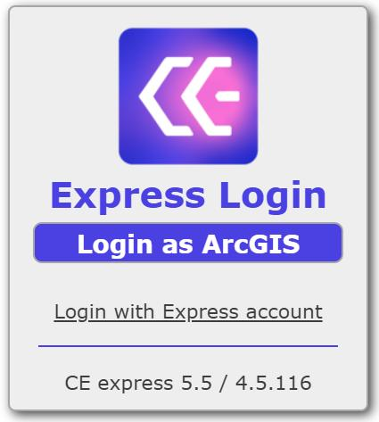

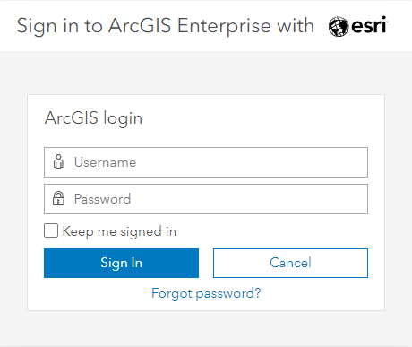
the Network Data Management view. To reach Map view you will be able to log in with an ArcGIS Enterprise
account later.
Confidential ©Cellular Expert, 2026 Page | 8

---

Cellular Expert Express User Guide 7.3
For the option Login with ArcGIS an ArcGIS Portal account is required and the user gains access to the
application map widgets. The second option, Login with Express account, enables only access to view and

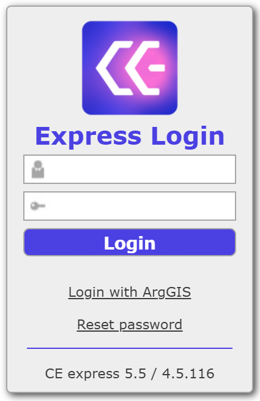

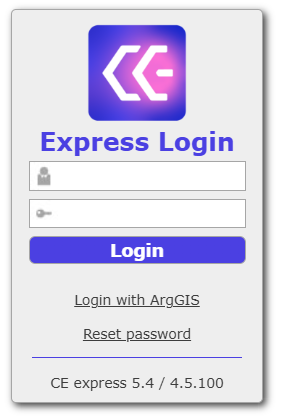
manage tables, data and so on.
Registered users may change their Cellular Expert password any time by clicking Reset password.
Note: before using the Reset Password feature the server should be configured as a mail server and have
Confidential ©Cellular Expert, 2026 Page | 9

---

Cellular Expert Express User Guide 7.3
the possibility to send email. The Cellular Expert Express Network Data Management view opens.
To recover an ArcGIS Enterprise account, use the Forgot password button.

## 2.2 Open the Express Map view

In the Network Data Management view the map and the database are connected. Features, described in

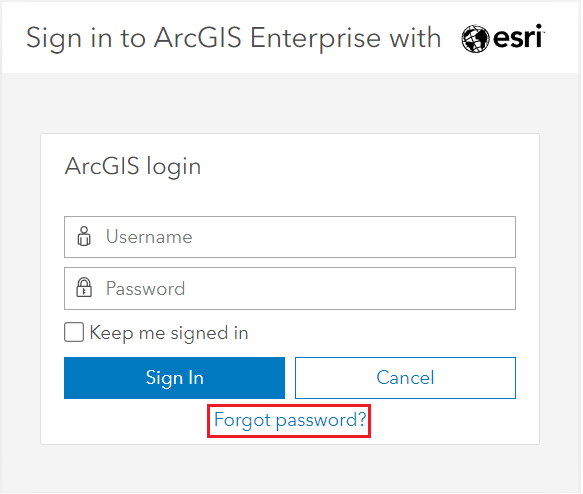

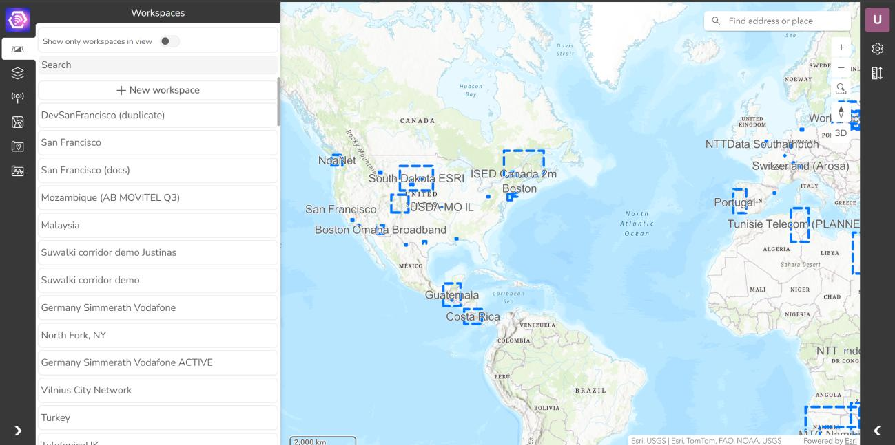
the tables, are displayed on the map. Select a workspace.
Confidential ©Cellular Expert, 2026 Page | 10

---

Cellular Expert Express User Guide 7.3
Map view and features are visible only for the selected workspace.

## 2.3 Log out

To exit the Express Network Data Management application, click on the User menu button at the top right

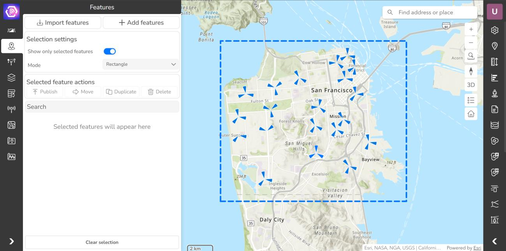

corner.
And click on the Logout button.
3. Map view
The Map view has a predefined layout divided into:
1. Invetory3D window layout, settings, user
2. Data management and visualization tools
3. Map view, graphical data management
4. Table view, attribute data management
Confidential ©Cellular Expert, 2026 Page | 11

---

Cellular Expert Express User Guide 7.3
5. Data analysis tools and calculation results
6. Calculation result graphs and tables, additional analysis tools
1. Invetory3D window
layout, settings, user
3. Map view, graphical
data management
5. Data analysis tools and
calculation results
2. Data management and
visualization tools
6. Calculation result graphs
and tables, additional
analysis tools
4. Table view, attribute
data management

## 3.1 Cellular Expert Express tools

3.1.1 Workspaces
Click this button to open Workspaces tool.
Shows an active workspace. The tool allows to switch between available workspaces. The Map view will
be automatically zoomed to the selected workspace extent and only objects defined for that workspace will

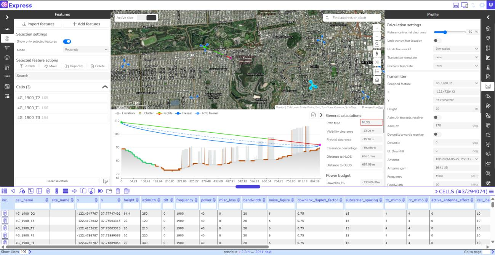

be visible.
A workspace is a project-based view in which objects are displayed. Workspaces can be assigned
individually for each user group.
Confidential ©Cellular Expert, 2026 Page | 12

---

Cellular Expert Express User Guide 7.3
Show only workspaces in view
When enabled, this option filters the workspace list to display only the workspaces currently visible within

the map’s viewport.
Upon hovering the mouse over a workspace item, options for it appear.
Edit Workspace
Duplicate Workspace
Confidential ©Cellular Expert, 2026 Page | 13

---

Cellular Expert Express User Guide 7.3
Delete Workspace
3.1.1.1 Add workspace
To create a workspace, press the New workspace button.
General
Workspace name
Workspace identification.
Coordinate system [EPSG](#kw:what-is-a-projected-[crs](#kw:check-crs:ce-express-geodata):ce-express-geodata)
[EPSG](#kw:what-is-a-projected-[crs](#kw:check-crs:ce-express-geodata):ce-express-geodata) code of the coordinate system (spatial reference) used within workspace. Feature coordinates
will be saved in this coordinate system. This does not affect the geodata used within calculations. Default

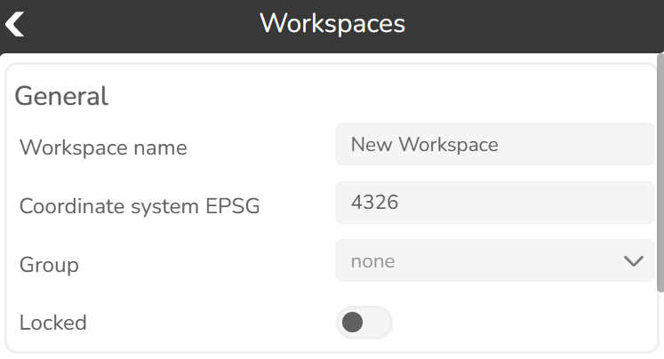
is 4326 ([WGS84](#kw:what-is-a-projected-[crs](#kw:check-crs:ce-express-geodata):ce-express-geodata)).
Confidential ©Cellular Expert, 2026 Page | 14

---

Cellular Expert Express User Guide 7.3

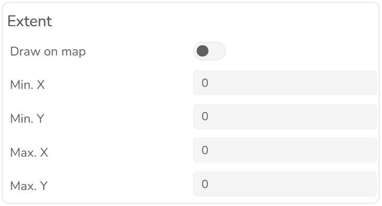

Group
Workspaces are grouped based on the value in this field. To group workspaces, set this field to the
same value for multiple workspaces.
Locked
Locks feature editing within the workspace. Useful when you want to keep a workspace for archiving
purposes. Only an admin user can disable this for a locked workspace.
Extent
Workspace extent defines where the map gets zoomed to when the workspace is loaded. It is also used
as a zoom reference for the home button.
Draw on map
Enabling this allows for clicking on the map to draw a desired square for workspace extent.
Min. X
Minimum x (leftmost) coordinate of the workspace extent (in workspace [epsg](#kw:what-is-a-projected-crs:ce-express-geodata))
Min. Y
Minimum y (bottommost) coordinate of the workspace extent (in workspace epsg)
Max. X
Maximum x (rightmost) coordinate of the workspace extent (in workspace epsg)
Max. Y
Maximum y (topmost) coordinate of the workspace extent (in workspace epsg)
Confidential ©Cellular Expert, 2026 Page | 15

---

Cellular Expert Express User Guide 7.3
Coordinate origin
Origin point from which coordinates are calculated from in the user interface. Global coordinates are
saved in the database regardless of this setting.
Calculations
Calculate EIRP
Enabled – EIRP is calculated with the formula: power – misc. loss + antenna gain.
Disabled – power value is used as EIRP.
Use [clutter](#kw:clutter-classification-values:ce-express-geodata)
Determines whether [Clutter](#kw:clutter-classification-values:ce-express-geodata) Loss is used in prediction calculations.
Transmitter height reference
The height above which the absolute transmitter height is calculated, e.g. if “elevation” is selected, and
transmitter height is set to 10 m, the absolute transmitter height is calculated as elevation + 10. This is

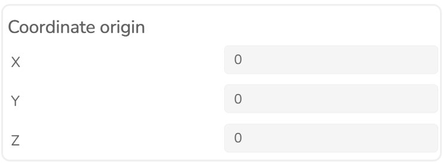

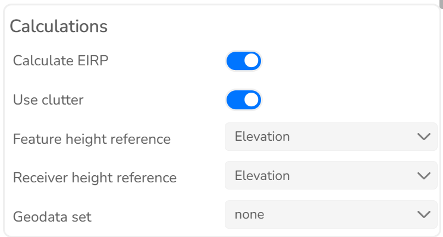
used within CE calculations.
Available options:
Confidential ©Cellular Expert, 2026 Page | 16

---

Cellular Expert Express User Guide 7.3
- Elevation
- [Clutter](#kw:clutter-classification-values:ce-express-geodata) height (buildings only)
- Clutter height
- Absolute
Receiver height reference
The height above which the absolute receiver height is calculated, e.g. if “elevation” is selected, and
receiver height is set to 10 m, the absolute receiver height is calculated as elevation + 10. This is used

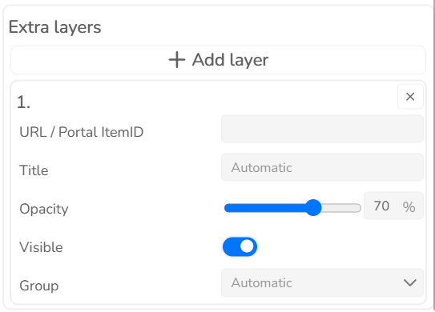
within CE calculations.
Available options:
- Elevation
- Clutter height (buildings only)
- Clutter height
- Absolute
Geodata set
Geodata set used in calculations launched within the workspace.
Extra layers
| Parameter | Description |
|---|---|
| URL / Portal ItemID | Specifies the source of the layer. Accepts either a direct URL or an ArcGIS Portal Item ID. |
| Title | The title field defines the name displayed for a layer in the layer list |
| Opacity | Adjusts layer transparency. |
Visible
Confidential ©Cellular Expert, 2026 Page | 17

---

Cellular Expert Express User Guide 7.3
Turns the layer’s display on or off.
Group
Specifies the group assignment for the layer. You can select an existing group, create a new one, or
leave the field blank to place the layer in the default group Other.
Feature naming schemes
Allows for automatic feature name setting depending on features already existent in workspace. For
example: Cells feature naming scheme set to “1,2,3..” → Cells 1, 2, and 3 already exist in workspace →

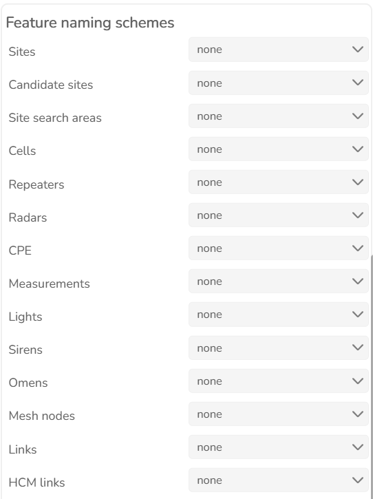

next placed cell in add features tool will automatically have the name set to 4.
3.1.2 Features
Click this button to open Features tool.
Use this tool to import or add features, select and visualize them.
Confidential ©Cellular Expert, 2026 Page | 18

---

Cellular Expert Express User Guide 7.3
3.1.2.1 Import
The widget allows the creation of objects from a text file. To start importing new objects press the Import

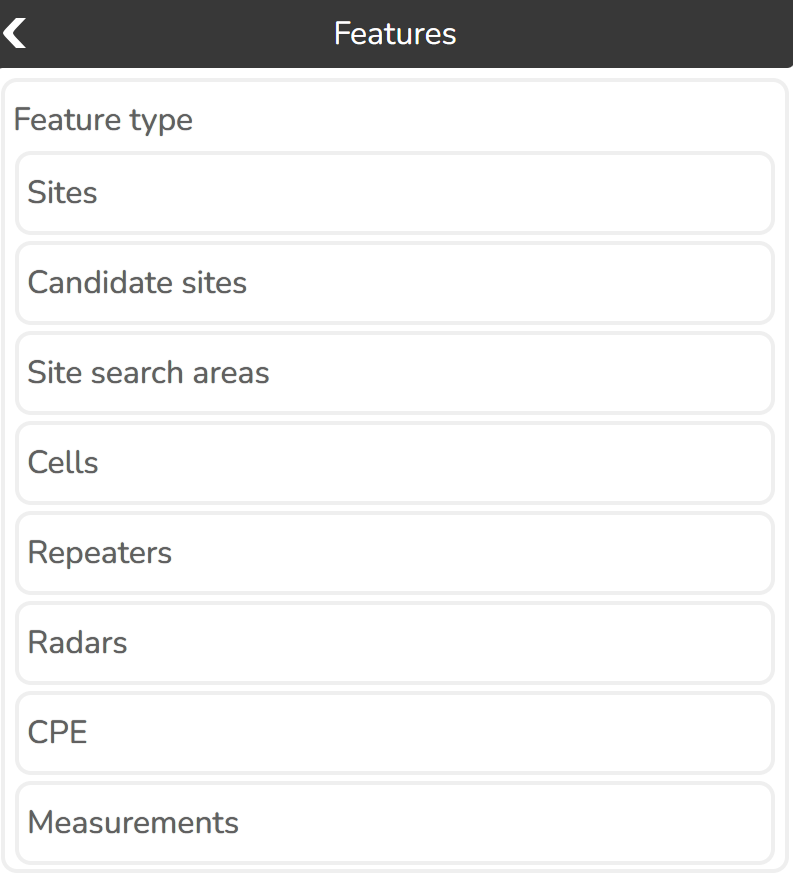
features button.
Select the object type.
A new dialog on the right side of the window will appear. The widget imports object data to the database.
The imported objects will be displayed automatically on the map. The supported file formats are CSV and
KMZ.
Confidential ©Cellular Expert, 2026 Page | 19

---

Cellular Expert Express User Guide 7.3
To start the import process, select or drag and drop a CSV or KMZ file.
3.1.2.1.1 Mapping
The data in the import files may have names, values and units which do not match the data in the Cellular

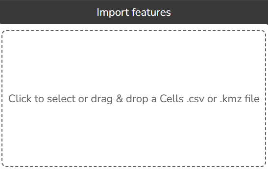

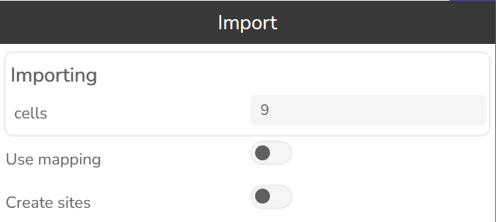
Expert database. To resolve such issues, check Use mapping button.
Confidential ©Cellular Expert, 2026 Page | 20

---

Cellular Expert Express User Guide 7.3
Source - the name of the value that is written in the data file.
Fill - value which will be used when an object in the data file has no value for a particular property. In this

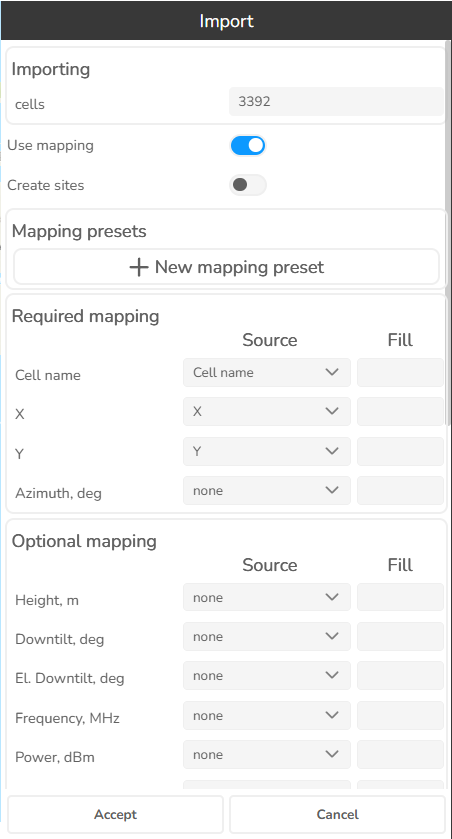
example, if “Azimuth” is not set, then it will by default be assigned the value of 0. Leaving the default to
empty means that no default value will be applied.
Confidential ©Cellular Expert, 2026 Page | 21

---

Cellular Expert Express User Guide 7.3
3.1.2.1.2 Mapping presets
It is possible to create import presets.
To create a preset, first define source or fill value, then press New mapping preset button.
A new preset will be created.
Define a preset name. The defined preset will be applied the next time for importing.
Apply
Applies a mapping preset for importing file.
Delete
Deletes a preset.
3.1.2.2 Add features
Confidential ©Cellular Expert, 2026 Page | 22

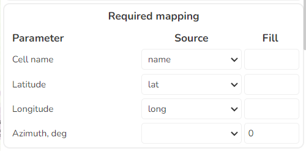

---

Cellular Expert Express User Guide 7.3
Select the object type.
A new dialog on the right side of the window will appear.
New objects can be created in several ways. They can be:
- Created from templates
- Created with Cellular Expert tools from zero (define all parameters in the process)
Confidential ©Cellular Expert, 2026 Page | 23

---

Cellular Expert Express User Guide 7.3
3.1.2.2.1 Feature set template
Allows for saving a group of features as a “feature set template”, with one of the features acting as the
origin for the feature set coordinates. The entire feature set can then be placed with a single operation via

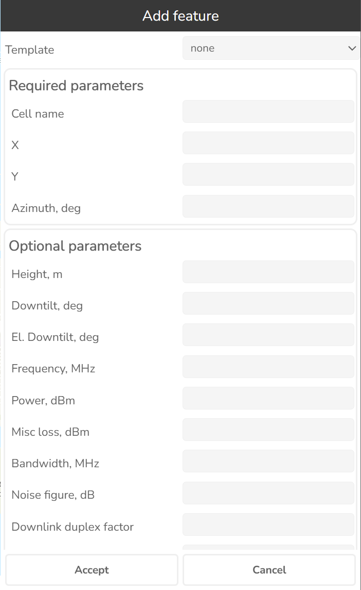

the add features tool. Coordinates relative to the origin feature are maintained by the other features in the
set.
Confidential ©Cellular Expert, 2026 Page | 24

---

Cellular Expert Express User Guide 7.3
General
Feature set template name
Name of the feature set template
Features
Coordinate origin feature
Feature which will be used as the coordinate origin point for the feature set. When the feature set is placed,

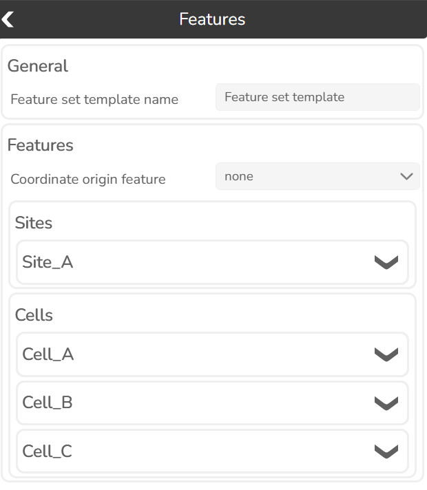
this feature will be at the mouse click point.
Feature parameters
Parameters of the features saved in the feature set template. The placed feature parameters will be
automatically filled with the saved values.
Confidential ©Cellular Expert, 2026 Page | 25

---

Cellular Expert Express User Guide 7.3
3.1.2.2.2 Add Site
Required parameters
| Parameter | Description |
|---|---|
| Site name | Site identification. |
| X | Coordinate in the projected coordinate system. |
| Y | Coordinate in the projected coordinate system. |
Azimuth
Cell direction from the North in degrees.
Confidential ©Cellular Expert, 2026 Page | 29

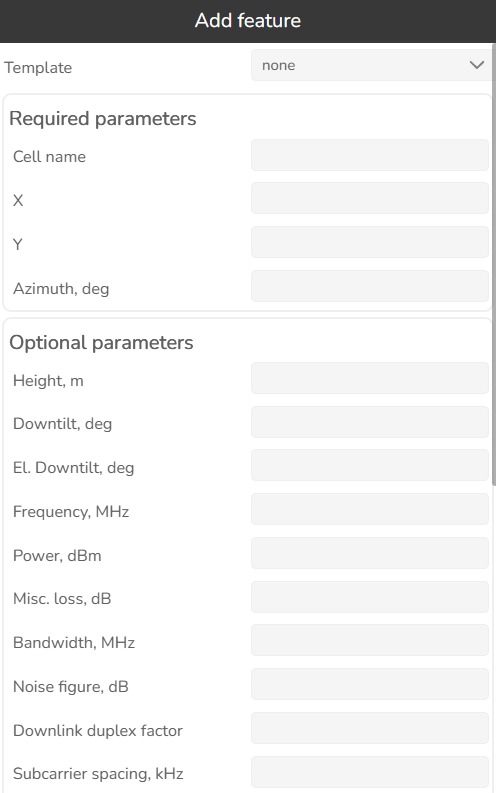

---

Cellular Expert Express User Guide 7.3
Optional parameters
| Parameter | Description |
|---|---|
| Height, m | Height above the terrain. |
| Downtilt | Mechanical tilt value. |
| El. Downtilt, deg | Electrical tilt value |
| Frequency | Frequency value in MHz. |
| Power | Power value in dBm. |
| Misc. loss, dB | Miscellaneous loss value in dB. |
| Bandwidth, MHz | Value in MHz. Required for 4G and 5G technologies. For other technologies define the value as 0.015. |
| Noise figure, dB | Value in dB. Required for 4G and 5G technologies. |
Downlink duplex factor
Value range from 0 to 1. Required for Duplex mode TDD, which is applicable for 4G and 5G technologies,
and used for Downlink Throughput calculations. For example, if defined value is 0.7, then 70% of available
bandwidth will be dedicated to Downlink, and 30% - for Uplink.
| Parameter | Description |
|---|---|
| Subcarrier spacing, kHz | Value in kHz. Required for 4G and 5G technologies. For other technologies define value 15. |
| Tx Mimo | Transmitter antenna count. Available values: 1, 2, 4, 8, 16, 32 and 64. |
| Rx Mimo | Receiver antenna count. Available values: 1, 2, 4, 8, 16, 32 and 64. |
Active antenna effect
The parameter is dedicated to smart antenna modeling. The default value is 0, but if massive MIMO is
used, a smart antenna effect can be included to lower the interference and boost throughput.
Recommended values:
- For MIMO 32x32 – value 6.
- For MIMO 64x64 – value 9.
Cell load, %
The parameter is described in percentages and varies from 0 to 100. It describes how the cell is loaded.
Confidential ©Cellular Expert, 2026 Page | 30

---

Cellular Expert Express User Guide 7.3
The Cell load affects RSSI, RSRQ, and DL Throughput calculations. For example, if the Cell load is higher,
the DL Throughput is lower.
Color index
Describes the cell visualization. Available values:
- None – blue color.
- 1 – red color.
- 2 – light green color.
- 3 – dark green color.
- 4 – light blue color.
- 5 – dark blue color.
- 6 – purple color.
Technology
Describes the technology of the [network object](#kw:object-types:ce-express-network-objects). Possible values are 2G, 3G, 4G, and 5G.
Prediction model
Prediction model for Path Loss simulation.
Frequency group
Used to divide calculations into parts. If the selection range includes two or more different frequency group
values, the cells won’t be predicted together.
Antenna
Define [antenna patterns](#kw:importing-antenna-patterns:ce-express-antenna) for the Cell object.
Carriers
Describes the carrier values used for 2G calculations: C/I interference and C/A interference. The values
are written in brackets, […]. If more than one value is defined, the values are separated by a comma. If
there is no carrier information, the brackets are left empty [].
| Parameter | Description |
|---|---|
| Site ID | Describes to which Site the Cell belongs. |
| Duplex mode | Available values FDD or TDD. Required for 4G and 5G technologies. For other technologies define value FDD. |
| Status | Free-form text. |
| Type | Free-form text. 3.1.2.2.6 Add Repeater |
Confidential ©Cellular Expert, 2026 Page | 31

---

Cellular Expert Express User Guide 7.3
Required parameters
| Parameter | Description |
|---|---|
| Repeater name | Repeater identification. |
| X | Coordinate in the projected coordinate system. |
| Y | Coordinate in the projected coordinate system. |
| Azimuth | Direction from the North in degrees. |
Confidential ©Cellular Expert, 2026 Page | 32

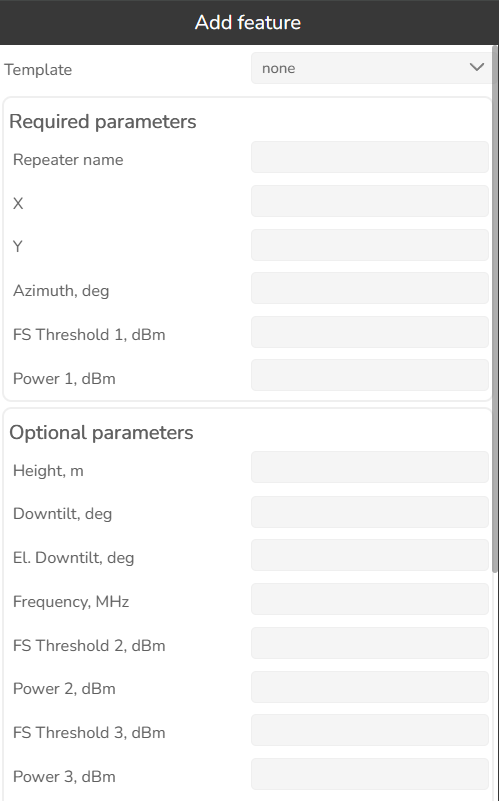

---

Cellular Expert Express User Guide 7.3
Optional parameters
| Parameter | Description |
|---|---|
| Height | Object’s height above the terrain. |
| Downtilt | Mechanical tilt in telecommunications repeaters is the physical angling of the antenna to optimize signal coverage. |
| Electrical Tilt | Electrical tilt in a repeater refers to the electronic adjustment of an antenna's vertical radiation pattern to optimize network coverage and reduce interference. |
| Frequency | Frequency value in MHz. |
Thresholds 1, 2, 3
The minimum field strength in dB at repeater location at which power of the corresponding index (1-3) will
be applied. Values should be in ascending order. If a higher threshold is satisfied, the power corresponding
to it will be used.
Power 1, 2, 3
A power that is assigned to cells based on the repeater thresholds and cell signal strength. When the cell’s
signal strength is categorized the power of the repeater will be assigned as well.
Misc loss
Miscellaneous loss value in dB.
Bandwidth
Value in MHz. Required for 4G and 5G technologies. For other technologies define the value as 0.015.
Subcarrier Spacing
Value in kHz. Required for 4G and 5G technologies. For other technologies define value 15.
Tx Mimo
Transmitter antenna count. Available values: 1, 2, 4, 8, 16, 32 and 64.
Rx Mimo
Receiver antenna count. Available values: 1, 2, 4, 8, 16, 32 and 64.
Technology
Describes the technology of the [network object](#kw:object-types:ce-express-network-objects).
Prediction Model
Lets the user select which prediction model and configuration should be used for calculations.
Frequency group
Used to divide calculations into parts. If the selection range includes two or more different frequency group
values, the cells won’t be predicted together.
Confidential ©Cellular Expert, 2026 Page | 33

---

Cellular Expert Express User Guide 7.3
Antenna
Antenna name for Repeater object.
3.1.2.2.7 Add Radar
Required parameters
| Parameter | Description |
|---|---|
| Radar name | Radar identification. |
| X | Coordinate in the projected coordinate system. |
| Y | Coordinate in the projected coordinate system. |
Optional parameters
Height
Object’s height above the terrain.
Confidential ©Cellular Expert, 2026 Page | 34

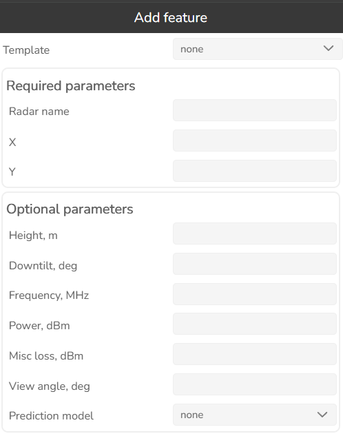

---

Cellular Expert Express User Guide 7.3
| Parameter | Description |
|---|---|
| Downtilt | Mechanical tilt value. |
| Frequency | Frequency value in MHz. |
| Power | Power value in dBm. |
| Misc Loss | Miscellaneous loss value in dB. |
| View Angle | Visible field (vertical angle) of the radar in degrees. |
| Prediction Model | Prediction model for Path Loss simulation. 3.1.2.2.8 Add CPE |
Confidential ©Cellular Expert, 2026 Page | 35

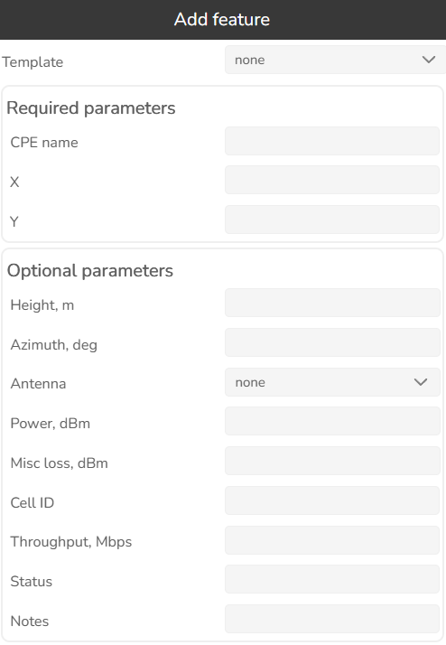

---

Cellular Expert Express User Guide 7.3
Required parameters
| Parameter | Description |
|---|---|
| CPE name | CPE identification. |
| X | Coordinate in the projected coordinate system. |
| Y | Coordinate in the projected coordinate system. |
Optional parameters
Height
Object’s height above the terrain.
Azimuth
Direction from the North in degrees.
Antenna
Antenna name for CPE location.
Power
A power value in dBm.
Misc loss
Miscellaneous loss value in dB.
Cell ID
Describes to which Cell the CPE point belongs.
Throughput
The speed at which data is transferred. Measured in Mb/s.
Status
Current status of the [network object](#kw:object-types:ce-express-network-objects).
Notes
Additional information for network predictions can be noted here.
3.1.2.2.9 Add Measurements
Confidential ©Cellular Expert, 2026 Page | 36

---

Cellular Expert Express User Guide 7.3
Required parameters
| Parameter | Description |
|---|---|
| Field strength, dB | Field strength. |
| X | Coordinate in the projected coordinate system. |
| Y | Coordinate in the projected coordinate system. |
| Cell ID | A field which binds the measurement to a cell network object. 3.1.2.2.10 Add Omen |
3.1.2.2.10 Add Omen
Confidential ©Cellular Expert, 2026 Page | 37

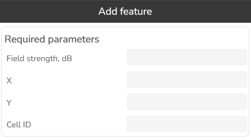

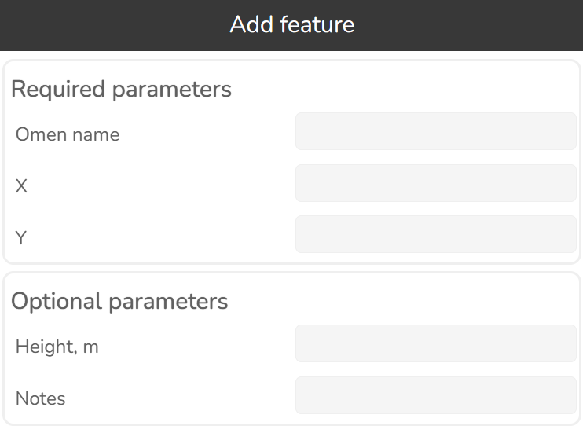

---

Cellular Expert Express User Guide 7.3
Required parameters
| Parameter | Description |
|---|---|
| Omen name | Omen identification. |
| X | Coordinate in the projected coordinate system. |
| Y | Coordinate in the projected coordinate system. |
Optional parameters
Height, m
Height above the terrain.
Notes
Free-form text.
3.1.2.2.11 Add Sirens
Confidential ©Cellular Expert, 2026 Page | 38

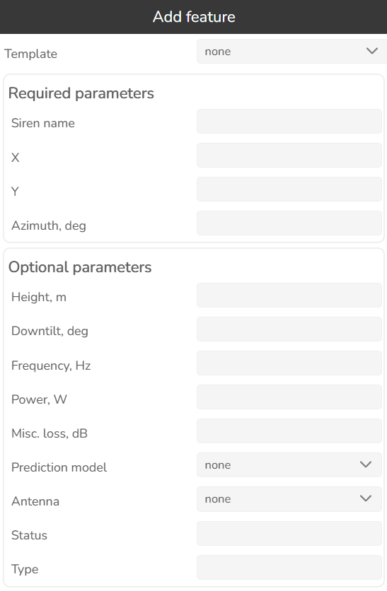

---

Cellular Expert Express User Guide 7.3
Required parameters
| Parameter | Description |
|---|---|
| Siren name | Siren identification. |
| X | Coordinate in the projected coordinate system. |
| Y | Coordinate in the projected coordinate system. |
| Azimuth | Cell direction from the North in degrees. |
Optional parameters
| Parameter | Description |
|---|---|
| Height, m | Height above the terrain. |
| Downtilt | Mechanical tilt value. |
| Frequency | Frequency value in MHz. |
| Power | Power value in dBm. |
| Misc. loss, dB | Miscellaneous loss value in dB. |
| Prediction model | Only ISO9613 can be applied to calculate sound loss for the siren. |
| Antenna | Antenna name for Siren object. |
| Status | Free-form text. |
| Type | Free-form text. 3.1.2.2.12 Add Lights |
Confidential ©Cellular Expert, 2026 Page | 39

---

Cellular Expert Express User Guide 7.3
Required parameters
| Parameter | Description |
|---|---|
| Light name | Light identification. |
| X | Coordinate in the projected coordinate system. |
| Y | Coordinate in the projected coordinate system. |
| Azimuth | Cell direction from the North in degrees. |
Optional parameters
Height, m
Height above the terrain.
Downtilt
Mechanical tilt value.
Confidential ©Cellular Expert, 2026 Page | 40

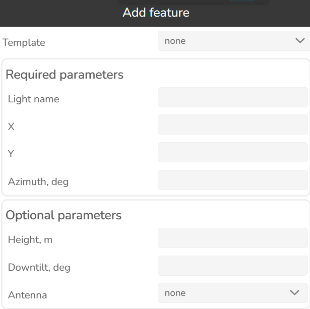

---

Cellular Expert Express User Guide 7.3
Antenna
Antenna name for Light object.
3.1.2.2.13 Add Mesh nodes
Required parameters
| Parameter | Description |
|---|---|
| Mesh node name | Mesh node identification. |
| X | Coordinate in the projected coordinate system. |
| Y | Coordinate in the projected coordinate system. |
Confidential ©Cellular Expert, 2026 Page | 41

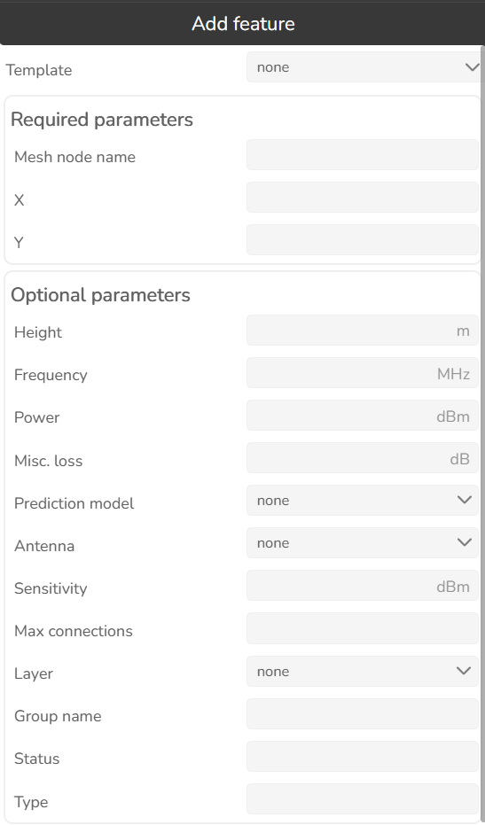

---

Cellular Expert Express User Guide 7.3
Optional parameters
Height, m
Height above the terrain.
Frequency, MHz
Frequency of the mesh node.
Power, dBm
Power value of the mesh node.
Misc Loss, dB
Miscellaneous loss value of the mesh node.
Prediction model
The prediction model that will be used for the mesh node in Mesh Connectivity and Quick Mesh Connectivity
calculations.
Antenna
Define [antenna patterns](#kw:importing-antenna-patterns:ce-express-antenna) for the mesh node object.
Sensitivity
Sensitivity value of the mesh node.
Max connections
The maximum number of connections the mesh node can have (used for mesh connectivity calculations).
Layer
The layer of the mesh node (number value). Used for priority calculations in Automatic Frequency Planning.

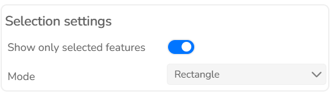
Group name
The group name of the mesh node (text description). Several mesh nodes may belong to the same group.
Status
Free-form text.
Type
Free-form text.
3.1.2.3 Selecting
Confidential ©Cellular Expert, 2026 Page | 42

---

Cellular Expert Express User Guide 7.3
Selection settings
Show only selected features
Only the selected features will be displayed in the feature list. When the switch off, all features are visible

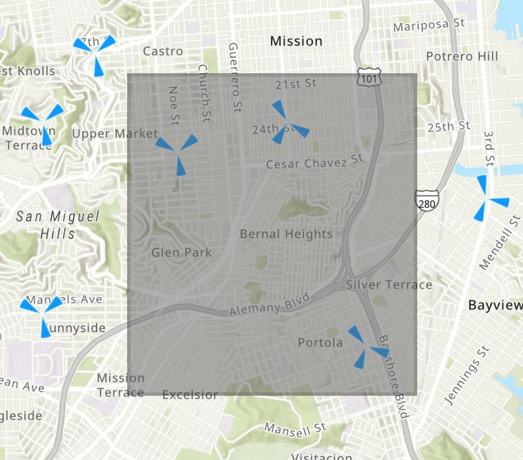

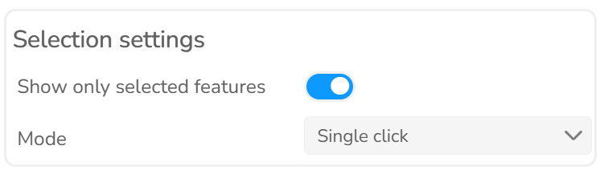
regardless of selection. When it is on non-selected features are hidden, so you see only what you have
selected.
Mode
There are several different modes for [selecting objects](#kw:selecting-multiple-objects:ce-express-network-objects):
- Rectangle.
To start the selection process, click once on the map, then move the mouse cursor to define an
area, click a second time to finish the selection process.
- Single click. Click once on an object to select it.
Confidential ©Cellular Expert, 2026 Page | 43

---

Cellular Expert Express User Guide 7.3
- Radius.
Set the desired distance, then click on the map and the surrounding objects within the set distance will

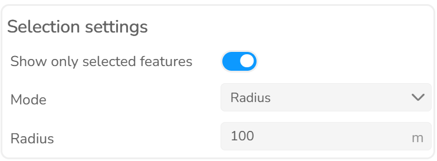

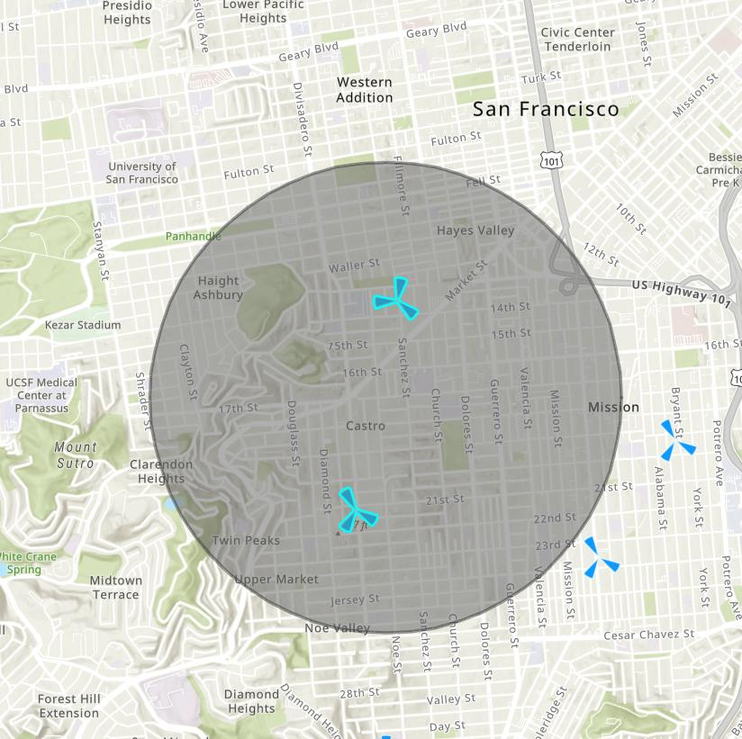

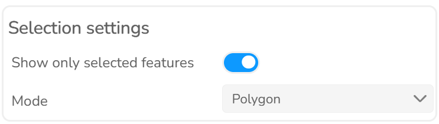
be selected.
- Polygon.
Confidential ©Cellular Expert, 2026 Page | 44

---

Cellular Expert Express User Guide 7.3
Click once on the map to create the vertices of the polygon. Double-click to close the polygon and select

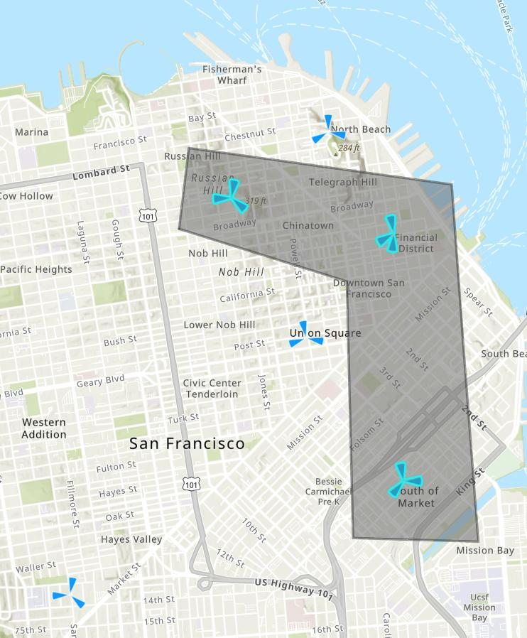

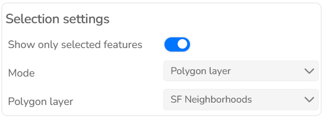
the feature.
- Polygon layer.
To use the polygon layer selection, choose a predefined polygon layer from the dropdown list. Then,
click on the map. All features located within the selected polygon boundary will be highlighted and
displayed in the feature list.
Confidential ©Cellular Expert, 2026 Page | 45

---

Cellular Expert Express User Guide 7.3
Selected objects will be highlighted on the map and listed in the tool.
Confidential ©Cellular Expert, 2026 Page | 46

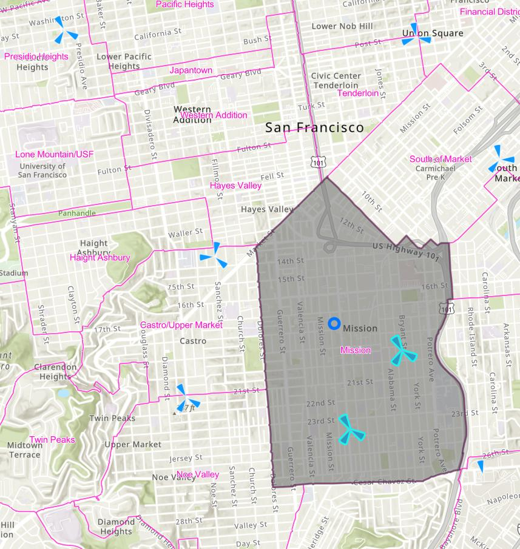

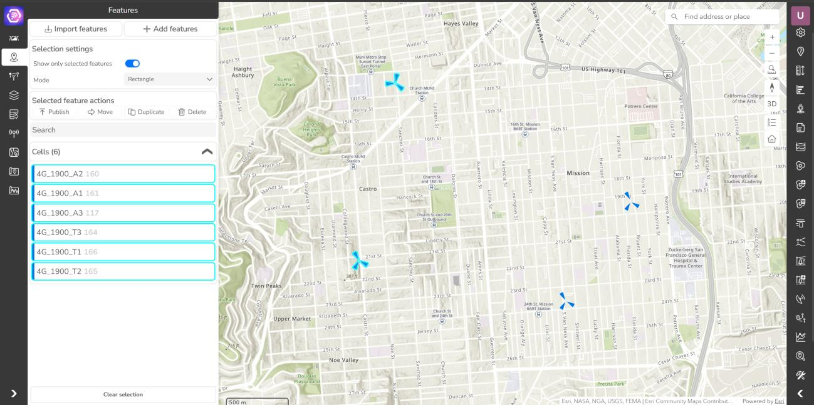

---

Cellular Expert Express User Guide 7.3
Clear selection
Clears a objects selection on the map.
Search
Initiates the search procedure in the selected objects list.
Show in table
Opens the selected objects attribute table
3.1.2.4 Move/Duplicate/Delete/Publish selected objects
Select objects on the map to start the Publish, Move, Duplicate or Delete functionality.
Publish
Select the features you want to publish to portal as a feature layer, then click the publish button.

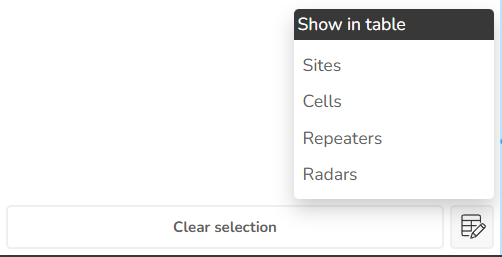

An option menu then appears to let you select who the newly created feature layer will be shared to:
Confidential ©Cellular Expert, 2026 Page | 47

---

Cellular Expert Express User Guide 7.3
Press OK to start the publishing process.
Move
Select the objects which shall be moved and choose the Move tool. The Move selected features dialog will
appear.
Hold the left mouse button and drag the object to the preferred location.
Press Accept to save changes.
Duplicate
Select the objects which shall be duplicated and choose the Duplicate tool. The Duplicate features dialog
will appear. Hold the left mouse button and drag the object to the preferred location. Selected objects can

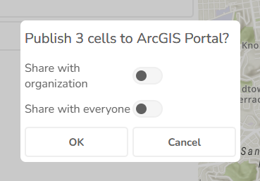

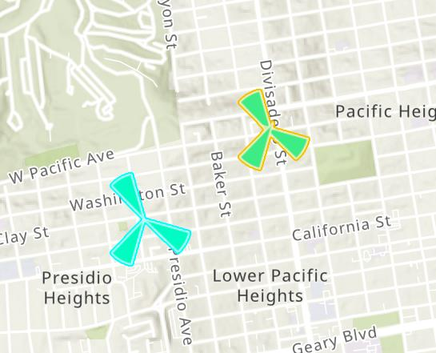
be duplicated to another workspace.
Confidential ©Cellular Expert, 2026 Page | 48

---

Cellular Expert Express User Guide 7.3
Press Accept to save changes.
Delete
Select the objects on the map, then press the Delete button to remove them from the Map view and
database tables.
Press Accept to save changes.
3.1.2.5 Edit objects
Object attributes can be edited using the Cellular Expert graphical interface. Move the mouse cursor to the

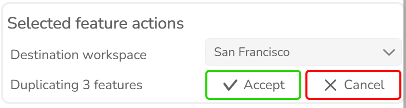

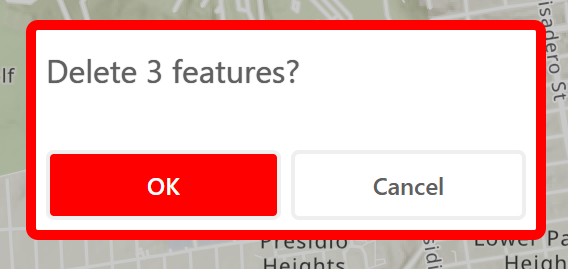
required object in the Features tool and click on it to edit object attributes.
Confidential ©Cellular Expert, 2026 Page | 49

---

Cellular Expert Express User Guide 7.3
A new dialog opens on the right side with the most important attributes.
Confidential ©Cellular Expert, 2026 Page | 50

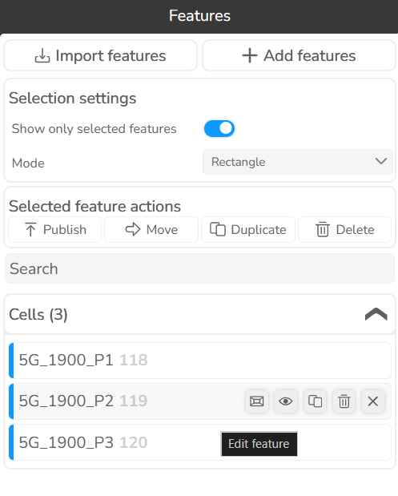

---

Cellular Expert Express User Guide 7.3
Accept
Saves all changes.
Cancel
Discards all changes and closes the dialog.
Upon hovering the mouse over a feature item, options for it appear.
Confidential ©Cellular Expert, 2026 Page | 51

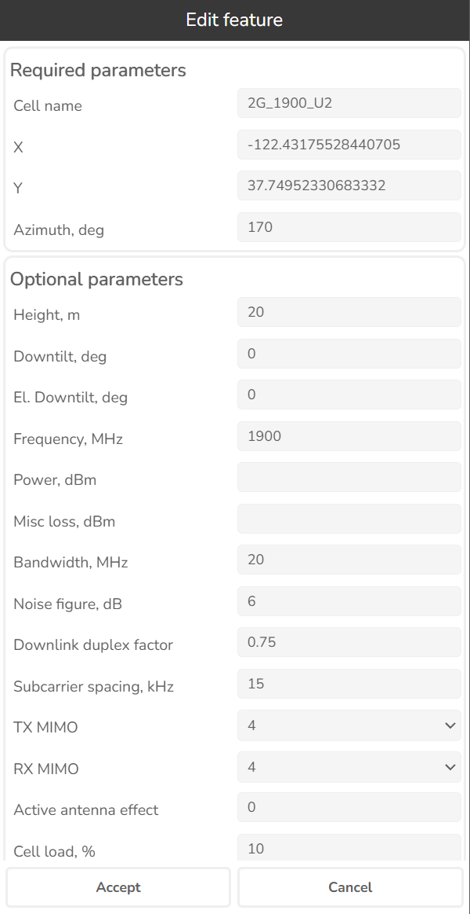

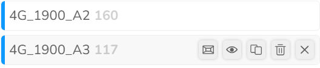

---

Cellular Expert Express User Guide 7.3
| Parameter | Description |
|---|---|
| View from perspective | Viewpoint from the position of cell. |
| Highlight feature | Highlights feature on the map. |
| Duplicate feature | Creates a copy of the feature. |
| Delete feature | Deletes feature. |
| Remove from selection | Removes feature from the selected features list. |
Add to selection
Adds feature to selected features list.
3.1.2.6 Quick add
If you have feature templates favorited, the quick add section will appear under the feature type in the
features list. You may then use the listed favorite feature templates to quickly add features with the template

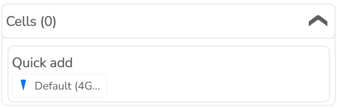
applied. This can be done in 2 ways:
- Click the feature template name to automatically open the add features tool and have the template
applied
- Drag and drop the feature template on the map to quickly add a new feature to the desired location
with only having the enter the feature name in a popup.
Confidential ©Cellular Expert, 2026 Page | 52

---

Cellular Expert Express User Guide 7.3
3.1.3 Networks
Click this button to open Networks tool.
The networks tool allows for easy management of multiple objects, grouped into networks. Networks can
be defined by feature attribute or via the selection of the features required. Then, feature attribute change

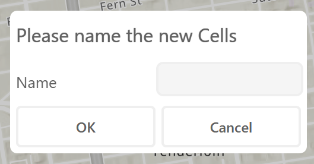

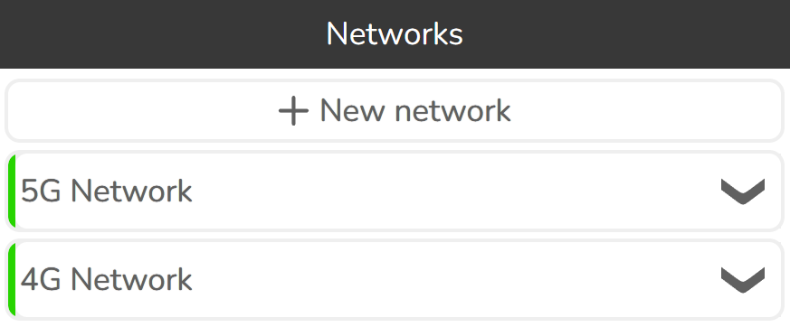
tracking and calculations can be performed for each network without the need for selection.
Once expanded, an existing network item displays the following information:
Confidential ©Cellular Expert, 2026 Page | 53

---

Cellular Expert Express User Guide 7.3

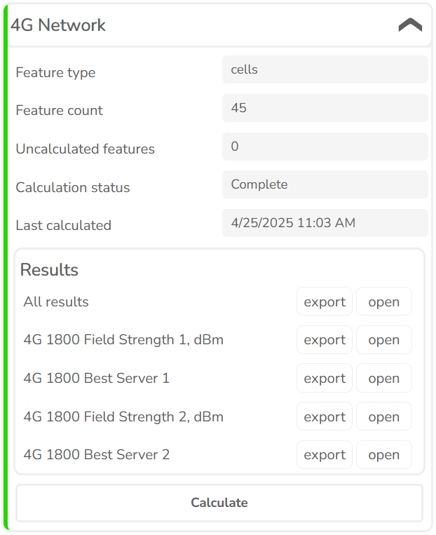
Feature type
The feature type associated with the network.
Feature count
Total feature count in the network.
Uncalculated features
Number of [Network objects](#kw:object-types:ce-express-network-objects) that have not yet been added to a calculation.
Calculation status
Status of the current calculation.
Last calculated
The last time the calculation was started.
Results
Select which [prediction results](#kw:viewing-results:ce-express-rf-prediction) you want to add to the Map view and manage in the layers tool.
Confidential ©Cellular Expert, 2026 Page | 54

---

Cellular Expert Express User Guide 7.3
Export
Exports the selected [prediction results](#kw:viewing-results:ce-express-rf-prediction) layer as a TIF raster.
Open
Opens the selected [prediction results](#kw:viewing-results:ce-express-rf-prediction) layer.
Upon hovering the mouse over a network item, options for it appear.
Edit Network
Network publishing settings
Delete Network
3.1.3.1 Add network
To create a network press the New network button.
Confidential ©Cellular Expert, 2026 Page | 55

---

Cellular Expert Express User Guide 7.3
Network name
The name of the network
Feature type
The type of feature to be included in the network.
Feature filter
- By attribute – Include features in the network by selecting an attribute and inputting the required
attribute values. The features with these values will then be filtered and included in the network.
- From selection – Include features in the network from the currently selected items.
Attribute
The attribute field to be filtered by.
Filter attribute values
Required values for the filter attribute. Features containing ANY of the entered values will be included.
3.1.3.2 Network publishing setting
If you would like the calculation results to be automatically published when the network is re-calculated,

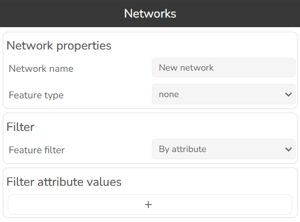
you may set it up in the network publishing settings menu.
First open the calculation result layer you would like to be automatically published, and set up the color
band values as per your preference:
Confidential ©Cellular Expert, 2026 Page | 56

---

Cellular Expert Express User Guide 7.3
Then, options for your layer‘s publishing will appear under the calculation results section:
Confidential ©Cellular Expert, 2026 Page | 57

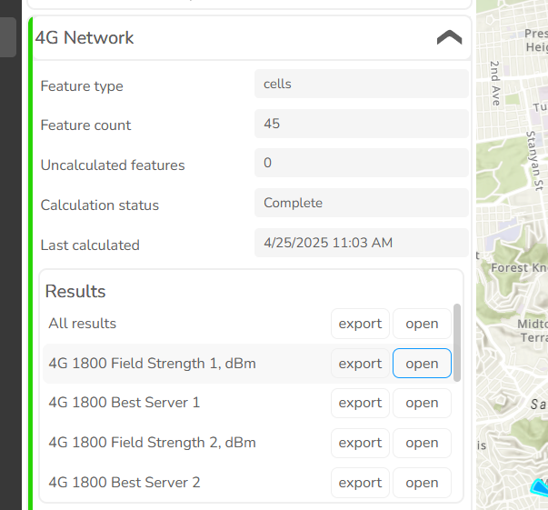

---

Cellular Expert Express User Guide 7.3
You may enable automatic publishing and select who the results are shared to for this layer.
The same options are also available for the features that are associated with the network.
After setting up the automatic publishing options, click Accept to save. The publishing is then executed

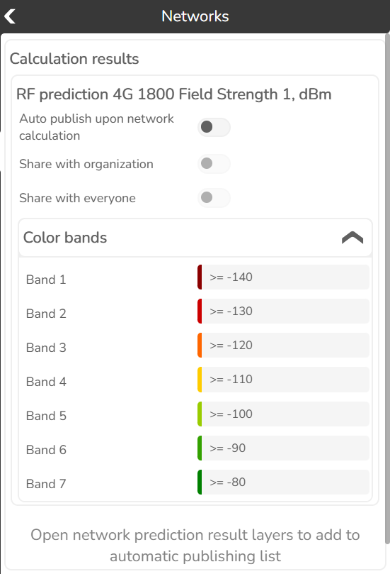

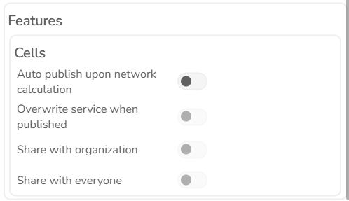
the next time the network calculation is run.
Confidential ©Cellular Expert, 2026 Page | 58

---

Cellular Expert Express User Guide 7.3
3.1.4 Layers
Click this button to open Layers tool.
Manages the visualization of features and calculation results in the Map view. Displays and manages all
layers in the workspace, grouped into categories such as Features, Geodata, Prediction results, and
Other. Each layer can be shown, hidden, or reordered.
You can reorder the entire group or toggle its visibility to show or hide all layers within it at once.
Confidential ©Cellular Expert, 2026 Page | 59

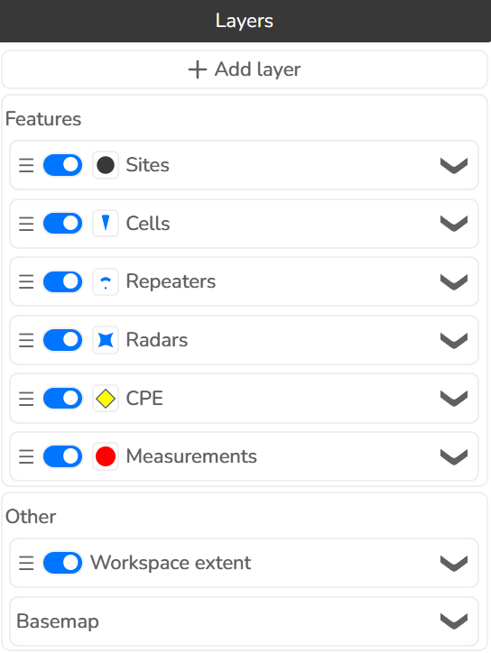

---

Cellular Expert Express User Guide 7.3
Layers can also be organized by dragging them into existing groups or dropping them into New layer group

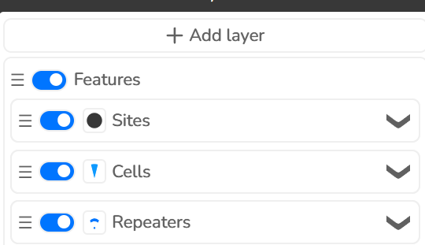

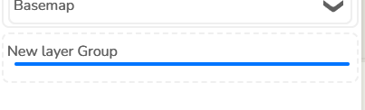
to create a custom group.
3.1.4.1 Add layer
Layers added from this panel are visible only to you. Other users who open the same workspace will not
see these layers unless they also add them manually.
Confidential ©Cellular Expert, 2026 Page | 60

---

Cellular Expert Express User Guide 7.3
From URL / Portal ItemID
Allows you to add a layer directly by entering its URL or Portal Item ID, then selecting Add.
Search criteria
My organization
Limits search results to layers shared within your organization.
Confidential ©Cellular Expert, 2026 Page | 61

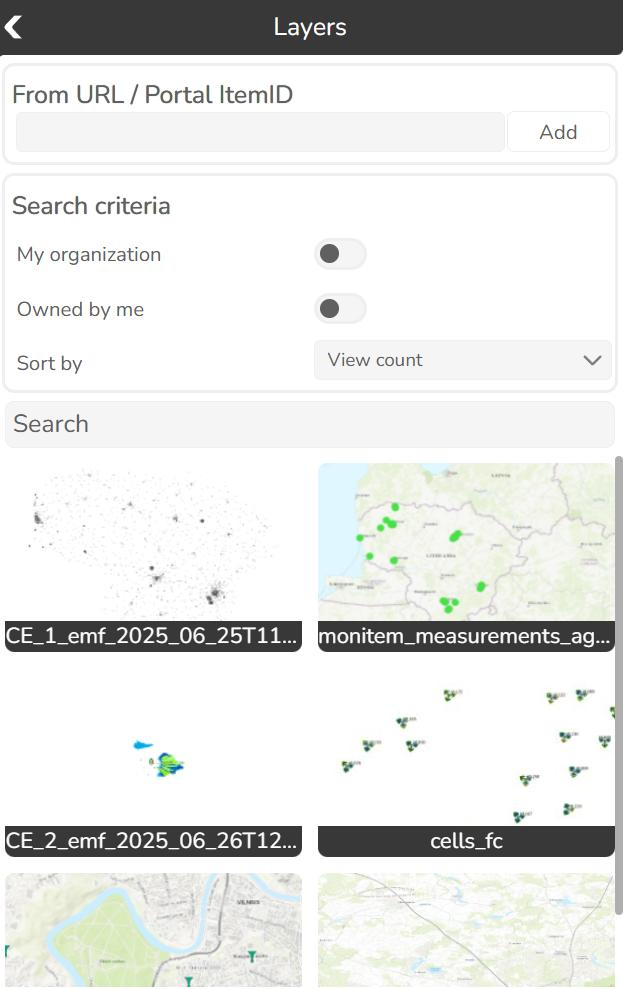

---

Cellular Expert Express User Guide 7.3
| Parameter | Description |
|---|---|
| Owned by me | Shows only layers you own. |
| Sort by | Determines the order of search results (e.g., by view count or date). 3.1.4.2 Features |
| Rearrange layers | Allows you to reorder layers by dragging. |
| Turn on/off the layer | Turn on or off a layer in the Map view • The layer is visible - The layer is not visible - • |
Confidential ©Cellular Expert, 2026 Page | 62

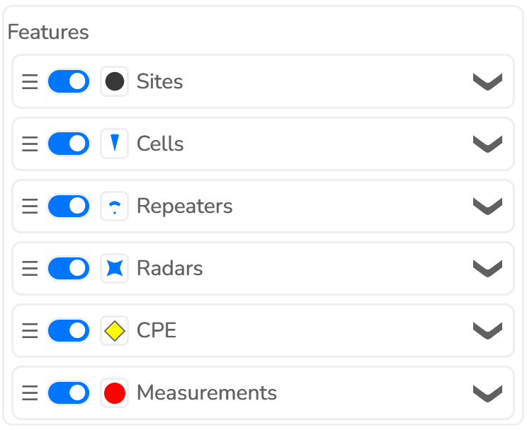

---

Cellular Expert Express User Guide 7.3
Layer symbol
Preview layer symbol. Click on it to edit the symbol.
Expand layer
Previews and manages the layer opacity and map scale .
3.1.4.2.1 Edit symbolization
Click on the layer symbol to edit it. A new dialog opens on the right side.
Confidential ©Cellular Expert, 2026 Page | 63

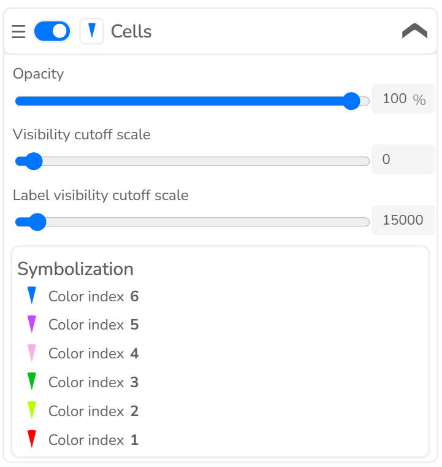

---

Cellular Expert Express User Guide 7.3
In layer symbolization it is possible to change:
- Shape.
o if a path is selected in shape, svg path can be changed.
- Size.
- Color.
- Turn on and off outline.
- Outline color.
- Turn on and off offset.
- X/Y offset.
Confidential ©Cellular Expert, 2026 Page | 64

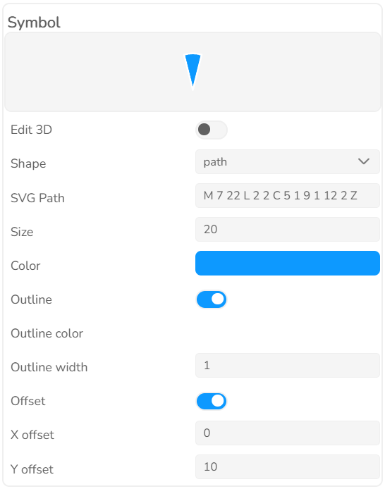

---

Cellular Expert Express User Guide 7.3
There is an option to use 3d symbol. The following parameters can be changed in the 3d symbol:
- Shape
- Color
- Width
- Height
- Tilt
Visual variables can be added for each layer. Add visual variables to a layer using the Add visual variable

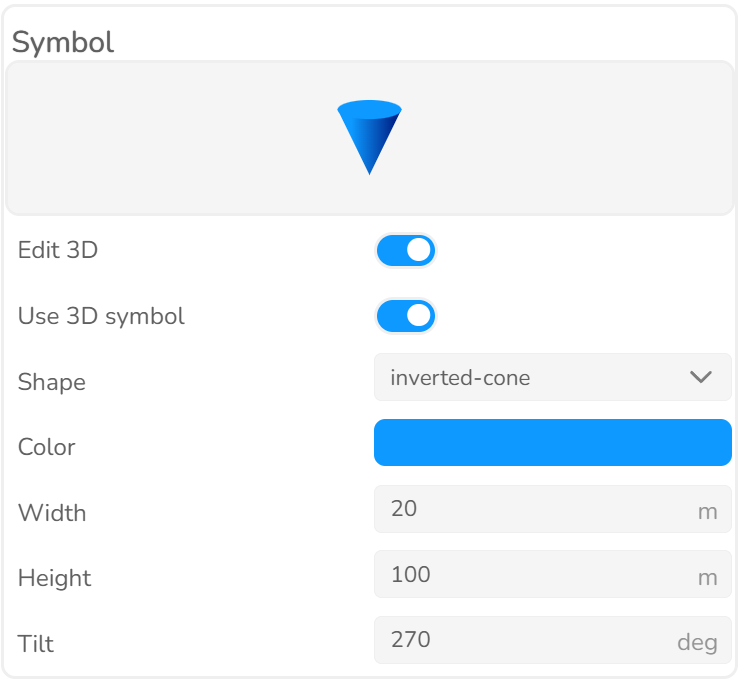

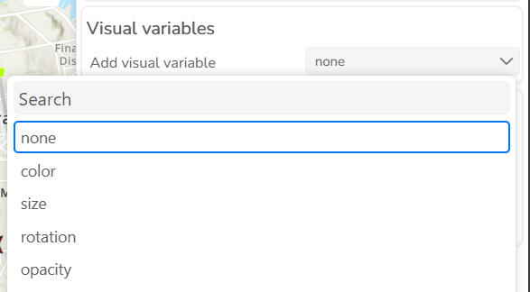
dropdown.
Confidential ©Cellular Expert, 2026 Page | 65

---

Cellular Expert Express User Guide 7.3
Choose a visual variable. The choices are:
- Color.
- Size.
- Rotation.
- Opacity.
Accept
Saves all changes.
Cancel
Discards all changes and closes the dialog.
Confidential ©Cellular Expert, 2026 Page | 66

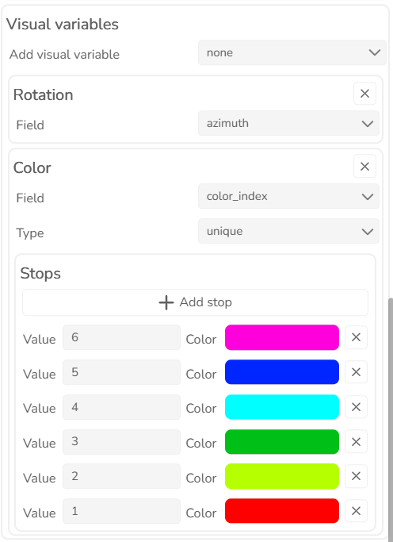

---

Cellular Expert Express User Guide 7.3
3.1.4.3 Prediction results
The prediction rasters calculated in Cellular Expert Express and loaded in the map view will appear in the

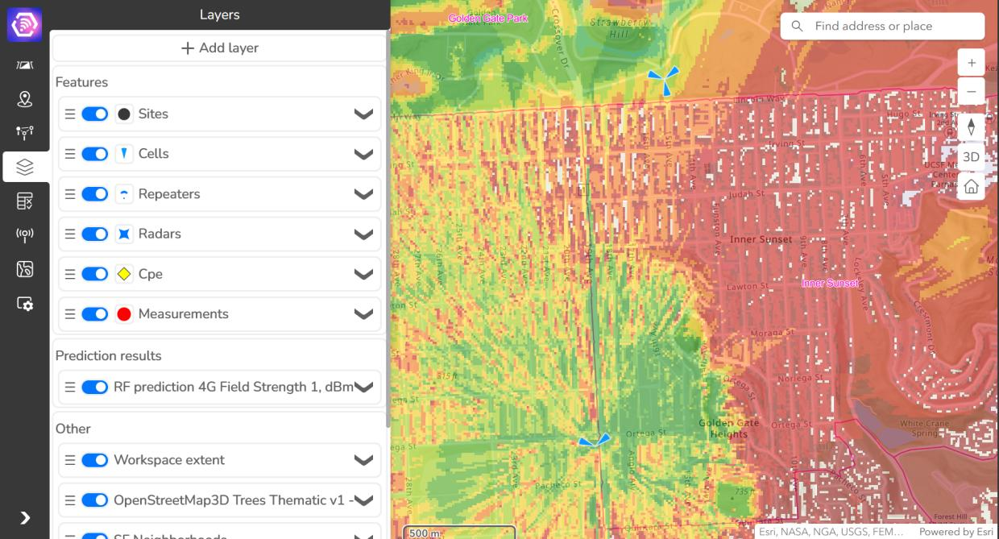

Layers tool.
| Parameter | Description |
|---|---|
| Rearrange layers | Allows you to reorder layers by dragging. |
| Turn on/off the layer | Turn on or off a layer in the Map view The layer is visible - • The layer is not visible - • |
| Expand layer | Expand the layer so you can see and edit the symbology. |
Confidential ©Cellular Expert, 2026 Page | 67

---

Cellular Expert Express User Guide 7.3
For these types of layers, the visualization can be edited in the following ways:
- Add threshold using Add color band button
- Adjust threshold value
- Adjust color band
- Adjust color opacity
- Delete threshold using Delete band button
Upon hovering the mouse over a prediction result item, options for it appear.
Confidential ©Cellular Expert, 2026 Page | 68

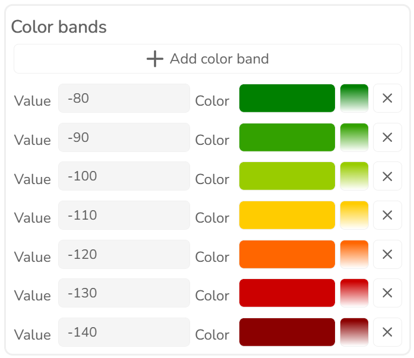

---

Cellular Expert Express User Guide 7.3
Rename layer
Publish to portal
Zoom to layer
[Compare](#kw:98-compare-predictions:ce-pro-rcp)
Remove layer
3.1.4.3.1 Presets
It is possible to create symbology presets. This means that when a prediction raster is loaded, a symbology
preset can be used:
Confidential ©Cellular Expert, 2026 Page | 69

---

Cellular Expert Express User Guide 7.3
To create a preset, first define the bands and colors, then press New color band preset button.
Define a preset name.
A new preset will be created.
The defined preset will be applied the next time when the raster will be loaded.
Apply
Applies a preset symbology for the current prediction raster layer.
3.1.4.3.2 Swipe
The Swipe widget enables you to easily [compare](#kw:98-compare-predictions:ce-pro-rcp) the content of different layers in a map. Mouse over the
layers you want to compare and press the compare button.
When the first and second layers are selected for comparison, a swipe widget will appear on

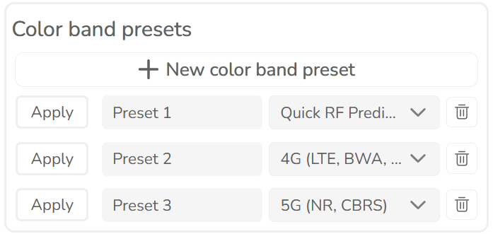

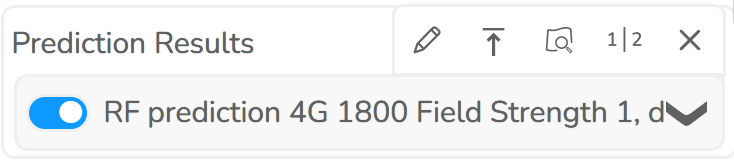

the map. Slide the swipe tool to compare different layers.
Confidential ©Cellular Expert, 2026 Page | 70

---

Cellular Expert Express User Guide 7.3
3.1.4.3.3 Publish to portal
Raster prediction results may be individually published to portal by using the publish to portal button.

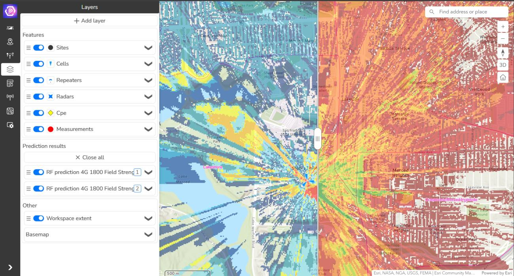

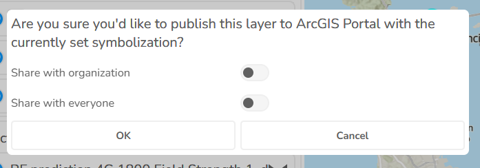
Upon clicking this button, publishing settings will appear:
Set up the publishing options and click OK to start the publishing process.
3.1.4.4 Geodata
This section appears when enabled in the settings.
Confidential ©Cellular Expert, 2026 Page | 71

---

Cellular Expert Express User Guide 7.3
Section contains geodata raster layers from the geodata set assigned to the current workspace.
- Elevation:
Confidential ©Cellular Expert, 2026 Page | 72

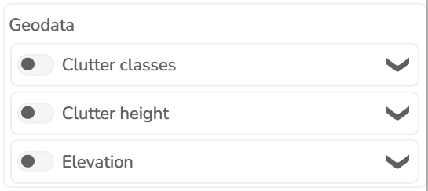

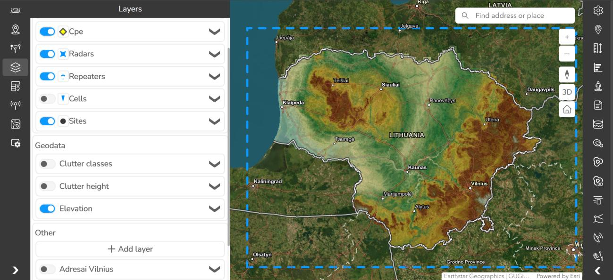

---

Cellular Expert Express User Guide 7.3
- Clutter height:
- [Clutter classes](#kw:clutter-classification-values:ce-express-geodata):
3.1.5 [Prediction history](#kw:44-step-4-prediction-history-and-result-management:ce-express-tr-rf)
Click this button to open Prediction history tool.
Confidential ©Cellular Expert, 2026 Page | 73

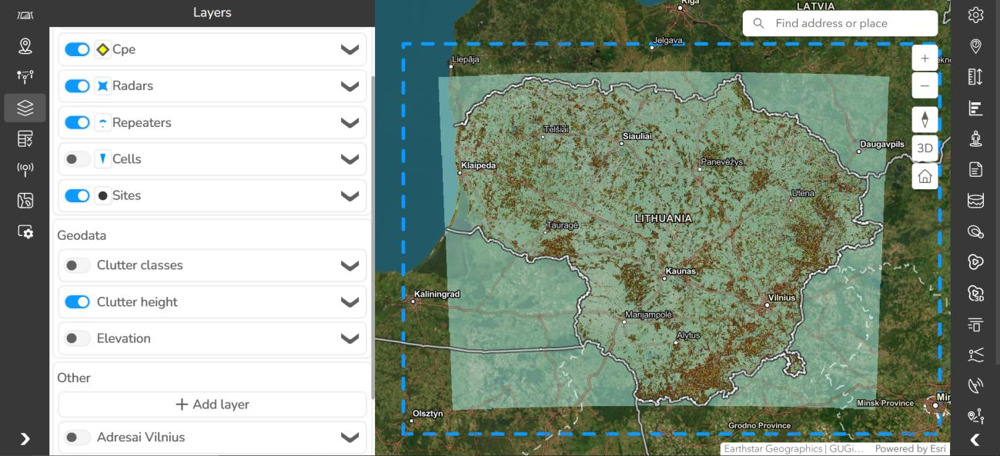

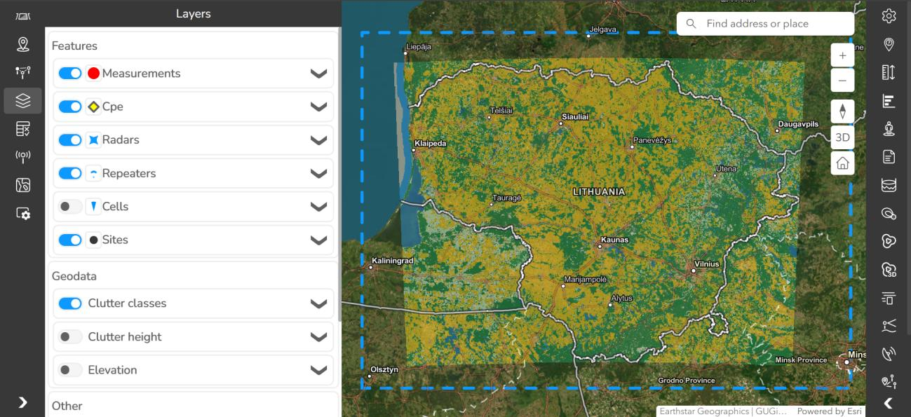

---

Cellular Expert Express User Guide 7.3
All calculations performed in Cellular Expert Express are loaded in this tool. This includes failed and
successful calculations. The accessibility of prediction rasters is user specific. This means that users can

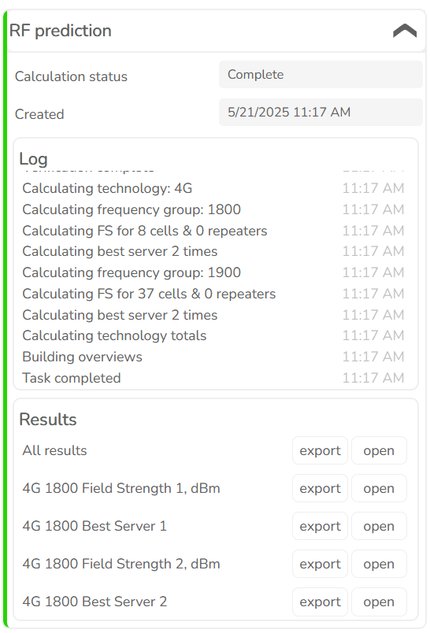
not view the prediction results of other users, except the owner of the prediction results shares them with
the organization.
| Parameter | Description |
|---|---|
| Calculation status | Status of the current calculation |
| Log | The tool shows the progress of a prediction in the Task log section. |
| Results | Select which prediction results you want to add to the Map view and manage in the layers tool. |
| Export | Exports the selected prediction results layer as a TIF raster. |
| Open | Opens the selected prediction results layer. Upon hovering the mouse over a prediction result item, options for it appear. |
Confidential ©Cellular Expert, 2026 Page | 74

---

Cellular Expert Express User Guide 7.3
Rename layer
Share
Mouse over the calculation you want to share with the organization members and click Share calculation
task button.
Delete
Deletes the calculation from the Prediction History widget.
3.1.6 Antennas
Click this button to open Antennas tool.
Preview the list of available antennas in the project. The antennas are used for point-to-area calculations.

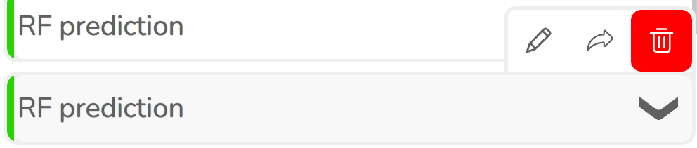

Confidential ©Cellular Expert, 2026 Page | 75

---

Cellular Expert Express User Guide 7.3
Search
Initiates the search procedure in the antennas list.
Delete antenna
Delete antenna using Delete button.
Click on an antenna to preview the [antenna patterns](#kw:importing-antenna-patterns:ce-express-antenna).
Confidential ©Cellular Expert, 2026 Page | 76

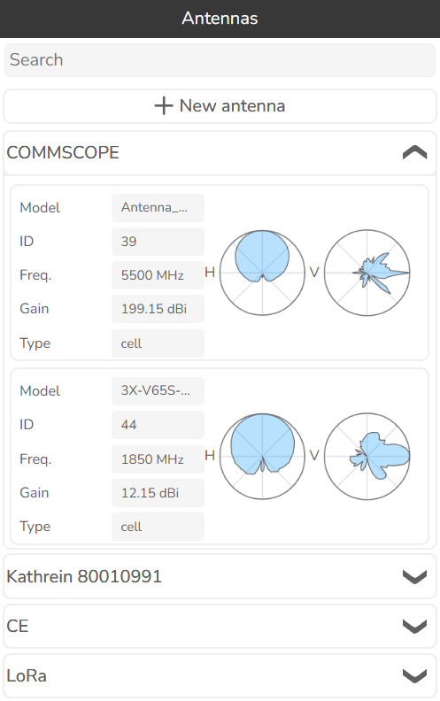

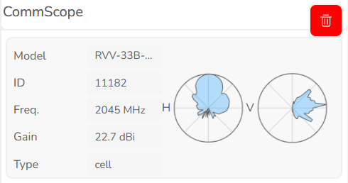

---

Cellular Expert Express User Guide 7.3
Adjust vertical pattern
In the case where you have an electrically tilted vertical [antenna pattern](#kw:managing-the-antenna-library:ce-express-antenna) imported, you might want to tilt it
back so it is essentially a 0 tilt [antenna pattern](#kw:managing-the-antenna-library:ce-express-antenna) (recommended if you use electrical tilt field in cell attributes).
You may use the adjust vertical pattern tool to do this. Find the center of the main lobe of the vertical
[antenna pattern](#kw:managing-the-antenna-library:ce-express-antenna) using the “main lobe center” slider, then click accept.
Confidential ©Cellular Expert, 2026 Page | 77

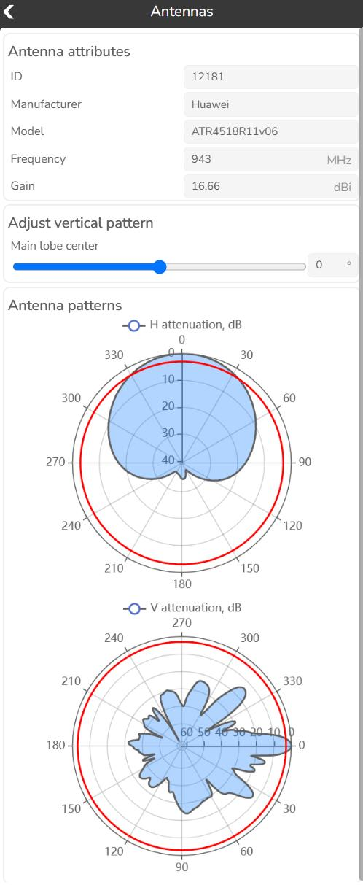

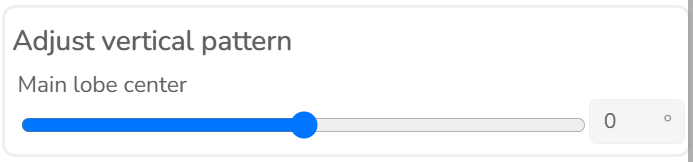

---

Cellular Expert Express User Guide 7.3
3.1.6.1 Import Antennas
To import new antennas, click the New Antenna button
and then select Import Files.
To start the import procedure, select or drag and drop the antenna pattern file. Planet format antenna

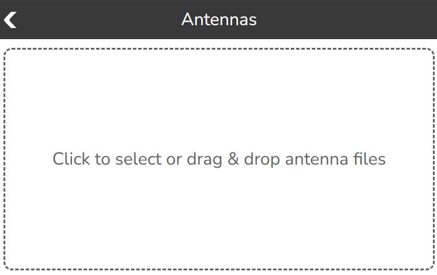

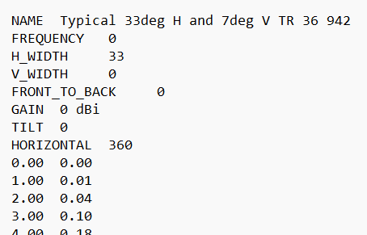
pattern files are supported. Here is an example:
Confidential ©Cellular Expert, 2026 Page | 78

---

Cellular Expert Express User Guide 7.3
3.1.6.1 Import HCM code file
To import HCM code patterns as antennas, you may use this import option. The required file is a CSV with
3 fields, antenna gain, horizontal HCM code and vertical HCM code. These are then combined and imported
as antenna patterns under the HCM manufacturer group. Multiple lines are allowed.
CSV file example:
After file upload, you are prompted to assign which CSV field corresponds to the required parameters:
3.1.6.2 Import cell array antenna
If you have separate pattern files for a multibeam antenna, you may use this import option to combine them

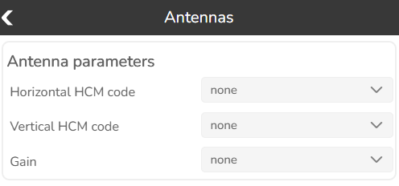

into a single cell array antenna pattern.
Confidential ©Cellular Expert, 2026 Page | 79

---

Cellular Expert Express User Guide 7.3
Antenna parameters
| Parameter | Description |
|---|---|
| Manufacturer | Antenna manufacturer. |
| Model | Antenna name. |
| Frequency | Antenna frequency value in MHz. |
| Gain | Antenna gain value in dBi. |
Confidential ©Cellular Expert, 2026 Page | 80

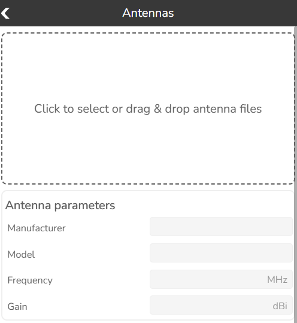

---

Cellular Expert Express User Guide 7.3
3.1.6.3 Create manually
To manually create an antenna, click the New Antenna button
and then select Create Manually.
Confidential ©Cellular Expert, 2026 Page | 81

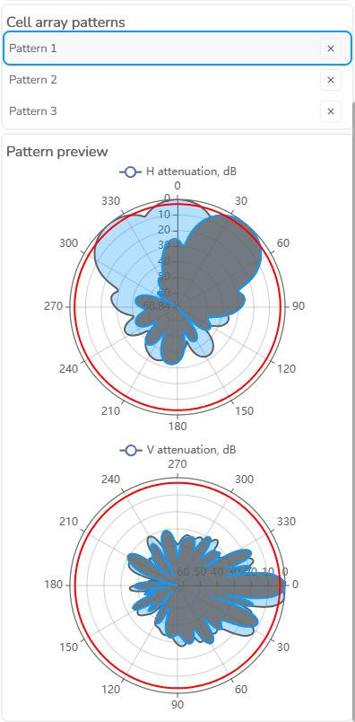

---

Cellular Expert Express User Guide 7.3
Antenna parameters
Manufacturer
Antenna manufacturer (company or entity).
Model
Antenna name.
Confidential ©Cellular Expert, 2026 Page | 82

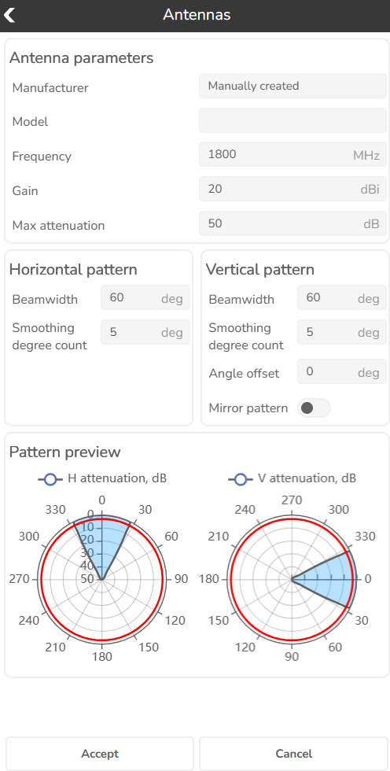

---

Cellular Expert Express User Guide 7.3
| Parameter | Description |
|---|---|
| Frequency | Antenna frequency value in MHz. |
| Gain | Antenna gain value in dBi. |
| Max attenuation | Attenuation value assigned to the attenuated parts of the antenna pattern |
Horizontal pattern
| Parameter | Description |
|---|---|
| Beamwidth | Antenna’s vertical beamwidth value in degrees. Used for generating the antenna pattern. |
| Smoothing degree count | Transition width between attenuated and non-attenuated parts of the antenna pattern in degrees. The attenuation values are linearly interpolated between 0 and the max attenuation value within this transition range. |
| Angle offset | Transition width between attenuated and non-attenuated parts of the antenna pattern in degrees. The attenuation values are linearly interpolated between 0 and the max attenuation value within this transition range. |
| Mirror pattern | Ability to mirror the vertical attenuation pattern. |
Pattern preview
Confidential ©Cellular Expert, 2026 Page | 83

---

Cellular Expert Express User Guide 7.3
3.1.7 Geodata sets
Click this button to open Geodata sets tool.
Geodata sets are collections of geographical raster data that is used in CE calculations. Geodata sets are
comprised of the following raster types:
Elevation – DTM (Digital terrain model), each pixel defines the absolute terrain height above sea level. No
buildings or other obstacles are included in this height.
Clutter height (optional) – Relative height of obstructions (buildings, forests, etc.) above elevation.
[Clutter classes](#kw:clutter-classification-values:ce-express-geodata) (optional) – Each pixel defines the ID of the clutter class, which the area belongs to.
Usually derived from land use data. If building heights are included in the clutter height raster, the clutter

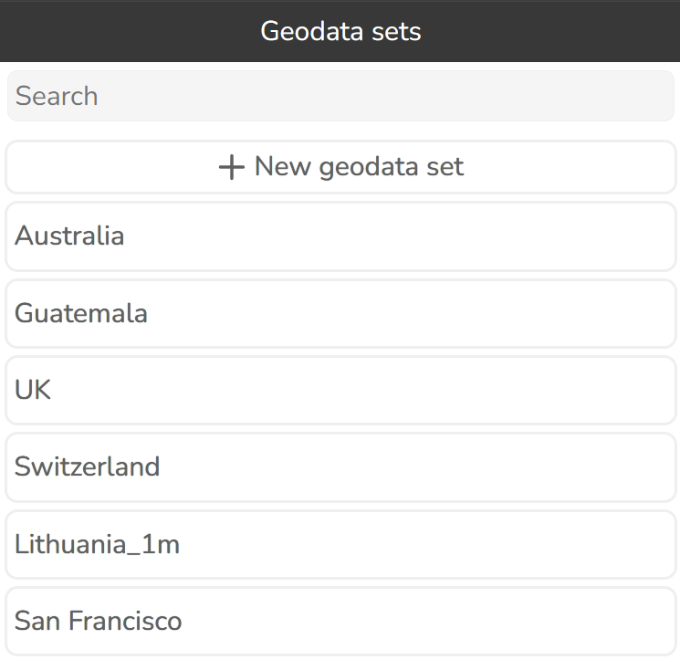
classes raster must have building outlines separated into their own class ID.
To edit a geodata set, click the desired geodata set name from the list. To create a new one, click “+ New
geodata set”.
When creating a new geodata set, some general details, like the geodata set name, must be entered and
Confidential ©Cellular Expert, 2026 Page | 84

---

Cellular Expert Express User Guide 7.3
saved. Only then you may then upload the geodata rasters to the set after selecting it from the list.
Under the rasters section, there are 3 File upload squares for uploading the rasters. Click to select a file

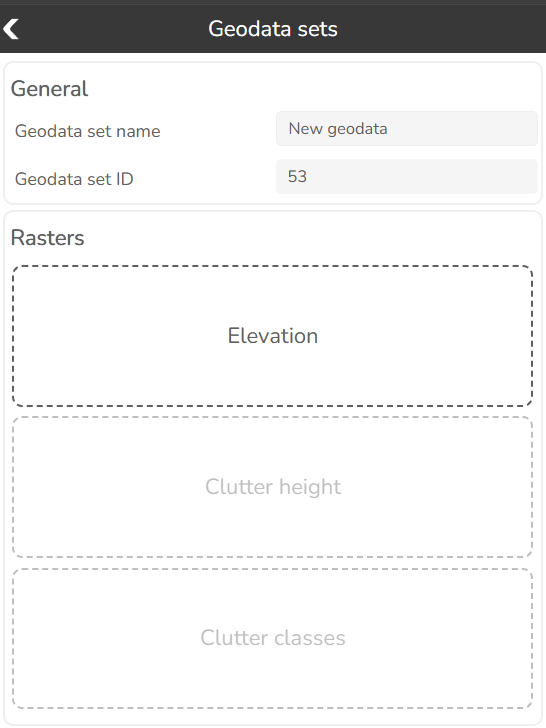
or drag & drop to upload a raster file.
Uploaded rasters have the following requirements:
- Must be in projected coordinate system
- Coordinate system units must be meters
- All rasters must have the same coordinate system
- Raster resolution in X and Y axis must match
After uploading rasters, the file upload squares change to green, and show some metadata, like upload
date and resolution, about the uploaded raster files.
The data extent is also outlined in green on the map when a geodata set is selected:
Confidential ©Cellular Expert, 2026 Page | 85

---

Cellular Expert Express User Guide 7.3
3.1.7.1 [Clutter classes](#kw:clutter-classification-values:ce-express-geodata)
If a clutter class raster is available in the geodata set, the clutter classes section should be set up to
represent the data in the file.
All available clutter class raster values are listed under the “Used” and “Unused” categories.
Each relevant clutter class needs these fields filled out:
IDs in geodata raster – clutter class IDs from your uploaded clutter classes raster need to be assigned to
predefined clutter classes within CE. For example if your clutter classes raster has buildings outlined with
the ID of 2, you would need to assign “2” to the buildings clutter class in the menu. Multiple IDs may be
assigned to each class.
Height – Nominal height for clutter class if it is not represented in the clutter height raster. If you already

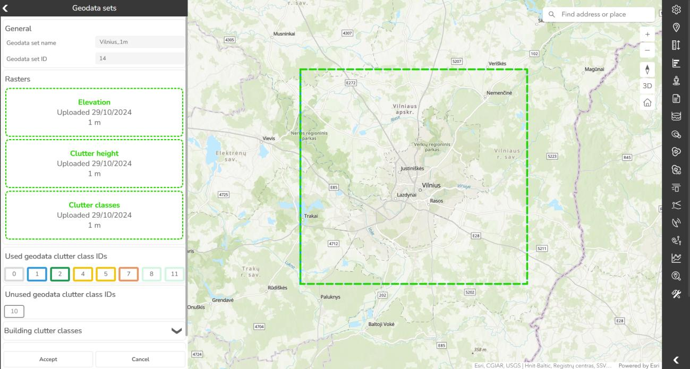

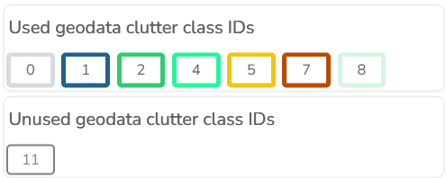
have heights for this class in the clutter height raster, this should be set to 0.
Confidential ©Cellular Expert, 2026 Page | 86

---

Cellular Expert Express User Guide 7.3
Color – the color by which the clutter class is represented in different UI elements, for example – the profile

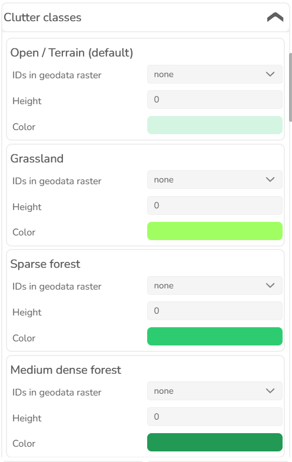
chart.
3.1.8 Feature templates
Feature templates serve the purpose of allowing the user to quickly fill out feature parameters from pre-
saved data. In the case of feature creation, you can fill out the parameters by selecting a feature template
in the add features tool. In the case of starting some calculations, you may pick a template from which
missing feature parameters will be filled during the calculation. The feature templates tool allows you to set
up these templates before using them.
Confidential ©Cellular Expert, 2026 Page | 87

---

Cellular Expert Express User Guide 7.3
After opening the tool, you get to choose which feature type you want to manage templates for.
After selecting the feature type, a list of existing feature templates is shown, click an existing feature

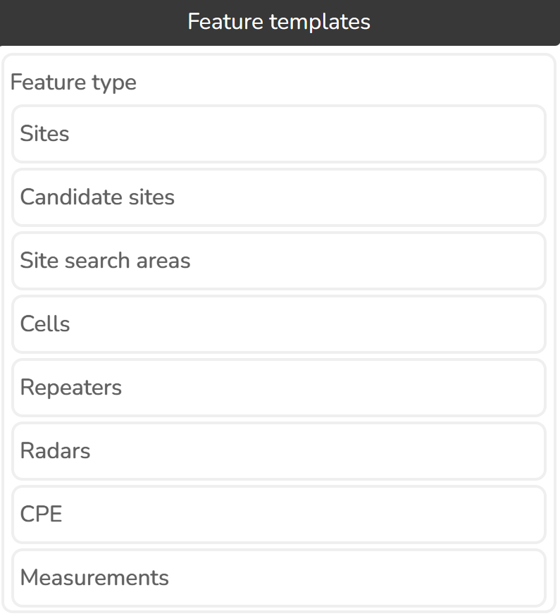

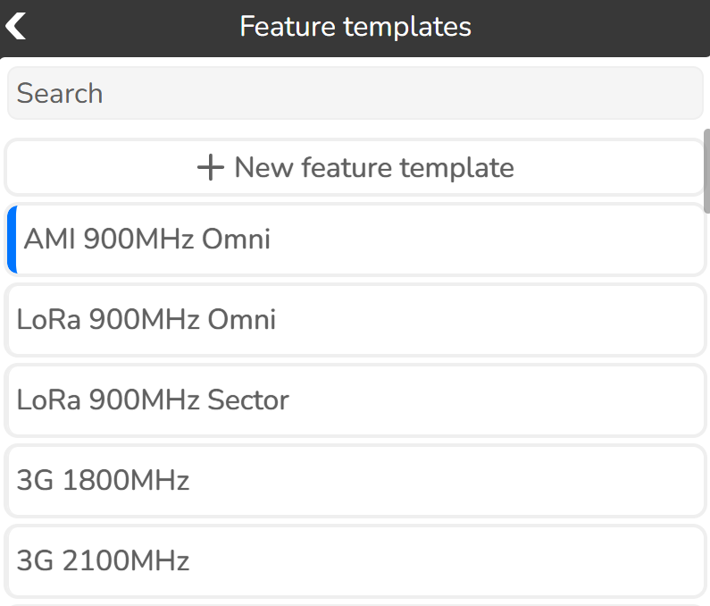
template to edit it, or click new feature template to create a new one.
Confidential ©Cellular Expert, 2026 Page | 88

---

Cellular Expert Express User Guide 7.3
Upon hovering the mouse over a feature template, options for it appear.
Mark as favorite
Delete Feature template
3.1.9 Prediction [models](#kw:31-models:ce-express-tr-models)
Click this button to open Prediction models tool.
The CE Path Loss Modelling aims to perform near-deterministic calculation of received signal levels at each
specific point (pixel) in the network’s target coverage area by applying selective path loss model depending
on the radio visibility condition between the transmitter antenna vis-à-vis a receiver antenna located at a
given point in coverage area. The radio visibility is evaluated based on the DTM, Obstacles and Clutter
path profile information. This verification of radio visibility will result in the receiver antenna point assigned

into one of three possible radio visibility conditions:
- [Line-of-Sight](#kw:running-a-profile:ce-express-profile) (LOS) – occurs when there are neither terrain irregularities, obstacles or clutter
interposing the direct radio path between the transmitter and receiver antennas. The radio path is
understood to include the 1st [Fresnel zone](#kw:fresnel-zone-clearance:ce-express-profile) around the direct line and account for Spherical Earth
effect. The LOS condition is illustrated by the path profile depicted in Fig. 3(a).
- Obstructed LOS (OLOS) – occurs when the direct radio propagation line is interposed by clutter,
see illustration in Fig. 3(b).
- Non-LOS (NLOS) – occurs when the direct radio propagation line is interposed by terrain bulges
or obstacles, see illustration in Fig. 3(c).
Confidential ©Cellular Expert, 2026 Page | 89

---

Cellular Expert Express User Guide 7.3
a. Example of path profile with LOS condition (green line of direct radio link)
b. Example of path profile with OLOS condition (yellow segment of radio link path)
(c) Example of path profile with NLOS condition (red segment of radio link path)
Confidential ©Cellular Expert, 2026 Page | 90

---

Cellular Expert Express User Guide 7.3
(d) Example of path profile with OLOS+NLOS condition (yellow+red segment of radio link path)
Depending on the LOS condition for the receive antenna at specific location (area map pixel), the CE tools

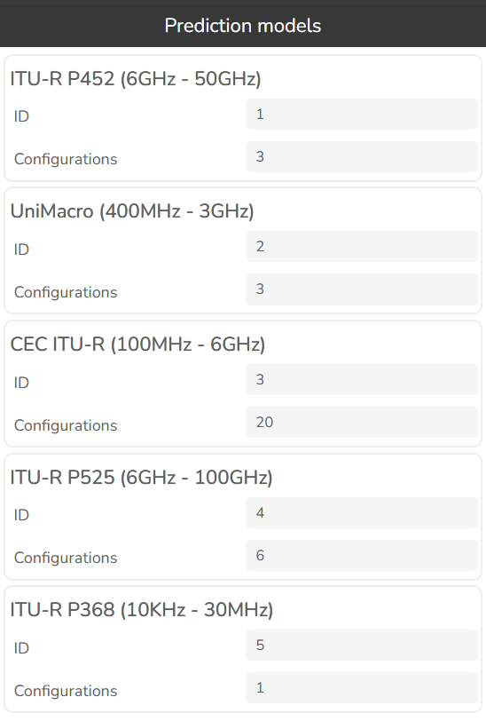
will apply the specific sub-set of path loss prediction model, as explained in the following section.
Prediction models available in Cellular Expert support frequencies from 10kHz to 350 GHz.
Confidential ©Cellular Expert, 2026 Page | 91

---

Cellular Expert Express User Guide 7.3
CEC ITU-R Model (100MHz – 6GHz) is a combination model intended for use in a variety of different
radiocommunication systems which is derived explicitly from ITU-R path loss modelling methods as
follows:
a. Receive antenna in LOS condition – path loss calculated as FSL based on Recommendation ITU-
R P.525 (ref URL).
b. Receive antenna in OLOS condition – total path loss modelled as a combination of basic FSL
calculated based on Recommendation ITU-R P.525 (ref URL) with included dual slope option and
CE combined clutter loss modelling, which is the combination of Recommendation ITU-R P.2108
(ref URL) and ITU-R P.833 (2015) Attenuation in vegetation.
c. Receive antenna in NLOS condition – path loss as a combination of basic FSL calculated based
on Recommendation ITU-R P.525 (ref URL) with included dual slope option, additional losses due
to diffraction calculated based on Recommendation ITU-R P.526 (ref URL).
d. Receive antenna in OLOS+NLOS condition – path loss as a combination of basic FSL calculated
based on Recommendation ITU-R P.525 (ref URL) with included dual slope option, additional
losses due to diffraction calculated based on Recommendation ITU-R P.526 (ref URL), and CE
combined clutter loss modelling, which is the combination of Recommendation ITU-R P.2108 (ref
URL) and Single Knife-Edge diffraction.
e. Receive antenna in the clutter (building, vegetation, etc) – path loss is calculated as described
above based on LOS, OLOS and NLOS conditions, and additional penetration loss is added to
simulate Outdoor-to-Indoor scenario which is based on ITU-R P.833 recommendation.
ITU-R P.452 Model (6GHz – 50GHz) is provided as a universally applicable model with a very wide
frequency range from 0.1-50 GHz. Its implementation is based on the methodology described in the
Recommendation ITU-R P.452 (ref URL). This model does not provide for definition of OLOS visibility
condition; instead, it considers clutter as part of the general obstacles category and accordingly
distinguishes only two radio visibility cases:
a. Receive antenna in LOS condition – path loss model based on FSL principle.
b. Receive antenna in NLOS condition – total path loss modelled using a combination of basic
transmission losses and losses due to diffraction.
ITU-R P.1546 Model (30MHz – 4GHz) (ref URL) is a widely recognized radio propagation prediction method
developed by the International Telecommunication Union (ITU). It is primarily used for estimating point-
to-area radio signal coverage in the frequency range from 30 MHz to 4000 MHz over terrestrial paths.
This model is especially suitable for broadcasting, land mobile, and fixed services.
Key Features
- Versatile Application: Supports predictions over land, sea, and mixed paths, making it adaptable
to various geographic conditions.
- Input Parameters: Takes into account factors such as transmitter and receiver heights, terrain
profile, clutter (buildings, vegetation), climate, and time/location variability.
- Time and Location Variability: Predictions can be tailored for different statistical reliability levels
(e.g., 50% or 10% time availability).
- Clutter and Terrain Handling: The model can incorporate detailed digital elevation models
(DEM) and clutter data for more accurate predictions, reflecting the influence of buildings, forests,
and other surface features.
Use in Cellular Expert
In the Cellular Expert software, the ITU-R P.1546 model is implemented to support real-world coverage
planning and regulatory studies. Users can configure environmental parameters and resolution settings
to match local conditions and improve prediction accuracy.
Confidential ©Cellular Expert, 2026 Page | 92

---

Cellular Expert Express User Guide 7.3
LOS ITU-R P.525 Model (6GHz – 100GHz) is the FSL path loss calculated based on the method in
Recommendation ITU-R P.525 (ref URL). As such it could be used for modelling radio links where LOS is
considered a necessary condition, e.g., for Fixed (Point-to-Point) Links or Mobile Systems in [mmWave](#kw:56-step-8-losonly-prediction-for-mmwave:ce-express-tr-models)
bands.
UniMacro Model (400MHz – 3GHz) is the CE’s proprietary combination model developed over the years
of practical experience with the operational planning of cellular mobile networks in the frequency ranges
from 400-3000 MHz. It had been fine-tuned to produce coverage predictions that are most closely aligned
with what could be expected to be experienced by the actual mobile network users in the field. The model
will model different path losses depending on radio visibility conditions as follows:
a. Receive antenna in LOS condition – path loss model based on FSL principle and dual slope based
on breakpoint distance.
b. Receive antenna in OLOS condition – path loss modelled using Extended Hata (Open Area) model
and CE combined clutter loss modelling, which is the combination of Recommendation ITU-R
P.2108 (ref URL) and ITU-R P.833 (2015) Attenuation in vegetation.
c. Receive antenna in NLOS condition – path loss modelled using Extended Hata model with
additional losses due to diffraction calculated based on Recommendation ITU-R P.526 (ref URL).
d. Receive antenna in OLOS+NLOS condition – path loss modelled using Extended Hata (Open Area)
model with additional losses due to diffraction calculated based on Recommendation ITU-R P.526
(ref URL), and CE combined clutter loss modelling, which is the combination of Recommendation
ITU-R P.2108 (ref URL) and Single Knife-Edge diffraction.
e. Receive antenna in the clutter (building, vegetation, etc) – path loss is calculated as described
above based on LOS, OLOS and NLOS conditions, and additional penetration loss is added to
simulate Outdoor-to-Indoor scenario which is based on ITU-R P.833 recommendation.
ITU-R P.368 (10kHz – 30MHz) provides a standardized prediction method for assessing the ground-wave
field strength of radio waves in the 10 kHz to 30 MHz frequency range. This frequency band is primarily
associated with long-range communication systems using amplitude modulation (AM) and shortwave
bands, often for maritime, aeronautical, military, and broadcasting services.
This model offers guidance for engineers, planners, and researchers working on system design and
analysis in the MF (Medium Frequency) and HF (High Frequency) bands.
The ITU-R P.368 model calculates signal strength based on several key environmental and system
parameters:
- Frequency (f)
Higher frequencies tend to attenuate more rapidly over ground. The attenuation rate increases
significantly above 3 MHz.
- Distance (d)
Field strength diminishes with increasing distance due to geometrical spreading and absorption by
the ground and atmosphere.
- Surface refractivity, Surface Conductivity (σ) and Relative Permittivity (εᵣ)
The surface over which the wave propagates critically affects signal strength:
- Sea water: High conductivity, minimal loss
- Dry land or desert: Low conductivity, high loss
- Typical values range from:
o Conductivity: 10⁻⁴ to 5 S/m
Confidential ©Cellular Expert, 2026 Page | 93

---

Cellular Expert Express User Guide 7.3
o Relative permittivity: 4 to 81
ISO 9613 standard provides a validated, practical method for predicting the outdoor propagation of sound,
and is increasingly applied in siren sound modeling within public security, emergency warning systems, and
defense operations. This modeling ensures that acoustic alert systems (e.g. civil defense sirens, disaster
warnings, military alert signals) achieve their intended coverage, intelligibility, and effectiveness across
various terrain and urban environments.
Purpose in the Public Security Context
In emergency and defense scenarios, reliable audibility of sirens is critical for:
- Civil alert and evacuation systems
- Military base perimeter alarms
- Air raid or missile defense warning networks
- Disaster alert systems (e.g. earthquakes, tsunamis, nuclear incidents)
By applying ISO 9613-2, engineers can model how far a siren can be heard under specific environmental
conditions, optimizing:
- Placement and spacing of sirens
- Sound power selection
- Minimization of acoustic shadow zones
- Compliance with national safety and civil defense regulations
The model assumes standard favorable propagation:
- Downwind or moderate inversion conditions
- Ambient temperature ~10 °C
- Relative humidity ~70%
These are conservative conditions ensuring that siren reach is never overestimated, supporting public
safety margin planning.
CEC 3GPP TR Indoor is used in indoor environments (in building) for wireless communication simulations.
This model is standardized by 3GPP (3rd Generation Partnership Project) and is part of the TR 38.901
technical report, which specifies channel models for frequencies from 0.5 GHz to 100 GHz. Cellular expert
version requires to convert CAD drawing into a clutter height raster file which is imported to workspace. By
toggle ON “Load geodata when opening workspace” this raster file becomes visible, allowing for accurate
placement and planning new transmitters as indoor antennas.
Confidential ©Cellular Expert, 2026 Page | 94

---

Cellular Expert Express User Guide 7.3
In the left ribbon, navigate to Layers → Geodata, expand Clutter Heights, and set the opacity to 100% to
enhance building visibility. For more accurate RF prediction, use a high-resolution grid of 0.1 meters in
the prediction model to account for wall thickness and fine structural details.
3.1.9.1 CEC ITU-R Model
This deterministic model is designed for precise tracking of the main, strongest radio ray, while also
empirically modeling the scattering of other rays around the receiver. It applies to all ranges of cellular
mobile and public safety networks, including 2G, 3G, 4G, and 5G, within the 100 MHz to 6 GHz frequency
range.
The model is recommended for accurate wide-area propagation and coverage modeling, especially when
precise and up-to-date topographic data are available. This includes Digital Terrain Models (DTM), building
data (including height information), and vegetation data (with height details) derived from a Digital Surface

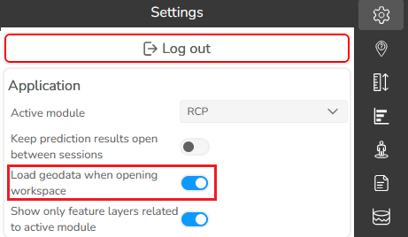
Model (DSM). Ideally, these data should be created with LiDAR or similar methods, at a resolution of at
least 10 meters, though 5, 2, or even 1 meter or higher is preferable for optimal accuracy.
When building data and their heights are not available, and only DTM and clutter data at a resolution of 10
meters or lower are accessible, the UniMacro Model should be considered for wide-area propagation and
coverage modeling in a slightly narrower frequency range of 400 MHz to 3 GHz.
3.1.9.1.1 CEC ITU-R Model settings
Confidential ©Cellular Expert, 2026 Page | 95

---

Cellular Expert Express User Guide 7.3
| Parameter | Description |
|---|---|
| Configuration name | Name of the prediction configuration name. |
| Radius | Maximum prediction radius in kilometers to calculate path loss. |
| Receiver height | Receiver height above the receiver reference height selected in the workspace settings. |
| Effective earth radius | Earth radius in kilometers, used for the calculations. |
| Offset coefficient | Represents the offset in decibels added to the path loss grid. The default value is 37 dB. |
| Distance coefficient | Defines the slope based on the distance between the cell and the receiver location, with a default value of 20. |
| Distance coefficient obstructed | Represents the slope based on the obstructed distance between the cell and the receiver location. The default value is 30. |
| Frequency coefficient | Indicates the slope determined by the frequency value, with a default value of 20. |
Confidential ©Cellular Expert, 2026 Page | 96

---

Cellular Expert Express User Guide 7.3
The Clutter Class option defines several predefined clutter categories, each with unique values for
diffraction loss, clutter loss, penetration loss, and receiver loss coefficients. These parameters describe
how a signal is impacted when it passes through or terminates in a specific clutter class.
Nominal distance
The average distance between objects within the clutter class, ranging from 1 to 100 meters.
Diffraction loss coefficient
A multiplier used in diffraction calculations. Lower values result in reduced diffraction loss, while higher

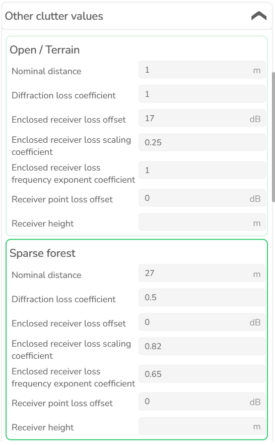
values increase it. Typically, this coefficient is higher for buildings compared to forests or other clutter
Confidential ©Cellular Expert, 2026 Page | 97

---

Cellular Expert Express User Guide 7.3
types.ltiplier for diffraction calculations. If value is lower, diffraction will be lower, if higher – then diffraction
will be higher. Usually, for buildings clutter class this parameter is higher then forest or other clutter classes.
Enclosed receiver loss offset
The initial entry loss into an obstacle within the clutter class, expressed as an offset in dB, which is added
to the path loss grid. Applies when receiver point ends up enclosed within an obstacle within this clutter
class.
Enclosed receiver loss scaling coefficient
Represents additional signal loss as a function of the distance travelled in an obstacle within the clutter
class. Higher values increase path loss. Applies when receiver point ends up enclosed within an obstacle
within this clutter class.
Enclosed receiver loss frequency exponent coefficient
Reflects additional loss inside an obstacle within the clutter class based on frequency. Higher values
increase path loss, particularly at higher frequencies. Applies when receiver point ends up enclosed within
an obstacle within this clutter class.
Receiver point loss offset
An additional loss offset in dB applied to the path loss grid, representing user equipment (UE) losses.
Receiver height
Receiver height value used when receiver lands on this clutter class. If this value is not defined, the main
receiver height value defined in the prediction model is used.
Clutter Classes default values
Nominal Diffraction Enclosed Enclosed Enclosed Receiver
Distance loss receiver receiver receiver point loss
coefficient loss offset loss loss offset
scaling frequency
coefficient exponent
coefficient
1 1 17 0.25 1 0
| Parameter | Description |
|---|---|
| Open / Terrain | 27 0.5 0 0.82 0.65 0 |
| Grassland | 27 0.5 0 0.82 0.65 0 |
| Sparse forest | 27 0.5 0 0.89 0.65 0 |
| Medium dense forest | 15 0.5 0 0.95 0.65 0 |
| Very dense forest | 27 0.5 0 0.89 0.65 0 |
Low density urban (Low
buildings)
27 0.5 0 0.89 0.65 0
Low density urban
(High buildings)
15 0.6 0 0.89 0.65 0
Medium density urban
(Low buildings)
15 0.6 0 0.89 0.65 0
Medium density urban
(High buildings)
10 0.7 0 0.89 0.65 0
High density urban
Confidential ©Cellular Expert, 2026 Page | 98

---

Cellular Expert Express User Guide 7.3
(Low buildings)
10 0.7 0 0.89 0.65 0
High density urban
(High buildings)
10 0.7 0 0.89 0.65 0
High density urban
| Parameter | Description |
|---|---|
| (Very high buildings) | 15 0.6 0 0.89 0.65 0 |
| Building blocks | 27 0.5 0 0.89 0.65 0 |
| Transportation | 27 0.5 0 0.89 0.65 0 |
| Agriculture | 27 0.5 0 0.89 0.65 0 |
| Plantation | 27 0.5 0 0.89 0.65 0 |
| Parks | 27 0.6 0 0.89 0.65 0 |
| Airport | 27 0.5 0 0.89 0.65 0 |
| Sea | 27 0.5 0 0.89 0.65 0 |
| Inland water | 1 1 5 0.25 1 0 |
| Concrete building | 1 1 2 0.25 1 0 |
| Glass building | 1 0.6 2 0.25 1 0 |
| Wood building | 1 1 8.5 0.25 1 0 |
| Low loss building | 1 1 17 0.25 1 0 |
High loss building
3.1.9.2 ITU-R P.452 Model
This model is designed to estimate radio signal propagation over long distances, including terrestrial paths.
It is specifically designed to predict signal attenuation caused by various mechanisms, such as diffraction,
tropospheric scatter, ducting, and reflections from the Earth's surface, across frequencies ranging from 0.1
GHz to 50 GHz. While other prediction model covers frequencies from 100MHz to 6GHz, we recommend
to use it from 6GHz to 50GHz frequencies.
This model is particularly well-suited for microwave links and is widely used for planning and interference
analysis in fixed and mobile radio communication systems. By accounting for the effects of terrain,
atmospheric conditions, and other factors, it helps engineers assess link reliability and optimize network
performance in a variety of environmental scenarios.
3.1.9.2.1 ITU R. P452 Model settings
Confidential ©Cellular Expert, 2026 Page | 99

---

Cellular Expert Express User Guide 7.3
| Parameter | Description |
|---|---|
| Configuration name | Name of the prediction configuration name. |
| Radius | Maximum prediction radius in kilometers to calculate path loss. |
| Receiver height | Receiver height above the receiver reference height selected in the workspace settings. |
| Effective earth radius | Earth radius in kilometers, used for the calculations. |
| Offset coefficient | Represents the offset in decibels added to the path loss grid. The default value is 37 dB. |
| Distance coefficient | Defines the slope based on the distance between the cell and the receiver location, with a default value of 20. |

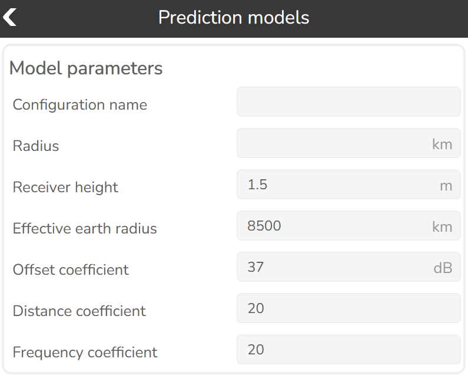
20.
Frequency coefficient
Indicates the slope determined by the frequency value, with a default value of 20.
Clutter class option describes several fixed Clutter names with penetration loss coefficients. These
parameters describe how a signal is impacted when it passes through or terminates in a specific clutter
class.
Confidential ©Cellular Expert, 2026 Page | 100

---

Cellular Expert Express User Guide 7.3
Enclosed receiver loss offset
The initial entry loss into an obstacle within the clutter class, expressed as an offset in dB, which is added

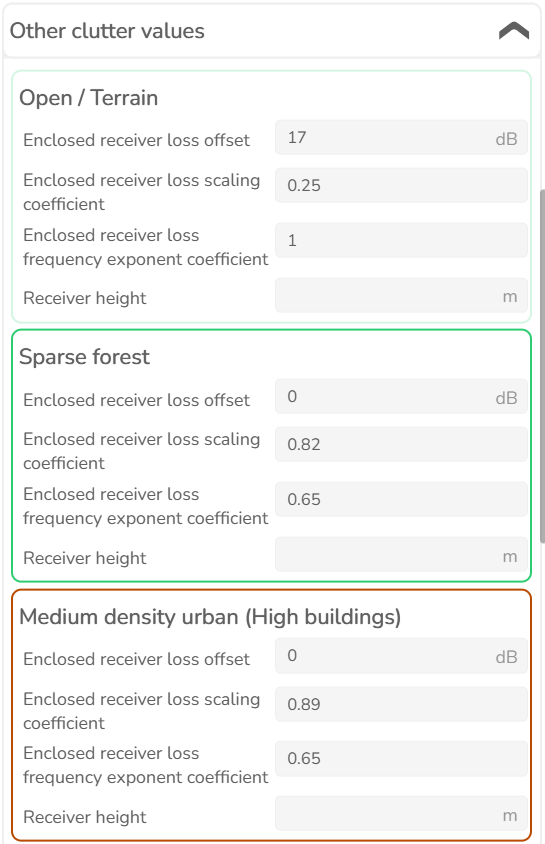
to the path loss grid. Applies when receiver point ends up enclosed within an obstacle within this clutter
class.
Enclosed receiver loss scaling coefficient
Represents additional signal loss as a function of the distance travelled in an obstacle within the clutter
class. Higher values increase path loss. Applies when receiver point ends up enclosed within an obstacle
within this clutter class.
Enclosed receiver loss frequency exponent coefficient
Confidential ©Cellular Expert, 2026 Page | 101

---

Cellular Expert Express User Guide 7.3
Reflects additional loss inside an obstacle within the clutter class based on frequency. Higher values
increase path loss, particularly at higher frequencies. Applies when receiver point ends up enclosed within
an obstacle within this clutter class.
Receiver height
Receiver height value used when receiver lands on this clutter class. If this value is not defined, the main
receiver height value defined in the prediction model is used.
Clutter Classes default values
Enclosed Enclosed receiver Enclosed receiver
receiver loss loss scaling loss frequency
| Parameter | Description |
|---|---|
| offset coefficient exponent coefficient | 17 0.25 1 |
| Open / Terrain | 0 0.82 0.65 |
| Grassland | 0 0.82 0.65 |
| Sparse forest | 0 0.89 0.65 |
| Medium dense forest | 0 0.95 0.65 |
| Very dense forest | 0 0.89 0.65 |
| Low density urban (Low buildings) | 0 0.89 0.65 |
| Low density urban (High buildings) | 0 0.89 0.65 |
Medium density urban (Low
| Parameter | Description |
|---|---|
| buildings) | 0 0.89 0.65 |
| High density urban (Low buildings) | 0 0.89 0.65 |
| High density urban (High buildings) | 0 0.89 0.65 |
High density urban (Very high
| Parameter | Description |
|---|---|
| buildings) | 0 0.89 0.65 |
| Building blocks | 0 0.89 0.65 |
| Transportation | 0 0.89 0.65 |
| Agriculture | 0 0.89 0.65 |
| Plantation | 0 0.89 0.65 |
| Parks | 0 0.89 0.65 |
| Airport | 0 0.89 0.65 |
| Sea | 0 0.89 0.65 |
| Inland water | 5 0.25 1 |
| Concrete building | 2 0.25 1 |
| Glass building | 2 0.25 1 |
Wood building
Confidential ©Cellular Expert, 2026 Page | 102

---

Cellular Expert Express User Guide 7.3

## 8.5 0.25 1

Low loss building
17 0.25 1
High loss building
3.1.9.3 ITU-R P.1546 Model
This model is designed for wide-area radio propagation prediction based on empirical data and statistical
analysis of measured field strengths. It provides path loss estimations over land, sea, and mixed terrain for
frequencies ranging from 30 MHz to 3 GHz, using parameters defined in ITU-R Recommendation P.1546.
The model is applicable to terrestrial broadcasting, mobile, and public safety networks, including
technologies such as 2G, 3G, and 4G, within its frequency range.
The ITU-R P.1546 model accounts for antenna heights, terrain elevation (DTM), land cover types (clutter),
and environmental conditions, incorporating corrections for time variability and location-specific effects. It
is particularly suitable for modeling [line-of-sight](#kw:running-a-profile:ce-express-profile) (LOS) and non-[line-of-sight](#kw:running-a-profile:ce-express-profile) (NLOS) propagation over long
distances where detailed building data is not available.
This model is recommended for national or regional coverage planning, especially in cases where high-
resolution DTM (e.g., 30m) and clutter data (e.g., 10m resolution) are available, but building heights and
detailed 3D structures are not. Its statistical approach allows for reliable estimations of field strength in both

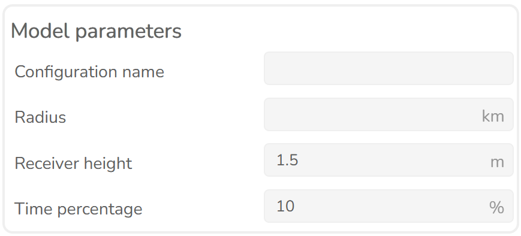
urban and rural environments, without requiring ray-tracing or detailed geometry-based modeling.
For scenarios where accurate building geometry and heights are available and a higher modeling frequency
range (up to 6 GHz) is required, the CEC ITU-R 3GPP Model is recommended instead, offering greater
precision in dense urban and high-frequency applications.
3.1.9.3.1 ITU R. P1546 Model settings
| Parameter | Description |
|---|---|
| Configuration name | Name of the prediction configuration name. |
| Radius | Maximum prediction radius in kilometers to calculate path loss. |
| Receiver height | Receiver height above the receiver reference height selected in the workspace settings. |
| Effective earth radius | Earth radius in kilometers, used for the calculations. |
| Offset coefficient | Represents the offset in decibels added to the path loss grid. The default value is 37 dB. |
| Distance coefficient | Defines the slope based on the distance between the cell and the receiver location, with a default value of 20. |
| Frequency coefficient | Indicates the slope determined by the frequency value, with a default value of 20. |
Confidential ©Cellular Expert, 2026 Page | 105

---

Cellular Expert Express User Guide 7.3
Receiver height
Receiver height value used when receiver lands on this clutter class. If this value is not defined, the main

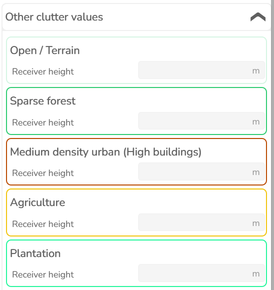
receiver height value defined in the prediction model is used.
3.1.9.5 UniMacro Model
This model is designed for deterministic tracking of the main, strongest radio ray in [Line of Sight](#kw:running-a-profile:ce-express-profile) (LOS)
areas, while propagation modeling in Obstructed [Line of Sight](#kw:running-a-profile:ce-express-profile) (OLOS) and Non-Line of Sight (NLOS) areas
uses empirically determined parameters defined in ITU-R and 3GPP recommendations. It also models the
scattering of other rays around the receiver. The model applies empirically validated values for the 400
MHz to 3 GHz frequency range and is suitable for modeling all cellular mobile and public safety networks,
including 2G, 3G, 4G, and 5G, within that frequency range.
This model is recommended for wide-area propagation and coverage modeling when building data and
their heights are unavailable, and only DTM and clutter data at a resolution of 10 meters or lower are
accessible.
For accurate wide-area propagation and coverage modeling where building data and their heights are
available, the CEC ITU-R 3GPP Model is recommended, offering a broader application frequency range of
100 MHz to 6 GHz.
Confidential ©Cellular Expert, 2026 Page | 106

---

Cellular Expert Express User Guide 7.3
3.1.9.5.1 UniMacro Model settings
| Parameter | Description |
|---|---|
| Configuration name | Name of the prediction configuration name. |
| Radius | Maximum prediction radius in kilometers to calculate path loss. |
| Receiver height | Receiver height above the receiver reference height selected in the workspace settings. |
| Effective earth radius | Earth radius in kilometers, used for the calculations. |
Confidential ©Cellular Expert, 2026 Page | 107

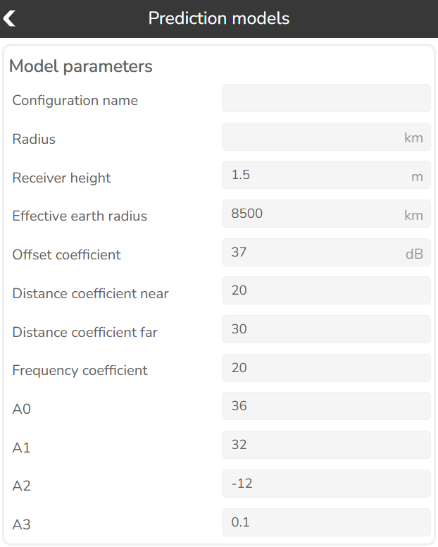

---

Cellular Expert Express User Guide 7.3
| Parameter | Description |
|---|---|
| Offset coefficient | Represents the offset in decibels added to the path loss grid. The default value is 37 dB. |
| Distance coefficient near | Defines the slope based on the distance between the cell and the receiver location, with a default value of 20. |
| Distance coefficient far | Represents the slope based on breakpoint distance between the cell and the receiver location. The default value is 30. |
| Frequency coefficient | Indicates the slope determined by the frequency value, with a default value of 20. |
| A0 | Constant offset in dB this value simply added to loss grid. Adjusting this value, you can minimize mean error. It regulates the absolute level of the loss curve. Default value 36. |
| A1 | Distance influence coefficient. Physically it represents loss dependant on distance such as atmospheric (dust, hydrometeors, etc...) losses. It regulates slope of the curve. Default value 32. |
| A2 | Transmitter height influence coefficient. It is related to errors in DTM, real Earth curvature, etc. It regulates loss curve vertical position like the A0, but with respect to antenna height. Default value -12. |
A3
Okumura-Hata type of multiplying factor for log(h )log(d). Default value 0.1.
M
The Clutter Class option defines several predefined clutter categories, each with unique values for
diffraction loss, clutter loss, penetration loss, and receiver loss coefficients. These parameters describe
how a signal is impacted when it passes through or terminates in a specific clutter class.
Confidential ©Cellular Expert, 2026 Page | 108

---

Cellular Expert Express User Guide 7.3
Nominal distance
The average distance between objects within the clutter class, ranging from 1 to 100 meters.
Diffraction loss coefficient
A multiplier used in diffraction calculations. Lower values result in reduced diffraction loss, while higher
values increase it. Typically, this coefficient is higher for buildings compared to forests or other clutter
types.ltiplier for diffraction calculations. If value is lower, diffraction will be lower, if higher – then diffraction

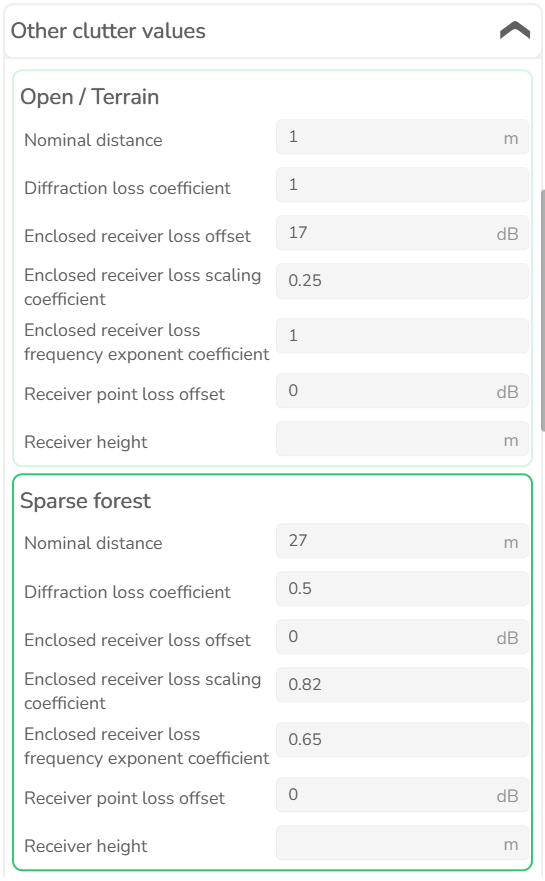
will be higher. Usually, for buildings clutter class this parameter is higher then forest or other clutter classes.
Enclosed receiver loss offset
The initial entry loss into an obstacle within the clutter class, expressed as an offset in dB, which is added
Confidential ©Cellular Expert, 2026 Page | 109

---

Cellular Expert Express User Guide 7.3
to the path loss grid. Applies when receiver point ends up enclosed within an obstacle within this clutter
class.
Enclosed receiver loss scaling coefficient
Represents additional signal loss as a function of the distance travelled in an obstacle within the clutter
class. Higher values increase path loss. Applies when receiver point ends up enclosed within an obstacle
within this clutter class.
Enclosed receiver loss frequency exponent coefficient
Reflects additional loss inside an obstacle within the clutter class based on frequency. Higher values
increase path loss, particularly at higher frequencies. Applies when receiver point ends up enclosed within
an obstacle within this clutter class.
Receiver point loss offset
An additional loss offset in dB applied to the path loss grid, representing user equipment (UE) losses.
Receiver height
Receiver height value used when receiver lands on this clutter class. If this value is not defined, the main
receiver height value defined in the prediction model is used.
Clutter Classes default values
Nominal Diffraction Enclosed Enclosed Enclosed Receiver
Distance loss receiver receiver receiver point loss
coefficient loss offset loss loss offset
scaling frequency
coefficient exponent
coefficient
1 1 17 0.25 1 0
| Parameter | Description |
|---|---|
| Open / Terrain | 27 0.5 0 0.82 0.65 0 |
| Grassland | 27 0.5 0 0.82 0.65 0 |
| Sparse forest | 27 0.5 0 0.89 0.65 0 |
| Medium dense forest | 15 0.5 0 0.95 0.65 0 |
| Very dense forest | 27 0.5 0 0.89 0.65 0 |
Low density urban (Low
buildings)
27 0.5 0 0.89 0.65 0
Low density urban
(High buildings)
15 0.6 0 0.89 0.65 0
Medium density urban
(Low buildings)
15 0.6 0 0.89 0.65 0
Medium density urban
(High buildings)
10 0.7 0 0.89 0.65 0
High density urban
(Low buildings)
10 0.7 0 0.89 0.65 0
High density urban
(High buildings)
10 0.7 0 0.89 0.65 0
High density urban
(Very high buildings)
Confidential ©Cellular Expert, 2026 Page | 110

---

Cellular Expert Express User Guide 7.3
15 0.6 0 0.89 0.65 0
| Parameter | Description |
|---|---|
| Building blocks | 27 0.5 0 0.89 0.65 0 |
| Transportation | 27 0.5 0 0.89 0.65 0 |
| Agriculture | 27 0.5 0 0.89 0.65 0 |
| Plantation | 27 0.5 0 0.89 0.65 0 |
| Parks | 27 0.6 0 0.89 0.65 0 |
| Airport | 27 0.5 0 0.89 0.65 0 |
| Sea | 27 0.5 0 0.89 0.65 0 |
| Inland water | 1 1 5 0.25 1 0 |
| Concrete building | 1 1 2 0.25 1 0 |
| Glass building | 1 0.6 2 0.25 1 0 |
| Wood building | 1 1 8.5 0.25 1 0 |
| Low loss building | 1 1 17 0.25 1 0 |
High loss building
3.1.9.6 ITU-R P368 Model
ITU-R P.368 is ground-wave propagation of radio signals model. It is specifically designed to estimate the
field strength and attenuation of radio waves over the Earth's surface, particularly for frequencies below 30
MHz.
This model is widely used in planning and designing long-distance communication systems, such as
maritime, broadcasting, and low-frequency navigation systems, where ground-wave propagation plays a
critical role. It accounts for factors such as terrain conductivity, dielectric properties, and surface roughness

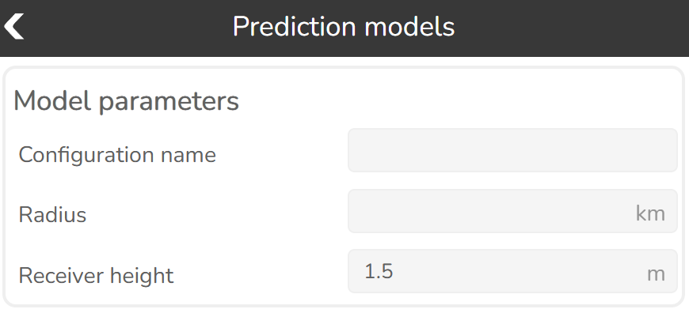
to deliver accurate predictions of signal behavior.
3.1.9.6.1 ITU-R P368 Model settings
Confidential ©Cellular Expert, 2026 Page | 111

---

Cellular Expert Express User Guide 7.3
Configuration name
Name of the prediction configuration name.
Radius
Maximum prediction radius in kilometers to calculate path loss.
Receiver height
Receiver height above the receiver reference height selected in the workspace settings.
The general model parameters include the radius and receiver height. Additional parameters used for path

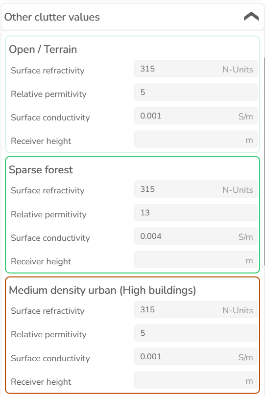
loss calculations are derived from the clutter classes. Each clutter class has its own unique set of
parameters:
Confidential ©Cellular Expert, 2026 Page | 112

---

Cellular Expert Express User Guide 7.3
Surface refractivity
A measure of the refractive index's influence on electromagnetic wave propagation, particularly in the lower
atmosphere close to the Earth's surface. It is expressed as a dimensionless value, typically dependent on
atmospheric pressure, temperature, and humidity. High surface refractivity can significantly affect radio
wave bending and propagation, such as ducting or anomalous refraction.
Relative permittivity
Quantifies a material's ability to permit electric field propagation relative to vacuum. It is a complex quantity
with the real part representing energy storage capability and the imaginary part representing energy
dissipation within the material.
ITU-R P.368 uses relative permittivity to model how radio waves interact with various surface materials,
such as soil, water, or vegetation. These interactions influence reflection, refraction, and absorption
phenomena at the surface.
Surface conductivity
Refers to a material's ability to conduct electrical currents across its surface. It is measured in siemens per
meter (S/m). Higher conductivity indicates that a surface can easily allow current flow, affecting the
reflection and absorption of radio waves.
According to ITU-R P.368, surface conductivity is a critical factor in determining the reflective properties of
surfaces, such as dry versus wet soil, or metallic versus dielectric surfaces.
| Parameter | Description |
|---|---|
| Receiver height | Receiver height value used when receiver lands on this clutter class. If this value is not defined, the main receiver height value defined in the prediction model is used. |
| Clutter Classes default values | Surface refractivity Relative permittivit y Surface conductivity 1 1 17 |
| Open / Terrain | 27 0.5 0 |
| Grassland | 27 0.5 0 |
| Sparse forest | 27 0.5 0 |
| Medium dense forest | 15 0.5 0 |
| Very dense forest | 27 0.5 0 |
Low density urban (Low
buildings)
27 0.5 0
Low density urban (High
| Parameter | Description |
|---|---|
| buildings) | 15 0.6 0 |
| Building blocks | 27 0.5 0 |
| Transportation | 27 0.5 0 |
| Agriculture | 27 0.5 0 |
| Plantation | 27 0.5 0 |
| Parks | 27 0.6 0 |
| Airport | 27 0.5 0 |
| Sea | 27 0.5 0 |
| Inland water | 1 1 5 |
| Concrete building | 1 1 2 |
| Glass building | 1 0.6 2 |
| Wood building | 1 1 8.5 |
| Low loss building | 1 1 17 |
High loss building
3.1.9.7 ISO9613 Model
ISO 9613 is an international standard used for predicting outdoor sound propagation, including the
assessment of siren noise levels. It provides a structured method for calculating sound attenuation over
distance, considering factors such as geometric spreading, atmospheric absorption, ground effects,
reflections, and obstacles.
In the context of siren sound prediction, ISO 9613 helps determine the effective coverage area, ensuring
that warning signals reach the intended audience with sufficient audibility. This standard is essential for
optimizing siren placement, regulatory compliance, and designing effective emergency alert systems.
The primary factors included in the standard are:
1. Geometric Spreading
- This refers to how sound spreads out as it moves away from its source. Sound intensity
decreases as the distance from the source increases, following the inverse square law (with
spherical spreading) or other forms depending on terrain.
- As the distance from the sound source increases, the intensity of sound diminishes, which is
considered in the calculation of sound levels at various receiver points.
𝐴𝑑𝑖𝑣=20∗𝐿𝑂𝐺10(𝑑)+11
2. Atmospheric Absorption
Confidential ©Cellular Expert, 2026 Page | 114

---

Cellular Expert Express User Guide 7.3
- Sound is absorbed by the atmosphere as it travels, particularly at higher frequencies. The
absorption depends on factors like temperature, humidity, and air pressure, and is often more
significant over longer distances.
- Atmospheric absorption reduces the intensity of sound as it propagates, especially at higher
frequencies. The standard takes into account these effects to calculate the reduction in sound
level.
3. Obstacles
- Physical barriers such as walls, hills, and buildings block or scatter sound waves, reducing the
sound level that reaches certain areas.
- Obstacles can cause significant sound reduction, especially if they are large or located between
the sound source and the receiver. The standard accounts for the shadow zones created by
these barriers.
4. Directivity of the Source
- This parameter accounts for the directionality of the sound source, which may not emit sound
equally in all directions. Sirens, for example, may have directional characteristics that focus
their sound output in certain directions.
- The directivity of the sound source influences how the sound energy is distributed, and
therefore, how far and in what pattern the sound propagates.
5. Meteorological Conditions
- Weather conditions such as wind speed, temperature gradients, and humidity can significantly
affect sound propagation. For example, sound may travel farther downwind or be absorbed
more by humid air.
- These conditions are integrated into the model to adjust the calculations of sound attenuation,
ensuring more accurate predictions for different weather scenarios.
3.1.9.7.1 ISO9613 Model settings
Confidential ©Cellular Expert, 2026 Page | 115

---

Cellular Expert Express User Guide 7.3
| Parameter | Description |
|---|---|
| Configuration name | Name of the prediction configuration name. |
| Radius | Maximum prediction radius in kilometers to calculate path loss. |
| Receiver height | Receiver height above the receiver reference height selected in the workspace settings. |
| Effective earth radius | Earth radius in kilometers, used for the calculations. |
| Distance coefficient | Defines the slope based on the distance between the cell and the receiver location, with a default value of 20. |
20.
Meteorological conditions
It is a factor, in decibels, which depends on local meteorological statistics for wind speed and direction, and

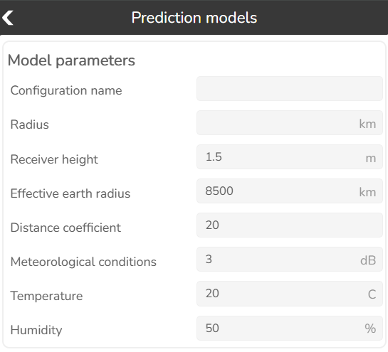
temperature gradients. Experience indicates that values of Meteorological conditions (C0) in practice are
limited to the range from zero to approximately + 5 dB.
Temperature
Air temperature in Celsius.
Humidity
Air humidity in percentage.
Confidential ©Cellular Expert, 2026 Page | 116

---

Cellular Expert Express User Guide 7.3
Receiver height
Receiver height value used when receiver lands on this clutter class. If this value is not defined, the main
receiver height value defined in the prediction model is used.
3.1.9.8 CEC 3GPP TR Indoor model
In the current version, each transmitter must be defined individually as a separate indoor antenna, including

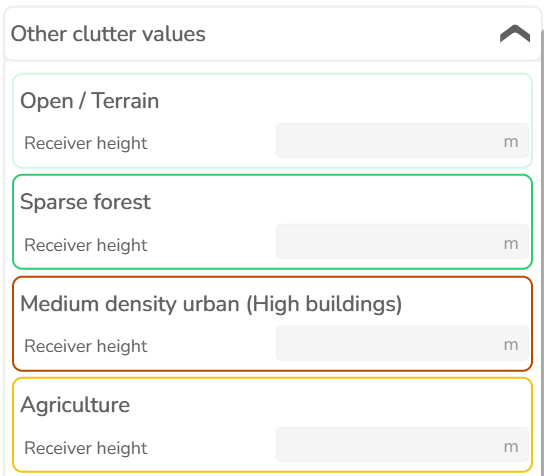
its specific attributes such as transmit power. When importing the building wall layout from a CAD drawing,
it is converted into both Clutter Heights and a Clutter Class raster. You can assign Clutter Class 0 to
represent open space and Clutter Class 1 for obstacles. Additional clutter classes can be defined based on
the wall material properties during the CAD-to-clutter conversion process. These classifications are then
specified within the Geodata Set, enabling more precise indoor propagation modeling.
3.1.9.8.1 CEC 3GPP TR Model settings
Confidential ©Cellular Expert, 2026 Page | 117

---

Cellular Expert Express User Guide 7.3
| Parameter | Description |
|---|---|
| Configuration name | Name of the prediction configuration name. |
| Radius | Maximum prediction radius in kilometers to calculate path loss. |
| Receiver height | Receiver height above the receiver reference height selected in the workspace settings. |
| Effective earth radius | Earth radius in kilometers, used for the calculations. |
| Offset coefficient | Represents the offset in decibels added to the path loss grid. The default value is 37 dB. |
| Distance coefficient | Defines the slope based on the distance between the cell and the receiver location, with a default value of 20. |
| Distance coefficient obstructed | Represents the slope based on the obstructed distance between the cell and the receiver location. The default value is 20. |
default value is 20.
Confidential ©Cellular Expert, 2026 Page | 118

---

Cellular Expert Express User Guide 7.3
Frequency coefficient
Indicates the slope determined by the frequency value, with a default value of 20.
Penetration loss offset
The initial entry loss applied when crossing an obstacle within the clutter class, expressed as an offset in

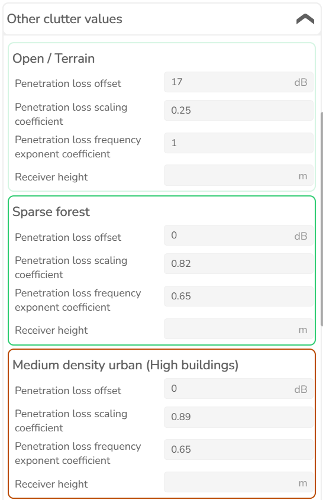
dB, which is added to the path loss grid.
Penetration loss scaling coefficient
Represents additional signal loss as a function of the distance travelled in an obstacle within the clutter
class. Higher values increase path loss.
Confidential ©Cellular Expert, 2026 Page | 119

---

Cellular Expert Express User Guide 7.3
Penetration loss frequency exponent coefficient
Reflects additional loss inside an obstacle within the clutter class based on frequency. Higher values
increase path loss, particularly at higher frequencies.
Receiver height
Receiver height value used when receiver lands on this clutter class. If this value is not defined, the main
receiver height value defined in the prediction model is used.
Note: penetration losses stack when multiple obstacles are crossed.
Clutter Classes default values
Penetration Penetration receiver Penetration receiver
receiver loss loss scaling loss frequency
| Parameter | Description |
|---|---|
| offset coefficient exponent coefficient | 17 0.25 1 |
| Open / Terrain | 0 0.82 0.65 |
| Grassland | 0 0.82 0.65 |
| Sparse forest | 0 0.89 0.65 |
| Medium dense forest | 0 0.95 0.65 |
| Very dense forest | 0 0.89 0.65 |
| Low density urban (Low buildings) | 0 0.89 0.65 |
| Low density urban (High buildings) | 0 0.89 0.65 |
Medium density urban (Low
| Parameter | Description |
|---|---|
| buildings) | 0 0.89 0.65 |
| High density urban (Low buildings) | 0 0.89 0.65 |
| High density urban (High buildings) | 0 0.89 0.65 |
High density urban (Very high
| Parameter | Description |
|---|---|
| buildings) | 0 0.89 0.65 |
| Building blocks | 0 0.89 0.65 |
| Transportation | 0 0.89 0.65 |
| Agriculture | 0 0.89 0.65 |
| Plantation | 0 0.89 0.65 |
| Parks | 0 0.89 0.65 |
| Airport | 0 0.89 0.65 |
| Sea | 0 0.89 0.65 |
| Inland water | 5 0.25 1 |
| Concrete building | 2 0.25 1 |
Glass building
Confidential ©Cellular Expert, 2026 Page | 120

---

Cellular Expert Express User Guide 7.3
2 0.25 1
| Parameter | Description |
|---|---|
| Wood building | 8.5 0.25 1 |
| Low loss building | 17 0.25 1 |
| High loss building | 3.1.10 Settings Click this button to open Settings tool. |
Confidential ©Cellular Expert, 2026 Page | 121

---

Cellular Expert Express User Guide 7.3
Confidential ©Cellular Expert, 2026 Page | 122

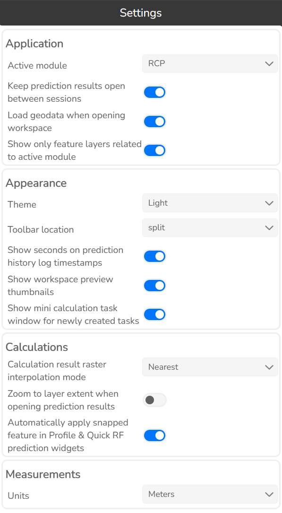

---

Cellular Expert Express User Guide 7.3
Application
| Parameter | Description |
|---|---|
| Active module | The currently active CE Express module. Switches the toolset to the required module. Module list consists of currently licensed CE Express modules. |
| Keep prediction results open between sessions | When enabled - opening a workspace loads open prediction result layers from the last session. |
| Load geodata when opening workspace | If a geodata set is applied to the workspace, the geodata rasters will be loaded under the geodata section of the layer list, and can be used to visualize the geodata that is used for calculations. |
| Show only feature layers related to active module | When enabled – hides features types not related to active module in tools like layer list, features, networks, etc. |

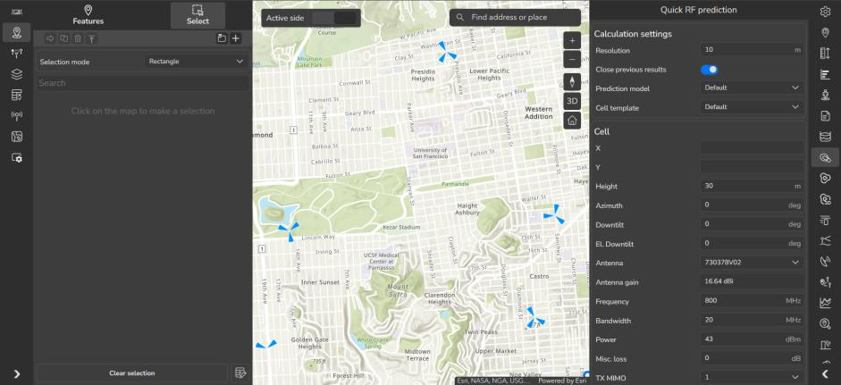

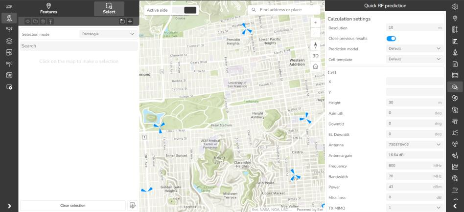
etc.
Appearance
Theme
Change application theme:
- Dark
- Light
Confidential ©Cellular Expert, 2026 Page | 123

---

Cellular Expert Express User Guide 7.3
| Parameter | Description |
|---|---|
| Toolbar location | Change the location of the tools: Split • • Left • Right |
| Show seconds on prediction history log timestamps | May be enabled or disabled. |
| Show workspace preview thumbnails | May be enabled or disabled. |
Show mini calculation task window for newly created tasks
When enabled, a small calculation window appears upon creating a calculation task. The window shows
the calculation log while the task is executing, then switches to showing the result list once the task is
finished. Results may also be opened from this window.
Calculations
Calculation result raster interpolation mode
Allows you to select the interpolation mode for calculation result raster layers.
Available options:
- Nearest (default)
- Cubic
Automatically apply first feature templates when calculation widgets are first opened
When enabled – automatically sets the feature template parameters on calculation widgets to the first
(recently edited) one.
Automatically apply snapped feature in Profile & [Quick RF prediction](#kw:quick-rf-prediction:ce-express-rf-prediction) tools
When enabled – while using Profile or [Quick RF prediction](#kw:quick-rf-prediction:ce-express-rf-prediction) tools and snapping to a feature, the parameters
from this feature will be automatically applied without having to select it from the snapped features
dropdown list. If disabled, only the location will be snapped to.
Measurements
Units
Select the displayed distance units for the measurements tool.
3.1.11 Identify
Click this button to open [Identify tool](#kw:310-step-10-using-the-identify-tool:ce-express-tr-workspace).
Shows the signal values at an exact location for loaded predictions in the Map view. The dialog is empty if

there are no loaded prediction rasters in the Layers tool.
Confidential ©Cellular Expert, 2026 Page | 124

---

Cellular Expert Express User Guide 7.3
If the Layer tool has loaded prediction rasters,
this will be shown in the [Identify tool](#kw:310-step-10-using-the-identify-tool:ce-express-tr-workspace).
Confidential ©Cellular Expert, 2026 Page | 125

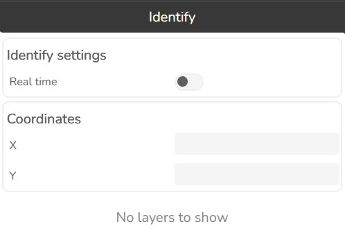

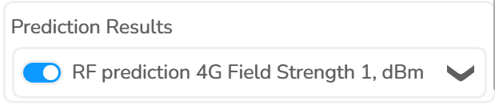

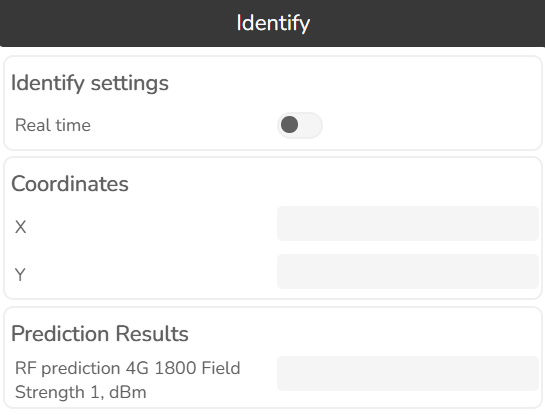

---

Cellular Expert Express User Guide 7.3
Click on the map to preview the signal value.
Identify settings
Real time
When enabled – you do not need to click on the map to identify the value of the raster, the value is
automatically updated as you hover over different pixels of the calculation result.
Coordinates
To display the coordinates, click on your desired location on the map.
3.1.12 Measurement tool
Click this button to open Measurement tool tool.
The Measurement Tool allows users to calculate spatial properties. It provides three measurement modes:

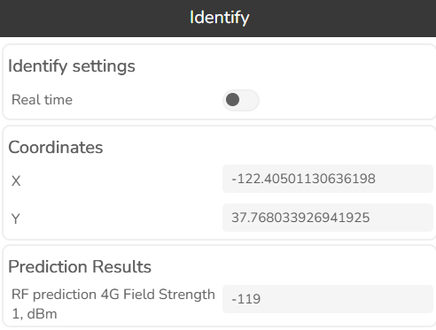

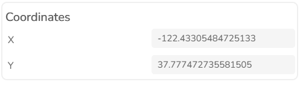

Distance, Area, and Offset.
Confidential ©Cellular Expert, 2026 Page | 126

---

Cellular Expert Express User Guide 7.3
3.1.12.1 Distance
Measure the distance between two or more points.
Click once to finish line segment. Double click to finish drawing.
Segment lengths
Total distance
Total length of all line segments.
Segment X
Shows the length of the line segment.
Angles
Confidential ©Cellular Expert, 2026 Page | 127

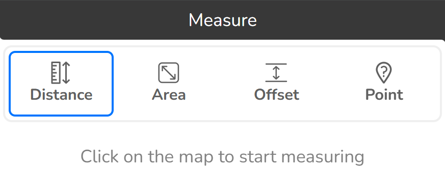

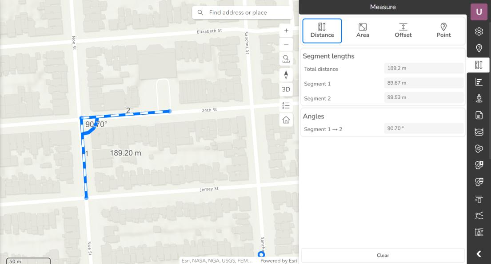

---

Cellular Expert Express User Guide 7.3
| Parameter | Description |
|---|---|
| Segment 1 → 2 | Angles between line segments. 3.1.12.2 Area Calculates the surface area and perimeter of the area. |
| Area | Total enclosed surface. |
| Perimeter | Total boundary length. 3.1.12.3 Offset Helps find the shortest distance from a line to a point on the map. |
Confidential ©Cellular Expert, 2026 Page | 128

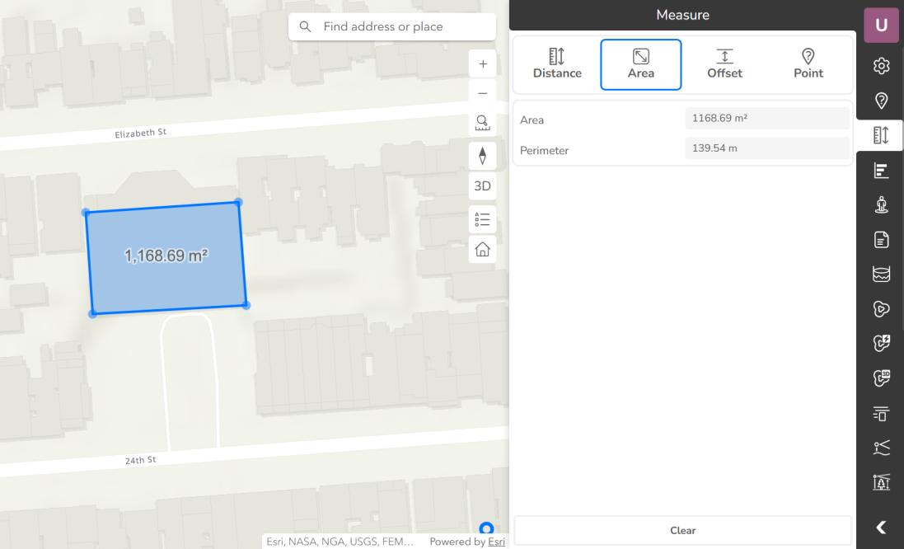

---

Cellular Expert Express User Guide 7.3
Click once to start drawing the reference line, then once again – to finish. Then, click on the map to select

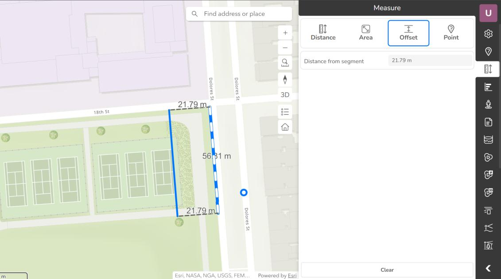

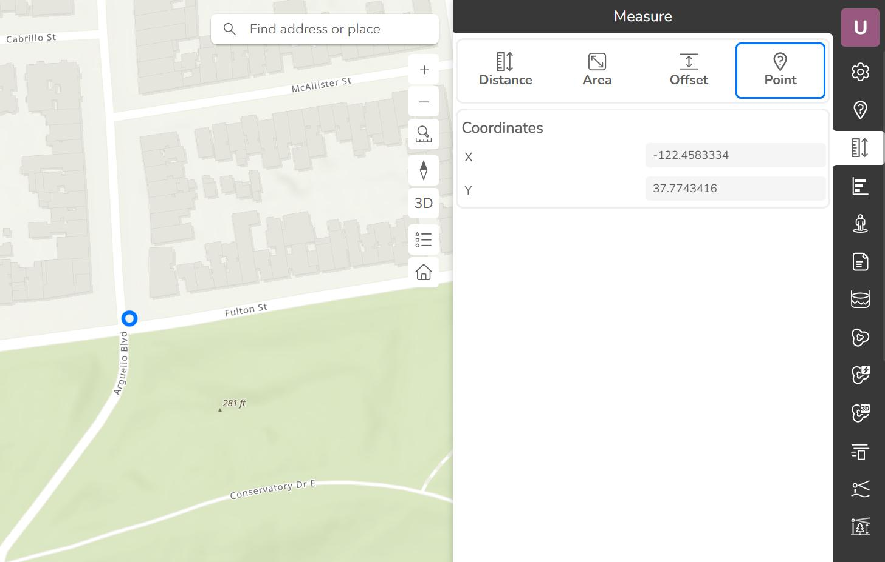
the offset point, towards which you would like the find the distance.
Distance from segment
Distance from the line segment to the offset point.
3.1.12.4 Point
Confidential ©Cellular Expert, 2026 Page | 129

---

Cellular Expert Express User Guide 7.3
Coordinates
To display the coordinates, click on your desired location on the map.
3.1.13 Network statistics
Click this button to open Network statistics tool.
Network Statistics is a tool that calculates the total coverage of a polygon based on its overall coverage

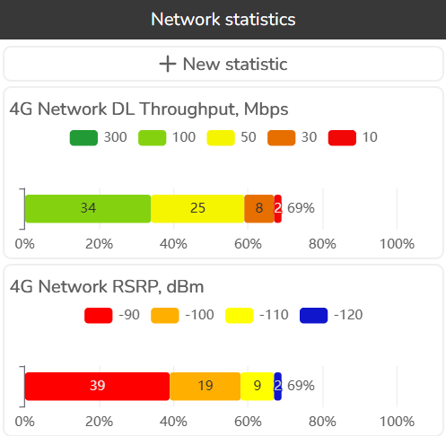
(signal strength, dl throughput, etc.). The resulting statistics include the total coverage and individual
coverage of each polygon segment.
Upon hovering the mouse over a statistic item, options for it appear.
Confidential ©Cellular Expert, 2026 Page | 130

---

Cellular Expert Express User Guide 7.3
Edit statistic
Delete statistic
Confidential ©Cellular Expert, 2026 Page | 131

---

Cellular Expert Express User Guide 7.3
A statistics item may be clicked to reveal detailed statistic.
Display settings
Statistic
- Area percentage, % – percentage of area covered by each color band. If the statistic is based on
a population point layer, then it’s the percentage of population.
- Area, km2 – area in km2 covered by each color band.
- Population – population covered by each color band, when polygon population field is set.
- Point count - only appears on statistics based on a population point layer. Displays the number of
weighted points covered by each color band.
| Parameter | Description |
|---|---|
| Ascending order | Sort in descending/ascending order. |
| Show as table | View the results in tabular view. |
| Row count | Defines the maximum number of rows displayed. |
Confidential ©Cellular Expert, 2026 Page | 132

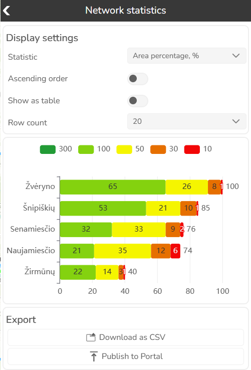

---

Cellular Expert Express User Guide 7.3
Export
Download as CSV
Download statistic results as csv file.
Publish to Portal
Publish statistic polygons as an ArcGIS layer. The output polygons will have the statistic results assigned

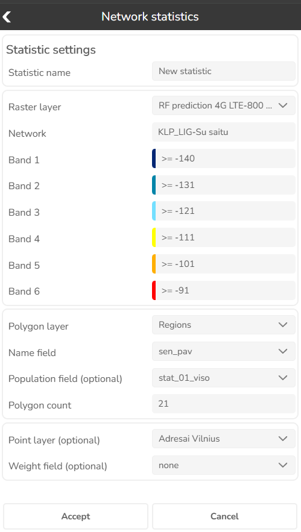
to them as attributes
3.1.13.1 Add statistic
Used for adding new statistics items to the main screen.
Statistic name
The name of the Statistic.
Raster layer
The calculation result layer that will be used as the source for statistics item.
Band
The color of each segment in the statistics. The color bands are automatically retrieved from the raster
layer.
Confidential ©Cellular Expert, 2026 Page | 133

---

Cellular Expert Express User Guide 7.3
| Parameter | Description |
|---|---|
| Polygon layer | Workspace ‘extra layer’ (polygon feature layer) that is used to divide statistics item into areas by polygon. |
| Name Field | Defines the names of territories that will be displayed in the results. |
| Population field (optional) | If selected, adds a population calculation to statistics item. |
Point layer (optional)
Workspace ‘extra layer’ (point feature layer). If selected, the statistics will be calculated not by total polygon

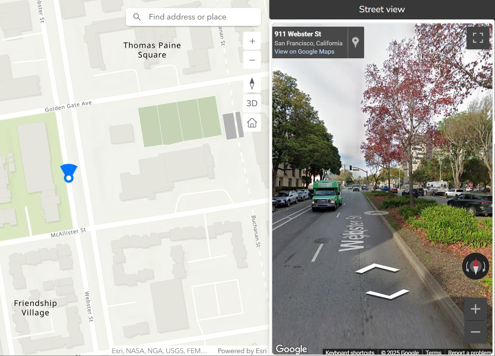
area coverage, but by point coverage (% and #) within each polygon.
3.1.14 [Street view](#kw:navigating-street-view:ce-express-street-view)
Click this button to open [Street view](#kw:navigating-street-view:ce-express-street-view) tool.
This interface links a 2D map with a street-level view. The map shows spatial context and landmarks. The
street view shows the real-world appearance of the same location. Both panels update together when you
select a place.
Confidential ©Cellular Expert, 2026 Page | 134

---

Cellular Expert Express User Guide 7.3
3.1.15 Feature report
Click this button to open Feature report tool.
This tool allows you to create PDF reports of selected features with attribute tables, as well as a page with

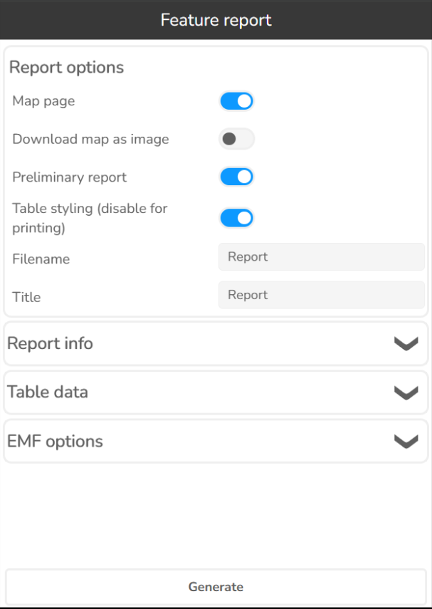

a view of the map.
Report options
General options related to report
Map page
Whether to add a page with a view of the map to the PDF report output.
Confidential ©Cellular Expert, 2026 Page | 135

---

Cellular Expert Express User Guide 7.3
| Parameter | Description |
|---|---|
| Download map as image | If this is enabled, an additional image file of the map will be downloaded upon report generation. |
| Preliminary report | Whether to add “Preliminary report” notice at the front page of the report. |
| Table styling (disable for printing) | Enable / disable colors applied to table. |
| Filename | Report file name. |
| Title | Title for the front page of the report. |
| Report info | Contact data of the report generating person / organization. Displayed in the final report. |
Confidential ©Cellular Expert, 2026 Page | 136

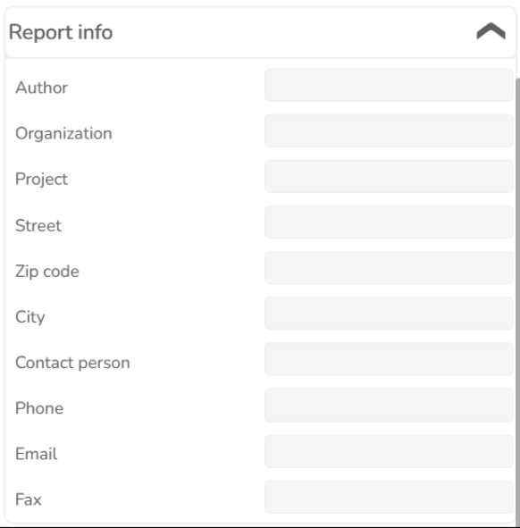

---

Cellular Expert Express User Guide 7.3
Table data
Enable / disable fields that will be added to the feature tables within the report. Only selected features are

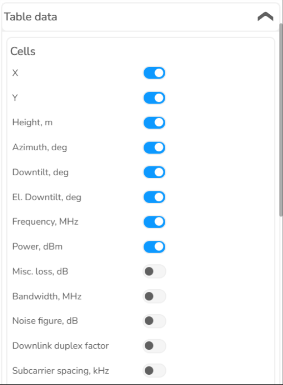

added to the table data.
Confidential ©Cellular Expert, 2026 Page | 137

---

Cellular Expert Express User Guide 7.3
EMF options
Options pertaining to the EMF module. Only visible when EMF module is active.
Cell arrows
Enable
Whether to draw the arrows originating from selected cells
Arrow length
Length of arrows in meters
Perimeter circles
Enable
Whether to draw perimeter circles around selected features
Feature type
Feature type which is used as the origin for perimeter circles
Confidential ©Cellular Expert, 2026 Page | 138

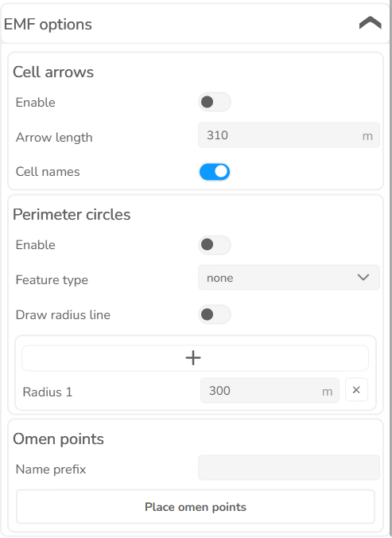

---

Cellular Expert Express User Guide 7.3
Draw radius line
Whether to draw a line within the circles marking the radius of the circle. A label of the radius length is

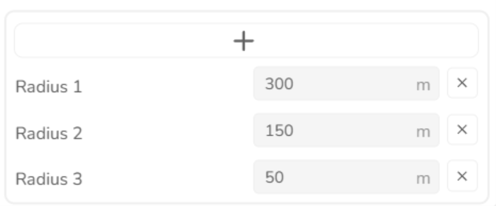

displayed above the dashed line.
Perimeter radius lengths
Multiple perimeters around each feature may be drawn. This list allows you to define the length of each
perimeter radius.
Omen points
Place omen points
This button places omen points on the intersection points of cell arrow lines and radius circles.
Name prefix
Each placed point is numbered with 1 – n in the name (1, 2, 3, …, n). This prefix is added to each name.
For example, if the prefix is defined as “omen”, the created omen points will be named as “omen 1”, “omen
2”, “omen n”.
Confidential ©Cellular Expert, 2026 Page | 139

---

Cellular Expert Express User Guide 7.3
Report example:
Confidential ©Cellular Expert, 2026 Page | 140

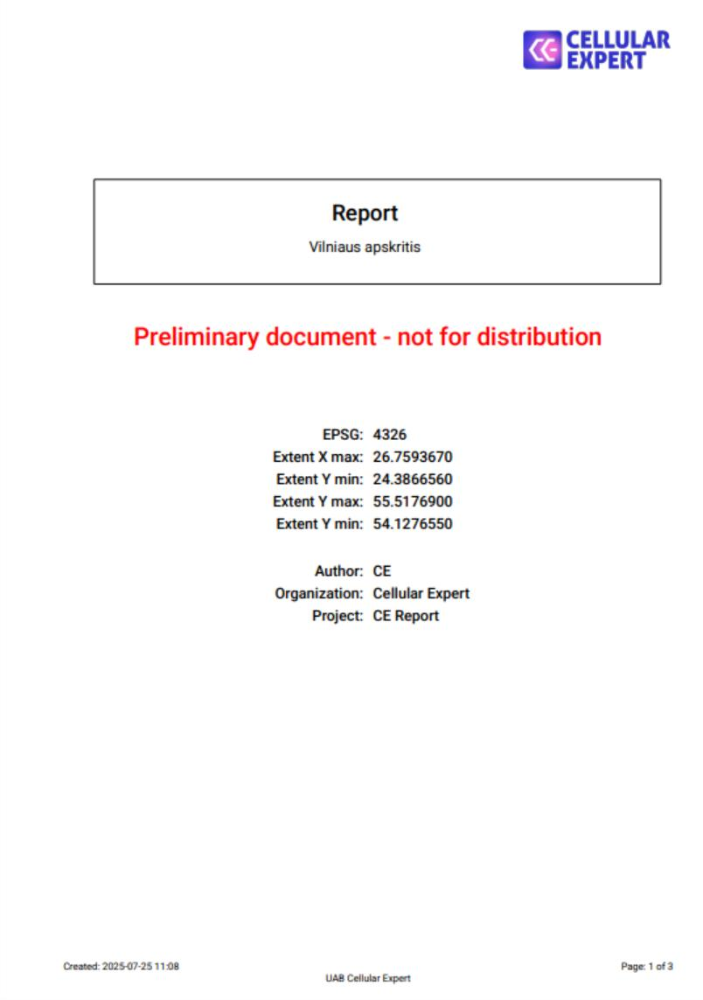

---

Cellular Expert Express User Guide 7.3
Confidential ©Cellular Expert, 2026 Page | 141

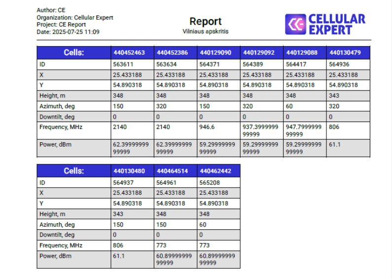

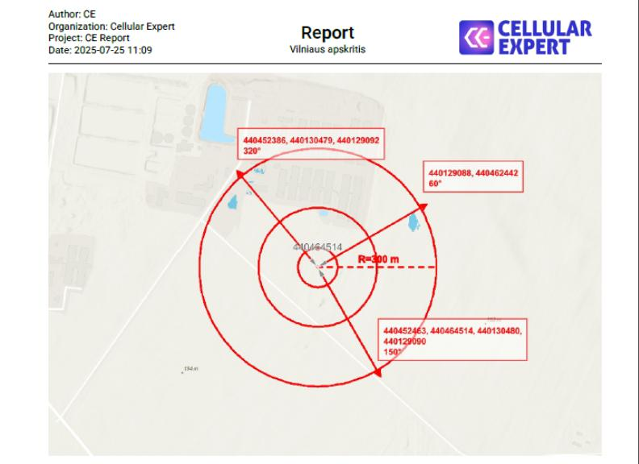

---

Cellular Expert Express User Guide 7.3
3.1.16 Profile
Click this button to open [Profile tool](#kw:when-to-use-the-profile-tool:ce-express-profile).
This tool generates a detailed profile between two points. The locations From (transmitter) and To (receiver)

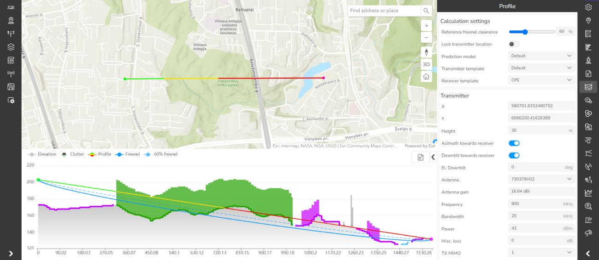

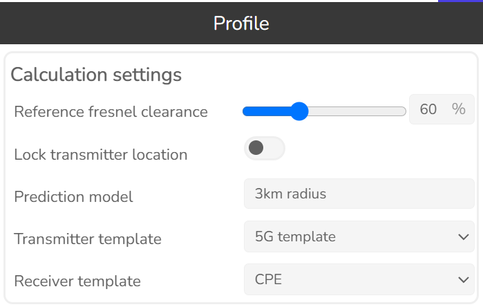

can be chosen by clicking on the map. The first click defines the transmitter, the second one the receiver.
3.1.16.1 Properties
Calculation settings
Reference Fresnel clearance
Percentage by which the primary Fresnel zones will be scaled up or down thus creating a secondary Fresnel
zone. The percentage must be in the range of 1 to 200 %.
Confidential ©Cellular Expert, 2026 Page | 142

---

Cellular Expert Express User Guide 7.3
| Parameter | Description |
|---|---|
| Lock transmitter location | Toggling the switch will enable the Locked Transmitter location, which will modify only the receiver’s positioning when drawing the profile on the map. |
| Prediction model | Prediction model list. |
| Transmitter template | The template that is used for transmitter’s default values. |
| Receiver template | The template that is used for receiver’s default values. |
Transmitter
Snapped feature
A feature from which the profile will be drawn. The parameters of the feature will be taken into calculation

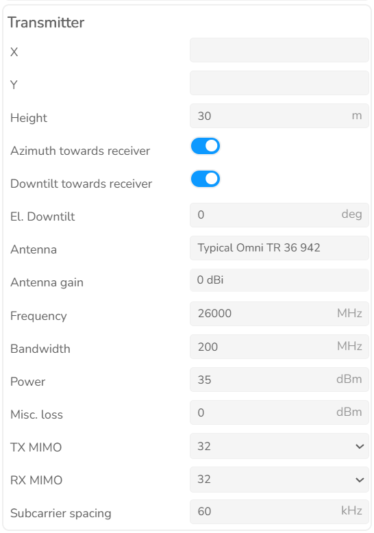
if the feature is snapped to by the [profile tool](#kw:when-to-use-the-profile-tool:ce-express-profile).
Confidential ©Cellular Expert, 2026 Page | 143

---

Cellular Expert Express User Guide 7.3
| Parameter | Description |
|---|---|
| X | X coordinate of the transmitter. |
| Y | Y coordinate of the transmitter. |
| Height | Height above the ground in meters. |
| Azimuth towards receiver | Enabled by default. When enabled, the transmitter’s azimuth automatically set towards the receiver. Disabling this option allows the user to enter a static azimuth value for the transmitter. |
| Downtilt towards receiver | Enabled by default. When enabled, the transmitter’s tilt is automatically set towards the receiver. Disabling this option allows the user to enter a static tilt value for the transmitter. |
| El. Downtilt | Electrical downtilt value for the transmitter, in degrees. |
| Antenna | Antenna that will be used in the prediction calculations. |
| Frequency | The frequency value in MHz. |
| Bandwidth | Value in MHz. Required for 4G and 5G technologies. For other technologies define the value as 0.015. |
| Power | Transmitter power in dBm. If calculate EIRP is set to false in the workspace settings, the power value is assumed to be EIRP. |
| Misc. loss | Miscellaneous loss value in dB. |
| TX MIMO | Transmitter antenna count. Available values: 1, 2, 4, 8, 16, 32 and 64. |
| RX MIMO | Receiver antenna count. Available values: 1, 2, 4, 8, 16, 32 and 64. |
| Subcarrier spacing | Value in kHz. Required for 4G and 5G technologies. For other technologies define value 15. |
Confidential ©Cellular Expert, 2026 Page | 144

---

Cellular Expert Express User Guide 7.3
Receiver
X
X coordinate of the receiver.
Y
Y coordinate of the receiver.
Height
Receiver height above the receiver reference height selected in the workspace settings.
Azimuth towards transmitter
Enabled by default. When enabled, the receiver’s azimuth automatically set towards the transmitter.
Disabling this option allows the user to enter a static azimuth value for the receiver.
Downtilt towards transmitter
Enabled by default. When enabled, the receiver’s tilt is automatically set towards the transmitter. Disabling

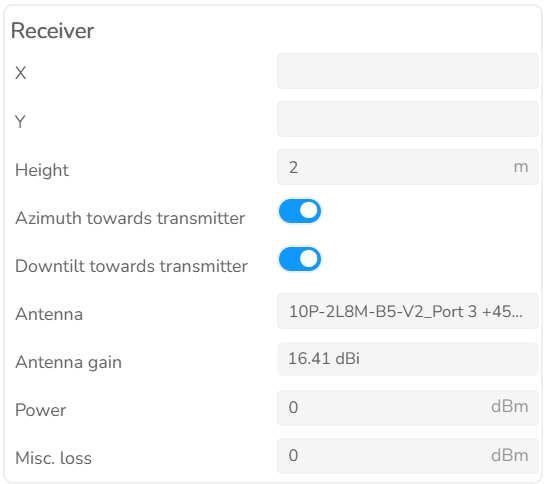
this option allows the user to enter a static tilt value for the receiver.
Antenna
Antenna that will be used in the prediction calculations.
Power
A power that the receiver possesses.
Confidential ©Cellular Expert, 2026 Page | 145

---

Cellular Expert Express User Guide 7.3
Misc. loss
Miscellaneous loss value in dB.
3.1.16.2 Draw profile
When the [Profile tool](#kw:when-to-use-the-profile-tool:ce-express-profile) is selected you will be able to select two points on the map in turn creating a Profile
line.
The profile also lets you snap to different [network objects](#kw:object-types:ce-express-network-objects) (cells, CPE, sites). To snap to an object, use the
CTRL key and hover the mouse near the required feature. Snapped features appear in the Snapped
feature dropdown list under transmitter and receiver sections. Once a snapped feature is selected in the
dropdown menu, all parameters of that feature that are necessary to draw a profile will be read and included

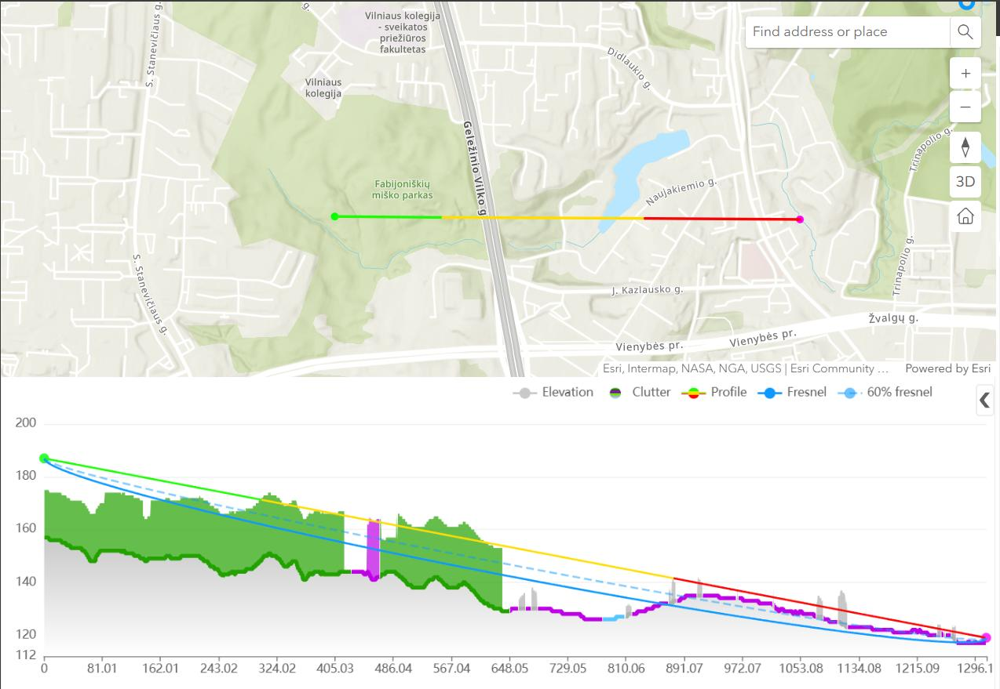
in the calculations.
The profile is automatically recalculated when a new parameter is defined.
Upon the selection of a second point, these geometries will be created between the points:
- LOS (green) - the section until the first obstruction in the profile’s way
- OLOS (yellow) – the section of profile that is obstructed by clutter
- NLOS (red) – the section of profile that is obstructed by buildings or earth
- Rx (purple) – the receiver point
- Tx (green) – the transmitter point
- Fresnel (blue) – the Fresnel lines
You can inspect the values at particular points by moving the cursor around the plot. The cursor movement
on the plot will be projected as a moving point on the map.
Confidential ©Cellular Expert, 2026 Page | 146

---

Cellular Expert Express User Guide 7.3
Zoom in/out in the profile view.
Click on button to view the see the Calculation results.
Confidential ©Cellular Expert, 2026 Page | 147

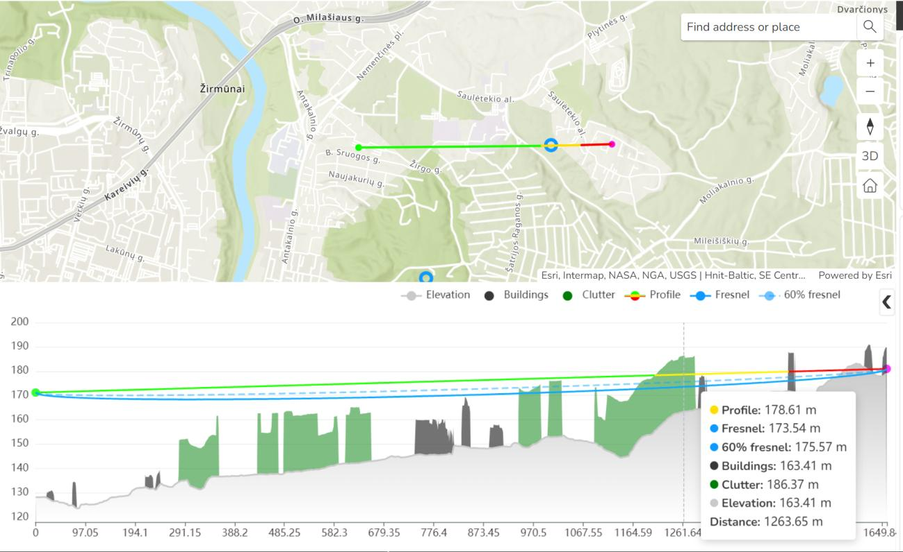

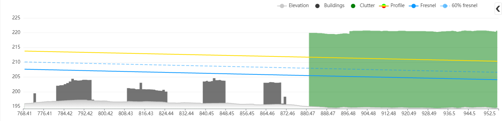

---

Cellular Expert Express User Guide 7.3
3.1.16.3 Profile report
The input data and calculation results can be automatically transferred into a Profile Report. This report
will show transmitter/receiver input data, calculation results as well as the Profile plot and map view in which

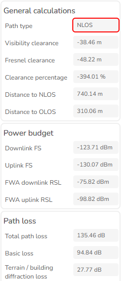

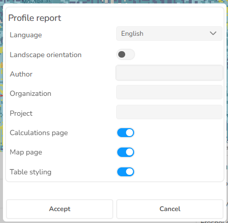
the profile was drawn.
The resulting Profile report will look similar to this example:
Confidential ©Cellular Expert, 2026 Page | 148

---

Cellular Expert Express User Guide 7.3
Confidential ©Cellular Expert, 2026 Page | 149

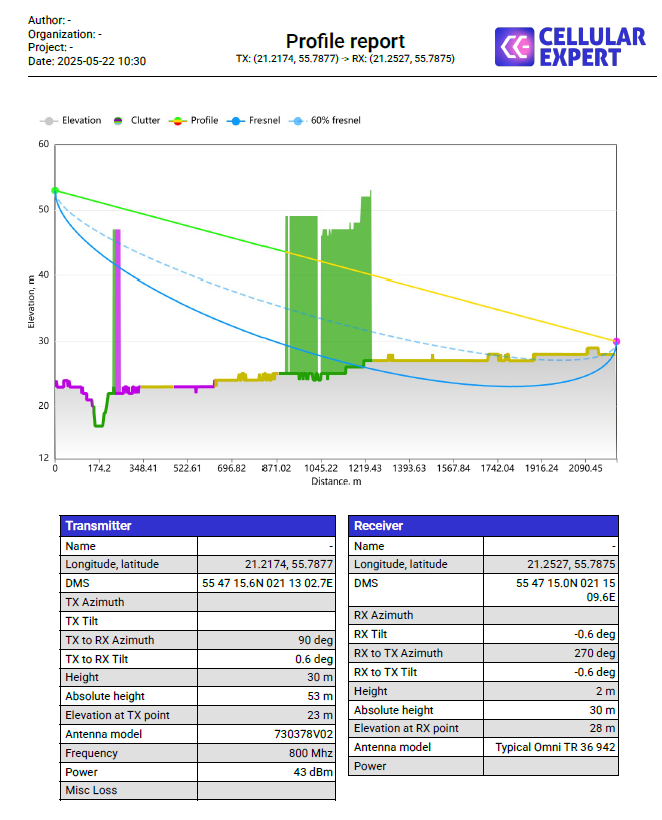

---

Cellular Expert Express User Guide 7.3
3.1.17 Quick RF Prediction
Click this button to open Quic RF Prediction tool.
The Quick RF Prediction is a tool that lets you select a point on the map and make a prediction without the
need to create a cell. [Quick prediction](#kw:quick-rf-prediction:ce-express-rf-prediction) also lets you select a cell as the point, meaning that you can also
make quick predictions with the created cells. The Quick RF Prediction tool calculates only the field strength

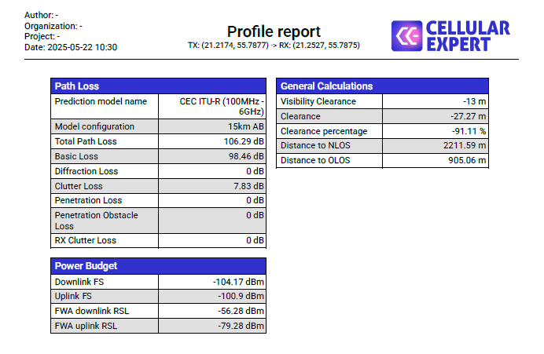

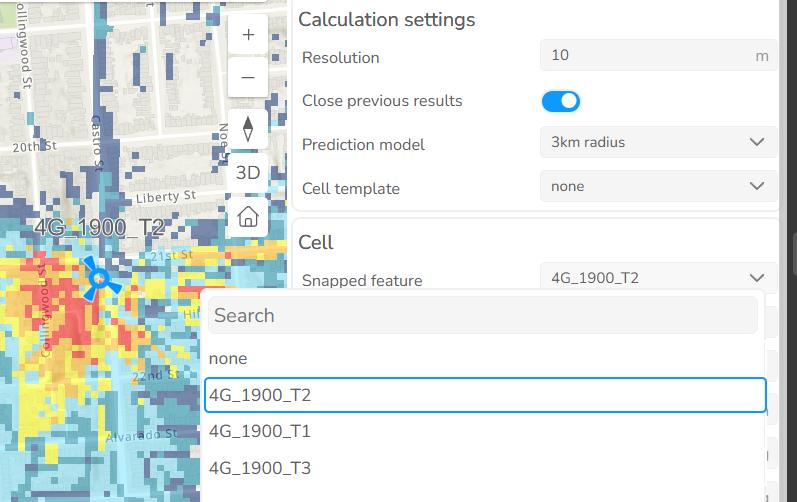
coverage.
- To select a cell, hold the CTRL key and click to snap to the required cell. Snapped cells will be
visible in the dialog.
Confidential ©Cellular Expert, 2026 Page | 150

---

Cellular Expert Express User Guide 7.3
- To predict a preferred location without a cell, define the exact coordinates in the X/Y fields or click
on the map to fill the coordinate fields automatically.
Calculation settings
Resolution
Prediction raster cell size in meters.
Close previous results
If this option is enabled, clicking elsewhere on the map or changing the calculation parameters will close
the previous result raster and open the new one. If disabled, the old calculation raster stays displayed on

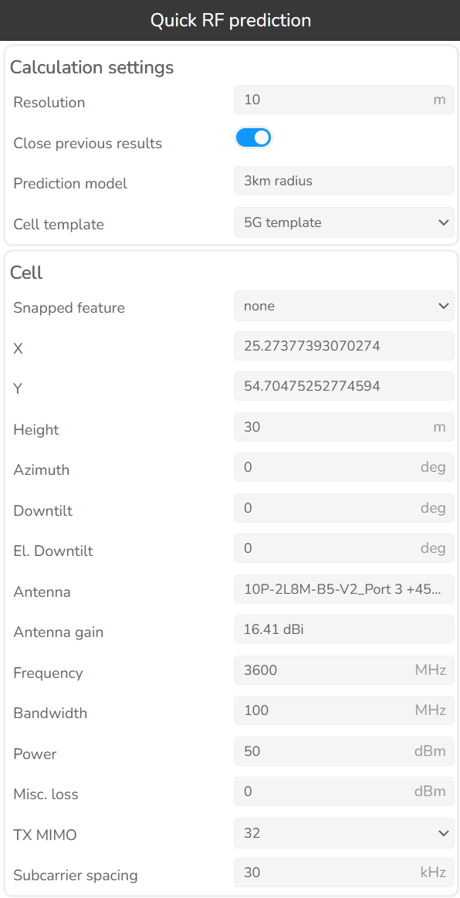
the map.
Prediction model
Prediction models that will be used in the prediction calculations.
Cell template
If a snapped cell does not have all the required parameters or no cell is snapped, the parameters will be
taken from the template.
Confidential ©Cellular Expert, 2026 Page | 151

---

Cellular Expert Express User Guide 7.3
Cell
| Parameter | Description |
|---|---|
| Snapped feature (optional) | A cell from which the calculation will be done. |
| X | X coordinate of the Cell. |
| Y | Y coordinate of the Cell. |
| Height | Cell height above the ground in meters. |
| Azimuth | Cell direction from the North in degrees. |
| Downtilt | Cells vertical angle offset. |
| El. Downtilt | Electrical downtilt value for the cell, in degrees. |
| Antenna | Antenna that will be used in the prediction calculations. |
| Frequency | Frequency value in MHz. |
| Bandwidth | Value in MHz. Required for 4G and 5G technologies. For other technologies define the value as 0.015. |
| Power | Power value in dBm. |
| Misc. loss | Miscellaneous loss value in dB. |
| TX mimo | Transmitter antenna count. Available values: 1, 2, 4, 8, 16, 32 and 64. |
Subcarrier spacing
Value in kHz. Required for 4G and 5G technologies. For other technologies define value 15.
Click on the map to start the calculation. The results will be loaded automatically in the Map view and will
be added to the Layer list tool.
Results:
- Field Strength raster in dBm.
Confidential ©Cellular Expert, 2026 Page | 152

---

Cellular Expert Express User Guide 7.3
3.1.18 RF Prediction
Click this button to open RF Prediction tool.
This tool allows to perform predictions for cell objects selected on the map. Calculations can be performed

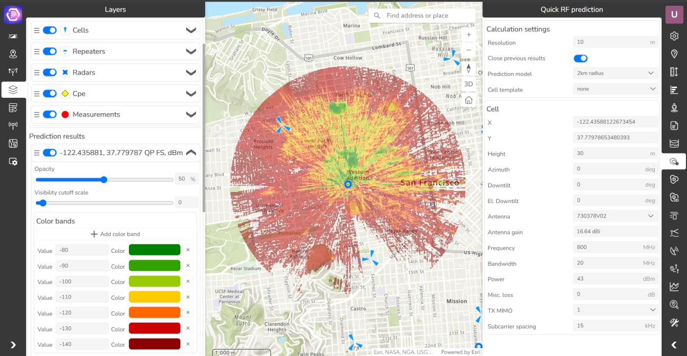

for more than one cell at the same time. Use the Features tool to select cells on the map.
Confidential ©Cellular Expert, 2026 Page | 153

---

Cellular Expert Express User Guide 7.3
The selected cell count is visible in the RF Prediction dialog.
The cells are split into technologies automatically. The cell’s technology is defined by the attributes in the

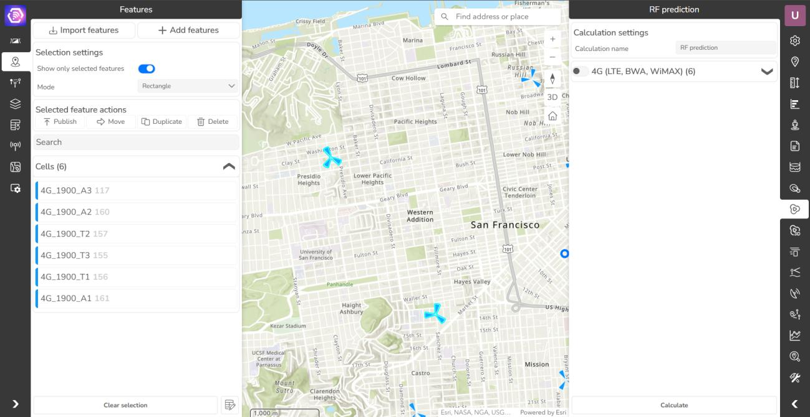

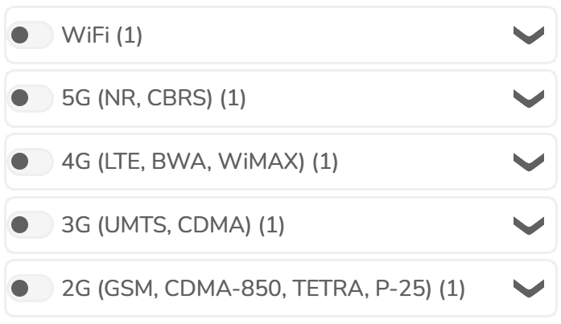
technology field.
To preview the calculation parameters, use the expand option for the technology.
Confidential ©Cellular Expert, 2026 Page | 154

---

Cellular Expert Express User Guide 7.3
Select the technology with the switch button and press Calculate to initiate the predictions. The prediction

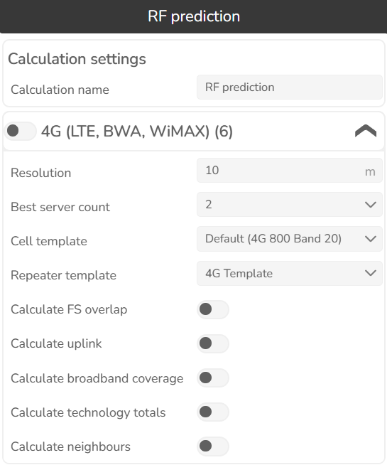
will be added to the Prediction History dialog.
Confidential ©Cellular Expert, 2026 Page | 155

---

Cellular Expert Express User Guide 7.3
3.1.18.1 2G technology (GSM/CDMA-850/TETRA/P-25)
Resolution
Prediction raster cell size in meters.
Best server count
There is the possibility to calculate up to 5 best servers. The prediction rasters show the 1st, 2nd, 3rd, and so

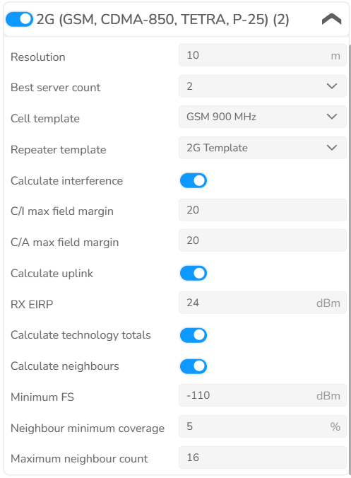

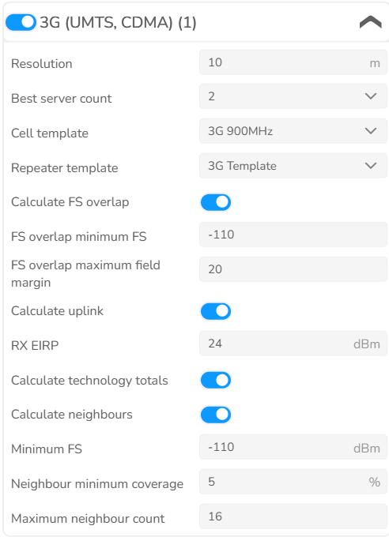

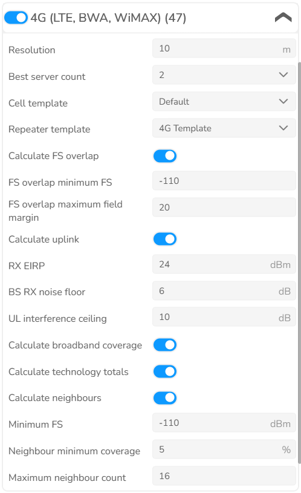

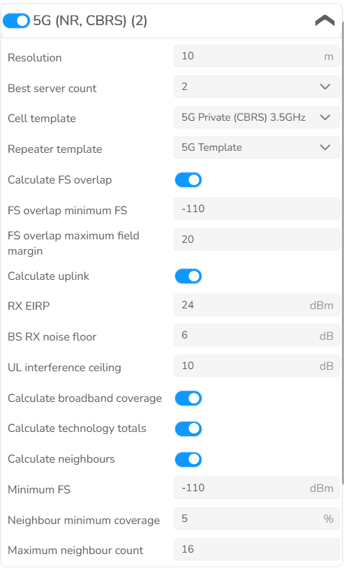

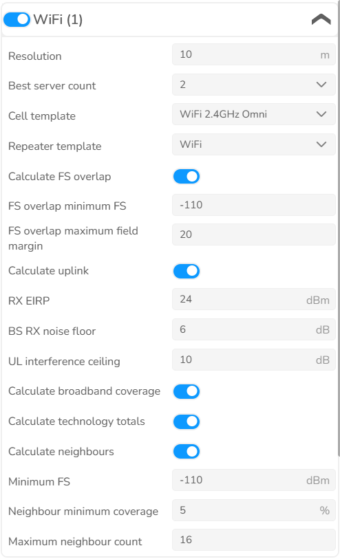
on strongest signal sources.
Cell template
If the cell is missing the required parameters, the parameters from the template will be used.
Repeater template
If the repeater is missing the required parameters, the parameters from the template will be used.
Calculate interference
The interference for 2G cells will be calculated. Note that for this calculation the C/I and C/A thresholds
must be defined.
C/I Max Field Margin, dB
The corresponding channel’s signal interference if the first and the second strongest signals differ by less
than or equal to 10 dBm.
C/A Max Field Margin, dB
Confidential ©Cellular Expert, 2026 Page | 156

---

Cellular Expert Express User Guide 7.3
The neighboring channel’s signal interference if the first and the second strongest signals differ by less than
or equal to 10 dBm.
| Parameter | Description |
|---|---|
| Calculate uplink | An option to calculate the Uplink signal strength. |
| RX EIRP, dBm | The power that the receiving antenna can capture from the transmitted signal in dBm. |
| Calculate technology totals | Calculates the overall field strength and the aggregate downlink throughput for several frequency bands in the same technology. |
| Calculate neighbours | An option to calculate neighbours for each cell in the technology section |
Minimum FS
Field strength threshold in dBm above which the area is considered as “covered” by the cell. The same
threshold is used for calculating whether a cell’s potential neighboring cell has overlapping areas, I.e. cells
only overlap where both of their coverage field strength values are above this threshold.
Neighbour minimum coverage
Coverage area overlap percentage above which a cell is considered a neighbour.
Maximum neighbour count
Maximum number of neighbours a cell can have. If a cell has more potential neighbours than this number,
only the ones with the highest overlap are returned.
Available coverage rasters:
- Received signal level raster in dBm, within the channel bandwidth appropriate to this technology.
It is possible to calculate separately the rasters for the 1st, 2nd, 3rd, 4th and 5th strongest signal levels,
and it depends on the count defined in the Best server count option.
- The best server raster shows the identification of cells generating the strongest signals at each
pixel. Raster count depends on the Best server count parameter value specified by the user.
o 1st best server shows the serving cell with the strongest field strength.
o 2nd best server shows the second strongest field strength cell identification.
o 3rd best server shows third shows the strongest field strength cell identification.
o 4th best server fourth shows the strongest field strength cell identification.
o 5th best server shows the fifth shows the strongest field strength cell identification.
- C/I rasters show Carrier-to-interference ratio in dB, to account for inter-cell interference from nearby
cells that utilise the same carrier.
- C/A raster show Carrier-to-Adjacent interference ratio in dB, to account for inter-cell interference
from nearby cells that operate the adjacent carrier (adjacent frequency channel).
- Uplink Field Strength raster shows receiver signal strength in dBm.
Confidential ©Cellular Expert, 2026 Page | 157

---

Cellular Expert Express User Guide 7.3
3.1.18.2 3G technology (UMTS/CDMA)
| Parameter | Description |
|---|---|
| Resolution | Prediction raster cell size in meters. |
| Best server count | 1st, 2nd, 3rd, There is the possibility to calculate up to 5 best servers. The prediction rasters show the and so on strongest signal sources. |
| Cell template | If the cell is missing the required parameters, the parameters from the template will be used. |
| Repeater template | If the repeater is missing the required parameters, the parameters from the template will be used. |
Calculate FS overlap
Confidential ©Cellular Expert, 2026 Page | 158

---

Cellular Expert Express User Guide 7.3
This calculation in Cellular Expert calculates the geographical areas where two different cells provide similar
signal strength. Specifically, it identifies regions where the absolute difference between the field strengths
of Cell 1 and Cell 2 is less than a defined threshold (e.g., 10 dB). This analysis is useful for understanding
coverage overlaps and potential handover zones between cells.
| Parameter | Description |
|---|---|
| FS overlap minimum FS | Defines the lowest acceptable field strength for overlap consideration. |
| FS overlap max field margin | Threshold under which the cell field strength overlap values are presented in the results. |
| Calculate uplink | An option to calculate the Uplink signal strength. |
| RX EIRP, dBm | The power that the receiving antenna can capture from the transmitted signal in dBm. Calculate technology totals |
| Calculate technology totals | Calculates the overall field strength and the aggregate downlink throughput for several frequency bands in the same technology. |
| Calculate neighbours | An option to calculate neighbours for each cell in the technology section |
Minimum FS
Field strength threshold in dBm above which the area is considered as “covered” by the cell. The same
threshold is used for calculating whether a cell’s potential neighboring cell has overlapping areas, I.e. cells
only overlap where both of their coverage field strength values are above this threshold.
Neighbour minimum coverage
Coverage area overlap percentage above which a cell is considered a neighbour.
Maximum neighbour count
Maximum number of neighbours a cell can have. If a cell has more potential neighbours than this number,
only the ones with the highest overlap are returned.
Available coverage rasters:
- Received signal level raster in dBm, within the channel bandwidth appropriate to this technology.
It is possible to calculate separately the rasters for 1st, 2nd, 3rd, 4th and 5th strongest signal level
rasters, and it depends on the count defined in Best server count option.
- The best server raster shows the identification of cells generating the strongest signals at each
pixel. Raster count depends on the Best server count parameter value specified by the user.
o 1st best server shows the serving cell with the strongest field strength.
o 2nd best server shows the second strongest field strength cell identification.
o 3rd best server shows third shows the strongest field strength cell identification.
o 4th best server fourth show the strongest field strength cell identification.
o 5th best server shows the fifth shows the strongest field strength cell identification.
- Uplink Field Strength raster shows receiver signal strength in dBm.
Confidential ©Cellular Expert, 2026 Page | 159

---

Cellular Expert Express User Guide 7.3
3.1.18.3 4G technology (LTE/BWA/WiMAX)
Resolution
Prediction raster cell size in meters.
Best server count
There is the possibility to calculate up to 5 best servers. The prediction rasters show the 1st, 2nd, 3rd, and so
on strongest signal sources. We recommend to use at least 3 best servers for more precise RSRQ, RSSI,
SINR, and Throughput calculations.
Confidential ©Cellular Expert, 2026 Page | 160

---

Cellular Expert Express User Guide 7.3
Cell template
If the cell is missing the required parameters, the parameters from the template will be used.
Repeater template
If the repeater is missing the required parameters, the parameters from the template will be used.
Calculate FS overlap
This calculation in Cellular Expert calculates the geographical areas where two different cells provide similar
signal strength. Specifically, it identifies regions where the absolute difference between the field strengths
of Cell 1 and Cell 2 is less than a defined threshold (e.g., 10 dB). This analysis is useful for understanding
coverage overlaps and potential handover zones between cells.
| Parameter | Description |
|---|---|
| FS overlap minimum FS | Defines the lowest acceptable field strength for overlap consideration. |
| FS overlap max field margin | Threshold under which the cell field strength overlap values are presented in the results. |
| Calculate uplink | An option to calculate the Uplink signal strength. |
| Rx EIRP, dBm | The EIRP value of the receiver in dBm. |
| BS RX Noise Floor, dB | Best Server receiver’s lowest noise level. No values below this level will be included in the calculation. |
| UL interference ceiling, dB | Uplink’s interference highest value. No values above this point will be included in the calculation. |
| Calculate broadband coverage | An option to calculate the Broadband coverage. • RSSI; • RSRQ; RS-SINR; • DL Throughput. • |
| Calculate technology totals | Calculates the overall field strength and the aggregate downlink throughput for several frequency bands in the same technology. |
| Calculate neighbours | An option to calculate neighbours for each cell in the technology section |
Minimum FS
Field strength threshold in dBm above which the area is considered as “covered” by the cell. The same
threshold is used for calculating whether a cell’s potential neighboring cell has overlapping areas, I.e. cells
only overlap where both of their coverage field strength values are above this threshold.
Neighbour minimum coverage
Coverage area overlap percentage above which a cell is considered a neighbour.
Confidential ©Cellular Expert, 2026 Page | 161

---

Cellular Expert Express User Guide 7.3
Maximum neighbour count
Maximum number of neighbours a cell can have. If a cell has more potential neighbours than this number,
only the ones with the highest overlap are returned.
Available coverage rasters:
- Reference Signal Receive Power ([RSRP](#kw:typical-rsrp-thresholds:ce-express-rf-prediction)) raster in dBm, as measured for a reference OFDMA sub-
carrier bandwidth. It is possible to calculate separately the rasters for the 1st, 2nd, 3rd, 4th and 5th
strongest signal levels and it depends on the count defined in the Best server count option.
- The best server raster shows the identification of cells that generate the strongest signals at each
pixel. Raster count depends on the Best server count parameter value specified by the user.
o 1st best server shows the serving cell with the strongest field strength.
o 2nd best server shows the second strongest field strength cell identification.
o 3rd best server shows third show strongest field strength cell identification.
o 4th best server fourth shows the strongest field strength cell identification.
o 5th best server shows the fifth shows the strongest field strength cell identification.
- Received Signal Strength Indicator (RSSI) estimated values' raster in dBm.
- Reference Signal Receive Quality (RSRQ) estimated values’ raster in dB.
- Reference Signal’s – Signal to Inteference and Noise Ratio (RS-SINR) estimated values’ raster in
dB.
- Estimated achievable Downlink Throughput values’ raster in Mbps.
- Uplink Field strength raster in dBm.
- Uplink SINR raster
- Uplink Throughput
Confidential ©Cellular Expert, 2026 Page | 162

---

Cellular Expert Express User Guide 7.3
3.1.18.4 5G technology (NR/CBRS)
Resolution
Prediction raster cell size in meters.
Best server count
There is the possibility to calculate up to 5 best servers. The prediction rasters show the 1st, 2nd, 3rd, and so
on strongest signal sources. We recommend to use at least 3 best servers for more precise RSRQ, RSSI,
SINR, and Throughput calculations.
Cell template
If the cell is missing the required parameters, the parameters from the template will be used.
Confidential ©Cellular Expert, 2026 Page | 163

---

Cellular Expert Express User Guide 7.3
Repeater template
If the repeater is missing the required parameters, the parameters from the template will be used.
Calculate FS overlap
This calculation in Cellular Expert calculates the geographical areas where two different cells provide similar
signal strength. Specifically, it identifies regions where the absolute difference between the field strengths
of Cell 1 and Cell 2 is less than a defined threshold (e.g., 10 dB). This analysis is useful for understanding
coverage overlaps and potential handover zones between cells.
| Parameter | Description |
|---|---|
| FS overlap minimum FS | Defines the lowest acceptable field strength for overlap consideration. |
| FS overlap max field margin | Threshold under which the cell field strength overlap values are presented in the results. |
| Calculate uplink | An option to calculate the Uplink signal strength. |
| Rx EIRP, dBm | The EIRP value of the receiver in dBm. |
| BS RX Noise Floor, dB | Best Server receiver’s lowest noise level. No values below this level will be included in the calculation. |
| UL interference ceiling, dB | Uplink’s interference highest value. No values above this point will be included in the calculation. |
| Calculate broadband coverage | An option to calculate the Broadband coverage. RSSI; • RSRQ; • • RS-SINR; DL Throughput. • |
| Calculate technology totals | Calculates the overall field strength and the aggregate downlink throughput for several frequency bands in the same technology. |
| Calculate neighbours | An option to calculate neighbours for each cell in the technology section |
Minimum FS
Field strength threshold in dBm above which the area is considered as “covered” by the cell. The same
threshold is used for calculating whether a cell’s potential neighboring cell has overlapping areas, I.e. cells
only overlap where both of their coverage field strength values are above this threshold.
Neighbour minimum coverage
Coverage area overlap percentage above which a cell is considered a neighbour.
Maximum neighbour count
Maximum number of neighbours a cell can have. If a cell has more potential neighbours than this number,
only the ones with the highest overlap are returned.
Confidential ©Cellular Expert, 2026 Page | 164

---

Cellular Expert Express User Guide 7.3
Available coverage rasters:
- Equivalent Reference Signal Receive Power ([RSRP](#kw:typical-rsrp-thresholds:ce-express-rf-prediction)) raster in dBm, as measured for a reference
OFDMA sub-carrier bandwidth. It is possible to calculate separately the rasters for the 1st, 2nd, 3rd,
4th and 5th strongest signal levels and it depends on the count defined in the Best server count
option.
- The best server raster shows the identification of cells that generate the strongest signals at each
pixel. Raster count depends on the Best server count parameter value specified by the user.
o 1st best server shows the serving cell with the strongest field strength.
o 2nd best server shows the second strongest field strength cell identification.
o 3rd best server shows third shows the strongest field strength cell identification.
o 4th best server fourth shows show strongest field strength cell identification.
o 5th best server shows the fifth shows the strongest field strength cell identification.
- Received Signal Strength Indicator (RSSI) estimated values' raster in dBm.
- Reference Signal Receive Quality (RSRQ) estimated values’ raster in dB.
- Reference Signal’s Signal to Inteference and Noise Ratio (RS-SINR) estimated values’ raster in
dB.
- Estimated achievable Downlink Throughput values’ raster in Mbps.
- Uplink Field strength raster in dBm.
- Uplink SINR.
- Uplink Throughput.
Confidential ©Cellular Expert, 2026 Page | 165

---

Cellular Expert Express User Guide 7.3
3.1.18.5 WiFi technology
Resolution
Prediction raster cell size in meters.
Best server count
There is the possibility to calculate up to 5 best servers. The prediction rasters show the 1st, 2nd, 3rd, and so
on strongest signal sources. We recommend to use at least 3 best servers for more precise RSRQ, RSSI,
SINR, and Throughput calculations.
Confidential ©Cellular Expert, 2026 Page | 166

---

Cellular Expert Express User Guide 7.3
Cell template
If the cell is missing the required parameters, the parameters from the template will be used.
Repeater template
If the repeater is missing the required parameters, the parameters from the template will be used.
Calculate FS overlap
This calculation in Cellular Expert calculates the geographical areas where two different cells provide similar
signal strength. Specifically, it identifies regions where the absolute difference between the field strengths
of Cell 1 and Cell 2 is less than a defined threshold (e.g., 10 dB). This analysis is useful for understanding
coverage overlaps and potential handover zones between cells.
| Parameter | Description |
|---|---|
| FS overlap minimum FS | Defines the lowest acceptable field strength for overlap consideration. |
| FS overlap max field margin | Threshold under which the cell field strength overlap values are presented in the results. |
| Calculate uplink | An option to calculate the Uplink signal strength. |
| Rx EIRP, dBm | The EIRP value of the receiver in dBm. |
| BS RX Noise Floor, dB | Best Server receiver’s lowest noise level. No values below this level will be included in the calculation. |
| UL interference ceiling, dB | Uplink’s interference highest value. No values above this point will be included in the calculation. |
| Calculate broadband coverage | An option to calculate the Broadband coverage. • RSSI • RSRQ RS-SINR • DL Throughput • |
| Calculate technology totals | Calculates the overall field strength and the aggregate downlink throughput for several frequency bands in the same technology. |
| Calculate neighbours | An option to calculate neighbours for each cell in the technology section |
Minimum FS
Field strength threshold in dBm above which the area is considered as “covered” by the cell. The same
threshold is used for calculating whether a cell’s potential neighboring cell has overlapping areas, I.e. cells
only overlap where both of their coverage field strength values are above this threshold.
Neighbour minimum coverage
Coverage area overlap percentage above which a cell is considered a neighbour.
Confidential ©Cellular Expert, 2026 Page | 167

---

Cellular Expert Express User Guide 7.3
Maximum neighbour count
Maximum number of neighbours a cell can have. If a cell has more potential neighbours than this number,
only the ones with the highest overlap are returned.
Available coverage rasters:
- Equivalent Reference Signal Receive Power ([RSRP](#kw:typical-rsrp-thresholds:ce-express-rf-prediction)) raster in dBm, as measured for a reference
OFDMA sub-carrier bandwidth. It is possible to calculate separately the rasters for the 1st, 2nd, 3rd,
4th and 5th strongest signal levels and it depends on the count defined in the Best server count
option.
- The best server raster shows the identification of cells that generate the strongest signals at each
pixel. Raster count depends on the Best server count parameter value specified by the user.
o 1st best server shows the serving cell with the strongest field strength.
o 2nd best server shows the second strongest field strength cell identification.
o 3rd best server shows third shows the strongest field strength cell identification.
o 4th best server fourth shows show strongest field strength cell identification.
o 5th best server shows the fifth shows the strongest field strength cell identification.
- Received Signal Strength Indicator (RSSI) estimated values' raster in dBm.
- Reference Signal Receive Quality (RSRQ) estimated values’ raster in dB.
- Reference Signal’s Signal to Inteference and Noise Ratio (RS-SINR) estimated values’ raster in
dB.
- Estimated achievable Downlink Throughput values’ raster in Mbps.
- Uplink Field strength raster in dBm.
- Uplink SINR.
- Uplink Throughput.
3.1.19 3D RF Prediction
Click this button to open 3D RF Prediction tool.
This tool allows to perform 3D predictions for cell objects selected on the map. Calculations can be
performed for more than one cell at the same time. Use the Features tool to select cells on the

map.
Confidential ©Cellular Expert, 2026 Page | 168

---

Cellular Expert Express User Guide 7.3
Color bands
You can set custom colors for your polygon using color bands. After the calculation, you can still change

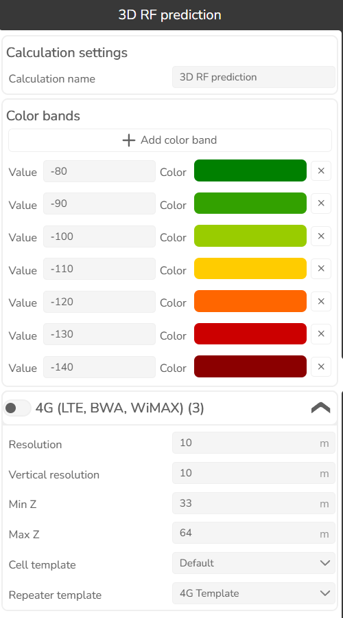
the colors, but you cannot change the values.
Resolution
Prediction raster cell size in meters.
Vertical resolution
Vertical prediction step size in meters.
Min Z
Lowest height level, in meters, at which the prediction is calculated.
Confidential ©Cellular Expert, 2026 Page | 169

---

Cellular Expert Express User Guide 7.3
Max Z
Highest height level, in meters, up to which the prediction is calculated.
Cell template
If the cell is missing the required parameters, the parameters from the template will be used.
Repeater template
If the repeater is missing the required parameters, the parameters from the template will be used.
3.1.20 Visibility prediction
Click this button to open Visibility prediction tool.
Visibility calculations refer to the determination of line-of-sight between transmitting and receiving antennas,

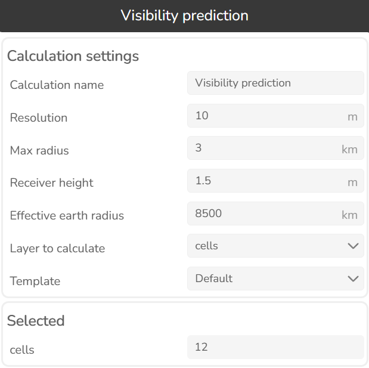
assessing whether any obstructions might impede direct signal transmission.
Calculation name
Name of the calculation that will be displayed in the Prediction history.
Resolution
Prediction raster cell size in meters.
Confidential ©Cellular Expert, 2026 Page | 170

---

Cellular Expert Express User Guide 7.3
| Parameter | Description |
|---|---|
| Max radius | Maximum calculation radius in kilometers. |
| Receiver height | Receiver height above the receiver reference height selected in the workspace settings. |
| Effective earth radius | Earth radius was used for the calculations. |
| Layer to calculate | All selected layers on which predictions can be performed. |
Template
A template which corresponds to the selected layers. When the layer changes the templates change as
well.
Visibility Prediction is a tool that calculates 4 different results:
- Clearance, m – the distance from the profile that is covered or is not covered.
- Line of Sight (LOS) – confirms whether visibility exists between the receiver and transmitter with
the provided receiver height.
- Best Server – the same calculation as for RF Prediction.
3.1.21 Antenna visibility prediction
Click this button to open Antenna visibility prediction tool.
The Antenna Visibility prediction tool is designed to calculate and visualize the feature’s Line-of-sight

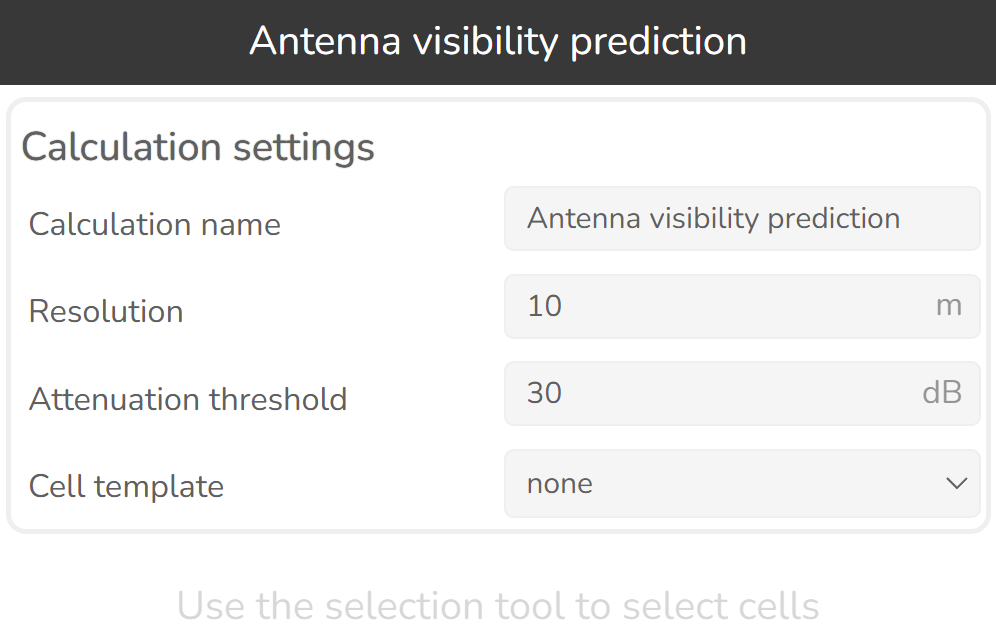
clearance for features based on their azimuth, tilt and selected antenna pattern.
Confidential ©Cellular Expert, 2026 Page | 171

---

Cellular Expert Express User Guide 7.3
| Parameter | Description |
|---|---|
| Calculation Name | Name of the calculation that will be displayed in Prediction history. |
| Resolution | Prediction raster cell size in meters. |
| Cell template | If the cell is missing the required parameters, the parameters from the template will be used. |
| Attenuation threshold, db | Maximum allowable signal loss for determining effective signal visibility. |
Results:
- Line of Sight (LOS) clearance – height difference between the receiver point and feature’s straight
line-of-sight based on tilt and azimuth.
- Pattern clearance – Height difference between the receiver point and the lowest point of the
antenna pattern that’s above the set threshold.
3.1.22 Minimum receiver height
Click this button to open Minimum receiver height tool.
Calculates the minimum receiver height required to satisfy LOS condition for selected features.
Confidential ©Cellular Expert, 2026 Page | 172

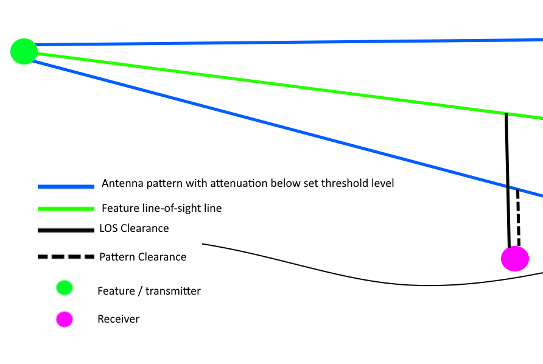

---

Cellular Expert Express User Guide 7.3
Calculation settings
| Parameter | Description |
|---|---|
| Calculation name | Name of the calculation that will be displayed in Prediction history. |
| Resolution | Prediction raster cell size in meters. |
| Max radius | Maximum calculation radius in kilometers. |
| Effective earth radius | Earth radius was used for the calculations. |
Overlap priority
Value priority in places where multiple feature calculations overlap
- Lowest (Reach at least 1) – minimum value will be used
- Highest (Reach all) – maximum value will be used
Results:
- Minimum receiver height, m - minimum receiver height required to satisfy LOS condition
Confidential ©Cellular Expert, 2026 Page | 173

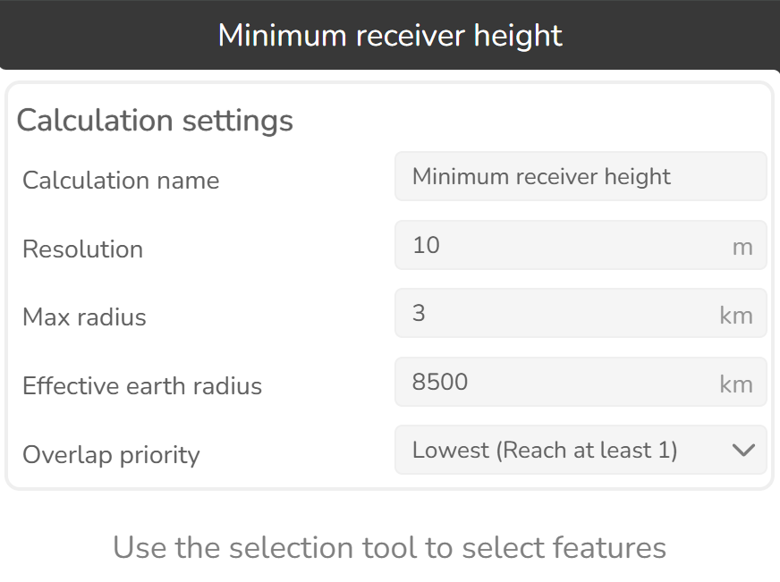

---

Cellular Expert Express User Guide 7.3
- Best Server – Object id of the feature which has the value priority in each pixel. E.g.: In the case of
“lowest” priority setting, pixels have the object id of the feature which has the lowest available
minimum receiver height (best visibility).
3.1.23 Quick minimum receiver height
Click this button to open Quick minimum receiver height tool.
Calculates the minimum receiver height required to satisfy LOS condition for a single feature. Feature
parameters are defined in the tool input fields, therefore it may be a theorical feature that does not exist in

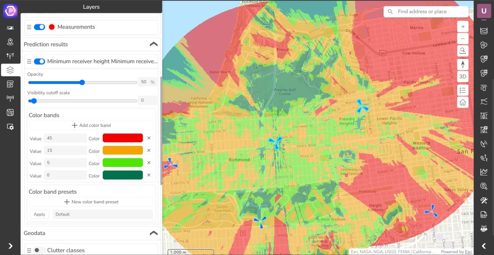

the database.
Confidential ©Cellular Expert, 2026 Page | 174

---

Cellular Expert Express User Guide 7.3
Calculation settings
| Parameter | Description |
|---|---|
| Resolution | Prediction raster cell size in meters. |
| Max radius | Maximum calculation radius in kilometers. |
| Effective earth radius | Earth radius was used for the calculations. |
Close previous results
If this option is enabled, clicking elsewhere on the map or changing the calculation parameters will close
the previous result raster and open the new one. If disabled, the old calculation raster stays displayed on

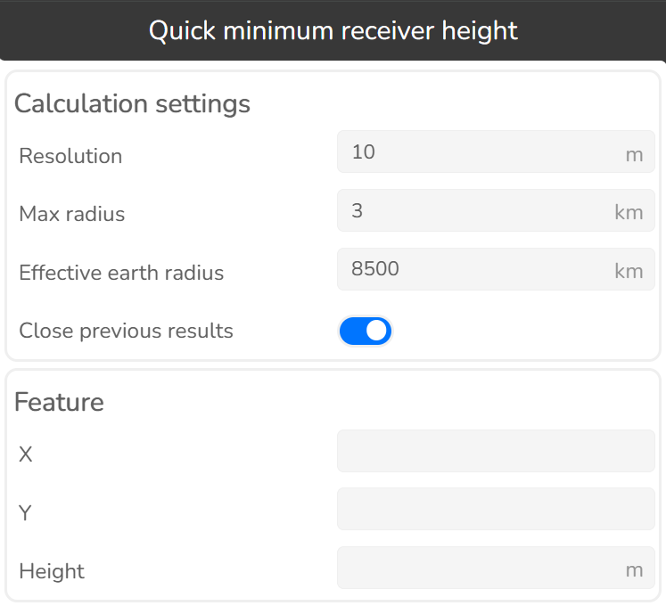
the map.
Feature
| Parameter | Description |
|---|---|
| X | X coordinate of the Feature. |
| Y | Y coordinate of the Feature. |
| Height | Feature height above the ground in meters. |
Confidential ©Cellular Expert, 2026 Page | 175

---

Cellular Expert Express User Guide 7.3
3.1.24 Radar prediction
Click this button to open Radar prediction tool.
Radar Prediction is a tool that lets you calculate predictions on radars. Depending on the view angle and

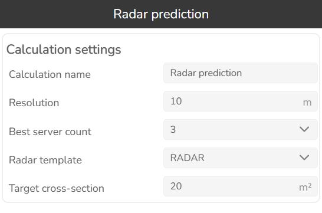
the size of the radar, Radar Predictions will show the reach of radar signals.
Calculation settings
| Parameter | Description |
|---|---|
| Calculation name | Name of the calculation that will be displayed in Prediction history. |
| Resolution | Prediction raster cell size in meters. |
| Best server count | Option to calculate up to 5 best servers. |
| Radar template | If the radar misses the required parameters, the parameters from the template will be used. |
| Target cross-section, m^2 | This parameter describes the target size in square meters. |
| Selected | Current amount of selected radars. |
Results:
- Field Strength raster in dBm
Confidential ©Cellular Expert, 2026 Page | 176

---

Cellular Expert Express User Guide 7.3
3.1.25 Network availability
Click this button to open Network availability tool.
This tool is designed to check if coverage exists at a chosen location. Define the exact coordinates in the
dialog or click on the map to fill the coordinate fields automatically and the tool automatically provides the

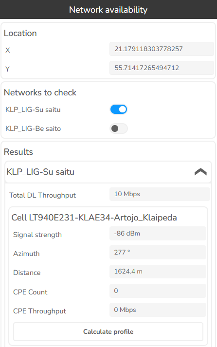

information about possible networks at this location.
The location can be defined manually in the X/Y fields or by clicking on the map. As a result, detailed
information about possible connections is displayed:
- Cell name – cell identification.
- Signal strength – signal value in dBm.
- Azimuth – direction from Receiver to Transmitter.
- Distance – distance between Transmitter and Receiver.
- CPE count – cpe count in a cell.
- CPE throughput – total cpe throughput in a cell.
- Calculate profile – option to open a detailed profile between Transmitter and Receiver.
In addition, the lines between Transmitter and Receiver are displayed on the map.
Confidential ©Cellular Expert, 2026 Page | 177

---

Cellular Expert Express User Guide 7.3
The lines on the map can be visualized in different ways. Move the mouse cursor on the calculate profile

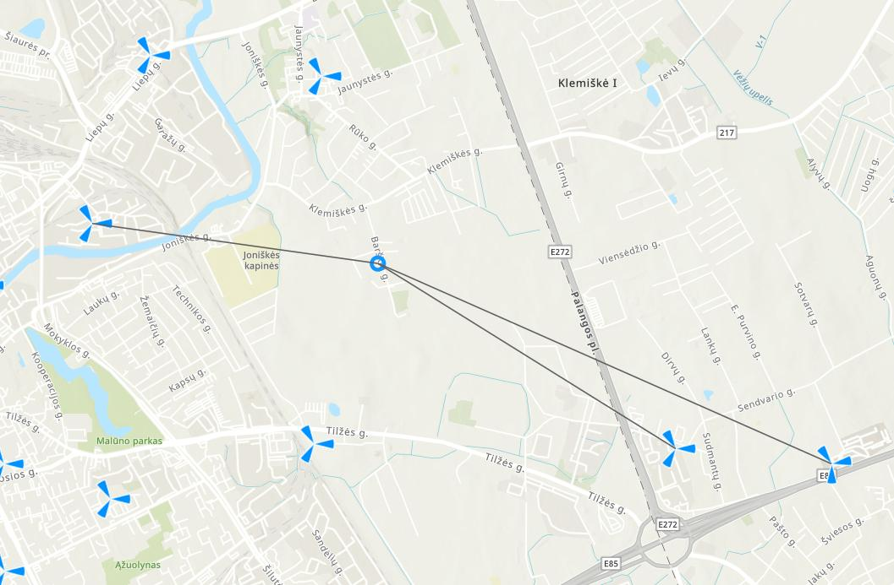

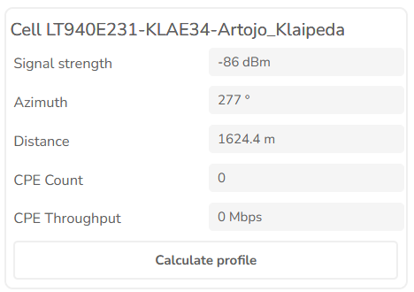
button in tabular view.
Then the appropriate line will be visualized differently.
Confidential ©Cellular Expert, 2026 Page | 178

---

Cellular Expert Express User Guide 7.3
It is possible to draw a profile from the provided results. Press the Calculate profile button to open the

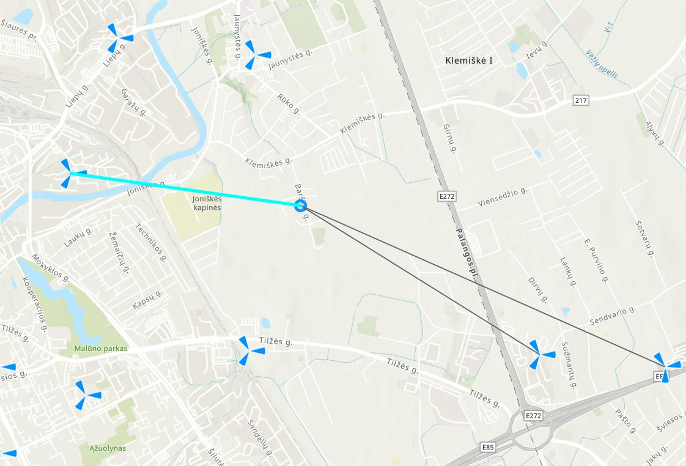

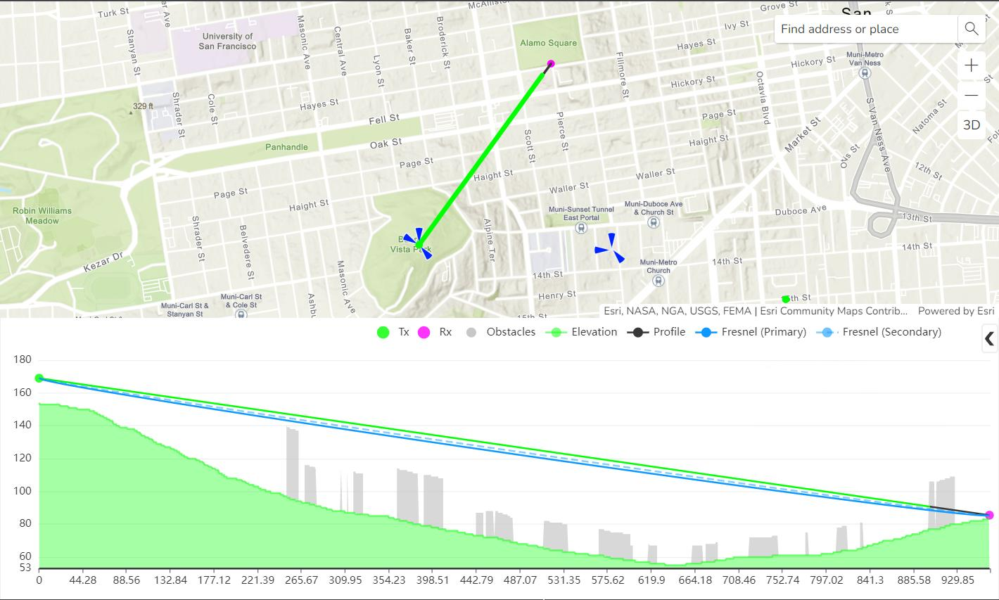

profile.
3.1.26 Model Tuning
Click this button to open Model tuning tool.
Model Tuning is a tool to optimize prediction model parameters based on test points. These test points
Confidential ©Cellular Expert, 2026 Page | 179

---

Cellular Expert Express User Guide 7.3
must be bound to cells by their cell id.
| Parameter | Description |
|---|---|
| Calculation Name | Name of the calculation that will be displayed in the Prediction history. |
| Resolution | Prediction raster cell size in meters. |
| Prediction model | Select which model will be tuned. Use the Features tool to select measurements. |
| Selected | The count of selected measurement points. |
Cell to use
Select the Cell with which you want to do the drive test. At the moment, measuring for a single cell is
supported.
Press Calculate to initiate the model tuning. The model tuning task will be added to the Prediction History

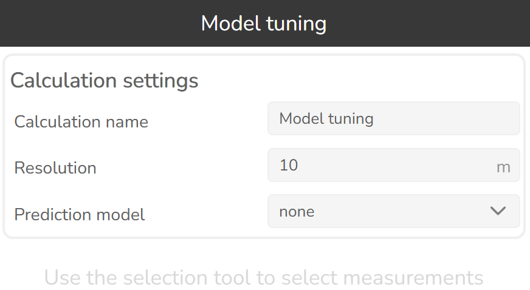

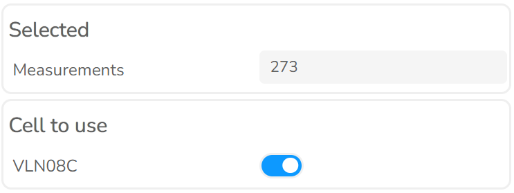
dialog.
Confidential ©Cellular Expert, 2026 Page | 180

---

Cellular Expert Express User Guide 7.3
Click the open button next to the tuning data to open results.
Confidential ©Cellular Expert, 2026 Page | 181

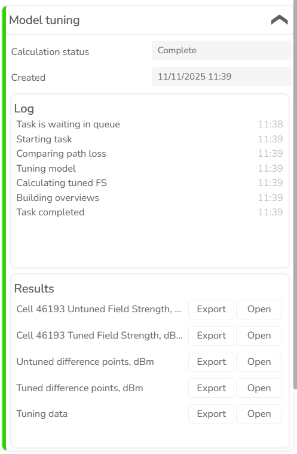

---

Cellular Expert Express User Guide 7.3
Reselect measurements by visibility
Enable the visibility types of your choosing, then click apply selection to select only the measurement points,

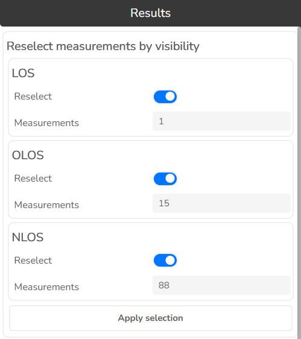

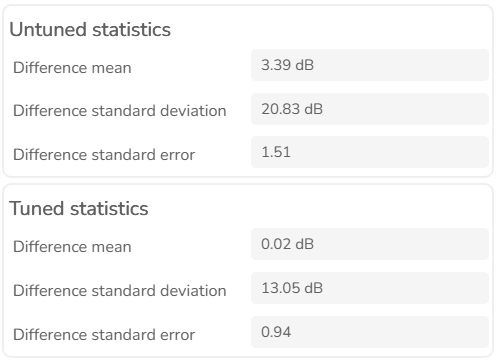
which fall into your selected visibility categories. Then, you may run the model tuning tool again with the
newly selected features. Useful when you want to tune parts of the prediction model related to specific
visibility types.
The comparison between the untuned and tuned prediction models is presented by highlighting the
differences in their mean values, standard deviations, and standard errors.
- Difference Mean during model tuning measures how the average prediction accuracy or
Confidential ©Cellular Expert, 2026 Page | 182

---

Cellular Expert Express User Guide 7.3
performance improves after optimizing model parameters compared to the default settings. For
example, tuning might reduce the average prediction error, leading to more accurate coverage or
signal estimations.
- Standard Deviation reflects the variability in prediction performance. Comparing standard
deviations between untuned and tuned models shows whether tuning makes predictions more
consistent and reliable. For example, lower standard deviation after tuning indicates the model's
predictions are less scattered and more stable.
- Standard Error during model tuning quantifies the precision of the mean prediction. A lower
standard error in the tuned model suggests that the average prediction is more reliable and less
influenced by sample variability, indicating improved model stability and confidence in its
performance.
Model coefficients that are recommended to be changed.
- Offset coefficient – represents the offset in decibels added to the path loss grid.
- Slope coefficient distance – defines the slope based on the distance between the cell and the
receiver location.
- Slope coefficient distance obstructed – represents the slope based on the obstructed distance
between the cell and the receiver location.
Confidential ©Cellular Expert, 2026 Page | 183

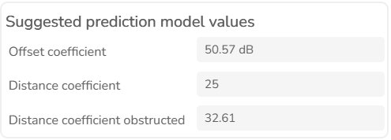

---

Cellular Expert Express User Guide 7.3
Clutter classes
Recommended clutter loss values
3.1.27 Optimal placement
Click this button to open Optimal placement tool.
Optimal placement is a tool that lets the user find optimal positions for a site based on specified parameters.

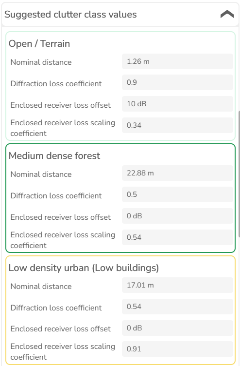

Confidential ©Cellular Expert, 2026 Page | 184

---

Cellular Expert Express User Guide 7.3
| Parameter | Description |
|---|---|
| Calculation Name | Name of the calculation that will be displayed in the Prediction history. |
| Prediction Model | The prediction model list. |
| Resolution | Prediction raster cell size in meters. |
| CPE templates | If the CPE is missing required parameters, the parameters from the template will be used. |
| Tower height | The height of the tower that hosts the site. |
| Frequency | The frequency value in MHz. |
| TX power | Transmitter power in dBm. |
| TX antenna gain | Transmitter gain in dBi. |
Confidential ©Cellular Expert, 2026 Page | 185

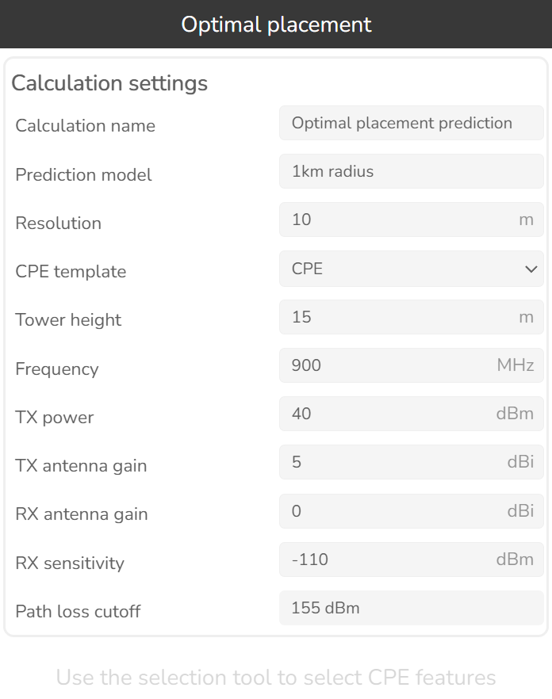

---

Cellular Expert Express User Guide 7.3
RX antenna gain
Receiver gain in dBi.
RX sensitivity
Receiver gain in dBi.
Path loss cutoff
The path loss is the floor of the prediction.
The prediction produces two rasters:
- Covered Points – defines what number of points are covered in a certain pixel
- Coverage Percentage – the percentage by which the pixel is covered. Meaning that 100% is a fully
covered point
3.1.28 Utilities
Click this button to open Utilities tool.
3.1.28.1 Beamwidth to HCM code
Used to generate HCM pattern codes from vertical & horizontal beamwidth values. Useful when you do not

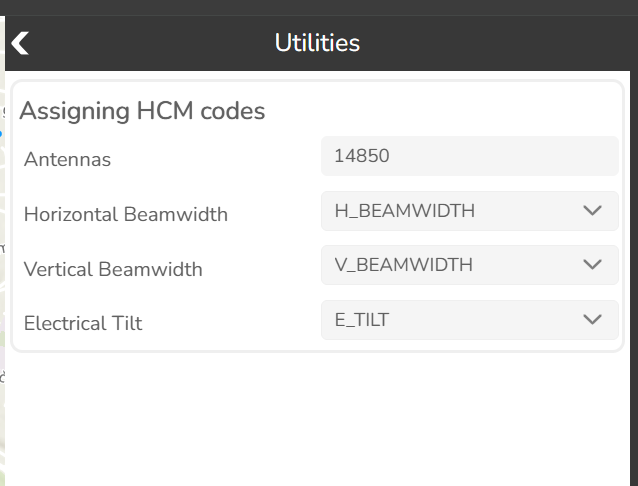

know the exact antenna model for your cells, and only have beamwidth values assigned to them.
After uploading the CSV file you are prompted to assign the CSV fields to the required parameters:
3.1.28.2 Feature name to object ID
Used to extract feature object_id values given their names in the csv. Useful when you want to import
Confidential ©Cellular Expert, 2026 Page | 186

---

Cellular Expert Express User Guide 7.3
features with object_id references to other already existing features. E.g.: assign cell_id field to
measurements given cell_name.
3.1.28.3 Assign antennas to cells by name
Takes a .csv file with an antenna name field, and outputs the same file with antenna_id field added.
Antenna_id values are filled by finding a matching antenna in the CE Express antenna database and
assigning it’s ID to the row.
3.1.28.4 SMADEF-XML to frequency plan CSV
Pulls allotment section of SMADEF-XML file and outputs a CSV with a frequency plan carrier list, that may

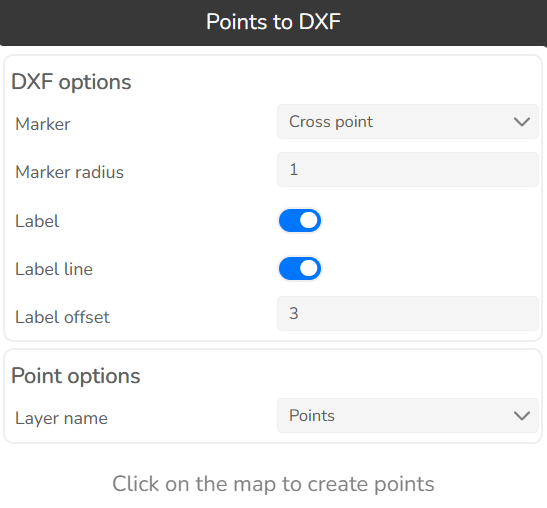
be imported through the link frequency plans tool.
3.1.28.5 Export features to KMZ
Exports selected or all features to a KMZ file.
3.1.29 Points to DXF
Click this button to open Points to DXF tool.
Allows for easy reference point transfer between the CE Express interface and CAD applications.
Confidential ©Cellular Expert, 2026 Page | 187

---

Cellular Expert Express User Guide 7.3
DXF options
| Parameter | Description |
|---|---|
| Marker | Type of marker to draw |
| Marker radius | Size of marker |
| Label | Draw number labels next to the points |
| Label line | Draw line from the labels to the points |
| Label offset | How far to place the labels from the points |
Point options
Layer name
Output points are placed into different layers. New points are placed into this layer upon map click. Point

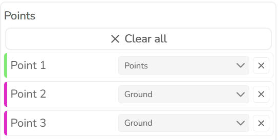

layer may be changed after the fact within the line for each point in the UI.
3.1.30 EMF
Click this button to open EMF tool.
Used for calculating the electromagnetic field, or non-ionising radiation for regulatory purposes.
Confidential ©Cellular Expert, 2026 Page | 188

---

Cellular Expert Express User Guide 7.3
| Parameter | Description |
|---|---|
| Calculation name | Name of the calculation that will be displayed in the Prediction history. |
| Resolution | Prediction raster cell size in meters. |
| Cell template | If the cell is missing the required parameters, the parameters from the template will be used. |
| Reflection factor | No reflection – ground reflections aren’t considered • • Realistic reflection – reflection coefficient of 2.56 Full reflection - reflection coefficient of 4 • |
| Receiver height | Receiver height above the receiver reference height selected in the workspace settings. |
Results:
- EMF Limit usage, % - weighted percentage of frequency band regulatory EMF limit.
- EMF, W/m2 – EMF value in mW/m2
- EMF, mV/m – EMF value in mV/m
3.1.31 Audibility
Click this button to open Audibility tool.
Confidential ©Cellular Expert, 2026 Page | 189

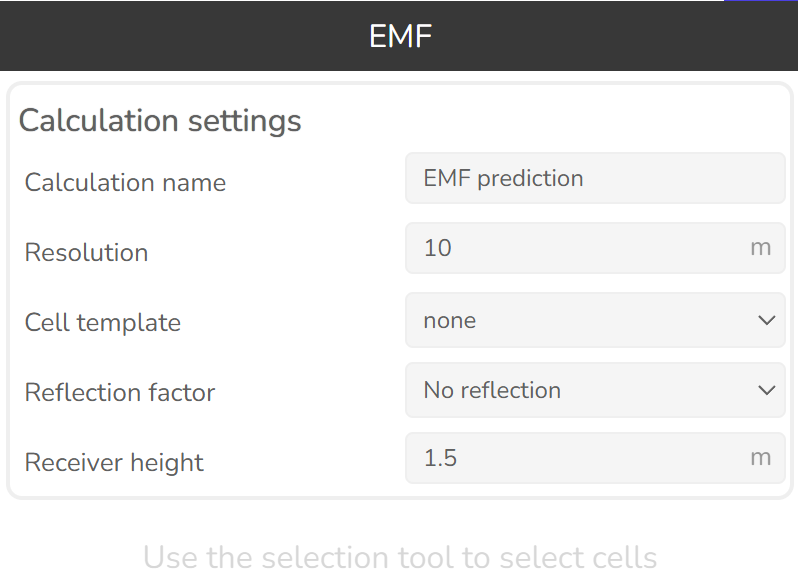

---

Cellular Expert Express User Guide 7.3
| Parameter | Description |
|---|---|
| Calculation name | Name of the calculation that will be displayed in Prediction history. |
| Resolution | Prediction raster cell size in meters. |
| Siren Template | Option to use the parameters from the template if the siren misses the required parameters. |
Results:
- Audibility, dB. The siren sound prediction tool calculates the sound pressure level (SPL) at various
locations around a siren using ISO 9613-2 as the standard for sound propagation. The results are
represented in decibels (dB), showing how loud the siren is at different distances and conditions. Each

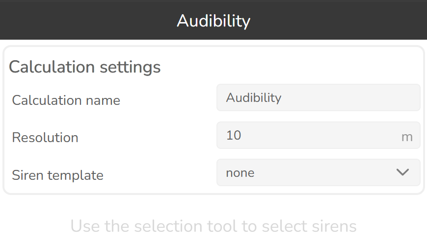
location's sound pressure level is affected by several factors:
1. Distance from the Source (Siren)
o SPL decreases as the distance from the siren increases due to geometrical spreading.
o The tool provides results that help visualize how sound intensity reduces at different
locations.
2. Obstacles and Terrain
o Buildings, hills, and other obstacles can block or reflect sound, reducing the SPL.
o Flat, open areas will have a higher SPL compared to urban environments with multiple
obstacles.
3. Atmospheric Conditions
o Atmospheric factors like temperature, humidity, and wind influence sound propagation.
o These effects are taken into account according to ISO 9613-2.
4. Frequency-Dependent Attenuation
o Higher frequencies (treble) attenuate faster than lower frequencies (bass).
o The tool might calculate the overall SPL or provide frequency-specific results.
- The best server raster shows the identification of siren generating the strongest sound value at
each pixel.
Confidential ©Cellular Expert, 2026 Page | 190

---

Cellular Expert Express User Guide 7.3
3.1.32 Lux calculation
Click this button to open Lux calculation tool.
Calculation name
Name of the calculation that will be displayed in the Prediction history.
Resolution
Prediction raster cell size in meters.
Light template
Option to use the parameters from the template if the light misses the required parameters.
Results:
- Illuminance, centilux (lx * 100)
3.1.33 Geoclimatic data
Click this button to open Geoclimatic data tool.
Geoclimatic Data is a tool that lets you adjust the geoclimatic settings that will be used in certain calculations

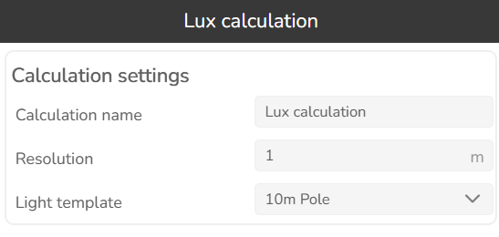

(e.g. Link Prediction).
Confidential ©Cellular Expert, 2026 Page | 191

---

Cellular Expert Express User Guide 7.3
3.1.33.1 Gaseous Absorption
Gaseous absorption define values for dry air pressure and water vapour density. These values can be
obtained from predefined geoclimatic data maps. Water vapour density data according to ITU-R P.836-3.
It is used in gaseous absorption evaluation.
Dry Air Pressure
The atmospheric pressure contributed by air that contains no water vapor, typically measured in
hectopascals (hPa).
Water Vapour Density
The mass of water vapor present in a unit volume of air, typically measured in grams per cubic meter (g/m³).

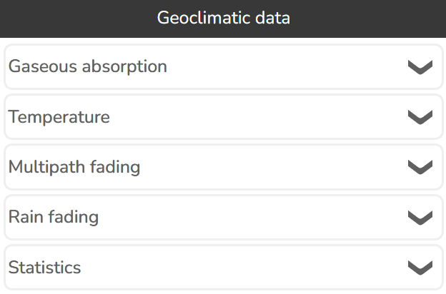

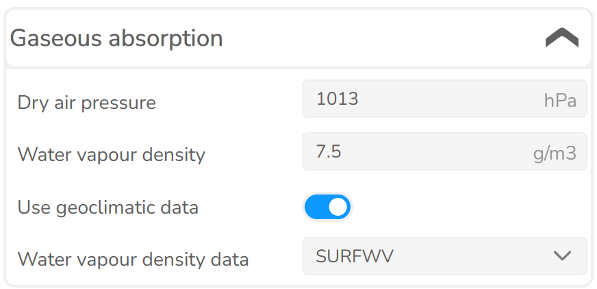
Confidential ©Cellular Expert, 2026 Page | 192

---

Cellular Expert Express User Guide 7.3
Use Geoclimatic Data
Enable/Disable this Geoclimatic data
Water Vapour Density Data
A dropdown menu that allows the user to select the source or type of data used to determine water vapor
density.
3.1.33.2 Temperature
Annual mean surface temperature at 2m above the surface of the Earth according to ITU-R P.1510. The
data is used to evaluate the thermal noise of a receiver.
Annual Temperature
Annual Temperature expressed in Kelvins.
Use Geoclimatic Data
Enable/Disable this Geoclimatic data
Annual Temperature Data
A dropdown menu allowing the user to select the dataset from which the annual temperature data should
be sourced.
3.1.33.3 Multipath Fading
The Multipath Fading page defines refractivity data and calculation parameters for ITU and Vigants-Barnett
methods.
Worst month-to-annual statistics conversion can be performed according to ITU-R P. 530 or ITU-R P. 841
methods.
Refractivity gradient data is based on ITU-R P.453-9. Refractivity gradient data is used for multipath fading

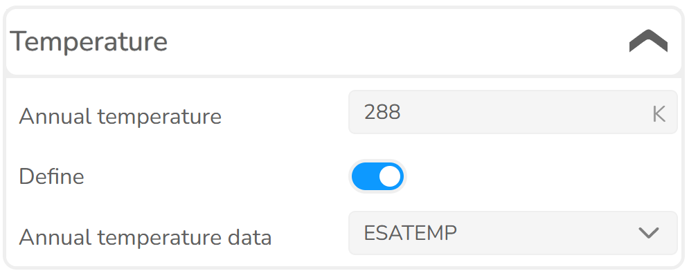
analysis.
Confidential ©Cellular Expert, 2026 Page | 193

---

Cellular Expert Express User Guide 7.3
ITU Method
Enable/Disable the ITU Method
ITU-R P.530 version
A dropdown menu allowing the user to select the ITU-R P.530 version.
Confidential ©Cellular Expert, 2026 Page | 194

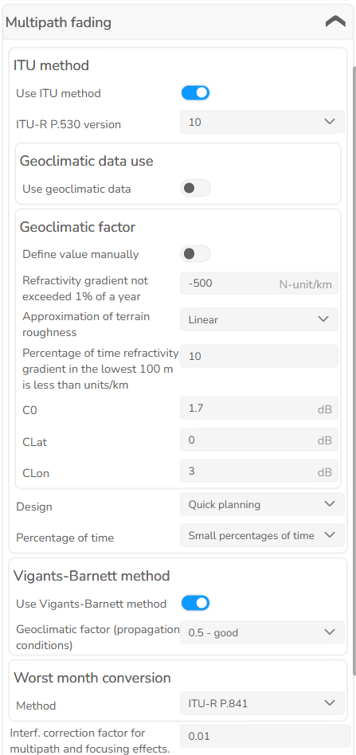

---

Cellular Expert Express User Guide 7.3
Use Geoclimatic Data
Enable/Disable this Geoclimatic data.
Geoclimatic Factor (Define value manually)
A field to input or calculate a factor used in propagation modeling, affecting the prediction of multipath
fading.
Geoclimactic Factor (Calculate)
Calculate the geoclimactic factor used in propagation modeling, affecting the prediction of multipath fading.
- Approximation of terrain roughness - Options to select how terrain roughness is modeled in the
calculations - as a constant value or as a linear approximation.
- Percentage of time that refractivity gradient in the lowest 100 m is less than 100 units/km -
An input field for the percentage of time when the refractivity gradient at low altitudes meets a
specific threshold.
- Co, dB / Lat, dB / Lon, dB - Fields to input correction values in decibels for specific geographic
coordinates, possibly related to the orientation or position of the transmitter/receiver.
| Parameter | Description |
|---|---|
| Percentage of Time / Design | A dropdown menus to choose the granularity of the time percentage for which the calculations are relevant, and the level of detail required for planning. |
| Use Viggants-Barnett Method | Enabled/Disabled Viggants-Barnett Method. |
| Worst month conversion | A section to select the ITU recommendation (either ITU-R P.530 or ITU-R P.841) for converting worst- month statistics to annual statistics. |
Interf. correction factor for multipath and focusing effects
Input for the percentage of time to apply an interference correction factor to account for multipath and
focusing effects.
3.1.33.4 Rain Fading
The rain fading page defines rain regions (ITU and Crane) for rain rate statistics and calculation methods
(ITU and Crane). The rain rate exceedance parameter for 0.01% of the time can be set manually or
automatically according to the rain zone.
Confidential ©Cellular Expert, 2026 Page | 195

---

Cellular Expert Express User Guide 7.3
| Parameter | Description |
|---|---|
| Geoclimatic data - ESA rain rate data / ESA rain rate | Options to select the dataset (such as "ESARAIN_V5") and the specific field within that dataset (like "MT") for rain rate data, used for calculating rain attenuation. |
| Fading method - ITU method / ITU-R P.530 version | A checkbox to select the ITU method for rain fading calculations and a dropdown to choose the version of the ITU-R P.530 recommendation being applied. |
| Crane | This is a model selection option related to the Crane model for calculating rain attenuation. |
End-to-end reliability method - Multi-hop / Two-way
Selection options for the method of calculating the reliability of a signal in a communication path that may

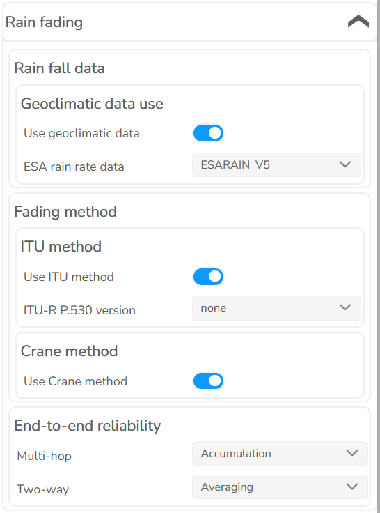
involve multiple hops or two-way transmission.
3.1.33.5 Statistics
These settings are used to handle statistical conversions for telecommunication planning, ensuring that
systems are designed to cope with the worst-case scenarios based on historical data and predictive models.
Confidential ©Cellular Expert, 2026 Page | 196

---

Cellular Expert Express User Guide 7.3
Define
Options to either define a fixed conversion factor or to calculate it based on additional inputs.
Q1 (1...12)
An input field likely used to define a conversion factor or another parameter for a specific month or set of
months.
Beta
An input field for the beta parameter, which may be part of the statistical model or conversion formula within

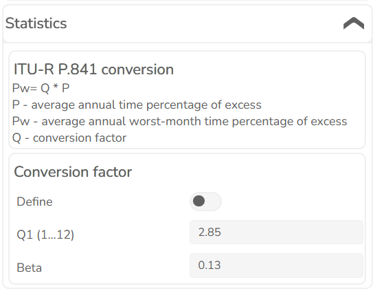

the ITU-R P.841 recommendation.
3.1.34 [Spectrum masks](#kw:711-spectrum-masks:ce-pro-rlp)
Click this button to open Spectrum masks tool.
The tool enables you to create spectrum masks that will be necessary to be used in calculations.
Confidential ©Cellular Expert, 2026 Page | 197

---

Cellular Expert Express User Guide 7.3
Move the mouse cursor over the spectrum mask and delete it using Delete button.
By selecting a spectrum mask you can view its properties and change them. Changes in the mask point

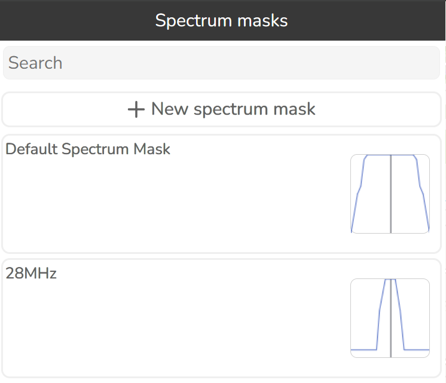

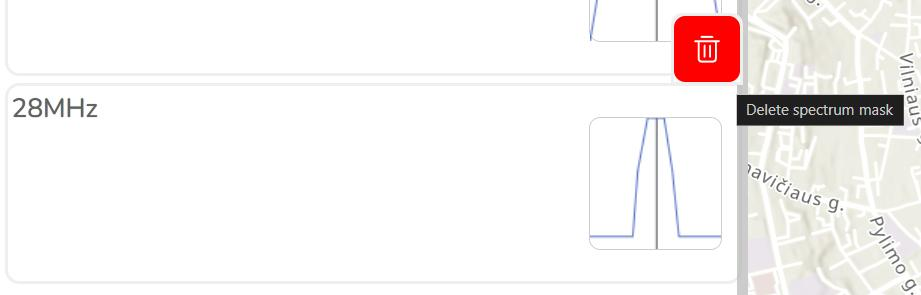
values will be reflected in the graph.
3.1.34.1 Add spectrum mask
To create a spectrum mask, press the New spectrum mask button.
Confidential ©Cellular Expert, 2026 Page | 198

---

Cellular Expert Express User Guide 7.3
Mask attributes
Mask Name
Spectrum mask identification.
Add point
Add spectrum mask point (frequency and attenuation).
Adds a new mask point to the spectrum mask
Deletes mask point.
Spectrum mask
When you create a spectrum mask, you can see its visual representation as well as the values of each

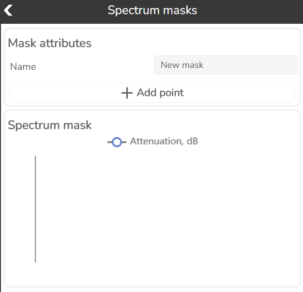

spectrum mask point (frequency and attenuation)
Confidential ©Cellular Expert, 2026 Page | 199

---

Cellular Expert Express User Guide 7.3
You can change any values of these points and those changes will be reflected in the graph.
Confidential ©Cellular Expert, 2026 Page | 200

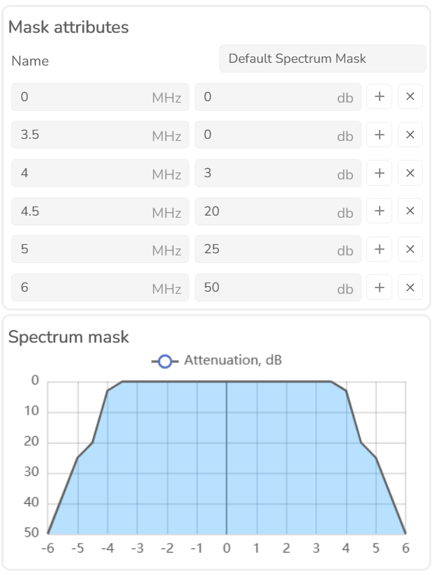

---

Cellular Expert Express User Guide 7.3
3.1.35 [Radios](#kw:710-radios:ce-pro-rlp)
Click this button to open Radios tool.
The tool enables you to create and preview radios that will be necessary to create a link and later be used

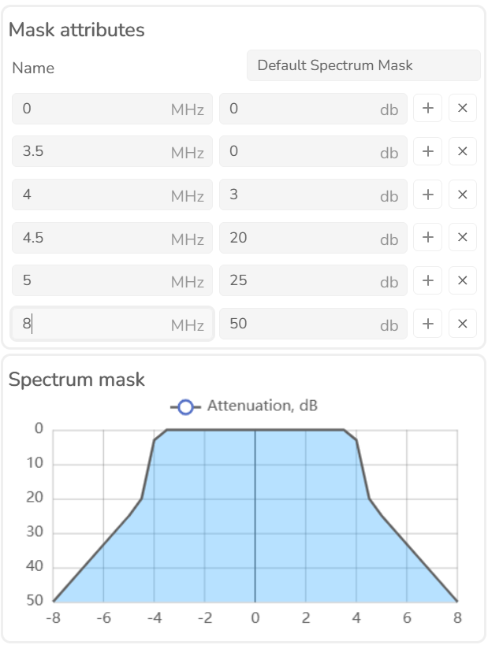

in calculations.
Confidential ©Cellular Expert, 2026 Page | 201

---

Cellular Expert Express User Guide 7.3
Move the mouse cursor over the radio and delete radio using Delete button.
By clicking an already existing radio, you can edit its properties and save them.
Confidential ©Cellular Expert, 2026 Page | 202

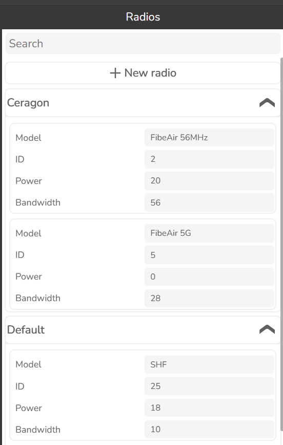

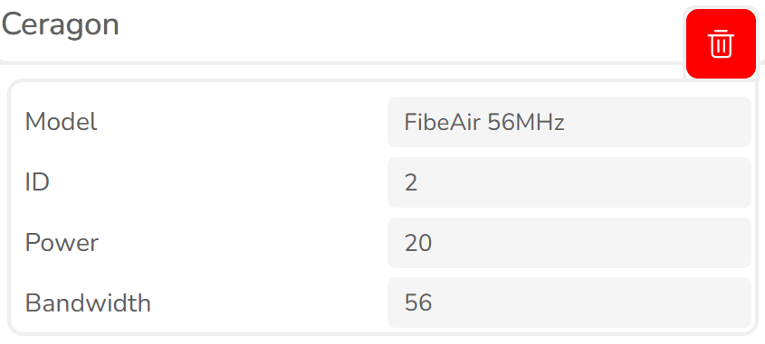

---

Cellular Expert Express User Guide 7.3
3.1.35.1 Add new radio
To create a radio press the New radio button.
Confidential ©Cellular Expert, 2026 Page | 203

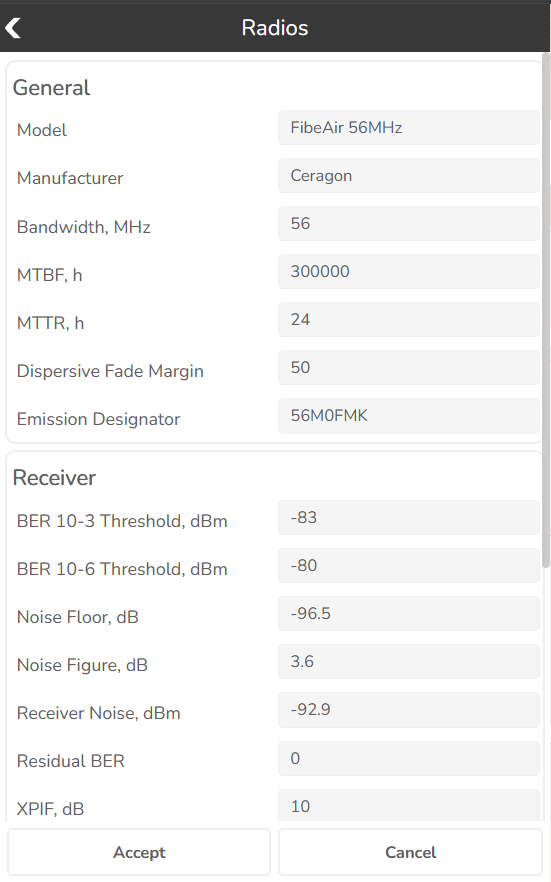

---

Cellular Expert Express User Guide 7.3
General
Model
Radio identification or name.
Manufacturer
Radio manufacturer (company or entity).
Bandwidth, MHz
Range of frequencies within which the radio operates, value in MHz.
MTBF, h
Mean time between failures: average time (in hours) between successive failures of the radio system during

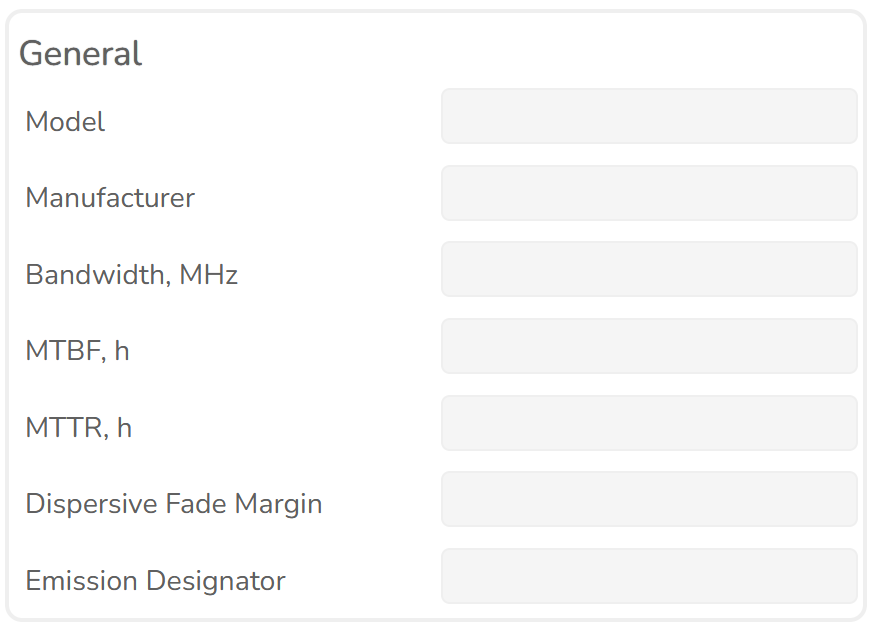
normal operation, indicating reliability.
MTTR, h
Mean time to repair: average time (in hours) required to repair the radio system after a failure occurs,
indicating maintainability.
Dispersive Fade Margin, dB
Additional signal strength required to overcome dispersion and fading effects in the radio communication
system, measured in dB.
Emission Designator
Code describing the characteristics of the radio emission, including modulation type, signal nature, and
bandwidth.
Confidential ©Cellular Expert, 2026 Page | 204

---

Cellular Expert Express User Guide 7.3
Receiver
BER 10-3 Threshold, dBm
Receiver sensitivity threshold for BER = 10-6.
BER 10-6 Threshold, dBm
Receiver sensitivity threshold for BER = 10-3.
Noise Floor, dB
Refers to the minimum power level of unwanted noise or interference at the receiver at the base station.
Noise Figure, dB
Measure of the degradation of the signal-to-noise ratio (SNR) as a signal passes through a radio component

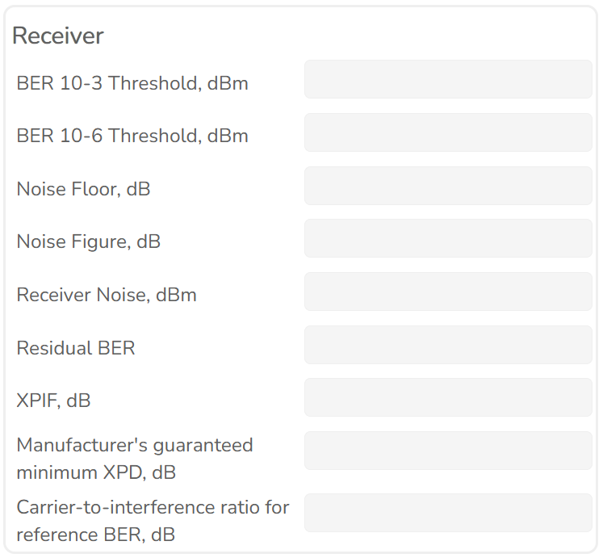
or system. Value in dB. Required for 4G and 5G technologies.
Receiver Noise, dBm
The sum of Noise Floor and Noise Figure.
Residual BER
The remaining bit error rate after all error correction methods have been applied.
XPIF, dB
Confidential ©Cellular Expert, 2026 Page | 205

---

Cellular Expert Express User Guide 7.3
Cross-polarization interference factor: interference caused by signal components with orthogonal
polarization states, indicating the impact of cross-polarization on system performance, expressed in
decibels (dB). The default value is 20. The value should be higher than 0 for rain ITU fading calculations to
work.
Manufacturer’s guaranteed minimum XPD, dB
The manufacturer’s guaranteed minimum cross-polar discrimination, expressed in decibels (dB). The
default value is 30.
Carrier-to-interference ratio for a reference BER, dB
Carrier-to-interference ratio for a reference bit error rate, expressed in decibels (dB). The default value is

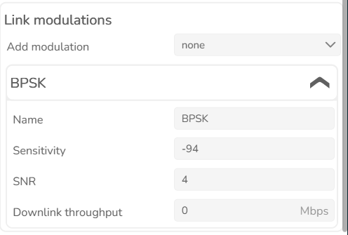
35.
Transmitter
Power, dBm
Power value in dBm.
Automatic Transfer Power Control Range (ATPC), dB
The range over which the radio can automatically adjust its transmission power, measured in dB.
Confidential ©Cellular Expert, 2026 Page | 206

---

Cellular Expert Express User Guide 7.3
The modulations are used in MW link calculations and specifically can be defined for Radios.
Modulations
Add modulation
A new modulation with default values can be initialized.
3.1.36 Frequency plans
Click this button to open Frequency plans tool.
The tool enables you to create frequency plans that will be necessary to create a link and later be used in

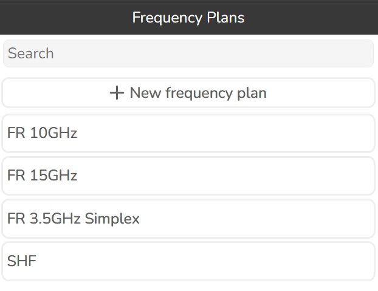

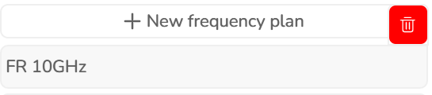

calculations.
Move the mouse cursor over the frequency plan and delete it using Delete button.
3.1.36.1 Import frequency plan
To import a frequency plan press the New frequency plan button
Confidential ©Cellular Expert, 2026 Page | 207

---

Cellular Expert Express User Guide 7.3
and then select Import channels CVS.
To start the import procedure, select or drag and drop the frequency channel csv file. Here is an example:

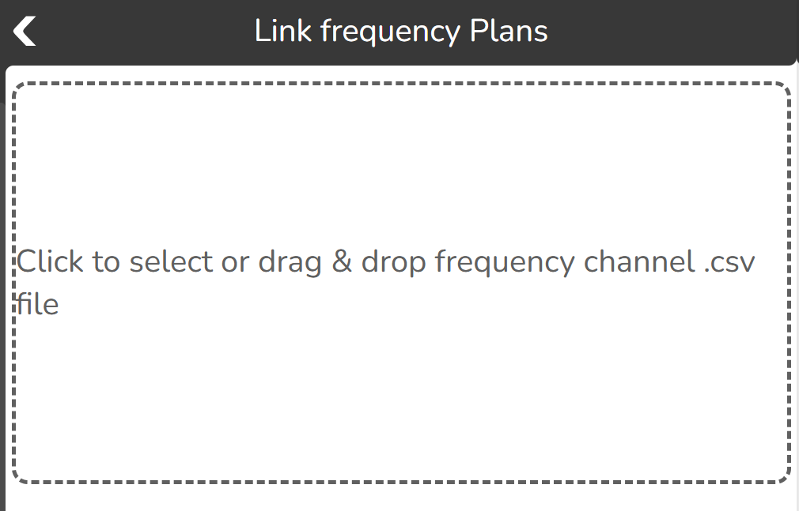

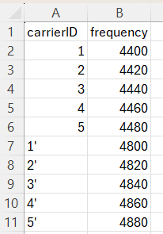
Confidential ©Cellular Expert, 2026 Page | 208

---

Cellular Expert Express User Guide 7.3
3.1.36.2 Add frequency plan manually
To add manually a frequency plan press the New frequency plan button
and then select Create manually.
General
Name
Frequency Plan identification
Duplex
Specifies whether the signal can be transmitted and received simultaneously. Changing the duplex mode

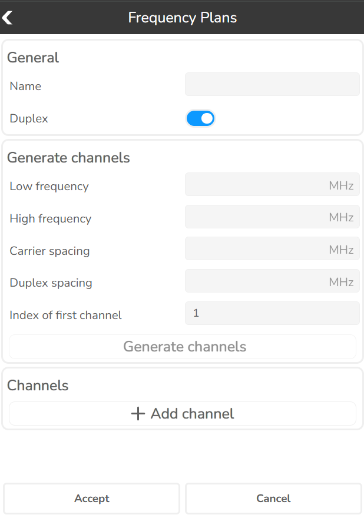
will affect the carrier selection.
Generate channels
Confidential ©Cellular Expert, 2026 Page | 209

---

Cellular Expert Express User Guide 7.3
| Parameter | Description |
|---|---|
| Low/high frequency | Frequencies in MHz. |
| Carrier spacing | The frequency separation between adjacent carrier frequencies in a communication system, ensuring non- interference between carriers. |
| Duplex spacing | Frequency separation between the transmit and receive bands in a two-way communication system. |
| Index of first channel | The numbering start point for generated channels. |
| Generate channels | Creates a list of channels based on the inputs. |
Channels
| Parameter | Description |
|---|---|
| Add channel | Allows manual addition of individual channels to the frequency plan. |
| Channel | Channel identifier. |
| Frequency | Channel ’s frequency value in MHz. Add channel using Add channel below button |
Confidential ©Cellular Expert, 2026 Page | 210

---

Cellular Expert Express User Guide 7.3
Delete channel using Delete channel button
3.1.37 Link prediction
Click this button to open Link prediction tool.
Calculation settings
Calculation Name
Link Prediction identification.
Link Template
The template will fill all empty or not specified fields with default values that are not necessary for

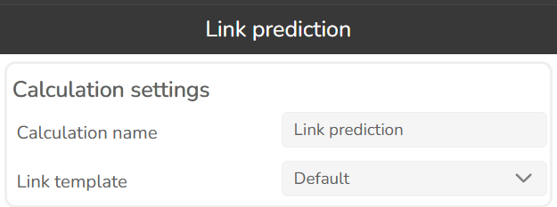
predictions.
Confidential ©Cellular Expert, 2026 Page | 211

---

Cellular Expert Express User Guide 7.3
Interference
Calculate Interference
If checked will calculate the interference of multiple links.
Use interference radius
If enabled, also allows to specify a certain radius from either link endpoint. Points outside this range will not

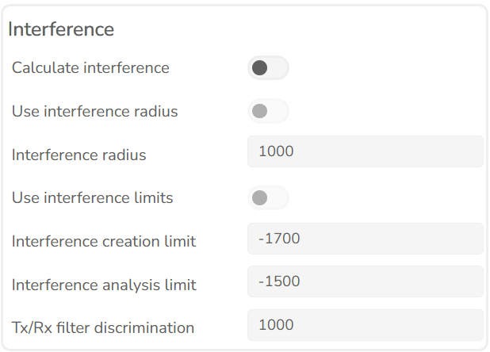
be included in the calculation, speeding up the calculation process. If disabled all links will be used in the
calculations.
| Parameter | Description |
|---|---|
| Interference creation limit | The power threshold below which no interference for links will be calculated. |
| Interference analysis limit | The power threshold below which no links with lesser interference will be included in the analysis. |
| Tx/Rx filter discrimination | The ability of filters in a duplex system to effectively separate and prevent interference between Tx and Rx frequencies. No dBm greater than this will be accounted for in the calculation. |
Confidential ©Cellular Expert, 2026 Page | 212

---

Cellular Expert Express User Guide 7.3
Field Margin
Include Field Margin in Power Budget
If checked, it will take into account the specified field margin for Power Budget calculations.
Thermal Fade Margin
The threshold below which thermal fade will not be calculated
Tropospheric scatter
Calculate Tropospheric Scatter
Enable/Disable this option.
Troposcatter time percentage
Time Percentage in %.
Confidential ©Cellular Expert, 2026 Page | 213

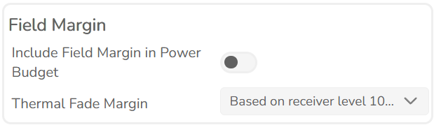

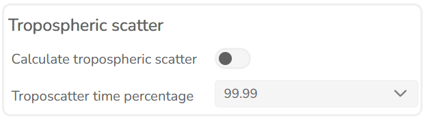

---

Cellular Expert Express User Guide 7.3
Method
The standard used to calculate the performance metric.
Statistics
A selection indicating if the metric is calculated based on yearly data or the data from the month with the

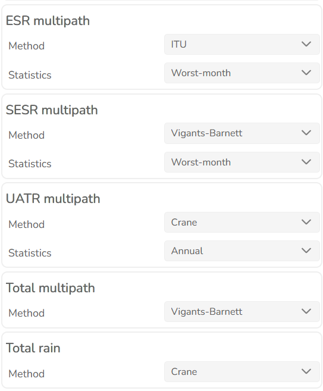
poorest performance.
3.1.37.1 Link prediction results
After calculations, you will be able to view Profile, Interference, Performance and Capacity calculation
results.
Confidential ©Cellular Expert, 2026 Page | 214

---

Cellular Expert Express User Guide 7.3
| Parameter | Description |
|---|---|
| Carrier | Select different carriers to view the results for each one of them. |
| Diversity improvement | To alleviate the effect of multipath fading, various propagation diversity techniques are employed. |
| Protection improvement | The protection improvement factor is a ratio between unprotected and protected unavailability. Profile - The Link Profile behaves in virtually the same way as a regular profile. |
Confidential ©Cellular Expert, 2026 Page | 215

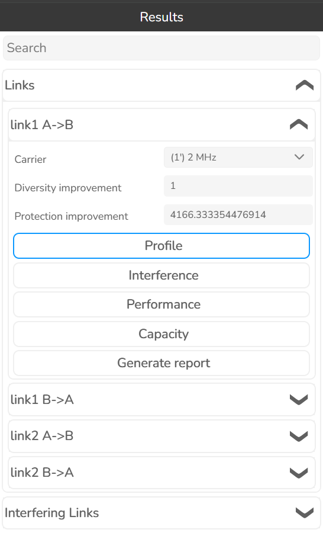

---

Cellular Expert Express User Guide 7.3
Power Budget - the calculation of the balance between transmitted power, power losses in the system,
and receiver sensitivity in a communication system.
Path Loss - the reduction in signal strength as it travels from the transmitter to the receiver.
Interference - the undesired impact of one signal on another, leading to potential signal degradation.
Performance - assessments of key metrics like data rate, error rates, and signal-to-noise ratio, crucial for

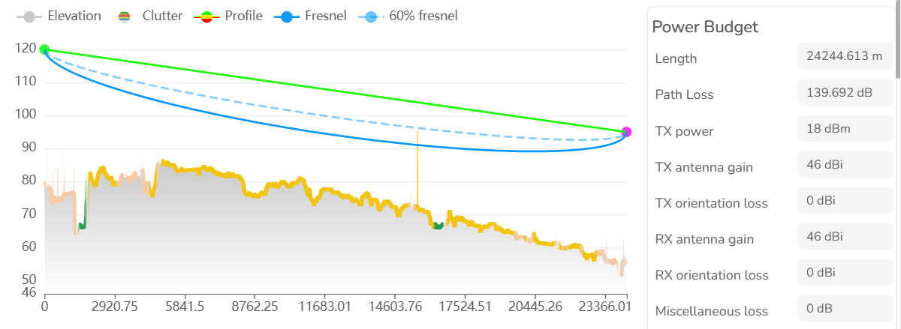

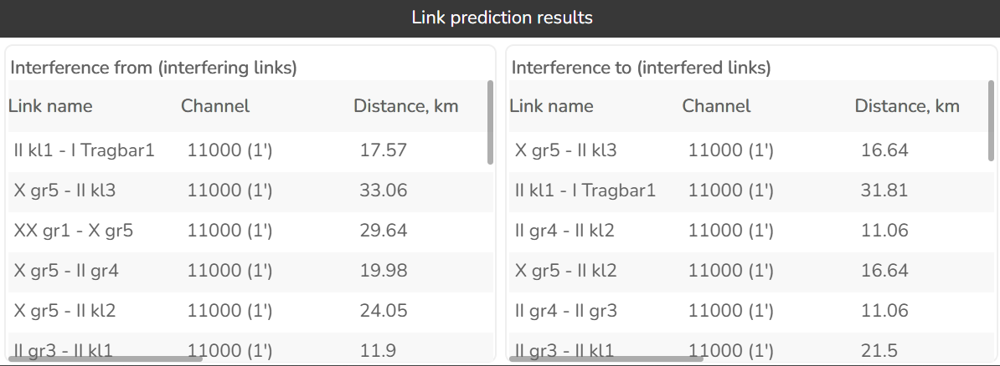
evaluating and optimizing a communication system's efficiency.
Confidential ©Cellular Expert, 2026 Page | 216

---

Cellular Expert Express User Guide 7.3
3.1.37.2 Interfering links
In this tab, you will be able to view interference Power Budget, Path Loss, Profile, and Spectrum Mask

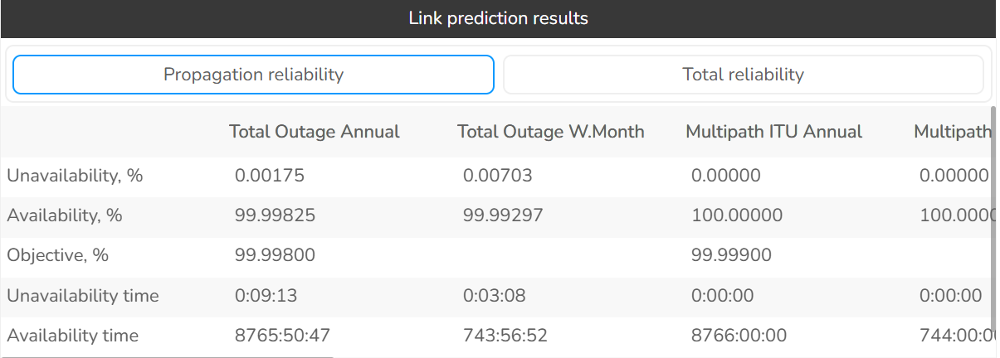

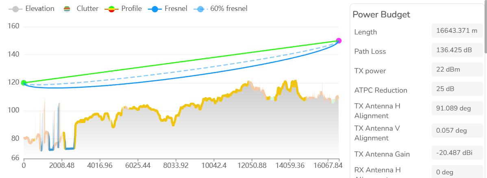

results in an unordered fashion.
Profile - The Link Profile behaves in virtually the same way as a regular profile.
Power Budget - the calculation of the balance between transmitted power, power losses in the system,
Confidential ©Cellular Expert, 2026 Page | 217

---

Cellular Expert Express User Guide 7.3
and receiver sensitivity in a communication system.
Path Loss - the reduction in signal strength as it travels from the transmitter to the receiver.
Spectrum Mask - the method used to assess the usage efficiency of a frequency spectrum in a
telecommunications system, involving the measurement of how much and how effectively different
frequencies are being utilized.
3.1.37.3 Generate report
The calculation results can be automatically transferred into a Link Prediction Report. This report will
show profile, prediction parameter and results, performance and propagation reliability. The report can be

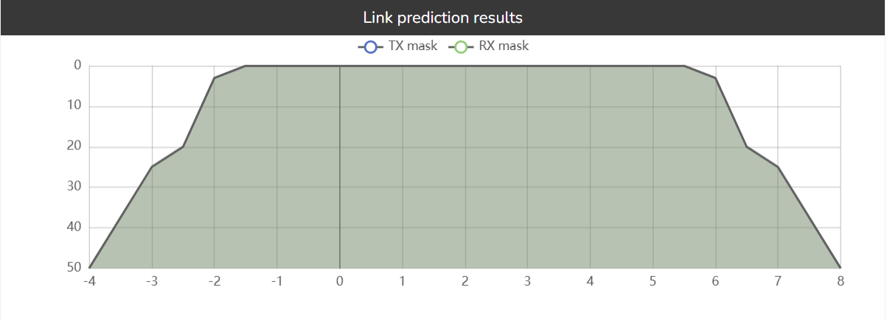

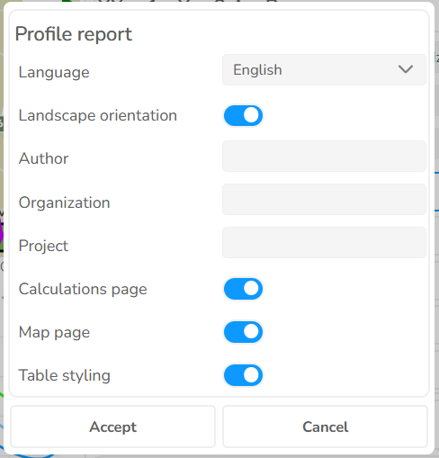
exported in PDF format.
Confidential ©Cellular Expert, 2026 Page | 218

---

Cellular Expert Express User Guide 7.3
Report example:
Confidential ©Cellular Expert, 2026 Page | 219

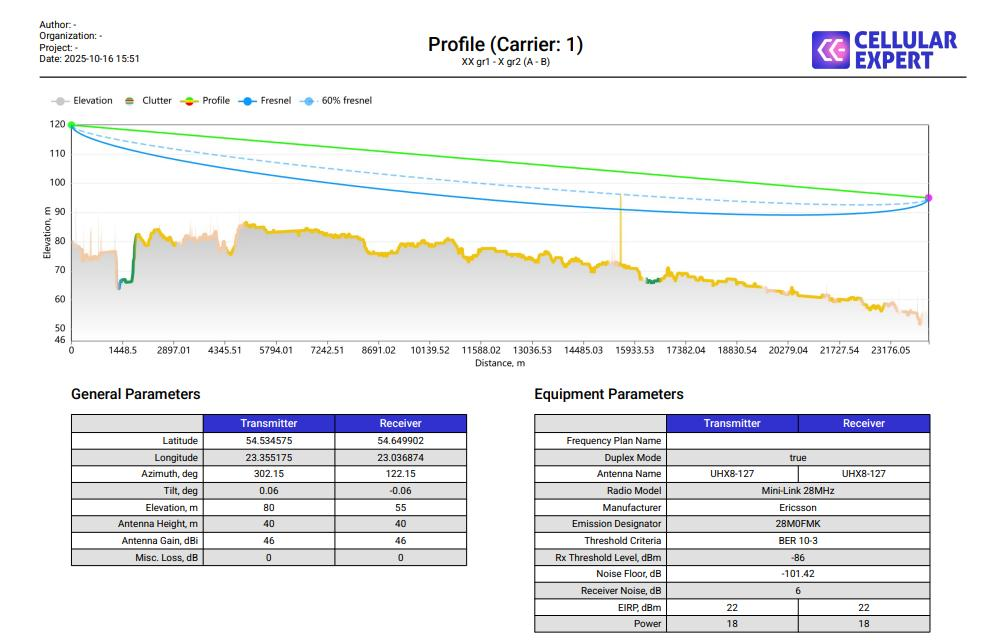

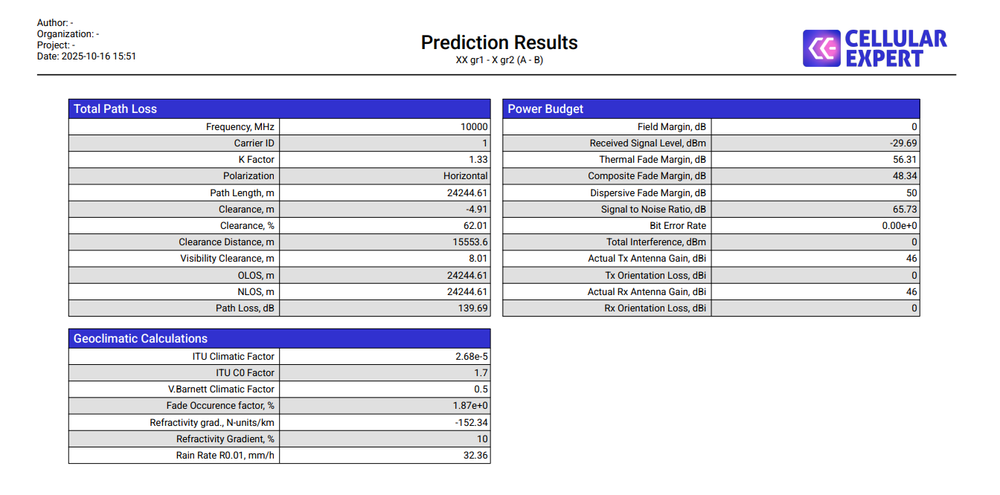

---

Cellular Expert Express User Guide 7.3
3.1.38 Automatic frequency planning
Click this button to open Automatic frequency planning tool.
The automatic frequency planning tool for each selected link suggests the best channel from the chosen
frequency plan and the selected channel list. It considers inter-link interference, evaluates signal-to-
interference ratio (SIR) across available carriers, and aims to maximize link performance while minimizing

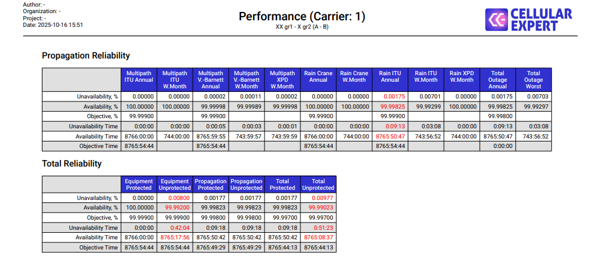

co-channel interference. The tool accounts for duplex link pairing, node-layer priority, and site location
constraints (e.g., neighboring links and links sharing the same site).
Confidential ©Cellular Expert, 2026 Page | 220

---

Cellular Expert Express User Guide 7.3
Automatic frequency planning
Calculation name
Name of the calculation that will be displayed in Prediction history.
Link template
Template to be used for filling up missing parameters of the link.
Frequency plan
Frequency plan
Frequency plan that is applied to the links.
Recalculate already planned frequencies
Where applicable, the tool respects existing channel assignments. If frequency recalculation is explicitly

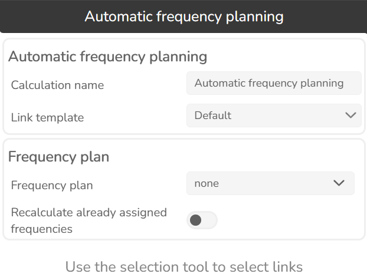
enabled, i.e., the Recalculate already planned frequencies option is checked, the frequencies are
reassigned for all links regardless of whether they have channel assignments.
The resulting plan includes the assigned frequency, polarization, best available modulation and SIR
score.
Confidential ©Cellular Expert, 2026 Page | 221

---

Cellular Expert Express User Guide 7.3
Assign channels
Assign suggested channel & polarization values to link objects.
3.1.39 Link HCM-FS prediction
Click this button to open Link HCM-FS prediction tool.
This calculates interference between selected links and HCM-FS records available in the database.
Calculation settings
Confidential ©Cellular Expert, 2026 Page | 222

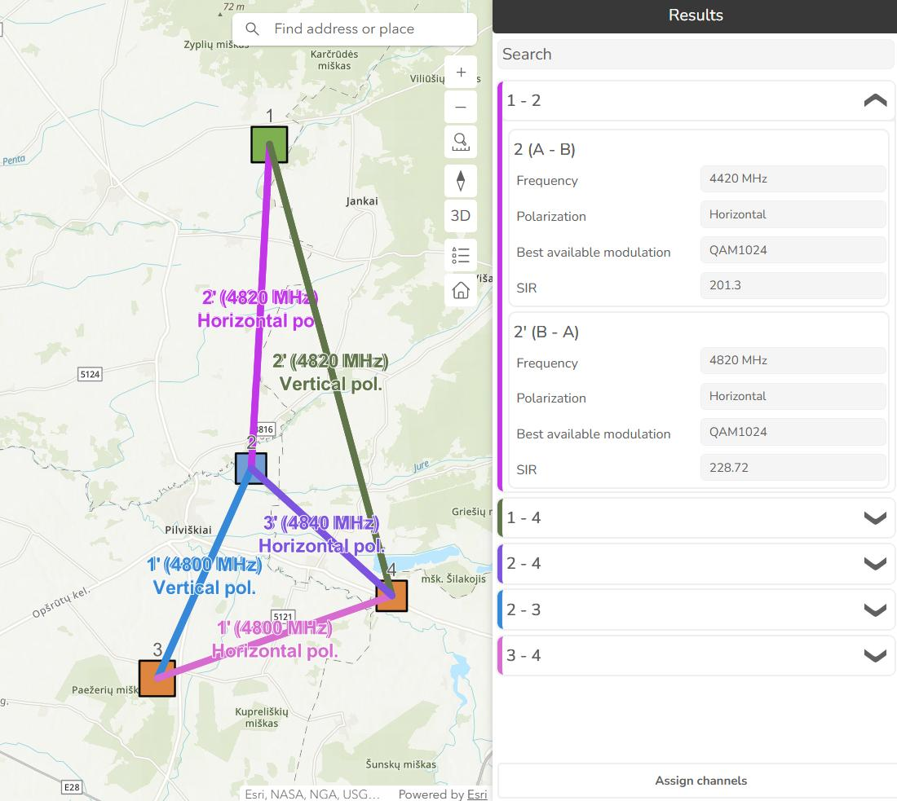

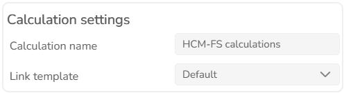

---

Cellular Expert Express User Guide 7.3
Calculation name
Name of the calculation.
Link template
Template to be used for filling up missing parameters of the link.
Trigger options
Trigger options are used to limit the size of calculation report. If all trigger options are disabled, calculation

report may become very huge since all calculation cases will be logged into the report.
| Parameter | Description |
|---|---|
| Limit TD | If enabled, calculation case is logged into the report only if threshold degradation is greater than defined. |
| TD, dB > | Value of threshold degradation used as a trigger for logging calculation case into the report. |
| Limit Interference | If enabled, calculation case is logged into the report only if interference level is greater than defined. Can be used along with TD limit. |
| Interference level, dBW | Value of interference level used as a trigger for logging calculation case into the report. |
Distance PTX to RX [km]
Distance between passive transmitter and receiver. In the case of passive receiver, calculation will be
performed only if distance between passive transmitter and receiver is less than defined. Decision
whether to include this calculation into the report will additionally depend on the rest of Trigger options.
3.1.39.1 Link HCM-FS prediction results
Confidential ©Cellular Expert, 2026 Page | 223

---

Cellular Expert Express User Guide 7.3
Report lists all the selected links and following parameters:
- Maximum outgoing TD, dB. Maximum interference (threshold degradation) to a single HCM-FS
receiver caused by the link.
- Maximum incoming TD, dB. Maximum interference (threshold degradation) from HCM-FS
transmitter to the receiver of the link.
Show incoming interference.
Displays list of HCM-FS transmitters calculated against receivers of the link.
List shows site of the affected link, HCM-FS parameters and interference calculation result.
Confidential ©Cellular Expert, 2026 Page | 224

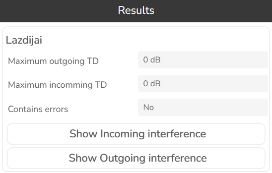

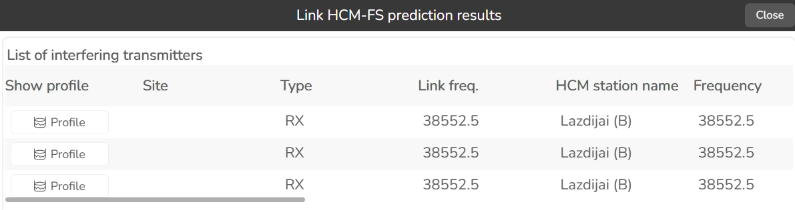

---

Cellular Expert Express User Guide 7.3
3.1.40 Mesh topology builder
The mesh topology builder tool optimizes the process of making a connection between 2 desired mesh
nodes.
The tool first analyzes the possible link between the 2 selected nodes, and if a direct connection is
possible, it prompts you to create the link object between them.:
Confidential ©Cellular Expert, 2026 Page | 225

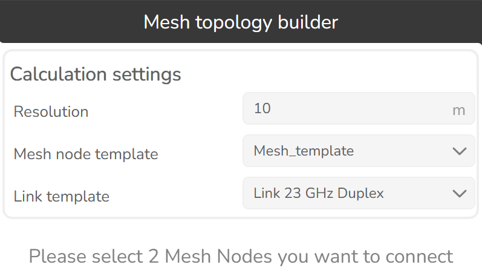

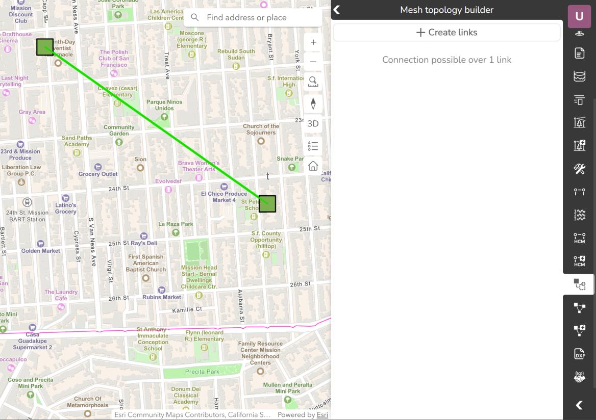

---

Cellular Expert Express User Guide 7.3
If a direct connection is not possible, the tool will automatically run an optimal placement prediction
between the 2 nodes and show you the resulting raster. You are then prompted to select a location for an
intermediate mesh node with the help of the displayed optimal placement layer, and quick mesh
connectivity lines for the location you choose. (SS)
Once a new intermediate node location is chosen, you can click Place intermediate mesh node to create
it, at which point a new process is started between the new node and the unconnected link from it. If all
connections are possible, the tool prompts you to create links for the multi-node path, at which point the

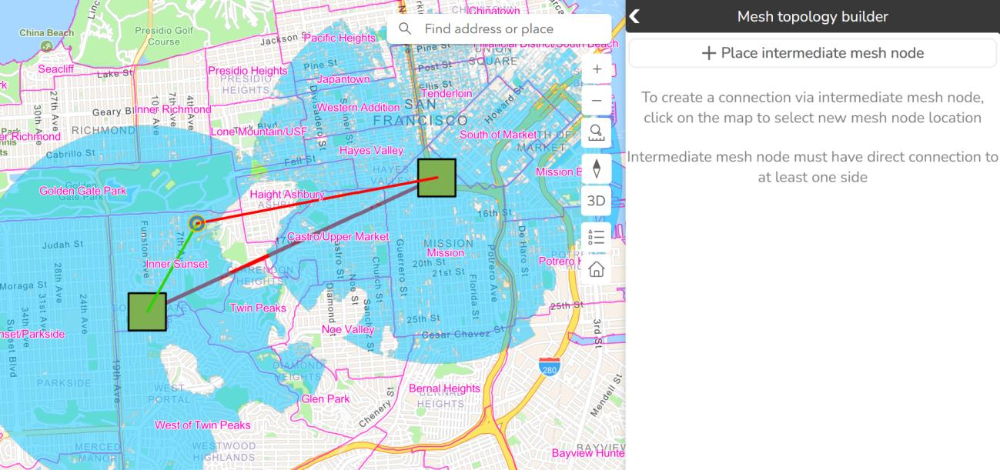

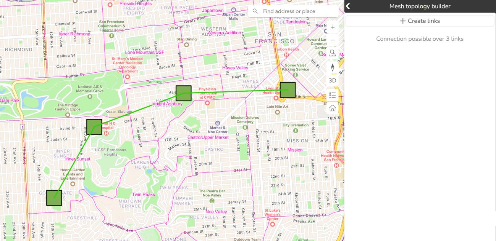
originally selected mesh nodes are connected through a series of intermediate mesh nodes.
Confidential ©Cellular Expert, 2026 Page | 226

---

Cellular Expert Express User Guide 7.3
3.1.41 Mesh connectivity
Click this button to open Mesh connectivity tool.
This tool enables rapid and accurate assessment of wireless peer-to-peer link quality during mesh network

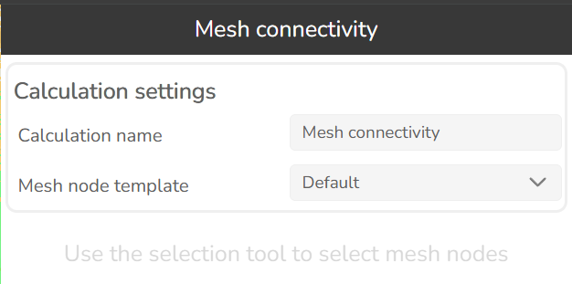

planning and optimization.
Calculation name
Name of the calculation that will be displayed in the Prediction history.
Mesh node template
Mesh node template if selected features won’t have all necessary parameters.
How It Works:
- Select one or more Mesh Nodes in the workspace.
Confidential ©Cellular Expert, 2026 Page | 227

---

Cellular Expert Express User Guide 7.3
- Open Mesh Connectivity tool.
- Define:
o Calculation name
o Mesh node template
- Press Calculate button to start simulation.
- The tool calculates the RSL between each node pair and compares it against the configured RSL
sensitivity threshold defined for the Mesh Node object.
- Open Prediction history tool.
Confidential ©Cellular Expert, 2026 Page | 228

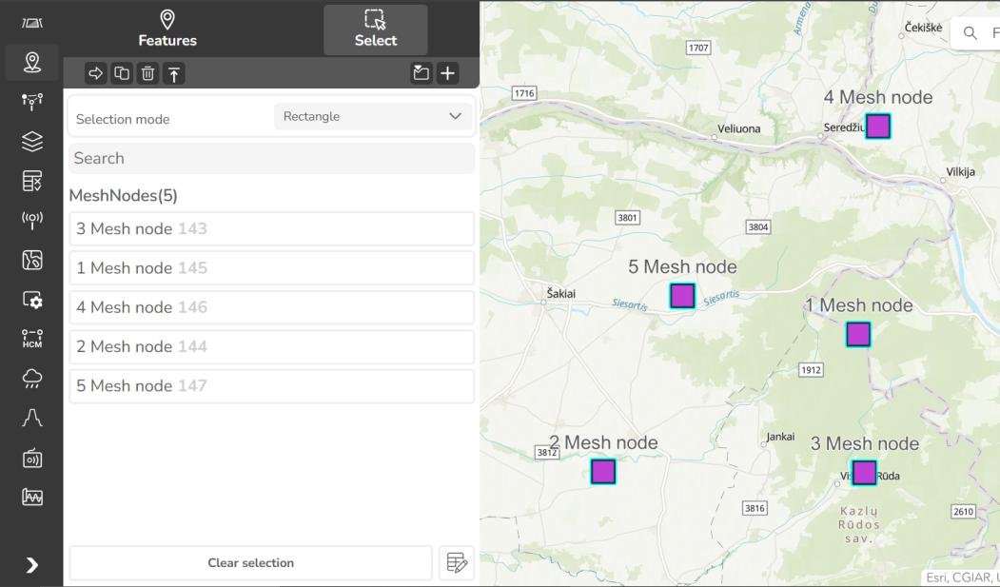

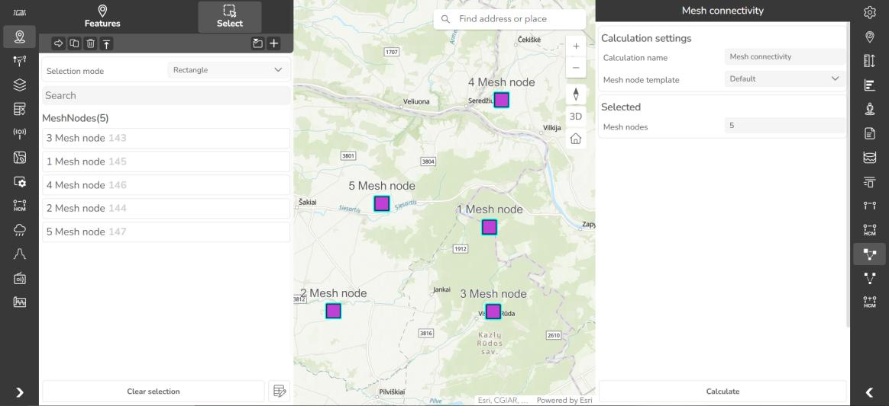

---

Cellular Expert Express User Guide 7.3
Connectivity status is then visually rendered using a clear, color-coded scheme:
o Green : Bi-directional connectivity – both nodes meet or exceed the RSL sensitivity for each
other.
o Yellow: Uni-directional connectivity – only one node meets the RSL threshold for the other.
o Red: No connectivity – RSL falls below the sensitivity threshold in both directions
Confidential ©Cellular Expert, 2026 Page | 229

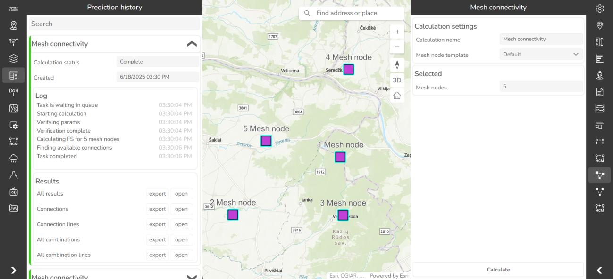

---

Cellular Expert Express User Guide 7.3
Results:
- All results – It shows all possible combinations of Mesh network connections.
- Connections – opens new dock on the right where you can create links.
- Connection lines – Shows Mesh connections where the tool will create Link objec
To create a Links between Mesh Nodes, define Mesh connectivity results. Once result is selected, it will

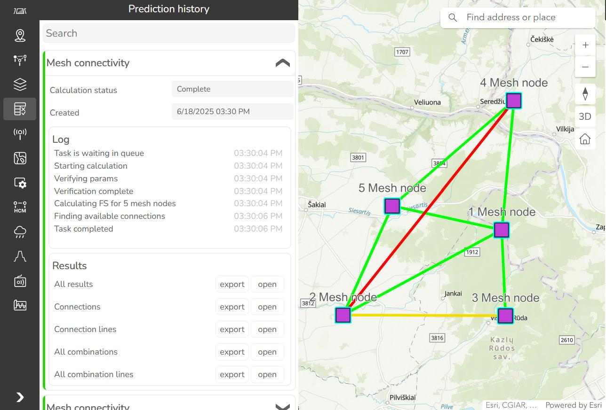
add possible options to create a links between Mesh Nodes
Confidential ©Cellular Expert, 2026 Page | 230

---

Cellular Expert Express User Guide 7.3

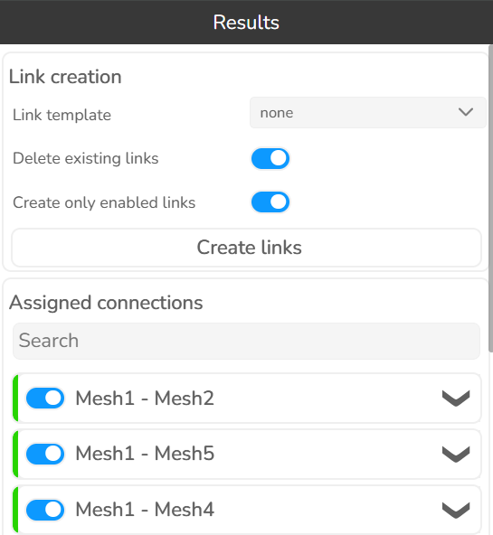

Links creation
Delete existing links
If selected, existing links that have been created from mesh connectivity results will be deleted.
Create only enabled links
If checked, the links will be created only from the checked connectivity lines in the suggested list.
Enable/Disable Links from the suggested list
Confidential ©Cellular Expert, 2026 Page | 231

---

Cellular Expert Express User Guide 7.3
Once parameters are set, press Create links button to create Links between Mesh objects.
3.1.42 Quick mesh connectivity
Click this button to open Quick mesh connectivity tool.
To enhance the efficiency of early-stage planning and dynamic mesh layout, the Quick Mesh
Connectivity tool offers a fast and intuitive way to assess connectivity potential.
This lightweight yet powerful feature enables users to instantly evaluate whether a Mesh Node can
connect to an existing mesh network based on either its current position or a proposed location.
Whether you are planning the deployment of a single node or simulating a mobile mesh scenario, Quick
Mesh Connectivity streamlines the decision-making process by providing immediate, actionable feedback.

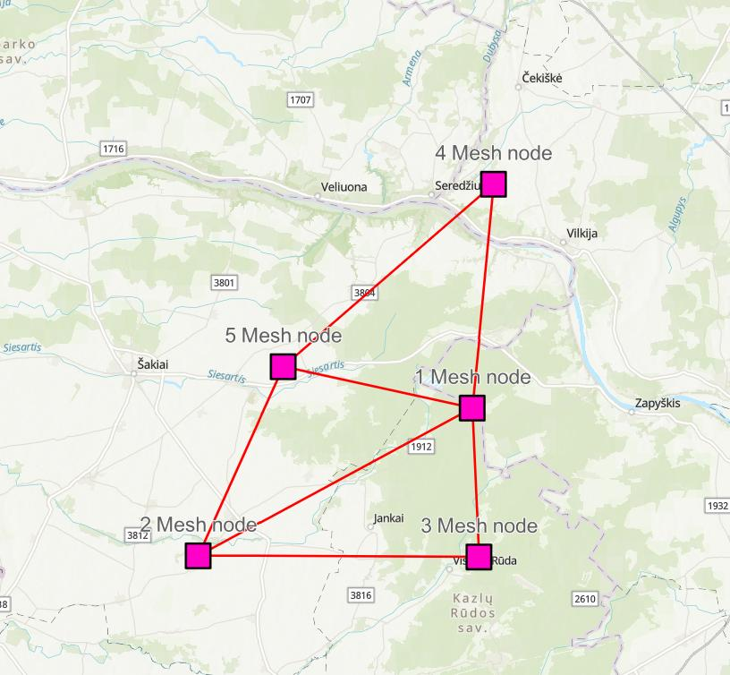

Confidential ©Cellular Expert, 2026 Page | 232

---

Cellular Expert Express User Guide 7.3
Calculation settings
Mesh node template
The Mesh Node Object Template is automatically utilized whenever a Mesh object lacks the required
parameters needed to complete connectivity calculations. This ensures that all essential data is available

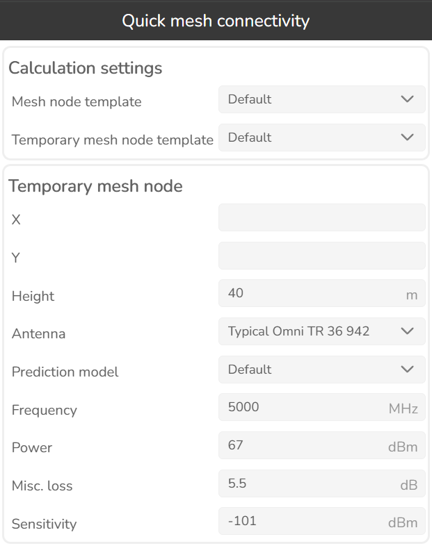
for accurate simulation and evaluation, even if the original Mesh object is incomplete.
Temporary mesh node template
The Temporary Mesh Node Object Template is automatically utilized whenever a newly proposed Mesh
object lacks the required parameters needed to complete connectivity calculations. This ensures that all
essential data is available for accurate simulation and evaluation, even if the original Mesh object is
incomplete.
Temporary mesh node
X
Coordinate in the projected coordinate system.
Confidential ©Cellular Expert, 2026 Page | 233

---

Cellular Expert Express User Guide 7.3
Y
Coordinate in the projected coordinate system.
Height
Mesh node object’s height above the terrain.
Antenna
Antenna which will be used for Mesh node.
Prediction model
Prediction model used to calculate a path loss between Mesh Nodes.
Frequency
Frequency in MHz for proposed Mesh Node.
Power
Tx power in dBm for proposed Mesh Node.
Misc. Loss
Total losses in dB for proposed Mesh Node.
Sensitivity
Receiving Signal Level threshold in dBm at Mesh Node.
3.1.42.1 Calculate Quick mesh connectivity
- Select Existing Mesh Nodes
On the map interface, select the Mesh Nodes that should be included in the connectivity calculation.
Confidential ©Cellular Expert, 2026 Page | 234

---

Cellular Expert Express User Guide 7.3
- Open the Quick Mesh Connectivity Tool
- Configure Node Parameters
Input the required parameters for the proposed Mesh Node (e.g., transmission power, antenna type,

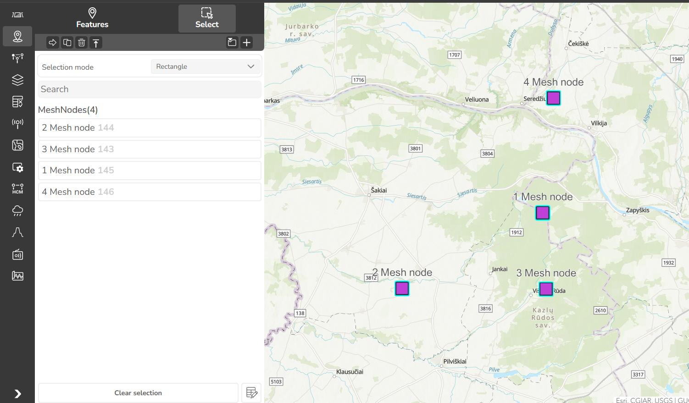

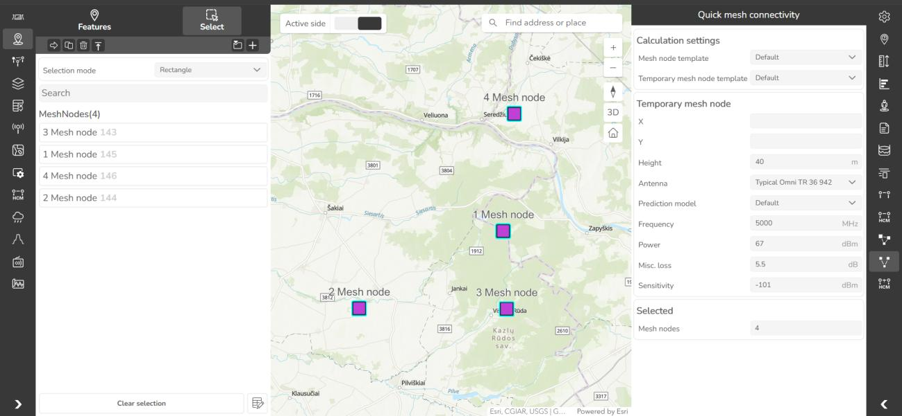
height).
Confidential ©Cellular Expert, 2026 Page | 235

---

Cellular Expert Express User Guide 7.3
- Define the Proposed Node Location
Choose the location of the new Mesh Node either by clicking directly on the map or by entering specific

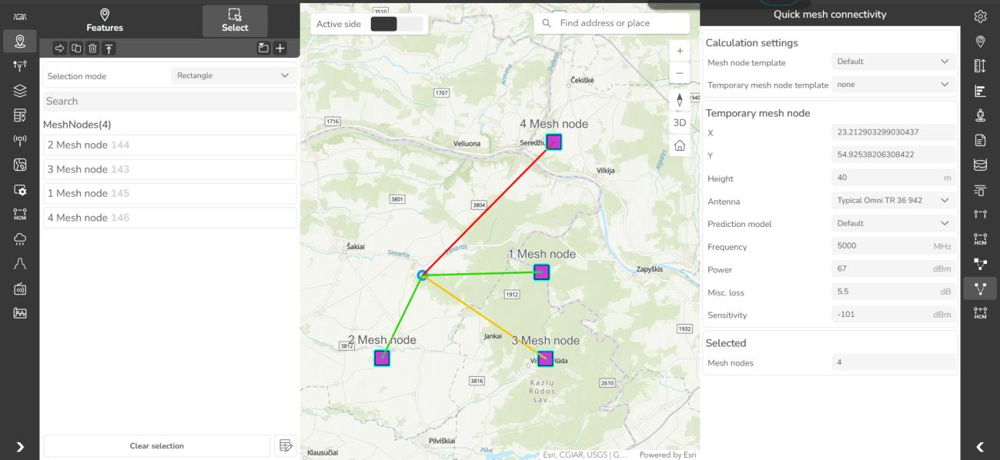

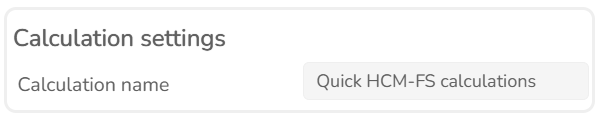
coordinates.
- View the Results
Once the analysis is complete, the results will appear on the map:
- Green indicates areas with successful two-way connectivity.
- Yellow shows one-way connectivity.
- Red marks areas with no connectivity.
3.1.43 Quick HCM-FS prediction
Click this button to open Quick HCM-FS prediction tool.
This performs calculations between two HCM-FS files.
Calculation name
Name of the calculation.
Confidential ©Cellular Expert, 2026 Page | 236

---

Cellular Expert Express User Guide 7.3
Trigger options are used to limit the size of calculation report. If all trigger options are disabled, calculation

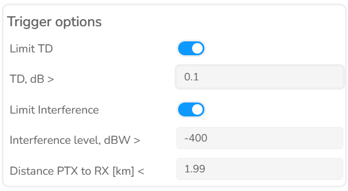

report may become very huge since all calculation cases will be logged into the report.
Limit TD
If enabled, calculation case is logged into the report only if threshold degradation is greater than defined.
TD, dB >
Value of threshold degradation used as a trigger for logging calculation case into the report.
Limit Interference
If enabled, calculation case is logged into the report only if interference level is greater than defined. Can
be used along with TD limit.
Interference level, dBW
Value of interference level used as a trigger for logging calculation case into the report.
Distance PTX to RX [km]
Distance between passive transmitter and receiver. In the case of passive receiver, calculation will be
performed only if distance between passive transmitter and receiver is less than defined. Decision
whether include this calculation into the report will additionally depend on the rest of Trigger options.
Please note that all calculation cases resulted in errors will be logged into the report regardless of Trigger
options.
Reference file
File against which test calculations are performed.
Test file
Confidential ©Cellular Expert, 2026 Page | 237

---

Cellular Expert Express User Guide 7.3
File that is tested against reference file.
There is no substantial difference between test and reference file. Calculations will be performed in the
same way but the calculation report always lists records of test file.
When calculation report is opened it shows all the records from test file along with maximum value of
threshold degradation.
| Parameter | Description |
|---|---|
| Type | Type of station of the test record |
| Name | Name os station of the test record |
| Frequency | Combines frequency and frequency unit of the test record |
| Reference | Coordination reference of the test record |
| Original status | Status of coordination of the test record |
Max TD
Maximum threshold degradation. In case of test TX record, it shows maximum threshold degradation
caused by the transmitter to a receiver of the reference file. In case of test RX record, it shows threshold

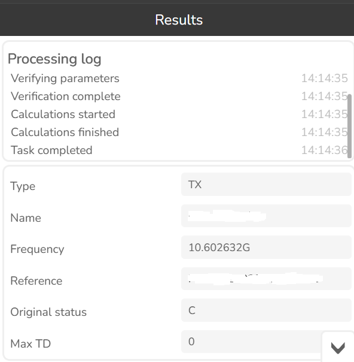
degradation of this particular receiver. For PTX or PRX test record, it shows maximum threshold
degradation of either test or reference receiver.
Confidential ©Cellular Expert, 2026 Page | 238

---

Cellular Expert Express User Guide 7.3
Show interference list - shows list of calculated stations against particular test record.
Clicking on Profile button allows user to perform detailed HCM calculations.
3.1.44 HCM requests
Click this button to open HCM requests tool.
This is the main component used for HCM calculations. Main functionality:
- To list and process all the incoming and outgoing coordination requests
- Create new incoming coordination request
- Create outgoing coordination request
Confidential ©Cellular Expert, 2026 Page | 239

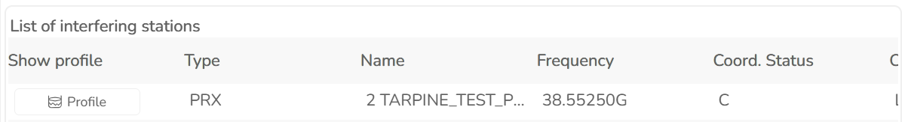

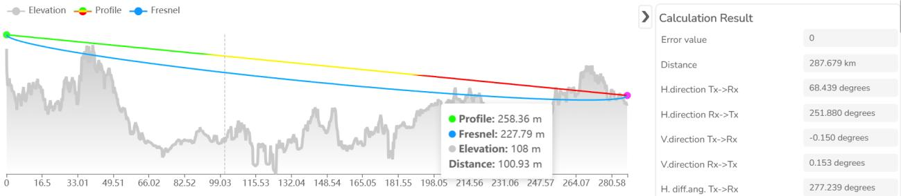

---

Cellular Expert Express User Guide 7.3
3.1.44.1 List coordination requests
Own requests
This lists all outgoing coordination requests (sent to other countries).
Starts the process of creating a new outgoing request
The list of Own requests contains following parameters:
- Destination country
- File contents code (from file header)
Confidential ©Cellular Expert, 2026 Page | 240

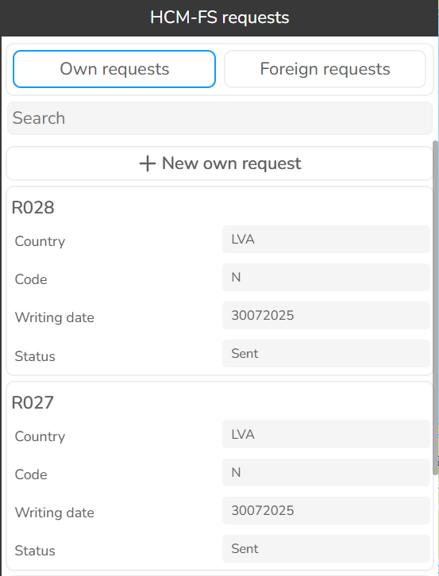

---

Cellular Expert Express User Guide 7.3

- Date of coordination request (from file header)
- You assigned reference number (used for your convenience)
- Status of coordination request
Foreign requests
This lists all incoming coordination requests (received from other countries).
Starts the process of importing a new incoming request
The list of Foreign requests contains following parameters:
- Country of the origin
- File contents code (from file header)
- Date of coordination request (from file header)
- You assigned reference number (used for your convenience)
- Status of coordination request
Each coordination request contains detailed information about the request and/or the answer.
Confidential ©Cellular Expert, 2026 Page | 241

---

Cellular Expert Express User Guide 7.3
| Parameter | Description |
|---|---|
| Country from | Country of origin |
| Country to | Destination country |
| Registration number | Your assigned registration number used for your convenience (optional) |
| Registration date | Your date of registration of the coordination request, used for your convenience (optional) |
| Responsible person | Name of the responsible person (from HCM request file header) |
| Phone | Phone number from HCM request file header |
| Telefax | Telefax number from HCM request file header |
Confidential ©Cellular Expert, 2026 Page | 242

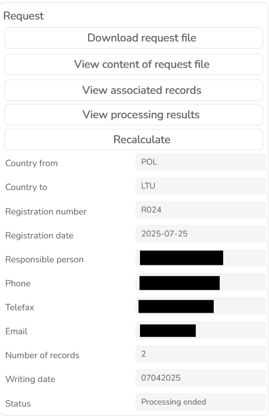

---

Cellular Expert Express User Guide 7.3
| Parameter | Description |
|---|---|
| Email | Email from HCM request file header |
| Number of records | Number of records from HCM request file header |
| Writing date | Writing date from HCM request file header |
Status
Current status of the coordination request. Different statuses are available:
- Processing.
- Processing ended.
- Processing error. This shows that processing resulted in error.
- Ready to send. This shows that outgoing request is ready to be sent. Usually, user may need to enter
additional parameters required for coordination request or edit defaults before finishing coordination
request.
- Finished
Each request contains a toolbar of the following tools:
- Download request file. downloads original coordination request file.
- View request file. Shows content of the original request file.
- View associated records. Shows current records associated with the request file. Usually, when
incoming request is processed, all records are imported into the internal database but with time
they may be deleted by another request, or changed. The same is valid for the records of outgoing
requests – they may later be changed or deleted. This functionality shows current parameters of
the imported (or exported) data.
- View processing results. Opens calculation results that have been performed for the selected
coordination request.
- Recalculate. Restarts calculations for the selected coordination request.
Answer to coordination request contains the same parameters as the request.
3.1.44.2 Create new incoming coordination request
New incoming (foreign) coordination request is created by clicking New foreign request in HCM requests.
Initially this displays area where received coordination file can be dropped.
When coordination file is loaded map displays the records of the file with additional information, such as

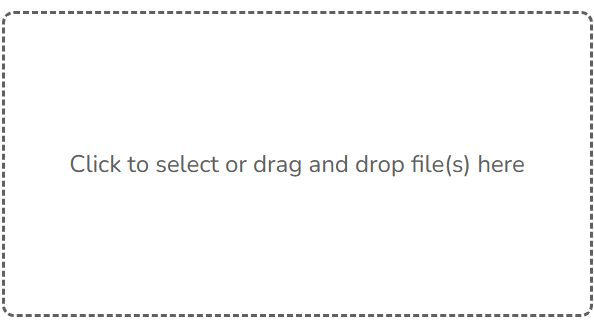
content of HCM file header, registration data, and Trigger options.
Confidential ©Cellular Expert, 2026 Page | 243

---

Cellular Expert Express User Guide 7.3
Your data
| Parameter | Description |
|---|---|
| Calculation Name | Name of the calculation that will be displayed in Prediction history. |
| Registration Number | You can assign registration number for the coordination request. Optional. |
| Registration Date | You can assign here registration date for the coordination request. Optional. |
Confidential ©Cellular Expert, 2026 Page | 244

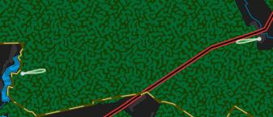

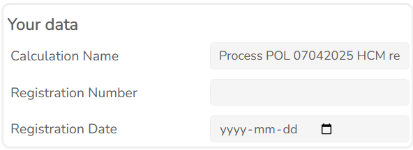

---

Cellular Expert Express User Guide 7.3
File content section contains header information of the file as it is defined in Annex 2B of HCM-
Agreement.
Trigger options
| Parameter | Description |
|---|---|
| Limit TD | If enabled, calculation case is logged into the report only if threshold degradation is greater than defined. |
| TD, dB > | Value of threshold degradation used as a trigger for logging calculation case into the report. |
| Limit Interference | If enabled, calculation case is logged into the report only if interference level is greater than defined. Can be used along with TD limit. |
| Interference level, dBW | Value of interference level used as a trigger for logging calculation case into the report. |
| Distance PTX to RX [km] | Distance between passive transmitter and receiver. In the case of passive receiver, calculation will be |
Confidential ©Cellular Expert, 2026 Page | 245

---

Cellular Expert Express User Guide 7.3
performed only if distance between passive transmitter and receiver is less than defined. Decision
whether to include this calculation into the report will additionally depend on the rest of Trigger options.
Please note that all calculation cases resulted in errors will be logged into the report regardless of Trigger
options.
For file with contents code N, following steps are performed:
- Coordination reference data of submitted HCM records are tested to make sure that no records
with such references already exist in the database.
- New record of coordination request is created and all HCM records of the request file are
imported into the database.
- Own records are selected that fulfill following conditions: have coordination status C, D, E, F, G, H,
P received by the administration which new entries are tested against.
- Calculations are performed: new coordination request data against selected own HCM records,
taking into account Trigger options.
For file with contents code A, the following steps are performed:
- New coordination request record (answer) is created.
- Appropriate HCM records in the database are updated (that match coordination reference). Only
following parameters are updated: coordination status, date of achieving coordination, and
remarks.
For file with contents code D, the following steps are performed:
- Received HCM records are tested to contain coordination statuses W and R only.
- Search for records in the database that have the same coordination reference.
- Delete found records in the database.
- Create new coordination request record (answer).
For file with contents code O, the following steps are performed:
- New coordination request record is created.
- Own records for the database are selected that have coordination following status with the country
of the coordination request: C, E, F, G, H, P
- File content is compared against the selected records and comparison report is created.
3.1.44.3 Display processing results
View processing results displays calculations performed on an incoming request file of type N or O.
File containing new entries (N)
Confidential ©Cellular Expert, 2026 Page | 246

---

Cellular Expert Express User Guide 7.3
| Parameter | Description |
|---|---|
| Type | Type of station of the test record |
| Name | Name of station of the test record |
| Frequency | Combines frequency and frequency unit of the test record |
| Reference | Coordination reference of the test record |
| Original status | Status of coordination of the test record |
Max TD
Maximum threshold degradation. In case of test TX record, it shows maximum threshold degradation
cause by the transmitter to a receiver of the reference file. In case of test RX record, it shows threshold

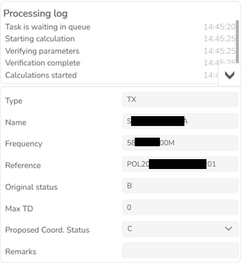

degradation of this particular receiver. For PTX or PRX test record, it shows maximum threshold
degradation of either test or reference receiver.
Proposed Coord. Status
If Max TD is lower than 1 dB and original coordination status is B, software automatically sets proposed
coordination status to C. This value will be inserted into the answer file.
Remarks
User can write separate remarks for each HCM record. This information will be added to the answer file.
Confidential ©Cellular Expert, 2026 Page | 247

---

Cellular Expert Express User Guide 7.3
Shows list of calculated stations against particulat test record.
Profile and calculation values are extracted from HCM calculation report file.
File containing overall list (O)
Differences in records
Shows records that have at least one different parameter value. By clicking on the record, detailed
comparison widget is displayed:
Confidential ©Cellular Expert, 2026 Page | 248

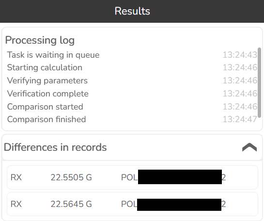

---

Cellular Expert Express User Guide 7.3
| Parameter | Description |
|---|---|
| Parameter name | Name of the parameter defined in Annex 2B of HCM-Agreement. |
| Database value | Value of the record stored in the database. |
| Received value | Value of the record in the received request file. |
| Error | Contains error message if error occurs while processing the record. |
| Download report as CSV file | Downloads report containing all the records of this section |
Confidential ©Cellular Expert, 2026 Page | 249

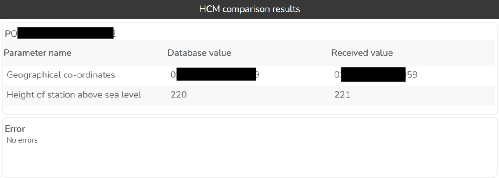

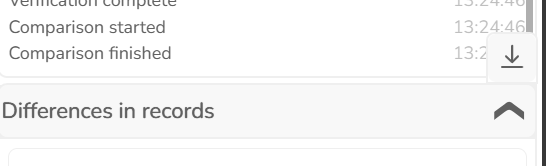

---

Cellular Expert Express User Guide 7.3
Section “Missing in database” lists all the records that are present in the received file but missing in the

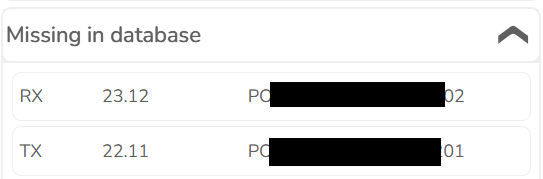

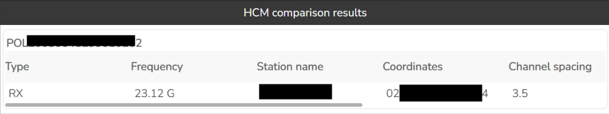

database. By clicking on the record, a detailed comparison widget is displayed with a few additional
parameters of the record:
Download report as CSV file
Downloads report containing all the records of this section
Confidential ©Cellular Expert, 2026 Page | 250

---

Cellular Expert Express User Guide 7.3
Section “Missing in received list” displays all the records that are present in the database but missing in
the received file. By clicking on the record, a detailed comparison widget is displayed with a few additional

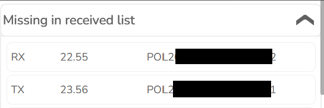

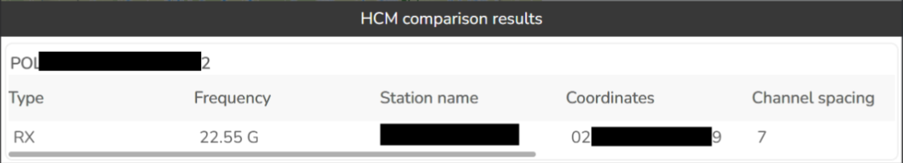

parameters of the record:
Download report as CSV file
Downloads report containing all the records of this section
3.1.44.4 Create new outgoing coordination request
New outgoing (own) coordination request is created by clicking New own request (in HCM requests). This
opens a new widget:
Confidential ©Cellular Expert, 2026 Page | 251

---

Cellular Expert Express User Guide 7.3
Request type N
For new coordination request (New entries) user must select at least one link that is going to be sent for

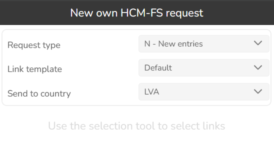
coordination to a country set under “Send to country” and link template, in case one is used.
By clicking Create button new outgoing coordination request is created and displayed in the list of Own
requests, containing status “Ready to send”. The request contains entries of selected link, converted to
HCM Annex 2B format. HCM entries are stored in the database.
Request type D
This creates coordination request containing a list of deleted HCM records. The records to be deleted
must be selected by the user. If the selected HCM records have been coordinated by different
administrations, several coordination requests will be created.
Request type O
This creates a coordination request containing an overall list of coordinated HCM records with the defined
target country. Only records with coordination status C, E, F, G, H, and P will be included.
Created coordination request
Confidential ©Cellular Expert, 2026 Page | 252

---

Cellular Expert Express User Guide 7.3
| Parameter | Description |
|---|---|
| Country from | Country of origin. It is defined in the settings of the user. |
| Country to | Target country, to which coordination request is to be sent. |
| Registration number | Optional identification of the coordination request. |
| Registration date | Optional registration date of the request. |
| Responsible person | Name, as defined in Annex 2B of HCM-Agreement. This field is automatically filled with information from user settings. |
| Phone | Phone number, as defined in Annex 2B of HCM-Agreement. This field is automatically filled with information from user settings. |
information from user settings.
Confidential ©Cellular Expert, 2026 Page | 253

---

Cellular Expert Express User Guide 7.3
| Parameter | Description |
|---|---|
| Telefax | Telefax number, as defined in Annex 2B of HCM-Agreement. There is no such parameter in the user settings therefore it is not filled in automatically. |
| Email | Email, as defined in Annex 2B of HCM-Agreement. This field is automatically filled with information from user settings. |
| Number of records | Defined in Annex 2B of HCM-Agreement. This field is automatically calculated. |
| Writing date | Writing date, as defined in Annex 2B of HCM-Agreement. Date of the creation of coordination request is automatically written to this field. |
| Status | Status of coordination request |
Send email
If enabled, email is automatically sent to the contact person of the target country. For this to work, the
following conditions have to be fulfilled:
- SMTP server defined in Express settings.
- Email of the contact person of the target country set in the table hcm_countries.
If this option is not enabled, coordination request file is prepared but not sent automatically. User must
send it manually.
Finish
It updates coordination request with the data and creates content of Annex 2B data exchange file. If
“Send email” is enabled, coordination request is automatically sent to the target administration, otherwise

prepared Annex 2B exchange file can be downloaded using “Download request file” and sent manually by
the user.

## 3.2 Map

3.2.1 Search bar
Allows searching for an address, place, or location.
Confidential ©Cellular Expert, 2026 Page | 254

---

Cellular Expert Express User Guide 7.3
3.2.2 Zoom in
Zooms in on the map.
3.2.3 Zoom out
Zooms out on the map.
3.2.4 Fine zoom
When enabled, zoom steps are not locked to standardized scale levels. This allows to zoom more finely

when more precision is needed.
3.2.5 Compass
Shows the current map orientation and allows resetting north-up.
3.2.6 3D/2D Button
Switches between 2D and 3D map view.
Confidential ©Cellular Expert, 2026 Page | 255

---

Cellular Expert Express User Guide 7.3
3.2.7 Legend
Opens the legend panel showing all visible layers and their symbols.
3.2.8 Home
Returns the map to the workspace extent.
3.2.9 Mini calculation task window
Mini calculation task window displays the result of the most recent calculation. Unlike the full Prediction
History tool, this window does not list all past calculations, it only shows the latest created task.
3.2.10 Active side switch
Shows up when two tools, which have map clicking enabled, are opened at the same time. You may then
switch between left and right sides, to select which tool is active. For example: Features tool on the left,
and Profile tool on the right. When the active side switch is flipped to the left, clicking on the map will start

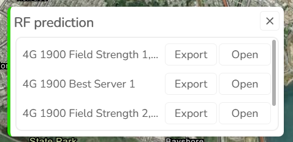
feature selection, rather than draw a profile.
Confidential ©Cellular Expert, 2026 Page | 256

---

Cellular Expert Express User Guide 7.3
3.2.11 Quick menu
The quick menu opens when middle-clicking on the map. If the click is on a feature, it provides actions such
as copying coordinates, adding, editing, moving, duplicating, or deleting the feature. If the click is not on a

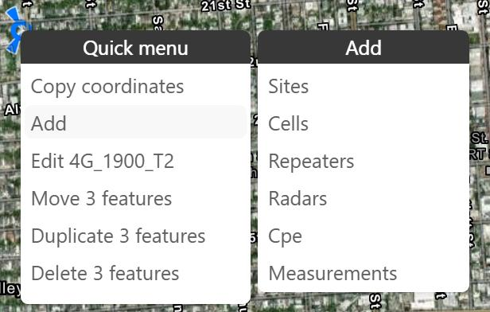
feature, it shows only copying coordinates and adding new items.

## 3.3 Data management and visualization section

Available tools for this section:
- Workspace
- Features
- Networks
- Layers
- Prediction history
- Antennas
The dialogs are pinned and can not be moved to another location. If one tool is active and visible in the
window and a second one is turned on, the first tool is closed and the new one is opened.

## 3.4 Calculation section

Available tools for this section:
- Settings
- Identify
- Measurement tools
- Statistics
- Profile
- Quick RF prediction
- RF Prediction
- Visibility prediction
- Antenna visibility prediction
- Radar prediction
- Link prediction
- Network availability
- Model tuning
Confidential ©Cellular Expert, 2026 Page | 257

---

Cellular Expert Express User Guide 7.3
- Optimal placement
- EMF
The dialogs are pinned and can not be moved to another location. If one tool is active and visible in the
window and a second one is turned on, the first tool is closed and the new one is opened.
There are additional tools that open on the right side and can be accessed from the Features tool:
- Move
- Duplicate
- Delete
- Import
- Add

## 3.5 Map/table view modes

In this section, users can adjust the data view. For example, turn on the Map view, Table view, or turn on

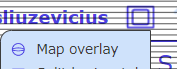

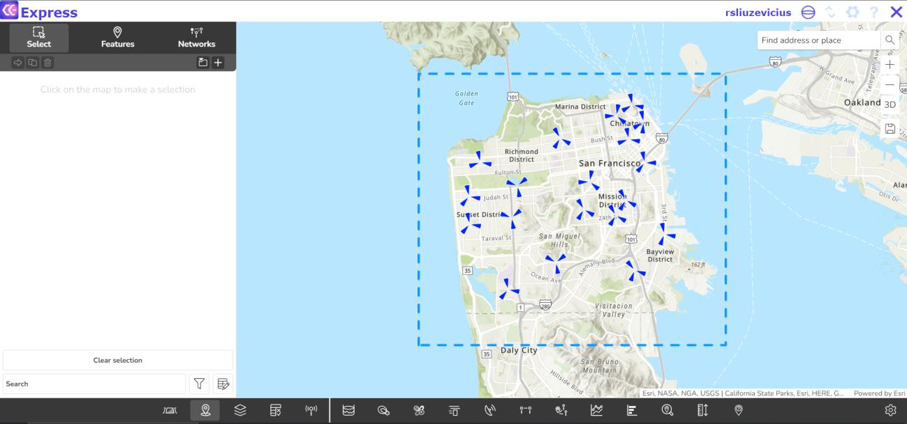
both of them, etc.
3.5.1 Map view
Map view widget.
Turns on the map view.
Confidential ©Cellular Expert, 2026 Page | 258

---

Cellular Expert Express User Guide 7.3
3.5.2 Display data table full screen
Turns on the Network Data Management view in full screen.
3.5.3 Split window vertically
The screen can be divided into Map view and Table view. In the previous options, the tables were placed

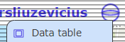

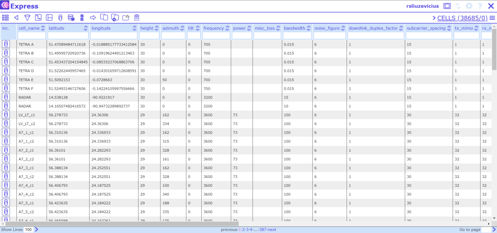

on top of the Map view. This means that the tables cover the widgets.
Confidential ©Cellular Expert, 2026 Page | 259

---

Cellular Expert Express User Guide 7.3
Users can adjust the Table and Map view proportions by using the slider function: Move the mouse cursor

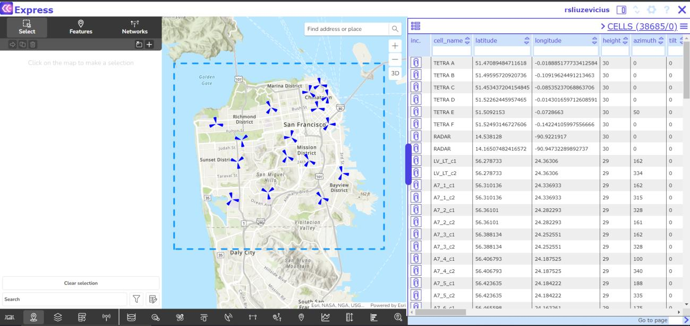

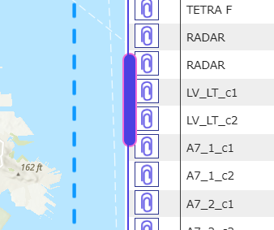
on top of the blue line, click on it and change the proportions.
3.5.4 Split window horizontally
The screen can be divided into Map view and Table view. In the previous options, the tables were placed
on top of the Map view. This means that the tables cover the widgets
Confidential ©Cellular Expert, 2026 Page | 260

---

Cellular Expert Express User Guide 7.3
Users can adjust the Table and Map view proportions by using the slider function: Move the mouse cursor
on top of the blue line, click on it and change the proportions.
4. Database structure

## 4.1 Sites

Describes the tower's location and its identification. An object is not used for the calculations. It is possible

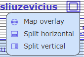

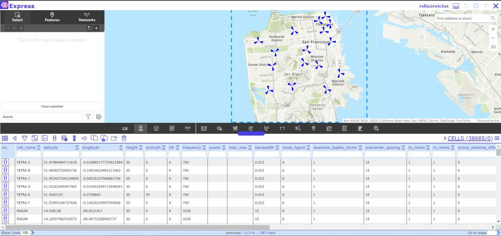

to add additional fields, but here are the main fields used for this object.
site_name
Object identification.
Confidential ©Cellular Expert, 2026 Page | 261

---

Cellular Expert Express User Guide 7.3
| Parameter | Description |
|---|---|
| Y | Decimal degrees Y type coordinate in the WGS 1984 geographical coordinate system. |
| X | Decimal degrees X type coordinate in the WGS 1984 geographical coordinate system. |
| workspace_id | ID for the workspace. This field value is used to filter objects based on a chosen workspace. The parameter is filled automatically. |
| height | Height of the site in meters. |
| cell_name | Object identification. |
| Y | Decimal degrees Y type coordinate in the WGS 1984 geographical coordinate system. |
| X | Decimal degrees type coordinate in the WGS 1984 geographical coordinate system. |
| height | Cell height above the ground in meters. |
| azimuth | Cell direction from the North in degrees. |
| tilt | Mechanical tilt value , negative numbers tilt up. |
| frequency | Frequency value in MHz. |
| power | Power value in dBm. |
| misc_loss | Miscellaneous loss value in dB. |
bandwidth
Confidential ©Cellular Expert, 2026 Page | 262

---

Cellular Expert Express User Guide 7.3
Value in MHz. Required for 4G and 5G technologies. For other technologies define the value as 0.015.
| Parameter | Description |
|---|---|
| noise_figure | Value in dB. Required for 4G and 5G technologies. |
| downlink_duplex_factor | Value range from 0 to 1. Required for 4G and 5G technologies, and used for Downlink Throughput calculations. |
| subcarrier_spacing | Value in kHz. Required for 4G and 5G technologies. For other technologies define value 15. |
| tx_mimo | Transmitter antenna count. Available values: 1, 2, 4, 8, 16, 32 and 64. |
| rx_mimo | Receiver antenna count. Available values: 1, 2, 4, 8, 16, 32 and 64. |
active_antenna_effect
This parameter is dedicated to smart antenna modelling. The default value is 0, but if massive MIMO is
used, a smart antenna effect can be included to lower the interference and boost the throughput.
Recommended values:
- For MIMO 32x32 – value 6.
- For MIMO 64x64 – value 9.
cell_load
This parameter is described in percentage and varies from 0 to 100. It describes the load of a cell. The cell
load affects RSSI, RSRQ, DL Throughput calculations. For example, if the cell load is higher, the DL
Throughput is lower.
workspace_id
ID for the workspace. The field value is used to filter objects based on a chosen workspace. The parameter
is filled automatically.
color_index
Describes the cell visualization. Available values:
- None – blue color.
- 1 – red color.
- 2 – light green color.
- 3 – dark green color.
- 4 – light blue color.
- 5 – dark blue color.
- 6 – purple color.
technology
Describes the cell technology. Possible values are 2G, 3G, 4G, and 5G.
prediction_model_configuration_id
Defines the prediction model configuration to be used in the model table. The objectID value is taken from
the prediction model table.
Confidential ©Cellular Expert, 2026 Page | 263

---

Cellular Expert Express User Guide 7.3
frequency_group
Used to divide calculations into parts. If the selection range includes two or more different frequency group
values, the cells won’t be predicted together.
antenna_id
Describes the antenna ID from the antennas table. The objectID is used.
carriers
Describes the carrier values used for 2G calculations: C/I interference and C/A interference. The values
are written in brackets, […]. If more than one value is defined, the values are separated by a comma. If
there is no carrier information, the brackets are left empty [].
| Parameter | Description |
|---|---|
| site_id | Site identification. This field value is optional. |
| duplex_mode | Lets the user select what type of duplexing technique he wants to assign to the cell. |
| electrical_tilt | Electrical tilt value, negative numbers tilt up |
| status | free-form text. |
| type | free-form text. |
| repeater_name | Object identification. |
| Y | Decimal degrees Y type coordinate in the WGS 1984 geographical coordinate system. |
| X | Decimal degrees X type coordinate in the WGS 1984 geographical coordinate system. |
| height | Repeater height above the ground in meters. |
| azimuth | Cell direction from the North in degrees. |
| tilt | Mechanical tilt value, negative numbers tilt up. |
| frequency | Frequency value in MHz. |
Confidential ©Cellular Expert, 2026 Page | 264

---

Cellular Expert Express User Guide 7.3
threshold 1-3
The minimum field strength in dB at repeater location at which power of the corresponding index (1-3) will
be applied. Values should be in ascending order. If a higher threshold is satisfied, the power corresponding
to it will be used.
| Parameter | Description |
|---|---|
| power 1-3 | Power value in dBm. |
| misc_loss | Miscellaneous loss value in dB. Value is optional. |
| bandwith | Value in MHz. Required for 4G and 5G technologies. For other technologies define the value as 0.015. |
| subcarrier_spacing | Value in kHz. Required for 4G and 5G technologies. For other technologies define value 15. |
| tx_mimo | Transmitter antenna count. Available values: 1, 2, 4, 8, 16, 32 and 64. |
| rx_mimo | Receiver antenna count. Available values: 1, 2, 4, 8, 16, 32 and 64. |
| technology | Describes cell technology. Possible values are 2G, 3G, 4G, and 5G. |
| prediction_model_id | Sets the model type to be used: Value 1 – ITU R. P452 • Value 2 – UniMacro • |
| prediction_model_configuration_id | Defines the prediction model configuration to be used in the model table. The objectID value is taken from the prediction model table. |
| frequency_group | Used to divide calculations into parts. If the selection range includes two or more different frequency group values, the cells won’t be predicted together. |
| antenna_id | Describes the antenna ID from the antennas table. The objectID is used. |
| workspace_id | ID for the workspace. The field value is used to filter objects based on a chosen workspace. The parameter is filled automatically. |
| electrical_tilt | Electrical tilt value, negative numbers tilt up |
Confidential ©Cellular Expert, 2026 Page | 265

---

Cellular Expert Express User Guide 7.3

## 4.4 Radars

| Parameter | Description |
|---|---|
| Radar_name | Object identification. |
| Y | Decimal degrees Y type coordinate in the WGS 1984 geographical coordinate system. |
| X | Decimal degrees X type coordinate in the WGS 1984 geographical coordinate system. |
| Height | Radar height above the ground in meters |
| Tilt | Mechanical tilt value, negative numbers tilt up. |
| Frequency | Frequency value in MHz. |
| Power | Power value in dBm. Value is optional. |
| Misc_loss | Miscellaneous loss value in dB. Value is optional. |
| View_angle | Radar radiation vertical height in degrees centered at the tilt value. |
| Prediction_model_id | Sets the model type to be used: Value 1 – ITU R. P452 • • Value 2 – UniMacro |
| Prediction_model_configuration_id | Defines the prediction model configuration to be used in the model table. The objectID value is taken from the prediction model table. |
| Workspace_id | ID for the workspace. The field value is used to filter objects based on a chosen workspace. The parameter is filled automatically. |
| Cpe_name | Object identification. |
| Y | Decimal degrees Y type coordinate in the WGS 1984 geographical coordinate system. |
X
Confidential ©Cellular Expert, 2026 Page | 266

---

Cellular Expert Express User Guide 7.3
Decimal degrees X type coordinate in the WGS 1984 geographical coordinate system.
| Parameter | Description |
|---|---|
| Height | CPE height above the ground in meters |
| Azimuth | Cell direction from the North in degrees. |
| Antenna_id | Describes the antenna ID from the antennas table. The objectID is used. |
| Cell_id | Cell identification. |
| Throughput | Throughput sold to customer (used in network availability calculation) |
| Power | Power value in dBm. |
| Misc_loss | Miscellaneous loss value in dB. |
| Status | free-form text. |
| Notes | free-form text. |
| Workspace_id | ID for the workspace. The field value is used to filter objects based on a chosen workspace. The parameter is filled automatically. |
| Fs | Measured field strength. |
| Y | Decimal degrees Y type coordinate in the WGS 1984 geographical coordinate system. |
| X | Decimal degrees X type coordinate in the WGS 1984 geographical coordinate system. |
| Cell_id | Cell identification. |
| Workspace_id | ID for the workspace. The field value is used to filter objects based on a chosen workspace. The parameter is filled automatically. |
is filled automatically.
Confidential ©Cellular Expert, 2026 Page | 267

---

Cellular Expert Express User Guide 7.3

## 4.7 Workspace

| Parameter | Description |
|---|---|
| Workspace_name | Workspace identification. |
| Extent_xmin | Minimum workspace extent longitude |
| Extent_ymin | Minimum workspace extent latitude |
| Extent_xmax | Maximum workspace extent longitude |
| Extent_ymax | Maximum workspace extent latitude |
| Extra_layers | JSON array containing links to ArcGIS layer services. e.g.: [“url1”, “url2”] |
| Use_clutter_loss | Possible values: • t – clutter losses included in the prediction model. f – clutter losses not included in the prediction model. • |
| Calculate_eirp | True – EIRP is calculated with the formula power - misc_loss + antenna gain. False – power value is used as EIRP. |
| Geodata_set_id | Path to folder containing geodata rasters: elevation.tif, building_height.tif (optional), clutter_classes.tif (optional), clutter_height.tif (optional). |
5. CE Express API
The (currently incomplete) documentation for the CE Express API endpoints can be found here:
https://cecom2.cellular-expert.com/ce_express_api_documentation/
6. Network Data Management
The Network Data Management view is divided into four sections:
- Tools for data management.
- User administration tasks.
- Table for data editing.
- [View options](#kw:64-view-options:none).
Confidential ©Cellular Expert, 2026 Page | 268

---

Cellular Expert Express User Guide 7.3
2. [View options](#kw:64-view-options:none) and
1. Data management User adminstration

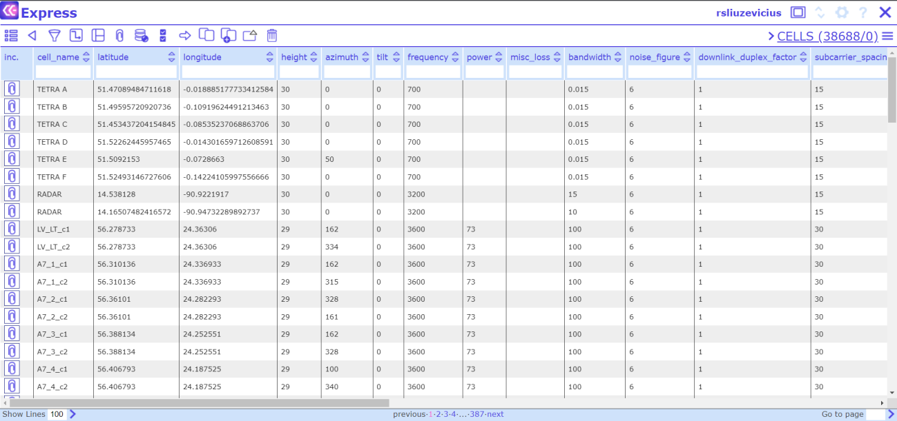

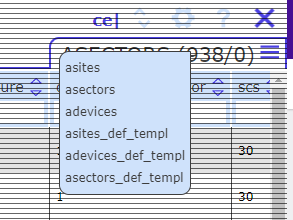

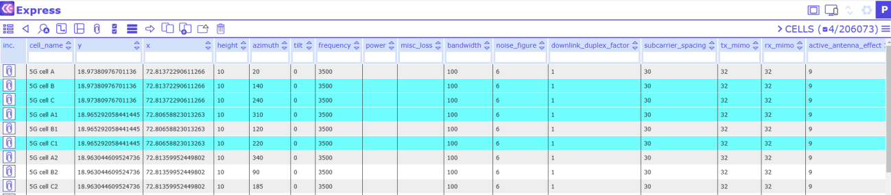
3. Table
To navigate through the tables, click on the table name at the top right corner.
To select a record, click on a record with the left mouse button. Selected records are colored in blue:

## 6.1 Data management tools

The Data management tools are found at the top of the screen:
Confidential ©Cellular Expert, 2026 Page | 269

---

Cellular Expert Express User Guide 7.3
6.1.1 Table view
Load data from the previously configured server location and open the Table view. Here, several functions
can be performed, e.g., sorting or filtering data.
6.1.2 Back
Go one step back and show previous data.
6.1.3 [Sieve](#kw:74-sieve:none)
Sieve the data in the currently opened table for one or more filter terms.
6.1.4 Multiple table view
View and edit all tables from one site simultaneously in one window.
6.1.5 View attachments
View the list of attachments associated with a given record. To do so, select a record of choice, then click

on the View attachments button and a dialog will open with the respective attachments listed. To view an
attachment in a separate browser tab simply click on the attachment of choice
6.1.6 Synchronize changes
Synchronize the previously selected server database with changes performed in the Table view.
Confidential ©Cellular Expert, 2026 Page | 270

---

Cellular Expert Express User Guide 7.3
6.1.7 Select/unselect all
Select/unselect all currently shown database records.
6.1.8 Show selected/Show all
Shows all currently selected database records or all the records.
6.1.9 Move record
Move an object from one site to another. To do so, select an object and click on the Move Record button.
Then select the site you want to move the object to and click the move button again. Note that attachments
are not moved.
6.1.10 Copy record
Duplicate a database record from the Table view. Select the record to be duplicated. Then click the Copy
Record button and the duplicated record appears in pink color in the Table view as a new record. Note that
if the selected record to be duplicated has child objects, Copy Record will duplicate the entire record incl.

child objects. Attachments are not duplicated.
6.1.11 Add new record
Add a new record to the Table view. Note that the newly added record will appear in orange writing.
6.1.12 CE API
Call CE API tool. Note: The administrator has to configure the tool.
Confidential ©Cellular Expert, 2026 Page | 271

---

Cellular Expert Express User Guide 7.3
6.1.13 Export selected
Export selected items.
6.1.14 Delete record
Remove a selected record from the current view. Note that removed records will be hidden from the user.

Only administrators can delete a removed record from the database permanently (or restore it).
6.1.15 Remove selected
Removes selected objects.

## 6.2 View options and User administration

6.2.1 Import Export
Opens the menu for exploring and importing data:
See section 6 for details.
Confidential ©Cellular Expert, 2026 Page | 272

---

Cellular Expert Express User Guide 7.3
6.2.2 Settings
Opens the menu for administrator functions:
Please view Administration Guide for details.
6.2.3 User name/ Help/ Logout
Help - Displays the User Guide for quick help.
Logout – Logoff the user from CE Inventory3D

## 6.3 Table

The table comprises all network data. The data can be managed with the Data Management tools (see
above).

## 6.4 View Options

Click on one of the buttons to choose a view of the data table aligned with the map (section 3.2).
Confidential ©Cellular Expert, 2026 Page | 273

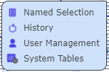

---

Cellular Expert Express User Guide 7.3
7. Database organization

## 7.1 Page setup and navigation

7.1.1 Organization of single and multiple tables
The number of records displayed per page can be set on the bottom left corner. Furthermore, you may
scroll through the pages using the commands in the bottom middle and bottom right corner. The table name
(here: cells), the total quantity of entries (here: 20607), and the quantity of currently selected entries (here:

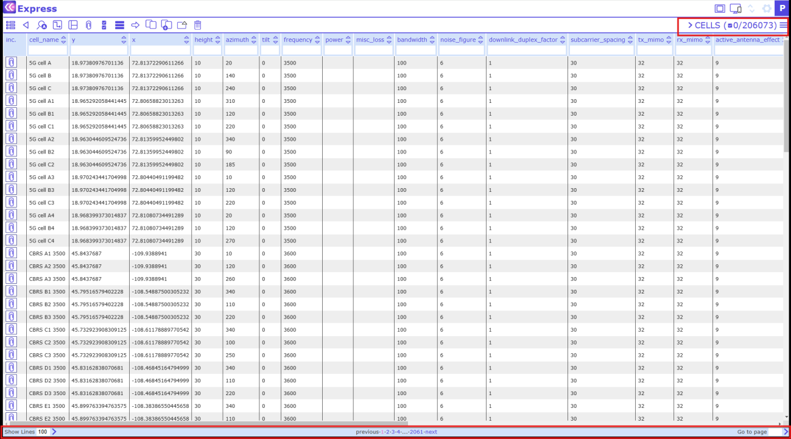

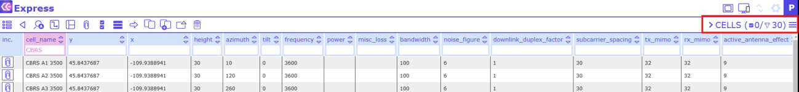

0) are shown on the top right corner. Note that the number of filtered records will be shown, if the user
applies a filter:
7.1.2 Organization of columns
The column order can be adjusted by clicking on in the top right corner.
Confidential ©Cellular Expert, 2026 Page | 274

---

Cellular Expert Express User Guide 7.3
A menu opens in which the position of the columns can be sorted by clicking the arrow symbols. Individual
columns are switched visible/invisible by clicking on the eye symbols.
The columns can be sorted alphabetically from A>Z or from Z>A using the up and down arrow symbols
within the column headers:
7.1.3 Navigation across tables
There are 2 ways to change from one table to another. Either click on the table name in the top right (here:

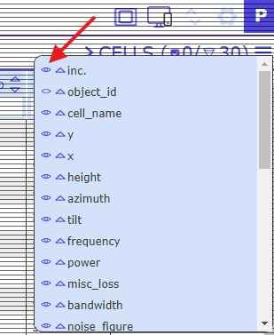

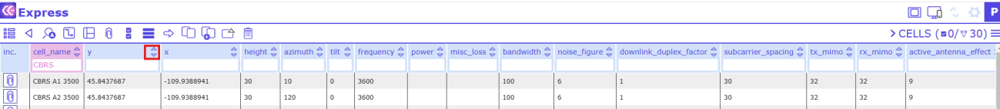
cells) and a menu opens with all available tables.
Confidential ©Cellular Expert, 2026 Page | 275

---

Cellular Expert Express User Guide 7.3

## 7.2 Filtering, sorting, editing, and linking database records

The database entries can be sorted according to their individual values. To do so, click on the column
header and a dropdown menu opens with the following functions: “Set selected”, “Add link”, ”Clear this
filter”, “Clear all filters”, “Set defaults” and “Set as default sort field”:
Alternatively, and more convenient for simple searches, columns can be filtered using the “quick filter” fields

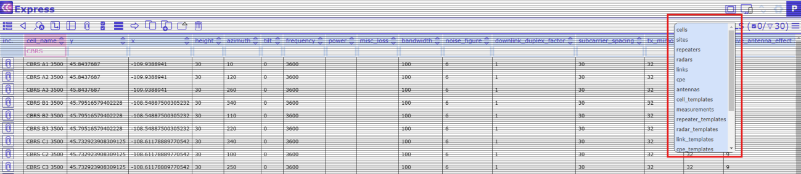

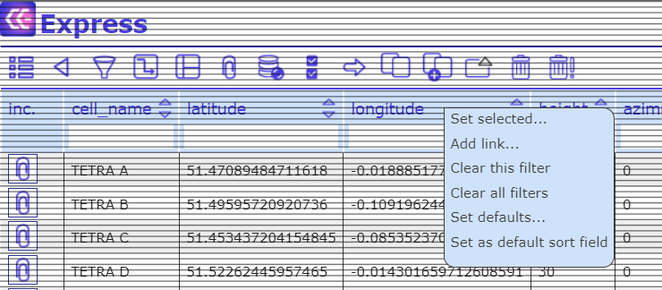
below the column names:
Confidential ©Cellular Expert, 2026 Page | 276

---

Cellular Expert Express User Guide 7.3
Users can use star symbol “*” as wildcard. Possible filtering options:
*- any non-null value
!* - null value
[text] - anything that contains the [text] value at the beginning. The same as [text]*
[text]*
*[text]
[text]*[text]
![text] - anything but the defined [text] value
”[text]” - for exact match of value
Filtering options for numeric values:
=n - exact match of n
<>n - anything else but n
<n - less than n
>n - greater than n
<=n - less than or equal to n
>=n - greater than or equal to n
The Filter function can be used on several columns simultaneously. The headers of columns with active
Filter function are marked in pink color:
Confidential ©Cellular Expert, 2026 Page | 277

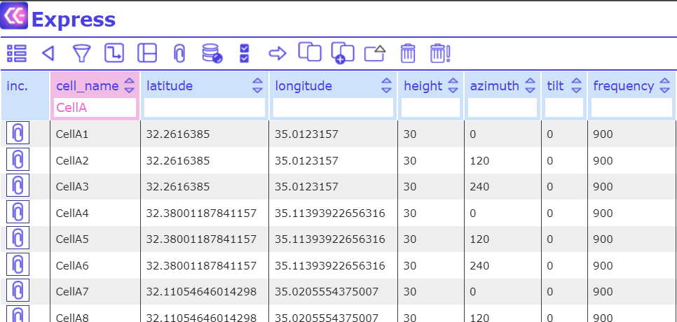

---

Cellular Expert Express User Guide 7.3
Filters can be cleared by clicking on Clear all filters.
7.2.1 Set selected
This feature allows bulk editing of several records at once: Select the respective records, click on the column

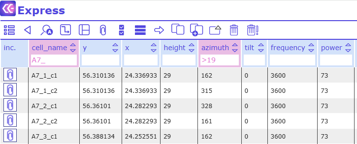

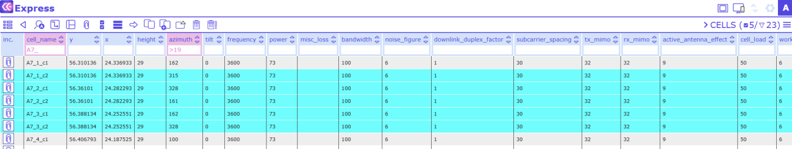

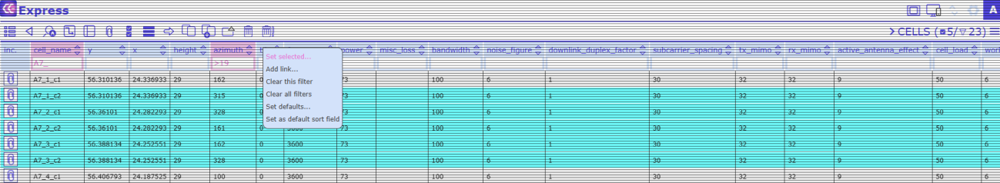
header and choose “Set selected” from the dropdown menu. A dialog opens with a text field. Fill in the term
you want the selected database records to be changed to. Then click on “Change”. Synchronize the edited
records with the database using the Synchronize changes Tool.
1. Select the records
2. Click on the required column header (here:tilt)
and choose Set selected
Confidential ©Cellular Expert, 2026 Page | 278

---

Cellular Expert Express User Guide 7.3
3. Define the new value and click Change
7.2.2 Add link
Each database record may comprise reference links to other database records. This means that a link can

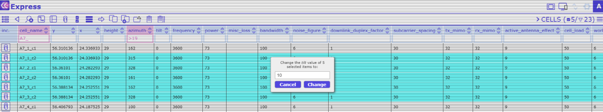

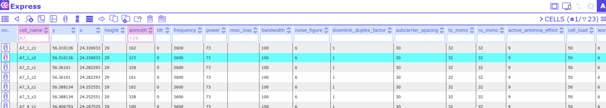

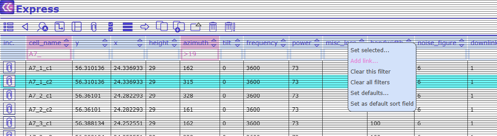
be added to reach another database record.
Select the respective record, click on the column header and choose “Add link” from the dropdown menu.
In the pop up window, click on Add new reference. A list of component types opens. Select the one you
want to link to. Choose the component and confirm the selection. A new link has been created.
1. Select the record
2. Click on the required column header (here:miscloss)
and choose Add link
Confidential ©Cellular Expert, 2026 Page | 279

---

Cellular Expert Express User Guide 7.3
3. Click on Add new reference ...
4. Select the type of component you want to link to (here: calculation tasks)
5. Choose the repeaters(s) you want to link to and confirm the selection with in
the top left corner
6. The link has been created
Confidential ©Cellular Expert, 2026 Page | 280

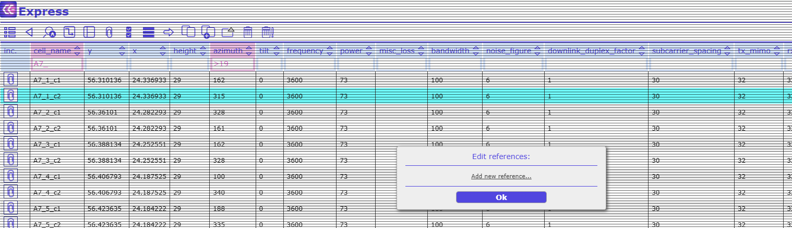

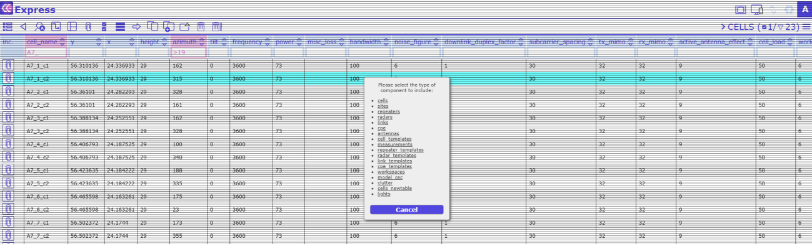

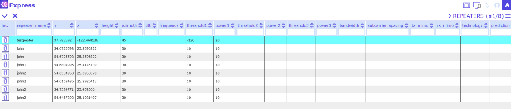

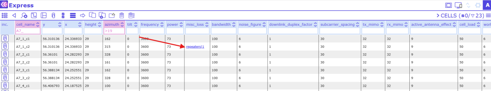

---

Cellular Expert Express User Guide 7.3

## 7.3 Adding, viewing, downloading and deleting attachments

Each database entry can be connected with any type of attachment, for example, a picture or a text file.
Entries with connected attachments have a blue check symbol next to the paper clip symbol in the column
“Inc.”, while entries without attachment have only the paper clip.
Adding attachments
To connect a database entry with an attachment, click on the paper clip symbol in the column “Inc.”. A
dialog opens that allows you to browse your computer for the attachment of your choice or to take a photo.

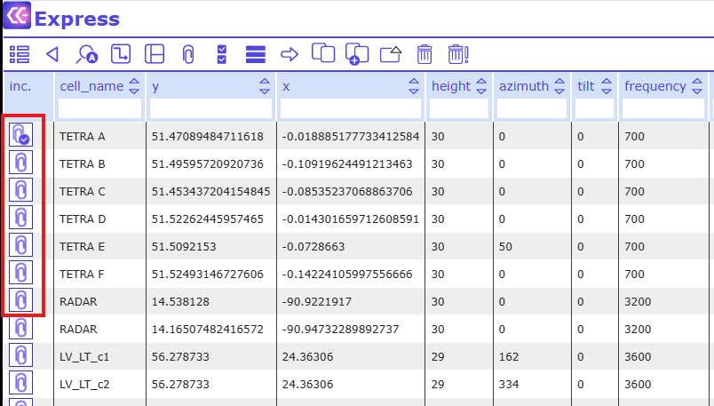

Confidential ©Cellular Expert, 2026 Page | 281

---

Cellular Expert Express User Guide 7.3
Viewing, downloading and deleting attachments:
To view the list of attachments connected to an entry, select the respective entry and click on in the

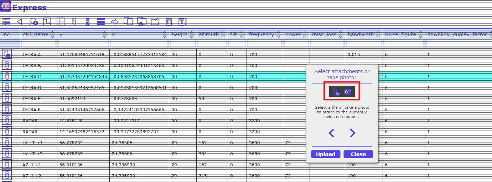

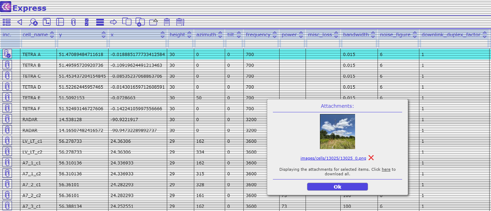

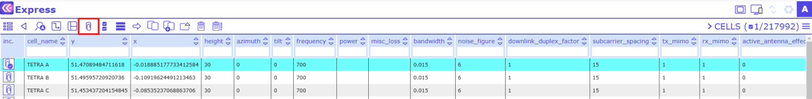

toolbar:
In the attachments the listed images are shown as thumbs. Select an attachment from the list and it opens
in a separate browser tab.
Confidential ©Cellular Expert, 2026 Page | 282

---

Cellular Expert Express User Guide 7.3
Another way to view an attachment list is to move the pointer over the check symbol in the column “Inc.”
and to click the right mouse button.
The selected attachments can also be downloaded.
To delete an attachment click on the red cross symbol.

## 7.4 Sieve

It is possible to display only selected data from an open table. Click on the button in the toolbar.
And a dialog will open:
Note that by clicking “Add rule” you may sieve with two or more filter terms that are connected via the
operation “OR”, not “AND”. Thus, the result of two filters will show all items that comprise either the first or

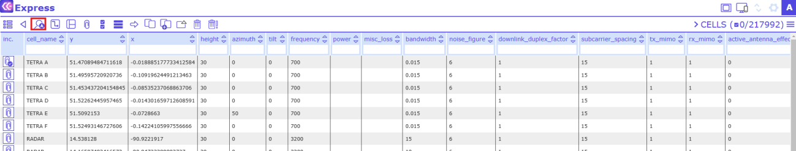

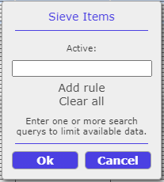
the second search term in their attributes.
For example, do you want to sieve the table asites for records starting with defined characters? Then the
Sieve tool will help.
Confidential ©Cellular Expert, 2026 Page | 283

---

Cellular Expert Express User Guide 7.3
Click Add rule in order to add another search term, or click Clear all to remove all active searches.
To start the sieve process, click OK.
Results

## 7.5 CE API

It is possible to call other tools configured by the administrator. For every table a different tool can be
configured. To start tool selection, click on the button in the toolbar.

## 7.6 Import CSV

This tool is integrated into the “CE API” tool. It is possible to import data from .csv files. Note(!): Consult

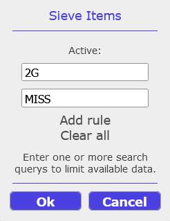

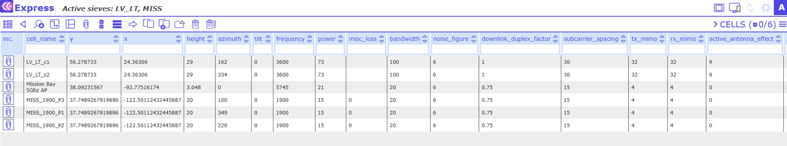

with the administrator before import.
“Import CSV” opens a new window:
Confidential ©Cellular Expert, 2026 Page | 284

---

Cellular Expert Express User Guide 7.3
Data can be imported either as a new table (level 0), or added as a child table to a parent table (level 1).

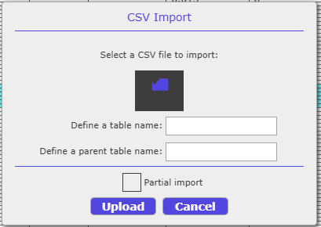

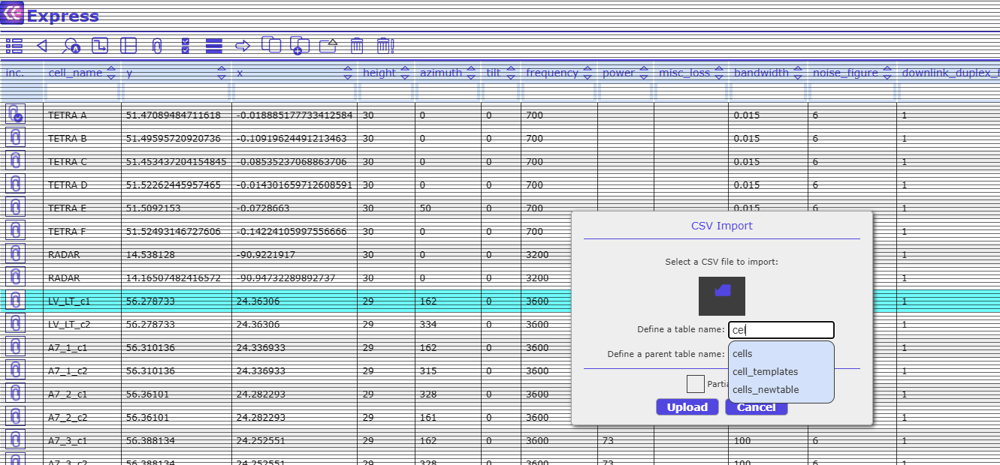
When adding a new table, it is required to define the table name. When adding a child table to a parent
table, it is required to enter the parent table name.
Requirements:
1. The data in the CSV file should be separated by the symbol “;”
2. Avoid space and special characters in the table name
3. Level 0 table – CSV file must comprise a column object_id
4. Level 1 table – CSV file must comprise a column object_id and a column parent_id, with the
parent_id value equal to the object_id of the parent table
When adding a child table to a parent table, choose the parent table from the dropdown menu:
Partial Import
Confidential ©Cellular Expert, 2026 Page | 285

---

Cellular Expert Express User Guide 7.3
The Partial Import feature allows to add records to an already existing table. If the box "Partial import” is

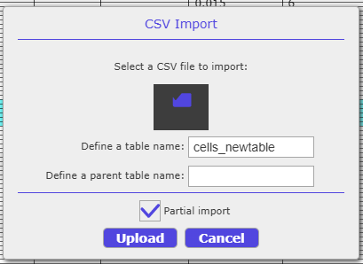

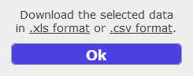

checked, the new records will be added to the defined table:
8. Exploring data

## 8.1 Export selected

Data subsets can be exported as .xls or .csv files. Select the database records of choice, then click Export
Selected button:
A popup window opens.
Click on the links to choose between .xls or.csv file formats:
Note that hidden columns are not exported.

## 8.2 PDF report

A PDF report summarizes information associated with one or more objects. For generating a report, first
select the objects of choice. Then open the Import Export menu with and choose “Generate report as
PDF”
Confidential ©Cellular Expert, 2026 Page | 286

---

Cellular Expert Express User Guide 7.3
A new dialog appears. Open the PDF report by clicking “here”:
Note that the administrator has to prepare the template for the PDF report. Please inform the administrator

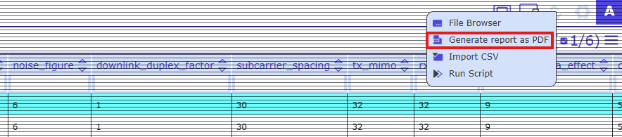

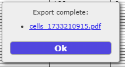

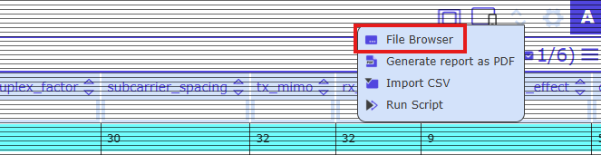
in case of problems with generating PDF reports.

## 8.3 File browser

Open the Data Export menu with and choose “File Browser”:
View attached files, download or delete files:
Confidential ©Cellular Expert, 2026 Page | 287

---

Cellular Expert Express User Guide 7.3
Images are shown as thumbs. Note that it is possible to rotate the images.
File Browser Toolbar:
Open the Data View Panel
Go one step back
Select / unselect all files and folders
Download selected files
Confidential ©Cellular Expert, 2026 Page | 288

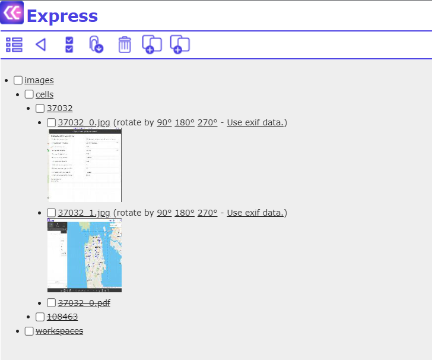

---

Cellular Expert Express User Guide 7.3
Delete selected files
Restore selected files
When an image is deleted, said image is marked as strikethrough on the File Server:
You can restore the image by selecting the strikethrough object and clicking :
Confidential ©Cellular Expert, 2026 Page | 289

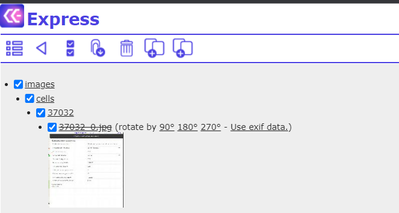

---

Cellular Expert Express User Guide 7.3

## 8.4 Quick references

Quick references are defined by the administrator and allow users to open a reference object in a separate
browser tab. If Quick references are enabled, the respective column is marked with “*”, for example “siteid”:

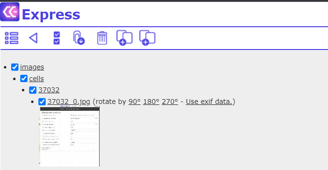

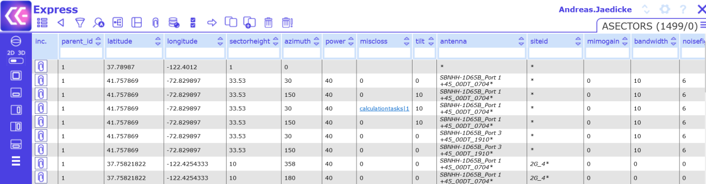

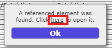
To open a reference link, select it in edit mode (right click on it) and click “here” in the opened dialog.
The referenced object is opened in a separate browser tab.
Confidential ©Cellular Expert, 2026 Page | 290

---

Cellular Expert Express User Guide 7.3

## 8.5 Default editing and manual editing

If the administrator has defined default values (Administrator Guide: "Set Defaults"), editing column
information may include selecting values from a drop-down menu. If the menu does not comprise the
desired value, users may manually edit the information or clear the value:
Confidential ©Cellular Expert, 2026 Page | 291

---
