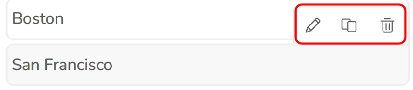
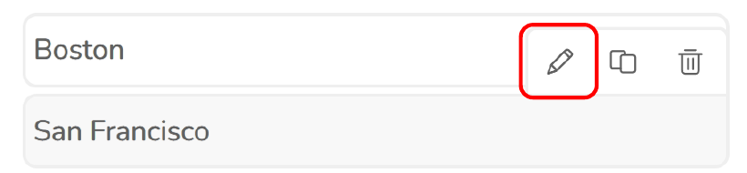
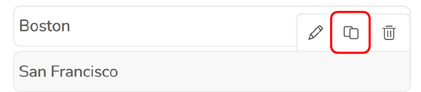
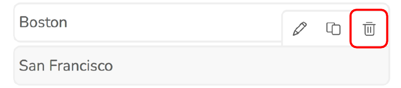

# 3.1.1 Workspaces

Click this button  to open Workspaces tool.
Shows an active workspace.
The tool allows to switch between available workspaces. The Map view will be automatically zoomed to the selected workspace extent and only objects defined for that workspace will be visible.

A workspace is a project-based view in which objects are displayed. Workspaces can be assigned individually for each user group.

**Show only workspaces in view**

When enabled, this option filters the workspace list to display only the workspaces currently visible within
the map's viewport.

Upon hovering the mouse over a workspace item, options for it appear.

**Edit Workspace**

**Duplicate Workspace**

**Delete Workspace**

3.1.1.1 Add workspace

To create a workspace, press the New workspace button.

**General**

**Workspace name**

Workspace identification.

**Coordinate system [EPSG]** 

EPSG code of the coordinate system (spatial reference) used within workspace. Feature coordinates
will be saved in this coordinate system. This does not affect the geodata used within calculations. Default
is 4326 (WGS84).

**Group**
Workspaces are grouped based on the value in this field. To group workspaces, set this field to the
same value for multiple workspaces.

**Locked**
Locks feature editing within the workspace. Useful when you want to keep a workspace for archiving
purposes. Only an admin user can disable this for a locked workspace.

**Extent**
Workspace extent defines where the map gets zoomed to when the workspace is loaded. It is also used
as a zoom reference for the home button .

**Draw on map**
Enabling this allows for clicking on the map to draw a desired square for workspace extent.

**Min. X**

Minimum x (leftmost) coordinate of the workspace extent (in workspace [epsg](#kw:what-is-a-projected-crs:ce-express-geodata))

**Min. Y**

Minimum y (bottommost) coordinate of the workspace extent (in workspace epsg)

**Max. X**

Maximum x (rightmost) coordinate of the workspace extent (in workspace epsg)

**Max. Y**

Maximum y (topmost) coordinate of the workspace extent (in workspace epsg)

**Coordinate origin**
Origin point from which coordinates are calculated from in the user interface. Global coordinates are
saved in the database regardless of this setting.

**Calculations**

**Calculate EIRP**
Enabled – EIRP is calculated with the formula: power – misc. loss + antenna gain.
Disabled – power value is used as EIRP.

**Use clutter**
Determines whether clutter Loss is used in prediction calculations.

**Transmitter height reference**
The height above which the absolute transmitter height is calculated, e.g. if "elevation" is selected, and
transmitter height is set to 10 m, the absolute transmitter height is calculated as elevation + 10. This is
used within CE calculations.
Available options:
- Elevation
- Clutter height (buildings only)
- Clutter height
- Absolute
  
**Receiver height reference**
The height above which the absolute receiver height is calculated, e.g. if "elevation" is selected, and
receiver height is set to 10 m, the absolute receiver height is calculated as elevation + 10. This is used
within CE calculations.
Available options:
- Elevation
- Clutter height (buildings only)
- Clutter height
- Absolute
  
**Geodata set**
Geodata set used in calculations launched within the workspace.

**Extra layers**

**URL / Portal ItemID**
Specifies the source of the layer. Accepts either a direct URL or an ArcGIS Portal Item ID.

**Title**
The title field defines the name displayed for a layer in the layer list 

**Opacity**
Adjusts layer transparency. 

**Visible**
Turns the layer's display on or off.

**Group**
Specifies the group assignment for the layer. You can select an existing group, create a new one, or leave the field blank to place the layer in the default group Other.

Feature naming schemes
Allows for automatic feature name setting depending on features already existent in workspace. For
example: Cells feature naming scheme set to "1,2,3.." → Cells 1, 2, and 3 already exist in workspace →
next placed cell in add features tool will automatically have the name set to 4.
