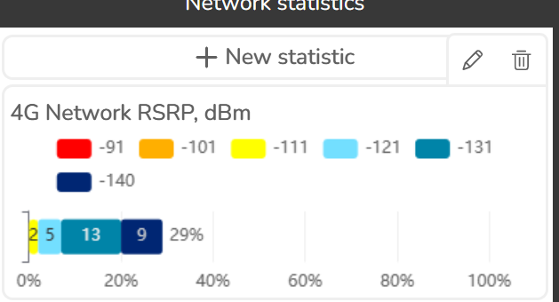
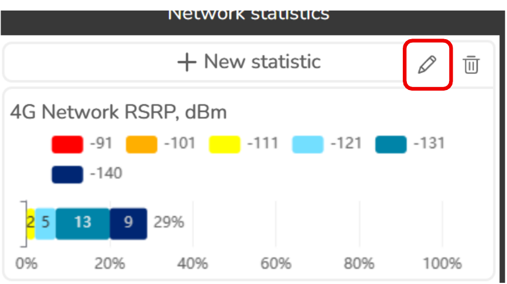

# 3.1.13 Network statistics

Click this button  to open Network statistics tool.

Network Statistics is a tool that calculates the total coverage of a polygon based on its overall coverage (signal strength, dl throughput, etc.). The resulting statistics include the total coverage and individual coverage of each polygon segment.

Upon hovering the mouse over a statistic item, options for it appear.

Edit statistic

Delete statistic

A statistics item may be clicked to reveal detailed statistic.

**Display settings**

**Statistic**

- Area percentage, % – percentage of area covered by each color band. If the statistic is based on
a population point layer, then it’s the percentage of population.
- Area, km2 – area in km2 covered by each color band.
- Population – population covered by each color band, when polygon population field is set.
- Point count - only appears on statistics based on a population point layer. Displays the number of
weighted points covered by each color band.

**Ascending order**
Sort in descending/ascending order.

**Show as table**
View the results in tabular view.

**Row count**
Defines the maximum number of rows displayed.

**Export**

**Download as CSV**
Download statistic results as csv file.

**Publish to Portal**

Publish statistic polygons as an ArcGIS layer. The output polygons will have the statistic results assigned to them as attributes

3.1.13.1 Add statistic

Used for adding new statistics items to the main screen.

**Statistic name**

The name of the Statistic.

**Raster layer**

The calculation result layer that will be used as the source for statistics item.

**Band**

The color of each segment in the statistics. The color bands are automatically retrieved from the raster layer.

**Polygon layer**

Workspace ‘extra layer’ (polygon feature layer) that is used to divide statistics item into areas by polygon.

**Name Field**

Defines the names of territories that will be displayed in the results.

**Population field (optional)**

If selected, adds a population calculation to statistics item.

**Point layer (optional)**

Workspace ‘extra layer’ (point feature layer). If selected, the statistics will be calculated not by total polygon area coverage, but by point coverage (% and #) within each polygon.

