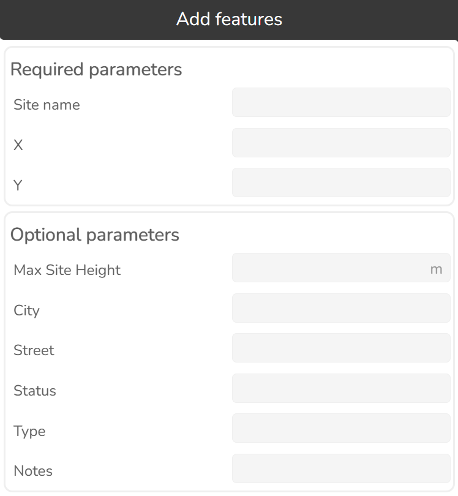
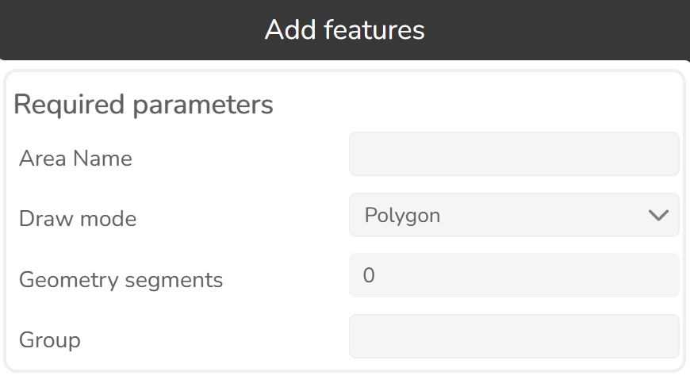

# 3.1.2 Features

Click this button  to open Features tool.

Use this tool to import or add features, select and visualize them.

3.1.2.1 Import

The widget allows the creation of objects from a text file. To start importing new objects press the Import features button.

Select the object type.

A new dialog on the right side of the window will appear. The widget imports object data to the database.
The imported objects will be displayed automatically on the map. The supported file formats are CSV and
KMZ.

To start the import process, select or drag and drop a CSV or KMZ file.

3.1.2.1.1 Mapping

The data in the import files may have names, values and units which do not match the data in the Cellular Expert database. To resolve such issues, check Use mapping button.

**Source**   the name of the value that is written in the data file.

**Fill** value which will be used when an object in the data file has no value for a particular property. In this example, if “Azimuth” is not set, then it will by default be assigned the value of 0. Leaving the default to empty means that no default value will be applied.

3.1.2.1.2 Mapping presets

It is possible to create import presets.

To create a preset, first define source or fill value, then press New mapping preset button.

A new preset will be created.

Define a preset name. The defined preset will be applied the next time for importing.

**Apply**

Applies a mapping preset for importing file.

**Delete**

Deletes a preset.

3.1.2.2 Add features

Select the object type.

A new dialog on the right side of the window will appear.

New objects can be created in several ways. They can be:
- Created from templates
- Created with Cellular Expert tools from zero (define all parameters in the process)

3.1.2.2.1 Feature set template

Allows for saving a group of features as a “feature set template”, with one of the features acting as the origin for the feature set coordinates. The entire feature set can then be placed with a single operation via the add features tool. Coordinates relative to the origin feature are maintained by the other features in the set.

**General**

**Feature set template name**

Name of the feature set template

**Features**

**Coordinate origin feature**

Feature which will be used as the coordinate origin point for the feature set. When the feature set is placed, this feature will be at the mouse click point.

Feature parameters

Parameters of the features saved in the feature set template. The placed feature parameters will be automatically filled with the saved values.

3.1.2.2.2 Add Site

**Required parameters**

**Site name**

Site identification.

**X**

Coordinate in the projected coordinate system. 

**Y**

Coordinate in the projected coordinate system.

**Optional parameters**

**Height**

Height above the terrain.

3.1.2.2.3 Add Candidate sites

**Required parameters**

**Site name**

Site identification.

**X**

Coordinate in the projected coordinate system.

**Y**

Coordinate in the projected coordinate system.

**Optional parameters**

**Max Site Height**

Maximum site height above the terrain in meters.

**City**

City where the site is located.

**Street**

Street address of the site.

**Status**

Free-form text.

**Type**

Free-form text.

**Notes**

Free-form text.

3.1.2.2.4 Add Site search areas

**Required parameters**

**Area Name**

Area identification.

**Draw mode**

Method used to draw the area geometry:
- Polygon
- Circle

**Circle radius**

Radius of the circle, in meters.

**Geometry segments**

Number of segments used to approximate the geometry.

**Group**

Group to which the area belongs.

3.1.2.2.5 Add Cell

**Required parameters**

**Cell name**

Cell identification.

**X**

Coordinate in the projected coordinate system.

**Y**

Coordinate in the projected coordinate system.

**Azimuth**

Cell direction from the North in degrees.

**Optional parameters**

**Height, m**

Height above the terrain.

**Downtilt**

Mechanical tilt value.

**El. Downtilt, deg**

Electrical tilt value.

**Frequency**

Frequency value in MHz.

**Power**

Power value in dBm.

**Misc. loss, dB**

Miscellaneous loss value in dB.

**Bandwidth, MHz**

Value in MHz. Required for 4G and 5G technologies. For other technologies define the value as 0.015.

**Noise figure, dB**

Value in dB. Required for 4G and 5G technologies.

**Downlink duplex factor**

Value range from 0 to 1. Required for Duplex mode TDD, which is applicable for 4G and 5G technologies,
and used for Downlink Throughput calculations. For example, if defined value is 0.7, then 70% of available
bandwidth will be dedicated to Downlink, and 30% - for Uplink.

**Subcarrier spacing, kHz**

Value in kHz. Required for 4G and 5G technologies. For other technologies define value 15.

**Tx Mimo**

Transmitter antenna count. Available values: 1, 2, 4, 8, 16, 32 and 64.

**Rx Mimo**

Receiver antenna count. Available values: 1, 2, 4, 8, 16, 32 and 64.

**Active antenna effect**

The parameter is dedicated to smart antenna modeling. The default value is 0, but if massive MIMO is
used, a smart antenna effect can be included to lower the interference and boost throughput.
Recommended values:
- For MIMO 32x32 – value 6.
- For MIMO 64x64 – value 9.

**Cell load, %**

The parameter is described in percentages and varies from 0 to 100. It describes how the cell is loaded.

The Cell load affects RSSI, RSRQ, and DL Throughput calculations. For example, if the Cell load is higher,
the DL Throughput is lower.

**Color index**

Describes the cell visualization. Available values:
- None – blue color.
- 1 – red color.
- 2 – light green color.
- 3 – dark green color.
- 4 – light blue color.
- 5 – dark blue color.
- 6 – purple color.

**Technology**

Describes the technology of the network object. Possible values are 2G, 3G, 4G, and 5G.

**Prediction model**

Prediction model for Path Loss simulation.

**Frequency group**

Used to divide calculations into parts. If the selection range includes two or more different frequency group
values, the cells won't be predicted together.

**Antenna**

Define antenna patterns for the Cell object.

**Carriers**

Describes the carrier values used for 2G calculations: C/I interference and C/A interference. The values
are written in brackets, […]. If more than one value is defined, the values are separated by a comma. If
there is no carrier information, the brackets are left empty [].

**Site ID**

Describes to which Site the Cell belongs.

**Duplex mode**

Available values FDD or TDD. Required for 4G and 5G technologies. For other technologies define value FDD.

**Status**

Free-form text.

**Type**

3.1.2.2.6 Add Repeater

**Required parameters**

**Repeater name**

Repeater identification.

**X**

Coordinate in the projected coordinate system.

**Y**

Coordinate in the projected coordinate system.

**Azimuth**

Direction from the North in degrees.

**Optional parameters**

**Height**

Object's height above the terrain.

**Downtilt**

Mechanical tilt in telecommunications repeaters is the physical angling of the antenna to optimize signal coverage.

**Electrical Tilt**

Electrical tilt in a repeater refers to the electronic adjustment of an antenna's vertical radiation pattern to optimize network coverage and reduce interference.

**Frequency**

Frequency value in MHz.

**Thresholds 1, 2, 3**

The minimum field strength in dB at repeater location at which power of the corresponding index (1-3) will
be applied. Values should be in ascending order. If a higher threshold is satisfied, the power corresponding
to it will be used.

**Power 1, 2, 3**

A power that is assigned to cells based on the repeater thresholds and cell signal strength. When the cell's
signal strength is categorized the power of the repeater will be assigned as well.

**Misc loss**

Miscellaneous loss value in dB.

**Bandwidth**

Value in MHz. Required for 4G and 5G technologies. For other technologies define the value as 0.015.

**Subcarrier Spacing**

Value in kHz. Required for 4G and 5G technologies. For other technologies define value 15.

**Tx Mimo**

Transmitter antenna count. Available values: 1, 2, 4, 8, 16, 32 and 64.

**Rx Mimo**

Receiver antenna count. Available values: 1, 2, 4, 8, 16, 32 and 64.

**Technology**

Describes the technology of the network object.

**Prediction Model**

Lets the user select which prediction model and configuration should be used for calculations.

**Frequency group**

Used to divide calculations into parts. If the selection range includes two or more different frequency group
values, the cells won't be predicted together.

**Antenna**

Antenna name for Repeater object.

3.1.2.2.7 Add Radar

**Required parameters**

**Radar name**

Radar identification.

**X**

Coordinate in the projected coordinate system.

**Y**

Coordinate in the projected coordinate system.

**Optional parameters**

**Height**

Object's height above the terrain.

**Downtilt**

Mechanical tilt value.

**Frequency**

Frequency value in MHz.

**Power**

Power value in dBm.

**Misc Loss**

Miscellaneous loss value in dB.

**View Angle**

Visible field (vertical angle) of the radar in degrees.

**Prediction Model**

Prediction model for Path Loss simulation.

3.1.2.2.8 Add CPE

**Required parameters**

**CPE name**

CPE identification.

**X**

Coordinate in the projected coordinate system.

**Y**

Coordinate in the projected coordinate system.

**Optional parameters**

**Height**

Object's height above the terrain.

**Azimuth**

Direction from the North in degrees.

**Antenna**

Antenna name for CPE location.

**Power**

A power value in dBm.

**Misc loss**

Miscellaneous loss value in dB.

**Cell ID**

Describes to which Cell the CPE point belongs.

**Throughput**

The speed at which data is transferred. Measured in Mb/s.

**Status**

Current status of the network object.

**Notes**

Additional information for network predictions can be noted here.

3.1.2.2.9 Add Measurements

**Required parameters**

**Field strength, dB**

Field strength.

**X**

Coordinate in the projected coordinate system.

**Y**

Coordinate in the projected coordinate system.

**Cell ID**

A field which binds the measurement to a cell network object.

3.1.2.2.10 Add Omen

**Required parameters**

**Omen name**

Omen identification.

**X**

Coordinate in the projected coordinate system.

**Y**

Coordinate in the projected coordinate system.

**Optional parameters**

**Height, m**

Height above the terrain.

**Notes**

Free-form text.

3.1.2.2.11 Add Sirens

**Required parameters**

**Siren name**

Siren identification.

**X**

Coordinate in the projected coordinate system.

**Y**

Coordinate in the projected coordinate system.

**Azimuth**

Cell direction from the North in degrees.

**Optional parameters**

**Height, m**

Height above the terrain.

**Downtilt**

Mechanical tilt value.

**Frequency**

Frequency value in MHz.

**Power**

Power value in dBm.

**Misc. loss, dB**

Miscellaneous loss value in dB.

**Prediction model**

Only ISO9613 can be applied to calculate sound loss for the siren.

**Antenna**

Antenna name for Siren object.

**Status**

Free-form text.

**Type**

Free-form text.

3.1.2.2.12 Add Lights

**Required parameters**

**Light name**

Light identification.

**X**

Coordinate in the projected coordinate system.

**Y**

Coordinate in the projected coordinate system.

**Azimuth**

Cell direction from the North in degrees.

**Optional parameters**

**Height, m**

Height above the terrain.

**Downtilt**

Mechanical tilt value.

**Antenna**

Antenna name for Light object.

3.1.2.2.13 Add Mesh nodes

**Required parameters**

**Mesh node name**

Mesh node identification.

**X**

Coordinate in the projected coordinate system.

**Y**

Coordinate in the projected coordinate system.

**Optional parameters**

**Height, m**

Height above the terrain.

**Frequency, MHz**

Frequency of the mesh node.

**Power, dBm**

Power value of the mesh node.

**Misc Loss, dB**

Miscellaneous loss value of the mesh node.

**Prediction model**

The prediction model that will be used for the mesh node in Mesh Connectivity and Quick Mesh Connectivity
calculations.

**Antenna**

Define antenna patterns for the mesh node object.

**Sensitivity**

Sensitivity value of the mesh node.

**Max connections**

The maximum number of connections the mesh node can have (used for mesh connectivity calculations).

**Layer**

The layer of the mesh node (number value). Used for priority calculations in Automatic Frequency Planning.

**Group name**

The group name of the mesh node (text description). Several mesh nodes may belong to the same group.

**Status**

Free-form text.

**Type**

Free-form text.
Free-form text.

