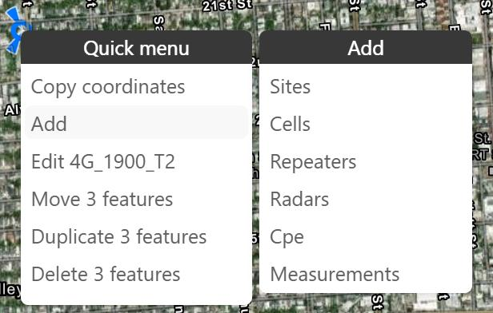

# 3.2.11 Quick menu

The quick menu opens when middle-clicking on the map. If the click is on a feature, it provides actions such
as copying coordinates, adding, editing, moving, duplicating, or deleting the feature. If the click is not on afeature, it shows only copying coordinates and adding new items.
