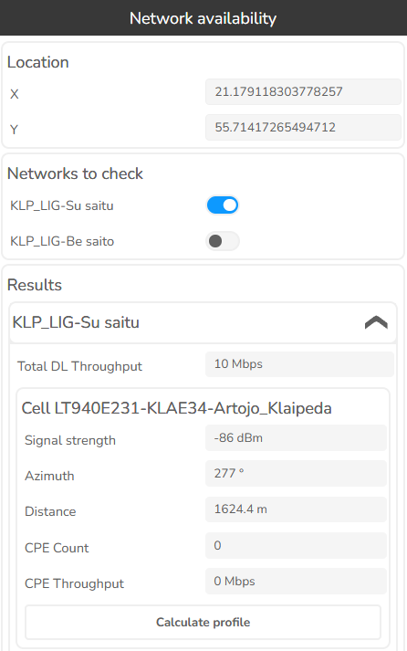
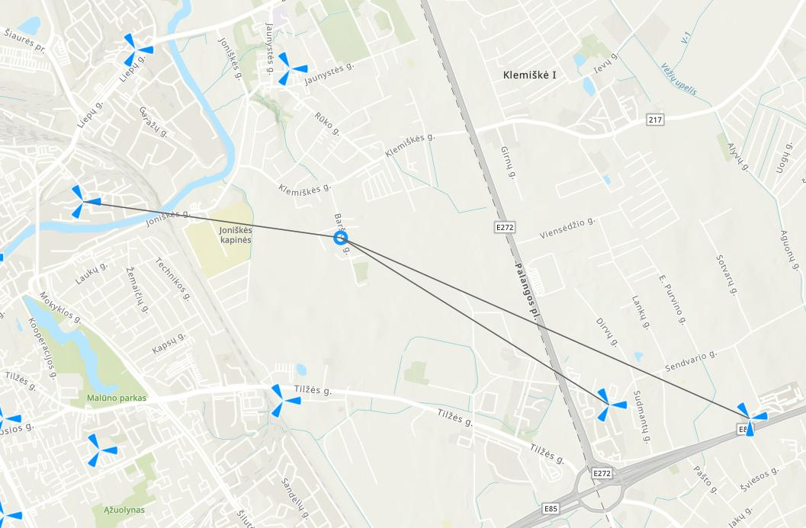
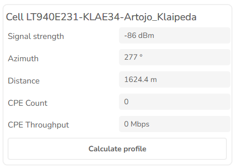
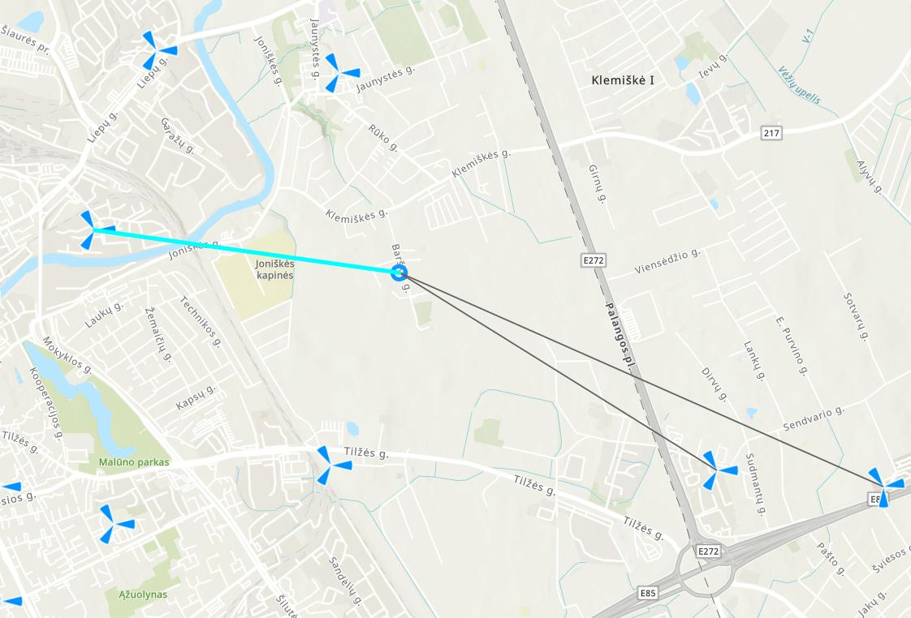
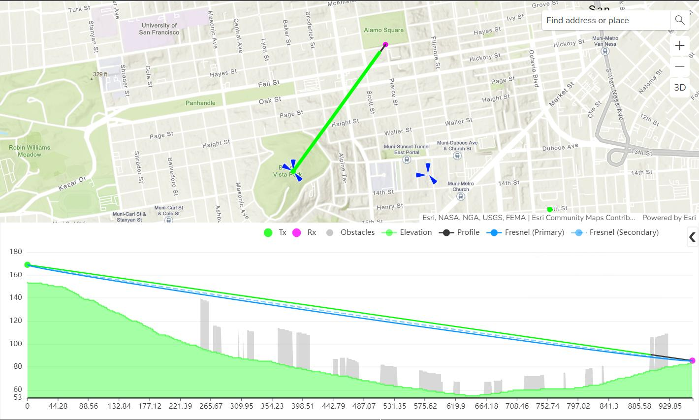

# 3.1.25 Network availability

Click this button  to open Network availability tool.

This tool is designed to check if coverage exists at a chosen location. Define the exact coordinates in the dialog or click on the map to fill the coordinate fields automatically and the tool automatically provides the information about possible networks at this location.

The location can be defined manually in the X/Y fields or by clicking on the map. As a result, detailed information about possible connections is displayed:
- Cell name – cell identification.
- Signal strength – signal value in dBm.
- Azimuth – direction from Receiver to Transmitter.
- Distance – distance between Transmitter and Receiver.
- CPE count – cpe count in a cell.
- CPE throughput – total cpe throughput in a cell.
- Calculate profile – option to open a detailed profile between Transmitter and Receiver.

In addition, the lines between Transmitter and Receiver are displayed on the map.

The lines on the map can be visualized in different ways. Move the mouse cursor on the calculate profile button in tabular view.

Then the appropriate line will be visualized differently.

It is possible to draw a profile from the provided results. Press the Calculate profile button to open the profile.

