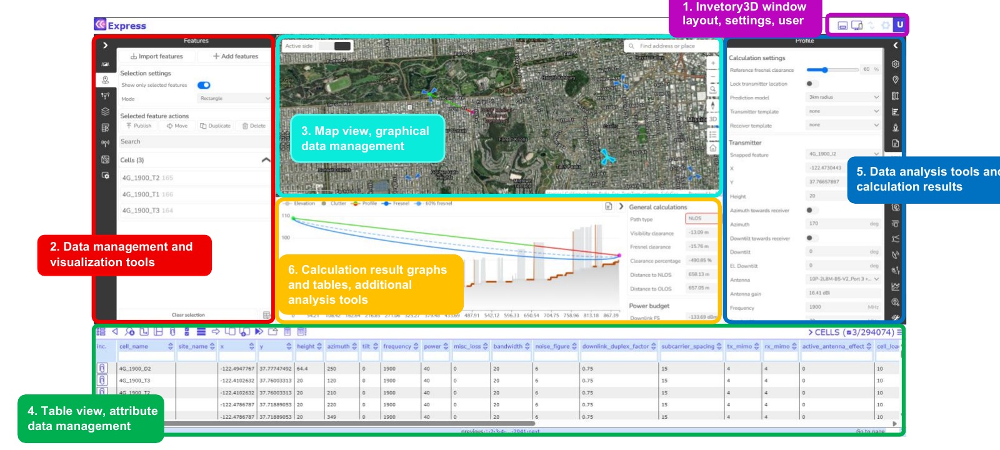

# 3 Map view

The Map view has a predefined layout divided into:
1. Inventory3D window layout, settings, user
2. Data management and visualization tools
3. Map view, graphical data management
4. Table view, attribute data management
5. Data analysis tools and calculation results
6. Calculation result graphs and tables, additional analysis tools

