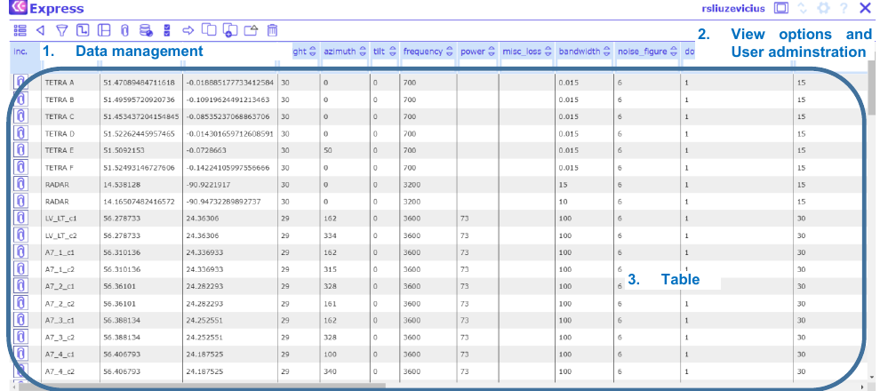

# 6 Network Data Management

The Network Data Management view is divided into four sections:
- Tools for data management.
- User administration tasks.
- Table for data editing.
- [View options](#kw:64-view-options:none).

To navigate through the tables, click on the table name at the top right corner.

To select a record, click on a record with the left mouse button. Selected records are colored in blue:

