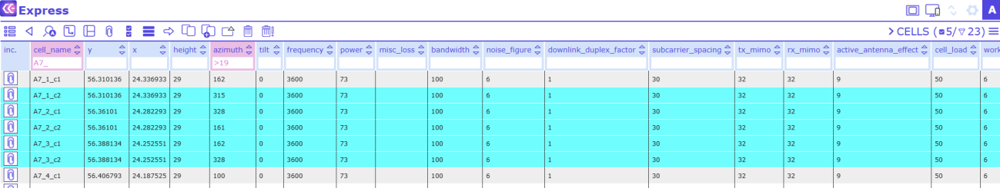
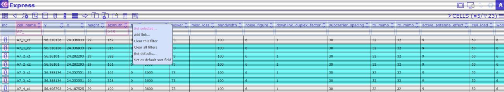
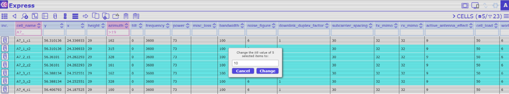
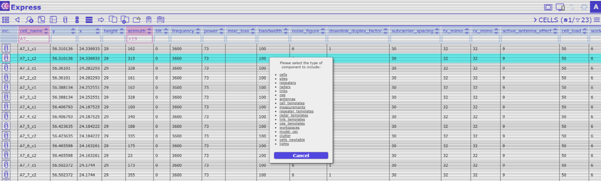
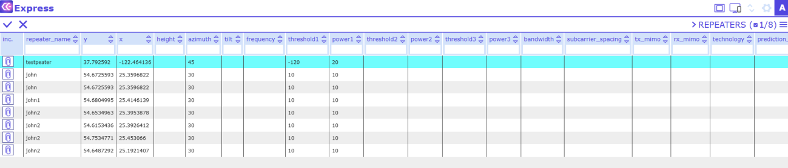
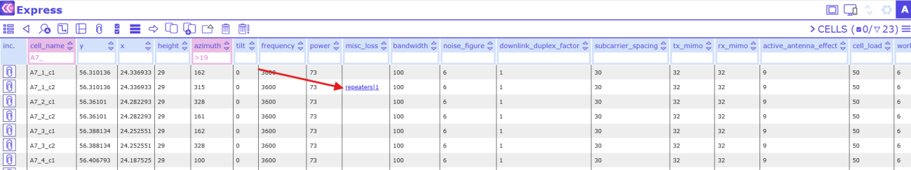

# 7.2.1 Set selected

This feature allows bulk editing of several records at once: Select the respective records, click on the column
header and choose “Set selected” from the dropdown menu. A dialog opens with a text field. Fill in the term
you want the selected database records to be changed to. Then click on “Change”. Synchronize the edited
records with the database using the Synchronize changes Tool.

1. Select the records

2. Click on the required column header (here:tilt) and choose Set selected

3. Define the new value and click Change

4. Select the type of component you want to link to (here: calculation tasks)

5. Choose the repeaters(s) you want to link to and confirm the selection with the top left corner

 in

6. The link has been created

