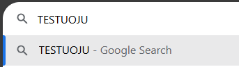

# 8.6 Testuoju

Ziurim kaip veikia 

**Testing if it works**

So yeah
- They are making or not ?

| Parametras | Reikšmė | Aprašymas |
|---|---|---|
| Color | Red | Polygon spalva |
| Value | 10 | Skaičiavimo reikšmė |
| Type | Default | Numatyta reikšmė |

**Radar_name**

Object identification.

**Y**

Decimal degrees Y type coordinate in the WGS 1984 geographical coordinate system.

**X**

Decimal degrees X type coordinate in the WGS 1984 geographical coordinate system.

**Height**

Radar height above the ground in meters

**Tilt**

Mechanical tilt value, negative numbers tilt up.

**Frequency**

Frequency value in MHz.