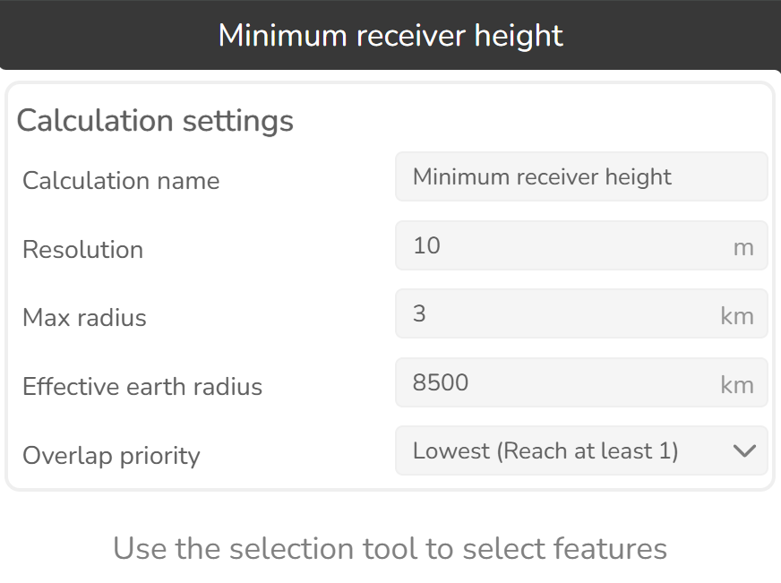
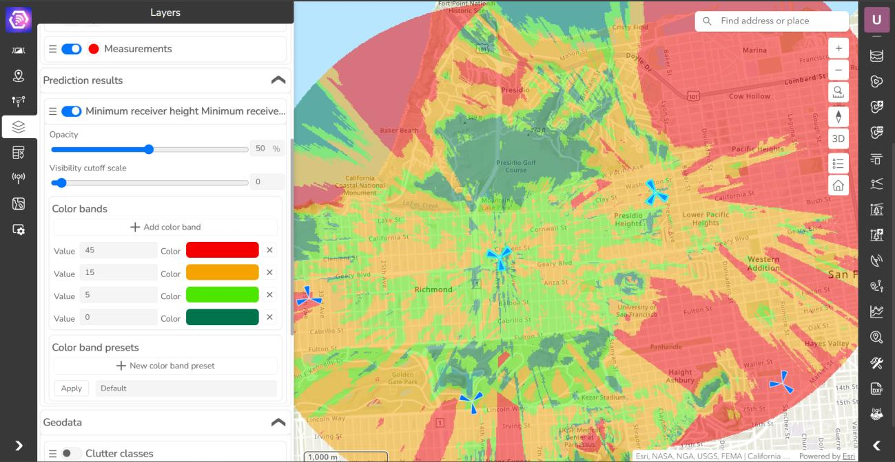

# 3.1.22 Minimum receiver height

Click this button  to open Minimum receiver height tool.

Calculates the minimum receiver height required to satisfy LOS condition for selected features.

### Calculation settings

| Option | Description |
|---|---|
| Calculation name | Name of the calculation that will be displayed in Prediction history. |
| Resolution | Prediction raster cell size in meters. |
| Max radius | Maximum calculation radius in kilometers. |
| Effective earth radius | Earth radius was used for the calculations. |

**Overlap priority**

Value priority in places where multiple feature calculations overlap:

| Value | Description |
|---|---|
| Lowest (Reach at least 1) | Minimum value will be used. |
| Highest (Reach all) | Maximum value will be used. |

**Results:**

- Minimum receiver height, m - minimum receiver height required to satisfy LOS condition

  

- Best Server – Object id of the feature which has the value priority in each pixel. E.g.: In the case of
"lowest" priority setting, pixels have the object id of the feature which has the lowest available
minimum receiver height (best visibility).
