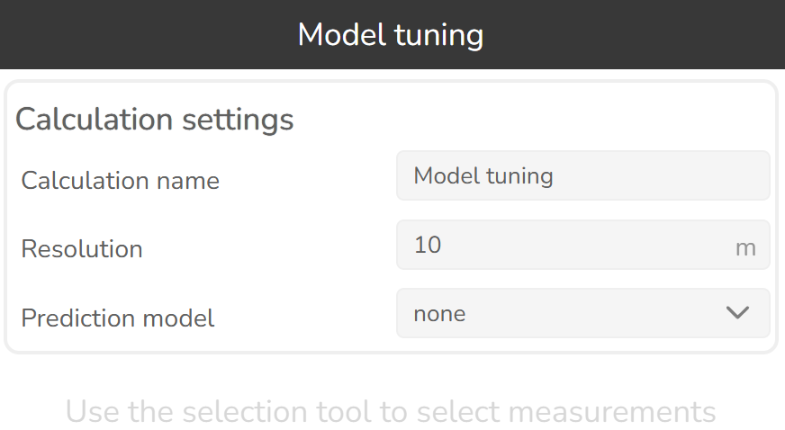
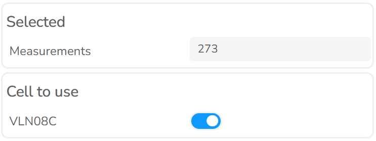
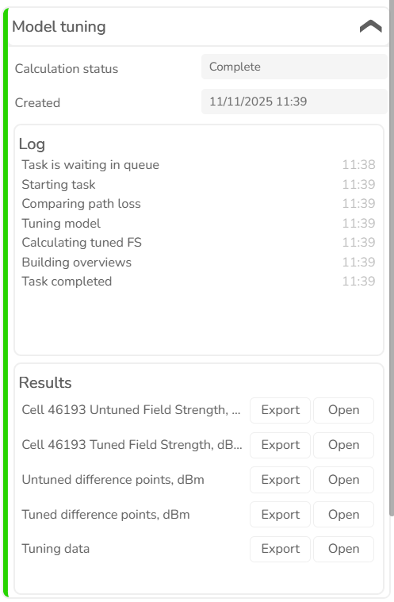
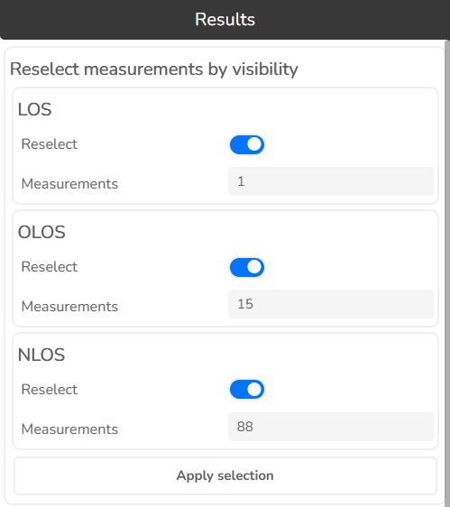
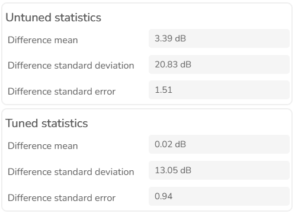
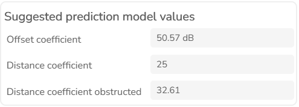
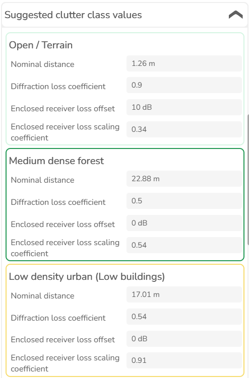

# 3.1.26 Model Tuning

Click this button  to open Model tuning tool.

Model Tuning is a tool to optimize prediction model parameters based on test points. These test points must be bound to cells by their cell id.

| Option | Description |
|---|---|
| Calculation Name | Name of the calculation that will be displayed in the Prediction history. |
| Resolution | Prediction raster cell size in meters. |
| Prediction model | Select which model will be tuned. |

Use the Features tool to select measurements.

| Option | Description |
|---|---|
| Selected | The count of selected measurement points. |
| Cell to use | Select the Cell with which you want to do the drive test. At the moment, measuring for a single cell is supported. |

Press Calculate to initiate the model tuning. The model tuning task will be added to the Prediction History dialog.

Click the open button next to the tuning data to open results.

**Reselect measurements by visibility**

Enable the visibility types of your choosing, then click apply selection to select only the measurement points, which fall into your selected visibility categories. Then, you may run the model tuning tool again with the newly selected features. Useful when you want to tune parts of the prediction model related to specific visibility types.

The comparison between the untuned and tuned prediction models is presented by highlighting the differences in their mean values, standard deviations, and standard errors.

| Metric | Description |
|---|---|
| Difference Mean | During model tuning measures how the average prediction accuracy or performance improves after optimizing model parameters compared to the default settings. For example, tuning might reduce the average prediction error, leading to more accurate coverage or signal estimations. |
| Standard Deviation | Reflects the variability in prediction performance. Comparing standard deviations between untuned and tuned models shows whether tuning makes predictions more consistent and reliable. For example, lower standard deviation after tuning indicates the model's predictions are less scattered and more stable. |
| Standard Error | During model tuning quantifies the precision of the mean prediction. A lower standard error in the tuned model suggests that the average prediction is more reliable and less influenced by sample variability, indicating improved model stability and confidence in its performance. |

Model coefficients that are recommended to be changed.

| Coefficient | Description |
|---|---|
| Offset coefficient | Represents the offset in decibels added to the path loss grid. |
| Slope coefficient distance | Defines the slope based on the distance between the cell and the receiver location. |
| Slope coefficient distance obstructed | Represents the slope based on the obstructed distance between the cell and the receiver location. |

**Clutter classes**

Recommended clutter loss values
