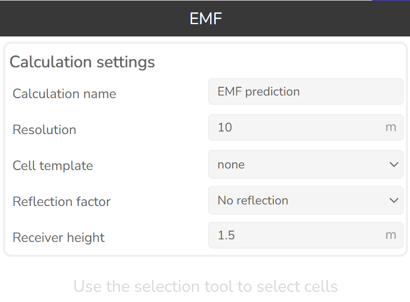

# 3.1.30 EMF

Click this button  to open EMF tool.

Used for calculating the electromagnetic field, or non-ionising radiation for regulatory purposes.

| Option | Description |
|---|---|
| Calculation name | Name of the calculation that will be displayed in the Prediction history. |
| Resolution | Prediction raster cell size in meters. |
| Cell template | If the cell is missing the required parameters, the parameters from the template will be used. |

### Reflection factor

| Value | Description |
|---|---|
| No reflection | Ground reflections aren't considered. |
| Realistic reflection | Reflection coefficient of 2.56. |
| Full reflection | Reflection coefficient of 4. |

**Receiver height** — receiver height above the receiver reference height selected in the workspace settings.

### Results

| Result | Description |
|---|---|
| EMF Limit usage, % | Weighted percentage of frequency band regulatory EMF limit. |
| EMF, W/m2 | EMF value in mW/m2. |
| EMF, mV/m | EMF value in mV/m. |
