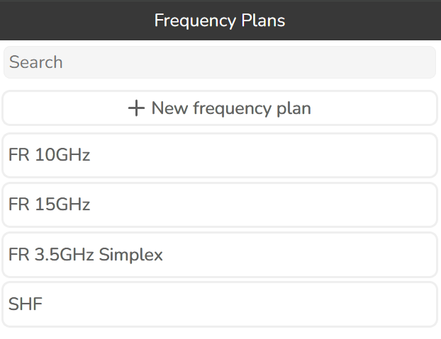
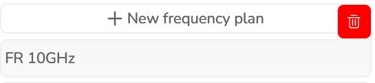
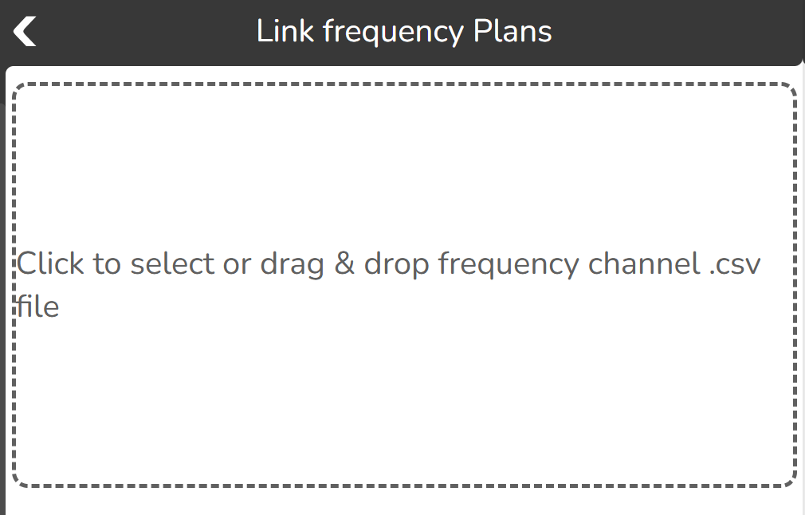
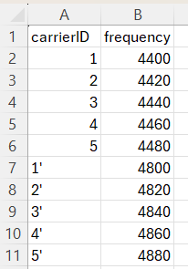
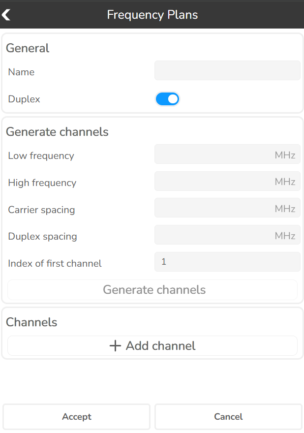
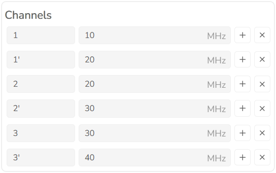

# 3.1.36 Frequency plans

Click this button  to open Frequency plans tool.

The tool enables you to create frequency plans that will be necessary to create a link and later be used in calculations.

Move the mouse cursor over the frequency plan and delete it using Delete button.

## 3.1.36.1 Import frequency plan

To import a frequency plan press the New frequency plan button

and then select Import channels CVS.

To start the import procedure, select or drag and drop the frequency channel csv file. Here is an example:

## 3.1.36.2 Add frequency plan manually

To add manually a frequency plan press the New frequency plan button

and then select Create manually.

**General**

| Option | Description |
|---|---|
| Name | Frequency Plan identification. |
| Duplex | Specifies whether the signal can be transmitted and received simultaneously. Changing the duplex mode will affect the carrier selection. |

**Generate channels**

| Option | Description |
|---|---|
| Low/high frequency | Frequencies in MHz. |
| Carrier spacing | The frequency separation between adjacent carrier frequencies in a communication system, ensuring non-interference between carriers. |
| Duplex spacing | Frequency separation between the transmit and receive bands in a two-way communication system. |
| Index of first channel | The numbering start point for generated channels. |
| Generate channels | Creates a list of channels based on the inputs. |

**Channels**

**Add channel** — allows manual addition of individual channels to the frequency plan.

| Field | Description |
|---|---|
| Channel | Channel identifier. |
| Frequency | Channel's frequency value in MHz. |

Use the *Add channel below* button  to add a new channel below the selected one, or the *Delete channel* button  to remove it.
