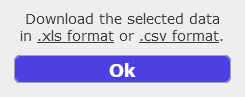
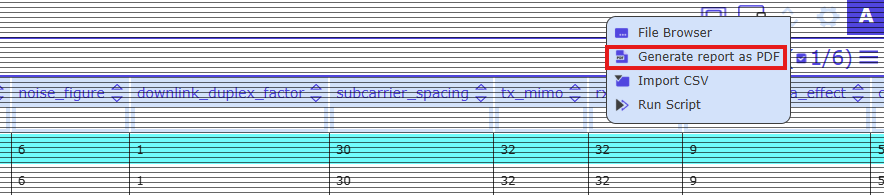
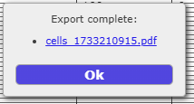
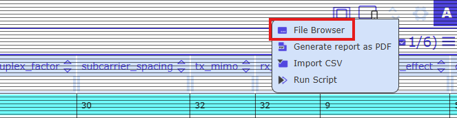
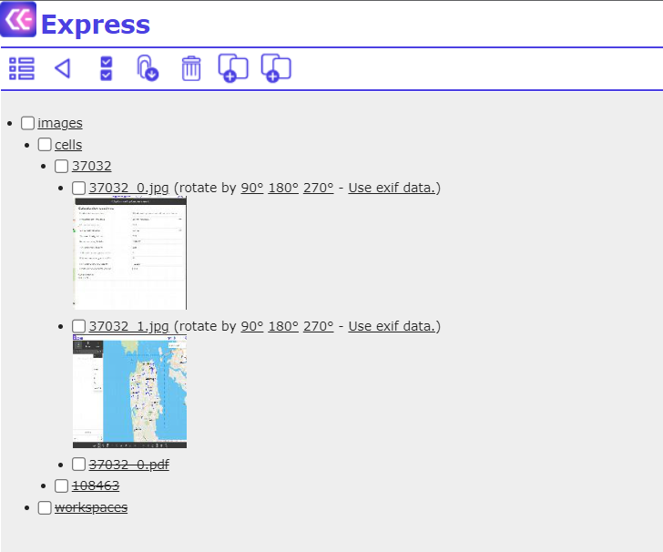
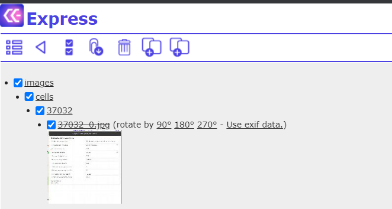
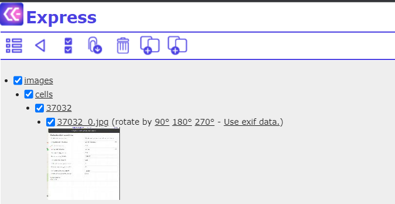
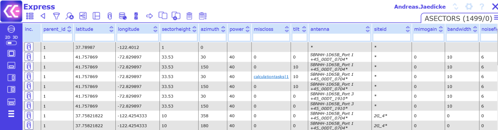
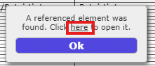

# 8 Exploring data

## 8.1 Export selected

Data subsets can be exported as .xls or .csv files. Select the database records of choice, then click Export

Selected  button:

A popup window opens.

Click on the links to choose between .xls or.csv file formats:

Note that hidden columns are not exported.

## 8.2 PDF report

A PDF report summarizes information associated with one or more objects. For generating a report, first select the objects of choice. Then open the Import Export menu with  and choose “Generate report as PDF”

A new dialog appears. Open the PDF report by clicking “here”:

Note that the administrator has to prepare the template for the PDF report. Please inform the administrator in case of problems with generating PDF reports.

## 8.3 File browser

Open the Data Export menu with  and choose “File Browser”:

View attached files, download or delete files:

Images are shown as thumbs. Note that it is possible to rotate the images.

**File Browser Toolbar**

 - Open the Data View Panel

 - Go one step back

 - Select / unselect all files and folders

 - Download selected files

 - Delete selected files

 - Restore selected files

When an image is deleted, said image is marked as strikethrough on the File Server:

You can restore the image by selecting the strikethrough object and clicking :

## 8.4 Quick references

Quick references are defined by the administrator and allow users to open a reference object in a separate
browser tab. If Quick references are enabled, the respective column is marked with “*”, for example “siteid”:

To open a reference link, select it in edit mode (right click on it) and click “here” in the opened dialog.

The referenced object is opened in a separate browser tab.

## 8.5 Default editing and manual editing

If the administrator has defined default values (Administrator Guide: "Set Defaults"), editing column
information may include selecting values from a drop-down menu. If the menu does not comprise the
desired value, users may manually edit the information or clear the value:

