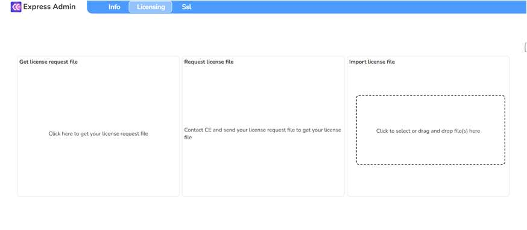
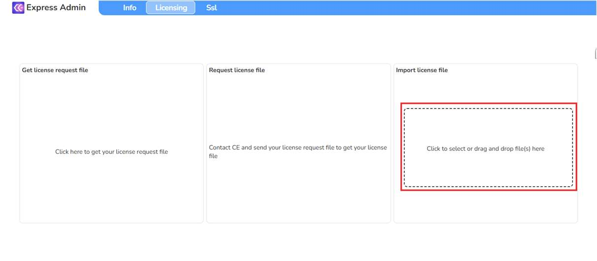
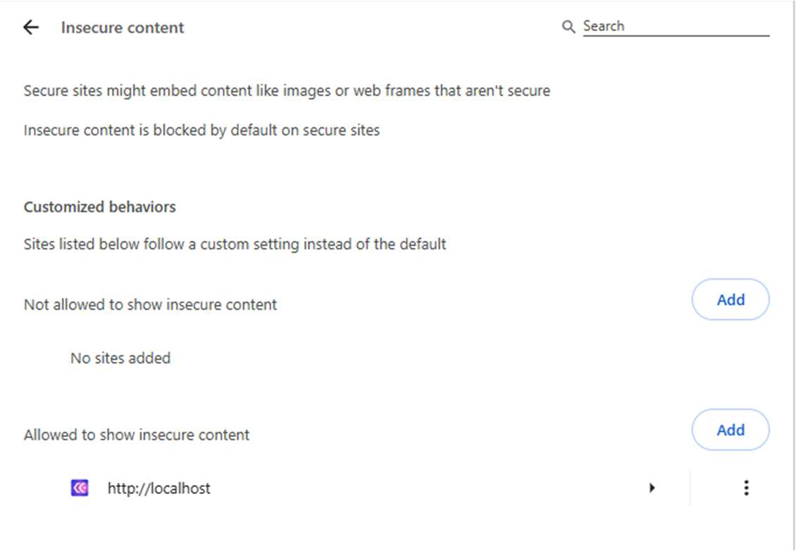
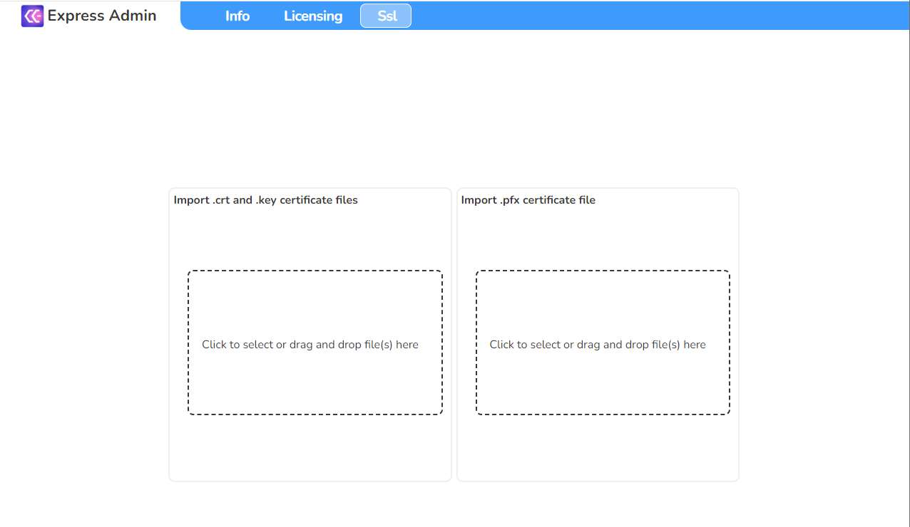
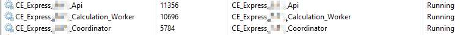
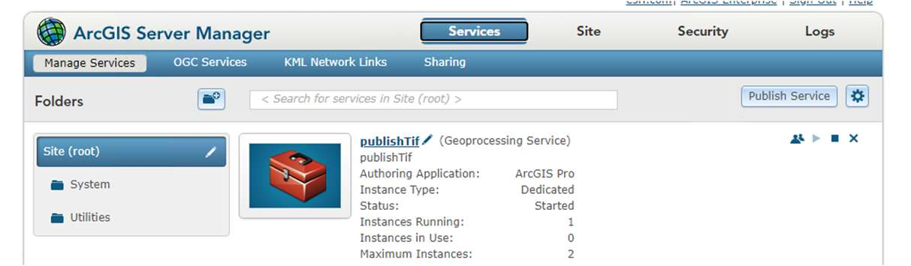
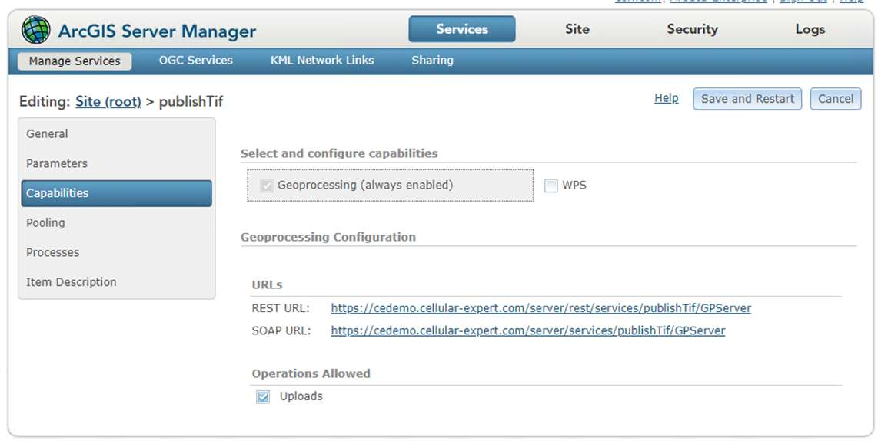
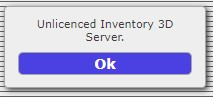
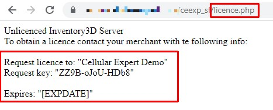

# Licensing, SSL, publishing, and notifications

Once CE Express is installed and its Windows services are running (see [Installation and server configuration](2-installation-and-server-configuration.md)), complete the following optional and required server-side configuration steps: licensing, SSL, publishing to Portal for ArcGIS, and email notifications.

## Licence the CE Express application

Open a web browser and start the CE Express administrator tool:

```text
http://CE_express_hostname/ceexpressfrontenfolder/?admin=true
```

Example: `http://localhost/ceexp/?admin=true`



1. Obtain the licence request file by clicking on the designated section.
2. Send the obtained file to Cellular Expert support.
3. Once you receive the licence file, apply it by clicking **Import License File**, or by dragging and dropping the file into that section:



Note: the browser could always redirect to https instead of using http. The administrator needs to add the URL of CE Express to the browser's insecure content list:

- Chrome: `chrome://settings/content/insecureContent`
- Edge: `edge://settings/content/insecureContent`



The alternative is to enable SSL support on CE Express (see [Enable SSL support](#enable-ssl-support-optional) below).

## Enable SSL support (optional)

To enable SSL support, prepare the SSL certificate files. Into CE Express you can import a `.pfx` file (password required), or optionally `ssl.crt` and `ssl_pem.key` files.

To import SSL files for CE Express, open the CE admin tool using the same URL as above, then:

1. Open the **SSL** tab:



2. Import the prepared SSL `.pfx` file using the **Import .pfx certificate file** section (or the `.crt`/`.key` files using the section next to it).
3. After importing the SSL certificate, edit the configuration file located under the CE Express frontend folder (example `C:/inetpub/wwwroot/ceexp`). Open `config.json` with a text editor and change `ceApiUrl` from `http` to `https`:

   ```json
   // From
   "ceApiUrl": "http://[CE_express_hostname]:6062"
   // To
   "ceApiUrl": "https://[CE_express_hostname]:6062"
   ```

4. Restart the Windows services:



The `Coordinator` service must be started last.

When SSL is enabled, use the https protocol to access the CE Express application: `https://CE_express_hostname/ceexpressfrontenfolder` (example: `https://localhost/ceexp`).

## Configure CE Express to publish objects to Portal for ArcGIS (optional)

### Option: ArcGIS Server without Image Server

1. Publish the provided geoprocessing tool `publishTif.sd` using ArcGIS Server Manager:



2. Find and copy the GP tool's REST URL:



3. Edit `C:\Program Files\Cellular Expert\Express\config.json` and change the three parameters required for publishing:

   ```json
   "PUBLISH_GEOPROCESSOR": "https://<CE Server hostname>/server/rest/services/publishTif/GPServer",
   "PUBLISH_USERNAME": "USERNAME",
   "PUBLISH_PASSWORD": "PASSWORD"
   ```

   `USERNAME` and `PASSWORD` are the Portal for ArcGIS user's credentials. This user is used to publish, and the published objects (raster or features) will be visible under this user's content.

4. Restart the Windows services. The `Coordinator` service must be started last.

### Option: ArcGIS Server with Image Server

1. Edit `C:\Program Files\Cellular Expert\Express\config.json` and change the two parameters required for publishing:

   ```json
   "PUBLISH_GEOPROCESSOR": "",
   "PUBLISH_USERNAME": "USERNAME",
   "PUBLISH_PASSWORD": "PASSWORD"
   ```

   `USERNAME` and `PASSWORD` are the Portal for ArcGIS user's credentials, as above.

2. Restart the Windows CE services. The `Coordinator` service must be started last.

## Configure CE Express to send notifications (optional)

You can enable email notifications to alert recipients when changes occur in the database. This feature is managed through the configuration file.

1. Open the configuration file `C:\Program Files\Cellular Expert\Express\config.json`.
2. Locate and edit the following parameters to match your email service or SMTP server settings:

   ```json
   "EMAIL_SERVICE_PROVIDER": "",
   "EMAIL_USERNAME": "",
   "EMAIL_PASSWORD": "",
   "SMTP_HOST": "",
   "SMTP_PORT": "",
   "SMTP_SECURE": false,
   "SMTP_TLS_CIPHERS": "SSLv3",
   "SMTP_TLS_REJECT_UNAUTHORIZED": false
   ```

   Leave `EMAIL_SERVICE_PROVIDER` empty if you are configuring notifications using a custom SMTP server. Ensure the remaining SMTP parameters (`SMTP_HOST`, `SMTP_PORT`, etc.) are correctly filled in according to your email provider's requirements.

3. Restart the Windows CE services. The `Coordinator` service must be started last.

## Register the licence for CE Inventory3D

The Inventory3D webview application (installed as described in [Inventory3D installation and database](4-inventory3d-installation-and-database.md)) requires its own, separate licence.

Inventory3D will be accessible at:

```text
http(s)://{your_web_server_url}/ceexp_db
```

The first access to the application will show that it is unlicensed:



To obtain a licence, run the following PHP script, which generates a request key:

```text
http(s)://{your_web_server_url}/ceexp_db/licence.php
```

Copy the provided information, including the request key, and send it to Cellular Expert (support@cellular-expert.com) to get a licence key:



After receiving the licence key, licence the application by running:

```text
http(s)://{your_web_server_url}/ceexp_db/licence.php?serial=[LICENCE_KEY]
```
