# Inventory3D administration

This chapter describes the CE Inventory3D web application functions available only to administrators. They are opened from the **Settings** menu  in the [Network Data Management](../6-network-data-management.md) view. Each function below shows this same menu, with the relevant item highlighted.

## Set defaults

Columns can be designed so that their record contents don't have to be entered by hand but are instead chosen from a list of defaults — e.g. active/inactive, or planned/active/closed. To do this, click a column header and select **Set defaults** from the dropdown menu. A new window opens with the currently active default values; enter at least 2 defaults and click **OK**.

Default values can also be edited directly in the `defaults.json` file — see [CE Inventory3D folder structure](4-inventory3d-installation-and-database.md#ce-inventory3d-folder-structure).

Once configured, users see the default values offered while [editing records](../8-exploring-data.md#85-default-editing-and-manual-editing).

## Generate PDF reports

Any user can generate a PDF report for selected records (see [PDF report](../8-exploring-data.md#82-pdf-report)), but the administrator must first prepare the report's template file.

An example `default.json` file and a `readme` file with explanations can be found in the folder `ceexp_db/exporttemplates`. All new templates must be stored there. The template file's name must include the name of the table the user will run **Generate report as PDF** from. Example, for table `site`:

```text
site.json
site_1.json
site_new.json
```

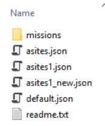

When more than one template file matches a table, the user is prompted to pick one:

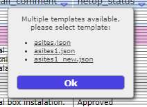

The report's header, description, and/or signature field can be configured by the administrator inside the template json file. If the template json file has invalid syntax, the web application informs the user instead of generating the report:

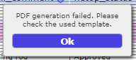

## Run script

It is possible to run a script on the server and load updated data into the tables. The **Run Script** tool can be configured into the [CE API](../7-database-organization.md#75-ce-api) tool.

**Important:** this action is not secure. Before enabling it, the script must be tested by an administrator — otherwise, it could destroy the database.

The script must be declared in the `conf.inc` configuration file (`$enableExternalScripts = true;`), and the script files placed into the `scripts` folder on the server. The parameter `$inv3dCustomScript` is deprecated.

## Import CSV

Administrators can create a new table (level 0), or add a child table to an existing parent table (level 1), with the **Import CSV** tool, configured into the [CE API](../7-database-organization.md#75-ce-api) tool. The dialog, its **Partial Import** option (for adding records to an already-existing table), and the CSV requirements (`;`-separated fields, mandatory `object_id` and `parent_id` columns) are the same for all users — see [Import CSV](../7-database-organization.md#76-import-csv) for the full walkthrough with screenshots.

From the administrator's side, the tool is primarily used to create brand-new level-0/level-1 tables — defining a table name that doesn't yet exist in `inv3d_tables` — which is why it is documented here rather than only in the user guide.

## History

Admins can monitor changes made to the database — specifically, which records were changed, when, and by whom. Select an object and click **History** from the **Settings** menu:

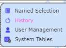

A log tab opens, showing when an object's parameter was changed and what changed:

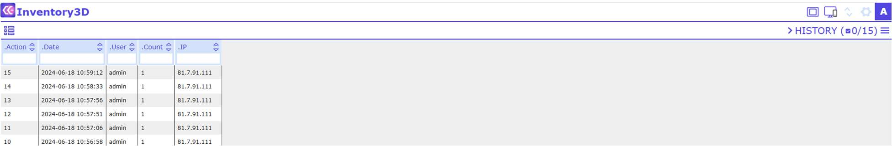

If no object is selected when **History** is clicked, all actions made within the application are shown:


## User management

Administrators can restrict access to tables and attributes for individual users and user groups. **User Management** is opened from the **Settings** menu:

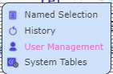

The user list opens in a separate window, with the fields Username, e-mail, Name, and Group:

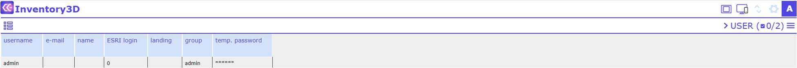

To switch between the user list and the groups list (and back), click the tab:

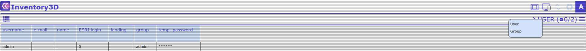

User groups:

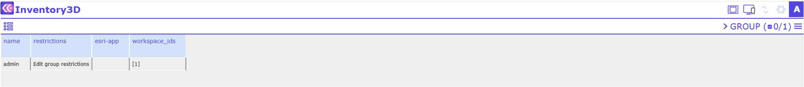

A new user group can be added by clicking . Note that new *users* are only added directly in the database (in the `user_info` table).

To edit a group's restrictions, enter edit mode in the **Restrictions** column — for example, for the group "users", hold Ctrl and right-click the cell.

**a) Restricting a group's access to all tables**

First, determine the visibility/editability of newly added items, i.e. records created after the restriction is set:

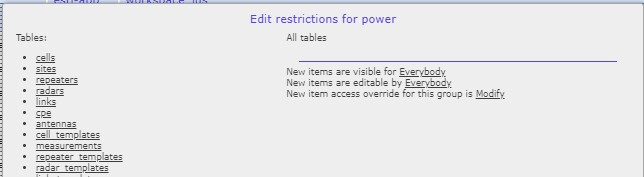

Select one of three options from the dropdown menu:

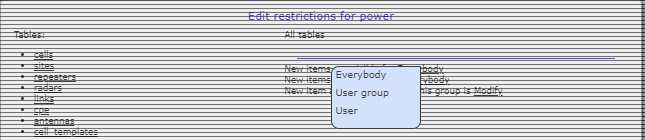

- **Everybody** — new items are visible/editable for everybody.
- **User group** — new items are visible/editable for the members of the group (note: the users in a group may change, and restrictions on all elements are inherited).
- **User** — new items are visible/editable only for the user who created them.

Then determine the group's overall access:

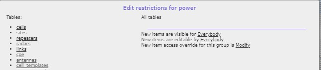

Select one of three options from the dropdown menu:

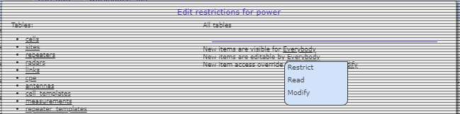

- **Restrict** — enables restrictions posed by other groups.
- **Read** — lets members of the group view items.
- **Modify** — lets members of the group view and edit items.

Note: the "access for this group" selection may override the per-item access rights. For restrictions posed by other groups, this value must be set to **Restrict**.

**b) Restricting a group's access to selected tables and attributes**

For example, for the table `checklist`, select it from the table list:

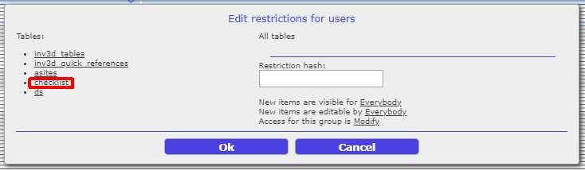

Choose **entire table**, or select the individual attributes to restrict. Use the eye and lock symbols to set visibility and editability per attribute:

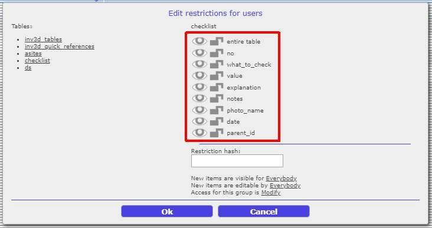


Restrict the visibility/editability of newly added items for this table:

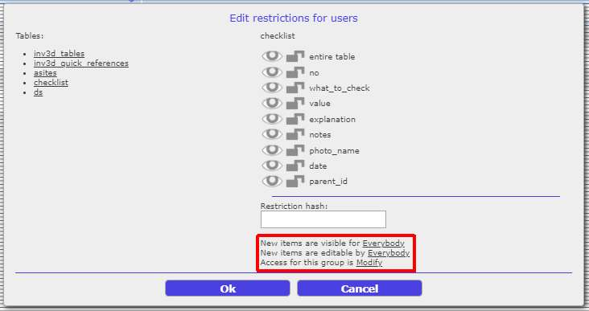

Choose from the dropdown menu:

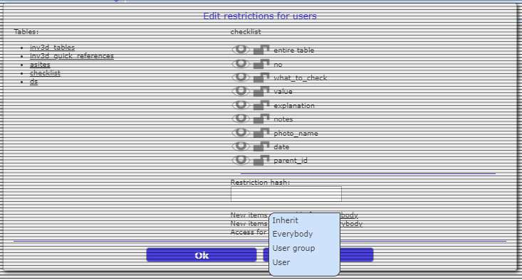

- **Inherit** — if restrictions for all tables are already defined (see part a, above), those settings are inherited for this table.
- **Everybody** — new items in this table are visible/editable for everybody.
- **User group** — new items are visible/editable for the members of this group.
- **User** — new items are visible/editable only for the user who created them.

Then determine the group's access for this table, choosing from **Restrict** / **Read** / **Modify** as described above. Note: this selection may override per-item access rights, and affects how the group's members interact with the whole table; for restrictions posed by other groups, set this to **Restrict**.

**Restriction principles**

- Any item is visible and editable by its owner, even if the owner has since moved to another group.
- Restrictions are applied at the time an element is created.
- "New items are visible/editable" determines whether users may view and modify new elements.
- A write restriction is not applied at runtime, only after synchronization — invalid changes are discarded during the sync operation.
- Users in the `admin` group have no restrictions.

## System tables

If a table is marked as a system table (using `inv3d_system` in `inv3d_tables.parent_name` — see [Table inv3d_tables](4-inventory3d-installation-and-database.md#table-inv3d_tables)), administrators can edit it directly in the webapp using **System Tables** from the **Settings** menu:

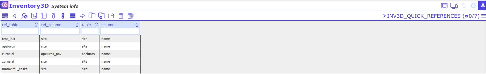

System tables typically support additional features implemented in CE Inventory3D — for example, `inv3d_quick_references`:


Through **System Tables**, the administrator can add, edit, or delete records from predefined tables directly from the web application — including `inv3d_tables`, `inv3d_quick_references`, `inv3d_aliases`, and others described in [Information about the CE Express Inventory3D database](4-inventory3d-installation-and-database.md#information-about-the-ce-express-inventory3d-database).

## Delete object permanently

Any user can remove an object from the database, but it is only marked as struck through (see [Delete record](../6-network-data-management.md#6114-delete-record) / [Remove selected](../6-network-data-management.md#6115-remove-selected)) — only an administrator can delete a removed object permanently. To do so, select the struck-through object and click the delete icon :

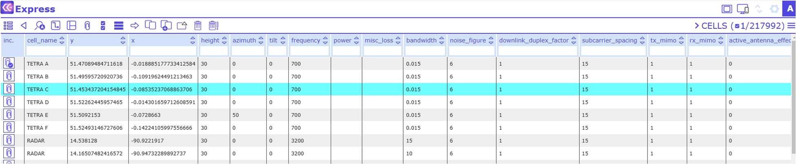

Permanently deleted records can no longer be restored from the application; the `deleted` system table tracks removed records for this purpose (see [Table deleted](4-inventory3d-installation-and-database.md#table-deleted)).

## Restore deleted image

Deleted attachments (images, files) are marked as struck through in the [File Browser](../../../inventory3d/v4.6/4-exploring-data.md), where any user with sufficient permissions can restore them by selecting the struck-through file and clicking the restore icon. Whether this action is available to a given user, or reserved to administrators, depends on the [user management](#user-management) restrictions configured for that table.

## Column and table aliasing

Table and column names are displayed exactly as defined in the table's requirements. Sometimes, however, it is preferable to display a different name in the application.

Administrators can add table or column aliases, which are then shown in the application instead of the real names. This requires configuring the system table `inv3d_aliases` (see [System tables](#system-tables)):

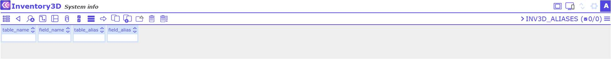

The table `inv3d_aliases` comprises the columns `table_name`, `field_name`, `table_alias`, and `field_alias`.

## Reset password

Users log in with a username and password combination; user information is stored in the system table `user_info`:

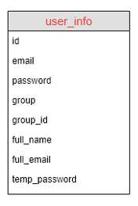

Note: before using the "Reset Password" feature, the server should be configured as a mail server, able to send emails.

Once a user is registered with their email address, they can change their own password for the CE Express account at any time by clicking **Reset password** on the login screen:

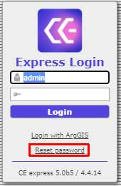

Alternatively, a user can ask an Inventory3D administrator to reset their password. The administrator can set a temporary password using the CE Inventory3D application's `user_info` table, and send it to the user:

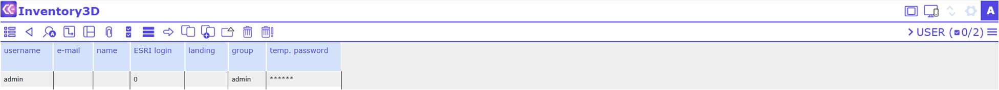

The user is asked to change the password during their first login with the temporary password.
