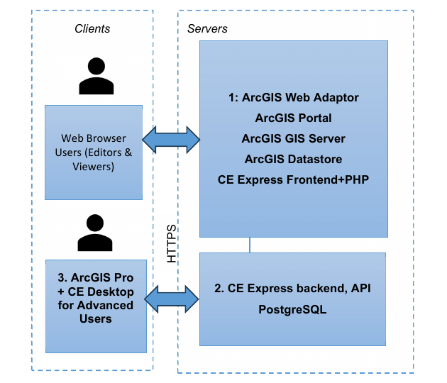
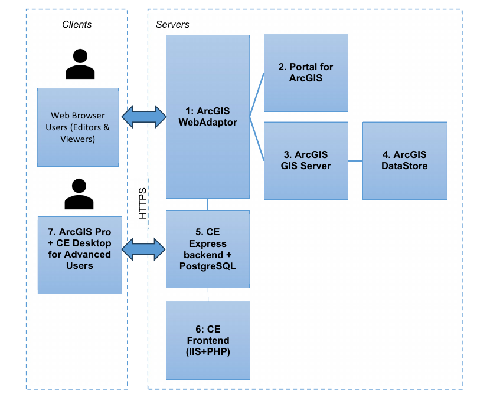

# Requirements, architecture and prerequisites

This chapter is for system administrators who install, configure, and maintain a CE Express Server deployment. It covers the minimal hardware and software requirements, example deployment architectures, and the third-party components (ArcGIS, PostgreSQL, PHP) that must be prepared before installing CE Express.

Note: requirements can vary significantly, depending on acceptable calculation time, task complexity, and the size of the database.

## Minimum hardware requirements

**Processor (CPU)**

| Level | Requirement |
|---|---|
| Minimum | 8 cores, hyperthreaded |
| Recommended | 16 cores |
| Optimal | 32 cores |

Optional requirements for GPU-accelerated calculations:

- GPU – any NVIDIA GPU with CUDA capabilities ([developer.nvidia.com/cuda-gpus](https://developer.nvidia.com/cuda-gpus))
- Driver version: 456.38 or later
- CUDA Toolkit 11.0 to 12.4 (recommended)

**Memory/RAM**

| Level | Requirement |
|---|---|
| Minimum | 16 GB |
| Recommended | 32 GB |
| Optimal | 64 GB or more |

**Storage**

| Level | Requirement |
|---|---|
| Minimum | 500 GB to 1 TB of free space |
| Recommended | 2 TB or more of free space on a solid-state drive (SSD) |

## Minimum requirements for software

Cellular Expert Express runs on Microsoft Windows Server 2016 or higher. It requires:

- ArcGIS Enterprise server 10.8.1 or later (11.5 supported), Standard or Advanced licence (Portal for ArcGIS included), with:
  - ArcGIS DataStore
  - WebAdapter for IIS to configure ArcGIS server
  - WebAdapter for IIS to configure ArcGIS portal
- IIS webserver (or Apache server) with SSL enabled: required for ArcGIS server and CE Express
- PHP server for IIS (or for Apache server), version 8.5 or less
- SQL database management system PostgreSQL (download from my.esri.com)
- Microsoft Visual C++ 2015-202x for ESRI products

## CE Express architecture examples

### ArcGIS Enterprise & CE Server-Express: on-premises deployment (simplified)



Technical requirements:

**1. Server for ArcGIS software** — ArcGIS Web Adaptor, ArcGIS Portal, ArcGIS GIS Server, ArcGIS Data Store (see Esri documentation for each), plus the CE Frontend (it could be installed together with the CE Express backend):

| Resource | Minimum | Recommended | Optimal |
|---|---|---|---|
| CPU | 1 core | 8 cores | 16 cores |
| RAM | 8 GB | 16 GB | 32 GB |
| Storage | 500 GB free space | 2 TB (Note 1) | — |

**2. CE Express** — CPU: 32 cores, RAM: 64 GB, Storage: 1+ TB (Note 2)

**3. ArcGIS Pro** — CPU: 4 cores, RAM: 16 GB, Storage: 1 TB. Optional requirements for GPU-accelerated calculations: any NVIDIA GPU with CUDA capabilities, driver version 456.38 or later, CUDA Toolkit 11.0 to 12.

### ArcGIS Enterprise & CE Server-Express: on-premises or cloud deployment



Technical requirements:

| # | Component | CPU | RAM | Storage |
|---|---|---|---|---|
| 1 | ArcGIS Web Adaptor | 1 core | 32 GB | 512 GB |
| 2 | ArcGIS Portal | 4 cores | 32 GB | 1 TB |
| 3 | ArcGIS GIS Server | 4 cores | 32 GB | 512 GB |
| 4 | ArcGIS Data Store | 1 core | 32 GB | 1+ TB (Note 1) |
| 5 | CE Server-Express | 16 cores | 64 GB | 1+ TB (Note 2) |
| 6 | CE Frontend (could be installed together with the ArcGIS Web Adaptor) | 1 core | 8 GB | 128 GB |
| 7 | ArcGIS Pro | 4 cores | 16 GB | 1 TB |

**Note 1:** ArcGIS Data Store shall contain the background maps, imaging, and other general GIS data. The required storage capacity is to be confirmed in consultation with the client and/or GIS data vendor.

**Note 2:** CE Server-Express shall store locally the GIS raster data (GeoTIFF) needed for calculations (DEM, DSM, DHM). The required storage capacity is to be confirmed in consultation with the client and/or GIS data vendor, and depends on the ultimate choice of GIS resolution: 0.2/0.5/1/2 m or lower. Likely some combination of resolutions may be logical (e.g. 1 m or below for urban/suburban areas, and 2 m or 5 m for rural), also possibly limiting the GIS data coverage to just the areas of interest.

## Prerequisites

Before installing CE Express, prepare the following third-party components.

### ArcGIS Server

Install ArcGIS for Server following the official installation guide: [steps to get ArcGIS for Server up and running](https://enterprise.arcgis.com/en/server/latest/install/windows/steps-to-get-arcgis-for-server-up-and-running.htm).

Use FQDN everywhere in the installation. ArcGIS Image Server is recommended but optional for publishing layers from CE Express.

### PostgreSQL

Install PostgreSQL following the guide: [installing PostgreSQL with the graphical installation wizard](https://www.enterprisedb.com/docs/supported-open-source/postgresql/installer/02_installing_postgresql_with_the_graphical_installation_wizard/windows/).

### PHP server

The PHP server can be installed and configured under IIS or under an Apache server. If PHP will use an Apache server, Apache must be configured to use a different HTTP port if IIS is also installed.

**Apache server** — the easiest way to download and install Apache and PHP is to install WAMP: [wampserver.aviatechno.net](http://wampserver.aviatechno.net/).

**IIS server** — download PHP from [windows.php.net/download](https://windows.php.net/download/) (installation instructions: [php.net manual](https://www.php.net/manual/en/install.windows.manual.php)).

After installing PHP for IIS, check the `php.ini` file under the PHP installation folder (example `C:\php`). There may be two files, `php.ini-development` and `php.ini-production`. Copy one of them to `php.ini`, then edit the new `php.ini` to configure it for CE Inventory3D.

Create the following missing folders under `C:\php`:

- `temp` (e.g. `c:\php\temp`)
- `logs`
- `sessions`

**PHP server configuration**

Open the `php.ini` configuration file with a text editor.

If another DBMS will be used, enable the matching PHP extensions. For PostgreSQL:

```ini
extension=pdo_pgsql
extension=pgsql
```

Other parameters in `php.ini` to be changed and checked:

```ini
log_errors = on
error_log = "c:\php\logs\php_errors.log"
upload_tmp_dir = "c:\php\temp"
session.save_path = "c:\php\sessions"
upload_max_filesize = 1024M
post_max_size = 1024M
memory_limit = 512M
session.gc_maxlifetime = 86400
extension=bz2
extension=curl
extension=fileinfo
extension=gd
extension=mbstring
extension=exif
```

At the end of `php.ini`, add rows for the installed PHP version (example is for PHP 8.5):

```ini
[SG]
extension=ixed.8.5ts.win
```

The extension file should be provided in the installation package, in `ceexp_db.zip`. Copy `ixed.8.5ts.win` under `c:\php\ext`.

Important `php.ini` parameters that can affect Inventory3D usage:

1. Parameters for the size of the files uploaded to the server, required for attachments:
   ```ini
   upload_max_filesize = 1024M
   post_max_size = 1024M
   ```
2. The maximum amount of memory a script may consume: `memory_limit = 512M`. This limit can affect the number of records — if a table has many records, increase the value.
3. The number of seconds after which session data is treated as "garbage" and potentially cleaned up. This should be larger than the Inventory3D configuration parameter `$sessionInactivityTimeout * 60` in the `conf.inc` file:
   ```ini
   session.gc_maxlifetime = 43500
   ```

**IIS configuration for PHP**

If IIS is installed on the server, double-check that the CGI feature is installed. If it isn't:

1. Open Server Manager and select **Manage > Add roles and features**.
2. Select role **Webserver (IIS) > Application Development**, and check **CGI**.
3. Click **Install**.

When the CGI role is installed, open IIS Manager and:

1. Select **Site > Handler Mappings > Add Module Mapping**:
   - Request Path — `*.php`
   - Module — FastCGIModule
   - Executable — `C:\php\php-cgi.exe`
   - Name — PHP
   - Click **Request Restriction**, select **File or Folder**, click **OK**.
   - Click **OK > Yes**.
2. Select **Site > Default Documents > Add**, and set `index.php`.
3. Restart the IIS server.

Continue with [Installation and server configuration](9-2-installation-and-server-configuration.md).
