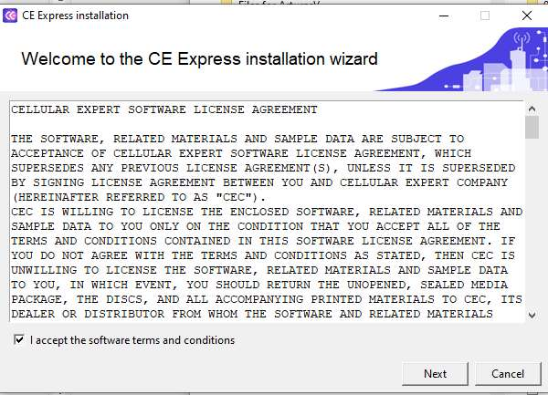
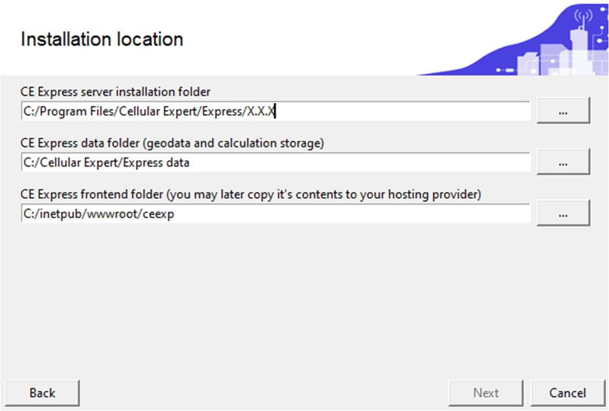
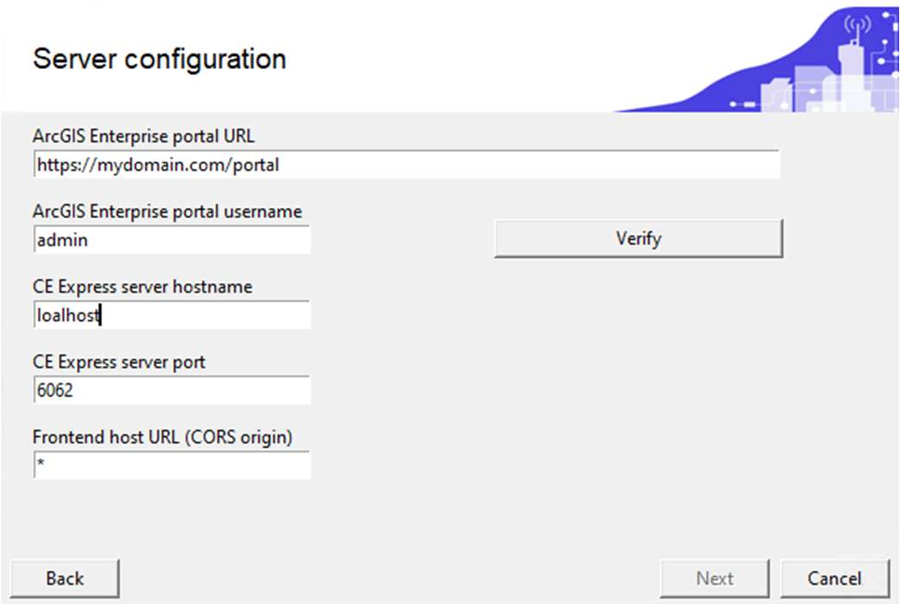
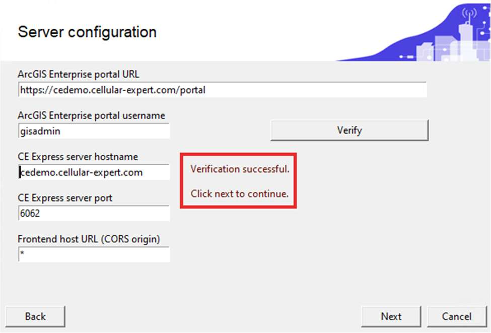
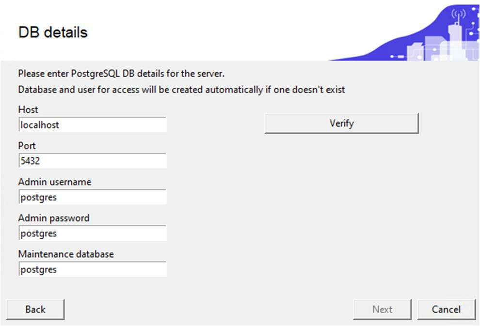
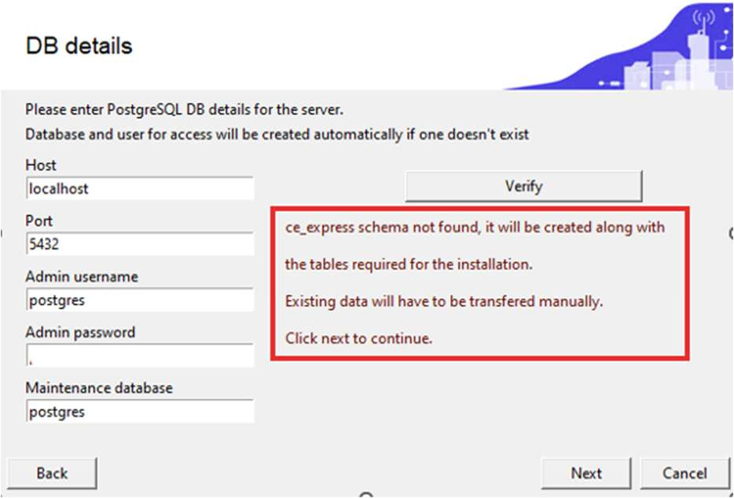
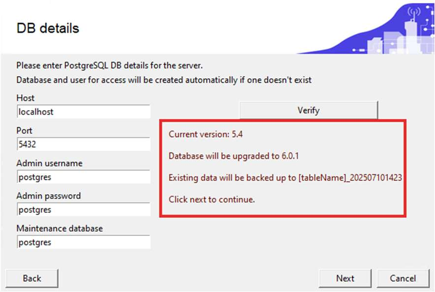
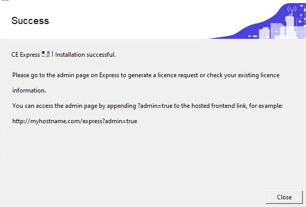

# Installation and server configuration

This chapter describes installing the Cellular Expert Server solution: the installation files, the setup wizard, and the server configuration and database steps needed to get CE Express running.

## Installation files

1. CE Express Setup file, provided as `CE_Express_7.2_winInstall(x64).exe`. It will automatically install:
   - CE Express DB schema
   - CE Express (frontend and backend)
   - CE Express demo data
2. Zip file (`ceexp_db.zip`) with the Cellular Expert Inventory3D web application (frontend).
3. Zip file (`ceexp_db_scripts.zip`) with the Cellular Expert Inventory3D installation DB scripts.

Before running the installer, complete the [prerequisites](9-1-requirements-architecture-and-prerequisites.md#prerequisites) (ArcGIS Server, PostgreSQL, PHP server).

## Install CE Express

Execute the provided CE Express installation file (`CE_Express_6.0_winInstall(x64).exe`) and follow the instructions displayed on screen.

### Accept the software terms and conditions

### Prepare installation folders

- The CE Express server installation and CE Express data folders can be left as default.
- The CE Express frontend folder can be set under the IIS webserver, usually `C:/inetpub/wwwroot`. The folder `ceexp` needs to be created manually if it doesn't already exist.

### Prepare the CE Express server configuration

- Enter the Portal for ArcGIS URL.
- Enter the Portal for ArcGIS username, which will be used to log in to CE Express. The same user will be assigned to the administrator group.
- Enter the CE Express server hostname. Use FQDN, or leave "localhost" if SSL is not enabled.
- Enter the CE Express server port. It can be changed if `6062` is occupied after verification.
- Enter the CE Express frontend host URL (`http(s)://[hostname]`), or leave the `*`.
- Click **Verify** and wait for the messages:

- Click **Next**.

### Prepare the CE Express server DB configuration

- Enter the hostname of the PostgreSQL database. If the database is on the same server, this can be left as "localhost".
- Enter the port of the PostgreSQL database. Usually `5432`.
- Enter the admin user of the PostgreSQL database. Usually `postgres`.
- Enter the password for the admin user of the PostgreSQL database.
- Enter the maintenance database of the PostgreSQL database. Usually `postgres`.
- Click **Verify** and wait for the messages:

If a database schema named `ce_express` already exists, you will be notified during the installation process. In that case, the existing tables will be copied with a `_date` postfix to avoid conflicts:

- Click **Next**. Installation will continue until it finishes:

### Check the installation and the CE Express licence

Check Windows services — there should be three CE Express services running (`CE_Express_Api`, `CE_Express_Calculation_Worker`, `CE_Express_Coordinator`):

Once the services are running, continue with [licensing the CE Express application](9-3-licensing-ssl-publishing-and-notifications.md).

## Next steps

With CE Express installed and its services running, continue with:

- [Licensing, SSL, publishing, and notifications](9-3-licensing-ssl-publishing-and-notifications.md) — obtain and apply the CE Express licence, optionally enable SSL, configure publishing to Portal for ArcGIS, and configure email notifications.
- [Inventory3D installation and database](9-4-inventory3d-installation-and-database.md) — create the Inventory3D database structure, install the Inventory3D web application, and register it in Portal for ArcGIS.
