# Inventory3D installation and database

CE Inventory3D is the tabular network-data web application delivered with CE Express (it is the engine behind CE Express's own [Network Data Management](../6-network-data-management.md) view). This chapter covers installing its web application and database, and the structure of that database.

## Creating the Inventory3D database structure and inserting initial data

1. Unzip the `ceexp_db_scripts.zip` file somewhere on the computer.
2. Start the PostgreSQL pgAdmin app (or another PostgreSQL database management tool).
3. Connect as the CE Express admin user provided during the [CE Express server DB configuration](9-2-installation-and-server-configuration.md#prepare-the-ce-express-server-db-configuration).
4. Open the DB schema (`ce_express`) prepared during CE Express setup.
5. Click **Open File** and select `ce7.2_inventory3d_create_table.sql`:

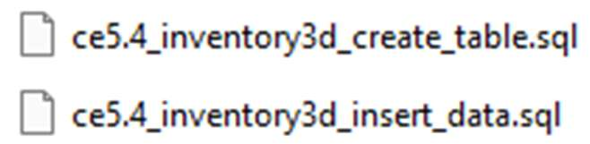

6. Execute the script to create the Inventory3D tables.
7. Click **Open File** and select `ce7.2_inventory3d_insert_data.sql`.
8. Execute the script to insert the Inventory3D initial data.

## Installing the Inventory3D web application package

To install the Inventory3D Express web application, copy the two folders from the provided zip file (`ceexp_db.zip`) to `C:\inetpub\wwwroot` if IIS will be used and a PHP server has been configured (or under `C:\wampXX\www` for an Apache server from the WAMP package). If IIS will be used, grant write permissions for the `IIS_IUSRS` user to the `ceexp_db` folder.

Example folder structure:

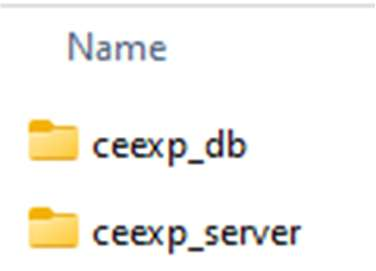

- The folder `ceexp_server` is required for Inventory3D logic.
- The folder `ceexp_db` is the Inventory3D folder described below.
- The `ceexp` folder is already created under `C:\inetpub\wwwroot` during CE Express setup.

## Registering the web application in Portal for ArcGIS

A web application must be registered in Portal for ArcGIS to allow ArcGIS login in Inventory3D.

1. Log in to Portal for ArcGIS and go to **Content**.
2. Select **New Item > Application**:

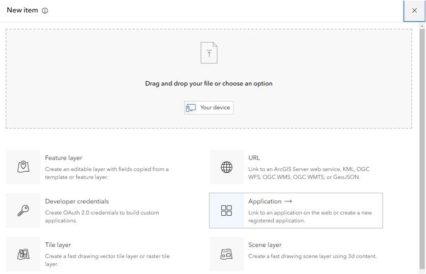

3. Select **Web mapping**. Enter the CE Express application URL, and click **Next**:

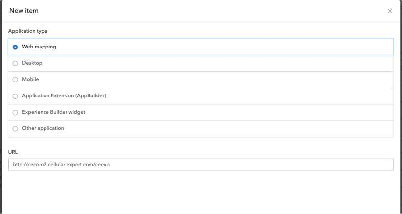

4. Name the new application, describe it, and click **Save**:

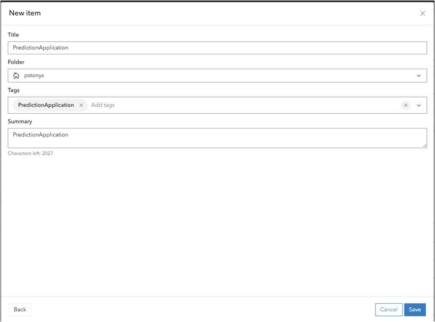

5. Choose **Settings**:

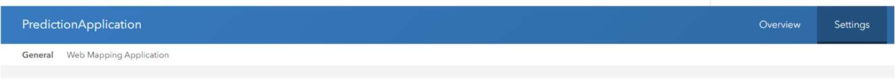

6. Go to **Credentials** and click **Register application**:

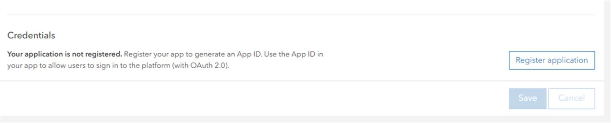

7. Add the CE Express Inventory3D URL into the **Redirect URLs** section, and click **Register**:

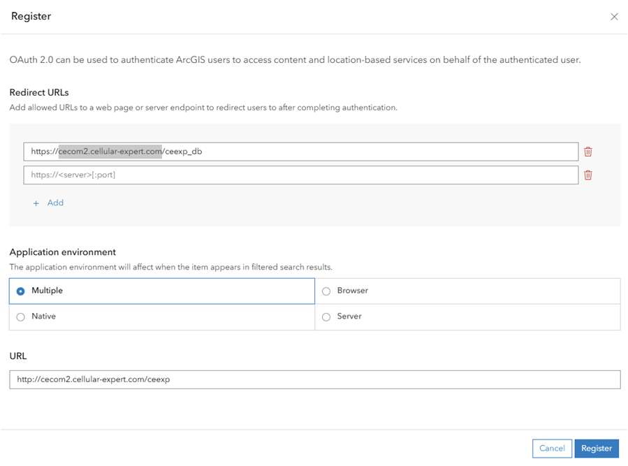

The **Client ID** shown after registration is required for the Inventory3D configuration (`$esriAppID` in `conf.inc`, below).

## CE Inventory3D folder structure

Example of the `ceexp_db` folder structure:

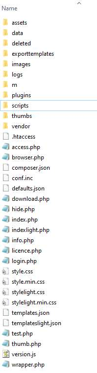

The main folders and files are:

- Folders `images` or `data` — for attachments and images taken from mobile devices.
- Folder `deleted` — for files that were attached to objects and have been removed by a user with the Remove Record tool.
- Folder `logs` — log files are created here for debugging; debugging is enabled in the `conf.inc` file.
- Folder `exporttemplates` — configuration files for [generating PDF reports](9-6-inventory3d-administration.md#generate-pdf-reports).
- Folder `plugins` — for CE Inventory3D plugins, like "Map".
- Folder `scripts` — for scripts that can be run manually by the administrator (see [Run script](9-6-inventory3d-administration.md#run-script)).
- Folder `temp` — temporary folder that can be cleaned periodically.
- Folder `thumbs` — for thumbnail image files.

**File `conf.inc`** — the configuration file. This file is very important and contains the credentials for the connection to the database, as well as other important information related to the database. The credentials can be changed according to the database server information:

```php
<?php
    //The value provided is used to issue the licence of use, after licencing it should not be modified.
    $inv3dLicenceFolder = "YOUR COMPANY";

    //The support e-mail address
    $inv3dSupportEmail = "support@cellular-expert.com";

    //The location of the inv3dserver folder, can be either absolute or relative
    $inv3dWebViewPath = "../ceexp_server/";

    //Database type, possible values 'mysql' and 'postgresql'.
    $inv3dDbType = "postgresql";

    //Hostname of the database to be used
    $inv3dDbHost = "localhost";
    //Port of the database to be used

    //Database and user credentials
    $inv3dDbUsername = "ce_app";
    $inv3dDbPassword = "ce";

    $inv3dAuthDbBase = "ce_app";
    $inv3dAuthDbTablePrefix = "ceauth_";

    $inv3dDbBase = "ce_app";
    $inv3dDbTablePrefix = "";

    $inv3dDbPort = 5432;
    $inv3dDbName = "ce";

    /*Relevant only for $inv3dDbType="postgresql"
    If PostgreSQL is used:
        $inv3dDbName = the name of the used database
        $inv3dAuthDbBase = the schema name of authentication tables
        $inv3dDbBase = the schema name of application info tables*/

    //Google Sheets API settings.
    $inv3dGSSource = "";    //sheet id
    $inv3dGSApiKey = "";
    $inv3dGSClientID = "";
    $inv3dGSSecret = "";

    $inv3dGSLogin = "";

    //The default level 0 table to open, if available; if not available the first level 0 table is used.
    $inv3dDefaultRoot = "cells";

    //When set to true the server will start to gather user statistics in 'usage_stats' table on the configured database.
    $inv3dUseStats = false;

    //Used by webview, when set to 'true' will report user login, logout and session timeout to instance specific stats.
    $inv3dUseUserStats = true;

    //Fields in the database defined as read only. A 2-dimensional array defining read-only field names.
    $inv3dReadOnlyFields = [];

    /*
    The folder structure and image naming schema used by the server.
    Possible values:
    'default'
    'Standard'
    'Siterra' - assumes each element has a 'Photo' field. All taken images are placed in 'images' folder and named as SITE_NAME.PHOTO.YYMMDD (COUNT).jpg
    'GoGo'
    */
    $inv3dImageNameSchema = 'Standard';

    //Setting this to true will enable server side application logging.
    $debug = true;

    /*
    !DEPRECATED, USE $enableExternalScripts
    Path to custom (batch) script that can be launched from webviews admin options. Insecure action!
    */
    $inv3dCustomScript = '';

    /*
    Enables or disables the use of external scripts ./scripts/ folder. If enabled the files in ./scripts/ folders are presented to admin users for execution when "Scripts" button is clicked.
    Still an insecure action.
    */
    $enableExternalScripts = true;

    //Allowed filename/path characters
    $pathCharacters="ABCDEFGHIJKLMNOPQRSTUVWXYZabcdefghijklmnopqrstuvwxyz0123456789_-# *ąčęėįšųūžĄČĘĮŠŲŪŽ";

    //Fonts path, PDF generation will look for unicode font files in the defined directory, if none is defined "C:/Windows/Fonts/" is used.
    $unicodeFontsPath = "C:/Windows/Fonts/";

    //The server side idle timeout in minutes
    $sessionInactivityTimeout = 720;

    //Client side inactivity warning interval in minutes
    $clientInactivityInterval = 715;

    //Default amount of records shown per page
    $defaultRecordsOnPage = 100;

    //If set to true will hide the object id field in mobile view
    $mobileHideObjectId = false;

    //Sets hostname of WAB application that Inventory listens to. This is required for security reasons by postMessage
    $wabApplicationAddress = "https://{YOUR_WEB_SERVER}/ceexp_react/";
    $webApplicationAddress = "";

    /*
    esriAPI, if defined allows to login using ArcGIS accounts.
    The username in ArcGIS portal tries to login to configured ArcGIS portal and if successful, tries to find the same username from webview database.
    */
    $esriAPI = "https://{YOUR_ArcGIS_PORTAL}/portal";

    //esri App id. Required for the above to work, a string defining a valid esri App id.
    $esriAppID = "XXXXXXXXXXXXXXXX";

    //Defines the notification update minimum interval
    $notifcationIntervalInMinutes = 1;

    $dateformat = "Y-m-d H:i:s";

    $notificationsAllowed = false;

    $useWorkAreaFilter = true;

    /* Dokobit token to be used */
    $dokobitToken = null;

    /* DokobitAPI URL to be used */
    $dokobitAPI = 'https://gateway-sandbox.dokobit.com';

    /* Allows to configure if plugin menu is shown or not */
    $pluginMenu = true;
?>
```

The main parameters to change for other installations are:

- `$inv3dLicenceHolder = "/*YOUR Company Name*/";`
- `$inv3dWebViewPath = "../ceexp_server/";` — the location of the Inventory3D server part.
- `$inv3dDbUsername = "ce_express";` — DB username provided during setup (server DB configuration step).
- `$inv3dDbPassword = "ce";`
- `$inv3dAuthDbBase = "ce_express";` — the schema name of authentication tables.
- `$inv3dAuthDbTablePrefix = "ceauth_";`
- `$inv3dDbBase = "ce_express";` — the schema name of application info tables.
- `$inv3dDbTablePrefix = "";`
- `$inv3dDbPort = 5432;` — PostgreSQL port.
- `$inv3dDbName = "ce";` — the name of the used database.
- `$wabApplicationAddress = "https://{your_web_server_url}/ceexp";` — URL to the CE Express frontend.
- `$esriAPI = "https://{ArcGIS Portal}/portal";` — URL to the ArcGIS portal.
- `$esriAppID = "[id]";` — Client ID of the web application created on the ArcGIS Portal for authentication (see [Registering the web application in Portal for ArcGIS](#registering-the-web-application-in-portal-for-arcgis) above).

Change database credentials as required to connect to the database. For the demo application, everything has already been prepared.

The parameter for external API calls configuration is `$externalAPIConf`. The file `conf_template.inc` has examples of possible configurations.

**File `defaults.json`** — sets default values for different fields. Changes in this file can also be entered with the webapp feature [Set defaults](9-6-inventory3d-administration.md#set-defaults). The file cannot be empty and must contain the characters `[]`.

## Information about the CE Express Inventory3D database

Simplified database schema for the CE Inventory3D system tables:

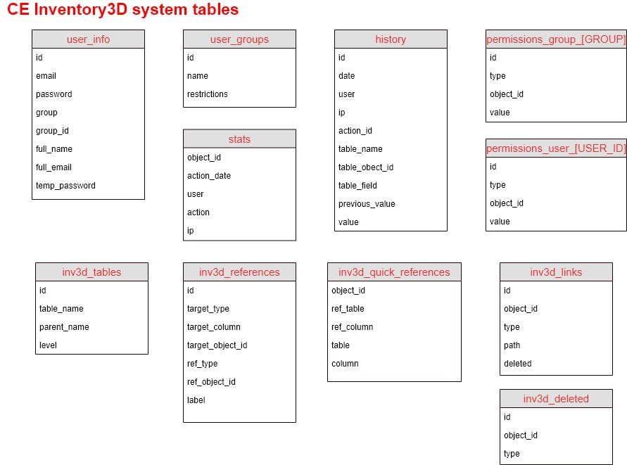

### Table `inv3d_tables`

The table `inv3d_tables` is required to describe all the tables used in CE Express Inventory3D. All correctly described tables will appear in the application. It has 3 columns:

- `id` — table identifier.
- `table_name` — the exact name of the table as described in the DB schema.
- `parent_name` — the exact name of the parent table. This field can also hold system keywords:
  - `inv3d_hidden` — the table is hidden for all users and visible only for the administrator.
  - `inv3d_system` — the admin can access the table from [System tables](9-6-inventory3d-administration.md#system-tables).
- `level` — the level at which the table appears in the application. A table with level `0` appears at the first level. A table with level `1` appears at the second level; its records are child records of a level-0 table, described in the `parent_name` column.

Example database schema:

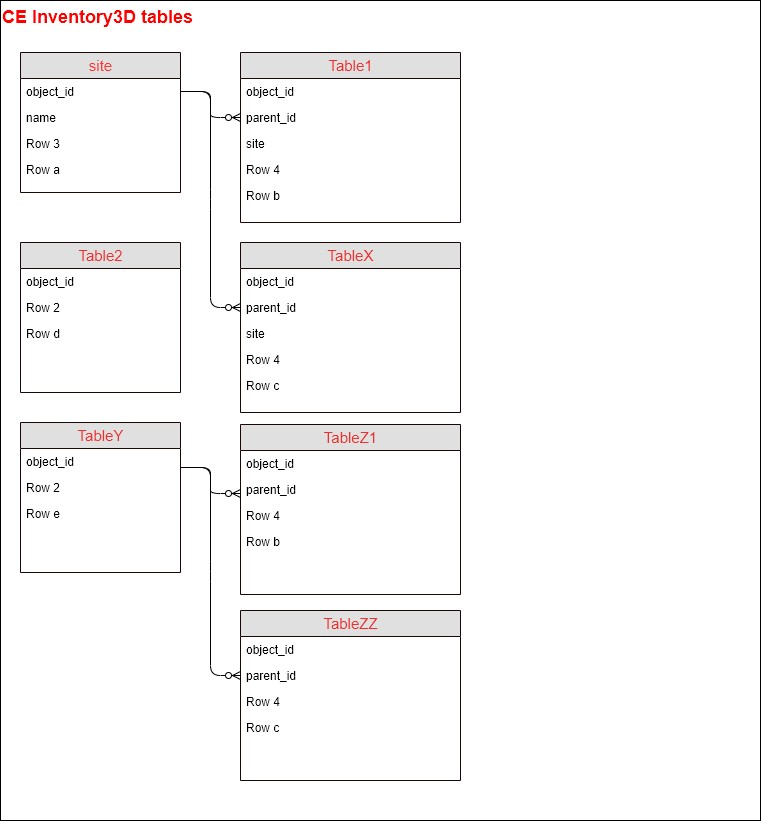

| id | table_name | parent_name | level |
|---|---|---|---|
| 1 | site | | 0 |
| 2 | Table1 | site | 1 |
| 3 | TableX | site | 1 |
| 4 | Table2 | | 0 |
| 5 | TableY | | 0 |
| 6 | TableZ1 | TableY | 1 |
| 7 | TableZZ | TableY | 1 |

### Table `inv3d_references`

Stores information about references between records. See the Inventory3D User Guide for the user-facing feature.

### Table `inv3d_quick_references`

Quick references let users open a referenced object in its own browser tab. The administrator describes quick references in this table using the web application (or directly in the database), comprising the rules between two tables and columns. See the Inventory3D User Guide's [Quick references](../../../inventory3d/v4.6/4-exploring-data.md) section for the user-facing behaviour.

### Table `inv3d_links`

Required for registering attachment paths to the database. Attachments are uploaded to the file system, but their metadata is stored in this table for application performance.

### Table `site`

Stores information about sites (locations). Important columns:

- `object_id` — unique site identifier, type Integer. Should be set as primary key and auto-increment if the webapp will be used to create new records.
- `name` — the site's name.

All other attributes, as many as required, are visible in the Inventory3D webapp.

### Child tables of `site` (example: `Table1`, `TableX`)

These are "child" tables of the `site` table (see the DB schema) and are visible only when a user opens a given site. Important columns:

- `object_id` — unique object identifier, type Integer. Should be set as primary key and auto-increment if the webapp will be used to create new records.
- `parent_id` — the site's `object_id`.
- `site` — the site's name.
- `date` — date the object was last checked. If the table has no `date` column, the "check object" feature is not active. Type should be Char (Varchar).

All other attributes, as many as required, are visible in the webapp.

### Separate level-0 table (example: `Table2`)

This can be a separate table, visible at the "site" level (level 0); there can be several such tables in the database. Important columns:

- `object_id` — unique object identifier. If this column does not exist, the data cannot be edited.
- `date` — if present, the table gets a "check" option for all its records.

All other attributes, as many as required, are visible in the webapp.

### Separate levelled tables (example: `TableY` and `TableZ`)

These tables are separate from `site`. `TableY` is a level-0 table, and `TableZ` is a level-1 table. Important columns:

- `object_id` — unique object identifier, critical for editing data in the webapp.
- `date` — if present, gives the table a "check" option.

Each Inventory3D table may also have the special attribute `photo_name` — the photo identifier, filled in automatically for photo attachments.

### Tables `user_info` and `user_groups`

Required to administer users and user groups, and to put restrictions on users by the administrator. See [User management](9-6-inventory3d-administration.md#user-management).

### Tables `permissions_user` and `permissions_group`

Required to administer users and user groups. Both tables are created automatically, but the administrator can add restrictions manually. Their use is described further in an upcoming CE Inventory3D release.

### Table `history`

Registers users' actions on the data. Administrators can check who performed changes and prepare reports about database usage. See [History](9-6-inventory3d-administration.md#history).

### Table `stats`

Registers all user logins, logouts, and session expirations, so administrators can follow who has used the web application.

### Table `deleted`

Keeps information about removed records. The administrator can "restore" a removed record simply by deleting its entry from this table. Alternatively, the administrator can permanently delete removed records using SQL scripts. See [Delete object permanently](9-6-inventory3d-administration.md#delete-object-permanently).

## Testing the CE Inventory3D webview installation

To log in to the application, use:

```text
http(s)://{your_web_server_url}/ceexp_db
```

The user receives the login window:

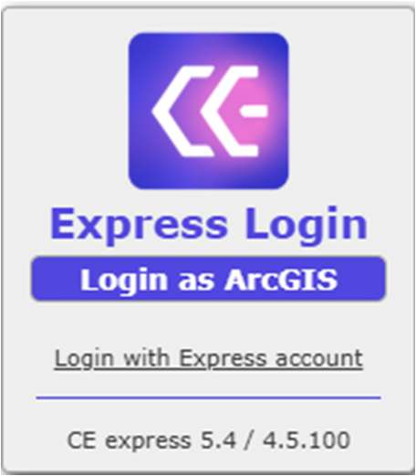

- **Login as ArcGIS** — logs in with an ArcGIS Enterprise account (registered in [Registering the web application in Portal for ArcGIS](#registering-the-web-application-in-portal-for-arcgis)). It gives access to the Network Data Management view for database management and the Map view for analysis and calculations. All ArcGIS users should be created and administered in Portal for ArcGIS.
- **Login with Express account** — logs in with a Cellular Expert Express account. It gives access only to the Network Data Management view; to reach the Map view, log in with an ArcGIS Enterprise account instead.

By default, "Login with Express account" is enabled, and the `admin` user's password is set to `admin_ce`. To change the password, or to see the other default users and passwords, use a database management tool (e.g. pgAdmin) and check the `ceauth_user_info` table.

Continue with [Preparing your own data](9-5-preparing-your-own-data.md) to load geodata, antennas, and cells into a workspace, or with [Inventory3D administration](9-6-inventory3d-administration.md) for the day-to-day administrator functions of the webapplication.
