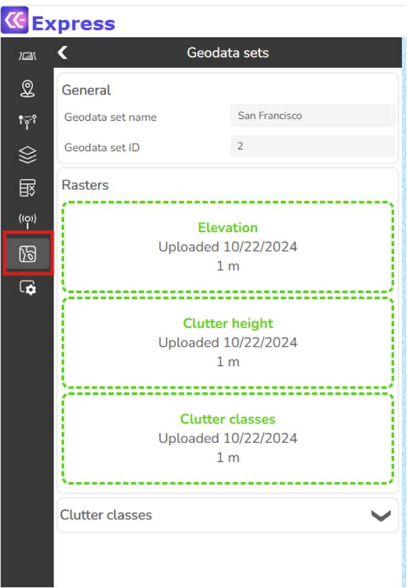
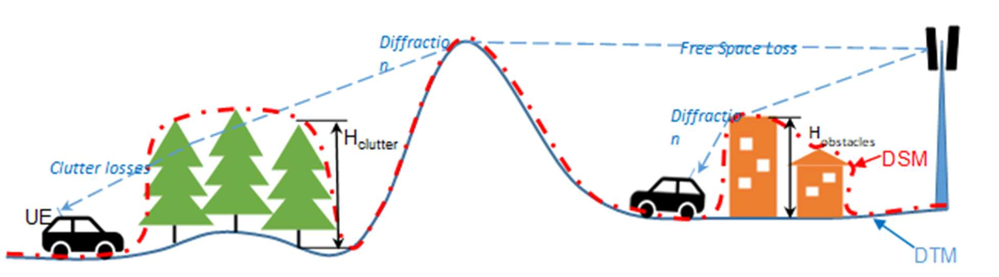
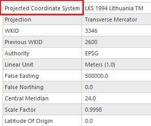
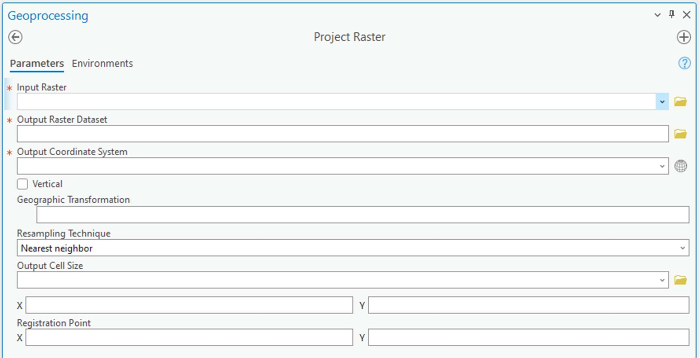
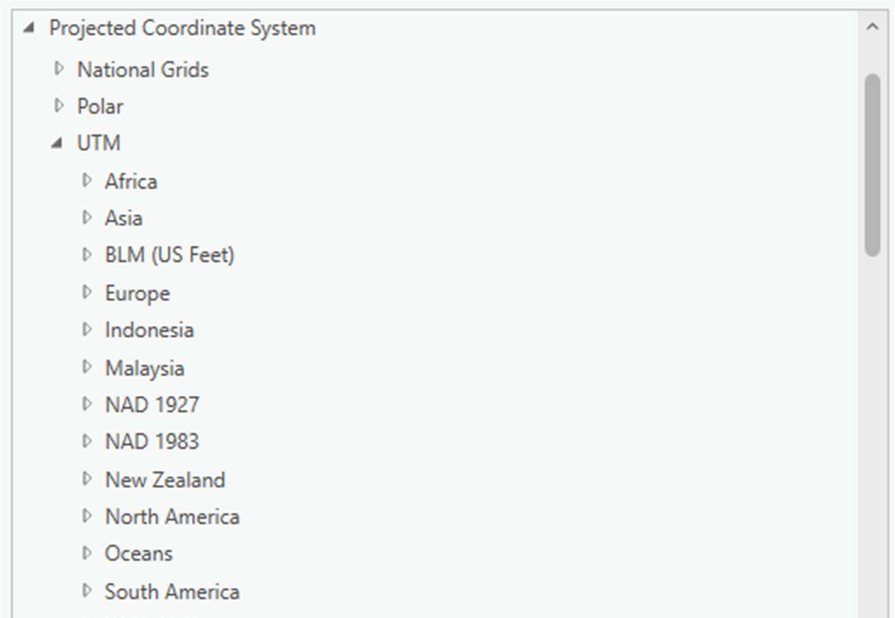
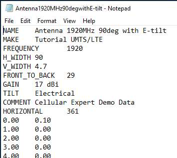
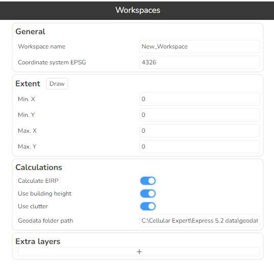

# Preparing your own data

This chapter describes the geographical data types used by Cellular Expert, and how an administrator prepares them, imports antennas, and creates a new workspace with its own data. For the full, current specification of file naming and raster requirements, see [Geodata Requirements](../../../geodata/v1.0/1-geodata-requirements.md) — this chapter focuses on the modelling background and the ArcGIS Pro preparation steps.

Once the raster and antenna data is prepared, upload it to CE Express using the [Geodata sets](../3-ce-express-tools/3-7-geodata-sets.md) tool:



## General information

The CE tools use three distinct GIS data layers to obtain high-precision modelling of radio wave propagation losses:

1. **Digital Terrain Model (DTM)**, also known as Digital Elevation Model (DEM), which describes the Earth's surface, i.e. the path terrain profile, in terms of ground elevation above uniform sea level.
2. **Clutter height layer**, delineating buildings and other such objects above the Earth's surface that may be principal impediments to radio wave propagation.
3. **Clutter class layer**, where each pixel defines the ID of the clutter class the area belongs to — usually derived from land use data. If building heights are included in the clutter height raster, the clutter classes raster must have building outlines separated into their own class ID.

These layers, and the corresponding path loss components — Free Space Loss (FSL), diffraction losses over terrain protrusions and obstacles, and clutter penetration losses — are illustrated below:



Sometimes a Digital Surface Model (DSM) is available instead of a DTM. A DSM is usually obtained by air-based scanning of the Earth's surface and cannot distinguish between the actual terrain level and the elevation added by buildings, forests, or other ground cover (well-known global DSM datasets include USGS SRTM-1/SRTM-3 and ASTER). A single DSM layer can technically be used as the path profile, but the path loss model will interpret it as a pure DTM — i.e. as if it were a homogeneous, radio-wave-impenetrable surface. The calculated path losses, and the resulting coverage predictions, will therefore be less precise than when using distinct DTM and clutter layers.

Raster resolution is another critical factor. Based on practical experience and the computational capabilities of the CE tools, the recommended resolution of path profiling data for modelling 4G/5G coverage is:

- **Rural areas:** preferably 10 m, at most 25 m.
- **Urban areas:** preferably 1 m, at most 5 m.

See [Geodata Requirements](../../../geodata/v1.0/1-geodata-requirements.md) for a visual comparison of coverage precision at different resolutions.

All three layers can be prepared using ArcGIS Pro tools: **Projection**, **Copy Raster**, and **Raster Calculator**.

## Geographic data

**Supported geographical data types:** only GeoTIFF is supported.

**Mandatory geographical data:** Elevation, or Digital Terrain Model (DTM), grid.

**Uploaded rasters have the following requirements:**

- Must be in a projected coordinate system.
- Coordinate system units must be meters.
- All rasters must have the same coordinate system.
- Raster resolution in the X and Y axes must match.

See [Geodata Requirements](../../../geodata/v1.0/1-geodata-requirements.md) for the mandatory file names (`elevation.tif`, `clutterClasses.tif`, `clutterHeight.tif`), NoData value, and pixel type.

### Reprojecting a raster in ArcGIS Pro

The elevation, clutter classes, and clutter height rasters must all share the same projected coordinate system. To check a raster's coordinate system, add it to an ArcGIS Pro project, right-click it, select **Properties**, then go to the **Source** tab **> Spatial Reference** and check the **Coordinate System Type** parameter:



If a raster is in a geographic coordinate system, or needs a different projection, use **Geoprocessing > Project Raster**:



In **Output Coordinate System**, specify the target coordinate system. It is recommended to use a UTM coordinate system under the WGS 1984 projection — you can find the appropriate UTM zone for your area on [this ArcGIS map](https://www.arcgis.com/apps/mapviewer/index.html?layers=b294795270aa4fb3bd25286bf09edc51):



Repeat this check for the clutter classes and clutter height rasters, choosing the same coordinate system as `elevation.tif`.

### Clutter classes grid

This raster provides land use information; the naming and classification of land use types may vary. An example is the [Sentinel-2 Land Cover dataset from the Living Atlas](https://livingatlas.arcgis.com/landcoverexplorer/), which is freely available worldwide. The clutter classes raster must use the same coordinate system as `elevation.tif` — reproject it with **Project Raster** if needed, as described above.

### Clutter height

Clutter height represents actual clutter heights, which override the default heights specified in the Clutter table. It requires the accompanying clutter classes raster and cannot be used independently.

A clutter height raster can be derived from a Digital Surface Model (DSM) raster and a Digital Terrain Model (DTM) raster using the ArcGIS Raster Calculator tool. Open **Geoprocessing > Spatial Analyst > Map Algebra > Raster Calculator** and use the formula:

```text
DSM - DTM
```

The calculation output is the difference between the DSM and DTM grids, representing the clutter heights. As with the other rasters, reproject the result to match `elevation.tif`'s coordinate system if needed.

## Antennas

Antenna pattern files, in `.txt` format, should be prepared and imported into the CE database using the CE Express antenna import tool (see [Antennas — Import Antennas](../3-ce-express-tools/3-6-antennas.md#3161-import-antennas)). CE Express uses the Planet antenna pattern format, consisting of a header, and horizontal and vertical records. Example:



After an antenna is imported, its antenna ID can be used in the `antenna_id` field of the [cells data table](../4-database-structure.md#42-cells).

## Create a new workspace in CE Express

Start CE Express and log in as a user with administrator rights (the user provided during setup). In the workspace list, click **+ new Workspace**:


Describe the workspace in the window that opens:



- **Workspace name** — must be the name of a newly created folder.
- **Geodata folder path** — must be the physical path of that newly created folder, on the server, containing the workspace's geodata rasters.
- **Coordinate system EPSG** — enter the coordinate system's code; `4326` is WGS84.
- **Extent** — the extent of the workspace.
- **Calculations** — enable or disable calculation parameters that are not used.
- **Extra layers** — add additional layers from other sources to be visualized in this new workspace.

The new workspace becomes visible to administrators immediately after creation. See [Workspaces](../3-ce-express-tools/3-1-workspaces.md) for the full set of workspace options available to all users (group, locked state, coordinate origin, transmitter/receiver height reference, feature naming schemes, etc.).

Antennas or cells for the new workspace can be loaded using the CE Express environment and tools, or via [Import CSV](9-6-inventory3d-administration.md#import-csv).
