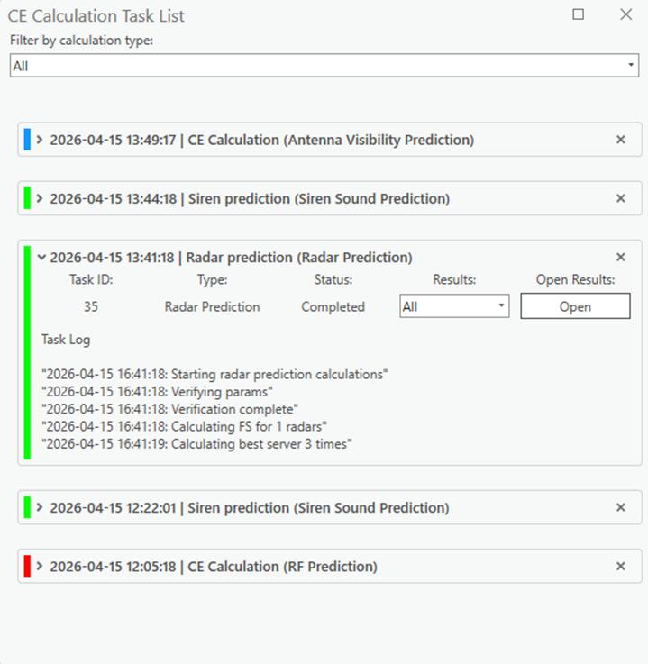
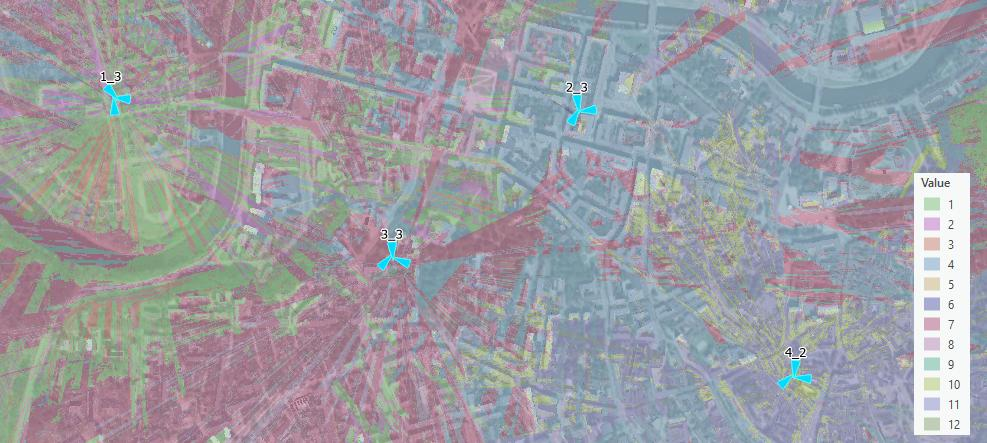

# Coverage Prediction Overview

> **Note:** This basic part (CE Calculation Task List, Visibility Prediction) appears in every module. RCP has a much larger set of coverage tools — see "RCP Coverage Tools".

### 9.1 CE Calculation Task List
All results of the prediction calculations can be found in the CE Calculation Task List tab. This includes
failed and successful calculations.
Click on the button to open the CE Calculation Task List dialogue.
The task list refreshes automatically once calculation tasks are run. The task status is indicated by three
main colors: blue (in progress), green (completed), and red (failed). Calculation tasks can be deleted
from the task list by clicking on the right side of the task. To open a result raster, select it from the results

dropdown and click Open Results. Filtering by calculation spans these types: Antenna Visibility Prediction,
EMF Calculation, Link Prediction, Model Tuning, Optimal Site Positions Calculation, RF Prediction, Siren
Sound Prediction, and Visibility Prediction.

### 9.2 Visibility Prediction
Visibility calculations refer to the determination of line-of-sight between transmitting and receiving
antennas, assessing whether any obstructions might impede direct signal transmission.
Visibility Prediction is a tool that calculates 4 different results:
• Minimum Receiver Height – the minimum height of a receiver that could be visible to the transmitter
• Line of Sight – confirms whether visibility exists between the receiver and transmitter with the
provided receiver height
• Clearance Height – the distance from the profile that is covered or is not covered.

• Best Server – the same calculation as for RF Prediction
Click the button to open the Visibility Prediction dialogue.
| Parameter | Description |
|---|---|
| Resolution | Cell size in meters |
| Max Radius | The maximum radius of the prediction |
| Receiver height | Receiver height above the ground. |
| Effective Earth Radius | Earth radius in kilometers, used for the calculations. |
| Layers to calculate | All present CE layers on which predictions can be performed |
| Template | A template that corresponds to the selected layers. When the layer changes the templates change as well. |
| Selected | Network objects that are present on the selected network layer. The visibility prediction will be performed on all of them. |
| Run Calculations | Starts the prediction calculation. |

Results:
• Minimum Receiver Height in meters
• Line of Sight – either visible (1) by the network objects or not (0)

• Clearance in meters

• Best Server

