# Data Management — Network Objects

> **Note:** Not every object type applies to every module — RCP: Cell, Site, Radar, Sirens, CPE, Repeater. RLP: Site, Link, Mesh Node. EMF / Indoor / Sound: mainly Cell and common objects.

## 7. Data Management

### 7.1 Network Objects
Cellular Expert network objects are:
Sites – represent the geographical location of a radio station. They are identified by the unique site ID and

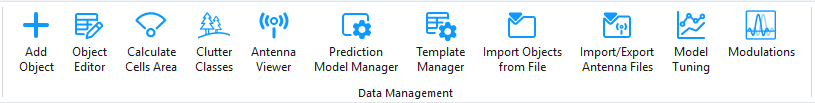

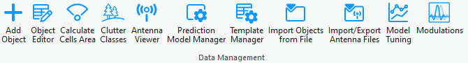
contain information about the geographical coordinates, ground altitude, and base height.
Cells – primary network object for prediction calculations. They denote the carrier list, equipment
information, height, and other common radio channel parameters.
Sirens – represent siren objects and their geographical locations on the map. They contain essential
parameters required for siren prediction.
Links – represents a radio connection between a transmitter and a receiver. It can be established between
the selected transmitter and receiver. The link operates at a fixed frequency from the transmitter's carriers
list. Available within CE RLP license.
Repeaters – represents the geographical location of a signal repeater. Only used for microwave point-to-
point network planning using Links.
CPE – stands for Customer Premises Equipment and represents the geographic location of a client.
Radar – represents the geographical location of a radiolocation system that uses radio waves to determine
the distance, angle, and radial velocity of objects.
With the data management tools located in the Data Management section, you can view and edit the
Cellular Expert network objects.
Note: most of these tools work only in editing sessions on the currently active workspace.

### 7.2 Add Object
New network objects can be created in several ways. They can be:
• Imported using the CE for ArcGIS Pro functionality
• Created with Cellular Expert tools from zero (define all parameters in the process)

• Created from templates

#### 7.2.1 Add Cell
The object represents both physical parameters (e.g., height, antenna, azimuth) and logical parameters
(e.g., bandwidth, frequency, technology). Essentially, it is similar to a Sector object but is referred to as a

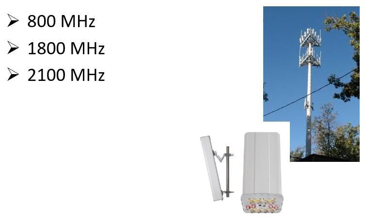

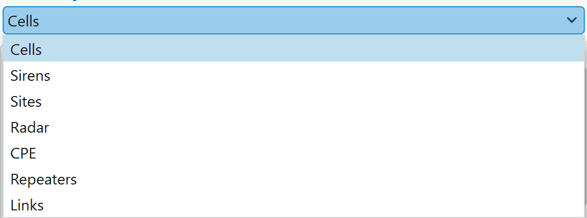
Cell and includes additional details about cell-specific parameters. This object serves as the primary
element for performing coverage predictions and supports various technologies, including 2G, 3G, 4G, 5G,
and WiFi. It is also utilized in critical networks like TETRA, APCO, P-25, and military applications to model
antenna coverage within a specific area.
For Mobile Operator case, if one sector has several carriers, as an example 3 carriers, then 3 cells should
be created in CE database. For example:

1. Choose the button from the toolbar and select Cells from the dropdown list.
Cell objects are used for prediction calculations.

1. Left-clicking on the map will define the location of the object. To define its direction, left-click a
second time in your preferred direction.
Add Object > Cell dialog will be filled with coordinates and parameters from default template, and azimuth

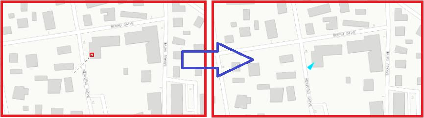

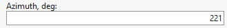

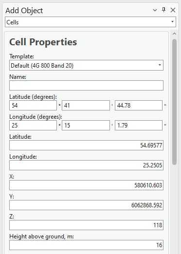
value based on defined direction on the map.
The Cell object can be created by entering exact coordinates in:
• Latitude (degrees) and Longitude (degrees) section.

• Latitude and Longitude
• X and Y (projected coordinate system)

2. The parameters can be changed at once by using different templates, which are available within

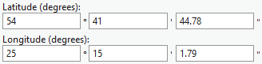

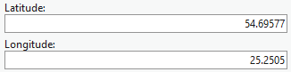

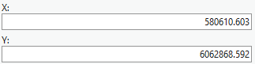

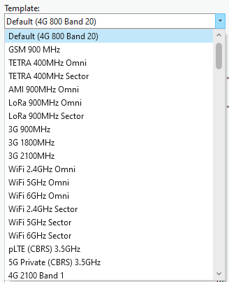

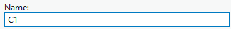
the default database. More about template management in 7.8. Template Manager topic.

3. Define Name for new Cell object.

4. Press Save Changes to save Cell object to the database.

| Parameter | Description |
|---|---|
| Save Changes | Creates the object with the given parameters. |
| Dismiss | Cancels object creation and closes the dialogue. |
| View Antenna | Opens the Antenna Viewer with the corresponding antenna patterns. |
Cell Properties
| Parameter | Description |
|---|---|
| Template | The template will fill all empty or not specified fields with default values that are not necessary for predictions. |
| Name | Cell identification. |
| Latitude (degrees) | Latitude degrees, minutes, and seconds Y type coordinate in the WGS 1984 geographical coordinate system. |
| Longitude (degrees) | Longitude degrees, minutes, and seconds X type coordinate in the WGS 1984 geographical coordinate system. |
| Latitude | Decimal degrees Y type coordinate in the WGS 1984 geographical coordinate system. |
| Longitude | Decimal degrees X type coordinate in the WGS 1984 geographical coordinate system. |
| X | Coordinate in the projected coordinate system. |
| Y | Coordinate in the projected coordinate system. |
| Z | 3D dimensions representing an object's height above sea level, used for visualizing objects in a 3D scene. |
| Ground Altitude | Ground elevation above sea level at the network object's location. |
| Azimuth | Cell direction from the North in degrees. |
| Site ID | Describes to which Site the Cell belongs. |
| Tilt | Mechanical tilt value. |
| Frequency | Frequency value in MHz. |

| Parameter | Description |
|---|---|
| Frequency Group | Used to divide calculations into parts. If the selection range includes two or more different frequency group values, the cells won’t be predicted together. |
| EIRP | This value is not editable. It represents the total radiated power for the Cell object and is automatically calculated based on Power, Miscellaneous Loss, Antenna Gain, and Tx MIMO. |
| Power | Power value in dBm. |
| Antenna Gain | The parameter can be left empty because the value will be taken automatically from the defined antenna. |
| Misc Loss | Miscellaneous loss value in dB. |
| Bandwidth | Value in MHz. Required for 4G and 5G technologies. For other technologies define the value as 0.015. |
| Noise Figure | Value in dB. Required for 4G and 5G technologies. |
Downlink Duplex Factor
Value range from 0 to 1. Required for Duplex mode TDD, which is applicable for 4G and 5G technologies,
and used for Downlink Throughput calculations. For example, if defined value is 0.7, then 70% of available
bandwidth will be dedicated to Downlink, and 30% - for Uplink.
| Parameter | Description |
|---|---|
| Subcarrier Spacing | Value in kHz. Required for 4G and 5G technologies. For other technologies define value 15. |
| Tx Mimo | Transmitter antenna count. Available values: 1, 2, 4, 8, 16, 32 and 64. |
| Rx Mimo | Receiver antenna count. Available values: 1, 2, 4, 8, 16, 32 and 64. |
Active Antenna Effect
The parameter is dedicated to smart antenna modeling. The default value is 0, but if massive MIMO is
used, a smart antenna effect can be included to lower the interference and boost throughput.
Recommended values:
• For MIMO 32x32 – value 6.
• For MIMO 64x64 – value 9.
Cell Load
The parameter is described in percentages and varies from 0 to 100. It describes how the cell is loaded.
The Cell load affects RSSI, RSRQ, and DL Throughput calculations. For example, if the Cell load is higher,
the DL Throughput is lower.
Network Name
Divides cells into networks. Helps to manage different technologies and frequencies in the project, and

automatically tracks changes for cells.
| Parameter | Description |
|---|---|
| Technology | Describes the technology of the network object. Possible values are 2G, 3G, 4G, and 5G. |
| Duplex Mode | Available values FDD or TDD. Required for 4G and 5G technologies. For other technologies define value FDD. |
| Antenna | Define antenna patterns for the Cell object. |
Carriers
Describes the carrier values and is used for 2G calculations: C/I interference and C/A interference. Values
must be written in []. If more than one value is defined, it must be separated by a comma, for example [1,
5]. If there is no carrier information, the value [] must be defined.
Select Model
Prediction model for Path Loss simulation.
7.2.1.1 Assign Cell object to Site
The cell object can be created on top of Site object, or near it with the possibility to assign Site ID value for

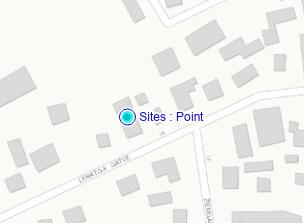
that Cell.
Open Add Cell function.
Moove mouse coursor on top of Site object, and mouse will be automatically snapped to that Site.

Define direction, similary as creating Cell object on empty location. Site ID will be automatically assigned

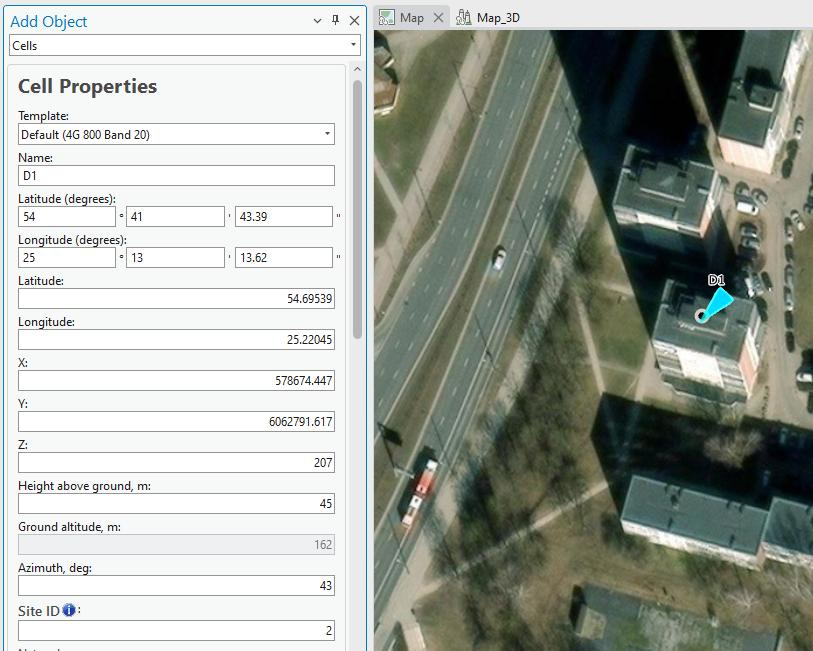
to this new Cell.
7.2.1.2 Add several Cells in same position.
Once Cell is created, do not close the dialog.
Simply change Name and Azimuth parameters (and if required, adjust other parameters), and press Save
Changes. New Cell object will be created on the same location.

Do it again, if you required additional Cell objects in the same location.
7.2.1.3 Add Cells on the corner of the buildings
The cells can be created on the corner of the building and assigned to the same Site.

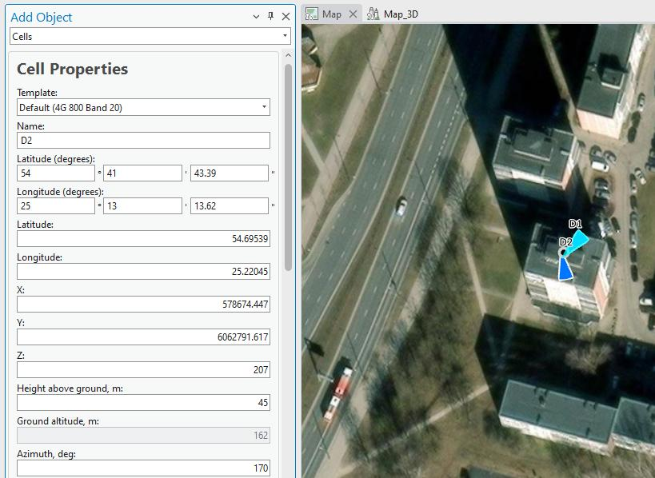

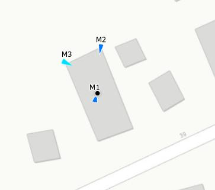

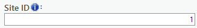
Site ID parameter should be adjusted for every cell.

#### 7.2.2 Add Site
The object represents Tower or Site location. It carriers several parameters, such as Site Name, coordinate

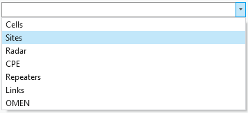

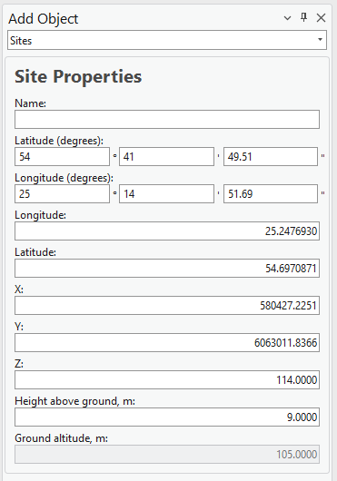
or height. It is used only in 4G or 5G carrier aggregation calculation, when Total Downlink Throughput is
calculated.

1. Choose the button from the toolbar and select Site from the dropdown list.

2. Define the location of the new Site by pressing the mouse left button on the map. The new Site
will be placed right in that location.

The Site object can be created by entering exact coordinates in:
• Latitude (degrees) and Longitude (degrees) section.
• Latitude and Longitude
• X and Y (projected coordinate system)

3. Define Site name and press Save Changes to save object to the database.
Save Changes
Creates the object with the given parameters.
Dismiss
Cancels object creation and closes the dialogue.
Site Properties
| Parameter | Description |
|---|---|
| Name | Site identification. |
| Latitude (degrees) | Latitude degrees, minutes, and seconds Y type coordinate in the WGS 1984 geographical coordinate system. |
| Longitude (degrees) | Longitude degrees, minutes, and seconds X type coordinate in the WGS 1984 geographical coordinate system. |
| Latitude | Decimal degrees Y type coordinate in the WGS 1984 geographical coordinate system. |
| Longitude | Decimal degrees X type coordinate in the WGS 1984 geographical coordinate system. |
| X | Coordinate in the projected coordinate system. |
Y

Coordinate in the projected coordinate system.
Z
3D dimensions representing an object's height above sea level, used for visualizing objects in a 3D scene.

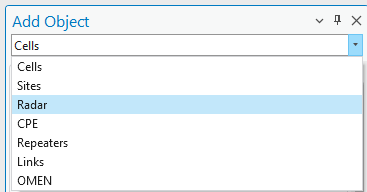

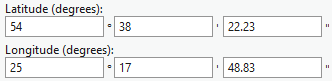

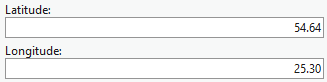
Height Above Ground
Object’s height above the terrain.
Ground Altitude
Ground elevation above sea level at the network object's location.

#### 7.2.3 Add Radar
Radar object is used for Radar Prediction tool, which does theoretical radar coverage calculations and
provides the results in the project.

1. Choose the button from the toolbar and select Radar from the dropdown list.

2. Define the location of the new Radar by pressing the mouse left button on the map. The new Radar
will be placed right in that location.
The Radar object can be created by entering exact coordinates in:
• Latitude (degrees) and Longitude (degrees) section.
• Latitude and Longitude

• X and Y (projected coordinate system)

3. Define Radar name and press Save Changes to save object to the database.

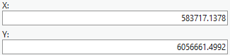
Save Changes
Creates the object with the given parameters.
Dismiss
Cancels object creation and closes the dialogue.

Radar Properties
| Parameter | Description |
|---|---|
| Template | The template will fill all empty or not specified fields with default values that are not necessary for predictions. |
| Name | Radar identification. |
| Latitude (degrees) | Latitude degrees, minutes, and seconds Y type coordinate in the WGS 1984 geographical coordinate system. |
system.

| Parameter | Description |
|---|---|
| Longitude (degrees) | Longitude degrees, minutes, and seconds X type coordinate in the WGS 1984 geographical coordinate system. |
| Latitude | Decimal degrees Y type coordinate in the WGS 1984 geographical coordinate system. |
| Longitude | Decimal degrees X type coordinate in the WGS 1984 geographical coordinate system. |
| X | Coordinate in the projected coordinate system. |
| Y | Coordinate in the projected coordinate system. |
| Z | 3D dimensions representing an object's height above sea level, used for visualizing objects in a 3D scene. |
| Height Above Ground | Object’s height above the terrain. |
| Ground Altitude | Ground elevation above sea level at the network object's location. |
| Azimuth | Direction from the North in degrees. |
| View Angle | Visible field (vertical angle) of the radar in degrees. |
| Template | The template will fill all empty or not specified fields that are necessary for predictions. |
| Frequency | Frequency value in MHz. |
| Tilt | Mechanical tilt value. |
| Power (Optional) | Power value in dBm. |
| Antenna Gain (Optional) | Antenna gain value from the applied antenna. |
| Misc Loss (Optional) | Miscellaneous loss value in dB. |
EIRP
Total cell power in dBm. This parameter is used for the calculations. The value can be generated from the
power, antenna_gain, and misc_loss values automatically, or written directly leaving the power,
antenna_gain, and misc_loss fields empty.

Prediction Model
Prediction model for Path Loss simulation.

#### 7.2.4 Add Sirens
A Siren object in the software represents a sound-emitting device used for warning and alerting purposes.

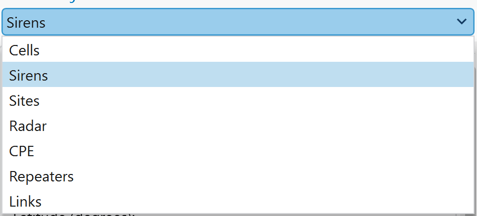
The software calculates the siren's sound level based on parameters such as power, frequency,
environmental conditions, and distance. It allows users to analyze sound propagation, ensuring effective
coverage for emergency and safety applications.

1. Choose the button from the toolbar and select Sirens from the dropdown list.

2. Left-clicking on the map will define the location of the object. To define its direction, left-click a
second time in your preferred direction.
The Siren object can be created by entering exact coordinates in:
• Latitude (degrees) and Longitude (degrees) section.
• Latitude and Longitude
• X and Y (projected coordinate system)

3. Define Siren name and press Save Changes to save object to the database.
| Parameter | Description |
|---|---|
| Save Changes | Creates the object with the given parameters. |
| Dismiss | Cancels object creation and closes the dialogue. |
| View Antenna | Opens the Antenna Viewer with the corresponding antenna patterns. |
Siren Properties
Template
The template will fill all empty or not specified fields with default values that are not necessary for

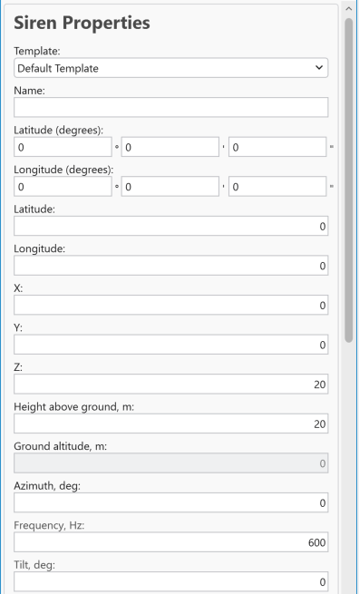

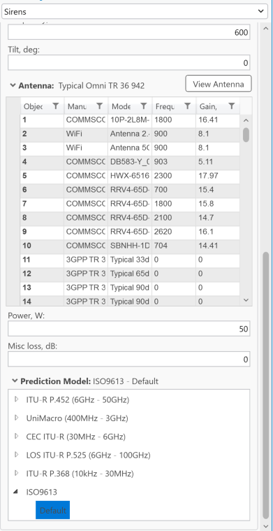
predictions.
Name
Siren identification.

| Parameter | Description |
|---|---|
| Latitude (degrees) | Latitude degrees, minutes, and seconds Y type coordinate in the WGS 1984 geographical coordinate system. |
| Longitude (degrees) | Longitude degrees, minutes, and seconds X type coordinate in the WGS 1984 geographical coordinate system. |
| Latitude | Decimal degrees Y type coordinate in the WGS 1984 geographical coordinate system. |
| Longitude | Decimal degrees X type coordinate in the WGS 1984 geographical coordinate system. |
| X | Coordinate in the projected coordinate system. |
| Y | Coordinate in the projected coordinate system. |
| Z | 3D dimensions representing an object's height above sea level, used for visualizing objects in a 3D scene. |
| Height Above Ground | Object’s height above the terrain. |
| Ground Altitude | Ground elevation above sea level at the network object's location. |
| Azimuth | Direction from the North in degrees. |
| Frequency | Frequency value in Hz. |
| Tilt | Mechanical tilt. |
| Antenna | Antenna name for Siren object. |
| Power | A power value in W. |
| Misc loss | Miscellaneous loss value in dB. |
| Prediction Model | Only ISO9613 can be applied to calculate sound loss for the siren. 7.2.5 Add CPE The object represents customer locations. It carrries information about customer location, name, height or |

installed antenna.

1. Choose the button from the toolbar and select CPE from the dropdown list.

2. Left-clicking on the map will define the location of the object. To define its antenna direction, left-

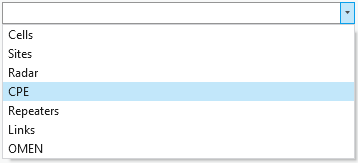
click a second time in your preferred direction.
The CPE object can be created by entering exact coordinates in:
• Latitude (degrees) and Longitude (degrees) section.
• Latitude and Longitude
• X and Y (projected coordinate system)

3. Define CPE name and press Save Changes to save object to the database.
Save Changes
Creates the object with the given parameters.
Dismiss
Cancels object creation and closes the dialogue.
View Antenna

Opens the Antenna Viewer with the corresponding antenna patterns.
CPE Properties
Name
CPE identification.
Latitude (degrees)
Latitude degrees, minutes, and seconds Y type coordinate in the WGS 1984 geographical coordinate

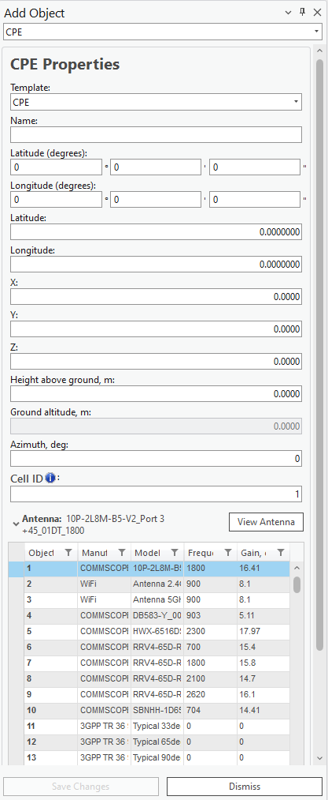
system.

| Parameter | Description |
|---|---|
| Longitude (degrees) | Longitude degrees, minutes, and seconds X type coordinate in the WGS 1984 geographical coordinate system. |
| Latitude | Decimal degrees Y type coordinate in the WGS 1984 geographical coordinate system. |
| Longitude | Decimal degrees X type coordinate in the WGS 1984 geographical coordinate system. |
| X | Coordinate in the projected coordinate system. |
| Y | Coordinate in the projected coordinate system. |
| Z | 3D dimensions representing an object's height above sea level, used for visualizing objects in a 3D scene. |
| Height Above Ground | Object’s height above the terrain. |
| Ground Altitude | Ground elevation above sea level at the network object's location. |
| Azimuth | Direction from the North in degrees. |
| Cell ID | Describes to which Cell the CPE point belongs. |
| Template | A template that will fill all empty or not specified fields that are necessary for predictions. |
| Antenna | Antenna name for CPE location. |
| Throughput | The speed at which data is transferred. Measured in Mb/s. |
| Status | Current status of the network object. |
| Notes | Additional information for network predictions can be noted here. |

#### 7.2.6 Add Repeater
A repeater is a device used to extend wireless coverage by amplifying and retransmitting signals between
a base station and mobile devices. In 2G technology, repeaters help enhance signal strength in areas with
weak coverage, such as remote or obstructed locations. For multipoint applications, repeaters can support
communication across multiple user devices within their range, ensuring consistent connectivity and
improved service quality.

4. Choose the button from the toolbar and select Repeater from the dropdown list.

5. Left-clicking on the map will define the location of the object. To define its antenna direction, left-

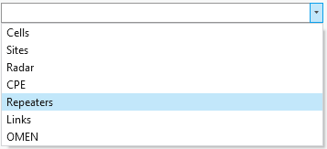
click a second time in your preferred direction.
The Repeater object can be created by entering exact coordinates in:
• Latitude (degrees) and Longitude (degrees) section.
• Latitude and Longitude
• X and Y (projected coordinate system)

6. Define Repeater name and press Save Changes to save object to the database.

| Parameter | Description |
|---|---|
| Save Changes | Creates the object with the given parameters. |
| Dismiss | Cancels object creation and closes the dialogue. |
| View Antenna | Opens the Antenna Viewer with the corresponding antenna patterns. |

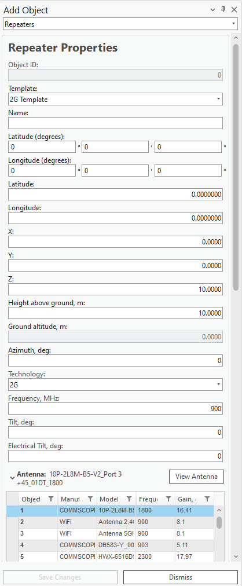

Repeater Properties
| Parameter | Description |
|---|---|
| Template | The template will fill all empty or not specified fields with default values that are not necessary for predictions. |
| Name | Repeater identification. |
| Latitude (degrees) | Latitude degrees, minutes, and seconds Y type coordinate in the WGS 1984 geographical coordinate system. |
| Longitude (degrees) | Longitude degrees, minutes, and seconds X type coordinate in the WGS 1984 geographical coordinate system. |
| Latitude | Decimal degrees Y type coordinate in the WGS 1984 geographical coordinate system. |
| Longitude | Decimal degrees X type coordinate in the WGS 1984 geographical coordinate system. |
| X | Coordinate in the projected coordinate system. |
| Y | Coordinate in the projected coordinate system. |
| Z | 3D dimensions representing an object's height above sea level, used for visualizing objects in a 3D scene. |
| Height Above Ground | Object’s height above the terrain. |
| Ground Altitude | Ground elevation above sea level at the network object's location. |
| Azimuth | Direction from the North in degrees. |
| Technology | Describes the technology of the network object. Possible values are 2G, 3G, 4G, and 5G. |
| Frequency | Frequency value in MHz. |
| Tilt | Mechanical tilt in telecommunications repeaters is the physical angling of the antenna to optimize signal coverage. |
| Electrical Tilt | Electrical tilt in a repeater refers to the electronic adjustment of an antenna's vertical radiation pattern to optimize network coverage and reduce interference. |

| Parameter | Description |
|---|---|
| Antenna | Antenna name for Repeater object. |
| Thresholds 1, 2, 3 | The threshold of signal strength. The three parameters must be written in decreasing order. If an antenna threshold is less than one of the threshold parameters, then the next threshold parameter will be evaluated. |
| Power 1, 2, 3 | A power that is assigned to cells based on the repeater thresholds and cell signal strength. When the cell’s signal strength is categorized the power of the repeater will be assigned as well. |
| Threshold | Power maximum threshold. |
| Misc loss (Optional) | Miscellaneous loss value in dB. |
| Bandwidth | Value in MHz. Required for 4G and 5G technologies. For other technologies define the value as 0.015. |
| Subcarrier Spacing | Value in kHz. Required for 4G and 5G technologies. For other technologies define value 15. |
| Tx Mimo | Transmitter antenna count. Available values: 1, 2, 4, 8, 16, 32 and 64. |
| Rx Mimo | Receiver antenna count. Available values: 1, 2, 4, 8, 16, 32 and 64. |
| Prediction Model | Lets the user select which prediction model and configuration should be used for calculations. |
