# Data Management — Radio / Frequency Data

> **Note:** RLP-specific — Radios, Spectrum Masks, and Frequency Plans are used for radio link planning.

### 7.10 Radios
Click the button to open the Radios Dockpane. The dock pane's Manager tab includes the
functionality for creating new radios and deleting, editing, or duplicating existing ones. The Import tab allows

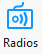

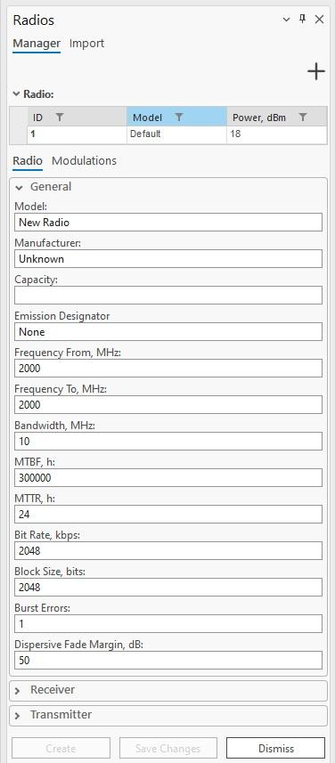

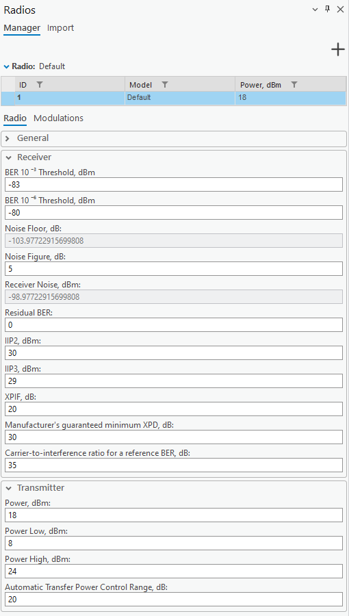
for importing new antennas from supported format (.raf) files.
Radios are specific to the CE for the ArcGIS Pro RLP license. The tool enables you to create radios that
will be necessary to create a link and later be used in calculations.

#### 7.10.1 Manager Tab
By clicking an already existing radio from the table displayed at the top of the dockpane, you can edit its
properties and save them. Right-clicking an already existing radio displays a context menu with options
Duplicate and Delete, for respectively either creating a copy of the selected antenna or deleting it.

Initialize a new radio with default parameters.
| Parameter | Description |
|---|---|
| Save Changes | Save changes to the radio that is currently being edited. |
| Create | Create a new radio with the specified parameters. |
| Dismiss | Cancels all changes made to the radio and closes the dock pane. |
Radio Properties: General
| Parameter | Description |
|---|---|
| Model | Radio identification or name. |
| Manufacturer | Radio manufacturer (company or entity). |
| Capacity | Maximum data throughput of the radio. |
| Emission Designator | Code describing the characteristics of the radio emission, including modulation type, signal nature, and bandwidth. |
| Frequency From, MHz | The lower limit of the frequency range for the radio communication channel, measured in MHz. |
| Frequency To, MHz | The upper limit of the frequency range for the radio communication channel, measured in MHz. |
| Bandwidth, MHz | Range of frequencies within which the radio operates, value in MHz. Required for 4G and 5G technologies. |
| MTBF, h | Mean time between failures: average time (in hours) between successive failures of the radio system during normal operation, indicating reliability. |
| MTTR, h | Mean time to repair: average time (in hours) required to repair the radio system after a failure occurs, indicating maintainability. |
| Bit Rate, kbps | Number of bits transmitted per second over the communication channel, measured in kbps. Block Size, bits Number of bits grouped as a single unit of data for transmission or processing. |
| Burst Errors | Sequences of errors occurring in clusters or bursts, typically caused by noise or interference affecting multiple consecutive bits. |
multiple consecutive bits.

Dispersive Fade Margin, dB
Additional signal strength required to overcome dispersion and fading effects in the radio communication
system, measured in dB.
Radio Properties: Receiver
BER 10-3 Threshold, dBm
Receiver sensitivity threshold for BER = 10-6.
BER 10-6 Threshold, dBm
Receiver sensitivity threshold for BER = 10-3.
Noise Floor, dB
Refers to the minimum power level of unwanted noise or interference at the receiver at the base station.
Noise Figure, dB
Measure of the degradation of the signal-to-noise ratio (SNR) as a signal passes through a radio component
or system. Value in dB. Required for 4G and 5G technologies.
Receiver Noise, dBm
The sum of Noise Floor and Noise Figure.
Residual BER
The remaining bit error rate after all error correction methods have been applied.
IIP2, dBm
Second-order intercept point: indicates the linearity of a radio receiver's resistance to second-order
intermodulation distortion, measured in decibels relative to 1 milliwatt (dBm).
IIP3, dBm
Third-order intercept point: indicates the linearity of a radio receiver's resistance to third-order
intermodulation distortion, measured in decibels relative to 1 milliwatt (dBm).
XPIF, dB
Cross-polarization interference factor: interference caused by signal components with orthogonal
polarization states, indicating the impact of cross-polarization on system performance, expressed in
decibels (dB). The default value is 20. The value should be higher than 0 for rain ITU fading calculations to
work.
Manufacturer’s guaranteed minimum XPD, dB
The manufacturer’s guaranteed minimum cross-polar discrimination, expressed in decibels (dB). The
default value is 30.
Carrier-to-interference ratio for a reference BER, dB
Carrier-to-interference ratio for a reference bit error rate, expressed in decibels (dB). The default value is: **35.**
Radio Properties: Transmitter

| Parameter | Description |
|---|---|
| Power, dBm | Power value in dBm. |
| Power Low, dBm | The minimum power level at which the radio transmits, measured in decibels relative to 1 milliwatt (dBm). |
| Power High, dBm | The maximum power level at which the radio transmits, measured in decibels relative to 1 milliwatt (dBm). |
| Automatic Transfer Power Control Range, dB | The range over which the radio can automatically adjust its transmission power, measured in dB. |

Selecting the Modulations tab allows you to assign a modulation to a radio. The adaptive modulations are
displayed in the table by their ID and technology name. The modulations available for assigning to a radio

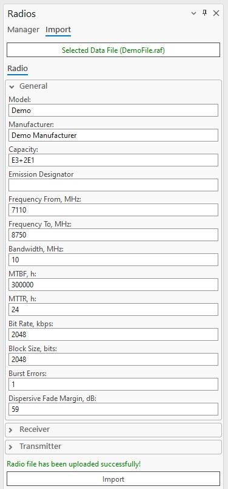
are listed in a dropdown below the table. The selected modulation can be assigned to a radio by pressing
the button. Several modulations can be assigned to a radio, and the parameters of the assigned
modulations can be edited.

#### 7.10.2 Import Tab
Selecting the Import tab displays a new window with the Select Data File button for importing radio data
files. RAF files are supported. Once a supported radio file is selected, its parameters can be edited
(General, Receiver, and Transmitter categories). The text “Radio file has been uploaded successfully”
appears at the bottom of the dock pane, and the Import button becomes enabled. Clicking the Import button
adds the radio to the database, and it also appears in the Manager tab.

#### 7.10.3 Export Tab
Radios can be exported to the RAF data files version 4 or 5. Depending on the selected file version, the
structure of the data will be different.

### 7.11 Spectrum Masks
Click the button to open the Spectrum Masks dialogue.
Spectrum Masks are specific to the CE for ArcGIS Pro RLP license. The tool enables you to create spectrum

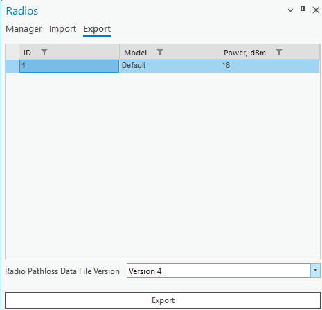

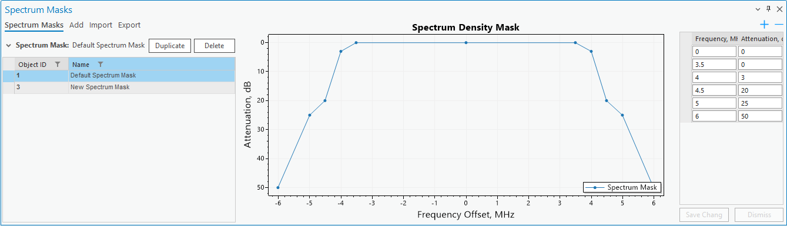
masks that will be necessary to be used in calculations.

#### 7.11.1 View Spectrum Masks
You can view, edit, and delete all spectrum masks by navigating to the Spectrum Masks tab on the
Spectrum Masks dockpane. By selecting a spectrum mask you can view its properties, change them, and
delete the spectrum mask altogether. Changes in the mask point values will be reflected in the graph.
Delete

Delete the selected spectrum mask.
Duplicate
Create a copy of the selected spectrum mask.
When you create a spectrum mask, you can see its visual representation as well as the values of each

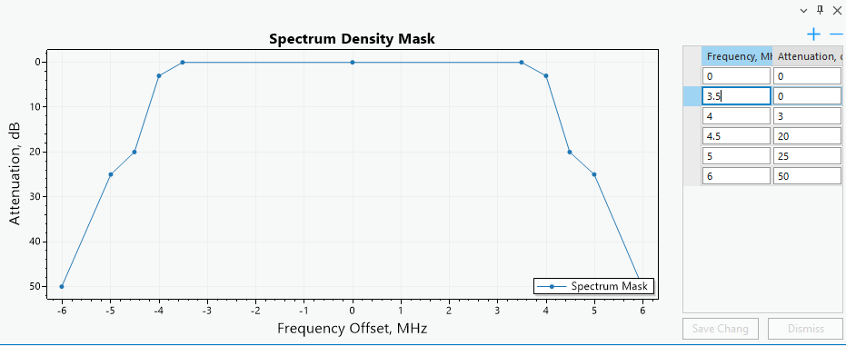

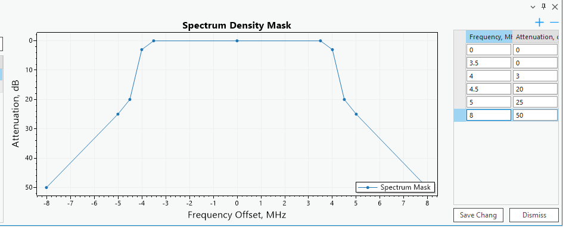

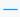

spectrum mask point (frequency and attenuation).
You can change any values of these points and those changes will be reflected in the graph.
Deletes the currently selected mask point. If none are selected, does nothing.
Adds a new mask point to the spectrum mask.

| Parameter | Description |
|---|---|
| Save Changes | Save changes made to the current spectrum mask. |
| Dismiss | Cancel any changes made to the current spectrum mask. 7.11.2 Add Spectrum Mask You can add a spectrum mask by selecting the Add tab located on the Spectrum Masks dockpane. |
| Add Spectrum Mask | Creates a new spectrum mask. |
Spectrum Mask Parameters
| Parameter | Description |
|---|---|
| Mask Name | Spectrum mask identification. |
| Bandwidth | Value in MHz. Required for 4G and 5G technologies. |
| Number of Mask Points | The number of points the resulting spectrum mask will have. 7.11.3 Import Spectrum Mask You can add a spectrum mask by importing it from a JSON format file. |

The selected spectrum mask can be visually inspected before importing, by clicking on the selection of the

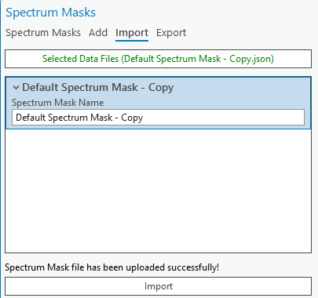

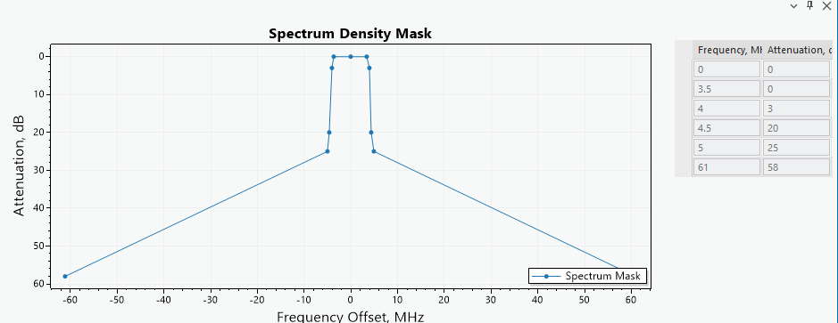

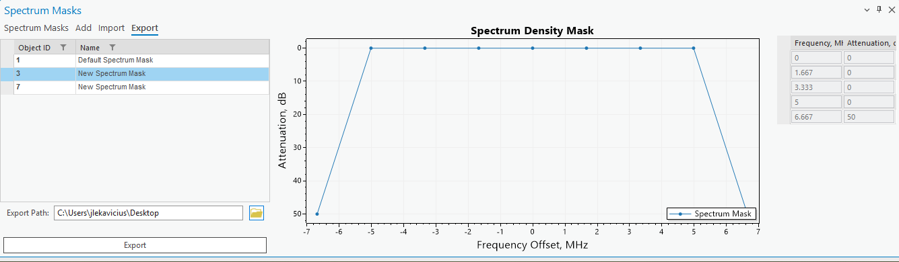
spectrum mask in the container.

#### 7.11.4 Export Spectrum Mask
Spectrum Masks can be exported to JSON file format.

### 7.12 Frequency Plans
Click the button to open the Frequency Plans dialogue.
Frequency Plans are specific to the CE for ArcGIS Pro RLP license. The tool enables you to create
frequency plans that will be necessary to create a link and later be used in calculations.

#### 7.12.1 Add Frequency Plan
You can add a frequency plan by selecting the Add tab located on the Frequency Plans dockpane.
Add Frequency Plan
Adds a new frequency plan.
Frequency Plan Parameters
| Parameter | Description |
|---|---|
| Frequency Plan Name | Frequency Plan identification |
| Low, Center, High Frequency | Frequencies in MHz. |
| Carrier Spacing, MHz | The frequency separation between adjacent carrier frequencies in a communication system, ensuring non- interference between carriers. |
| Duplex Spacing, MHz | Frequency separation between the transmit and receive bands in a two-way communication system. |
Carriers
Specific frequencies or waves used to modulate and transmit information over a communication medium.
Once you create a frequency plan, you will be able to see its graphical representation as well as the
frequencies of each frequency plan’s carrier. Select entries in the carrier table to highlight a specific carrier

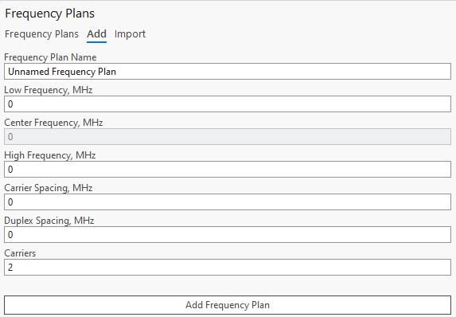

on the plot.

Carriers with the prime symbol ( ‘ ) are for Upper carriers, and others are for Lower carriers.
Carrier ID
Carrier identifier.
Frequency
Carrier’s frequency value in MHz.

#### 7.12.2 Import Frequency Plan
Frequency plans can be imported into CE workspace as CSV format files. Press Select Data Files, then
navigate to the frequency plan data CSV format file.
The frequency plan can also be edited before importing. Click Import to finalize the frequency plan import

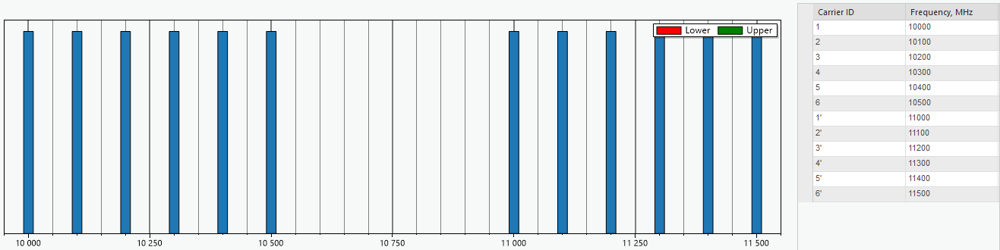

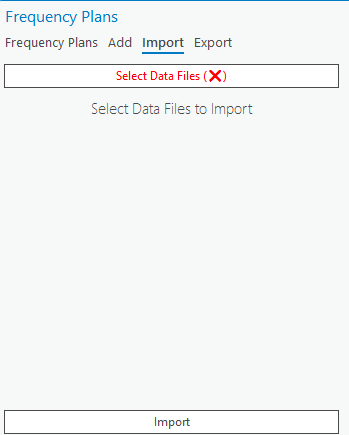
procedure.

#### 7.12.3 Export Frequency Plan
Selected frequency plan can be exported to CSV format file. Select the frequency plan in the table, then
define the export path by clicking the Folder icon to open the path selection dialog, and click Export to save

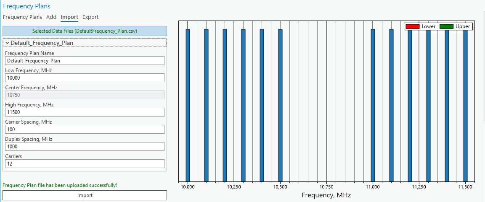

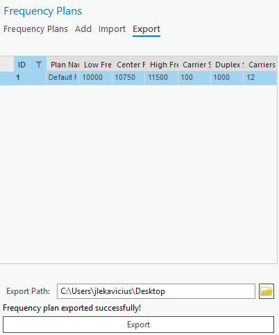
the frequency plan to CSV format file.

#### 7.12.4 View Frequency Plans
You can view, edit, and delete all frequency plans by navigating to the Frequency Plans tab on the
Frequency Plans dockpane.

By selecting a frequency plan you can view its properties, change them, and delete the frequency plan.
Delete
Delete the selected frequency plan.
Duplicate
Create a copy of the selected frequency plan.
Edit
Edit the currently selected frequency plan. When this button is pressed you will be redirected to a separate

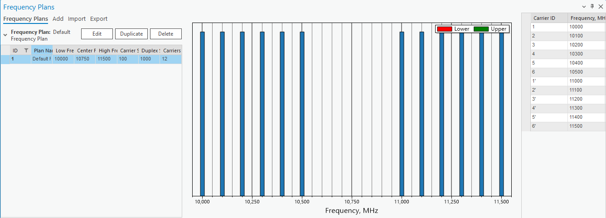

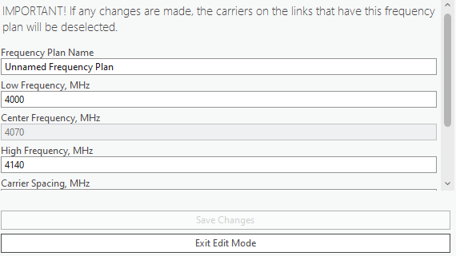
tab to make the edits. Keep in mind that any links that have this changed frequency plan will lose their
carrier selection.
Exit Edit Mode
Discard all changes made to the currently editable plan and leave edit mode. On exit, you will be returned
to the Frequency Plans tab.
