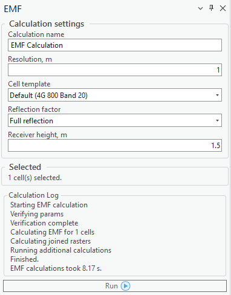
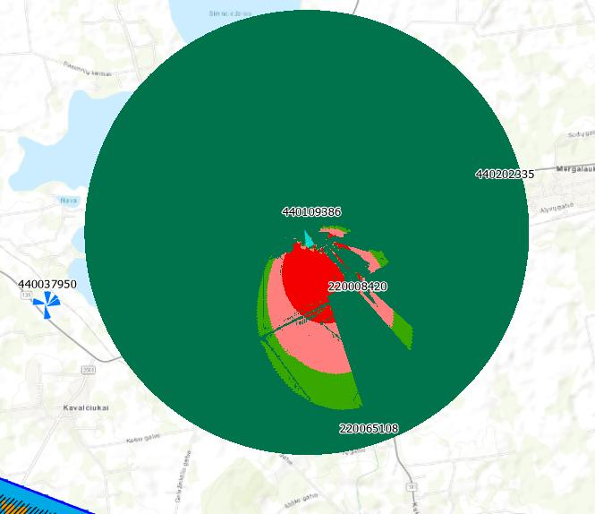

# EMF Tools

## 8. EMF Calculations

### 8.1 EMF
The EMF Calculation Tool analyzes and visualizes electromagnetic field (EMF) exposure based on various
environmental and technical parameters, such as resolution, cell template, reflection factor, and receiver
height. This tool allows users to perform EMF calculations for selected cells by specifying these parameters.

These are then processed to provide results for EMF limit usage (%), EMF in mV/m, and EMF in mW/m².
The results are displayed on the map, highlighting areas with varying levels of EMF exposure, and the
values are explained in the legend under the newly created calculation layer.
| Parameter | Description |
|---|---|
| Calculation Name | Name of the calculation that will be displayed in the CE Calculation Task List. |
| Resolution | Resolution for raster calculations. The output rasters will be produced with the indicated cell size. |
| Cell template | Cell template that will be used in the prediction calculations. |
| Reflection factor | Reflection factor, used for the electromagnetic field exposure prediction calculations. Available selections: no reflection, realistic reflection, or full reflection. |
| Reflection factor | Receiver height in meters. |

The results are displayed in newly added rasters of the calculation – electromagnetic field exposure results

in mV/m and mW/m2. For example, the green indicates where mV/m exposure values are less than 50, and
red indicates where they are higher than 100.
