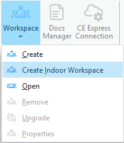
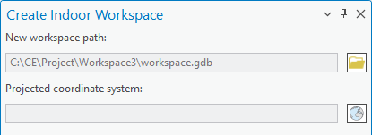
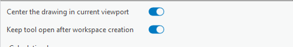
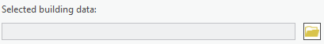
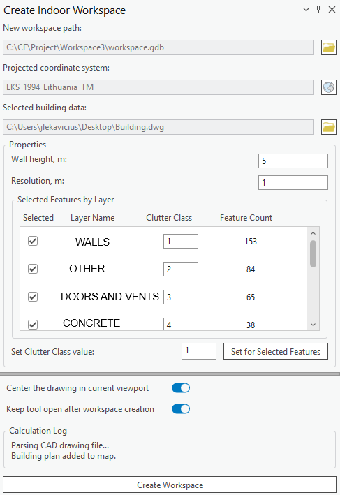
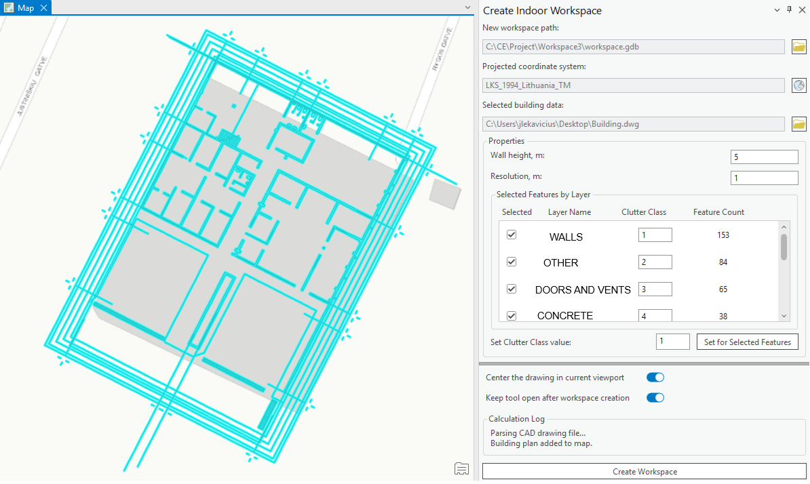

# Indoor Workspace

> **Note:** Indoor-specific workspace creation flow. Everything else about workspaces is covered on the shared Workspace page.

## 6.1.3 Create Indoor Workspace
Steps to create a workspace from a CAD drawing:

1. Click the Create Indoor Workspace button in the Cellular Expert Workspace menu.

2. The Create Indoor Workspace dockpane will appear. A new workspace path with a new directory is
automatically created, but can also be changed with the browse button. Select the projected coordinate

system by clicking the button with the globe icon.

3. Before selecting the building data, if the data is not georeferenced, the Center the drawing in current

viewport can be selected (ON by default). This adjusts the drawing to the current map viewport (centers
and scales the building drawing). If the building data is georeferenced, the option can be turned off to
place it in its intended location on the map.

4. Once the projected coordinate system is selected, the building data can be selected. Click the folder
button and select the building data. Formats supported: .DWG, .DXF, .SHP (line shapefile), .PDF (raster
and vector documents)
If CAD drawing (.DXF, .DWG format files) is selected:
• Once the CAD drawing is selected, it is added to the map, and the properties can be adjusted. The
default selected feature type is Polyline (i.e., the polyline layer, or group, is used for selecting the
features that will be transformed into the geodata). The wall height represents the values in the to-
be-created clutterHeight.tif raster. The resolution also affects the width of the drawing lines (e.g.,
walls will be thicker or thinner depending on the resolution).

If line shapefile data (.SHP format files) is selected:
• The same procedure applies as for CAD files; however, several .SHP files can be selected in the
file selection dialog. If more than one .SHP files are selected, they are treated as a single building

data unit.
If a PDF document (.PDF format file) is selected:
• There are two options for converting PDF documents to a building plan drawing (DXF format):
o Vector: Select this option if your PDF document contains the building plan in vector lines.
o Raster: Select this option of your building plan is an image in the PDF document.

If Vector document type is selected, an option to filter text in the PDF document appears. If on
(default), the text in the document will be filtered, keeping the building drawing only. If off, the text
present in the document will be retained in the building drawing. If Raster document type is
selected, an option to define PDF document DPI appears. Selecting a higher DPI will result in a
more accurate building plan conversion, however, this procedure will take a longer time.
For PDF documents, the page which contains the building plan data must be selected (by default,
it is the first page.)
Make the selection on the map with Select tool to specify which features will be used for workspace creation
(for instance, if only some features are required). Clutter classes for each layer can also be edited (by
default, they are incremented from 1 to the amount of layers selected), or a single clutter class value can
be set for all layers by clicking the Set Class for All Features button. If you need to scale, move, or rotate
the selected section of the building, it can be done so using the Move tool.
Once you have done the selected territory transformation with the Move tool (or Scale/Rotate) and
confirmed the location of the selection, click the Create Workspace button to initiate the workspace creation
procedure. The workspace will be activated automatically. If Keep tool open after workspace creation is
selected, the dockpane will remain open, and the created polylines will be retained, should you wish to
reposition the drawing and recreate the geodata again.
The created clutterHeight.tif, clutterClasses.tif, elevation.tif rasters are stored in the Geodata folder, which

is located in the workspace folder.
