# CE Desktop RCP User Guide

> **Version:** CE Pro v4.9

## 1. Software Purpose and Functionality

CE Pro runs as an extension inside ArcGIS Pro. For an efficient CE Pro workspace, arrange your panes so the map, Contents, and CE Pro tools are all visible at once:

Cellular Expert Desktop for ArcGIS Pro (CE Pro) is a professional radio coverage planning software tool
designed on top of the Esri ArcGIS Pro environment. The CE Pro is a highly versatile and functional tool,
covering the network design functionality needs of most professional radio communication planners and
developers. It could support network planning and optimization for the entire range of wireless technologies
in frequencies from 10 kHz to 350 GHz.
The key features and benefits of utilizing Cellular Expert software are as follows:

1. CE Pro is a purpose-built extension of ESRI software, a world-renowned standard in GIS
environments. This means that along with wireless network planning and optimization, it gives
users various value-added GIS/mapping functionalities to manage, visualize feature classes or
roasters, create reports, and graphs, or automate workflows,

2. CE Pro is made of several processing engines and functional modules and therefore may be
easily configured for various business functions: network planning, network engineering,
technology information support to sales and marketing, network assets management, and
network operational maintenance and supervision,

3. CE Pro is maintained and constantly developed by a dedicated agile team of software
developers and radio planners, allowing attentive responsiveness to customer needs and
developing custom-tailored solutions.
CE Pro performs mobile network coverage analysis based on:

1. Site and cell level details of radio equipment complement, specifications, cell and component
carriers configuration,

2. Subscriber characteristics – geographic distribution density, generated traffic to estimate
network/cell loading,

3. DTM, buildings, and clutter-based deterministic point-to-area radio wave propagation
modeling.
CE Pro allows the user to input and use a broad variety of GIS and network data to support the simulations,
as the overall quality of coverage calculations is dependent on the completeness and detail of technical
network data and the resolution and quality of the GIS data. CE Pro can efficiently simulate wide area
network coverage using the GIS data with a resolution of down to sub-meter.
Calculated results of coverage predictions could be presented as coverage raster maps.
CE Pro is capable of modeling various wireless technologies: cellular (2G/3G/4G/5G), PMR/PAMR
(TETRA, APCO, others), FWA/BWA, IoT (LoRa/SigFox, others), as well as fixed microwave links.
Therefore, it may be used as a radio planning tool in various industries: Mobile Operators, Integrated
Telecom Companies, Wireless Internet Service providers, Regulatory authorities, Utilities, Broadband
Infrastructure providers, Defense organizations, as well as any other users of radiocommunication systems.
In the following, we summarize the key functionalities of the tool.
Data Management
The tool allows the importation, storage, and management of detailed technical data on network nodes,
such as sites, cells, RF transmitters, and antennas.
Signal Strength Prediction
The tool contains several in-built path loss prediction models that allow the user to easily start simulations
based on the evaluation of the most essential pathloss contributing factors. The following two models
constitute the starting set:
• Free space – typically used for modeling short-range mobile communications, fixed links, or other
radiocommunications applications with prevalent Line-of-Sight conditions on propagation paths,

• UniMacro – a proprietary universal model for wide area mobile communication systems that flexibly
accounts for a variety of propagation paths as determined for each specific reception point based
on terrain and clutter data vs. configuration of the modeled system.
Further details on path loss models and their configuration options are provided in the relevant section of
this manual.
Model Tuning
The tool provides an automated method for fine-tuning propagation model parameters to fit the specific
scenario and type of area of network deployment based on analyzing real field strength measurement
results.
Radio Coverage Calculation for Different Mobile Technologies
Radio coverage calculation is assisted in the tool by the possibility to use pre-loaded cell configuration
templates that are tailored to typical technical parameters of base stations in different Radio Access
Technologies. Accordingly, the model settings and outputs will be adjusted to suit the scenario pertinent to
that technology, i.e.:
• 2G – radio coverage is calculated in dBm as receive power level of narrow-band (200 kHz) signal,
• 3G – radio coverage is calculated in dBm as the receive power level of a single broadband (3.85
MHz) carrier,
• 4G/5G – radio coverage is calculated in dBm as the equivalent RSRP of a single sub-carrier
component in the complex OFDM broadband signal.
• Wi-Fi - wireless communication technology based on the IEEE 802.11 standards, used for setting
up local area networks (WLANs) and providing internet access in various settings without requiring
cable connections.
Profile Analysis
The tool provides powerful GIS analytical features to analyze the terrain and clutter on the fixed link path,
such as allowing to estimate of the Fresnel zone clearance condition, Power Budget, Path loss and Angles
between Tx and Rx.

## 2. System requirements
This chapter will guide you through the minimal hardware and software requirements.
Note: requirements can vary significantly, depending on the acceptable calculation time and task
complexity.

### 2.1 Minimal Requirements for Hardware
Processor (CPU):
• Minimum: 8 cores, hyperthreaded
• Recommended: 16 cores
(Optional) Requirements for GPU-accelerated calculations
• GPU – any NVIDIA GPU with CUDA capabilities (https://developer.nvidia.com/cuda-gpus)
• Driver version: 456.38 or later
• CUDA Toolkit 11.0 or later
Memory/RAM:
• Minimum: 16 GB
• Recommended: 32 GB
Storage:
• Minimum: 500 GB of free space
• Recommended: 2TB or more of free space on a solid-state drive (SSD)

### 2.2 Minimal Requirements for Software
Cellular Expert runs on Microsoft Windows 10 or higher operating system.
It requires:
• Microsoft .NET 8.0:
Download .NET 8.0 Desktop Runtime (v8.0.0) - Windows x64 Installer
• Microsoft Visual C++ Redistributable packages 2015-2022:
https://aka.ms/vs/17/release/vc_redist.x64.exe
• .NET support for ArcGIS libraries
• ArcGIS Pro from version 3.3.x

## 3. License types
Only a Single Use Cellular Expert license is available. The license type is annual and dedicated to one
workstation connected with ArcGIS Online, which is used for ArcGIS Pro.

### 3.1 Single-User Environment
For the Single-User configuration of Cellular Expert, all information about radio network objects is stored in
a personal geodatabase (GDB format) or locally on the disc (calculation results, raster data in GeoTIFF
format, etc.).
Geographical data can be stored:
• Locally on a disc
An ArcGIS Pro license and an active ArcGIS Named User or ArcGIS Pro Standalone are required to operate
in the Single-User environment.

## 4. Getting Started
Welcome to Cellular Expert.
This chapter will guide you through project creation and analysis. It includes the installation and preparation
of the Cellular Expert extension, as well as using it for the first time and creating a project.
Note: the tools are not explained in this chapter. They are referenced in other chapters of this guide.

### 4.1 Installation
• If applicable, uninstall the previous version of Cellular Expert for ArcGIS Pro
• Make sure that .NET 8.0 is installed
• Make sure that ArcGIS Pro 3.3.x is installed
• Run the ceProSetup.msi file to install the new version of Cellular Expert for ArcGIS Pro
• After successful installation, open Task Manager > Services, and run CE_Pro_Prediction_Service

### 4.2 Activation
This step is required for new users. If the Cellular Expert for ArcGIS Pro license has already been activated,
please skip this step.
You can activate the license in two ways:
First way:

1. Open ArcGIS Pro and select Settings

2. Navigate to Licensing → External Extensions

3. Find the Cellular Expert entry in the extensions table

4. Click the checkmark in the Enabled field. The License Activation dialog will appear

5. Copy the User Key and send it to support@cellular-expert.com. You will be provided with a
License Activation Key which must be entered into the same dialogue

6. Press Activate License and the license will be activated, enabling the acquired versions of the
add-on
Second way:

1. Create an empty ArcGIS Pro project

2. Navigate to Insert and select New Map. After the map insertion, the Cellular Expert tabs will be
enabled

3. Navigate to any of the Cellular Expert tabs and select License Information in the About section.

4. Copy the User Key and send it to support@cellular-expert.com. You will be provided with a
License Activation Key which must be entered into the same dialogue

5. Press Activate License and the license will be activated, enabling the acquired versions of the
add-on
If you want to check the expiration date of the license you can:

1. Open ArcGIS Pro and start/open a project with an active map

2. Navigate to the Cellular Expert tab

3. Select License Information in the About section

If you encounter any problems or want additional details about the license, please contact Cellular Expert
at support@cellular-expert.com. For more information, see the chapter Technical Support.

### 4.3 Tools
The Cellular Expert tools are in the Cellular Expert add-on. They appear automatically after installation of

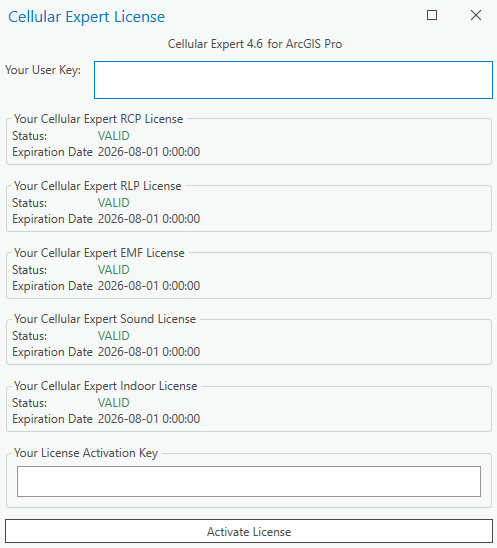

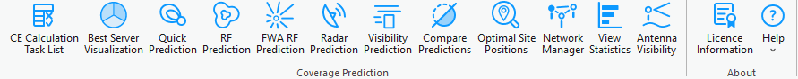

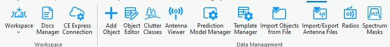
CE for ArcGIS Pro and will be found in the menu ribbon.
There are 5 types of licenses and therefore 5 different tabs with various tool configurations:
• RCP
• RLP

• EMF
• Sound
• Indoor
This User Guide describes RCP tools.

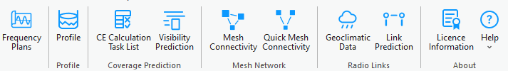

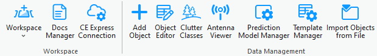

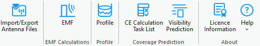

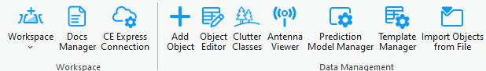

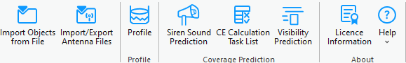

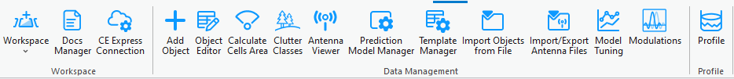

## 5. Geographic data
CE Desktop is designed to work with any geospatial data available to the customer and fully exploit its
precision for the most accurate coverage and QoS calculations. The platform supports multi-resolution input
datasets — from freely available global sources such as Sentinel-2 10 m land cover and ASTER DEM, to
premium high-resolution terrain and 3D building models when provided by the customer or government
agencies.
Source: https://livingatlas.arcgis.com/landcoverexplorer/
By leveraging whatever data is available locally, CE Express performs nationwide calculations at the
maximum feasible resolution, accurately modeling signal propagation even in dense urban environments.
Support for 3D multi-height calculations ensures that coverage predictions reflect street-level, indoor, and

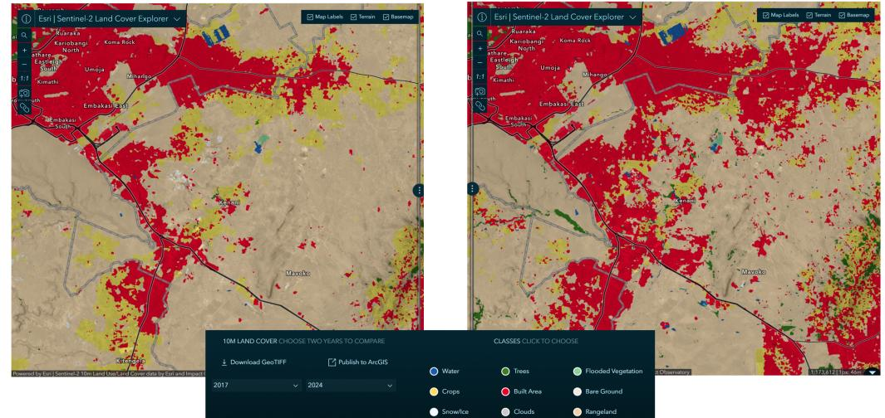
rooftop conditions, providing regulators with a realistic representation of service availability.
This flexibility ensures that NRAs can use their existing GIS assets, open datasets, or commercial data they
already license, turning them into actionable broadband maps without additional data procurement
requirements from the solution provider.
By using terrain elevation, obstacles, and clutter classification in every calculation, Cellular Expert
accurately models:
• Line-of-Sight and Non-Line-of-Sight Conditions – Determining diffraction, reflection, and
shadowing effects over hills, valleys, and urban obstacles.
• Coverage Footprints – Generating precise signal strength maps at national, regional, and local
levels.
• Capacity and Interference Analysis – Modeling realistic signal overlaps and interference zones
for multi-operator, multi-technology environments.

Diffractio Free Space Loss
n
Diffractio
H
H clutter n obstacles
DSM
Clutter losses
UE
DTM
The CE tools make use of three distinct GIS data layers to obtain high precision modelling of radio wave
propagation losses:

1. Digital Terrain Model (DTM), also known as Digital Elevation Model (DEM), which describes
Earth surface, i.e., path terrain profile in terms of ground elevation above uniform sea level.

2. Obstacles layer, delineating buildings and other such objects above Earth surface that may be
considered to be principal impediments for radio wave propagation.

3. Clutter layer, delineating natural occurring or human cultivated ground cover that may be
partially penetrable by radio waves, such as natural vegetation (e.g., forests, trees, bushes) or
various crops, gardens, parks, etc.
The image above illustrates how Cellular Expert uses different resolutions of topographical data to
significantly improve coverage prediction accuracy.
• Left image: Coverage calculated using 25 m resolution ASTER DEM data, showing a general view
of signal distribution but with limited detail, especially in dense urban areas.
• Right image: Coverage calculated using 1 m resolution data, revealing a much more precise
propagation pattern, including building-level shadowing and accurate street-by-street coverage.
More information: https://blog.maxar.com/earth-intelligence/2022/benefits-of-using-maxars-precision3d-
telco-suite-for-5g
Cellular Expert can easily integrate and process 1 m or even sub-meter topographical data, providing highly

detailed RF calculations. This level of precision is essential for:
• Modeling 2G/3G/4G/5G, small cells and mmWave networks.
• Identifying exact coverage gaps at the building and street level.

• Supporting regulatory-grade broadband mapping and planning.
By using high-resolution terrain and clutter data, Cellular Expert ensures that its calculations match real-

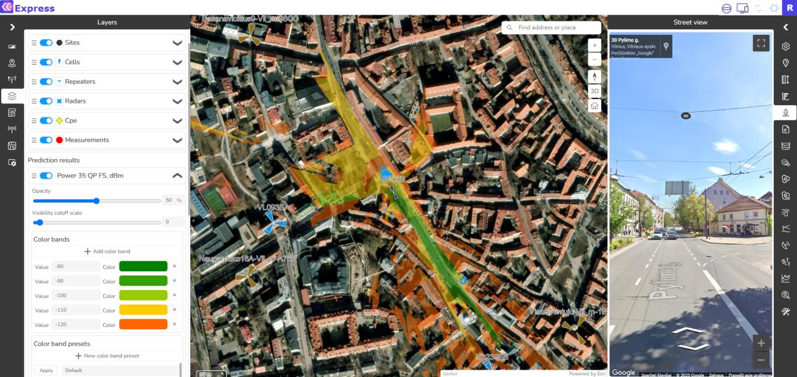

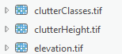
world conditions as closely as possible — resulting in better network design decisions and more reliable
broadband planning outcomes.

### 5.1 Geographic data requirements
The supported geographical data types:
Only GeoTIFF is supported. Topographical data must have specific names:
• The Digital terrain model must be named elevation.tif
• The land use (or clutter) grid must be named clutterClasses.tif
• The clutter heights (typically building, vegetation height) grid must be named clutterHeight.tif
Mandatory geographical data:
• Digital Terrain Model (DTM) grid
All geodata must be located in one catalog.

#### 5.1.1 Digital Terrain Model (DTM) Grid (Mandatory)
The Digital Terrain Model (DTM), also known as Digital Elevation Model (DEM), represents the Earth’s
ground level above sea level. Each raster pixel has its height value.

A sample DTM raster is presented below. Each pixel represents 5 square meters with its height value. In
reality, within a one-pixel area, the height is not the same everywhere. Thus, the pixel’s height value is the
height in its center or the maximum. The smaller the pixels, the more accurate is the grid - but also more
data to calculate.
5.1.1.1 Prepare DTM raster
The Digital Terrain Model (DTM) has several requirements, which are listed below.
Projection
The raster must use a Projected Coordinate System. To check the coordinate system of your raster, use
the Properties function in ArcGIS Pro. Add the raster to your project, right-click on it, and select Properties.

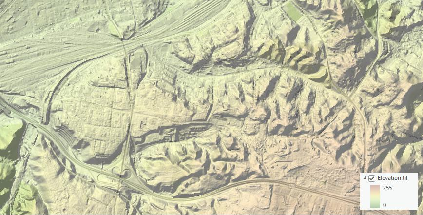

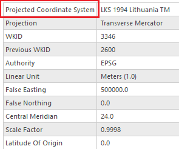
Then, go to the Source tab > Spatial Reference and check the Coordinate System type parameter to confirm
it is in a Projected Coordinate System.

If your raster is in a Geographic Coordinate System or needs a different projection, use the Geoprocessing

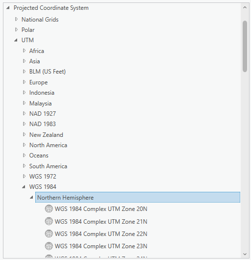
> Project Raster tool to update it.
In the Output Coordinate System, specify a new coordinate system. It is recommended to use a UTM
coordinate system under the WGS 1984 projection.
You can find the appropriate UTM zone for your area here:
https://www.arcgis.com/apps/mapviewer/index.html?layers=b294795270aa4fb3bd25286bf09edc51

Correct No Data value and raster name
After setting the correct projection, assign the NoData attribute and specify the appropriate name for the
DTM raster. To do this, use the Copy Raster tool in Geoprocessing.
Configure the following settings:
• Input Raster: Select your newly projected DTM raster.
• Output Raster Dataset: Specify the output location and set the raster name to elevation.tif.
• NoData Value: Enter -9999.
• Pixel Type: Choose 32-bit signed or 32-bit float.
• Format: This will automatically be set to TIFF.

#### 5.1.2 Clutter classes grid
Land use or clutter refers to the classification of the earth’s surface into categories such as urban, suburban,
rural, forest, water, and open land, each of which affects radio propagation differently. Clutter data is crucial

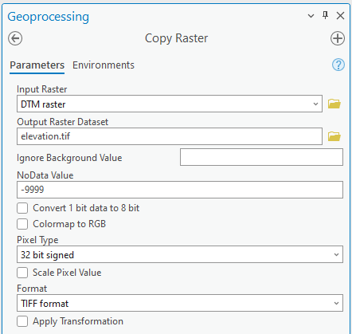

because it determines how signals are absorbed, reflected, or diffracted by the environment, directly
influencing coverage, interference, and quality of service. The naming and classification of land use types
may vary. An example is the Sentinel-2 Land Cover dataset from the Living Atlas: Living Atlas Sentinel-2
Land Cover
This data is freely available worldwide and is detailed in Cellular Expert databases. Once the workspace is
created, a default clutter class table is automatically applied for each land use class.

Table:
These are standard clutter types in the default workspace database, which cannot be edited. You must
map your clutter raster to these predefined clutter types. Standard mapping has already been configured

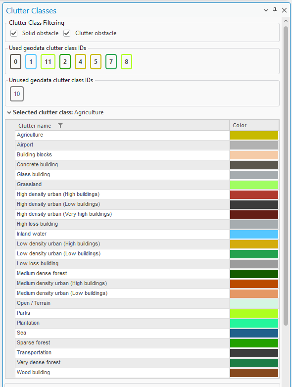

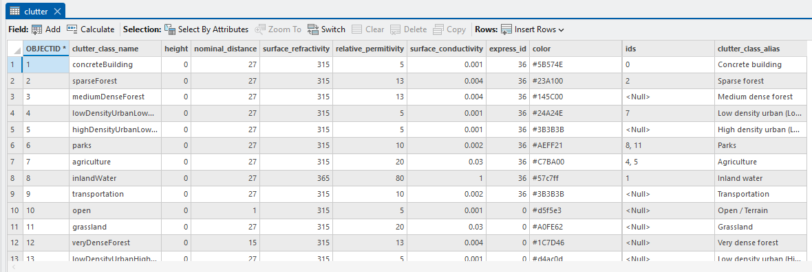
for the Sentinel-2 Land Cover dataset from the Living Atlas: Living Atlas Sentinel-2 Land Cover

If you have a different clutter class layer, it can be used for predictions by remapping it using the Clutter

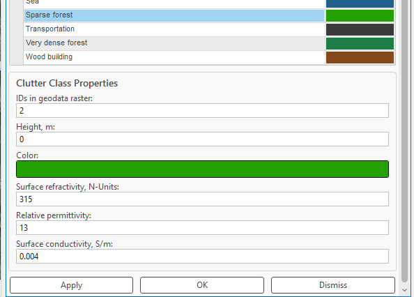

Classes tool and specifying the IDs in the geodata raster parameter. If multiple clutter classes correspond
to a single default clutter type, separate the ID values with commas.
This mapping can also be adjusted in the Clutter table.
Once clutter classes are successfully mapped, the prediction algorithms will recognize the clutter types,
apply distinct symbols, and adjust path loss calculations accordingly, based on the parameters set in the
prediction model.

5.1.2.1 Prepare Clutter Classes raster
The Clutter Raster has several requirements, which are the same as for DTM raster listed above.
Projection
It must have the same coordinate system as your elevation.tif raster. If your raster has different coordinate

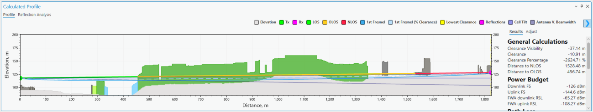

system, then use the Geoprocessing tool → Project Raster to fix it.
In the Output Coordinate System you would need to define the same coordinate system as your elevation.tif
raster. Click on Select Coordinate System button.
And choose the same coordinate system as your elevation.tif.

Correct No Data value and raster name
After setting the correct projection, assign the NoData attribute and specify the appropriate name for the

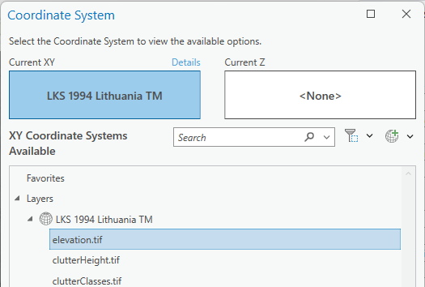
Clutter Class raster. To do this, use the Copy Raster tool in Geoprocessing.
Configure the following settings:
• Input Raster: Select your newly projected Clutter Class raster.
• Output Raster Dataset: Specify the output location and set the raster name to clutterClasses.tif.
• NoData Value: Enter -9999.
• Pixel Type: Choose 32-bit signed or 32-bit float.
• Format: This will automatically be set to TIFF.

#### 5.1.3 Clutter heights
Represents actual clutter heights, which override the default heights specified in the Clutter table. The
clutter heights raster requires the accompanying clutterClasses.tif raster and cannot be used
independently.
A clutter height raster can be derived from a Digital Surface Model (DSM) raster and a Digital Terrain Model

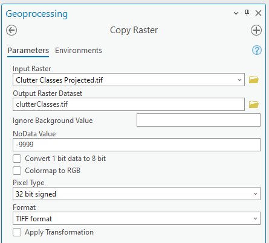

(DTM) raster using the ArcGIS Raster Calculator tool. To access this tool, open Geoprocessing tools and
navigate to Spatial Analyst > Map Algebra > Raster Calculator. Use the following formula:
DSM – DTM

The calculation output will be the difference between the DSM and DTM grids, representing the clutter
heights.
5.1.3.1 Prepare Clutter Height raster
The Clutter Height has several requirements, which are the same as for DTM raster listed above.
Projection
It must have the same coordinate system as your elevation.tif raster. If your raster has different coordinate

system, then use the Geoprocessing tool → Project Raster to fix it.

In the Output Coordinate System you would need to define the same coordinate system as your elevation.tif
raster. Click on Select Coordinate System button.
And choose the same coordinate system as your elevation.tif.
Correct No Data value and raster name
After setting the correct projection, assign the NoData attribute and specify the appropriate name for the

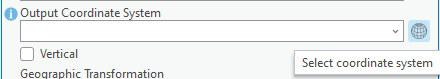

Clutter Height raster. To do this, use the Copy Raster tool in Geoprocessing.

Configure the following settings:
• Input Raster: Select your newly projected Clutter Height raster.
• Output Raster Dataset: Specify the output location and set the raster name to clutterHeight.tif.

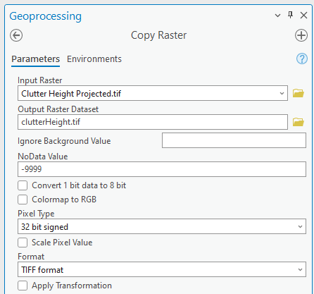
• NoData Value: Enter -9999.
• Pixel Type: Choose 32-bit signed or 32-bit float.
• Format: This will automatically be set to TIFF.

#### 5.1.4 Buildings
Building features within the Clutter Classes raster are automatically identified and categorized using a range

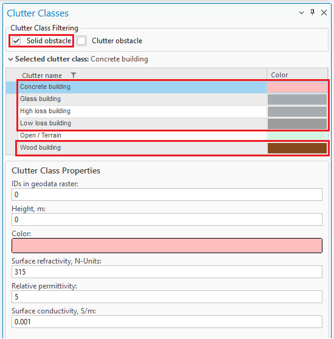
of dedicated building-specific clutter types. These clutter types are available within the Clutter Classes
tool and are specifically designed to represent different architectural materials and structural
characteristics.
Importantly, all building-related clutter classes are treated as Solid Obstacles – ensuring accurate
modeling of signal attenuation and reflection in propagation calculations. This classification enhances the
realism and precision of both indoor and outdoor network predictions by accounting for the physical impact
of built environments.
You can seamlessly edit your Clutter Classes raster using standard ArcGIS Geoprocessing tools to
integrate detailed building data into your existing clutter layer.
The process supports both vector and raster input formats, giving you flexibility depending on your data
source. Whether you're working with CAD-derived vectors or pre-classified raster layers, these tools allow
you to enrich the clutter map with accurate building representations – essential for high-fidelity propagation
modeling.

If your building data is in vector format (e.g., polygons), you’ll first need to convert it to raster before

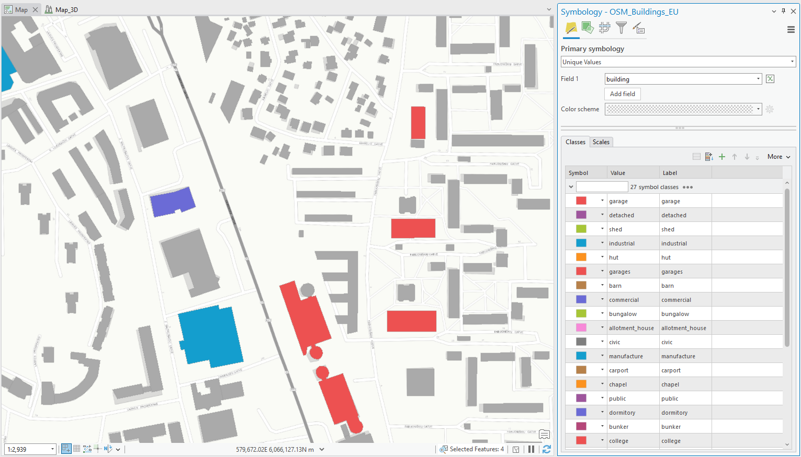

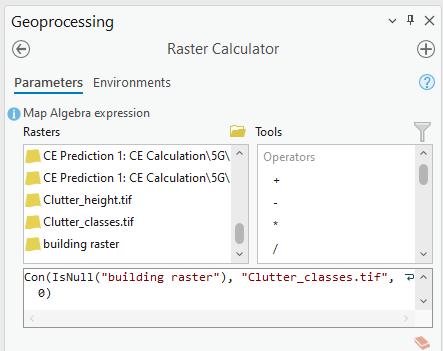
incorporating it into the Clutter Classes layer.

1. Convert Vector to Raster
Use the Polygon to Raster tool available in the Geoprocessing pane. This will transform your
vector-based building footprints into a raster format suitable for clutter classification.

2. Update Clutter Classes Using Raster Calculator
After conversion, open the Raster Calculator to integrate the new raster into your existing clutter
layer:
o Navigate to Geoprocessing
o Go to Spatial Analyst > Map Algebra > Raster Calculator
o Use map algebra expressions to merge or replace values as needed, assigning appropriate
clutter class codes to building areas.
Con(IsNull("building raster"), "Clutter_classes.tif", 0)

This workflow allows you to accurately reflect building data in your clutter map, improving prediction
accuracy in urban and mixed-use environments.
When incorporating building data into the Clutter Classes raster, you have the flexibility to assign any
numeric value to represent the "Buildings" clutter class. In the example provided, a value of 0 was used,
but you may choose any value – as long as it does not conflict with existing clutter class values
already present in your raster.
Once applied, the Clutter Classes raster will be updated to include a new entry for Buildings, enabling
more precise signal propagation modeling that accounts for structural obstructions.
Be sure to document your chosen value and update your Clutter Class definitions accordingly within the
Clutter Classes tool to maintain consistency across your modeling environment.
All propagation and prediction calculations reference clutter types defined in the Clutter Classes table.
Each building-related clutter class is assigned a unique ID value, which is used during modeling to apply
the appropriate path loss parameters for solid structures.
This ensures that Buildings are accurately represented in simulations, contributing to more realistic signal

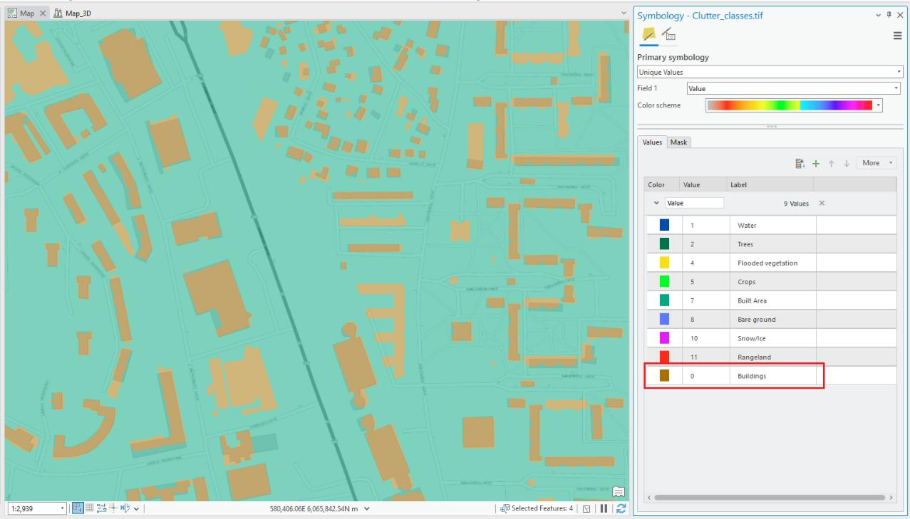
behavior in both indoor and outdoor environments.

Building Height Determination in Clutter-Based Modeling
Pixels assigned to a building clutter class ID will be automatically recognized as solid obstacle during

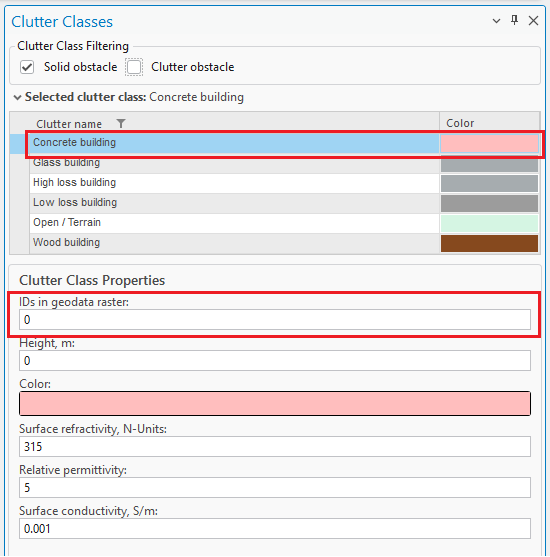

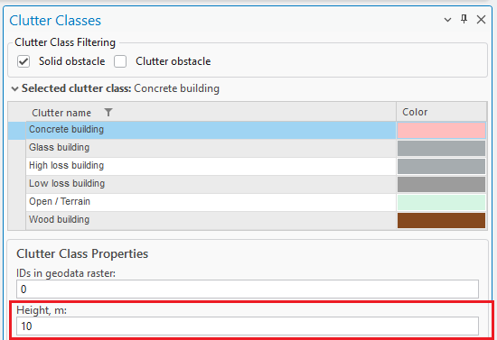
prediction calculations. Their heights are determined using the following priority:
• Option 1: From the associated Clutter Height raster, if available. This provides the most accurate,
location-specific height information.
• Option 2: If no Clutter Height raster is present, the system will default to the height value defined
in the Clutter Classes table for the corresponding clutter ID.

The result:

## 6. Workspace
This chapter describes the Cellular Expert workspace functionality.

### 6.1 Workspace Tool

#### 6.1.1 Workspace Table
Cellular Expert workspace is a geodatabase containing data tables, feature datasets, and the workspace
definition table. After creating a new workspace database, the workspace definition table will be named

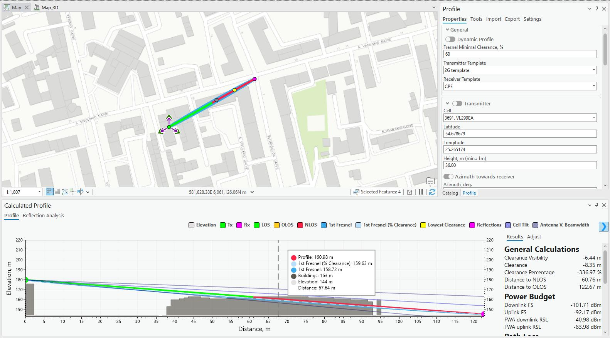

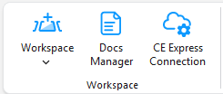
CE_WORKSPACE and contain the information about the dataset.

Data field types and values:
• OBJECTID – long integer type
• pName – text type
• pType – text type
• pValue – text type
When moving your project’s directory to another location (to another computer), it is necessary to update
the workspace parameters by referencing the new paths to properly load the project:
• Prediction Path – path for storing prediction grids
• Calculation Path – path for temporary calculations
• Calculation Tasks Data Path – path for saving calculation tasks
• Geodata Folder Path – path for geodata (prediction models do not have geodata options, topographical

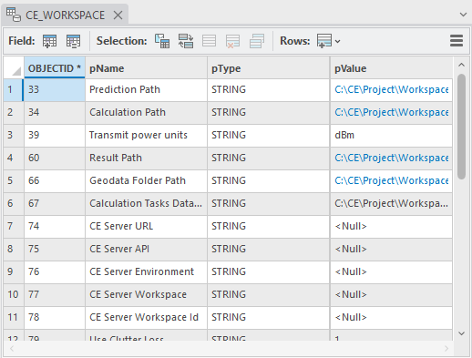

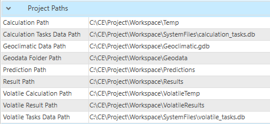
data are taken from the Geodata Folder Path)
• Result Path – path for final results
Workspace calculation paths and settings can be previewed in the dedicated tool, navigate to Workspace
> Properties. It would show all parameters listed in CE_WORKSPACE table.

#### 6.1.2 Create Workspace
Steps to create a new workspace:

1. Click the Create button in the Cellular Expert Workspace menu.

2. The Create dialogue will appear. Fill in the minimum required data:
New workspace path
It is automatically filled based on the ArcGIS Pro project location. The recommendation is to first save your

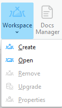

ArcGIS Pro project and then open the Workspace > Create tool. The project's workspace folder will be
automatically created in the ArcGIS Pro project location catalog. This way, you will have both the ArcGIS
Pro and CE workspace in the same location.
Geodata folder path
Catalog where geodata files are stored. More about Geodata requirements are listed in 5. Geographic
data topic. Click on Browse button to define Geodata catalog. Geodata must have specific names:
• The Digital terrain model must be named elevation.tif
• The land use (or clutter) grid must be named clutterClasses.tif
• The clutter heights (typically building and vegetation height) grid must be named
clutterHeight.tif

Note: The projected Coordinate System has been filled automatically and taken from the defined Elevation
grid. This means that this coordinate system will be assigned to your project feature layers.
When creating a new workspace using geodata containing clutter classes raster, default class IDs can now
be set by clicking Set Default Clutter Class IDs button. The default ID values are based on Living Atlas
clutter. Clutter class IDs can also be set manually, either before or after the default values are set. To initiate

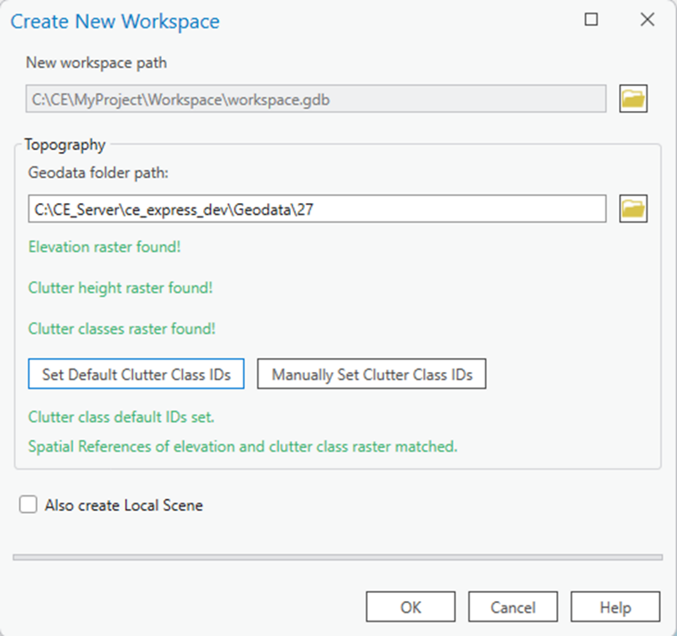

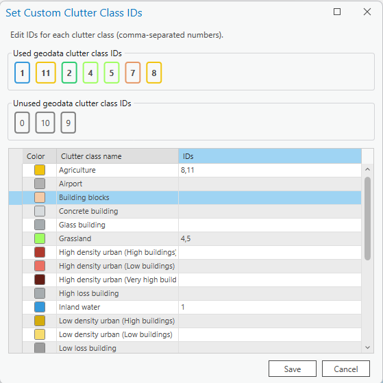
the manual editing of clutter class IDs, click the Manually Set Clutter Class IDs button. Each clutter class
can be edited to designate its used and unused types, also indicated by their distinct colors.

Several messages related to Geodata:
• If only Elevation exists in Geodata catalog, then tool will be filled with such information:

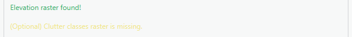

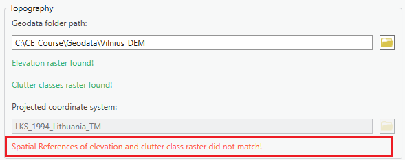

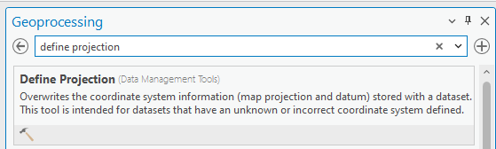

Clutter Classes and Clutter Height are optional.
• If coordinates mismatch between elevation and clutter, then it will provide this message:
Please close Workspace Create tool and fix your geodata. You can use Geoprocessing tools,
Define Projection tool to fix this issue. Define the same coordinate as elevation.tif for your
clutterClasses.tif and if available, clutterHeight.tif rasters.
Also Create Local Scene
Use the option to create a second scene for 3D visualization.

3. Press OK button to start workspace creation procedure.
Cellular Expert layer and geodata will be added to the project.

Workspace geodatabase and required folders will be created within successful workspace creation

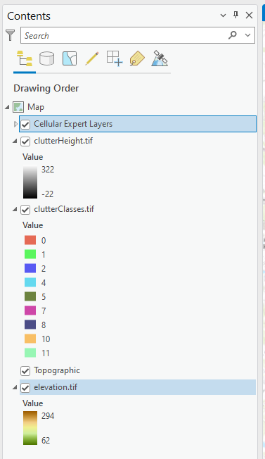

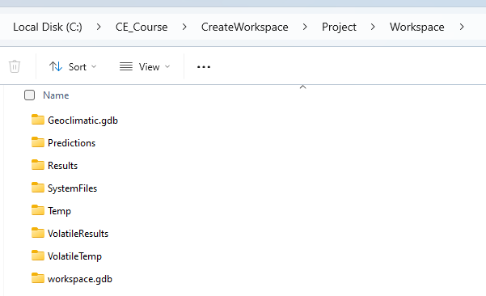
procedure.

The Project Paths will be filled in the Workspace Properties → Properties tab.

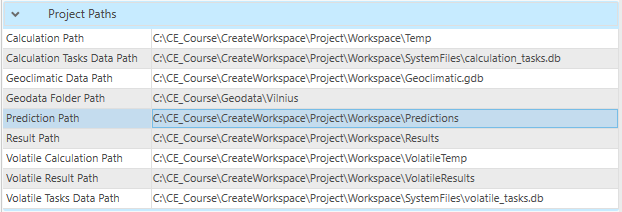

#### 6.1.3 Open Workspace
Steps to open a workspace:

1. Click the Open option in the Workspace menu of the Cellular Expert toolbar.

2. Specify the workspace name and click the OK button.
The specified workspace will be activated automatically.

#### 6.1.4 Remove Workspace
Upon selecting Remove in the Workspace dropdown menu, the workspace will be removed from the
currently open ArcGIS Pro project.

#### 6.1.5 Workspace Upgrade
Workspace Upgrade is a tool that enables the user to update missing tables from the default database
(default.gdb). If the table exists, Workspace Upgrade also checks if all default fields are present in that
table. If the tables are toggled, they will be updated (upgraded) by the tool.
Usually, with new versions of CE for ArcGIS Pro come changes to default data tables. This tool is especially

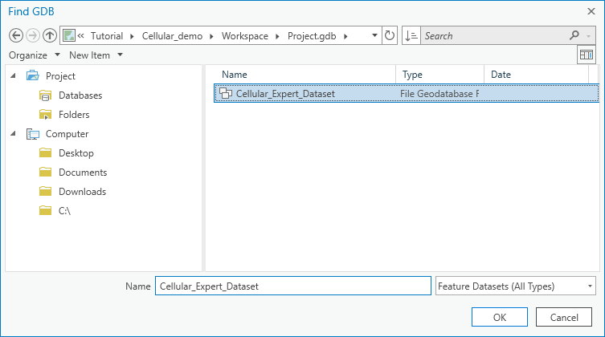
useful when checking if the newest version tables correspond to the current project tables.
Workspace Upgrade automatically checks all these parameters and notifies the user upon the start-up of
the project.

| Parameter | Description |
|---|---|
| Refresh Cellular Expert Layers | Imports missing layers from Cellular Expert Dataset. |
| Reimport Antennas | Imports the deleted default antennas back to the Antennas table. |
| Generate Antenna Type | Based on the Antenna data assign antennas a type if they are missing it. |
| Run Analysis | Manually checks if the default tables and their fields exist in the project. |
Upgrade Database
Creates the missing tables and/or creates/adds back the missing fields from default tables.
If a project with incompatible geodata is loaded, the Workspace Upgrade tool analyzes the current geodata,

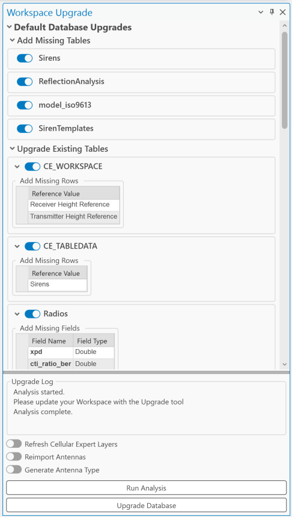
as well as the owned user Esri Extension licenses to offer the optimal geodata upgrade path. This process
is one-time only, and can be done by checking the Upgrade Geodata toggle.

• If only elevation and buildingHeight rasters exist, the buildingHeight can automatically be renamed

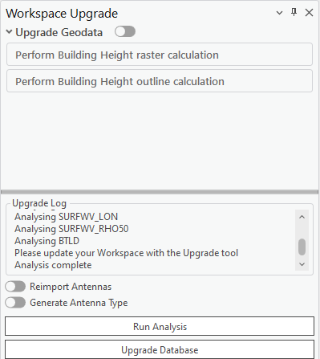
to clutterHeight.
• (Image Analyst and Spatial Analyst licenses only) If elevation, buildingHeight and clutterHeight
rasters exist, raster calculations are performed to merge the buildingHeight and clutterHeight
rasters.
• (Image Analyst and Spatial Analyst licenses only) If elevation, buildingHeight, clutterHeight and
clutterClasses rasters exist, raster calculations are performed to merge the buildingHeight and
clutterHeight rasters, and modify the clutterClasses raster to add the building outlines with ID of 0.

#### 6.1.6 Workspace Properties
The Workspace properties dialogue shows all the workspace information from the “CE_WORKSPACE”
data table. It also enables the user to customize the symbol visualization.
To open the Workspace Properties dialogue, click on the Workspace menu icon and choose Properties.

6.1.6.1 Parameters
All information from the “CE_WORKSPACE” table is represented in the Parameters tab of the Workspace

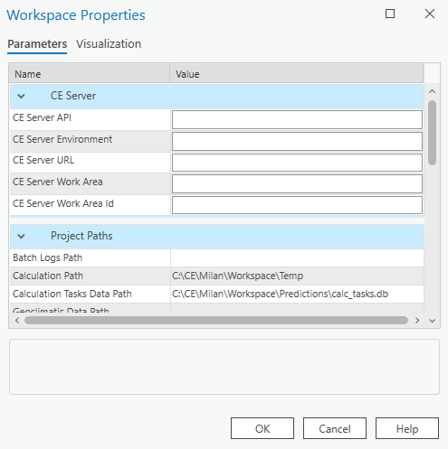
Properties.
OK
Click this button to save any changes and close the dialogue.
Cancel
Click this button to cancel any changes and close the dialogue.

Help
Get helpful information about the dialogue.
CE Server Parameters
| Parameter | Description |
|---|---|
| ArcGIS Portal URL | Connection URL to the ArcGIS Portal website. |
| CE Server API | Connection URL to Cellular Expert Server API. |
| CE Server Environment | Cellular Expert Server environment in which it is run. |
| CE Server URL | Connection URL to Cellular Expert Server. |
| CE Server Workspace | The workspace used in the Cellular Expert Server. |
| CE Server Workspace ID | The ID of the workspace which is used in the Cellular Expert Server. |
Project Paths Parameters
| Parameter | Description |
|---|---|
| Calculation Path | Path for temporary calculation results. |
| Calculation Tasks Data Path | Path for the calculation results that will be displayed in the Calculation Task List. |
| Geodata Folder Path | Path to a folder in which the geodata from the Cellular Expert Workspace is stored. |
| Prediction Path | Path for storing prediction grids. |
| Result Path | Path for storing the final calculation results |
| Volatile Calculation Path | Path for temporary Quick Prediction calculation results. |
| Volatile Result Path | Path for storing the final Quick Prediction calculation results |
| Volatile Tasks Data Path | Path for the Quick Prediction calculation results that will be displayed in the Calculation Task List. |

Project Settings Parameters
Calculate EIRP
Determines whether calculate EIRP or no in the prediction calculations.
• Value YES. EIRP will be calculated based on Power, Antenna Gain and Misc. Loss values.
• Value NO. EIRP will be taken as single value defined in Power field.
Enable GPU Acceleration
Enables GPU Accelerations that optimizes the prediction calculations and makes them run faster. Possible
values Yes/No.
Transmit Power Units
Represents power value in dBm or Watts.
Receiver/Transmitter Height Reference
The reference raster for calculating the receiver’s and transmitter’s height for these calculations: Profile, RF

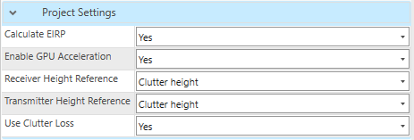
Predictions, Quick Predictions, Visibility and other prediction tools. Possible values:
• Elevation – reference layer will be used elevation.tif raster. This is a default parameter.
• Clutter height – reference layer will be used clutterHeight.tif raster. Receiver/transmitter height will
be calculated over Clutter Height raster. clutterHeight.tif raster is a must to enable this parameter.
• Clutter height (buildings only) – Height reference is calculated using the Building class from the
clutterClasses.tif raster. The Building class is defined in the Clutter Class dialog and linked to a
specific clutter class ID in the clutterClasses.tif raster.
• Absolute – receiver and/or transmitter’s absolute height (relative to sea level) will be used in
relevant calculations.
Use Clutter Loss
Determines whether clutterClasses.tif and clutterHeight.tif rasters are used in prediction calculations.
Possible values Yes/No.
Rounding
The rounding value for different parameters.

6.1.6.2 Visualization
The Cellular Expert network objects (Sites, Cells, OMEN) and calculation result rasters are represented in

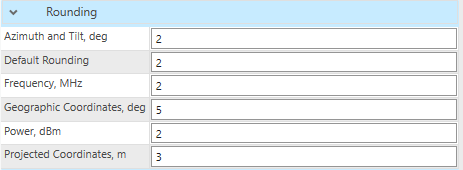

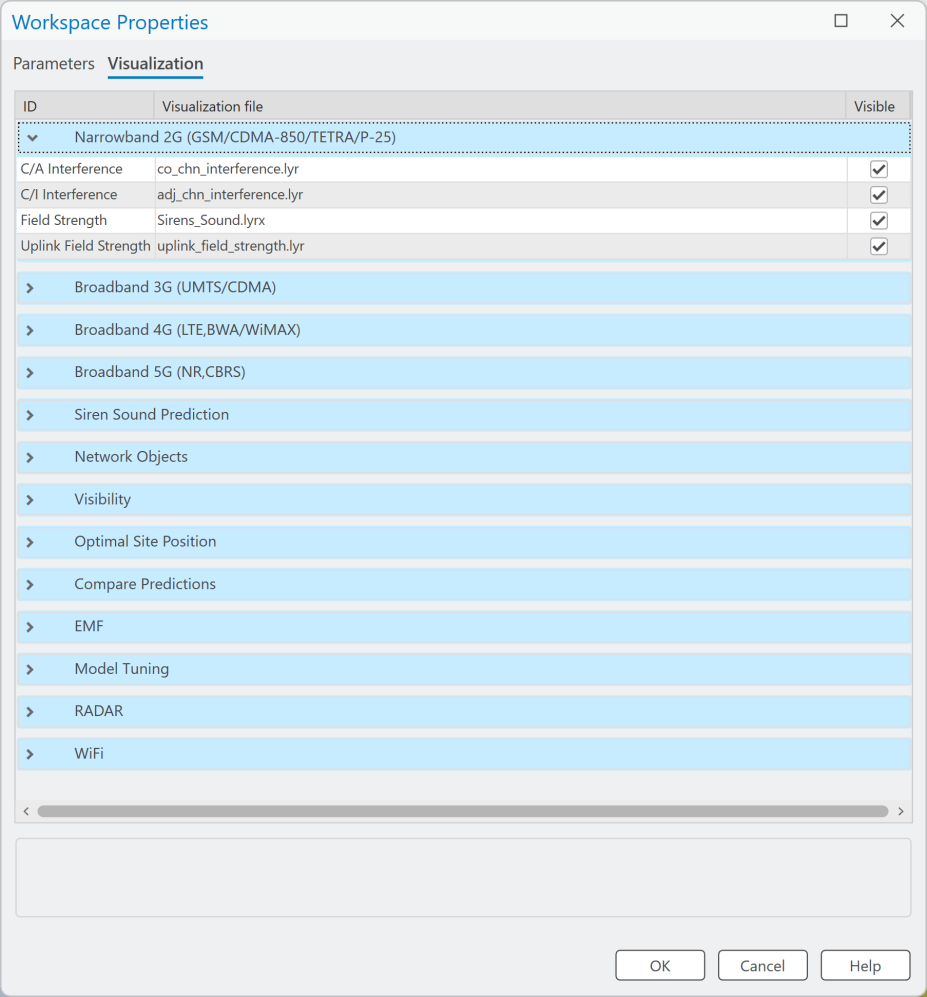
ArcGIS with the symbology as defined in the .lyr files, located in the Visualization tab (“CE_LAYERS”
table).

OK
Click this button to save any changes and close the dialogue.
Cancel
Click this button to cancel any changes and close the dialogue.
Help
Get helpful information about the dialogue.
All visualization settings have the “Visible” option set to On by default. Suppose the Visible option is set to
off, the next time a relevant calculation is performed. In that case, the rasters associated with the calculation
are added to the map with the visibility disabled. This is done only for the calculations performed after the
setting is changed, and does not impact already added rasters on the map.
The symbology is defined as a list of Layers and .lyr files:
• Narrowband 2G (GSM/CDMA-850/TETRA/P-25) – second generation network (like GSM) calculations
or technology-independent calculations (for example, the symbology for antenna loss by tilt is defined
by the same file for WiMAX, LTE, and other technology)
• Broadband 3G (UMTS/HSDPA) – results for UMTS, HSDPA and other 3 - 3.5 generation technologies
• Broadband 4G (LTE, BWA/WiMAX) – results of LTE technology calculations
• Broadband 5G (NR, CBRS) – results of 5G-NR technology calculations
• Siren Sound Prediction – results of sirens calculations
• Network objects – Sites, Cells, OMEN
• Visibility – results of Visibility Calculations
• Optimal Site Position – results of optimal site positioning.
• Compare predictions – the results of comparing several predictions.
• Model Tuning – results of model calibration
• Radar – results of radar coverage calculations
• Wi-Fi – results of Wi-Fi coverage calculations
For example, the layer 4G Downlink Throughput with defined path dl_ul_throughput.lyr means that the 4G
downlink bitrate prediction raster will be represented in ArcGIS using the symbology file …/Cellular
Expert/Layers/dl_ul_throughput.lyr
Note: if you change the symbology with ArcGIS tools, it will be saved only in the current ArcGIS project. So,
when you re-open the same Cellular Expert workspace in another ArcGIS project, the symbology will be
defined in the Visualization tab of the Workspace Properties dialogue.
To create a new visualization and locate it in the Workspace Properties:
• Right-click on the layer with the modified symbology (for example Sites) in the ArcGIS Table Of
Contents
• Choose Sharing > Save As Layer File… from the opened menu
• Save the file with a given name (for example Sites_my_symbol.lyrx)
• Copy/Paste it to C:\Program Files\Cellular Expert\Layers
• Open the Cellular Expert workspace in which you want to use your symbology
• Open the Workspace Properties dialogue and select the Visualization tab
• Select the row with the corresponding layer name (for example Sites)

• Click the browse button and locate your layer file (for example “C:\Program Files\Cellular
Expert\Layers\Sites_my_symbol.lyrx”) which contains the modified symbols. Press the OK button.
• The symbology for the Cellular Expert network objects (Sites, Cells, OMEN) will be applied to the layers
when you open the workspace next time. To see the changes immediately re-open the workspace
(close it using the Remove option and open it again with the Open option from the workspace menu)
The new symbology will be uploaded and remain assigned to the workspace database independently of
the ArcGIS project file.
When you use layer files for visualization, do not forget about them. Remember that when you move your
workspace to another location, the location path settings can become incorrect. If Cellular Expert is not able
to find your defined symbology file, it will use the default file from the location .../Cellular Expert/Layers.

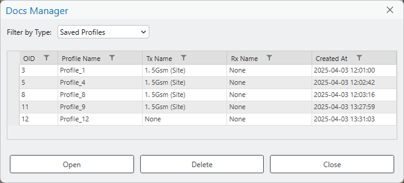

### 6.2 Docs Manager
Docs Manager is a tool for managing Saved Profiles between the transmitter (Tx) and receiver (Rx), which
are generated in the Profile tool, as well as saved Link Prediction results, Profile Reports, and Link
Prediction Reports. When a profile is saved in the Profile tool, it is automatically stored in Docs Manager,
allowing users to reopen it at any time. This ensures that all parameters and calculations related to Tx and
Rx are preserved for future reference, eliminating the need to reconfigure settings repeatedly. The same
applies for Link Prediction results, and the Reports can be opened if the original exported document is, for
example, deleted from Desktop or other saved location.
How to Find a Saved Profile
Use the filter option for each field to quickly locate the required profile from the list.

How to Open a Profile
A saved profile can be accessed in two ways:

1. Double-click on the desired profile.

2. Select the profile and click Open.
Additional Functions
• Delete: Removes the selected profile.
• Close: Closes the Docs Manager dialog.
By using Docs Manager, users can efficiently store and retrieve profiles, ensuring consistency and accuracy

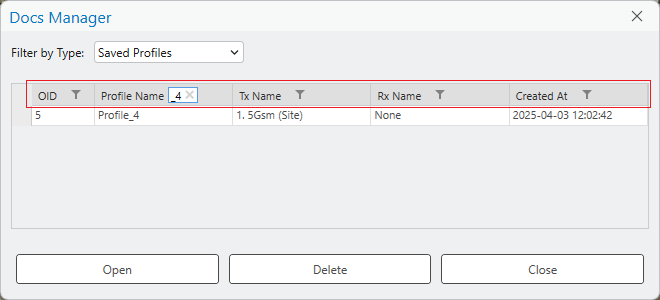

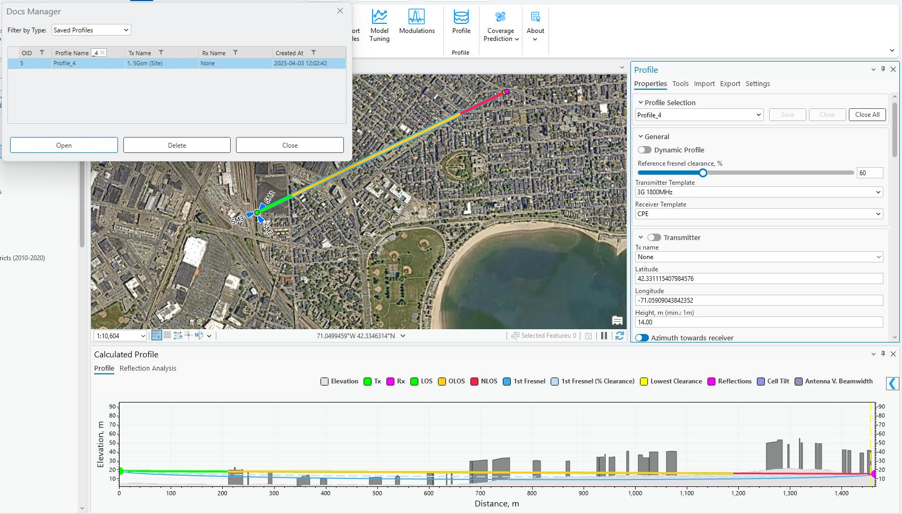
in their Tx and Rx calculations.

How to Open a Link Prediction
A saved Link Prediction, just like Profile, can be accessed either by double-clicking the desired Link

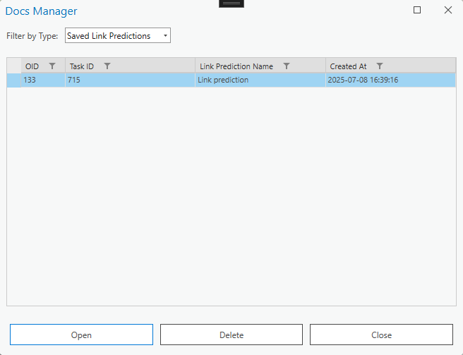

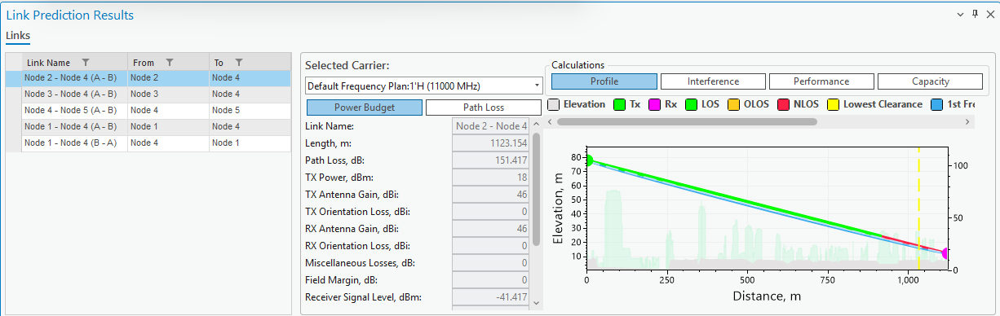
Prediction result, or by select it and clicking Open.
How to Save a Link Prediction
Link Prediction result can be saved to Docs Manager by selecting Save result to Docs Manager in the
Link Prediction tool.

How to Open a Profile Report
A Profile Report document can be accessed either by double-clicking the desired Profile Report, or by select

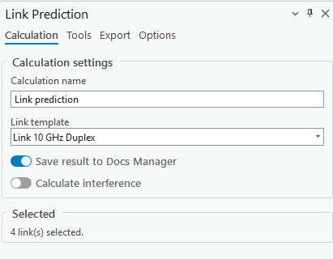

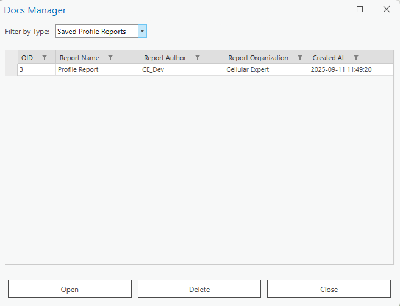
it and clicking Open. The document will be opened using your default PDF document reader.
How to Save a Profile Report
Profile Report of the current drawn profile can be saved to Docs Manager by selecting Save result to Docs
Manager in the Export tab of the Profile tool.

How to Open a Link Prediction Report
A Link Prediction Report document can be accessed either by double-clicking the desired Link Prediction

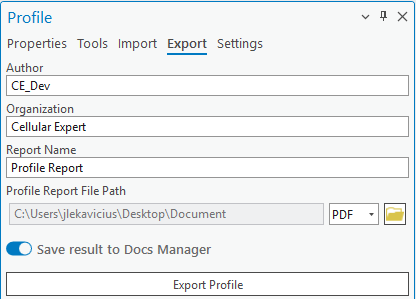

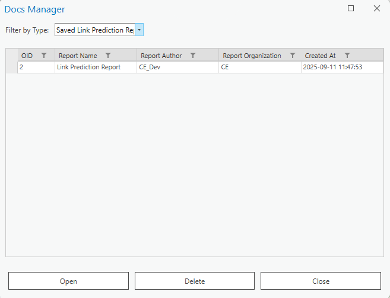
Report, or by select it and clicking Open. The document will be opened using your default PDF document
reader.
How to Save a Link Prediction Report
Link Prediction Report can be saved to Docs Manager by selecting Save result to Docs Manager in the
Export tab of the Link Prediction tool.

### 6.3 CE Express Connection
CE Express Connection is a tool that lets you establish a connection between the CE Express database
and CE for ArcGIS Pro. When the connection is established, data can be retrieved from CE Express and
uploaded to CE for ArcGIS Pro workspace.
For the connection to be established you must have access to ArcGIS Portal and have a valid CE Express
URL.

#### 6.3.1 Properties
Click the button and select the Properties tab to open the CE Express Connection dialogue.
To connect to CE Server Express and get the list of workspaces, insert the Server URL in the corresponding
field. Then press the Get Workspaces button.
If you select one of the appearing workspaces, the properties of that workspace will be saved to your current

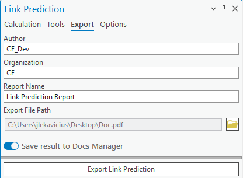

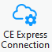
ArcGIS Pro project automatically.

| Parameter | Description |
|---|---|
| Server URL | The URL to the CE Express database where the workspaces will be located. This parameter must be defined to connect to the database. |
| Server ArcGIS Portal URL | The URL to your organization’s ArcGIS Portal (filled in automatically). |
| Server API URL | The API is used in the connection process (filled in automatically). |
| Selected Workspace | The list of all workspaces was retrieved from the CE Express Database. |
Get Workspaces
Establishes the connection between the provided Server URL and CE for ArcGIS Pro. Upon clicking the
button, the user may be redirected to a browser window in which he will have to log in to the ArcGIS Portal.

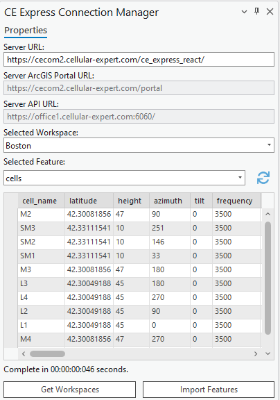
After doing so, the workspaces will be retrieved.
Import Features
Imports the retrieved objects to the currently opened CE workspace.

## 7. Data Management

### 7.1 Network Objects
Cellular Expert network objects are:
Sites – represent the geographical location of a radio station. They are identified by the unique site ID and

contain information about the geographical coordinates, ground altitude, and base height.
Cells – primary network object for prediction calculations. They denote the carrier list, equipment
information, height, and other common radio channel parameters.
Sirens – represent siren objects and their geographical locations on the map. They contain essential
parameters required for siren prediction.
Links – represents a radio connection between a transmitter and a receiver. It can be established between
the selected transmitter and receiver. The link operates at a fixed frequency from the transmitter's carriers
list. Available within CE RLP license.
Repeaters – represents the geographical location of a signal repeater. Only used for microwave point-to-
point network planning using Links.
CPE – stands for Customer Premises Equipment and represents the geographic location of a client.
Radar – represents the geographical location of a radiolocation system that uses radio waves to determine
the distance, angle, and radial velocity of objects.
With the data management tools located in the Data Management section, you can view and edit the
Cellular Expert network objects.
Note: most of these tools work only in editing sessions on the currently active workspace.

### 7.2 Add Object
New network objects can be created in several ways. They can be:
• Imported using the CE for ArcGIS Pro functionality
• Created with Cellular Expert tools from zero (define all parameters in the process)

• Created from templates

#### 7.2.1 Add Cell
The object represents both physical parameters (e.g., height, antenna, azimuth) and logical parameters
(e.g., bandwidth, frequency, technology). Essentially, it is similar to a Sector object but is referred to as a

Cell and includes additional details about cell-specific parameters. This object serves as the primary
element for performing coverage predictions and supports various technologies, including 2G, 3G, 4G, 5G,
and WiFi. It is also utilized in critical networks like TETRA, APCO, P-25, and military applications to model
antenna coverage within a specific area.
For Mobile Operator case, if one sector has several carriers, as an example 3 carriers, then 3 cells should
be created in CE database. For example:

1. Choose the button from the toolbar and select Cells from the dropdown list.
Cell objects are used for prediction calculations.

1. Left-clicking on the map will define the location of the object. To define its direction, left-click a
second time in your preferred direction.
Add Object > Cell dialog will be filled with coordinates and parameters from default template, and azimuth

value based on defined direction on the map.
The Cell object can be created by entering exact coordinates in:
• Latitude (degrees) and Longitude (degrees) section.

• Latitude and Longitude
• X and Y (projected coordinate system)

2. The parameters can be changed at once by using different templates, which are available within

the default database. More about template management in 7.8. Template Manager topic.

3. Define Name for new Cell object.

4. Press Save Changes to save Cell object to the database.

| Parameter | Description |
|---|---|
| Save Changes | Creates the object with the given parameters. |
| Dismiss | Cancels object creation and closes the dialogue. |
| View Antenna | Opens the Antenna Viewer with the corresponding antenna patterns. |
Cell Properties
| Parameter | Description |
|---|---|
| Template | The template will fill all empty or not specified fields with default values that are not necessary for predictions. |
| Name | Cell identification. |
| Latitude (degrees) | Latitude degrees, minutes, and seconds Y type coordinate in the WGS 1984 geographical coordinate system. |
| Longitude (degrees) | Longitude degrees, minutes, and seconds X type coordinate in the WGS 1984 geographical coordinate system. |
| Latitude | Decimal degrees Y type coordinate in the WGS 1984 geographical coordinate system. |
| Longitude | Decimal degrees X type coordinate in the WGS 1984 geographical coordinate system. |
| X | Coordinate in the projected coordinate system. |
| Y | Coordinate in the projected coordinate system. |
| Z | 3D dimensions representing an object's height above sea level, used for visualizing objects in a 3D scene. |
| Ground Altitude | Ground elevation above sea level at the network object's location. |
| Azimuth | Cell direction from the North in degrees. |
| Site ID | Describes to which Site the Cell belongs. |
| Tilt | Mechanical tilt value. |
| Frequency | Frequency value in MHz. |

| Parameter | Description |
|---|---|
| Frequency Group | Used to divide calculations into parts. If the selection range includes two or more different frequency group values, the cells won’t be predicted together. |
| EIRP | This value is not editable. It represents the total radiated power for the Cell object and is automatically calculated based on Power, Miscellaneous Loss, Antenna Gain, and Tx MIMO. |
| Power | Power value in dBm. |
| Antenna Gain | The parameter can be left empty because the value will be taken automatically from the defined antenna. |
| Misc Loss | Miscellaneous loss value in dB. |
| Bandwidth | Value in MHz. Required for 4G and 5G technologies. For other technologies define the value as 0.015. |
| Noise Figure | Value in dB. Required for 4G and 5G technologies. |
Downlink Duplex Factor
Value range from 0 to 1. Required for Duplex mode TDD, which is applicable for 4G and 5G technologies,
and used for Downlink Throughput calculations. For example, if defined value is 0.7, then 70% of available
bandwidth will be dedicated to Downlink, and 30% - for Uplink.
| Parameter | Description |
|---|---|
| Subcarrier Spacing | Value in kHz. Required for 4G and 5G technologies. For other technologies define value 15. |
| Tx Mimo | Transmitter antenna count. Available values: 1, 2, 4, 8, 16, 32 and 64. |
| Rx Mimo | Receiver antenna count. Available values: 1, 2, 4, 8, 16, 32 and 64. |
Active Antenna Effect
The parameter is dedicated to smart antenna modeling. The default value is 0, but if massive MIMO is
used, a smart antenna effect can be included to lower the interference and boost throughput.
Recommended values:
• For MIMO 32x32 – value 6.
• For MIMO 64x64 – value 9.
Cell Load
The parameter is described in percentages and varies from 0 to 100. It describes how the cell is loaded.
The Cell load affects RSSI, RSRQ, and DL Throughput calculations. For example, if the Cell load is higher,
the DL Throughput is lower.
Network Name
Divides cells into networks. Helps to manage different technologies and frequencies in the project, and

automatically tracks changes for cells.
| Parameter | Description |
|---|---|
| Technology | Describes the technology of the network object. Possible values are 2G, 3G, 4G, and 5G. |
| Duplex Mode | Available values FDD or TDD. Required for 4G and 5G technologies. For other technologies define value FDD. |
| Antenna | Define antenna patterns for the Cell object. |
Carriers
Describes the carrier values and is used for 2G calculations: C/I interference and C/A interference. Values
must be written in []. If more than one value is defined, it must be separated by a comma, for example [1,
5]. If there is no carrier information, the value [] must be defined.
Select Model
Prediction model for Path Loss simulation.
7.2.1.1 Assign Cell object to Site
The cell object can be created on top of Site object, or near it with the possibility to assign Site ID value for

that Cell.
Open Add Cell function.
Moove mouse coursor on top of Site object, and mouse will be automatically snapped to that Site.

Define direction, similary as creating Cell object on empty location. Site ID will be automatically assigned

to this new Cell.
7.2.1.2 Add several Cells in same position.
Once Cell is created, do not close the dialog.
Simply change Name and Azimuth parameters (and if required, adjust other parameters), and press Save
Changes. New Cell object will be created on the same location.

Do it again, if you required additional Cell objects in the same location.
7.2.1.3 Add Cells on the corner of the buildings
The cells can be created on the corner of the building and assigned to the same Site.

Site ID parameter should be adjusted for every cell.

#### 7.2.2 Add Site
The object represents Tower or Site location. It carriers several parameters, such as Site Name, coordinate

or height. It is used only in 4G or 5G carrier aggregation calculation, when Total Downlink Throughput is
calculated.

1. Choose the button from the toolbar and select Site from the dropdown list.

2. Define the location of the new Site by pressing the mouse left button on the map. The new Site
will be placed right in that location.

The Site object can be created by entering exact coordinates in:
• Latitude (degrees) and Longitude (degrees) section.
• Latitude and Longitude
• X and Y (projected coordinate system)

3. Define Site name and press Save Changes to save object to the database.
Save Changes
Creates the object with the given parameters.
Dismiss
Cancels object creation and closes the dialogue.
Site Properties
| Parameter | Description |
|---|---|
| Name | Site identification. |
| Latitude (degrees) | Latitude degrees, minutes, and seconds Y type coordinate in the WGS 1984 geographical coordinate system. |
| Longitude (degrees) | Longitude degrees, minutes, and seconds X type coordinate in the WGS 1984 geographical coordinate system. |
| Latitude | Decimal degrees Y type coordinate in the WGS 1984 geographical coordinate system. |
| Longitude | Decimal degrees X type coordinate in the WGS 1984 geographical coordinate system. |
| X | Coordinate in the projected coordinate system. |
Y

Coordinate in the projected coordinate system.
Z
3D dimensions representing an object's height above sea level, used for visualizing objects in a 3D scene.

Height Above Ground
Object’s height above the terrain.
Ground Altitude
Ground elevation above sea level at the network object's location.

#### 7.2.3 Add Radar
Radar object is used for Radar Prediction tool, which does theoretical radar coverage calculations and
provides the results in the project.

1. Choose the button from the toolbar and select Radar from the dropdown list.

2. Define the location of the new Radar by pressing the mouse left button on the map. The new Radar
will be placed right in that location.
The Radar object can be created by entering exact coordinates in:
• Latitude (degrees) and Longitude (degrees) section.
• Latitude and Longitude

• X and Y (projected coordinate system)

3. Define Radar name and press Save Changes to save object to the database.

Save Changes
Creates the object with the given parameters.
Dismiss
Cancels object creation and closes the dialogue.

Radar Properties
| Parameter | Description |
|---|---|
| Template | The template will fill all empty or not specified fields with default values that are not necessary for predictions. |
| Name | Radar identification. |
| Latitude (degrees) | Latitude degrees, minutes, and seconds Y type coordinate in the WGS 1984 geographical coordinate system. |
system.

| Parameter | Description |
|---|---|
| Longitude (degrees) | Longitude degrees, minutes, and seconds X type coordinate in the WGS 1984 geographical coordinate system. |
| Latitude | Decimal degrees Y type coordinate in the WGS 1984 geographical coordinate system. |
| Longitude | Decimal degrees X type coordinate in the WGS 1984 geographical coordinate system. |
| X | Coordinate in the projected coordinate system. |
| Y | Coordinate in the projected coordinate system. |
| Z | 3D dimensions representing an object's height above sea level, used for visualizing objects in a 3D scene. |
| Height Above Ground | Object’s height above the terrain. |
| Ground Altitude | Ground elevation above sea level at the network object's location. |
| Azimuth | Direction from the North in degrees. |
| View Angle | Visible field (vertical angle) of the radar in degrees. |
| Template | The template will fill all empty or not specified fields that are necessary for predictions. |
| Frequency | Frequency value in MHz. |
| Tilt | Mechanical tilt value. |
| Power (Optional) | Power value in dBm. |
| Antenna Gain (Optional) | Antenna gain value from the applied antenna. |
| Misc Loss (Optional) | Miscellaneous loss value in dB. |
EIRP
Total cell power in dBm. This parameter is used for the calculations. The value can be generated from the
power, antenna_gain, and misc_loss values automatically, or written directly leaving the power,
antenna_gain, and misc_loss fields empty.

Prediction Model
Prediction model for Path Loss simulation.

#### 7.2.4 Add Sirens
A Siren object in the software represents a sound-emitting device used for warning and alerting purposes.

The software calculates the siren's sound level based on parameters such as power, frequency,
environmental conditions, and distance. It allows users to analyze sound propagation, ensuring effective
coverage for emergency and safety applications.

1. Choose the button from the toolbar and select Sirens from the dropdown list.

2. Left-clicking on the map will define the location of the object. To define its direction, left-click a
second time in your preferred direction.
The Siren object can be created by entering exact coordinates in:
• Latitude (degrees) and Longitude (degrees) section.
• Latitude and Longitude
• X and Y (projected coordinate system)

3. Define Siren name and press Save Changes to save object to the database.
| Parameter | Description |
|---|---|
| Save Changes | Creates the object with the given parameters. |
| Dismiss | Cancels object creation and closes the dialogue. |
| View Antenna | Opens the Antenna Viewer with the corresponding antenna patterns. |
Siren Properties
Template
The template will fill all empty or not specified fields with default values that are not necessary for

predictions.
Name
Siren identification.

| Parameter | Description |
|---|---|
| Latitude (degrees) | Latitude degrees, minutes, and seconds Y type coordinate in the WGS 1984 geographical coordinate system. |
| Longitude (degrees) | Longitude degrees, minutes, and seconds X type coordinate in the WGS 1984 geographical coordinate system. |
| Latitude | Decimal degrees Y type coordinate in the WGS 1984 geographical coordinate system. |
| Longitude | Decimal degrees X type coordinate in the WGS 1984 geographical coordinate system. |
| X | Coordinate in the projected coordinate system. |
| Y | Coordinate in the projected coordinate system. |
| Z | 3D dimensions representing an object's height above sea level, used for visualizing objects in a 3D scene. |
| Height Above Ground | Object’s height above the terrain. |
| Ground Altitude | Ground elevation above sea level at the network object's location. |
| Azimuth | Direction from the North in degrees. |
| Frequency | Frequency value in Hz. |
| Tilt | Mechanical tilt. |
| Antenna | Antenna name for Siren object. |
| Power | A power value in W. |
| Misc loss | Miscellaneous loss value in dB. |
| Prediction Model | Only ISO9613 can be applied to calculate sound loss for the siren. 7.2.5 Add CPE The object represents customer locations. It carrries information about customer location, name, height or |

installed antenna.

1. Choose the button from the toolbar and select CPE from the dropdown list.

2. Left-clicking on the map will define the location of the object. To define its antenna direction, left-

click a second time in your preferred direction.
The CPE object can be created by entering exact coordinates in:
• Latitude (degrees) and Longitude (degrees) section.
• Latitude and Longitude
• X and Y (projected coordinate system)

3. Define CPE name and press Save Changes to save object to the database.
Save Changes
Creates the object with the given parameters.
Dismiss
Cancels object creation and closes the dialogue.
View Antenna

Opens the Antenna Viewer with the corresponding antenna patterns.
CPE Properties
Name
CPE identification.
Latitude (degrees)
Latitude degrees, minutes, and seconds Y type coordinate in the WGS 1984 geographical coordinate

system.

| Parameter | Description |
|---|---|
| Longitude (degrees) | Longitude degrees, minutes, and seconds X type coordinate in the WGS 1984 geographical coordinate system. |
| Latitude | Decimal degrees Y type coordinate in the WGS 1984 geographical coordinate system. |
| Longitude | Decimal degrees X type coordinate in the WGS 1984 geographical coordinate system. |
| X | Coordinate in the projected coordinate system. |
| Y | Coordinate in the projected coordinate system. |
| Z | 3D dimensions representing an object's height above sea level, used for visualizing objects in a 3D scene. |
| Height Above Ground | Object’s height above the terrain. |
| Ground Altitude | Ground elevation above sea level at the network object's location. |
| Azimuth | Direction from the North in degrees. |
| Cell ID | Describes to which Cell the CPE point belongs. |
| Template | A template that will fill all empty or not specified fields that are necessary for predictions. |
| Antenna | Antenna name for CPE location. |
| Throughput | The speed at which data is transferred. Measured in Mb/s. |
| Status | Current status of the network object. |
| Notes | Additional information for network predictions can be noted here. |

#### 7.2.6 Add Repeater
A repeater is a device used to extend wireless coverage by amplifying and retransmitting signals between
a base station and mobile devices. In 2G technology, repeaters help enhance signal strength in areas with
weak coverage, such as remote or obstructed locations. For multipoint applications, repeaters can support
communication across multiple user devices within their range, ensuring consistent connectivity and
improved service quality.

4. Choose the button from the toolbar and select Repeater from the dropdown list.

5. Left-clicking on the map will define the location of the object. To define its antenna direction, left-

click a second time in your preferred direction.
The Repeater object can be created by entering exact coordinates in:
• Latitude (degrees) and Longitude (degrees) section.
• Latitude and Longitude
• X and Y (projected coordinate system)

6. Define Repeater name and press Save Changes to save object to the database.

| Parameter | Description |
|---|---|
| Save Changes | Creates the object with the given parameters. |
| Dismiss | Cancels object creation and closes the dialogue. |
| View Antenna | Opens the Antenna Viewer with the corresponding antenna patterns. |

Repeater Properties
| Parameter | Description |
|---|---|
| Template | The template will fill all empty or not specified fields with default values that are not necessary for predictions. |
| Name | Repeater identification. |
| Latitude (degrees) | Latitude degrees, minutes, and seconds Y type coordinate in the WGS 1984 geographical coordinate system. |
| Longitude (degrees) | Longitude degrees, minutes, and seconds X type coordinate in the WGS 1984 geographical coordinate system. |
| Latitude | Decimal degrees Y type coordinate in the WGS 1984 geographical coordinate system. |
| Longitude | Decimal degrees X type coordinate in the WGS 1984 geographical coordinate system. |
| X | Coordinate in the projected coordinate system. |
| Y | Coordinate in the projected coordinate system. |
| Z | 3D dimensions representing an object's height above sea level, used for visualizing objects in a 3D scene. |
| Height Above Ground | Object’s height above the terrain. |
| Ground Altitude | Ground elevation above sea level at the network object's location. |
| Azimuth | Direction from the North in degrees. |
| Technology | Describes the technology of the network object. Possible values are 2G, 3G, 4G, and 5G. |
| Frequency | Frequency value in MHz. |
| Tilt | Mechanical tilt in telecommunications repeaters is the physical angling of the antenna to optimize signal coverage. |
| Electrical Tilt | Electrical tilt in a repeater refers to the electronic adjustment of an antenna's vertical radiation pattern to optimize network coverage and reduce interference. |

| Parameter | Description |
|---|---|
| Antenna | Antenna name for Repeater object. |
| Thresholds 1, 2, 3 | The threshold of signal strength. The three parameters must be written in decreasing order. If an antenna threshold is less than one of the threshold parameters, then the next threshold parameter will be evaluated. |
| Power 1, 2, 3 | A power that is assigned to cells based on the repeater thresholds and cell signal strength. When the cell’s signal strength is categorized the power of the repeater will be assigned as well. |
| Threshold | Power maximum threshold. |
| Misc loss (Optional) | Miscellaneous loss value in dB. |
| Bandwidth | Value in MHz. Required for 4G and 5G technologies. For other technologies define the value as 0.015. |
| Subcarrier Spacing | Value in kHz. Required for 4G and 5G technologies. For other technologies define value 15. |
| Tx Mimo | Transmitter antenna count. Available values: 1, 2, 4, 8, 16, 32 and 64. |
| Rx Mimo | Receiver antenna count. Available values: 1, 2, 4, 8, 16, 32 and 64. |
| Prediction Model | Lets the user select which prediction model and configuration should be used for calculations. |

### 7.3 Object Editor
The Object Editor enables the user to make changes to a network object after it is created and placed on
the map.
Choose the button to open the Object Editor dialogue.
Select objects by navigating to the ArcGIS Pro Edit → Selection section and choosing the Select tool. The
selected objects will appear in the Object Editor in a tree hierarchy.

To edit one of the selected objects, left-click on that object and the corresponding editing menu will open

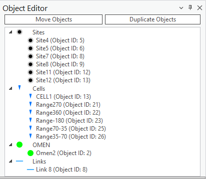

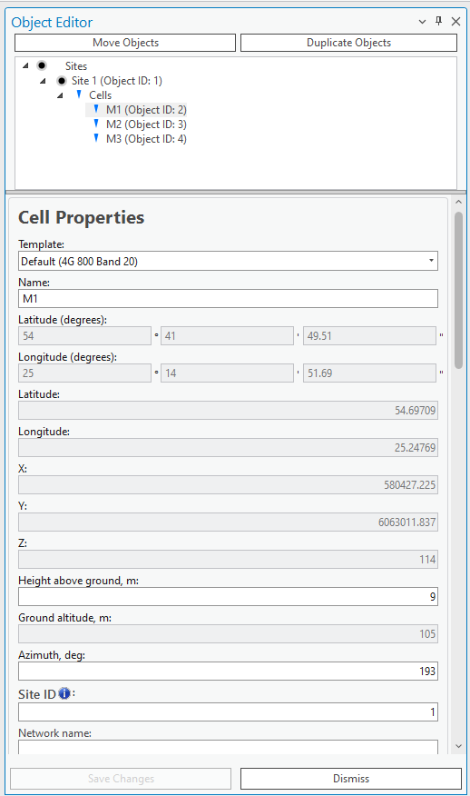
below the list.
Delete Object
Select and right-click any network object from the selection, then choose the Delete option from the popup.

Duplicate Object
Select and right-click any object from the selection, then choose the Duplicate option from the popup. The
duplicated object will retain all information from the original object including coordinates/meridians. If you

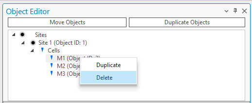

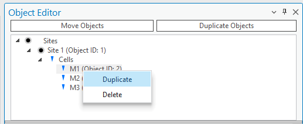
want to duplicate objects and change their coordinates/meridians at the same time, use the separate
Duplicate Objects button from above the selection tree.

#### 7.3.1 Move Objects
Choose the button to open the Object Editor dialogue. Select the desirable objects with the Select
tool and press the Move Objects button in the Object Editor.

There are multiple ways to move objects:
• If multiple objects are selected, the move objects display will show the geospatial properties of the

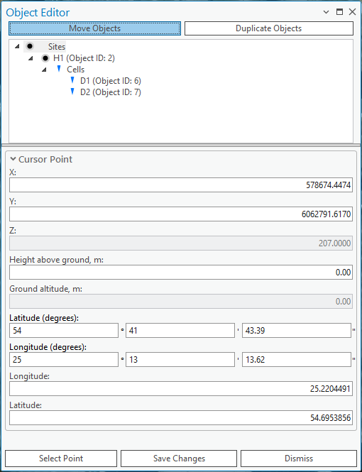
center point between the objects denoted as the “Cursor point”.

The "Cursor Point" functions as a reference marker depicted by a red dot on the map. This marker is
centrally located among the objects on the map and shows where the cursor was placed. You can adjust
the position of the Cursor Point either by entering new coordinates directly or by clicking “Select Point” and

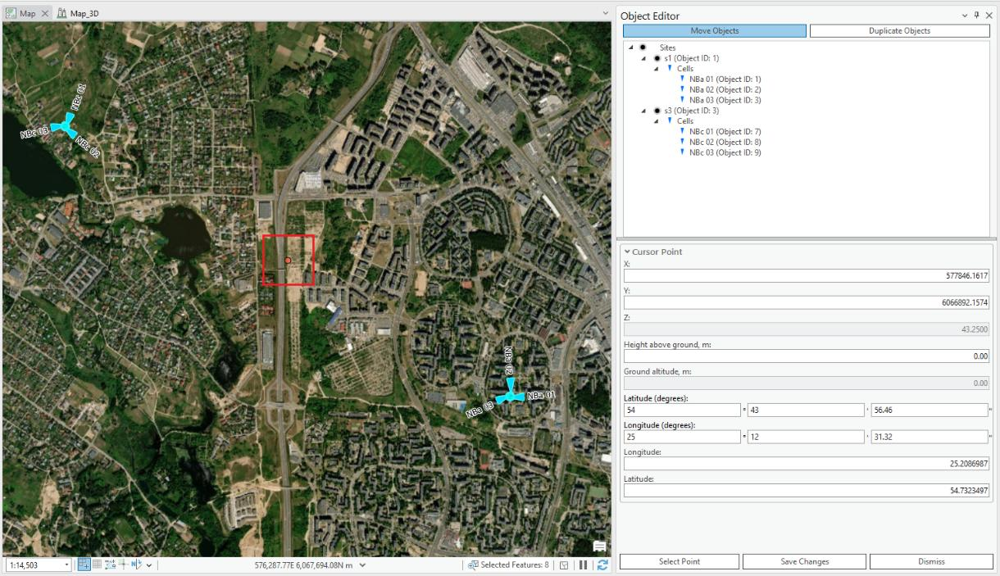

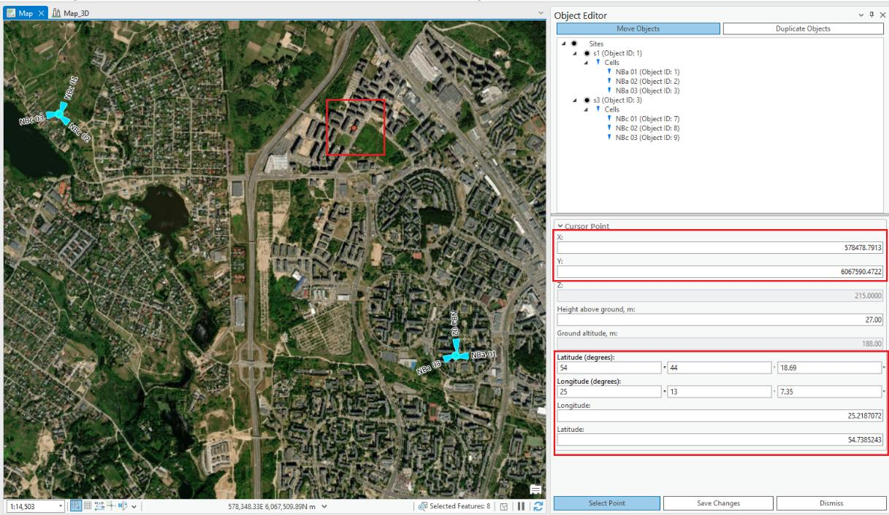
choosing a different location on the map. When you move the Cursor Point, all the objects on the map will
shift their position to maintain their relative distances from this central point.
• If a single point object is selected or several objects at the same location, the move objects display

will show the geospatial properties of these objects denoted as “Cursor Point”.
If a single point object is selected on the map, the "Cursor Point" serves as its positional anchor. Positioned

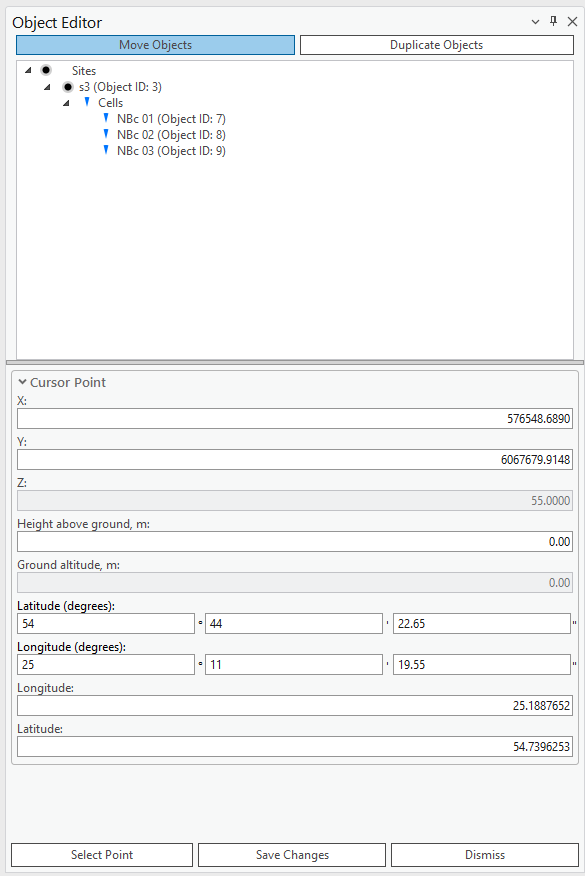
as a red dot, the Cursor Point represents the current coordinates of the selected object and shows where
the cursor was last placed. You can alter the location of the selected object by manually updating the Cursor
Point's coordinates or by clicking “Select Point” and choosing a new location on the map. Any movement
of the Cursor Point will directly translate the selected object to the corresponding new location while keeping
its spatial relationship with the Cursor Point consistent.

Save Changes
Saves the changes to the objects.
Dismiss
Cancels the changes to the objects and closes the dialogue.

#### 7.3.2 Duplicate Objects
Choose the button to open the Object Editor dialogue. Select the object with the Select tool and

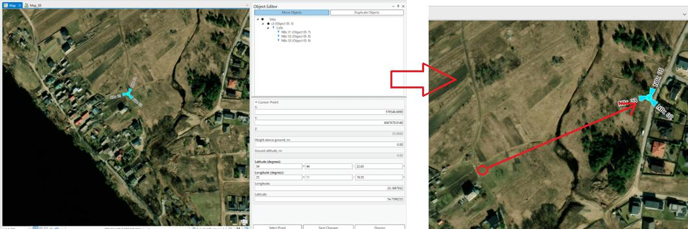

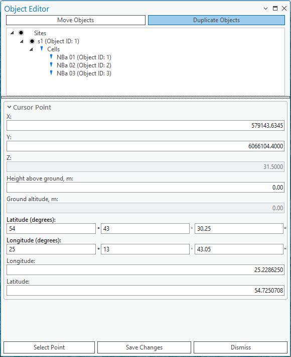
press the Duplicate Objects button in the Object Editor dialogue.

There are multiple ways to duplicate objects:
• If multiple objects are selected, the duplicate objects display will show the geospatial properties of
the center point between the objects denoted as the “Cursor point”.
The "Cursor Point" functions as a reference marker depicted by a red dot on the map. This marker is
centrally located among the objects on the map and shows where the cursor was placed. You can adjust
the position of the Cursor Point either by entering new coordinates directly or by clicking “Select Point” and

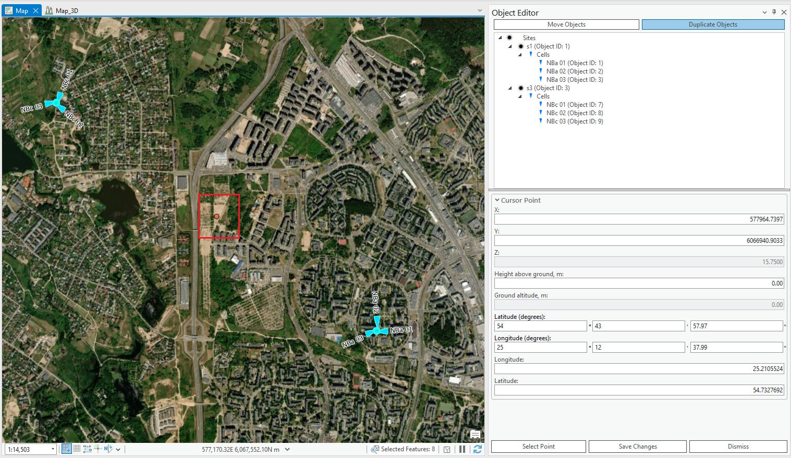
choosing a different location on the map. When you move the Cursor Point, all the objects on the map will
shift their position to maintain their relative distances from this central point.

• If a single point object or several objects on the same location are selected, the duplicate objects

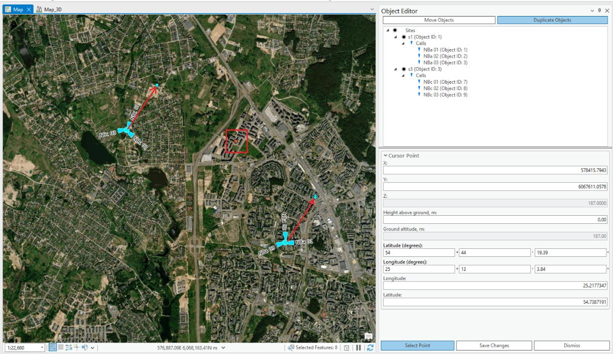

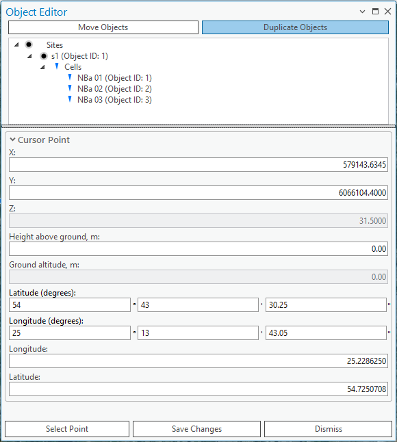
display will show the geospatial properties of that object denoted as “Cursor Point”.

If a single point object is selected on the map, the "Cursor Point" serves as its positional anchor. Positioned

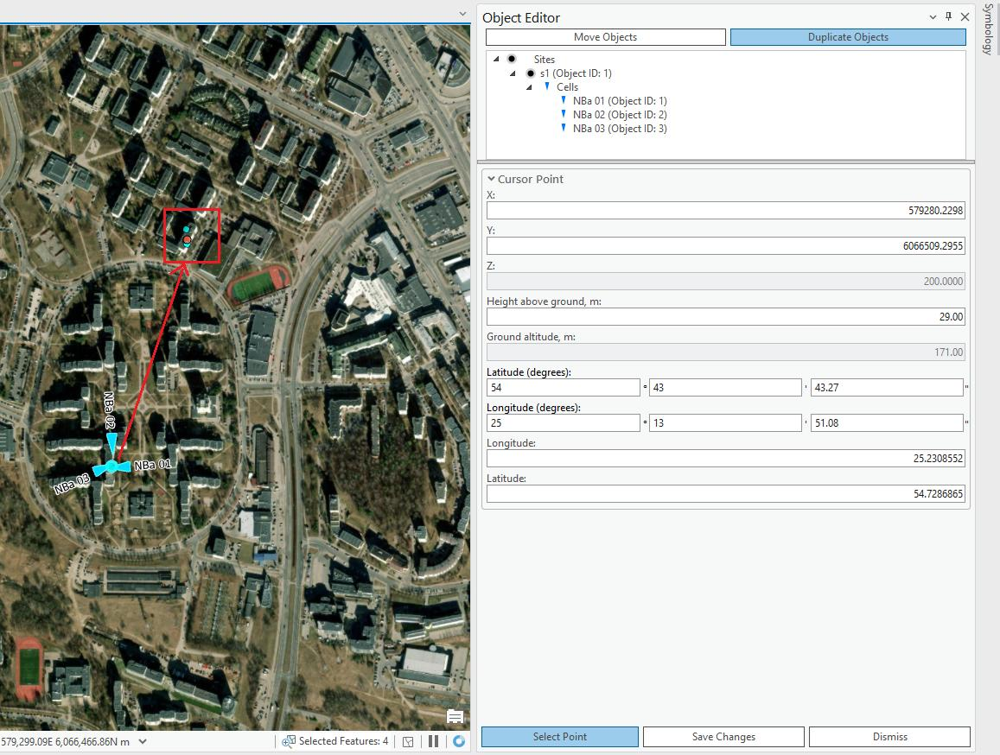

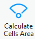
as a red dot, the Cursor Point represents the current coordinates of the selected object and also shows
where the cursor was last placed. You can alter the location of the selected object by manually updating
the Cursor Point's coordinates or by clicking “Select Point” and choosing a new location on the map. Any
movement of the Cursor Point will directly translate the selected object to the corresponding new location
while keeping its spatial relationship with the Cursor Point consistent.
Save Changes
Duplicates the objects.
Dismiss
Cancels the changes to the objects and closes the dialogue.

### 7.4 Calculate Cells Area
The Calculate Cells Area tool is designed to compute the service areas of selected cell sites within a given
map and display them as polygons in a new layer. By selecting one or more cells, users can initiate a
calculation that considers various parameters like cell azimuth, horizontal beamwidth, and antenna patterns
to generate precise coverage polygons.
Choose the button to open the Calculate Cells Area tool.

Select the cells which the calculations will be performed for, and press Run Calculation. The cell areas
will be drawn on the map, in a separate layer CE Cell Area Results. In the results group layer, the servitude

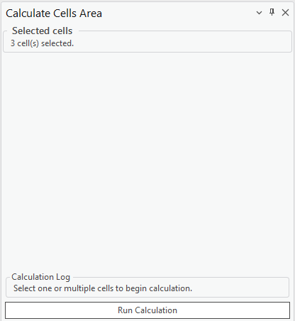

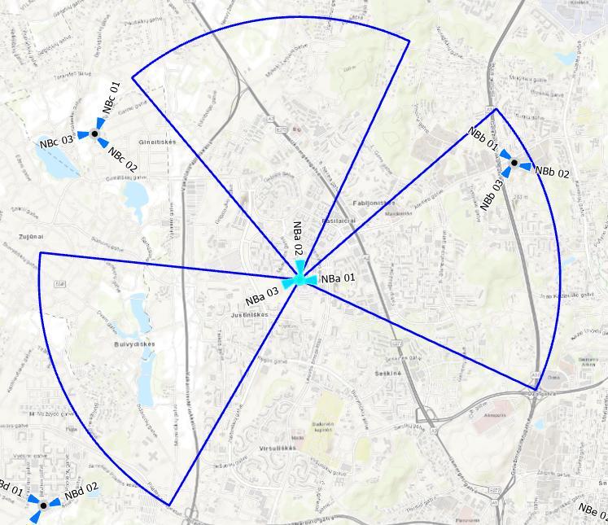

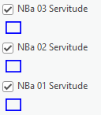
polygons can be toggled for each cell.
The polygons represent the cell area where the antenna’s horizontal pattern’s attenuation at each angle is
lower than the threshold of 3.

Maximum radius depends on defined Prediction Model, Radius value for the Cell object.
Using bigger radius:

### 7.5 Clutter Classes
The Clutter Classes tool is designed to manage categories describing different types of environments in
telecommunication networks. It relies on the Clutter Classes raster used in the project. The raster values

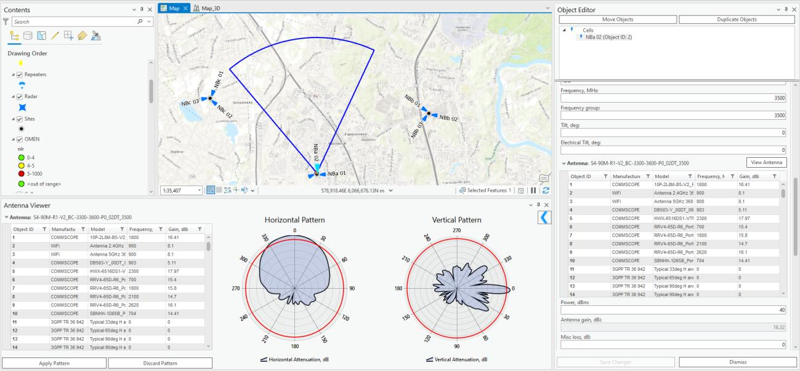

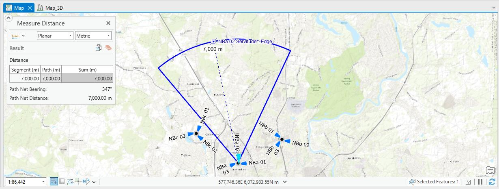
must match the ID values in the Clutter Classes dialog. For example, if "Trees" has a value of 2 in the
Clutter Classes raster, this ID must be defined in the Clutter Classes tool. By default, ESRI’s Sentinel-2
Land Use values are used after workspace creation: ESRI Sentinel-2 Land Cover

Here is the table view of Clutter table, which comes with default database.

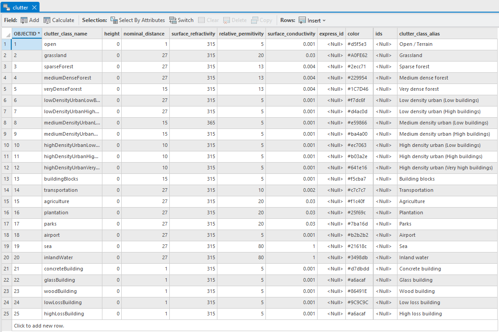

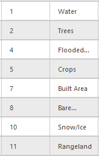

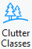
Sentinel-2 clutter classes raster provides information about these classes:
Choose the button to open the Clutter Classes dialogue.

Select one of the clutter classes to open their properties. Clutter class list can also be filtered by solid

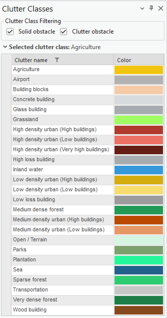
obstacle and/or clutter obstacle categories.

New mapping between land use raster and clutter class data should be done in Clutter Classes dialog.

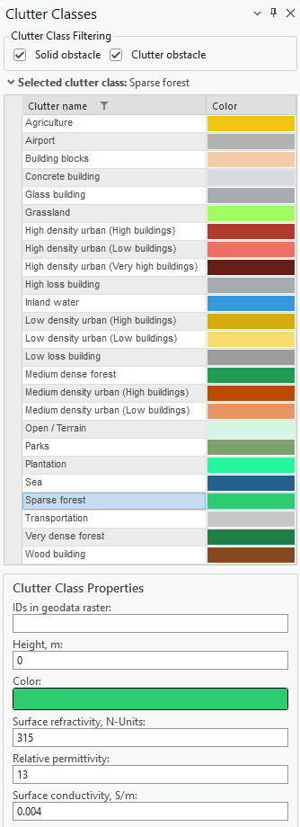
| Parameter | Description |
|---|---|
| Apply | Saves changes made to clutter classes. |
| OK | Saves changes made to clutter classes and cloes the dialogue. |
| Dismiss | Cancels clutter class changes and closes the dialogue. |

### 7.6 Antenna Viewer
The Antenna Viewer enables the user to preview the default antennae, compare their vertical and horizontal

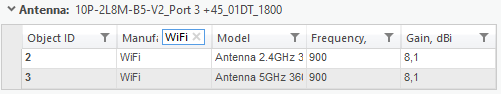

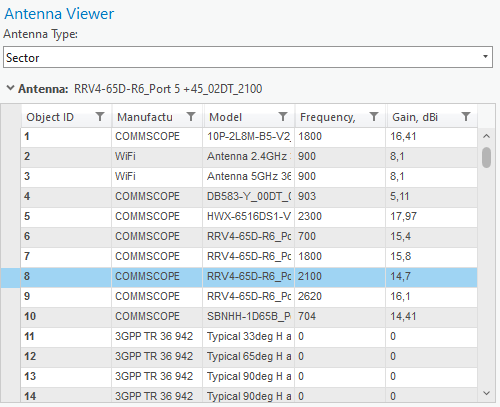
patterns as well as view the values of these patterns in a table.
Click the button to open the Antenna Viewer.
You can filter the entries of the Antenna Table by pressing the Filter symbol near one of the field names
and entering the desired filter value.

#### 7.6.1 Preview Antenna Patterns
The antenna Type dropdown list contains two antenna types: Sector and Parabolic. Sector antennas have
2 patterns and pertain to a single network object. Parabolic antennas have 4 patterns and pertain to
point-to-point network objects. In Cellular Expert these objects are Links.
To compare the horizontal and vertical patterns of an antenna in the Antenna Viewer, double-click one of
the antennas from the antenna list and the patterns as well as their corresponding values will appear.

### 7.7 Prediction Model Manager
The CE Path Loss Modelling aims to perform near-deterministic calculation of received signal levels at each
specific point (pixel) in the network’s target coverage area by applying selective path loss model depending
on the radio visibility condition between the transmitter antenna vis-à-vis a receiver antenna located at a
given point in coverage area. The radio visibility is evaluated based on the DTM, Obstacles and Clutter
path profile information, as described in previous section. This verification of radio visibility will result in the

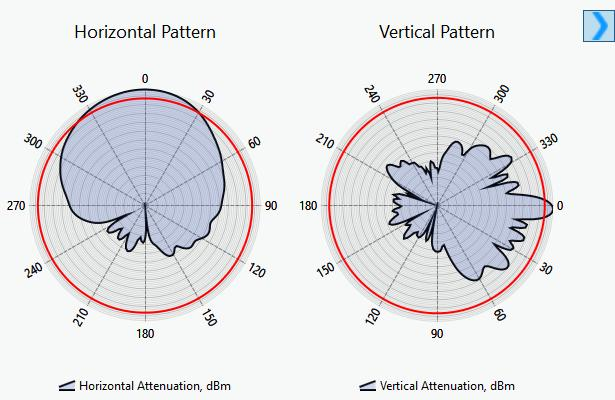

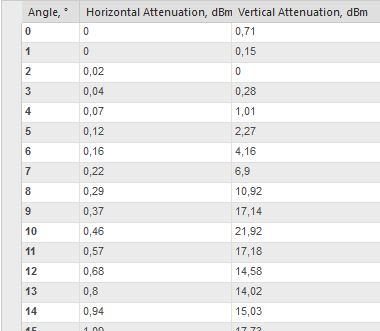

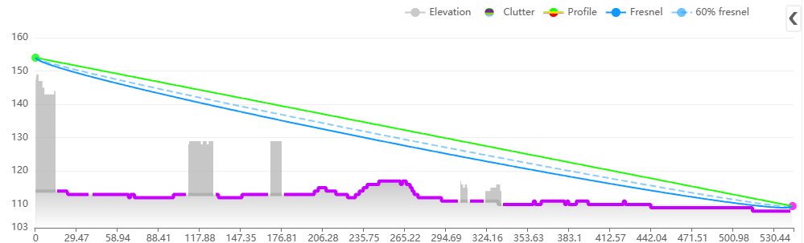
receiver antenna point assigned into one of three possible radio visibility conditions:
• Line-of-Sight (LOS) – occurs when there are neither terrain irregularities, obstacles or clutter
interposing the direct radio path between the transmitter and receiver antennas. The radio path is
understood to include the 1st Fresnel zone around the direct line and account for Spherical Earth
effect. The LOS condition is illustrated by the path profile depicted in Fig. 3(a).
• Obstructed LOS (OLOS) – occurs when the direct radio propagation line is interposed by clutter,
see illustration in Fig. 3(b).
• Non-LOS (NLOS) – occurs when the direct radio propagation line is interposed by terrain bulges
or obstacles, see illustration in Fig. 3(c).
(a) Example of path profile with LOS condition (green line of direct radio link)

(b) Example of path profile with OLOS condition (yellow segment of radio link path)
(c) Example of path profile with NLOS condition (red segment of radio link path)
(d) Example of path profile with OLOS+NLOS condition (yellow+red segment of radio link path)
Fig. 3. Illustration of different LOS conditions
Depending on the LOS condition for the receive antenna at specific location (area map pixel), the CE tools

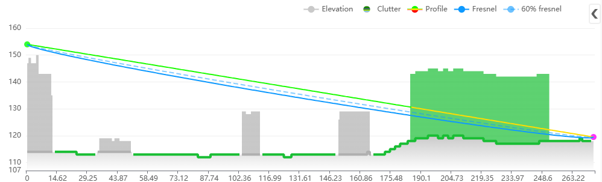

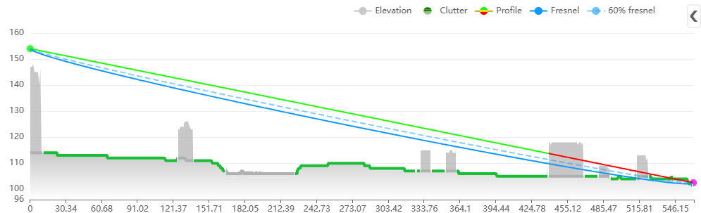

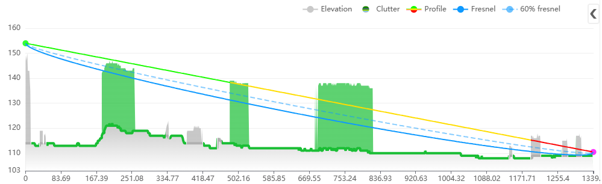
will apply the specific sub-set of path loss prediction model, as explained in the following section.
Note that when the receiver is located indoors, the special Outdoor-to-Indoor propagation function will be
applied in addition to basic path loss, as explained in the separate section at the end of this chapter.

#### 7.7.1 Models
Prediction models available in Cellular Expert support frequencies from 10kHz to 350 GHz.

To open the Prediction Model Manager dialogue, click on the Prediction Model Manager tool in

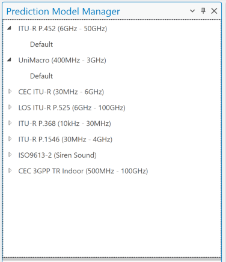
the Data Management section.
CEC ITU-R 3GPP Model (100MHz – 6GHz) is a combination model intended for use in a variety of different
radiocommunication systems which is derived explicitly from ITU-R path loss modelling methods as follows:
a. Receive antenna in LOS condition – path loss calculated as FSL based on Recommendation ITU-
R P.525 (ref URL).
b. Receive antenna in OLOS condition – total path loss modelled as a combination of basic FSL
calculated based on Recommendation ITU-R P.525 (ref URL) with included dual slope option and
clutter loss modelling based on Recommendation ITU-R P.2108 (ref URL).
c. Receive antenna in NLOS condition – path loss as a combination of basic FSL calculated based
on Recommendation ITU-R P.525 (ref URL) with included dual slope option, additional losses due
to diffraction calculated based on Recommendation ITU-R P.526 (ref URL).
d. Receive antenna in OLOS+NLOS condition – path loss as a combination of basic FSL calculated
based on Recommendation ITU-R P.525 (ref URL) with included dual slope option, additional
losses due to diffraction calculated based on Recommendation ITU-R P.526 (ref URL), and clutter
loss modelling based on Recommendation ITU-R P.2108 (ref URL).
e. Receive antenna in the clutter (building, vegetation, etc) – path loss is calculated as described
above based on LOS, OLOS and NLOS conditions, and additional penetration loss is added to
simulate Outdoor-to-Indoor scenario which is based on ITU-R P.833 recommendation (if receiver
is in vegetation type clutter) or based on 3GPP TR 38.901 (ref URL) (if receiver is in a building).
ITU-R P.452 Model (6GHz – 50GHz) is provided as a universally applicable model with a very wide
frequency range from 0.1-50 GHz. Its implementation is based on the methodology described in the
Recommendation ITU-R P.452 (ref URL). This model does not provide for definition of OLOS visibility
condition; instead, it considers clutter as part of the general obstacles category and accordingly
distinguishes only two radio visibility cases:

a. Receive antenna in LOS condition – path loss model based on FSL principle.
b. Receive antenna in NLOS condition – total path loss modelled using a combination of basic
transmission losses and losses due to diffraction.
ITU-R P.1546 Model (30MHz – 4GHz) (ref URL) is a widely recognized radio propagation prediction method
developed by the International Telecommunication Union (ITU). It is primarily used for estimating point-
to-area radio signal coverage in the frequency range from 30 MHz to 4000 MHz over terrestrial paths.
This model is especially suitable for broadcasting, land mobile, and fixed services.
Key Features
• Versatile Application: Supports predictions over land, sea, and mixed paths, making it adaptable
to various geographic conditions.
• Input Parameters: Takes into account factors such as transmitter and receiver heights, terrain
profile, clutter (buildings, vegetation), climate, and time/location variability.
• Time and Location Variability: Predictions can be tailored for different statistical reliability levels
(e.g., 50% or 10% time availability).
• Clutter and Terrain Handling: The model can incorporate detailed digital elevation models
(DEM) and clutter data for more accurate predictions, reflecting the influence of buildings, forests,
and other surface features.
Use in Cellular Expert
In the Cellular Expert software, the ITU-R P.1546 model is implemented to support real-world
coverage planning and regulatory studies. Users can configure environmental parameters and
resolution settings to match local conditions and improve prediction accuracy.
LOS ITU-R P.525 Model (6GHz – 100GHz) is the FSL path loss calculated based on the method in
Recommendation ITU-R P.525 (ref URL). As such it could be used for modelling radio links where LOS is
considered a necessary condition, e.g., for Fixed (Point-to-Point) Links or Mobile Systems in mmWave
bands.
UniMacro Model (400MHz – 3GHz) is the CE’s proprietary combination model developed over the years
of practical experience with the operational planning of cellular mobile networks in the frequency ranges
from 400-3000 MHz. It had been fine-tuned to produce coverage predictions that are most closely aligned
with what could be expected to be experienced by the actual mobile network users in the field. The model
will model different path losses depending on radio visibility conditions as follows:
a. Receive antenna in LOS condition – path loss model based on FSL principle and dual slope based
on breakpoint distance.
b. Receive antenna in OLOS, or NLOS condition – path loss modelled using Extended Hata (Open
Area) model with additional losses due to diffraction calculated based on Recommendation ITU-R
P.526 (ref URL).
c. Receive antenna in the clutter (building, vegetation, etc) – path loss is calculated as described
above based on LOS, OLOS and NLOS conditions, and additional penetration loss is added to
simulate Outdoor-to-Indoor scenario which is based on ITU-R P.833 recommendation (if receiver
is in vegetation type clutter) or based on 3GPP TR 38.901 (ref URL) (if receiver is in a building).
ITU-R P.368 (10kHz – 30MHz) provides a standardized prediction method for assessing the ground-wave
field strength of radio waves in the 10 kHz to 30 MHz frequency range. This frequency band is primarily
associated with long-range communication systems using amplitude modulation (AM) and shortwave
bands, often for maritime, aeronautical, military, and broadcasting services.

This model offers guidance for engineers, planners, and researchers working on system design and
analysis in the MF (Medium Frequency) and HF (High Frequency) bands.
The ITU-R P.368 model calculates signal strength based on several key environmental and system
parameters:
Frequency (f)
Higher frequencies tend to attenuate more rapidly over ground. The attenuation rate increases
significantly above 3 MHz.
Distance (d)
Field strength diminishes with increasing distance due to geometrical spreading and absorption by
the ground and atmosphere.
Surface refractivity, Surface Conductivity (σ) and Relative Permittivity (εᵣ)
The surface over which the wave propagates critically affects signal strength:
• Sea water: High conductivity, minimal loss
• Dry land or desert: Low conductivity, high loss
• Typical values range from:
o Conductivity: 10⁻⁴ to 5 S/m
o Relative permittivity: 4 to 81
ISO 9613 standard provides a validated, practical method for predicting the outdoor propagation of sound,
and is increasingly applied in siren sound modeling within public security, emergency warning systems, and
defense operations. This modeling ensures that acoustic alert systems (e.g. civil defense sirens, disaster
warnings, military alert signals) achieve their intended coverage, intelligibility, and effectiveness across
various terrain and urban environments.
Purpose in the Public Security Context
In emergency and defense scenarios, reliable audibility of sirens is critical for:
• Civil alert and evacuation systems
• Military base perimeter alarms
• Air raid or missile defense warning networks
• Disaster alert systems (e.g. earthquakes, tsunamis, nuclear incidents)
By applying ISO 9613-2, engineers can model how far a siren can be heard under specific environmental
conditions, optimizing:
• Placement and spacing of sirens
• Sound power selection
• Minimization of acoustic shadow zones
• Compliance with national safety and civil defense regulations
The model assumes standard favorable propagation:
• Downwind or moderate inversion conditions
• Ambient temperature ~10 °C
• Relative humidity ~70%
These are conservative conditions ensuring that siren reach is never overestimated, supporting public
safety margin planning.

CEC 3GPP TR Indoor (500MHz – 100GHz) Propagation Model is a high-frequency path loss model
designed for indoor radiocommunication systems operating within the 500 MHz to 100 GHz range. It builds
upon the CEC ITU-R 3GPP model (100 MHz – 6 GHz) by adapting it to complex indoor environments, such
as:
• Office buildings
• Residential units
• Shopping centers
• Industrial halls
This model integrates core ITU-R recommendations for free-space loss and penetration effects, while
leveraging 3GPP-specific methods for accurate simulation of indoor multipath, wall attenuation, and
frequency-dependent fading.
Purpose and Use Cases
The model is intended for:
• Indoor wireless access network design (e.g., Wi-Fi, 5G NR, mmWave)
• System-level simulations for indoor coverage planning
• Performance evaluation of in-building penetration for outdoor base stations
• Integration with dual-slope and multi-scenario path loss modeling frameworks
7.7.1.1 CEC ITU-R 3GPP Model
Model application
This deterministic model is designed for precise tracking of the main, strongest radio ray, while also
empirically modeling the scattering of other rays around the receiver. It applies to all ranges of cellular
mobile and public safety networks, including 2G, 3G, 4G, and 5G, within the 30 MHz to 6 GHz frequency
range.
The model is recommended for accurate wide-area propagation and coverage modeling, especially when
precise and up-to-date topographic data are available. This includes Digital Terrain Models (DTM), building
data (including height information), and vegetation data (with height details) derived from a Digital Surface
Model (DSM). Ideally, these data should be created with LiDAR or similar methods, at a resolution of at
least 10 meters, though 5, 2, or even 1 meter or higher is preferable for optimal accuracy.
When building data and their heights are not available, and only DTM and clutter data at a resolution of 10
meters or lower are accessible, the UniMacro Model should be considered for wide-area propagation and
coverage modeling in a slightly narrower frequency range of 400 MHz to 3 GHz.
Default settings
General settings to calculate Model loss
• Offset coefficient (dB) – represents the offset in decibels added to the path loss grid. The default
value is 32 dB.
• Distance coefficient – defines the slope based on the distance between the cell and the receiver
location, with a default value of 20.
• Distance coefficient obstructed – represents the slope based on the obstructed distance between

the cell and the receiver location. The default value is 40.
• Frequency coefficient – indicates the slope determined by the frequency value, with a default value

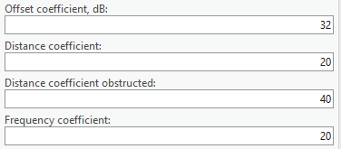
of 20.
Clutter class to calculate diffraction, clutter loss, penetration loss and receiver loss
The Clutter Class option defines several predefined clutter categories, each with unique values for
diffraction loss, clutter loss, penetration loss, and receiver loss coefficients.

These parameters describe how a signal is impacted when it passes through or terminates in a specific

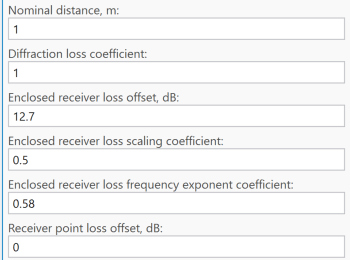
clutter class.
Key Parameters:
• Nominal distance, m – the average distance between objects within the clutter class, ranging from
1 to 100 meters.

• Diffraction loss coefficient – a multiplier used in diffraction calculations. Lower values result in
reduced diffraction loss, while higher values increase it. Typically, this coefficient is higher for
buildings compared to forests or other clutter types.ltiplier for diffraction calculations. If value is
lower, diffraction will be lower, if higher – then diffraction will be higher. Usually, for buildings clutter
class this parameter is higher then forest or other clutter classes.
• Enclosed receiver loss offset, dB – the initial entry loss into the clutter class, expressed as an offset
in dB, which is added to the path loss grid.
• Enclosed receiver loss scaling coefficient – represents additional signal loss as a function of the
distance traveled within the clutter class. Higher values increase path loss.
• Enclosed receiver loss frequency exponent coefficient – reflects additional loss inside the clutter
class based on frequency. Higher values increase path loss, particularly at higher frequencies.
• Receiver point loss offset, dB – an additional loss offset in dB applied to the path loss grid,
representing user equipment (UE) losses.
Clutter Classes default values
Penetration Penetration receiver Penetration receiver
receiver loss loss scaling loss frequency
offset coefficient exponent coefficient
17 0.25 1
Open / Terrain
0 0.82 0.65
Grassland
0 0.82 0.65
Sparse forest
0 0.89 0.65
Medium dense forest
0 0.95 0.65
Very dense forest
0 0.89 0.65
Low density urban (Low buildings)
0 0.89 0.65
Low density urban (High buildings)
0 0.89 0.65
Medium density urban (Low buildings)
0 0.89 0.65
Medium density urban (High buildings)
0 0.89 0.65
High density urban (Low buildings)
0 0.89 0.65
High density urban (High buildings)
0 0.89 0.65
High density urban (Very high
buildings)
0 0.89 0.65
Building blocks
0 0.89 0.65
Transportation
0 0.89 0.65
Agriculture
0 0.89 0.65
Plantation
0 0.89 0.65
Parks
0 0.89 0.65
Airport
0 0.89 0.65
Sea
0 0.89 0.65
Inland water
5 0.25 1
Concrete building

2 0.25 1
Glass building
2 0.25 1
Wood building
8.5 0.25 1
Low loss building
17 0.25 1
High loss building
7.7.1.2 ITU-R P.452 Model
Model application
This model is designed to estimate radio signal propagation over long distances, including terrestrial paths.

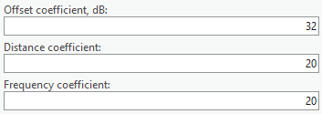
It is specifically designed to predict signal attenuation caused by various mechanisms, such as diffraction,
tropospheric scatter, ducting, and reflections from the Earth's surface, across frequencies ranging from 0.1
GHz to 50 GHz. While other prediction model covers frequencies from 100MHz to 6GHz, we recommend
to use it from 6GHz to 50GHz frequencies.
This model is particularly well-suited for microwave links and is widely used for planning and interference
analysis in fixed and mobile radio communication systems. By accounting for the effects of terrain,
atmospheric conditions, and other factors, it helps engineers assess link reliability and optimize network
performance in a variety of environmental scenarios.
Default settings
General settings to calculate Model loss
• Offset coefficient (dB) – represents the offset in decibels added to the path loss grid. The default
value is 32 dB.
• Distance coefficient – defines the slope based on the distance between the cell and the receiver
location, with a default value of 20.
• Frequency coefficient – indicates the slope determined by the frequency value, with a default value
of 20.
Multipath and focusing
In ITU-R P.452, the correction for multipath and focusing effects accounts for signal enhancements caused
by constructive interference and atmospheric focusing. This adjustment reduces the total path loss under

favorable conditions, such as over-water paths or specific atmospheric gradients, ensuring more accurate
signal predictions.
Possible values Yes or No.
Clutter class to calculate penetration loss
Clutter class option describes several fixed Clutter names with penetration loss coefficients.
These parameters describe how a signal is impacted when it passes through or terminates in a specific
clutter class.
Key Parameters:
• Penetration loss offset, dB – the initial entry loss into the clutter class, expressed as an offset in
dB, which is added to the path loss grid.
• Penetration loss distance coefficient – represents additional signal loss as a function of the distance

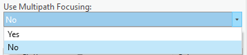

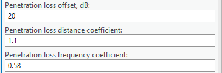
traveled within the clutter class. Higher values increase path loss.
• Penetration loss frequency coefficient – reflects additional loss inside the clutter class based on
frequency. Higher values increase path loss, particularly at higher frequencies.
Clutter Classes default values
Penetration Penetration receiver Penetration receiver
receiver loss loss scaling loss frequency
offset coefficient exponent coefficient
17 0.25 1
Open / Terrain
0 0.82 0.65
Grassland
0 0.82 0.65
Sparse forest
0 0.89 0.65
Medium dense forest
0 0.95 0.65
Very dense forest
0 0.89 0.65
Low density urban (Low buildings)
0 0.89 0.65
Low density urban (High buildings)

0 0.89 0.65
Medium density urban (Low buildings)
0 0.89 0.65
Medium density urban (High buildings)
0 0.89 0.65
High density urban (Low buildings)
0 0.89 0.65
High density urban (High buildings)
0 0.89 0.65
High density urban (Very high
buildings)
0 0.89 0.65
Building blocks
0 0.89 0.65
Transportation
0 0.89 0.65
Agriculture
0 0.89 0.65
Plantation
0 0.89 0.65
Parks
0 0.89 0.65
Airport
0 0.89 0.65
Sea
0 0.89 0.65
Inland water
5 0.25 1
Concrete building
2 0.25 1
Glass building
2 0.25 1
Wood building
8.5 0.25 1
Low loss building
17 0.25 1
High loss building
7.7.1.3 UniMacro Model
Model application
This model is designed for deterministic tracking of the main, strongest radio ray in Line of Sight (LOS)
areas, while propagation modeling in Obstructed Line of Sight (OLOS) and Non-Line of Sight (NLOS) areas
uses empirically determined parameters defined in ITU-R and 3GPP recommendations. It also models the
scattering of other rays around the receiver. The model applies empirically validated values for the 400
MHz to 3 GHz frequency range and is suitable for modeling all cellular mobile and public safety networks,
including 2G, 3G, 4G, and 5G, within that frequency range.
This model is recommended for wide-area propagation and coverage modeling when building data and
their heights are unavailable, and only DTM and clutter data at a resolution of 10 meters or lower are
accessible.
For accurate wide-area propagation and coverage modeling where building data and their heights are
available, the CEC ITU-R 3GPP Model is recommended, offering a broader application frequency range of
100 MHz to 6 GHz.
Default settings
General settings to calculate Model loss

If Tx and Rx is in LOS condition:
Fig. 4. Illustration of LOS conditions
Line of Sight coefficients are used to calculate general model loss.
• Offset coefficient (dB) – represents the offset in decibels added to the path loss grid. The default

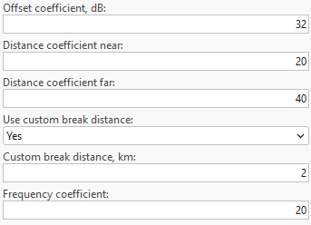
value is 32 dB.
• Distance coefficient near – defines the slope based on the distance between the cell and the
receiver location, with a default value of 20.
• Distance coefficient far – represents the slope based on breakpoint distance between the cell and
the receiver location. The default value is 40.
• Use custom break distance – if value Yes, enables custom Fresnel breakpoint distance value. The
path loss dependence on the distance is split into near and far zones by the breakpoint distance
and the effect is only applied for Line of Sight condition.
• Custom break distance, km – Fresnel breakpoint distance then path loss is calculated using
Distance coefficient far parameter.
• Frequency coefficient – indicates the slope determined by the frequency value, with a default value
of 20.

If Tx and Rx is in OLOS or NLOS condition, then Hata 9999 equation is used. 9999 Model is the Ericsson’s
implementation of Hata Model. Ericsson provides the steering parameters of 9999 Model for different
environments; therefore it’s very convenient just to apply in this form as the default parameters.
• Hata Loss: A0 - constant offset in dB this value simply added to loss grid. Adjusting this value, you
can minimize mean error. It regulates the absolute level of the loss curve. Default value 36.2.
• Hata Loss: A1 - distance influence coefficient. Physically it represents loss dependant on distance
such as atmospheric (dust, hydrometeors, etc...) losses. It regulates slope of the curve. Default
value 30.2.
• Hata Loss: A2 - transmitter height influence coefficient. It is related to errors in DTM, real Earth
curvature, etc. It regulates loss curve vertical position like the A0, but with respect to antenna height.

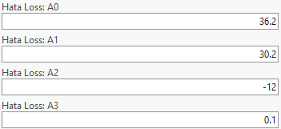
Default value -12.
• Hata Loss: A3 - Okumura-Hata type of multiplying factor for log(h )log(d). Default value 0.1.
M
Clutter class to calculate diffraction, clutter loss, penetration loss and receiver loss
The Clutter Class option defines several predefined clutter categories, each with unique values for
diffraction loss, clutter loss, penetration loss, and receiver loss coefficients.

These parameters describe how a signal is impacted when it passes through or terminates in a specific

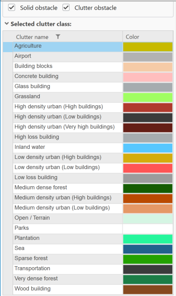

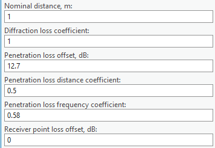
clutter class.
Key Parameters:

• Nominal distance, m – the average distance between objects within the clutter class, ranging from
1 to 100 meters.
• Diffraction loss coefficient – a multiplier used in diffraction calculations. Lower values result in
reduced diffraction loss, while higher values increase it. Typically, this coefficient is higher for
buildings compared to forests or other clutter types.ltiplier for diffraction calculations. If value is
lower, diffraction will be lower, if higher – then diffraction will be higher. Usually, for buildings clutter
class this parameter is higher then forest or other clutter classes.
• Penetration loss offset, dB – the initial entry loss into the clutter class, expressed as an offset in
dB, which is added to the path loss grid.
• Penetration loss distance coefficient – represents additional signal loss as a function of the distance
traveled within the clutter class. Higher values increase path loss.
• Penetration loss frequency coefficient – reflects additional loss inside the clutter class based on
frequency. Higher values increase path loss, particularly at higher frequencies.
• Receiver point loss offset, dB – an additional loss offset in dB applied to the path loss grid,
representing user equipment (UE) losses.
Clutter Classes default values
Penetration Penetration receiver Penetration receiver
receiver loss loss scaling loss frequency
offset coefficient exponent coefficient
17 0.25 1
Open / Terrain
0 0.82 0.65
Grassland
0 0.82 0.65
Sparse forest
0 0.89 0.65
Medium dense forest
0 0.95 0.65
Very dense forest
0 0.89 0.65
Low density urban (Low buildings)
0 0.89 0.65
Low density urban (High buildings)
0 0.89 0.65
Medium density urban (Low buildings)
0 0.89 0.65
Medium density urban (High buildings)
0 0.89 0.65
High density urban (Low buildings)
0 0.89 0.65
High density urban (High buildings)
0 0.89 0.65
High density urban (Very high
buildings)
0 0.89 0.65
Building blocks
0 0.89 0.65
Transportation
0 0.89 0.65
Agriculture
0 0.89 0.65
Plantation
0 0.89 0.65
Parks
0 0.89 0.65
Airport
0 0.89 0.65
Sea

0 0.89 0.65
Inland water
5 0.25 1
Concrete building
2 0.25 1
Glass building
2 0.25 1
Wood building
8.5 0.25 1
Low loss building
17 0.25 1
High loss building
7.7.1.4 LOS ITU-R Model
Model application
Line of Sight model is typically used for mmWave band frequencies within the 6 GHz – 100 GHz frequency
range and provides results only for line-of-sight areas.
Default settings
General settings to calculate Model loss
• Offset coefficient (dB) – represents the offset in decibels added to the path loss grid. The default
value is 32 dB.
• Distance coefficient – defines the slope based on the distance between the cell and the receiver
location, with a default value of 20.
• Frequency coefficient – indicates the slope determined by the frequency value, with a default value
of 20.
7.7.1.5 ITU-R P.368 Model
Model application
ITU-R P.368 is ground-wave propagation of radio signals model. It is specifically designed to estimate the
field strength and attenuation of radio waves over the Earth's surface, particularly for frequencies below 30

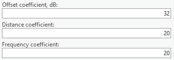
MHz.
This model is widely used in planning and designing long-distance communication systems, such as

maritime, broadcasting, and low-frequency navigation systems, where ground-wave propagation plays a
critical role. It accounts for factors such as terrain conductivity, dielectric properties, and surface roughness
to deliver accurate predictions of signal behavior.
Default settings
The general model parameters include the radius and receiver height. Additional parameters used for path
loss calculations are derived from the clutter classes. Each clutter class has its own unique set of
parameters:
• Surface refractivity - a measure of the refractive index's influence on electromagnetic wave
propagation, particularly in the lower atmosphere close to the Earth's surface. It is expressed as a
dimensionless value, typically dependent on atmospheric pressure, temperature, and humidity.
High surface refractivity can significantly affect radio wave bending and propagation, such as
ducting or anomalous refraction.
• Relative permittivity - quantifies a material's ability to permit electric field propagation relative to
vacuum. It is a complex quantity with the real part representing energy storage capability and the
imaginary part representing energy dissipation within the material.
ITU-R P.368 uses relative permittivity to model how radio waves interact with various surface
materials, such as soil, water, or vegetation. These interactions influence reflection, refraction, and
absorption phenomena at the surface.
• Surface conductivity - refers to a material's ability to conduct electrical currents across its surface.
It is measured in siemens per meter (S/m). Higher conductivity indicates that a surface can easily
allow current flow, affecting the reflection and absorption of radio waves.
According to ITU-R P.368, surface conductivity is a critical factor in determining the reflective
properties of surfaces, such as dry versus wet soil, or metallic versus dielectric surfaces.
Buildings Forest Dense Urban Dense Bare Crops Water Road
forest urban ground
Surface
refractivity, N- 315 315 315 315 315 315 315 365 315
Units
Relative
5 13 13 5 5 10 20 80 10
permittivity
Surface
conductivity, 0.001 0.004 0.004 0.001 0.001 0.002 0.03 1 0.002
S/m
7.7.1.6 ITU-R P.1546 Model
Model application
This model is designed for wide-area radio propagation prediction based on empirical data and statistical
analysis of measured field strengths. It provides path loss estimations over land, sea, and mixed terrain for
frequencies ranging from 30 MHz to 3 GHz, using parameters defined in ITU-R Recommendation P.1546.
The model is applicable to terrestrial broadcasting, mobile, and public safety networks, including
technologies such as 2G, 3G, and 4G, within its frequency range.

The ITU-R P.1546 model accounts for antenna heights, terrain elevation (DTM), land cover types (clutter),
and environmental conditions, incorporating corrections for time variability and location-specific effects. It
is particularly suitable for modeling line-of-sight (LOS) and non-line-of-sight (NLOS) propagation over long
distances where detailed building data is not available.
This model is recommended for national or regional coverage planning, especially in cases where high-
resolution DTM (e.g., 30m) and clutter data (e.g., 10m resolution) are available, but building heights and
detailed 3D structures are not. Its statistical approach allows for reliable estimations of field strength in both
urban and rural environments, without requiring ray-tracing or detailed geometry-based modeling.
For scenarios where accurate building geometry and heights are available and a higher modeling frequency
range (up to 6 GHz) is required, the CEC ITU-R 3GPP Model is recommended instead, offering greater
precision in dense urban and high-frequency applications.
Default settings
The following key parameters are used to configure the ITU-R P.1546 radio propagation predictions within
the software. These settings directly influence the coverage calculation and modeling accuracy:

1. Radius
• Description: This setting defines the maximum distance from the transmitter (or prediction center)
over which the propagation prediction will be performed.
• Purpose: It limits the spatial extent of the coverage area to optimize calculation time and resource
usage.
• Typical Values: Often set between 10 km to 100 km, depending on the transmitter's power, terrain,
and target coverage region.

### Receiver Height (m)
• Description: Specifies the height of the receiving antenna above ground level, in meters.
• Purpose: Receiver height impacts the predicted signal strength, especially in terrain with elevation
changes or obstacles.
• Guidelines:
o 1.5 to 2 m for handheld/mobile users (e.g., mobile phones, public safety devices).
o 10 m or higher for fixed installations (e.g., rooftop or vehicular antennas).
• Note: Accurate setting of receiver height is essential for meaningful signal level predictions.

### Time Percentage (%)
• Description: Indicates the percentage of time during which the predicted field strength is expected
to be met or exceeded.
• Purpose: Reflects the statistical variability of signal propagation due to atmospheric and
environmental effects.
• Common Use Cases:

o 50% time: Typical for general service coverage maps (median conditions).
o 10% time: Used for high-reliability or interference studies, ensuring signal presence under
less favorable conditions.
• Interpretation: A 10% time prediction means the signal level is met or exceeded during 10% of the
time, capturing worst-case propagation conditions (i.e., stronger signal occurrence during favorable
propagation).
7.7.1.7 ISO9613 Model
Model application
ISO 9613 is an international standard used for predicting outdoor sound propagation, including the
assessment of siren noise levels. It provides a structured method for calculating sound attenuation over
distance, considering factors such as geometric spreading, atmospheric absorption, ground effects,
reflections, and obstacles.
In the context of siren sound prediction, ISO 9613 helps determine the effective coverage area, ensuring
that warning signals reach the intended audience with sufficient audibility. This standard is essential for

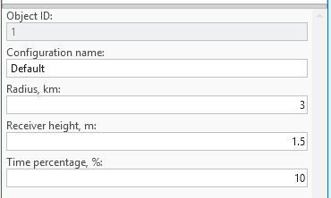
optimizing siren placement, regulatory compliance, and designing effective emergency alert systems.
The primary factors included in the standard are:

1. Geometric Spreading
• This refers to how sound spreads out as it moves away from its source. Sound intensity decreases
as the distance from the source increases, following the inverse square law (with spherical
spreading) or other forms depending on terrain.
• As the distance from the sound source increases, the intensity of sound diminishes, which is
considered in the calculation of sound levels at various receiver points.
𝐴 =20∗𝐿𝑂𝐺10(𝑑)+11
𝑑𝑖𝑣

2. Atmospheric Absorption
• Sound is absorbed by the atmosphere as it travels, particularly at higher frequencies. The

absorption depends on factors like temperature, humidity, and air pressure, and is often more
significant over longer distances.
• Atmospheric absorption reduces the intensity of sound as it propagates, especially at higher
frequencies. The standard takes into account these effects to calculate the reduction in sound level.

3. Obstacles
• Physical barriers such as walls, hills, and buildings block or scatter sound waves, reducing the
sound level that reaches certain areas.
• Obstacles can cause significant sound reduction, especially if they are large or located between
the sound source and the receiver. The standard accounts for the shadow zones created by these
barriers.

4. Directivity of the Source
• This parameter accounts for the directionality of the sound source, which may not emit sound
equally in all directions. Sirens, for example, may have directional characteristics that focus their
sound output in certain directions.
• The directivity of the sound source influences how the sound energy is distributed, and therefore,
how far and in what pattern the sound propagates.

5. Meteorological Conditions
• Weather conditions such as wind speed, temperature gradients, and humidity can significantly
affect sound propagation. For example, sound may travel farther downwind or be absorbed more
by humid air.
• These conditions are integrated into the model to adjust the calculations of sound attenuation,
ensuring more accurate predictions for different weather scenarios.
Default settings
• Distance coefficient: 20.
Describes slope coefficient based on distance. Value is included in Geometric spreading
calculations.
• Temperature: 20 Co
• Humidity: 50%
• Meteorological conditions: 3 dB. It is a factor, in decibels, which depends on local meteorological
statistics for wind speed and direction, and temperature gradients. Experience indicates that values
of Meteorological conditions (C0) in practice are limited to the range from zero to approximately +
5 dB.
Ground factor parameter for the ISO9613-2 model’s clutter classes allows users to define the acoustic
reflectivity (from 0 to 1, indicating hard-soft respectively) of the ground surface for more accurate sound
level predictions.

Clutter Classes default values
Ground factor
Open / Terrain
Grassland
Sparse forest
Medium dense forest
Very dense forest: **0.5**
Low density urban (Low buildings): **0.3**
Low density urban (High buildings): **0.3**
Medium density urban (Low
buildings): **0.1**
Medium density urban (High
buildings): **0.1**
High density urban (Low buildings)
High density urban (High buildings)
High density urban (Very high
buildings)
Building blocks
Transportation
Agriculture
Plantation: **0.7**
Parks
Airport
Sea
Inland water
Concrete building
Glass building
Wood building
Low loss building
High loss building
7.7.1.8 CEC 3GPP TR Indoor (500MHz – 100GHz)
Model application
The CEC 3GPP TR Indoor Model (500 MHz – 100 GHz) is a robust, scalable prediction method based on
ITU-R principles and 3GPP extensions, specifically engineered for indoor radiowave propagation. By

supporting a wide range of scenarios — from clean LOS corridors to deeply obstructed NLOS paths — it

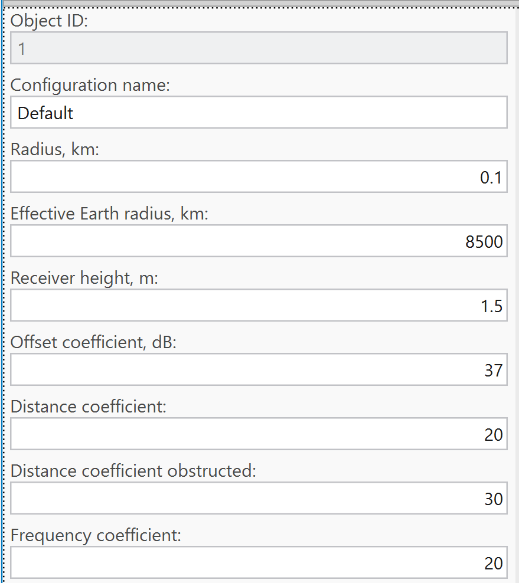
enables highly accurate modeling of next-generation wireless systems, ensuring reliable, secure, and
efficient communication in the most demanding indoor environments.
Key Enhancements for Indoor Use
• Frequency scaling up to 100 GHz supports mmWave and terahertz
• Wall material database from 3GPP TR 38.901:
o Standard drywall: ~2–8 dB per wall
o Concrete: 5–15 dB
o Glass: 2–10 dB
• Multi-floor attenuation (floor penetration factor)
• Path loss floors: ensures minimum attenuation beyond near field
• LOS probability models: stochastic treatment of LOS in large buildings
Default settings
| Parameter | Description |
|---|---|
| Configuration name | Name of the prediction configuration name. |
| Radius | Maximum prediction radius in kilometers to calculate path loss. |
| Receiver height | Receiver height above the receiver reference height selected in the workspace settings. |
| Effective earth radius | Earth radius in kilometers, used for the calculations. |

| Parameter | Description |
|---|---|
| Offset coefficient | Represents the offset in decibels added to the path loss grid. The default value is 37 dB. |
| Distance coefficient | Defines the slope based on the distance between the cell and the receiver location, with a default value of 20. |
| Distance coefficient obstructed | Represents the slope based on the obstructed distance between the cell and the receiver location. The default value is 30. |
| Frequency coefficient | Indicates the slope determined by the frequency value, with a default value of 20. |
| Penetration loss offset | The initial entry loss applied when crossing an obstacle within the clutter class, expressed as an offset in dB, which is added to the path loss grid. |
| Penetration loss scaling coefficient | Represents additional signal loss as a function of the distance travelled in an obstacle within the clutter class. Higher values increase path loss. |
Penetration loss frequency exponent coefficient
Reflects additional loss inside an obstacle within the clutter class based on frequency. Higher values
increase path loss, particularly at higher frequencies.
Note: penetration losses stack when multiple obstacles are crossed.
Clutter Classes default values
Penetration Penetration receiver Penetration receiver
receiver loss loss scaling loss frequency
offset coefficient exponent coefficient
17 0.25 1
Open / Terrain
0 0.82 0.65
Grassland
0 0.82 0.65
Sparse forest
0 0.89 0.65
Medium dense forest
0 0.95 0.65
Very dense forest
0 0.89 0.65
Low density urban (Low buildings)
0 0.89 0.65
Low density urban (High buildings)
0 0.89 0.65
Medium density urban (Low buildings)
0 0.89 0.65
Medium density urban (High buildings)
0 0.89 0.65
High density urban (Low buildings)
0 0.89 0.65
High density urban (High buildings)

0 0.89 0.65
High density urban (Very high
buildings)
0 0.89 0.65
Building blocks
0 0.89 0.65
Transportation
0 0.89 0.65
Agriculture
0 0.89 0.65
Plantation
0 0.89 0.65
Parks
0 0.89 0.65
Airport
0 0.89 0.65
Sea
0 0.89 0.65
Inland water
5 0.25 1
Concrete building
2 0.25 1
Glass building
2 0.25 1
Wood building
8.5 0.25 1
Low loss building
17 0.25 1
High loss building
7.7.1.9 CNOSSOS-EU Model
Model application
Developed by the European Commission's Joint Research Centre as the Common Noise Assessment
Methods in Europe, CNOSSOS-EU is the reference methodology adopted under the Environmental Noise
Directive (2002/49/EC) for strategic noise mapping across EU Member States, making it the preferred
choice for projects that must align with European regulatory requirements.
Unlike ISO 9613-2, which assumes downwind or moderate temperature inversion conditions throughout,
CNOSSOS-EU evaluates sound propagation under two distinct meteorological scenarios — favourable
conditions (downwind or temperature inversion, which enhance propagation toward the receiver) and
homogeneous conditions (neutral atmosphere) — and combines the two results using the long-term
occurrence probability of favourable conditions for the given direction. This produces long-term average
sound pressure levels that more realistically reflect the variability of outdoor propagation over extended
periods.
The model also features more refined calculations of geometrical divergence, atmospheric absorption,
ground effect, diffraction over obstacles and around vertical edges, and reflections from building façades
and other vertical surfaces. Ground effect is handled separately for the source-side, middle, and receiver-
side regions of the propagation path, with acoustic reflectivity defined per clutter class via the Ground
factor parameter shared with the ISO 9613-2 model. Diffraction is computed using path-difference
geometry consistent with the CNOSSOS-EU specification, and terrain profiles, clutter classification, and
building data from the workspace are used directly in the calculation. The primary factors included in the
standard are:
Default settings
• Distance coefficient: 20.

Describes slope coefficient based on distance. Value is included in Geometric spreading calculations.
• Temperature: 15 Co
• Humidity: 70%
• Favourable conditions occurrence: 0.25: Probability or fraction of time during which
meteorological conditions are "favourable" for sound propagation from a source to a receiver.
Ground factor parameter for the CNOSSOS-EU model’s clutter classes allows users to define the acoustic
reflectivity (from 0 to 1, indicating hard-soft respectively) of the ground surface for more accurate sound
level predictions. When the clutter classes raster is absent from the geodata, a ground factor value of 0.5
is used.
Clutter Classes default values
Ground factor
Open / Terrain
Grassland
Sparse forest
Medium dense forest
Very dense forest: **0.5**
Low density urban (Low buildings): **0.3**
Low density urban (High buildings): **0.3**
Medium density urban (Low
buildings): **0.1**
Medium density urban (High
buildings): **0.1**
High density urban (Low buildings)
High density urban (High buildings)
High density urban (Very high
buildings)
Building blocks
Transportation
Agriculture
Plantation: **0.7**
Parks
Airport
Sea
Inland water
Concrete building
Glass building

Wood building
Low loss building
High loss building

### 7.8 Template Manager
Template Manager allows the user to edit current project templates residing in the various Template tables

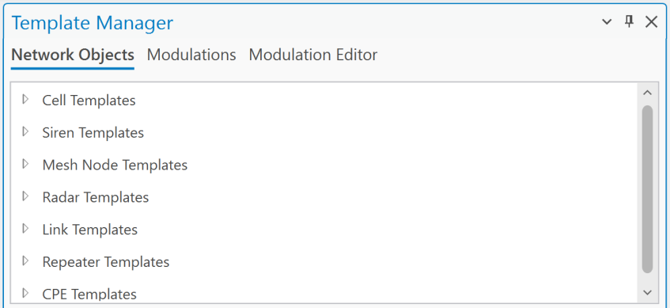
of the default.gdb. The user may change the field values of the templates, create new or detele existing
templates.
Templates are essential tools designed to streamline and simplify the configuration process by predefining
parameters automatically. Their primary purpose is to save time and reduce the risk of human error during
setup, particularly in complex scenarios like wireless network configuration.
Here’s why templates are beneficial:

1. Automatic Parameter Filling: Templates automatically populate required parameters, eliminating
the need for users to input them one by one. This ensures consistency and speeds up the setup
process, especially when working with large datasets or multiple network layers, such as cells,
sites, or CPEs.

2. Error Prevention: In cases where a parameter might be inadvertently missed during manual
configuration, templates act as a safeguard. They ensure all necessary parameters are accounted
for, reducing the likelihood of incomplete or incorrect setups.

3. Coverage Prediction Assurance: Templates are particularly valuable when performing tasks like
coverage predictions. If a parameter in the wireless network layer is forgotten or overlooked (e.g.,
for a cell, site, or CPE), the template provides a fallback, ensuring that the prediction can still be
performed accurately and without interruption.
By using templates, users can maintain efficiency, accuracy, and reliability in network planning and
analysis, even in "just-in-case" scenarios where manual inputs might fall short.
The templates are divided into categories:
• Network Objects – edit and manage network objects (cells, sites, links, etc) templates. Templates
are divided into different network layers, each network have unique template structure based on
available parameters in network layer.
• Modulations – create modulation configurations that can be used for MW links > Radios.
• Modulation Editor – create single modulations, which can be used in the Modulations tab.

#### 7.8.1 Edit Network Objects template
Click the button to open the Template Manager dialogue. Select one of the opened templates to edit

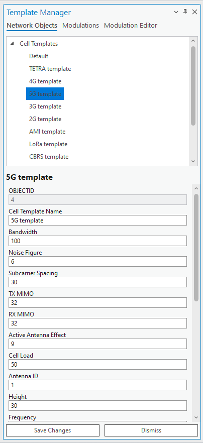

them.
Save Changes
Saves the changes to the objects.
Dismiss
Cancels the changes to the objects and closes the dialogue.

#### 7.8.2 Manage Network Object Template
7.8.2.1 Create New template
Right-click on network layer for which you would like to create a new template.

Fill parameters for new template.
Press Save Changes to create a new template and save its parameters. The created template will be added

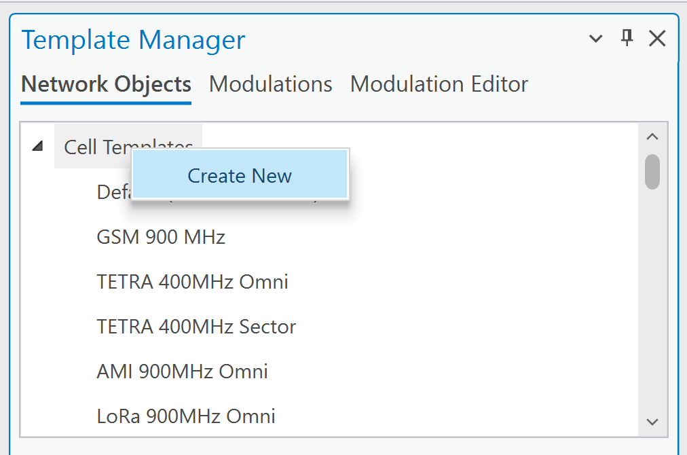

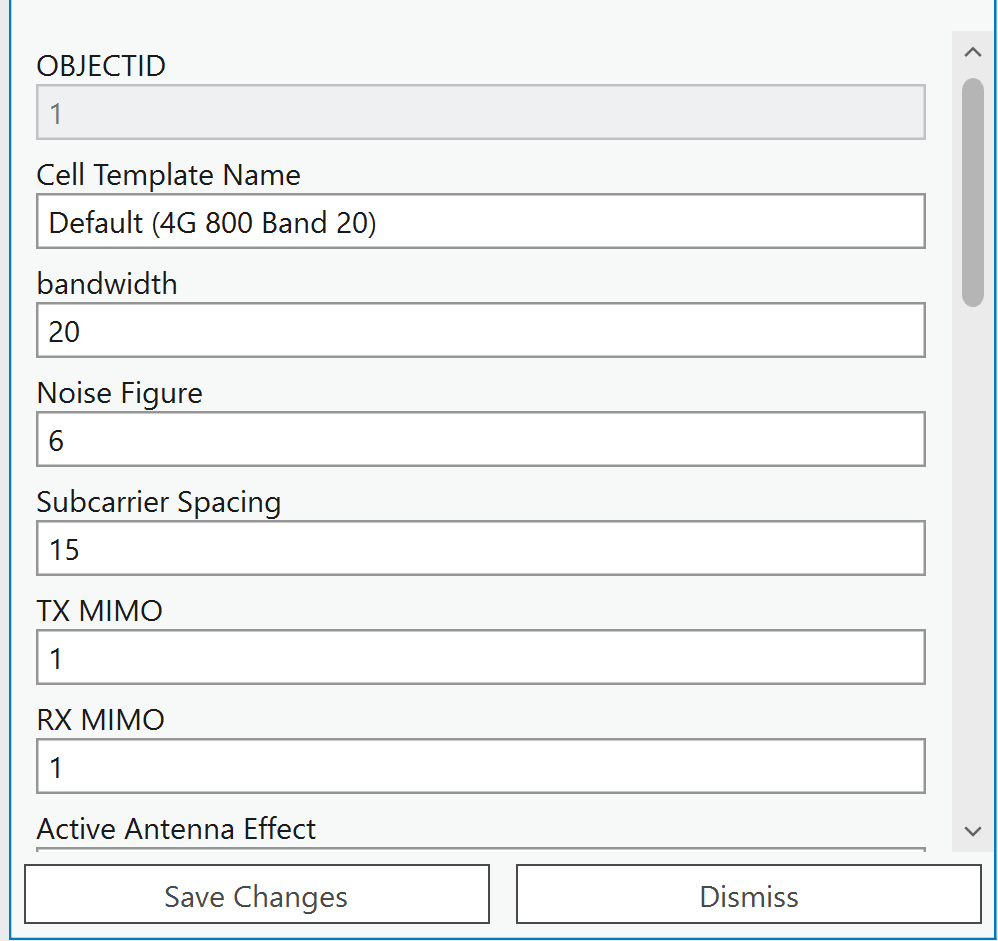
at the end of network template list.

7.8.2.2 Duplicate or Delete existing template
Right-click on a selected template to open the context menu with Duplicate and Delete options.
Duplicate will create a new template with the same parameters, and add it at the end of network template

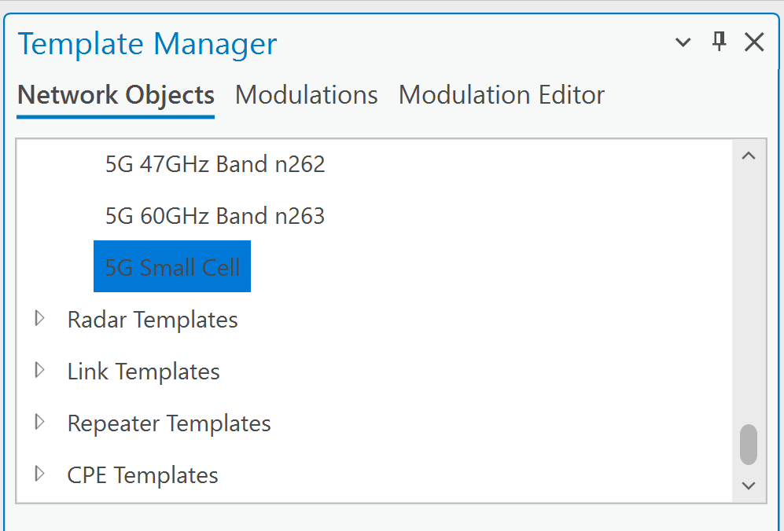

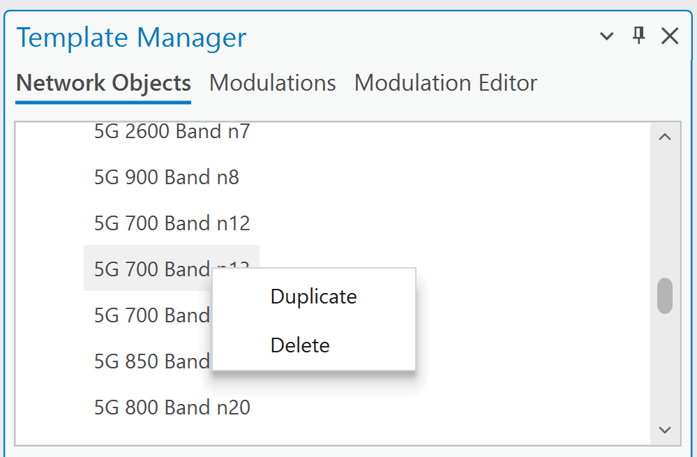
list.

Delete will remove this selected template.

#### 7.8.3 Modulations
The modulations are used in MW link calculations and specifically can be defined for Radios. Instead of
specifying Modulations one by one, the customer can create a set of them, and it is available in this tab.

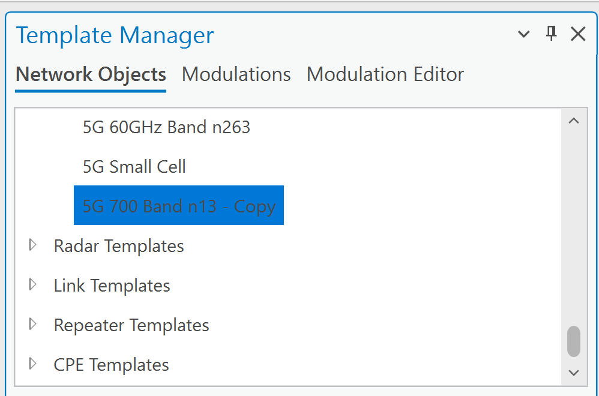

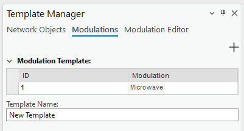
To preview and edit the Modulations template, click on it in the table.

(top right)
A new modulation with default values can be initialized.

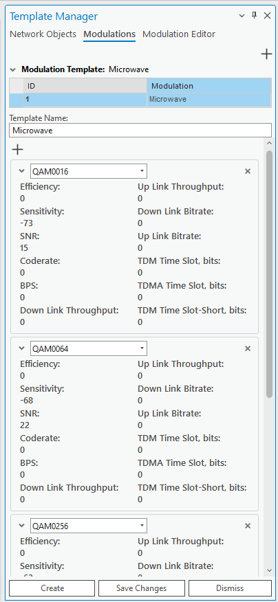

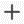
X
Modulation can be removed.
Save changes
All changes will be saved.
Dismiss

Remove changes.
To create a new Modulation template, press button in the top right corner of the dialog to initialize a

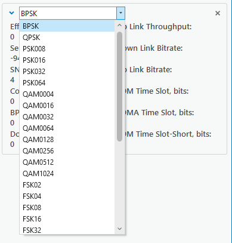

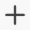

new template.
Template name
The name of the modulation template.
(under the template name field)
Assign modulation to the template.
Use the modulation drop-down list menu to apply and include the modulations.
Once the changes are made, click the Create button at the bottom of the window to create a new modulation
template.

#### 7.8.4 Modulation Editor
The list of available modulations is taken from the Modulation Editor tab.

To add a new modulation, click the at the top right of the Modulation Editor window to initialize a new

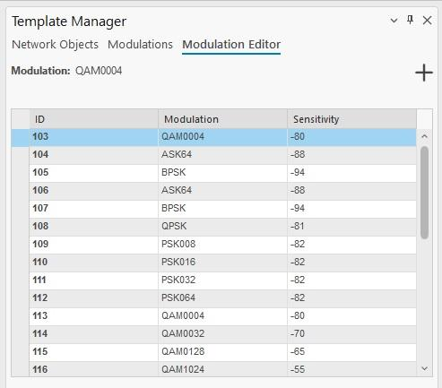

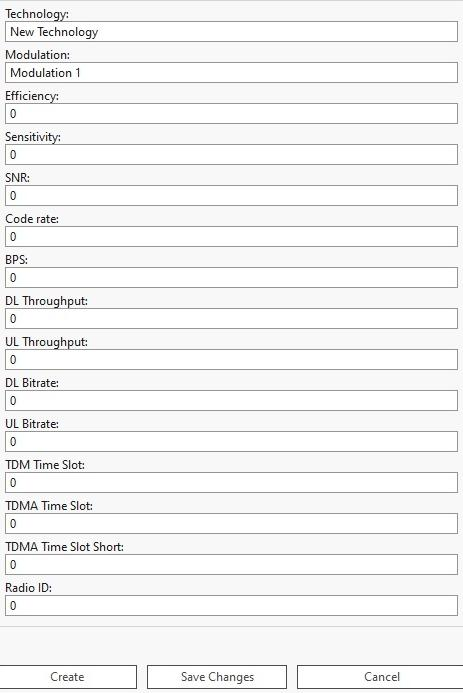
modulation with default values, and press the Create button at the bottom of the window. Alternatively, click
on an existing one to edit its parameters.
Create
Create a new modulation with the specified parameters.

Save Changes
Apply changes to a currently selected modulation. The button is disabled if the modulation is not created.
Cancel
Dismiss changes made to the modulation.

### 7.9 Import Objects
The Import Objects feature further enhances efficiency by allowing users to bring in network objects from
multiple external documents without manually creating them. This capability is invaluable when dealing with

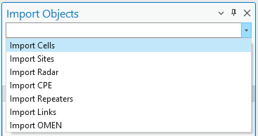
extensive or complex datasets. Cellular Expert for ArcGIS Pro supports the import of three widely used file
formats: .xls, .xlsx, and .csv. Additionally, for mapping files, it supports the .json format.
Key benefits of the Import Objects feature include:
• Time-Saving: Instead of manually entering or recreating network objects, users can quickly import
data from existing documents, significantly reducing setup time.
• Data Consistency: Importing ensures that all network objects maintain consistency with the original
data source, minimizing discrepancies and errors.
• Support for Multiple Formats: With support for commonly used file formats like .xls, .xlsx, and .csv,
the tool is versatile and can integrate seamlessly with various data workflows.
Click the button to open the Import Objects dialogue. Expand Import drop-down menu and select
the object, which should be imported.
The dialog will be filled with the options to define data and mapping files.

#### 7.9.1 Import Cells
The option enables possibility to import Cells in the Cellular Expert workspace. It has additional parameters

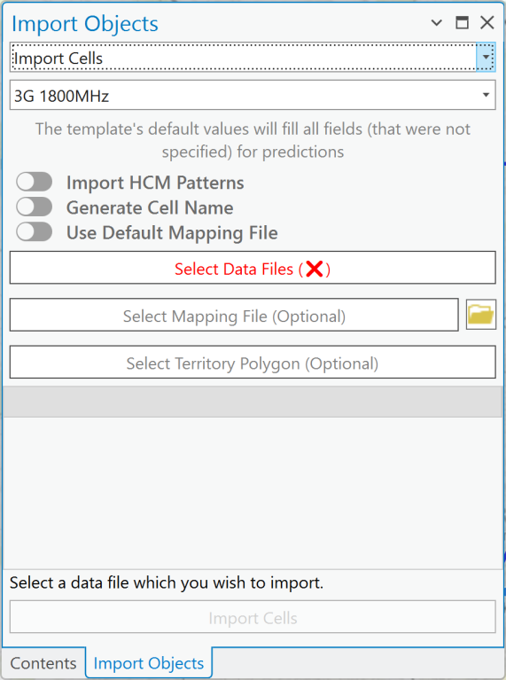
compared to other import options.
Template
Take necessary parameters from the template during the import. Template values are taken if some
parameters are missing in text file and mapping file.
Import HCM Patterns
Antenna patterns would be created and imported based on specific antenna name values provided in HCM
agreement. HCM antenna pattern import requires the data files to have an antenna_type field.
Generate Cell Name
Generate a cell name for all selected cells based on these parameters in this exact order: "longitude",
"latitude", "height", "azimuth", "power", "antenna_gain", and "frequency". If any of the fields are missing,
that field will be skipped.
Use Default Mapping File
A default mapping file will be applied to the imported data.
Select Data Files
Opens a dialogue window where the user can select the files that define the network objects to be imported.
The supported formats: .xls, .xlsx,.csv, and tables from .sde connection. Upon successful selection, the
button will light up green.

Select Mapping File (Optional)
Opens a dialogue window where the user can select a file that defines the data to be imported and the
conditions under which said data is processed. The supported format is .json. Upon successful selection,

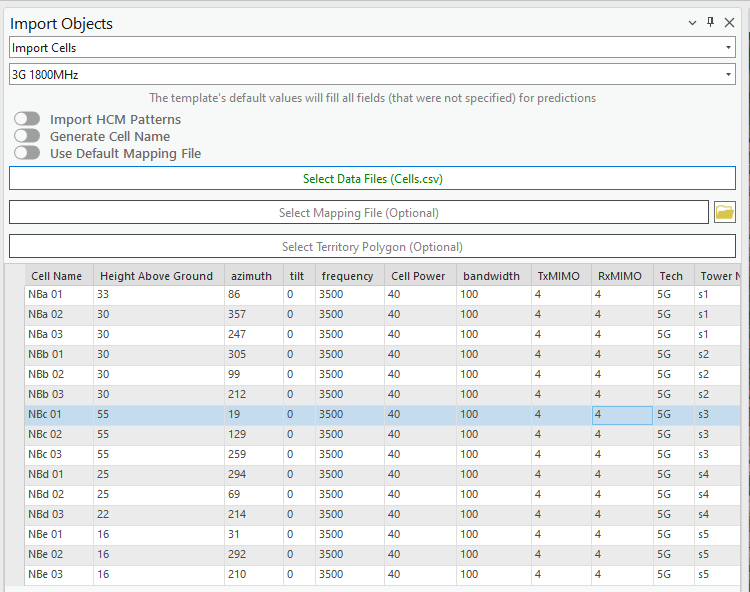
the button will light up green. More on mapping files are below.
Steps.

1. Click on Select Data Files, and define your text file. The file will be loaded into the dialog.

2. If your data structure is different compared to Cellular Expert database, then Mapping file should
be used to map your data structure and Cellular Expert workspace, Cells layer structure. More
information about mapping file is available below.

3. Click on Import Cells button to start importing procedure.
Sites can be imported together with Cells, if:
• The mapping file is not used, and text file has site_id field, which contains information about Site
name. It must be text data.
• The mapping file is used, then the data should be mapped with site_id field. It must be text data.
7.9.1.1 Mapping file
The data in the import files may have names, values, and units that do not match the data in the Cellular

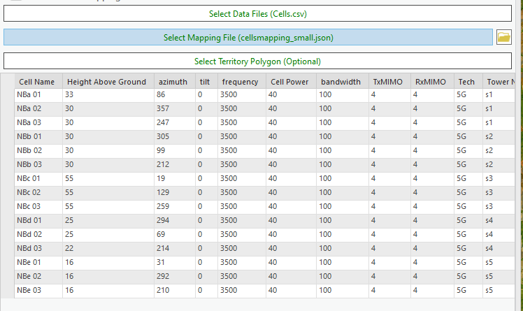

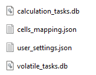
Expert database. To resolve such issues an additional Mapping file should be imported in which these data
conflicts ought to be addressed.
The empty mapping file can be found in the project’s workspace catalog, SystemFiles folder.
The mapping files are not necessary if the import file data corresponds to the Cellular Expert database
data, otherwise mapping files are a must for a successful import.
Values that are not mentioned in the mapping file will not be affected.

The structure of a mapping file:
“table_name” - defines which network object’s values are being mapped.
“current_name” - the name of the value that is written in the data file. In this example “lat” is a column
name in the data file and will be changed to “latitude” when the mapping file is applied, and objects are
imported.
“destination_name” - the proper name of the property (table column name) in the Cellular Expert
database. This property will be checked when the mapping file is imported.
“default_value” – value that will be used when an object in the data file has no value for a particular
property. In this example, if “latitude” is not set, then it will by default be assigned the value of 41.258.

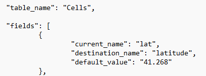

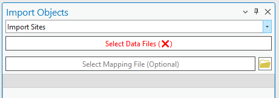
Leaving the default to empty quotation marks (“”) means that no default value will be applied.

#### 7.9.2 Import Sites, Radar, CPE, Sirens, or Repeaters
Other network objects can be imported to Cellular Expert workspace. The dialog contains information about.
Template
Take necessary parameters from the template during the import. Template values are taken if some
parameters are missing in text file and mapping file.
Select Data Files
Opens a dialogue window where the user can select the files that define the network objects to be imported.
The supported formats: .xls, .xlsx,.csv, and tables from .sde connection. Upon successful selection, the
button will light up green.
Select Mapping File (Optional)
Opens a dialogue window where the user can select a file that defines the data to be imported and the
conditions under which said data is processed. The supported format is .json. Upon successful selection,
the button will light up green.

### 7.10 Import/Export Antenna Files

#### 7.10.1 Import Antennas
Click the toolbar button and select Import to import antenna patterns. The command opens a
dialogue window where the user can select the antenna pattern files to be imported into the Cellular Expert

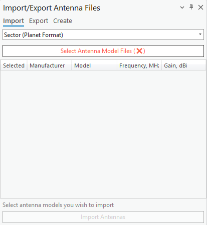
database. Select the antenna type in the dropdown list and proceed.
Select Files
This button opens a dialogue in which you can select one or more antenna pattern files to be imported. The
supported type formats are Planet, Andrew, and NSMA.
Import Antennas
Imports the selected Antenna pattern files to the Cellular Expert database.
Import Antennas
Refreshes the data table if changes have been made to it.

#### 7.10.2 Export Antennas
Exports selected antennas to a desired format.
Click on the button and select Export to export antenna patterns. Select the Export path on your
local hard drive, check the desired antennas, and click the Export button.

Export Path
The destination folder on your local hard drive to which the selected antennas will be exported. Can be
entered manually or by clicking the Open button and selecting it in the dialog. After defining the antenna
format, all available antennas of that format will be displayed in the Antennas table. The supported type
formats are Planet, Andrew, and NSMA.
Export Antennas
Exports the chosen antennas to the selected destination folder.

#### 7.10.3 Create Antennas
Create new antennas based on input parameters.
Click on the button and select Create to create antenna patterns. Various parameters of the
antenna can be entered, as well as horizontal and vertical beamwidth values or ranges. For the selected
horizontal and vertical values or ranges, the horizontal and vertical attenuations are set to 0, while all other

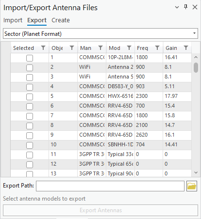
attenuations are set to 1000. Based on the horizontal and vertical beamwidths, the horizontal and vertical
antenna patterns are displayed.

| Parameter | Description |
|---|---|
| Manufacturer | Antenna manufacturer (company or entity). |
| Model | Antenna identification or name. |
| Frequency | Antenna frequency value in MHz. |
| Gain | Antenna gain value in dBi. |
| Horizontal beamwidth | Antenna’s horizontal beamwidth value or range in degrees. By default, the value is 60. |
| Vertical beamwidth | Antenna’s vertical beamwidth value or range in degrees. By default, the value is 15. |
| Create Antenna | Creates the antenna pattern in the database. |

### 7.11 Model Tuning
Click the button to open the Model Tuning dialogue.
Model Tuning is used to optimize prediction model parameters based on drive test points. These
measurements must be placed on a custom feature class and bound to a cell by its cell ID.
The custom drive test feature layer (class) must have these fields:
• Field Strength (fs in the class table)
• Latitude
• Longitude
• Cell_id (a field which binds the drive test to a cell network object)
Upon the creation of the feature class, you should select the drive test layer. It is necessary to have cells

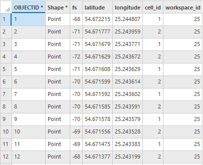
on the map for the calculations to work. Their OBJECTID should correspond to the cell_id present in the
feature class’s table.
Select a Drive Test Layer and the following properties should become visible:

| Parameter | Description |
|---|---|
| Drive Test Layer | The feature layer (class) that will be used to tune prediction model parameters. |
| Cell Identification | Cell name field name in drive test layer. The tool uses ObjectID value in Cells network objects to map drive test points. |
| Field Strength | Field Strength field name in drive test layer. |
| Resolution | Cell size for model tuning. |
| Prediction Model | Prediction model name and type which will be used to tune its parameters. |
| Selected | The count of all measurement points. |

Involved Cells
Information about the cell is given in this manner: cell name, cell ID, amount of measurements assigned to

the cell. At the moment, measuring for a single cell is supported.
Toggle All
Include/Exclude all selected cells.
Toggle Button By the Cell
Include/exclude certain cells from the test calculations.
Select the Cells with which you want to do the drive test by clicking the checkboxes and pressing the Run
Calculation button
Calculation results will appear in the dockpane, which contains the general, prediction model and clutter
values of the calculations.

Measurement points can be reselected by visibility: LOS (line of sight), OLOS (obstructed line of sight), or

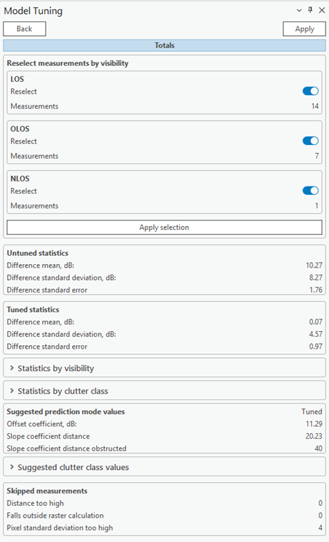
NLOS (no line of sight). This allows for easy rerun of the tool with only relevant points to perform further
tuning of the model.
Untuned and Tuned statistics
The comparison between the untuned and tuned prediction models is presented by highlighting the
differences in their mean values, standard deviations, and standard errors.
• Difference Mean during model tuning measures how the average prediction accuracy or
performance improves after optimizing model parameters compared to the default settings. For
example, tuning might reduce the average prediction error, leading to more accurate coverage or
signal estimations.
• Standard Deviation reflects the variability in prediction performance. Comparing standard
deviations between untuned and tuned models shows whether tuning makes predictions more
consistent and reliable. For example, lower standard deviation after tuning indicates the model's
predictions are less scattered and more stable.
• Standard Error during model tuning quantifies the precision of the mean prediction. A lower
standard error in the tuned model suggests that the average prediction is more reliable and less
influenced by sample variability, indicating improved model stability and confidence in its
performance.

Statistiscs by visibility and by clutter class are also available. Untuned and tuned difference points are also

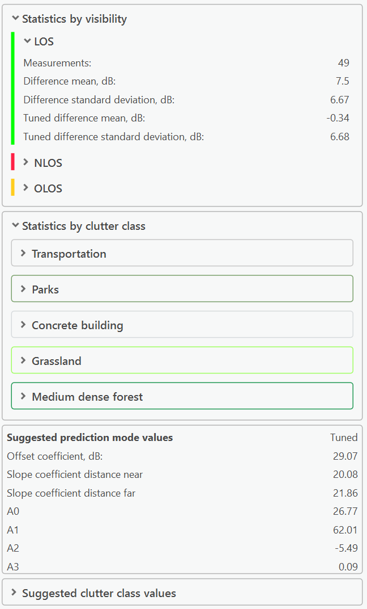
now visualized on the map as part of the model tuning calculation result in separate layers.
Suggested prediction model values
Model coefficients that are recommended to be changed.
• Offset coefficient – represents the offset in decibels added to the path loss grid. The default value
is 32 dB.
• Slope coefficient distance – defines the slope based on the distance between the cell and the
receiver location, with a default value of 20.
• Slope coefficient distance obstructed – represents the slope based on the obstructed distance
between the cell and the receiver location. The default value is 40.
| Parameter | Description |
|---|---|
| Suggested clutter class values | Recommended clutter loss values |
| Apply | Edit the tuned prediction model with suggested model and clutter class values. |
| Back | Get back to the main Model Tuning calculation window. |

## 8. Profile

### 8.1 Profile Tool
A Profile in wireless communication represents the geographical and environmental characteristics of
the path between a transmitter and a receiver. It includes detailed information such as elevation data,
terrain heights, and any obstacles (e.g., buildings, trees, or mountains) that might impact signal
propagation.
All relevant calculations are already performed within the system. These include the power budget,
which factors in the total power available for transmission and reception while accounting for system
gains and losses, and the path loss, which measures the reduction in signal strength due to distance,
frequency, and environmental obstructions. The profile also provides the calculated angles, including
the elevation angle (vertical angle between the transmitter and receiver) and the azimuth angle
(horizontal direction). Additionally, it determines whether a direct line-of-sight exists between the two

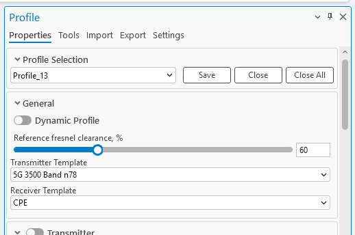
points.
This comprehensive information is ready for use, enabling users to assess the feasibility and
performance of a communication link for network planning, optimization, and troubleshooting.
Click the button to open the Profile dialogue.
Profile tool enables you to determine the obstructions, elevation, and Fresnel zones between two points
on a map.

#### 8.1.1 Properties
Profile: Profile Selection

Profile selection allows for quick switching between profiles while retaining the most recently defined

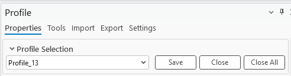

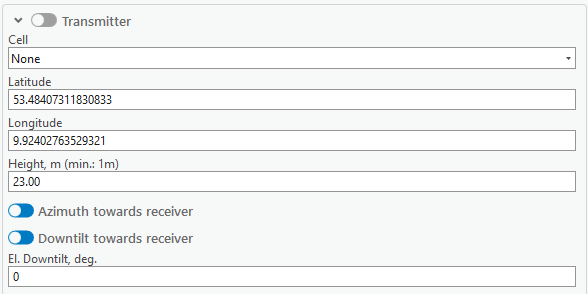
parameters. This feature is especially useful for comparing and verifying calculations across different
Tx and Rx configurations. When a new profile is created, it is automatically assigned a name and
appears in the Profile Selection option.
Profile can be saved or removed from the list.
| Parameter | Description |
|---|---|
| Save | The option saves the profile to Docs Manager tool with all defined parameters. |
| Close | Removes profile from the list in Profile Selection. |
| Close All | Removes all profiles from Profile Selection list. |
Profile: General
Fresnel Minimal Clearance, %
Percentage by which the primary Fresnel zones will be scaled up or down thus creating a secondary
Fresnel zone. The percentage must be in the range of 1 to 200. The value can be changed either by
inputting it manually or by using the slider.
Transmitter Template
The template that is used for transmitter’s default values.
Receiver Template
The template that is used for receiver’s default values.

| Parameter | Description |
|---|---|
| Profile: Transmitter | Toggling the switch to the left of Transmitter will enable the Fixed Transmitter functionality, which will modify only the receiver’s positioning when drawing the profile on the map. |
| Cell | A cell from which the profile will be drawn. The parameters of the cell will be taken into calculation if the cell is snapped to by the profile tool. |
| Latitude | Decimal degrees Y type coordinate. |
| Longitude | Decimal degrees X type coordinate. |
| Height, m | Height above the ground in meters. The minimum value must be 1m. |
Azimuth towards receiver
Enabled by default. When enabled, the transmitter’s azimuth is towards the receiver. Disabling this
option it would take azimuth value from the Cell object, and use it for FWA Power Budget calculations,
it also allows the user to enter a custom azimuth value for the transmitter.
Downtilt towards receiver
Enabled by default. When enabled, the transmitter’s tilt is towards the receiver. Disabling this option it
would take tilt value from the Cell object, and use it for FWA Power Budget calculations, it allows the
user to enter a custom tilt value for the transmitter.
El. Downtilt, deg.
Electrical downtilt value for the transmitter, in degrees.

The antenna for the transmitter can be selected from the table below the El. Downtilt, deg input. Its

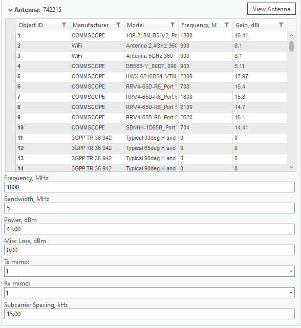
pattern can be viewed by clicking the View Antenna button on the right side.
Frequency of the transmitter.
| Parameter | Description |
|---|---|
| Bandwidth, MHz | Bandwidth of the transmitter. |
| Power, dBm | A power that the transmitter possesses. |
| Misc Loss, dB | Miscellaneous loss value in dB. Value is not required. |
| Tx mimo | Transmitter antenna count. Available values: 1, 2, 4, 8, 16, 32 and 64. |
| Rx mimo | Receiver antenna count. Available values: 1, 2, 4, 8, 16, 32 and 64. |
| Subcarrier spacing | Value in kHz. |

Profile: Receiver
| Parameter | Description |
|---|---|
| Latitude | Decimal degrees Y type coordinate. |
| Longitude | Decimal degrees X type coordinate. |
| Height, m | Height above the ground in meters. The minimum value must be 1m. |
| Azimuth towards transmitter | Enabled by default. When enabled, the receiver’s azimuth is towards the transmitter. Disabling this option it would take azimuth value from the receiver (Cell) object, and use it for FWA Power Budget |

calculations, it also allows the user to enter a custom azimuth value for the receiver.
Downtilt towards transmitter
Enabled by default. When enabled, the receiver’s tilt is towards the transmitter. Disabling this option it

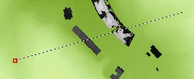
would take tilt value from the receiver (Cell) object, and use it for FWA Power Budget calculations,
it allows the user to enter a custom tilt value for the receiver.
Power, dBm
A power that the receiver possesses.
Misc Loss, dB
Miscellaneous loss value in dB. Value is not required.
Profile: Prediction Model
Double-click the prediction model from the list to select it for the profile.

#### 8.1.2 Draw Profile
When the Profile tool is selected and enabled, you will be able to select two points on the map in turn
creating a Profile line.
The profile also lets you snap to different Cellular Expert network objects. If the object to which the
user snaps is a cell, all parameters of that cell that are necessary to draw a profile will be read and
included in the calculations. If the object is not a cell, then only the name and the object’s
coordinates will be taken.
Most of these values will be displayed in the Profile pane shown above. If you change the values in the
pane, these changes will be reflected in the Profile plot by redrawing it.
Upon the selection of a second point, these geometries will be created between the points:
• LOS (green) - the distance until the first obstruction in the profile’s way
• OLOS (orange) – the distance until the first clutter LOS obstruction
• NLOS (red) – the obstructed path between the sender and receiver
• Lowest Clearance (yellow) – the point at which NLOS has the lowest clearance to the obstacle
• Rx (purple) – the receiver point
• Tx (green) – the transmitter point
• Fresnel (blue) – the Fresnel lines

The Profile plot illustrating these geometries, obstacles (buildings), and the Fresnel zone will appear in

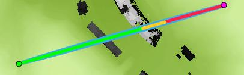

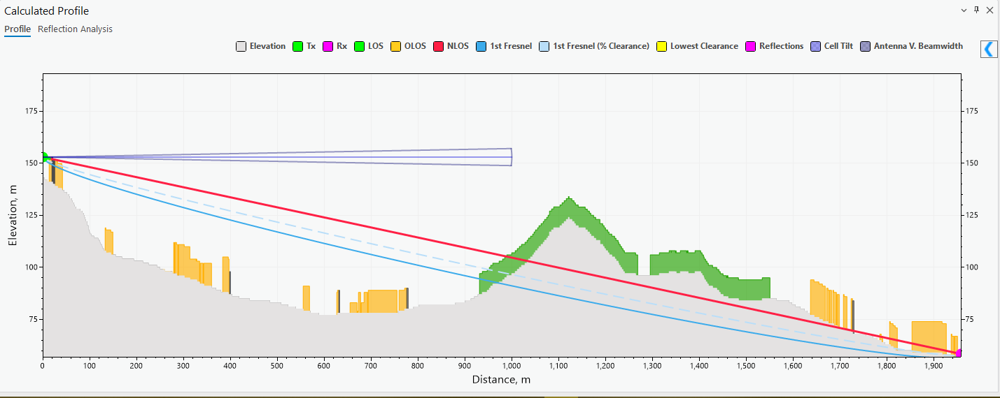

a dockpane below. You can inspect the values at particular points by moving the cursor around the
plot. The cursor movement on the plot will be projected as a moving point on the map. If a cell is
selected for the transmitter, the cell’s tilt (the sum of mechanical and electrical tilts) and vertical
beamwidth are displayed as additional symbols: a light blue line and a darker blue cone
respectively. The length of the cell tilt and antenna vertical beamwidth symbols is the radius of the
prediction model selected for the cell.
The button allows you to see the Prediction Calculation results.

You can change the colors of the profile by clicking the colored squares near the names of the parameters.

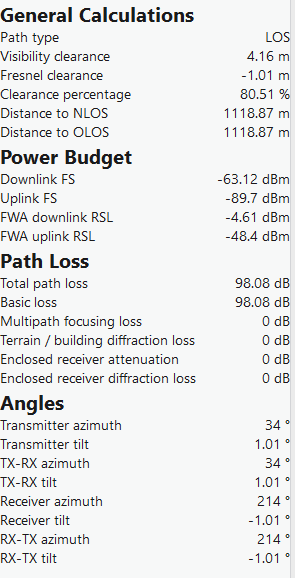

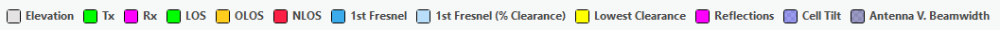
The colors will be updated automatically. You can toggle the visibility of each separate parameter of
the profile by clicking on the name of the element. Enabled elements are indicated by bold text,
and disabled elements are indicated by regular text.

You can change the height of the transmitter/receiver points by dragging their ends on the plot.
Hovering the cursor over the plot displays a tooltip with the meter values for profile, building, clutter,

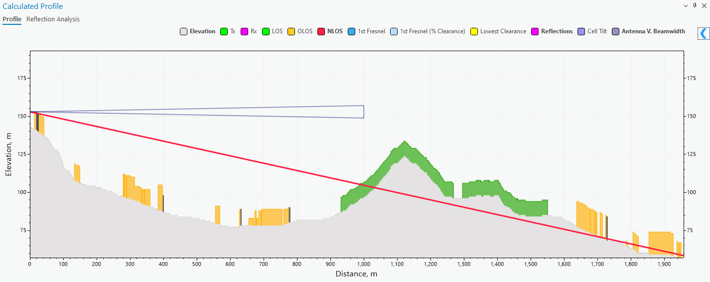

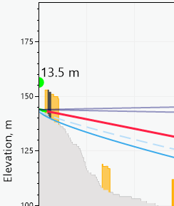
elevation, distance, etc., as well as their representations in colors.

8.1.2.1 Adjust Data
Adjust data is found on the Profile Plot dockpane near the Results. The tool lets you change the

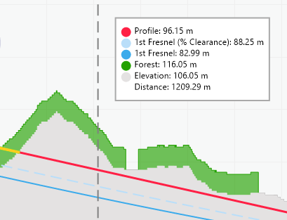

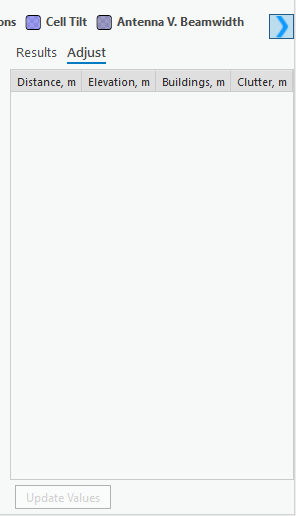
elevation, building, and clutter data of the area visible in the profile plot.
When the Adjust tab is opened, select a desirable range for the data adjustment on the plot.

You can make slight changes to the range of the selection area by hovering over the area's edges and

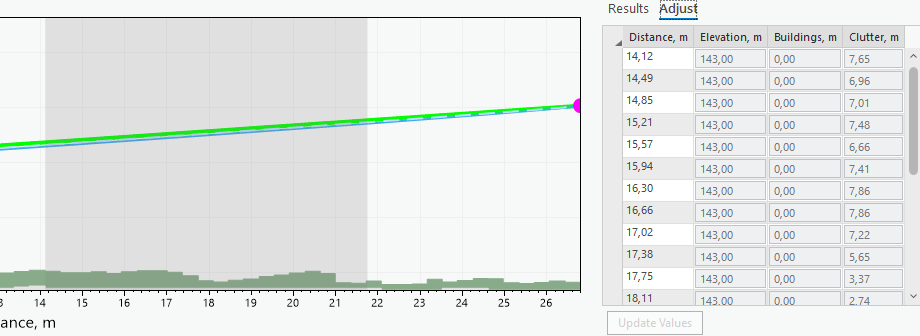

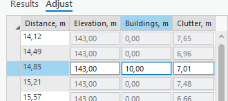

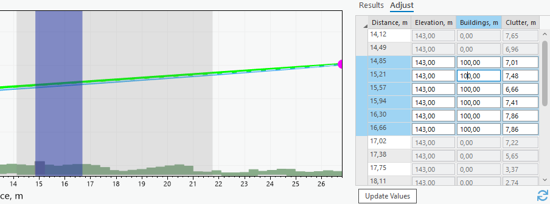

dragging them. To adjust the values, click on one of the text boxes and insert the value.
To change multiple values simultaneously, drag across the adjustment table and select multiple rows.
Changing the value of a single text box will also change all the other chosen rows’ values in that
text box. The selected area will be highlighted on the profile plot.
To update the values, either select an unselected row or press the button.

To reset the adjusted values to defaults, click the Refresh button .
Manual Profile
If you want to insert specific coordinates and draw a profile that way, you can insert these values in the

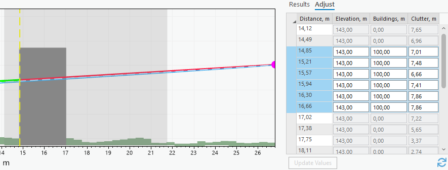

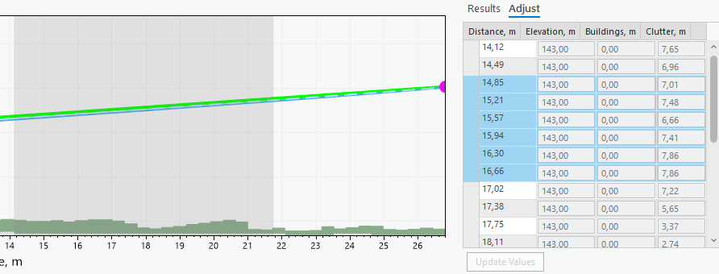

Profile pane and click the Manual Profile button.
Dynamic Profile
The button toggles the Dynamic Profile.
Dynamic Profile lets you see Profile calculations and the plot be drawn in real-time as the cursor
moves. Whenever the cursor stops momentarily – the profile gets drawn. The transmitter point
needs to be entered for the dynamic profile to be activated. The previous transmitter point will be
chosen if the point is not currently entered.
If a second point is selected while the profile is being drawn, the dynamic profile will be disabled, and
the LOS lines will appear on the map.

#### 8.1.3 Tools
Reflections are considered in profile and RF calculations to assess how radio waves bounce off
surfaces, affecting signal path and strength.
To enable reflections select either Single or Multipath Reflection. Be aware that if reflections are not
visible you may need to adjust the height of the receiver/transmitter accordingly.
It is recommended to disable the Step Plot of the profile before using Reflections (see Settings).
Use Single Reflection
Enable a reflection that will reflect straight from the transmitter to the receiver point with the smallest

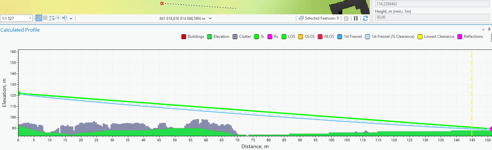

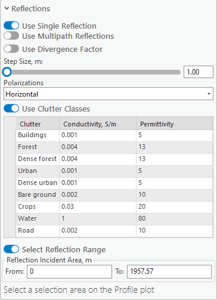
angle.

| Parameter | Description |
|---|---|
| Use Multipath Reflections | Enable all reflections that happen along the profile line. |
| Use Divergence Factor | Quantifies the extent to which a reflected signal spreads out, affecting its strength and coverage. |
| Step Size | The length period by which the reflection will be calculated. The step size is determined by taking the average cell size of the elevation raster. |
| Polarizations | The polarization of reflections (vertical or horizontal). |
| Use Clutter Classes | Enables the use of default clutter classes for the reflection calculations (see Clutter Classes ). If disabled, custom values may be used for conductivity and permittivity. |
Select Reflection Range
Lets you set a range in which the reflection calculations should happen. This will affect both Single and

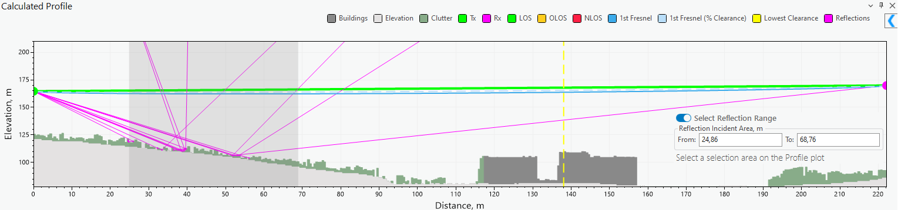

Multipath reflections and help highlight specific important areas along the profile as well as speed
up the calculation process.
The range will be enabled as soon as a profile is drawn.
You can select this range on the plot, by holding down the left mouse button and dragging across the
screen.
Reflection results will appear in the Profile Results table.

8.1.3.1 Reflection Analysis
The Reflection Analysis tool for Profile is designed to help analyze and visualize signal reflections based

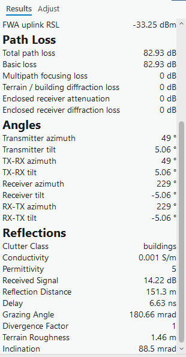
on the changes in various profile parameters like frequency, transmitter height, receiver height, and K-
factor. Reflections must be enabled to perform analysis, and the Single Reflection option is automatically
enabled when the tool is selected.

| Parameter | Description |
|---|---|
| Dependency on Frequency | Calculate reflection analysis based on frequency range (from GHz to GHz) |
| Dependency on Receiver height | Calculate reflection analysis based on receiver height range (from m to m) |
| Dependency on Transmitter height | Calculate reflection analysis based on transmitter height range (from m to m) |
| Dependency on K-Factor | Calculate reflection analysis based on K-factor range (from radius, km to radius, km) |

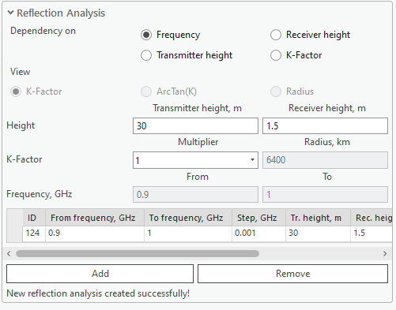

The reflection analysis results for each type of dependency are displayed in the Reflection Analysis tab
of the Calculated Profile window.

#### 8.1.4 Import
Import a profile by selecting a profile file in the Import section. Supported formats: .pl2 (path loss file).

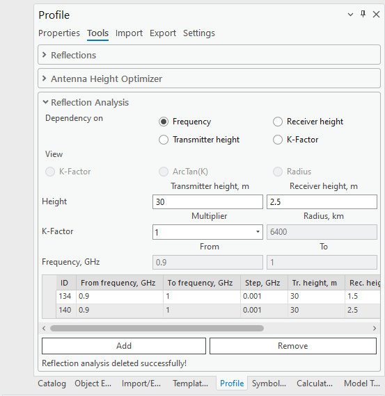

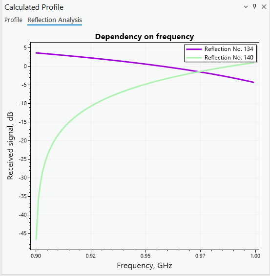
Once imported successfully, the profile data may then be customized.

Load Profile
Creates the profile with the provided data.

#### 8.1.5 Export (Profile Report)
The input data and calculation results can be automatically transferred into a Profile Report. This report
will show transmitter/receiver input data, calculation results as well as the Profile plot and map view in which

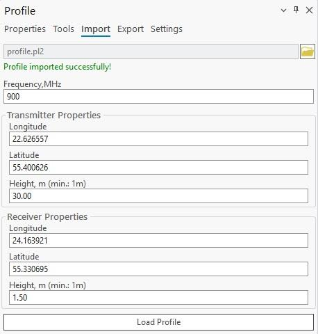

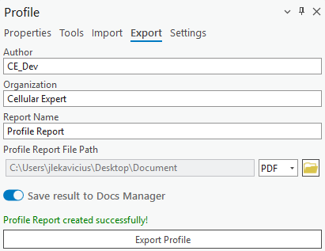
the profile was drawn. The report can be exported in PDF and PL2 formats.

The resulting Profile report will look similar to this example:

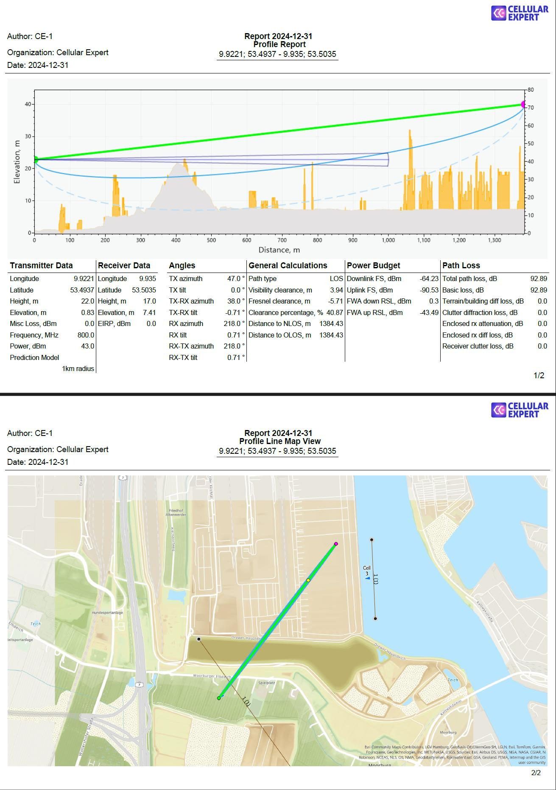

#### 8.1.6 Settings
Currently, you can configure the profile’s visual properties and controls in profile settings. The settings

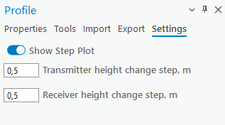
can be changed once a profile is drawn.
| Parameter | Description |
|---|---|
| Show Step Plot | Display data points as a series of steps rather than a smooth line or individual points. |
| Transmitter height change stepnter | The step (in meters) for changing the transmitter height when dragging it in the Profile graph. The default value is 0.5 meters. |
| Receiver height change step | The step (in meters) for changing the receiver height when dragging it in the Profile graph. The default value is 0.5 meters. |
value is 0.5 meters.

## 9. Coverage Prediction

### 9.1 CE Calculation Task List
All results of the prediction calculations can be found in the CE Calculation Task List tab. This includes
failed and successful calculations.
Click on the button to open the CE Calculation Task List dialogue.
The task list refreshes automatically once calculation tasks are run. The task status is indicated by three
main colors: blue (in progress), green (completed), and red (failed). Calculation tasks can be deleted
from the task list by clicking on the right side of the task. To open a result raster, select it from the results

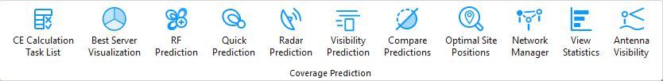

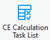

dropdown and click Open Results. Filtering by calculation spans these types: Antenna Visibility Prediction,
EMF Calculation, Link Prediction, Model Tuning, Optimal Site Positions Calculation, RF Prediction, Siren
Sound Prediction, and Visibility Prediction.

### 9.2 Best Server Visualization
This tool is designed to generate network object names for the Best Server raster. Loading the Best Server
raster with attribute information into the Table of Contents can be time-consuming after RF prediction,

audibility prediction, or other analyses. To streamline this process, we have introduced a separate tool that

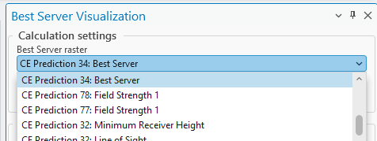

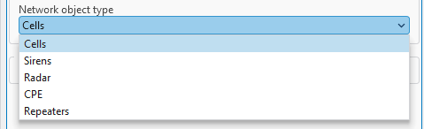

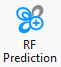
efficiently generates additional information for the Best Server raster. The tool allows users to define the
network object type and select the prediction raster (Best Server).

1. Select calculation result.

2. Select network object type.
Press Run to generate object names for selected prediction raster.

### 9.3 RF Prediction
Cells are automatically divided into sections based on the technology attribute.
Select cells on the map and click the button to open the RF Prediction dialogue.
Based on the selection, the cells will be divided into technologies.

| Parameter | Description |
|---|---|
| Calculation Name | The name of the calculation will be displayed in the CE Calculation Task List . |
| Open raster after completion | Displays the prediction visualization (raster) after successful prediction calculation. |
| Recalculate Objection Position | Review current X/Y and Longitude/Latitude values in selected Cells table, and correct them if these values are different to object’s geometry. |
| Calculate 3D | Run calculations in different receiver heights and after completion creates single Voxel file to visualize Field Strength values in 3D scene. |
| Run | Starts the prediction calculation. |

#### 9.3.1 Narrowband 2G (GSM/CDMA-850/TETRA/P-25)
Resolution
Resolution for raster calculations. The output rasters will be produced with the indicated cell size.
Best server count
Option to calculate up to 5 best servers. The prediction rasters show the 1st, 2nd, 3rd, and so on strongest

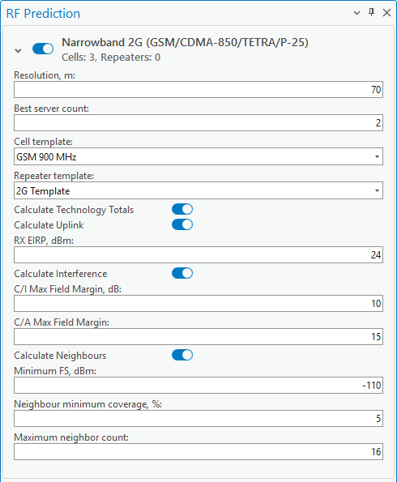
signal sources.
Cell Template
Option to use the parameters from the template if the cell misses the required parameters.
Repeater Template
Option to use the parameters from the template if repeaters are selected and they are missing the required
parameters.
Calculate Technology Totals
Combines all resulting Field Strength rasters into a singular Field Strength raster.
Calculate Uplink
Option to calculate the Uplink signal strength.
RX EIRP, dBm
The power that the receiving antenna can capture from the transmitted signal in dBm.
Calculate Interference

Calculates the interference for 2G cells. For this calculation, the C/I and C/A thresholds must be defined.
C/I Max Field Margin, dB
The corresponding channel’s signal interference if the first and the second strongest signals differ by less
than or equal to 10 dBm.
C/A Max Field Margin, dB
The neighboring channel’s signal interference if the first and the second strongest signals differ by less than
or equal to 10 dBm.
Calculate Neighbours
Enable cell neighbour matrix calculation.
Neighbour relationships between cells are determined based on:
• Minimum FS threshold (dBm) – ensures neighbours are only counted if they meet a minimum signal
level.
• Neighbour minimum coverage (%) – sets the minimum overlap percentage required for a cell to
qualify as a neighbour.
• Maximum neighbour count – limits the number of neighbours assigned to each cell.
The results include a visual neighbour matrix showing connections between cells with coloured link lines.
For each calculated cell:
• Frequency group (MHz)
• Covered area (km²)
• Neighbouring cells with:
o Relation type (e.g., Intra-Frequency)
o Overlap area (in km²)
o Overlap percentage (%)

Available coverage rasters
• Received signal level raster in dBm, within the channel bandwidth appropriate to this technology.
It is possible to calculate separately the rasters for the 1st, 2nd, 3rd, 4th, and 5th strongest signal levels,

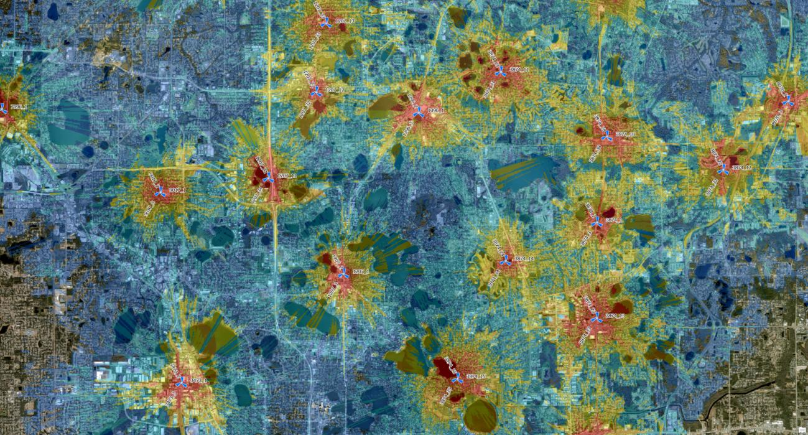
and it depends on the count defined in the Best server count option.
• The best server raster shows the identification of cells generating the strongest signals at each
pixel. Raster count depends on the Best server count parameter value specified by the user.
o 1st best server shows the serving cell with the strongest field strength.
o 2nd best server shows the second strongest field strength cell identification.
o 3rd best server shows the third strongest field strength cell identification.
o 4th best server shows the fourth strongest field strength cell identification.
o 5th best server shows the fifth strongest field strength cell identification.
• C/I rasters show Carrier-to-interference ratio in dB, to account for inter-cell interference from nearby
cells that utilize the same carrier.
• C/A raster shows Carrier-to-Adjacent interference ratio in dB, to account for inter-cell interference
from nearby cells that operate the adjacent carrier (adjacent frequency channel).
• Uplink Field Strength raster shows receiver signal strength in dBm.

#### 9.3.2 Broadband 3G (UMTS/CDMA)
Resolution
Resolution for raster calculations. The output rasters will be produced with the indicated cell size.
Best server count
Option to calculate up to 5 best servers. The prediction rasters show the 1st, 2nd, 3rd, and so on strongest

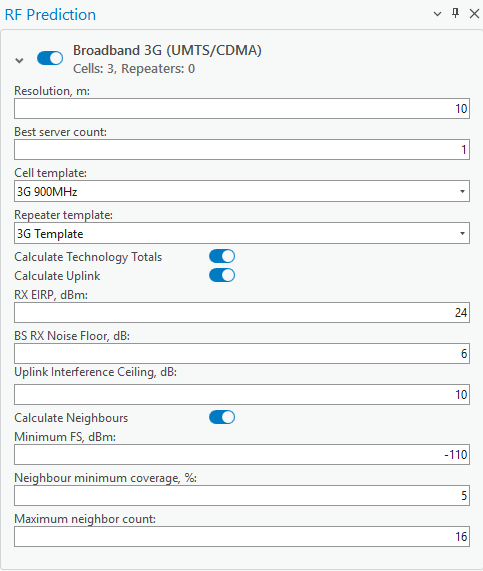
signal sources.
Cell Template
Option to use the parameters from the template if the cell misses the required parameters.
Repeater Template
Option to use the parameters from the template if repeaters are selected and they are missing the required
parameters.
Calculate Technology Totals
Combines all resulting Field Strength rasters into a singular Field Strength raster.
Calculate Uplink
Option to calculate the Uplink signal strength.
RX EIRP, dBm
The power that the receiving antenna can capture from the transmitted signal in dBm.
BS RX Noise Floor
BS RX Noise Floor refers to the minimum power level of unwanted noise or interference at the receiver at

the base station.
Uplink Interference Ceiling
the maximum allowable level of interference in the uplink direction of a wireless communication system
before it adversely affects the system's performance or capacity.
Calculate Neighbours
Enable cell neighbour matrix calculation.
Neighbour relationships between cells are determined based on:
• Minimum FS threshold (dBm) – ensures neighbours are only counted if they meet a minimum signal
level.
• Neighbour minimum coverage (%) – sets the minimum overlap percentage required for a cell to
qualify as a neighbour.
• Maximum neighbour count – limits the number of neighbours assigned to each cell.
The results include a visual neighbour matrix showing connections between cells with coloured link
lines.
For each calculated cell:
• Frequency group (MHz)
• Covered area (km²)
• Neighbouring cells with:
o Relation type (e.g., Intra-Frequency)
o Overlap area (in km²)
o Overlap percentage (%)

• The best server raster shows the identification of cells generating the strongest signals at each

pixel. Raster count depends on the Best server count parameter value specified by the user.
o 1st best server shows the serving cell with the strongest field strength.
o 2nd best server shows the second strongest field strength cell identification.
o 3rd best server shows the third strongest field strength cell identification.
o 4th best server shows the fourth strongest field strength cell identification.
o 5th best server shows the fifth strongest field strength cell identification.
• Uplink Field Strength raster shows receiver signal strength in dBm.

#### 9.3.3 Broadband 4G (LTE/BWA/WiMAX)
Resolution
Resolution for raster calculations. The output rasters will be produced with the indicated cell size.
Best server count
Option to calculate up to 5 best servers. The prediction rasters show the 1st, 2nd, 3rd, and so on strongest

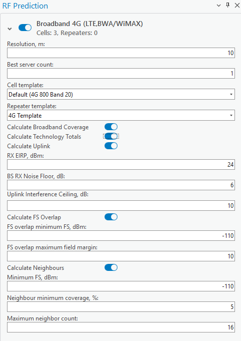
signal sources.
Cell Template
Option to use the parameters from the template if the cell misses the required parameters.
Repeater Template
Option to use the parameters from the template if repeaters are selected and they are missing the required
parameters.
Calculate Broadband Coverage
Use this option to calculate:

• RSSI
• RSRQ
• RS-SINR
• DL Throughput
• Max. DL Throughput
• DL CQI
Calculate Technology Totals
Combines all resulting Field Strength rasters into a singular Field Strength raster.
Calculate Uplink
Option to calculate:
Uplink Field Strength
Uplink Best Server
Uplink SINR
Uplink Throughput
Uplink Max. Throughput
Uplink CQI
RX EIRP, dBm
The power that the receiving antenna can capture from the transmitted signal in dBm.
BS RX Noise Floor
BS RX Noise Floor refers to the minimum power level of unwanted noise or interference at the
receiver at the base station.
Uplink Interference Ceiling
the maximum allowable level of interference in the uplink direction of a wireless communication
system before it adversely affects the system's performance or capacity.
Calculate FS Overlap
This calculation in Cellular Expert calculates the geographical areas where two different cells provide similar
signal strength. Specifically, it identifies regions where the absolute difference between the field strengths
of Cell 1 and Cell 2 is less than a defined threshold (e.g., 10 dB). This analysis is useful for understanding
coverage overlaps and potential handover zones between cells.
Field strength overlap can now be calculated using:
• Minimum FS threshold (dBm) – defines the lowest acceptable field strength for overlap
consideration.
• Maximum field margin (dB) – sets the tolerance range for overlap levels.
The output is a raster layer that displays the degree of overlap in dB ranges (e.g., <3 dB, 3–5 dB, 5–7
dB, 7–9 dB, >9 dB). This enables planners to quickly identify areas of strong cell overlap, potential
handover zones, or interference-prone regions.

Calculate Neighbours
Enable cell neighbour matrix calculation.
Neighbour relationships between cells are determined based on:
• Minimum FS threshold (dBm) – ensures neighbours are only counted if they meet a minimum signal
level.
• Neighbour minimum coverage (%) – sets the minimum overlap percentage required for a cell to
qualify as a neighbour.
• Maximum neighbour count – limits the number of neighbours assigned to each cell.
The results include a visual neighbour matrix showing connections between cells with coloured link

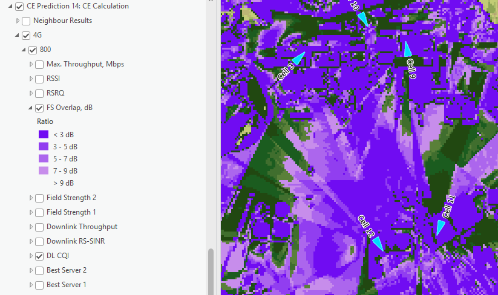
lines.
For each calculated cell:
• Frequency group (MHz)
• Covered area (km²)
• Neighbouring cells with:
o Relation type (e.g., Intra-Frequency)
o Overlap area (in km²)
o Overlap percentage (%)

Available coverage rasters
• Reference Signal Receive Power (RSRP) raster in dBm, as measured for a reference OFDMA sub-
carrier bandwidth. It is possible to calculate the rasters separately for the 1st, 2nd, 3rd, 4th, and 5th
strongest signal levels and depends on the count defined in the Best server count option.
• The best server raster identifies cells that generate the strongest signals at each pixel. Raster count

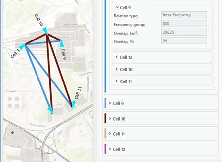
depends on the Best server count parameter value specified by the user.

o 1st best server shows the serving cell with the strongest field strength.
o 2nd best server shows the second strongest field strength cell identification.

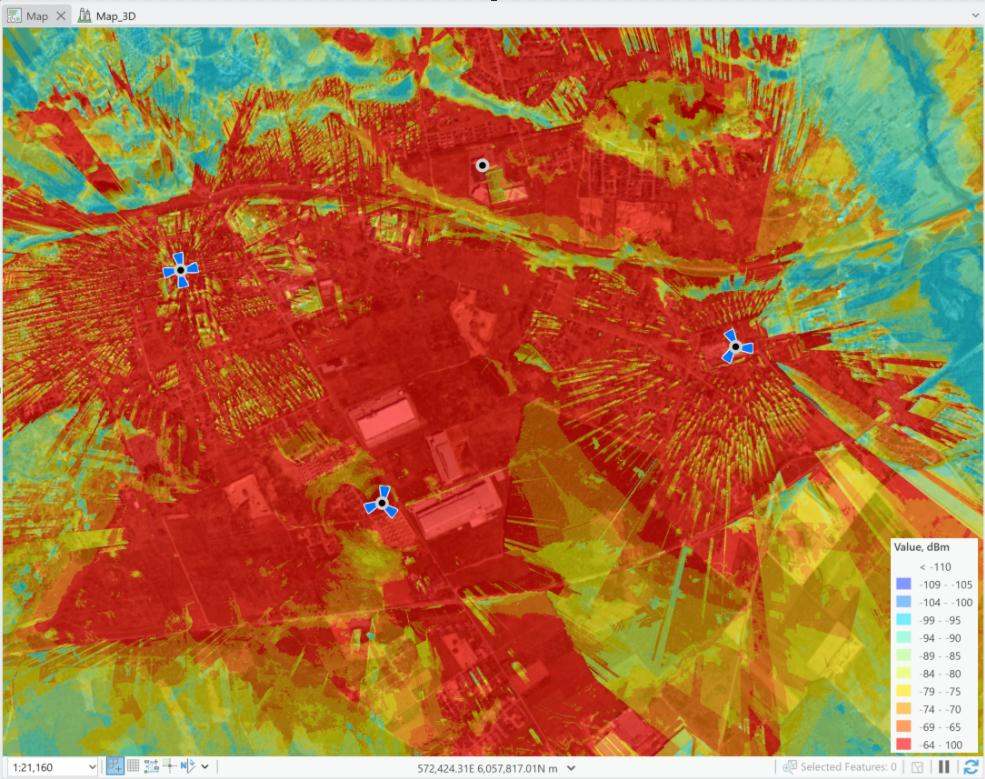
o 3rd best server shows the third strongest field strength cell identification.
o 4th best server shows the fourth strongest field strength cell identification.
o 5th best server shows the fifth strongest field strength cell identification.
• Received Signal Strength Indicator (RSSI) estimated values' raster in dBm.
• Reference Signal Receive Quality (RSRQ) estimated values’ raster in dB.

• Reference Signal’s – Signal to Interference and Noise Ratio (RS-SINR) estimated values’ raster in

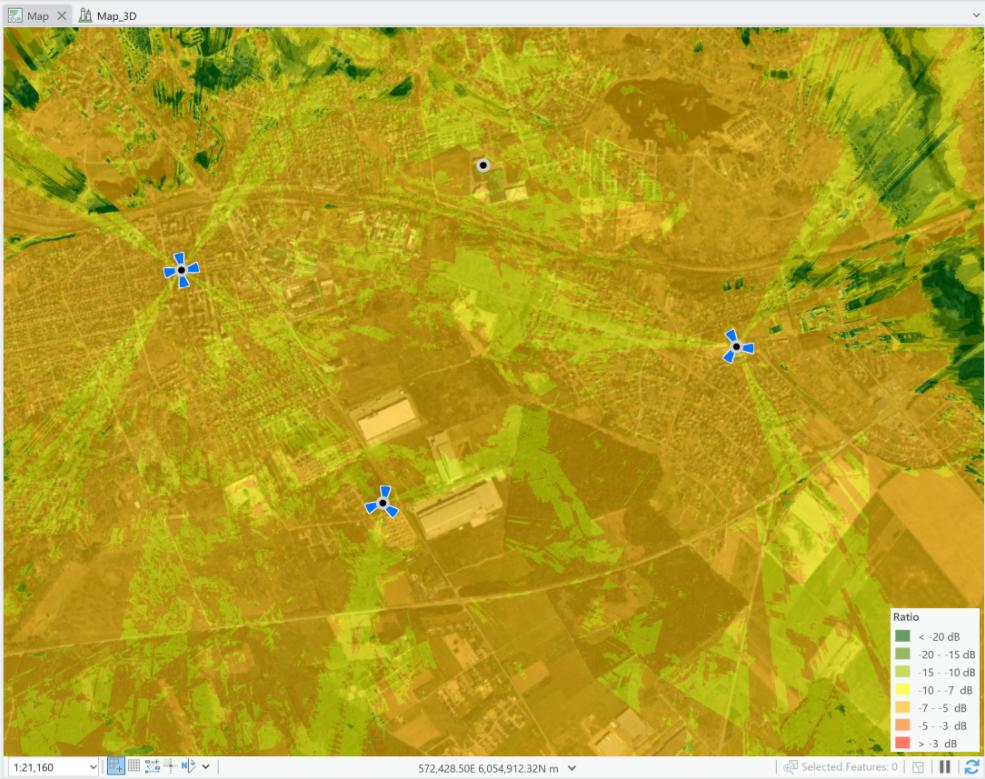

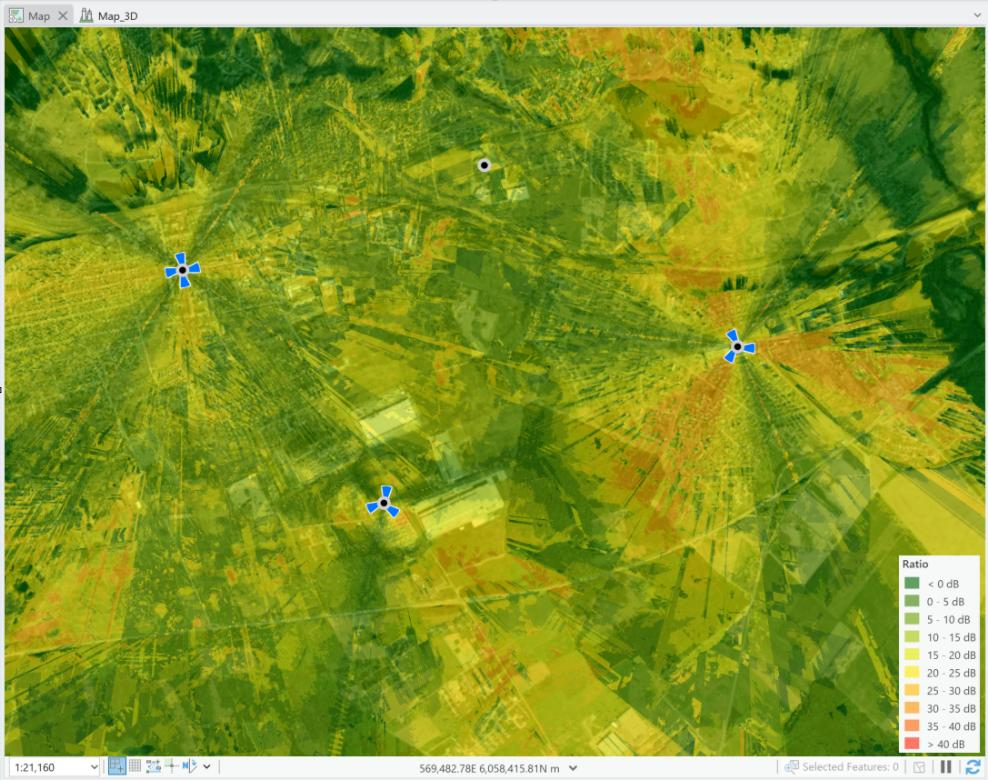
dB.
• CQI identification values.

• Estimated achievable (including Cell Load) Downlink Throughput values’ raster in Mbps.

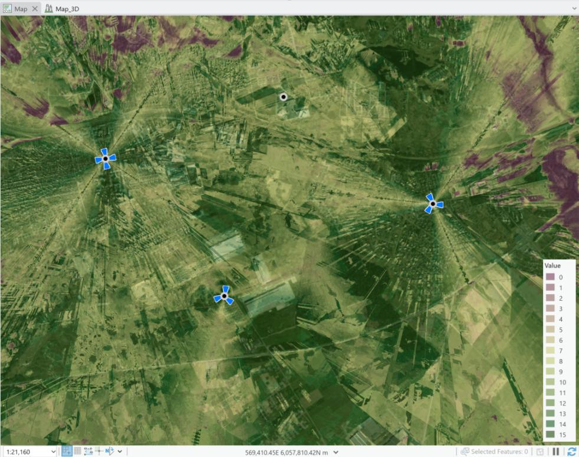

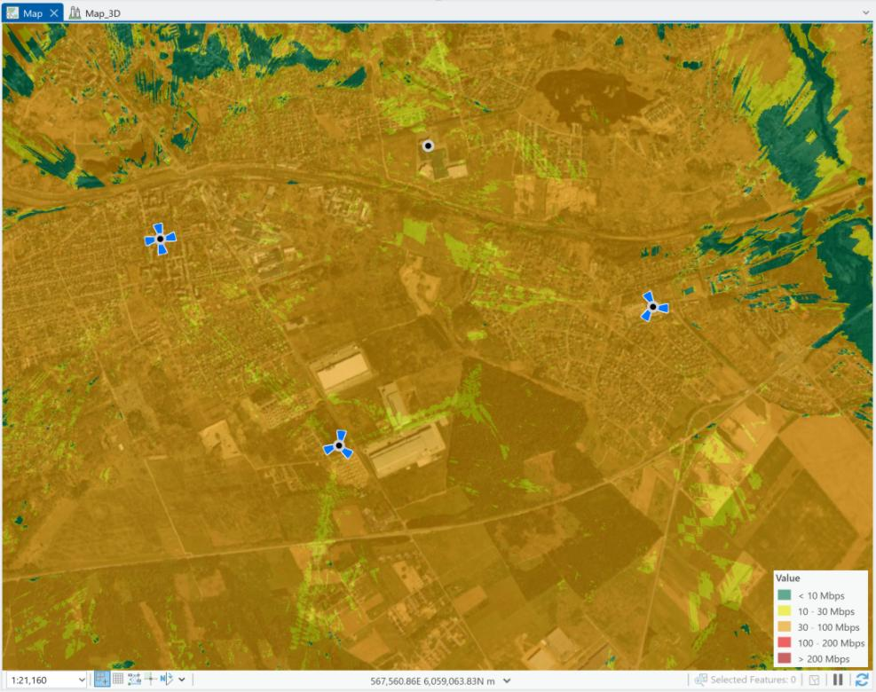
• Field Strength Overlap

• Maximum (without Cell Load) Downlink Throughput values’ raster in Mbps.

• Uplink Field strength raster in dBm.

• Uplink SINR raster in dB
• Uplink CQI identification.

• Uplink Throughput in Mbps

#### 9.3.4 Broadband 5G (NR/CBRS)
Resolution
Resolution for raster calculations. The output rasters will be produced with the indicated cell size.
Best server count
Option to calculate up to 5 best servers. The prediction rasters show the 1st, 2nd, 3rd, and so on strongest

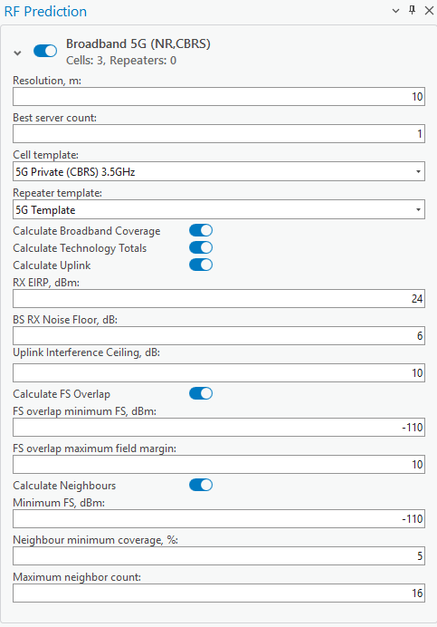
signal sources.
Cell Template
Option to use the parameters from the template if the cell misses the required parameters.
Repeater Template
Option to use the parameters from the template if repeaters are selected and they are missing the required
parameters.
Calculate Broadband Coverage
Use this option to calculate:

• RSSI
• RSRQ
• RS-SINR
• DL Throughput
Calculate Technology Totals
Combines all resulting Field Strength rasters into a singular Field Strength raster.
Calculate Uplink
Option to calculate:
Uplink Field Strength
Uplink Best Server
Uplink SINR
Uplink Throughput
Uplink Max. Throughput
Uplink CQI
RX EIRP, dBm
The power that the receiving antenna can capture from the transmitted signal in dBm.
BS RX Noise Floor
BS RX Noise Floor refers to the minimum power level of unwanted noise or interference at the
receiver at the base station.
Uplink Interference Ceiling
the maximum allowable level of interference in the uplink direction of a wireless communication
system before it adversely affects the system's performance or capacity.
Calculate FS Overlap
This calculation in Cellular Expert calculates the geographical areas where two different cells provide similar
signal strength. Specifically, it identifies regions where the absolute difference between the field strengths
of Cell 1 and Cell 2 is less than a defined threshold (e.g., 10 dB). This analysis is useful for understanding
coverage overlaps and potential handover zones between cells.
Field strength overlap can now be calculated using:
• Minimum FS threshold (dBm) – defines the lowest acceptable field strength for overlap
consideration.
• Maximum field margin (dB) – sets the tolerance range for overlap levels.
The output is a raster layer that displays the degree of overlap in dB ranges (e.g., <3 dB, 3–5 dB, 5–7
dB, 7–9 dB, >9 dB). This enables planners to quickly identify areas of strong cell overlap, potential
handover zones, or interference-prone regions.
Calculate Neighbours
Enable cell neighbour matrix calculation.
Neighbour relationships between cells are determined based on:
• Minimum FS threshold (dBm) – ensures neighbours are only counted if they meet a minimum signal
level.
• Neighbour minimum coverage (%) – sets the minimum overlap percentage required for a cell to

qualify as a neighbour.
• Maximum neighbour count – limits the number of neighbours assigned to each cell.
The results include a visual neighbour matrix showing connections between cells with coloured link
lines.
For each calculated cell:
• Frequency group (MHz)
• Covered area (km²)
• Neighbouring cells with:
o Relation type (e.g., Intra-Frequency)
o Overlap area (in km²)
o Overlap percentage (%)
Available coverage rasters
• Equivalent Reference Signal Receive Power (RSRP) raster in dBm, as measured for a reference
OFDMA sub-carrier bandwidth. It is possible to calculate separately the rasters for the 1st, 2nd, 3rd,
4th, and 5th strongest signal levels and it depends on the count defined in the Best server count
option.

• The best server raster identifies cells that generate the strongest signals at each pixel. Raster count

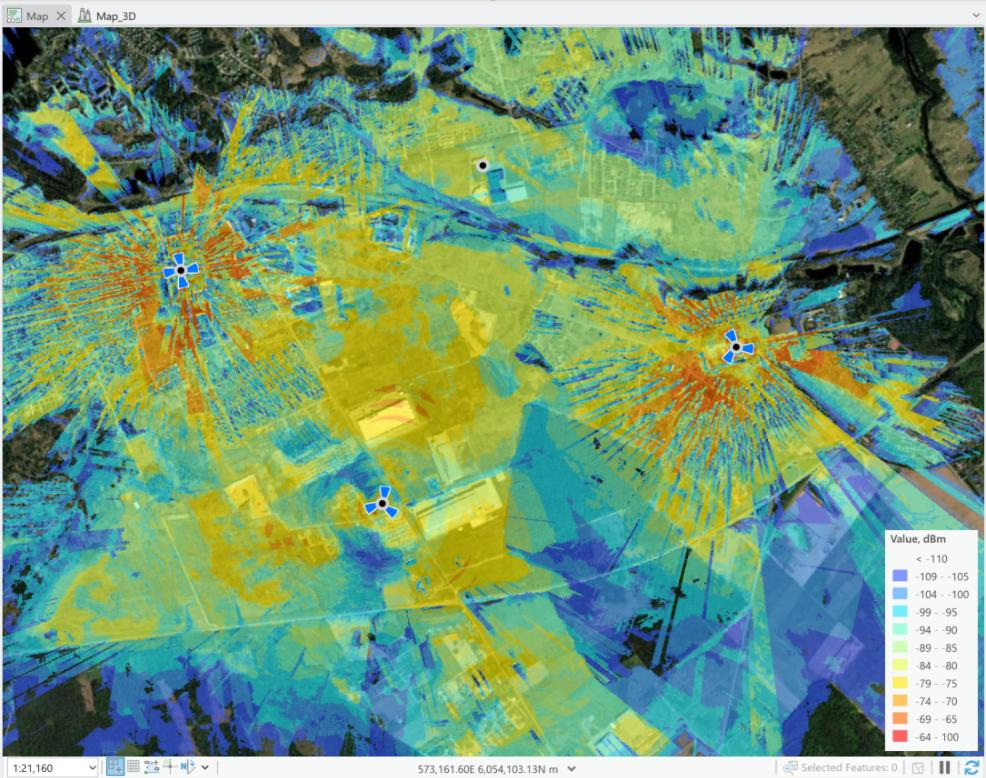
depends on the Best server count parameter value specified by the user.
o 1st best server shows the serving cell with the strongest field strength.
o 2nd best server shows the second strongest field strength cell identification.
o 3rd best server shows the third strongest field strength cell identification.
o 4th best server shows the fourth strongest field strength cell identification.
o 5th best server shows the fifth strongest field strength cell identification.
• Received Signal Strength Indicator (RSSI) estimated values' raster in dBm.

• Reference Signal Receive Quality (RSRQ) estimated values’ raster in dB.
• Reference Signal’s – Signal to Interference and Noise Ratio (RS-SINR) estimated values’ raster in

dB.

• CQI identification values.
• Estimated achievable (including Cell Load) Downlink Throughput values’ raster in Mbps.

• Maximum (without Cell Load) Downlink Throughput values’ raster in Mbps.

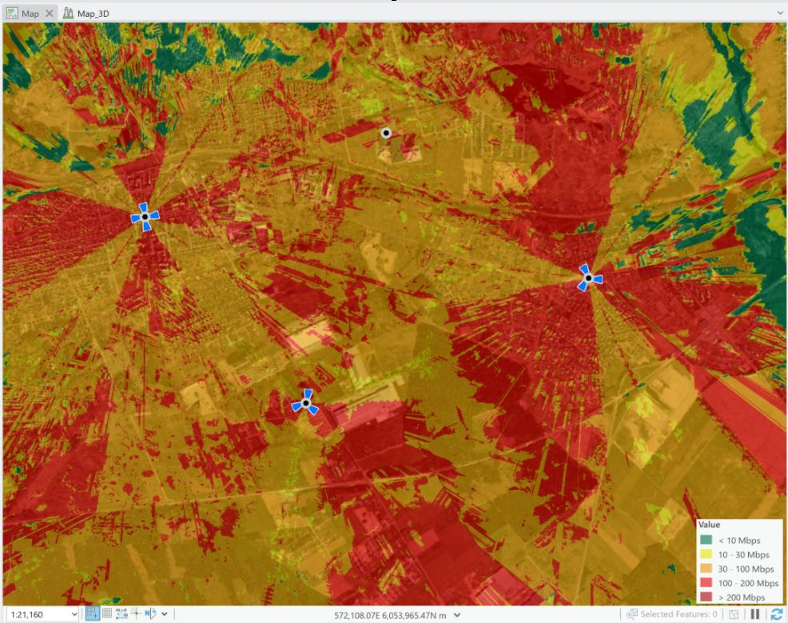

• Field Strength Overlap
• Uplink Field strength raster in dBm.

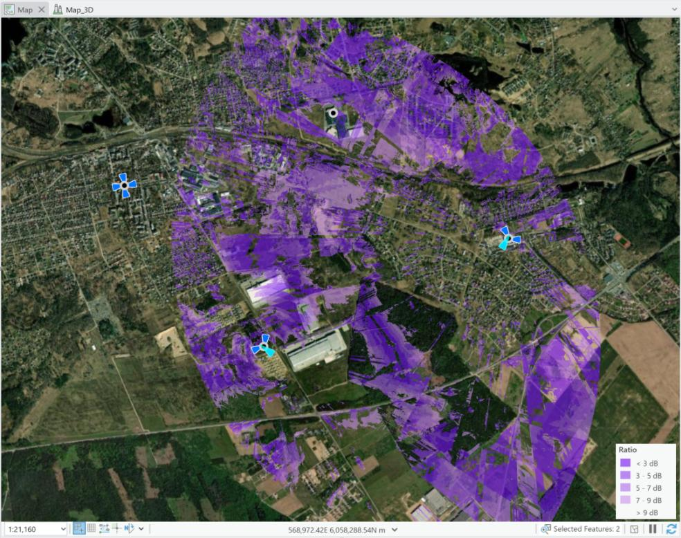

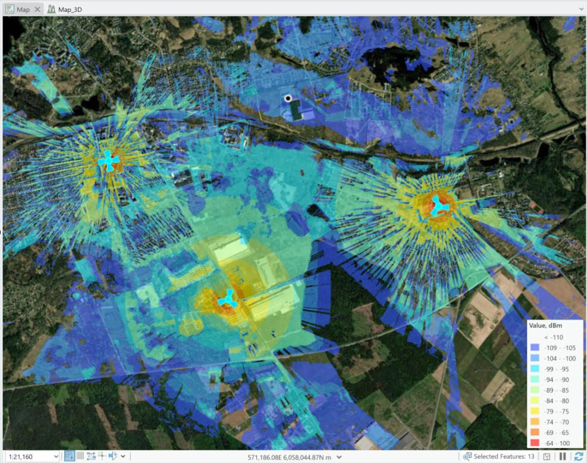
• Uplink SINR raster in dB

• Uplink CQI identification.

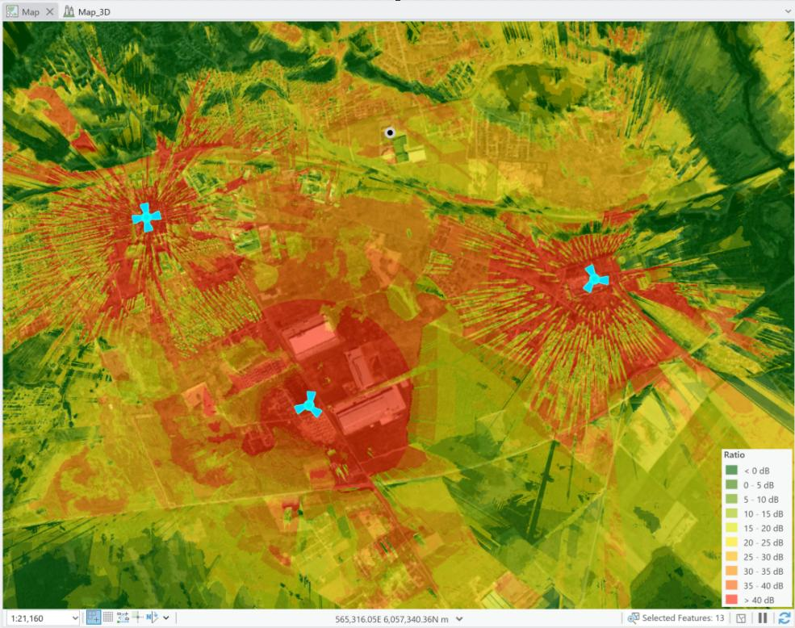

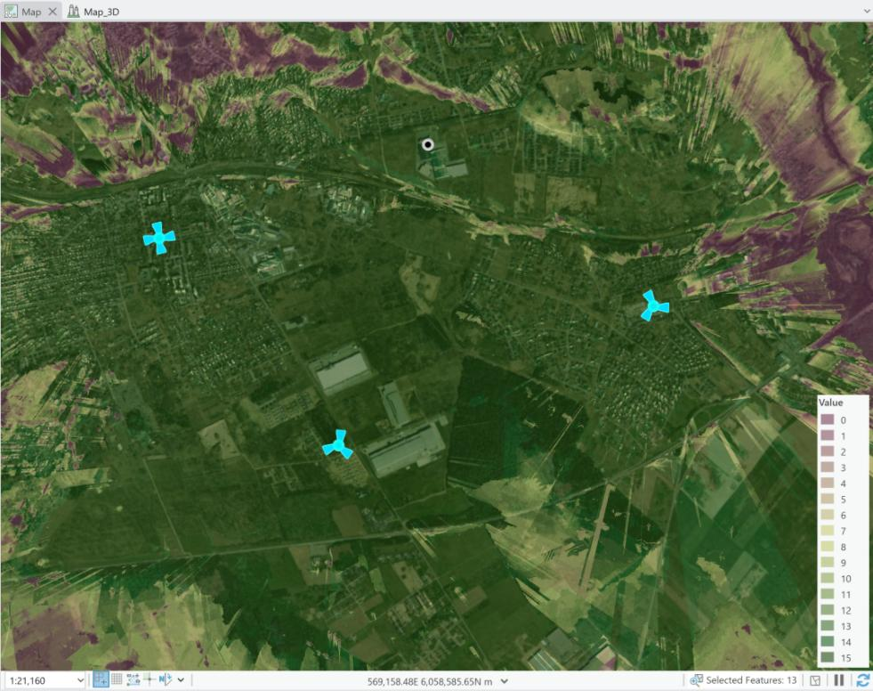
• Uplink Throughput in Mbps

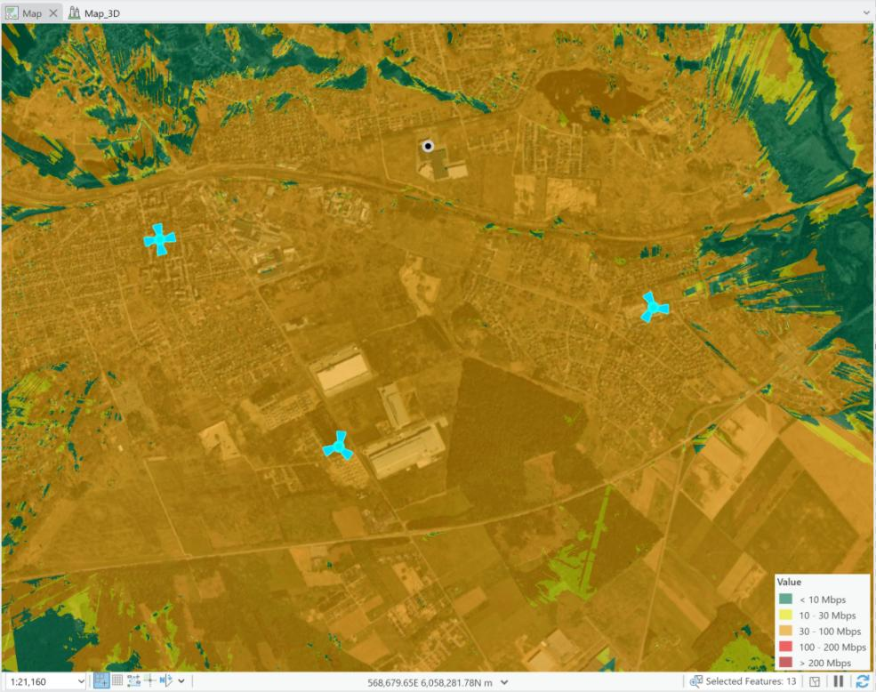

#### 9.3.5 WiFi
Resolution
Resolution for raster calculations. The output rasters will be produced with the indicated cell size.
Best server count
Option to calculate up to 5 best servers. The prediction rasters show the 1st, 2nd, 3rd, and so on strongest

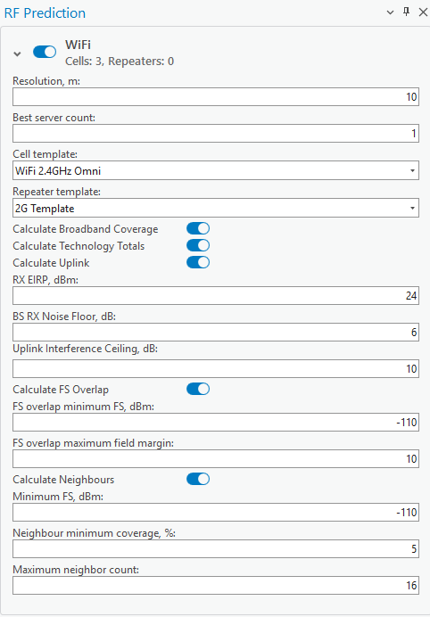
signal sources.
Cell template
Option to use the parameters from the template if the cell misses the required parameters.
Calculate Broadband Coverage
Use this option to calculate:
• RSSI;
• RSRQ;
• RS-SINR;
• DL Throughput.
Calculate Technology Totals

Merges all technologies that share the same Field Strength. The result is a separate group of rasters.
| Parameter | Description |
|---|---|
| Calculate uplink | Option to calculate the Uplink Signal Throughput - the speed at which data is transferred. Measured in Mb/s. |
| RX EIRP | The EIRP value of the receiver in dBm. |
| BS RX Noise Floor | Best Server receiver’s lowest noise level. No values below this level will be included in the calculation. |
| Uplink Interference Ceiling | Uplink’s interference highest value. No values above this point will be included in the calculation. |
Calculate FS Overlap
This calculation in Cellular Expert calculates the geographical areas where two different cells provide similar
signal strength. Specifically, it identifies regions where the absolute difference between the field strengths
of Cell 1 and Cell 2 is less than a defined threshold (e.g., 10 dB). This analysis is useful for understanding
coverage overlaps and potential handover zones between cells.
Field strength overlap can now be calculated using:
• Minimum FS threshold (dBm) – defines the lowest acceptable field strength for overlap
consideration.
• Maximum field margin (dB) – sets the tolerance range for overlap levels.
The output is a raster layer that displays the degree of overlap in dB ranges (e.g., <3 dB, 3–5 dB, 5–7 dB,
7–9 dB, >9 dB). This enables planners to quickly identify areas of strong cell overlap, potential handover
zones, or interference-prone regions.
Calculate Neighbours
Enable cell neighbour matrix calculation.
Neighbour relationships between cells are determined based on:
• Minimum FS threshold (dBm) – ensures neighbours are only counted if they meet a minimum signal
level.
• Neighbour minimum coverage (%) – sets the minimum overlap percentage required for a cell to
qualify as a neighbour.
• Maximum neighbour count – limits the number of neighbours assigned to each cell.
The results include a visual neighbour matrix showing connections between cells with coloured link
lines.
For each calculated cell:
• Frequency group (MHz)
• Covered area (km²)
• Neighbouring cells with:
o Relation type (e.g., Intra-Frequency)
o Overlap area (in km²)

o Overlap percentage (%)
Available coverage rasters
• Equivalent Reference Signal Receive Power (RSRP) raster in dBm, as measured for a reference
OFDMA sub-carrier bandwidth. It is possible to calculate separately the rasters for the 1st, 2nd, 3rd,
4th, and 5th strongest signal levels and it depends on the count defined in the Best server count
option.

• The best server raster shows the identification of cells that generate the strongest signals at each
pixel. Raster count depends on the Best server count parameter value specified by the user.
o 1st best server shows the serving cell with the strongest field strength.
o 2nd best server shows the second strongest field strength cell identification.
o 3rd best server shows the third strongest field strength cell identification.
o 4th best server shows the fourth strongest field strength cell identification.
o 5th best server shows the fifth strongest field strength cell identification.
• RSSI raster in dBm.

### 9.4 FWA RF Prediction
The FWA RF Prediction tool enables batch radio profile calculations to quickly estimate link performance
from a single transmitter to multiple CPEs or to a set of selected receiver points. For each receiver point,

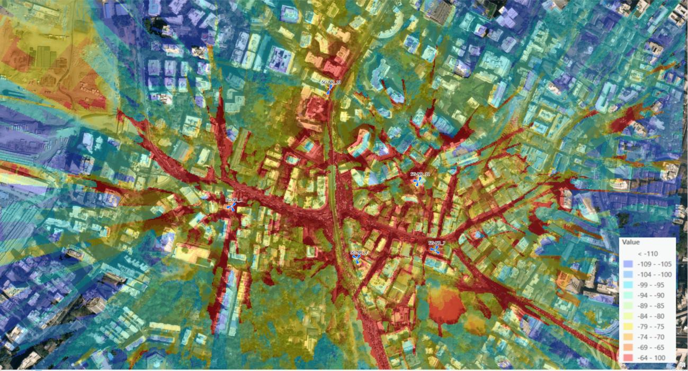

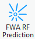
the tool computes and displays Downlink FS, Uplink FS, FWA Downlink RSL, and FWA Uplink RSL. These
outputs enable a quick assessment of link viability and quality at each location. Results for each receiver
point are listed in a structured table, allowing comparison of link performance across multiple points.
Click the button to open the FWA RF Prediction dialogue.
This tool is designed for rapid evaluation of coverage quality for potential customer sites in FWA networks,
as well as batch link feasibility checks for network planning and rollout, validation of antenna placement
and orientation impacts on service availability, and comparative performance analysis across multiple CPE
configurations.

One transmitter can be selected at a time, and the receiver point layer can either be a point feature layer
added to the map or CPE network objects. If no receiver points are selected on the map, all points are used
for calculations. A CPE template can be used to fill in missing values from the receiver point layer.
Furthermore, receiver point fields can be mapped from the receiver point attributes, or alternatively, used
from CPE template.
Once all fields are selected, press the Run button to perform the calculations. The result is the table showing

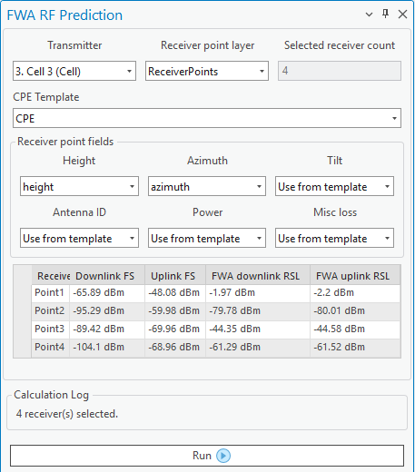

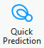
Downlink/Uplink FS, and FWA downlink/uplink RSL values for each receiver point.

### 9.5 Quick Prediction
Click the button to open the Quick Prediction dialogue.
Quick Prediction is a tool that lets you select a point on the map and make a prediction without the need to
create a cell. The selected point is represented as a brown dot on the map. Quick prediction also lets you
select a cell as the point, meaning that you can also make quick predictions with the created cells.

When the Quick Prediction button is pressed, a map tool will be activated which will let you select a point

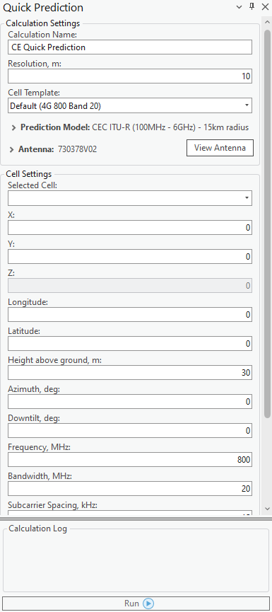
on the map. Upon selecting this point and pressing the Calculate button, a visual representation of the
calculation will be rendered on the map and the relevant data presented in the CE Calculation Task List.
D
Quick Prediction Parameters
| Parameter | Description |
|---|---|
| Calculation Name | Name of the calculation that will be displayed in the CE Calculation Task List |
| Resolution | Resolution for raster calculations. The output rasters will be produced with the indicated cell size. |
| Cell Template | Cell Template will be used in the prediction calculations. |
| Prediction Model | Prediction models that will be used in the prediction calculations. |
| Antenna | Antenna that will be used in the prediction calculations. |

| Parameter | Description |
|---|---|
| Selected Cell (Optional) | A cell from which the calculation will be done. |
| X | Coordinate in the projected coordinate system. |
| Y | Coordinate in the projected coordinate system. |
| Z | Coordinate in the projected coordinate system. |
| Latitude | Decimal degrees Y type coordinate in the WGS 1984 geographical coordinate system. |
| Longitude | Decimal degrees X type coordinate in the WGS 1984 geographical coordinate system. |
| Height above ground | Cell height above the ground in meters. |
| Azimuth | Cell direction from the North in degrees. |
| Downtilt | Cells vertical angle offset. |
| Frequency | The frequency value in MHz |
| Bandwidth | Value in MHz. Required for 4G and 5G technologies. For other technologies define the value as 0.015. |
| Subcarrier spacing | Value in kHz. Required for 4G and 5G technologies. For other technologies define value 15. |
| Tx MIMO | Transmitter antenna count. Available values: 1, 2, 4, 8, 16, 32 and 64. |
| Rx MIMO | Receiver antenna count. Available values: 1, 2, 4, 8, 16, 32 and 64. |

Results:
• Field Strength raster in dBm

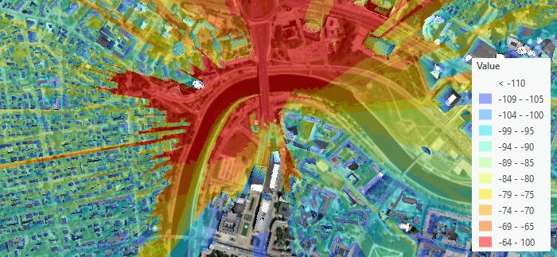

### 9.6 Radar Prediction
Click the button to open the Radar Prediction dialogue.
Radar Prediction is a tool that lets you calculate predictions on radars. Depending on the view angle and
the size of the radar, Radar Predictions will show the reach of radar signals. Radar signals may differ on
various objects: drones, planes, etc. For example, drones will be identified within a smaller distance than

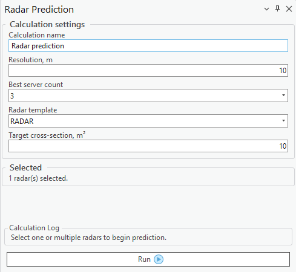
planes.
Run Calculation
Run the radar prediction calculations.
Radar Prediction Parameters
Calculation name
The calculation identification
Resolution
The cell size is in meters.

| Parameter | Description |
|---|---|
| Best Server count | Option to calculate up to 5 best servers. |
| Radar template | Template used to calculate the radar predictions. |
| Target cross-section | The radar size. |
| Selected | Current amount of selected radars. Results: Field Strength raster in dBm • |

### 9.7 Visibility Prediction
Visibility calculations refer to the determination of line-of-sight between transmitting and receiving antennas,

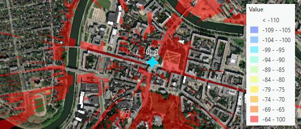

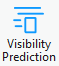
assessing whether any obstructions might impede direct signal transmission.
Visibility Prediction is a tool that calculates 4 different results:
• Minimum Receiver Height – the minimum height of a receiver that could be visible to the transmitter
• Line of Sight – confirms whether visibility exists between the receiver and transmitter with the
provided receiver height
• Clearance Height – the distance from the profile that is covered or is not covered.
• Best Server – the same calculation as for RF Prediction
Click the button to open the Visibility Prediction dialogue.

| Parameter | Description |
|---|---|
| Resolution | Cell size in meters |
| Max Radius | The maximum radius of the prediction |
| Receiver height | Receiver height above the ground. |
| Effective Earth Radius | Earth radius in kilometers, used for the calculations. |
| Layers to calculate | All present CE layers on which predictions can be performed |
| Template | A template that corresponds to the selected layers. When the layer changes the templates change as well. |
| Selected | Network objects that are present on the selected network layer. The visibility prediction will be performed on all of them. |
| Run Calculations | Starts the prediction calculation. |

Results:
• Minimum Receiver Height in meters
• Line of Sight – either visible (1) by the network objects or not (0)

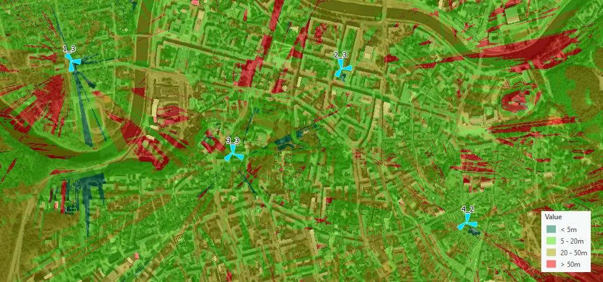

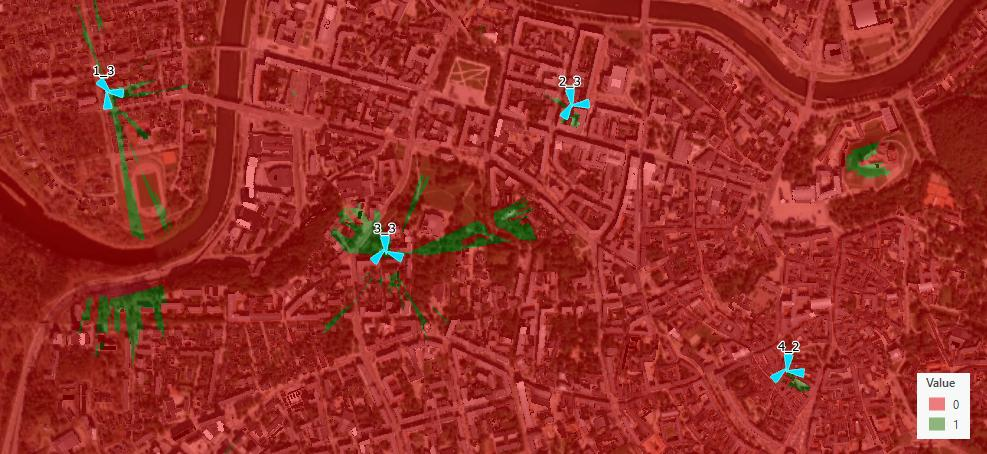
• Clearance in meters

• Best Server

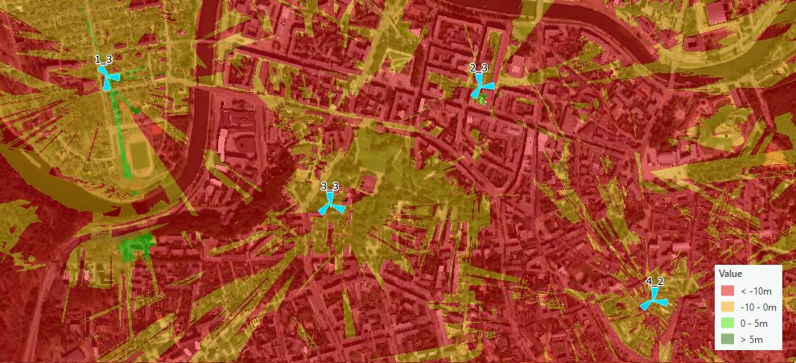

### 9.8 Compare Predictions
Compare Predictions is a tool that lets you compare the results of RF predictions with different parameters.

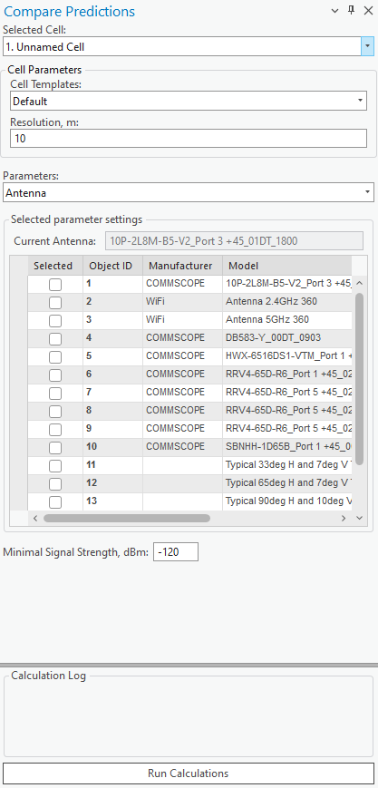
There are 4 possible parameters to choose from: Antenna, Azimuth, Tilt, and Height. When a different
parameter is selected, the selected parameter settings dialog also changes. This tool is extremely useful if
the user wants to quickly check which parameter creates the best possible prediction coverage.
Click the button to open the Compare Prediction dialogue.
| Parameter | Description |
|---|---|
| Selected Cell | The cell on which the predictions will be performed |
| Cell Templates | Cell Templates will be used in the prediction calculations. |
| Resolution | Cell size in meters |
Parameters

A list of 4 parameters: Antenna, Azimuth, Tilt, and Height. Select one of the parameters to execute the
predictions.
| Parameter | Description |
|---|---|
| Current Parameter | The parameter that is currently present in the cell. |
| Minimal Signal Strength | Signal strength is the floor of the predictions. No signal lower than this value will be included in the calculations. |
| From | The starting value of the parameter for calculations |
| To | The destination value of the parameter for calculations |
| Step | The increment by which the starting point will reach the destination |
Run Calculation
Starts the prediction calculation.
If the user selects one of the results from the results table, that result will be highlighted in the bar chart as

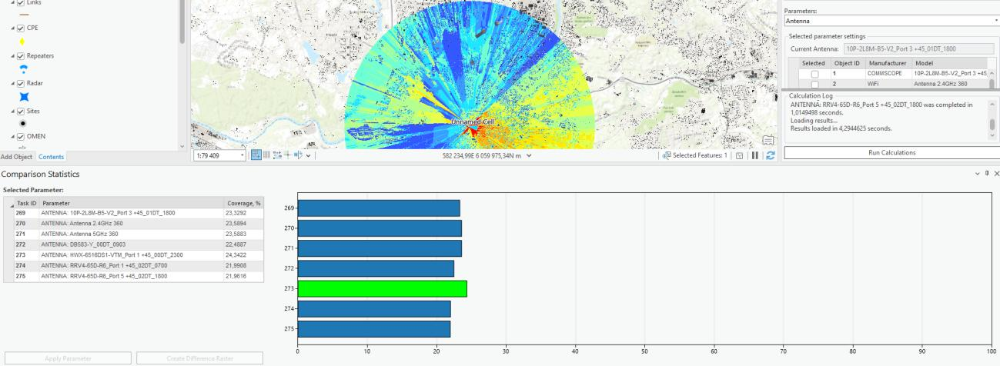
well as the corresponding prediction layer on the map.
Compare Predictions also provides the possibility to create a Difference Raster – a raster that is made
from two RF Prediction rasters that shows the value differences between them. If the user wants to apply
the parameter that produces the biggest coverage value, he can select one of the results from the result
table and press Apply Parameters.

Apply Parameters
Applies the selected parameter to the currently selected cell.
Create Difference Raster
Creates a raster that is made from two RF Prediction rasters. It shows the value differences between them.

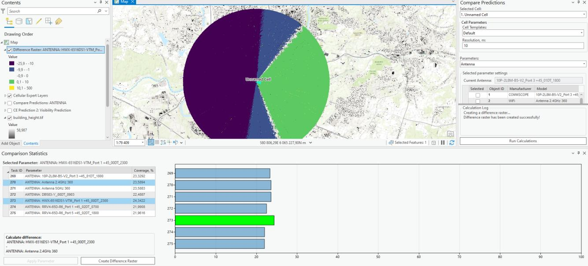

### 9.9 Optimal Site Positions
Optimal Site Positions is a tool that lets the user find optimal positions for a site based on specified

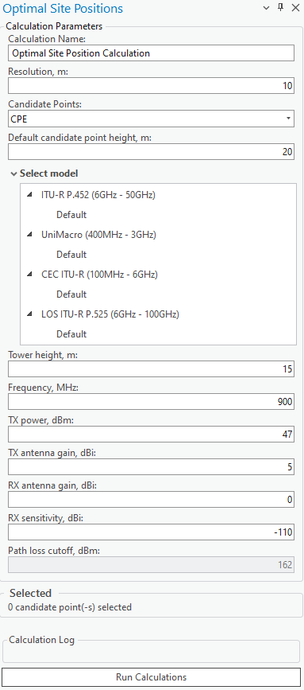
parameters. The prediction produces two rasters:
• Covered Points – defines what number of points are covered in a certain pixel
• Coverage Percentage – the percentage by which the pixel is covered. Meaning that 100% is a fully

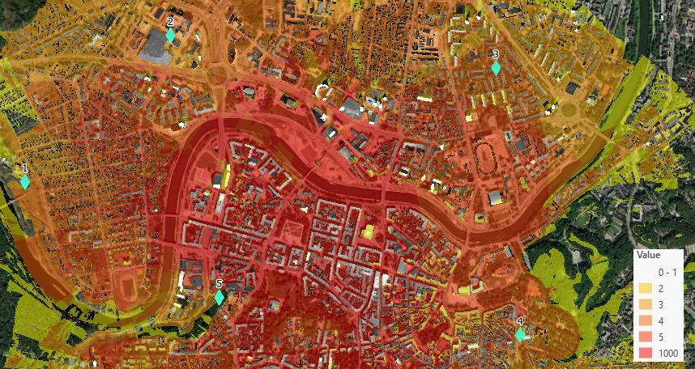

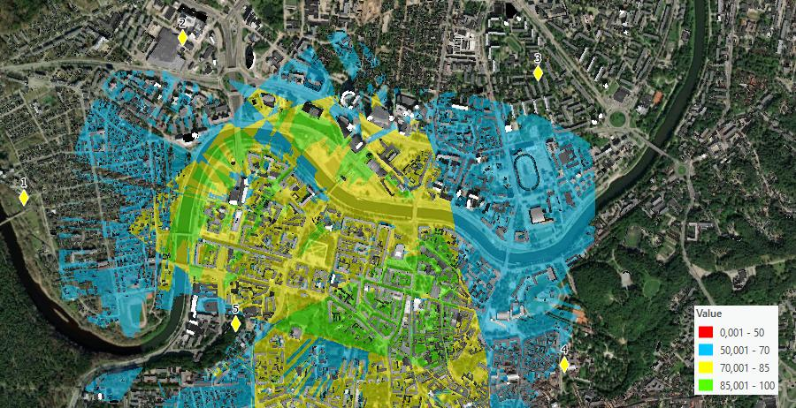
covered point
Click the button to open the Optimal Site Positions dialogue.

| Parameter | Description |
|---|---|
| Calculation Name | The name of the current calculation. |
| Resolution | Cell size in meters. |
| Candidate Points | The CE layers contain network objects. |
| Selected Model | The prediction model list. |
| Tower height | The height of the tower that hosts the site. |
| Frequency | The frequency value in MHz. |
| TX power | Transmitter power in dBm. |
| TX antenna gain | Transmitter gain in dBi. |
| RX antenna gain | Receiver antenna gain in dBi. |
| RX sensitivity | Receiver sensitivity in dBm. |
| Path loss cutoff | The path loss is the floor of the prediction. No path loss lower than this value will be included in the calculations. |
| Run Calculation | Starts the prediction calculation. |

Results:
• Covered Points
• Coverage Percentage

### 9.10 View Statistics
View Statistics is a tool that calculates the total coverage of a polygon based on its overall coverage (signal

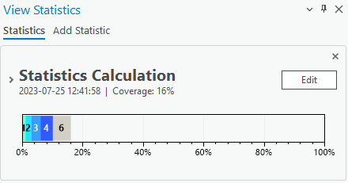
strength, dl throughput, etc.).
The resulting statistics include the total coverage and individual coverage of each polygon segment.
Click the button to open the View Statistics dialogue. To Add Statistics, press the “Add Statistics”
tab on the dockpane.

#### 9.10.1 Statistics
When the calculation is complete, you will be redirected to the Statistics window where you can view the
calculation results. The immediate expander of the calculation shows the overall coverage (in percentages)
of all the polygon regions.
By opening the expander, you can examine the specific regions, their population, and area coverages.
You can also change the colors of the color bands by clicking the squares near the region values.

Table button
View the details about the polygon areas and calculated data in a table. Also, export the table data in CSV

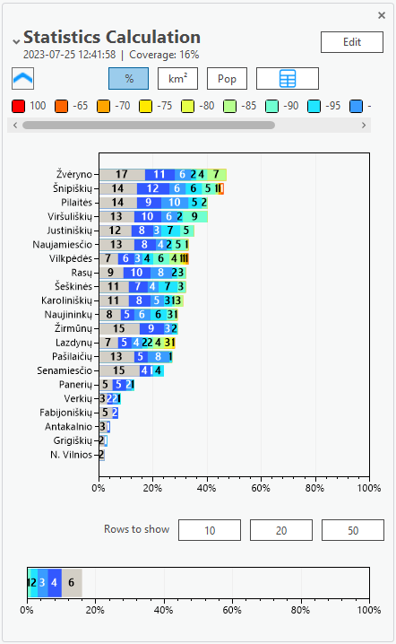

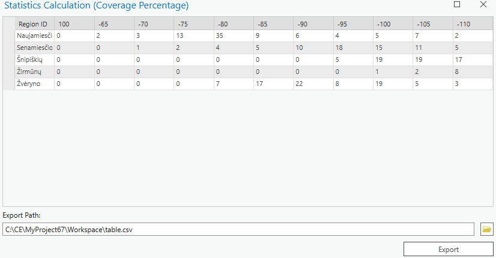
format.

The button lets you edit the selected statistic.
To exit edit mode and cancel all changes, click the Exit Edit Mode button.

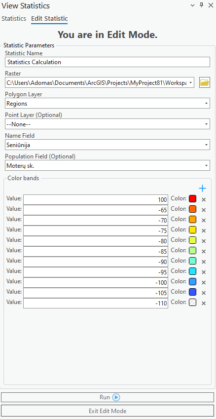

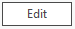

#### 9.10.2 Add Statistics
Add Statistic Parameters
| Parameter | Description |
|---|---|
| Statistic Name | The name of the Statistic. |
| Raster | The raster layer of one of the coverage results. |
| Polygon Layer | The polygon layer of which the coverage will be calculated. |
| Point Layer (Optional) | Used to specify the calculation. |
| Name Field | Defines the names of territories that will be displayed in the results. |

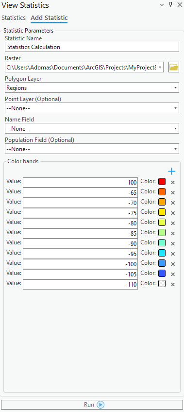
Population Field (Optional)

Establishes the population field that will be used to calculate the total coverage of the population.
| Parameter | Description |
|---|---|
| Color Bands | The color of each segment in the statistics. The color bands are automatically retrieved from the raster layer if it contains symbolization. |
| + | Add a new color band |
| X | Remove color band |
| Run | Run the statistics calculation. |

### 9.11 Network Manager
Network Manager is a tool that lets you group cells and repeaters into networks based on their frequency
groups and technologies. In doing so, you can easily select particular networks and do RF Calculations
on them without needing to select any particular network objects. The technologies are taken from the Cells
table.
Network Manager tracks the changes in the technology and frequency_group fields of Cells and Repeaters
tables. If the values of these fields should change, the network manager will accommodate such changes
by regrouping changed parameters based on the new technologies and frequency groups.
When frequency groups are modified, removed, added, or affected in any other way, the frequency group
titles will change color from green to red. While the RF calculation is processing the title color will change
to yellow. When the RF calculation is completed on that frequency group, the current network configuration
is saved, and the title color changes back to green.
Click the button to open the Network Manager dialogue. To create a network, press the “+” button
on the dockpane.
Add Network Parameters
Name
The name of the network

Technology
The technology that the network will be based on. All network objects will be filtered by it in the network.

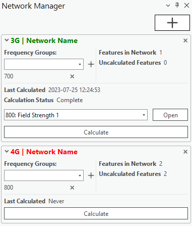
Create Network
Add network to the network list.
Network Manager Parameters
| Parameter | Description |
|---|---|
| Frequency Groups | Frequency groups that share the same technology. |
| Last Calculated | The last time the calculation was started |
| Calculation Status | Status of the current calculation |
| Selected Frequency Groups | Frequency groups on which the RF Calculations will be completed. |
| Features in Network | Number of Network objects that are present in the Selected Frequency Groups. |
| Uncalculated Features | Number of Network objects that have not yet been added to an RF calculation. |

| Parameter | Description |
|---|---|
| + | Adds frequency group to Selected Frequency Groups. |
| X (inside the network) | Removes frequency group from Selected Frequency Groups. |
| X (in the network title) | Removes network from the network list. |
| Calculate | Opens the RF calculation dialog with the selected network objects |
| Calculation Name | Antenna Visibility prediction identification. |
| Resolution, m | Resolution of the visibility prediction rasters. |
| Cell template | Cell template for visibility prediction calculations. |
Attenuation threshold, db

Maximum allowable signal loss for determining effective signal visibility.
Select the cells on the map and press the Run button to perform the antenna visibility calculations. Once
the calculations are performed, a new group layer is added with Line of Sight Clearance, Pattern Clearance,

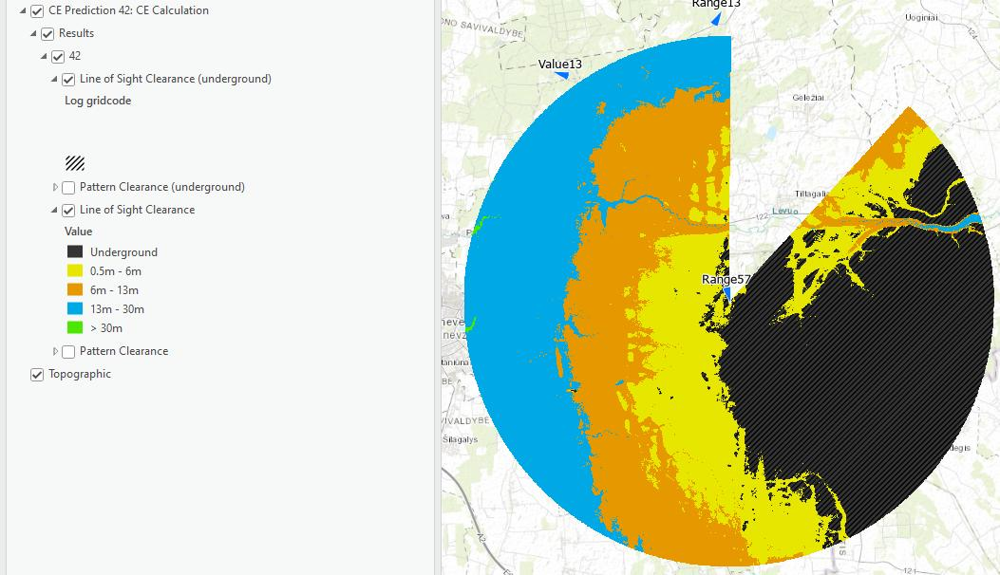

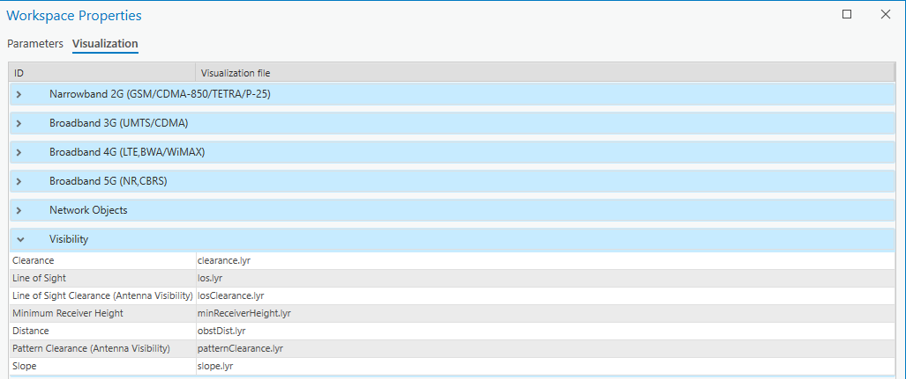
Line of Sight Clearance (underground), and Pattern Clearance (underground) layers.
Toggling either the Line of Sight Clearance or Pattern Clearance layers shows the legend according to
the values in the raster. Additional “underground” polygon groups are drawn with hatch fill to indicate the
values of 0 (blocked by elevation or an obstacle) for each layer.
The default Line of Sight Clearance and Pattern Clearance layer files (.lyr) can be changed in Workspace
Properties, under the Visualization tab and the Visibility category.

## 10. About

### 10.1 License information
Click the button to open the License Information dialogue.
License information is a useful resource to see your current version of Cellular Expert for ArcGIS Pro, user

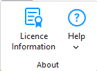

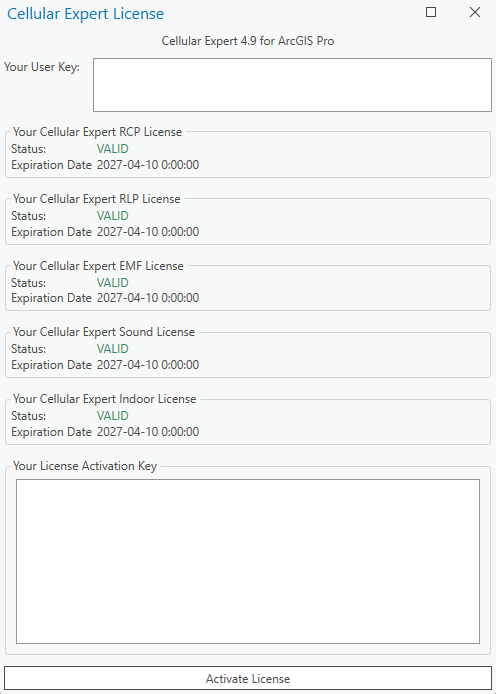
key, currently active licenses, and their expiration dates. The license information window is also used when
a user is enabling the CE for ArcGIS Pro extension on their computer. For more information about license
activation see Activation.

### 10.2 Help

#### 10.2.1 Documentation
Click the button in the Help dropdown list to open the Documentation of CE for ArcGIS Pro.
Here you will find extensive documentation of the add-on. Also, this should be the first place you check
when trying to figure out a problem.

#### 10.2.2 What’s New
Click the button in the Help dropdown list to open the What’s New document. This document
is updated for each new release of Cellular Expert for ArcGIS Pro, and here you will find the changelog for

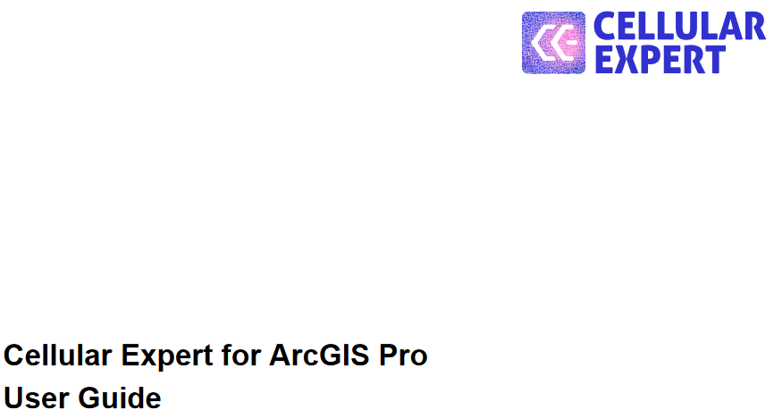

the current installed version. This document serves as the introduction of added new features,
enhancements, bug fixes, and other changes.

#### 10.2.3 Technical Support
Click the button in the Help dropdown list to open the Technical Support page in your
default Internet browser. In the Cellular Expert Support page, you can browse the Knowledge base for
instructions and solutions related to Cellular Expert for ArcGIS Pro, such as how to prepare geodata for a
project. Additionally, you can log in or sign up to submit a new support ticket.

#### 10.2.4 Error log
Click the button in the Help dropdown list to open the Error Log dialogue.
Here you will find information about errors that have occurred during certain processes of the CE for ArcGIS
Pro extension’s lifetime. These logs are crucial to improving the overall quality of the user experience. Thus,

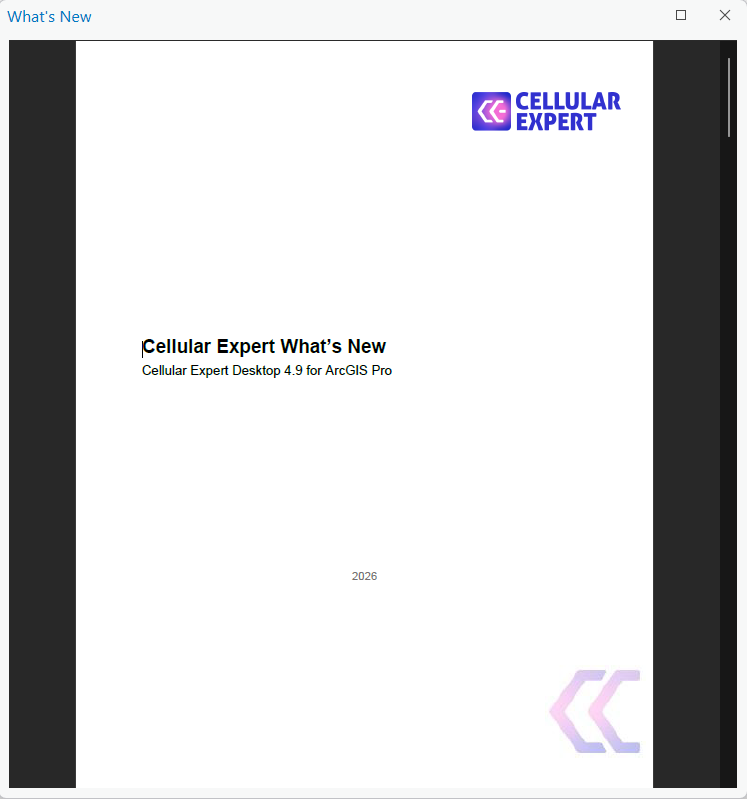

when an error happens and you decide to contact a Cellular Expert, you will be asked to send these logs
so that the problems you encounter can be patched as soon as possible.

Copy
Copy the necessary error information into your clipboard and send it to Cellular Expert.
Delete All
If the error log ever gets too crowded, you can delete all errors from it.

## 11. Technical Support
For any issues, e-mail support (support@cellular-expert.com) and we will register your ticket.
When you contact us, please describe your issue precisely and completely. Please mention which steps
you already tried, when the problem appears, etc. Attach a screenshot of the Cellular Expert log files.
Note: all provided information remains confidential and is used only for solving your issue. Other users

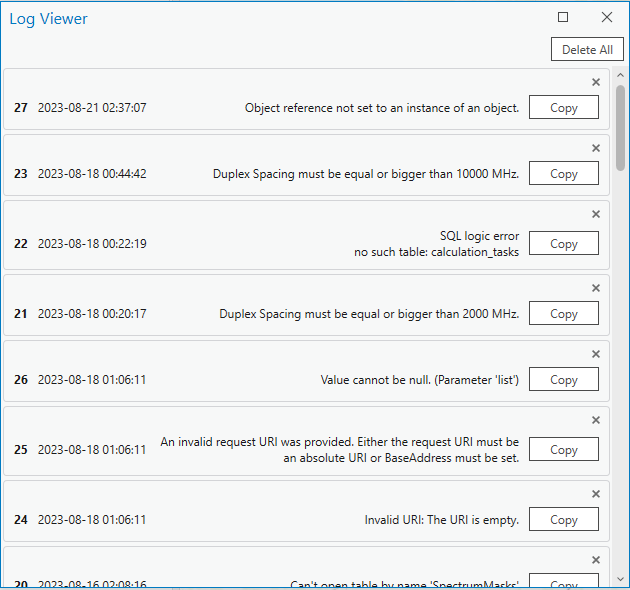
cannot see your ticket and it is not published in any other way.
Thank you for using our software.
Cellular Expert Team
www.cellular-expert.com
