# RLP Tools — Mesh Networks

## 10. Mesh Networks

### 10.1 Mesh Connectivity
Click the button to open Mesh Connectivity dialogue.
This tool enables rapid and accurate assessment of wireless peer-to-peer link quality during mesh network

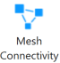

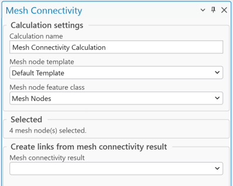
planning and optimization.
How It Works:
• Select one or more Mesh Nodes in the workspace.
• Open Mesh Connectivity tool.
• Define:
o Calculation name – the calculation name which will be visible in Contents.
o Mesh node template – mesh node template if selected features won’t have all necessary
parameters.
o Mesh node feature class – by default Mesh Nodes are using for the calculations, but
external point type feature class can be used to estimate connectivity with each other.
o Press Run button to start simulation.
• The tool calculates the RSL between each node pair and compares it against the configured RSL
sensitivity threshold defined for the Mesh Node object.
• Connectivity status is then visually rendered using a clear, color-coded scheme:
o Green: Bi-directional connectivity – both nodes meet or exceed the RSL sensitivity for
each other.
o Yellow: Uni-directional connectivity – only one node meets the RSL threshold for the

other.
o Red: No connectivity – RSL falls below the sensitivity threshold in both directions.

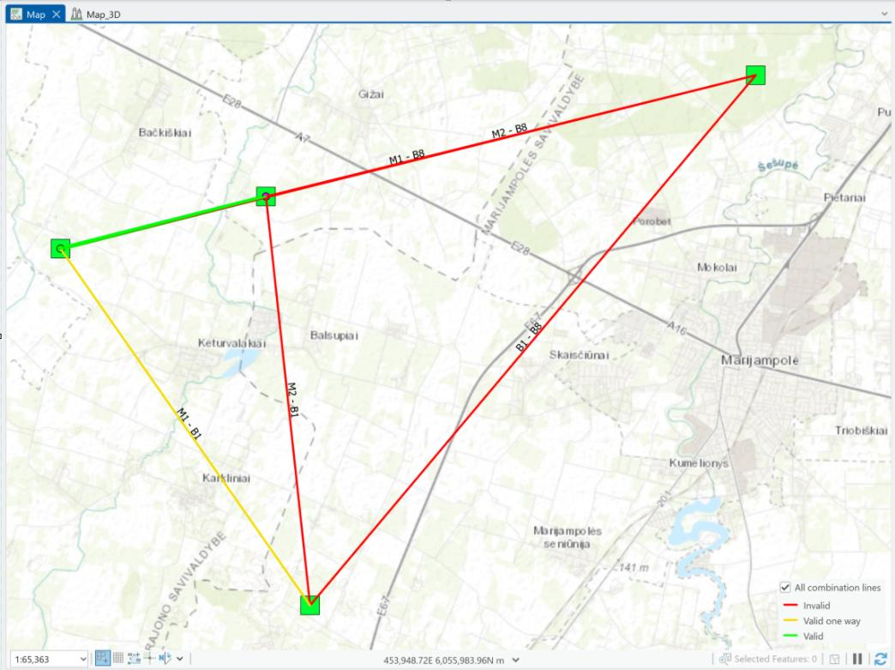
Result. All cominications
It shows all possible combinations of Mesh network connections.
Result. Connection lines
Shows Mesh connections where the tool will create Link object.

To create a Links between Mesh Nodes, define Mesh connectivity results. Once result is selected, it will

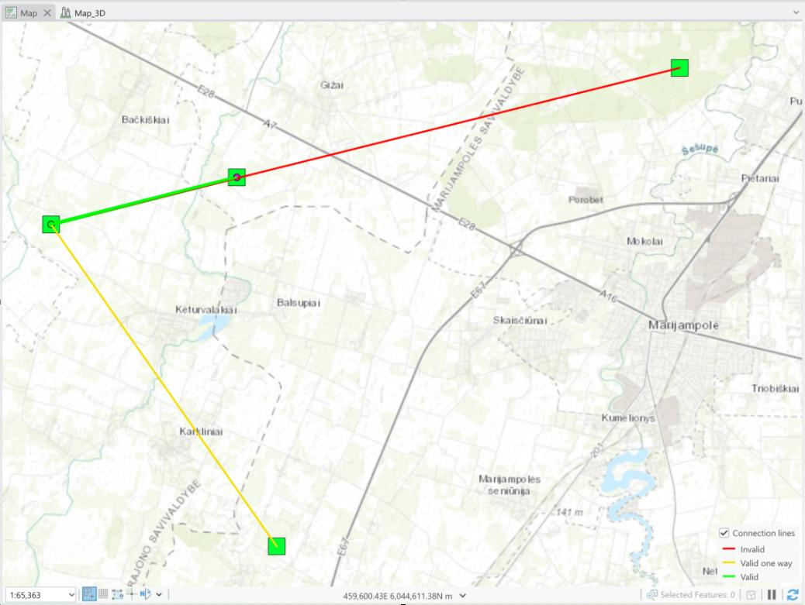

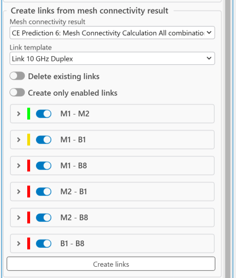
add possible options to create a links between Mesh Nodes.

Delete existing links
If selected, existing links that have been created from mesh connectivity results will be deleted.
Create only enabled links
If checked, the links will be created only from the checked connectivity lines in the suggested list.

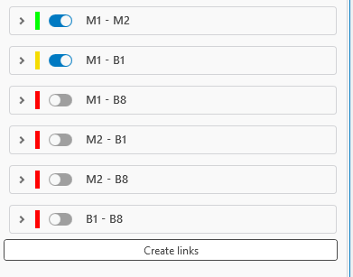

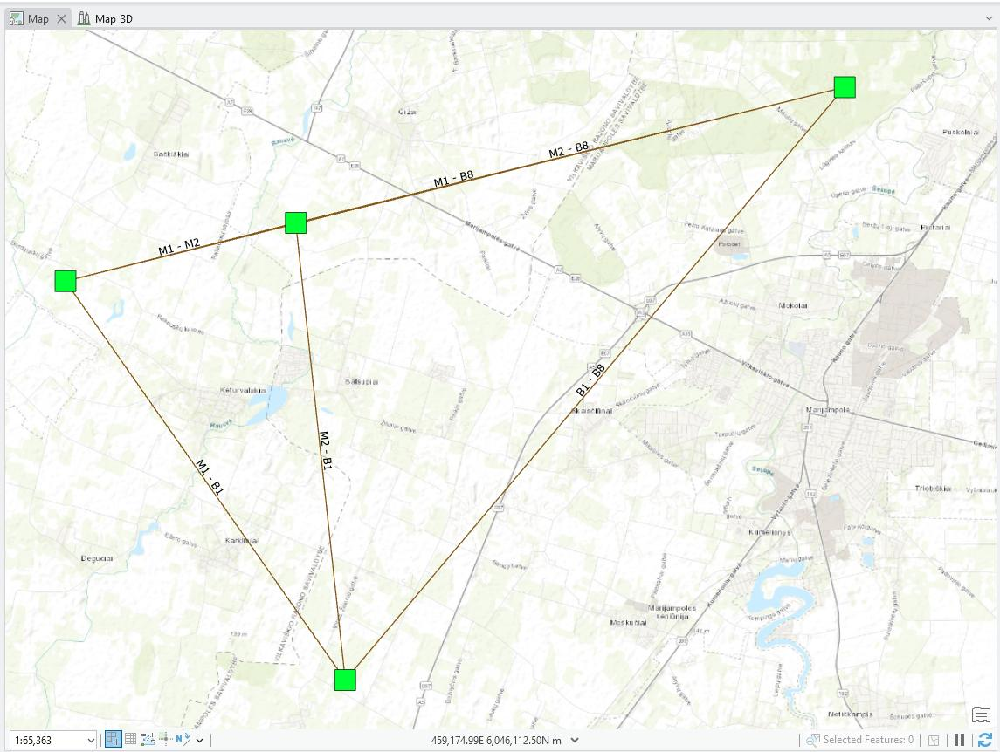
Enable/Disable Links from the suggested list.
Once parameters are set, press Create links button to create Links between Mesh objects.

### 10.2 Quick Mesh Connectivity
Click the button to open Quick Mesh Connectivity dialogue.
To enhance the efficiency of early-stage planning and dynamic mesh layout, the Quick Mesh Connectivity

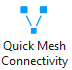

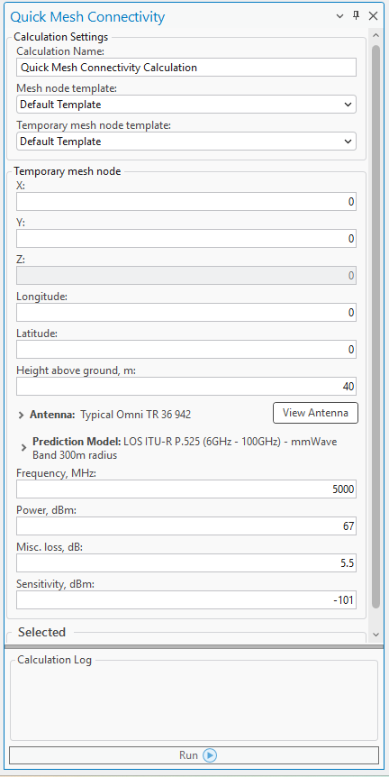
tool offers a fast and intuitive way to assess connectivity potential.
This lightweight yet powerful feature enables users to instantly evaluate whether a Mesh Node can
connect to an existing mesh network based on either its current position or a proposed location.
Whether you are planning the deployment of a single node or simulating a mobile mesh scenario, Quick
Mesh Connectivity streamlines the decision-making process by providing immediate, actionable feedback.

1. Select Existing Mesh Nodes
On the map interface, select the Mesh Nodes that should be included in the connectivity
calculation.

2. Open the Quick Mesh Connectivity Tool
Launch the tool from the menu or toolbar.

3. Define the Proposed Node Location
Choose the location of the new Mesh Node either by clicking directly on the map or by entering

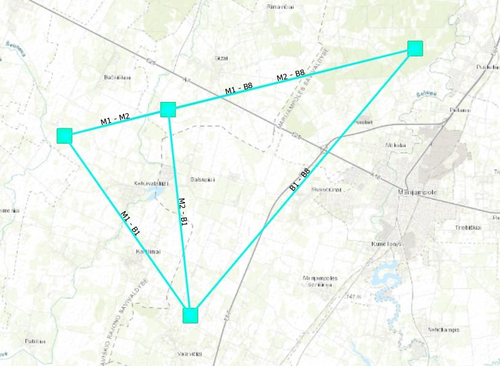

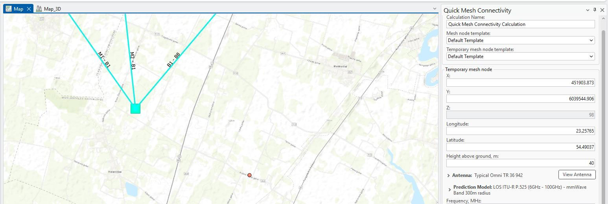
specific coordinates.

4. Configure Node Parameters
Input the required parameters for the proposed Mesh Node (e.g., transmission power, antenna
type, height).

5. Run the Calculation
Click the Run button to initiate the connectivity analysis.

6. View the Results
Once the analysis is complete, the results will appear in the Contents panel and on the map:
• Green indicates areas with successful two-way connectivity.
• Yellow shows one-way connectivity.
• Red marks areas with no connectivity.
Calculation Name
The name of calculations which will be used and loaded to Contents.
Mesh node template
The Mesh Node Object Template is automatically utilized whenever a Mesh object lacks the required
parameters needed to complete connectivity calculations. This ensures that all essential data is available

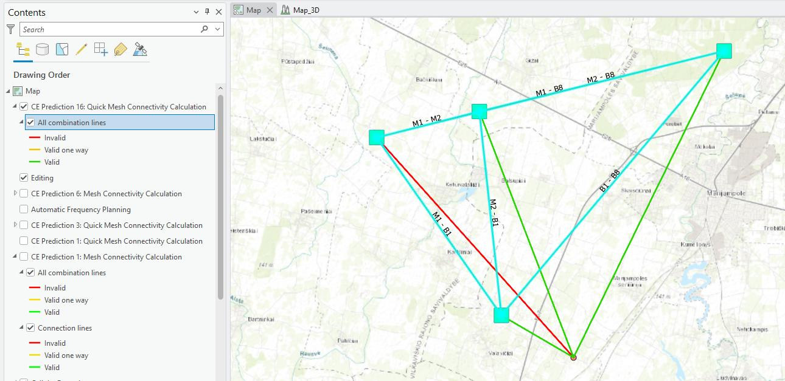
for accurate simulation and evaluation, even if the original Mesh object is incomplete.
Temporary mesh node template
The Temporary Mesh Node Object Template is automatically utilized whenever a newly proposed Mesh
object lacks the required parameters needed to complete connectivity calculations. This ensures that all
essential data is available for accurate simulation and evaluation, even if the original Mesh object is
incomplete.
| Parameter | Description |
|---|---|
| Latitude | Decimal degrees Y type coordinate in the WGS 1984 geographical coordinate system. |
| Longitude | Decimal degrees X type coordinate in the WGS 1984 geographical coordinate system. |
| X | Coordinate in the projected coordinate system. |
| Y | Coordinate in the projected coordinate system. |
Z

3D dimensions representing an object's height above sea level, used for visualizing objects in a 3D scene.
| Parameter | Description |
|---|---|
| Height Above Ground | Mesh node object’s height above the terrain. |
| Antenna | Antenna which will be used for Mesh node. |
| Prediction model | Prediction model used to calculate a path loss between Mesh Nodes. |
| Frequency | Frequency in MHz for proposed Mesh Node. |
| Power | Tx power in dBm for proposed Mesh Node. |
| Misc. Loss | Total losses in dB for proposed Mesh Node. |
| Sensitivity | Receiving Signal Level threshold in dBm at Mesh Node. |
