# RLP Tools — Radio Links

## 11. Radio Links

### 11.1 Geoclimatic Data
Click the button to open the Geoclimatic Data dialogue.
Geoclimatic Data is a tool that lets you adjust the geoclimatic settings that will be used in certain calculations

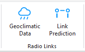

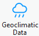
(e.g. Link Prediction).

Save Changes
Save changes to the settings.

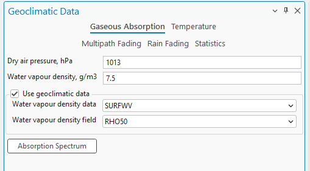

#### 11.1.1 Gaseous Absorption
Gaseous absorption pages define values for dry air pressure and water vapour density. These values can
be obtained from predefined geoclimatic data maps.
Water vapour density data according to ITU-R P.836-3. It is used in gaseous absorption evaluation.
| Parameter | Description |
|---|---|
| Dry Air Pressure | The atmospheric pressure contributed by air that contains no water vapor, typically measured in hectopascals (hPa). |
| Water Vapour Density | The mass of water vapor present in a unit volume of air, typically measured in grams per cubic meter (g/m³). |
| Water Vapour Density Data | A dropdown menu that allows the user to select the source or type of data used to determine water vapor density. |
| Water Vapour Density Data | A dropdown menu to select the specific field or parameter from the chosen data source that provides the water vapor density information. |
| Use Geoclimatic Data | Enable/Disable this Geoclimatic data |
| Absorption Spectrum | A button that lets you see the visual representation of the absorption spectrum. |

| Parameter | Description |
|---|---|
| Linear/Logarithmic | Specifies how the axes values are calculated and displayed on the plot. Logarithmic is calculated as log . 10 |
| Frequency From/To | The frequency range of the absorption spectrum. |
| Path Length | The length of the spectrum. 11.1.2 Temperature Annual mean surface temperature at 2m above the surface of the Earth according to ITU-R P.1510. The data is used to evaluate the thermal noise of a receiver. |
| Annual Temperature | Annual Temperature expressed in Kelvins. |
| Annual Temperature Data | A dropdown menu allowing the user to select the dataset from which the annual temperature data should be sourced. |
| Annual Temperature Field | A dropdown menu to select the specific data field within the chosen dataset that contains the annual temperature information. |
| Use Geoclimatic Data | Enable/Disable this Geoclimatic data. |

#### 11.1.3 Multipath Fading
The Multipath Fading page defines refractivity data and calculation parameters for ITU and Vigants-Barnett
methods.
Worst month-to-annual statistics conversion can be performed according to ITU-R P. 530 or ITU-R P. 841
methods.
Refractivity gradient data is based on ITU-R P.453-9. Refractivity gradient data is used for multipath fading

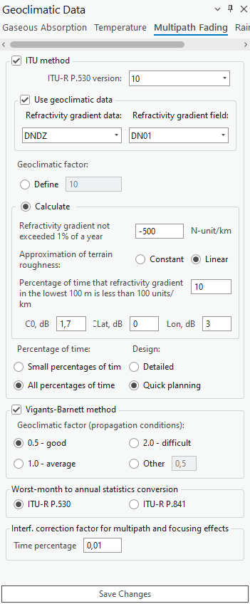
analysis.
| Parameter | Description |
|---|---|
| ITU Method | Enable/Disable the ITU Method |
| ITU-R P.530 version | A checkbox indicating the use of the International Telecommunication Union's method for calculations, with a dropdown to select the ITU-R P.530 version. |
| Use Geoclimatic Data | Enable/Disable this Geoclimatic data. |

Refractivity Gradient Data / Field
Refractivity gradient data: DNDZ
Refractivity gradient field: DN01; DN10; DN50; DN90; DN99, KF01...KF99
• DNx - refractivity gradient not exceeded for x% of the average year in the lowest 65 m of
atmosphere. DN01 is the parameter referred to as dN1 in ITU-R P.530.
• KFx - Effective Earth radius not exceeded for x% of the average year in the lowest 65 m of
atmosphere. KFx is provided only for map preview and cannot be used in the Geoclimatic Data
settings dialog.
Geoclimatic Factor (Define)
A field to input or calculate a factor used in propagation modeling, affecting the prediction of multipath
fading.
Geoclimactic Factor (Calculate)
Calculate the geoclimactic factor used in propagation modeling, affecting the prediction of multipath fading.
• Approximation of terrain roughness - Options to select how terrain roughness is modeled in the
calculations - as a constant value or as a linear approximation.
• Percentage of time that refractivity gradient in the lowest 100 m is less than 100 units/km -
An input field for the percentage of time when the refractivity gradient at low altitudes meets a
specific threshold.
• Co, dB / Lat, dB / Lon, dB - Fields to input correction values in decibels for specific geographic
coordinates, possibly related to the orientation or position of the transmitter/receiver.
| Parameter | Description |
|---|---|
| Percentage of Time / Design | Radio buttons to choose the granularity of the time percentage for which the calculations are relevant, and the level of detail required for planning. |
| Use Viggants-Barnett Method | Enabled/Disabled Viggants-Barnett Method. |
| Geoclimatic Factor (Propagation Conditions) | A checkbox to select this specific method for calculations, with radio buttons to choose a geoclimatic factor indicating propagation conditions. |
| Worst-month-to-annual statistics conversion | A section to select the ITU recommendation (either ITU-R P.530 or ITU-R P.841) for converting worst- month statistics to annual statistics. |
Interf. correction factor for multipath and focusing effects
Input for the percentage of time to apply an interference correction factor to account for multipath and
focusing effects.

#### 11.1.4 Rain Fading
The rain fading page defines rain regions (ITU and Crane) for rain rate statistics and calculation methods
(ITU and Crane). The rain rate exceedance parameter for 0.01% of the time can be set manually or
automatically according to the rain zone.

Rain rate data based on ITU-R P.837-4. This data is used to evaluate rain fading.
Rain Zone
Elections to categorize the geographic location by ITU rain zone standards, which are used to estimate rain
attenuation in different regions.
Geoclimatic data - ESA rain rate data / ESA rain rate
Options to select the dataset (such as "ESARAIN_V5") and the specific field within that dataset (like "MT")
for rain rate data, used for calculating rain attenuation.
Fading method - ITU method / ITU-R P.530 version
A checkbox to select the ITU method for rain fading calculations and a dropdown to choose the version of
the ITU-R P.530 recommendation being applied.
Rain rate exceeded for 0.01% of the time (mm/h)
Options to use either default or custom values for the rain rate that is exceeded for 0.01% of the time, which

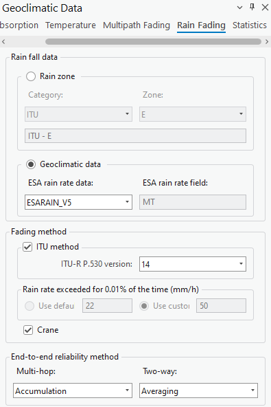
is a measure used to predict rain fading in telecommunications.
Crane
This is a model selection option related to the Crane model for calculating rain attenuation.
End-to-end reliability method - Multi-hop / Two-way
Selection options for the method of calculating the reliability of a signal in a communication path that may
involve multiple hops or two-way transmission.

#### 11.1.5 Statistics
These settings are used to handle statistical conversions for telecommunication planning, ensuring that
systems are designed to cope with the worst-case scenarios based on historical data and predictive models.
| Parameter | Description |
|---|---|
| Conversion factor - Define / Calculate | Options to either define a fixed conversion factor or to calculate it based on additional inputs. |
| Q1 (1...12) | An input field likely used to define a conversion factor or another parameter for a specific month or set of months. |
| Beta | An input field for the beta parameter, which may be part of the statistical model or conversion formula within the ITU-R P.841 recommendation. |

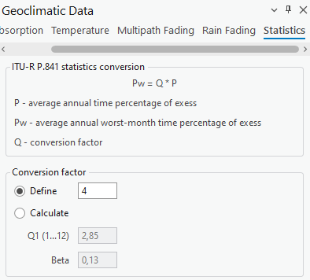
the ITU-R P.841 recommendation.

### 11.2 Link Prediction
Click the button to open the Link Prediction dialogue.
Link Predictions is a tool specific to CE for ArcGIS Pro RLP license. The tool enables you to calculate Link

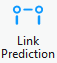

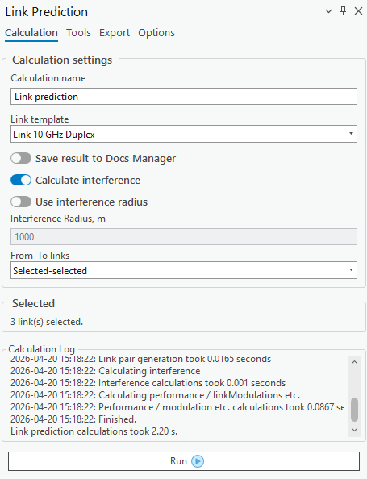
predictions.

#### 11.2.1 Calculation
The Calculation tab is found on the Link Prediction dockpane. Here you can see the selected number of
carriers as well as some other parameters.
Calculation Name
Link Prediction identification.
Link Template
The template will fill all empty or not specified fields with default values that are not necessary for
predictions.

Calculate Interference
If checked will calculate the interference of multiple links. If enabled, also allows to specify a certain radius

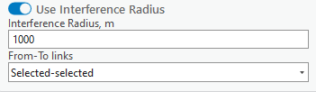

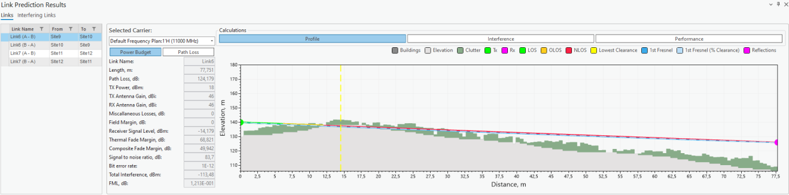
from either link endpoint. Points outside this range will not be included in the calculation, speeding up the
calculation process. If the radius is not specified, all links will be used in the calculations.
The “From-To links” dropdown settings allows the selection of links used for interference calculations. The
available options are “Selected-selected” (default option), “Selected-all”, and “All-all”. When the “All-all”
option is selected, it is not necessary to manually select all links on the map to perform the prediction
calculations.
11.2.1.1 Links
After calculations, a new dockpane will open. In the Links tab. You will be able to view Power Budget,
Path Loss, Interference, and Performance calculation results.
The Link Profile behaves in virtually the same way as a regular profile (you cannot adjust Link Profile data).
Read more in Profile.
This section of the results contains Power Budget and Path Loss results. Select different carriers to view
the results for each one of them.
Power Budget - the calculation of the balance between transmitted power, power losses in the system,
and receiver sensitivity in a communication system.
Path Loss - the reduction in signal strength as it travels from the transmitter to the receiver.

This section of the results contains the Profile Plot, Interference, and Performance results. Select
different carriers to view the results for each one of them.
Interference - the undesired impact of one signal on another, leading to potential signal degradation.
Performance - assessments of key metrics like data rate, error rates, and signal-to-noise ratio, crucial for

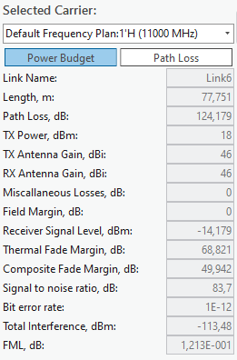

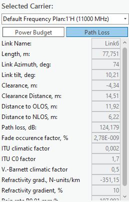

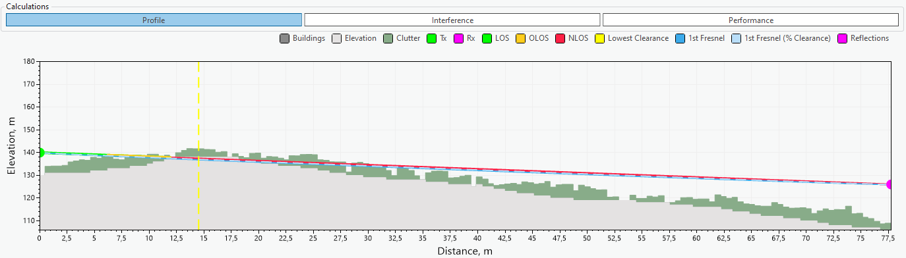

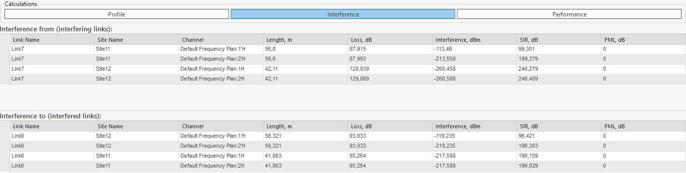
evaluating and optimizing a communication system's efficiency.

Select different links to see these results for them.
11.2.1.2 Interfering Links
Navigate to the Interfering Links tab on the Link Prediction result dockpane.
In this tab, you will be able to view interference Power Budget, Path Loss, Profile, and Spectrum Mask

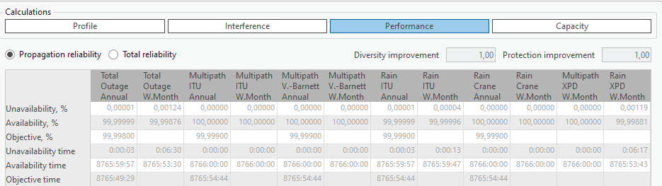

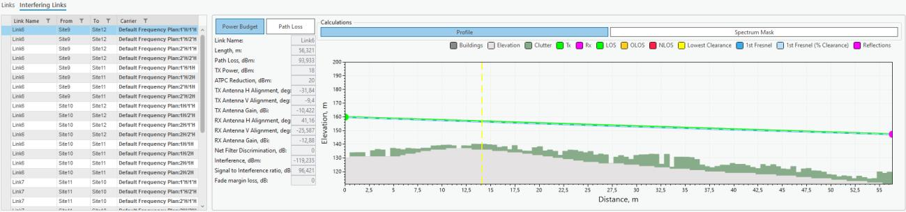
results in an unordered fashion.
In this section, you can view Power Budget and Path Loss results. Change the selected site pair to see
different results for each one of them
Power Budget - the calculation of the balance between transmitted power, power losses in the system,
and receiver sensitivity in a communication system.
Path Loss - the reduction in signal strength as it travels from the transmitter to the receiver.

In this section, you can view Profile Plot and Spectrum Mask results. Change the selected site pair to see

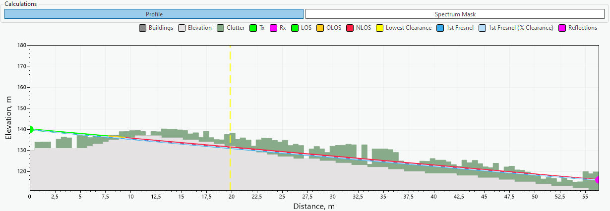

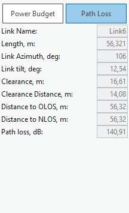

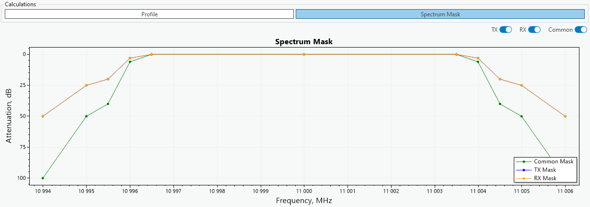
different results for each one of them
Spectrum Mask - the method used to assess the usage efficiency of a frequency spectrum in a
telecommunications system, involving the measurement of how much and how effectively different
frequencies are being utilized.
Tx, Rx, Common
Remove/Add certain parameters from the plot

#### 11.2.2 Reflections
Reflections are calculated in the same way as a regular Profile. Read more in Tools.

#### 11.2.3 Export (Link Prediction Report)
The calculation results can be automatically transferred into a Link Prediction Report. This report will
show profile, prediction parameter and results, performance and propagation reliability. The report can be

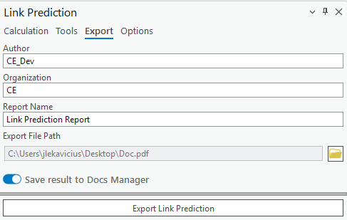

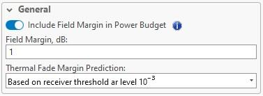
exported in PDF format. The Link Prediction Report can also be saved to Docs Manager by selecting Save
result to Docs Manager.

#### 11.2.4 Options
The Options tab is found on the Link Prediction dockpane. Here you will see additional parameters that
can be changed in accordance with your prediction needs.
| Parameter | Description |
|---|---|
| Include Field Margin in Power Budget | If checked, it will take into account the specified field margin for Power Budget calculations. |
| Field Margin | Extra signal strength beyond the minimum required, providing a buffer for reliable communication against unforeseen signal losses or variations. |
| Thermal Fade Margin Prediction | The threshold below which thermal fade will not be calculated. |

Calculate attenuation due to clouds and fog
Enabled/Disable this option.
Annual Statistics
The annual chance of reduced water in %.
Monthly Statistics
Monthly chance of reduced water in %.
For Month
Specify which month has the monthly statistic.
Calculate Tropospheric Scatter
Enable/Disable this option.
Time Percentage
Time Percentage in %.
No Interference Link Below Power
The power threshold below which no interference for links will be calculated.
Exclude Interference Links from Analysis Below Power
The power threshold below which no links with lesser interference will be included in the analysis
Tx/Rx Filter Discrimination
The ability of filters in a duplex system to effectively separate and prevent interference between Tx and Rx

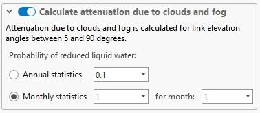

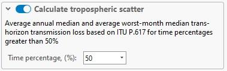

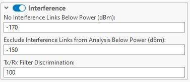
frequencies. No dBm greater than this will be accounted for in the calculation.

| Parameter | Description |
|---|---|
| Parameter | The specific telecommunication performance metric being evaluated. |
| Fading | The type of signal disruption being accounted for in the metric. |
| Method | The standard used to calculate the performance metric. |
| Statistics Annual | A selection indicating if the metric is calculated based on yearly data. |
| Statistics Worst-month | A selection indicating if the metric is calculated based on the data from the month with the poorest performance. |
performance.

### 11.3 Automatic Frequency Planning
Click the button to open the Automatic Frequency Planning tool.
The tool suggests the best channel for each selected link based on the chosen frequency plan and channel
list. It accounts for inter-link interference, evaluates the signal-to-interference ratio (SIR) across available
carriers, and aims to maximize link performance while minimizing co-channel interference. The tool
accounts for duplex link pairing, node-layer priority, and site location constraints (e.g., neighboring links and

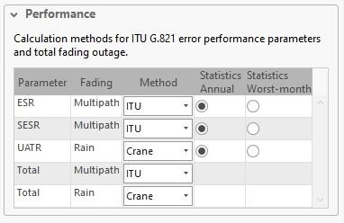

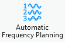
links sharing the same site). If automatic frequency planning is done with links created from Mesh Nodes,
the tool avoids polarization conflicts by switching between horizontal and vertical polarizations for
neighboring links sharing the same channel.
The planning results include the link names, carrier IDs, assigned frequencies, best available modulation,
polarization, SIR score (in dB), and identifying color. The results are visualized on the map, as well as on
the Automatic Frequency Planning Results table. The recommended carriers can be assigned for the links
and later used in Link Prediction calculations.

Recalculate already planned frequencies
Where applicable, the tool respects existing channel assignments. If frequency recalculation is explicitly

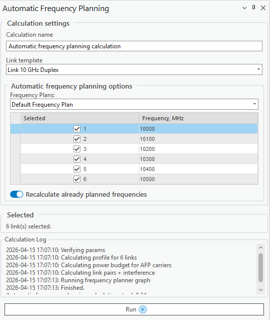

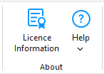

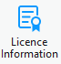
enabled, i.e., the Recalculate already planned frequencies option is checked, the frequencies are
reassigned for all links regardless of whether they have channel assignments.
Run
Run the automatic frequency planning tool.
