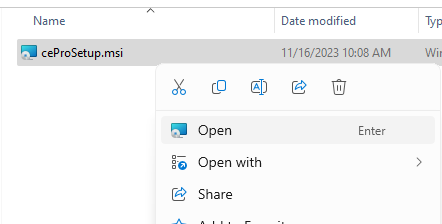
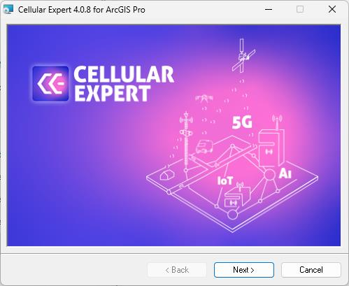
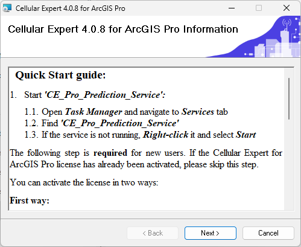
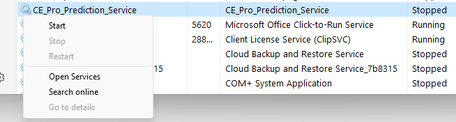
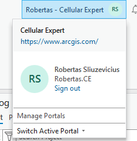
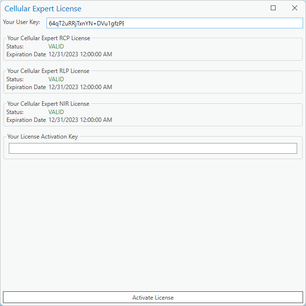
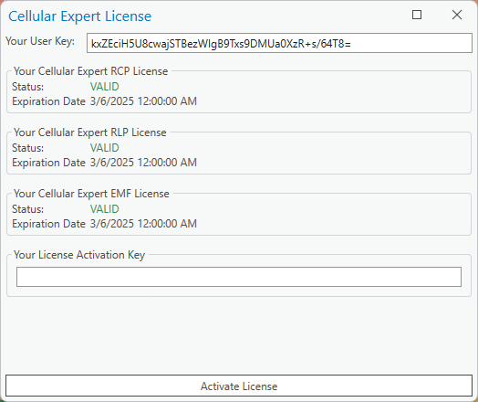
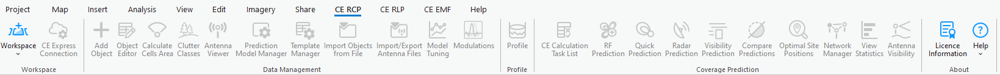

# 00. Software Installation

> **Version:** CE Pro v4.9

> **Version:** CE Pro v4.9

## Prerequisites

Before installing Cellular Expert, ensure the following are in place:

| Requirement | Details |
|---|---|
| ArcGIS Pro | Version 3.0 or later |
| Operating System | Windows 10 / Windows 11 (64-bit) |
| RAM | Minimum 16 GB (32 GB recommended) |
| Disk Space | Minimum 10 GB free |
| Administrator Rights | Required for installation |

## Installation Order

Always install in this sequence — installing CE before ArcGIS Pro will fail:

1. **ArcGIS Pro** — install and activate with your Esri licence
2. **Cellular Expert** — run the CE installer (`.msi`) as Administrator

## Installing Cellular Expert

1. Right-click the CE installer and select **Run as administrator**
2. Accept the licence agreement
3. Choose the installation directory (default: `C:\Program Files\CellularExpert`)
4. Click **Install** and wait for completion
5. Click **Finish**

## Activating the Licence

When you first open ArcGIS Pro, you will be prompted to sign in:

You can also sign in from within an open project using the sign-in menu in the top bar:

1. Open **ArcGIS Pro** and create or open a project with a Map view
2. Go to **Settings → Licensing → Configure your licensing options**

3. Locate **Cellular Expert** in the extension list
4. Toggle it **On**
5. Copy your **User Key** from the CE licence portal and paste it when prompted
6. Click **Activate**

The CE tab will appear in the ArcGIS Pro ribbon once activation succeeds.

## Upgrading Cellular Expert

When upgrading to a new CE version:

1. **Delete** the existing Cellular Expert installation via Windows **Add or Remove Programs**
2. Run the new CE installer as Administrator
3. Re-activate the licence if prompted (your key remains valid)

> **Note:** Do not uninstall ArcGIS Pro during a CE upgrade.

## Upgrading ArcGIS Pro

When upgrading ArcGIS Pro to a newer version:

1. Run the ArcGIS Pro upgrade installer — CE does **not** need to be removed first
2. After the ArcGIS upgrade, open ArcGIS Pro and verify the CE tab is still visible
3. If CE tab is missing, repair the CE installation via **Add or Remove Programs → Cellular Expert → Change**

## Uninstalling

To fully remove the software:

1. Open **Add or Remove Programs**
2. Uninstall **Cellular Expert** first
3. Then uninstall **ArcGIS Pro** if required

## Troubleshooting

| Problem | Solution |
|---|---|
| CE tab not visible after install | Add a Map or Scene to the project; CE tabs only appear with an active map |
| Licence activation fails | Check internet connectivity; contact info@cellular-expert.com for a new key |
| Installer blocked by Windows | Right-click → Run as administrator |
| Workspace not found after upgrade | Use **Workspace → Upgrade** to update the database schema |

**Contact:** info@cellular-expert.com | +370 5 2150575 | www.cellular-expert.com
