# 01. Data Types

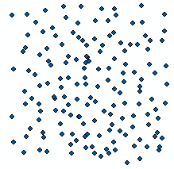

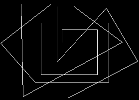

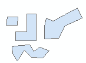

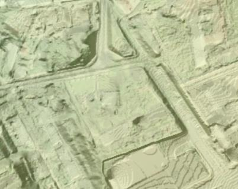

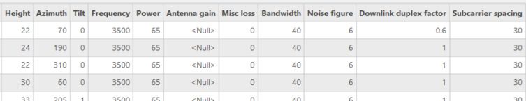

> **Version:** CE Pro v4.9

All CE Pro data — sites, cells, prediction rasters, and geodata layers — is displayed in the ArcGIS Pro map view:

Geodata layers and network feature classes are managed in the **Contents** and **Catalog** panes:

---

Data Types
Data can be:
1. Vector
- Points
- Lines
- Polygons
2. Raster
- GeoTIFF
3. Tabular

---

Modelling Outdoor coverage
The CE tools make use of three distinct GIS data layers to obtain high

precision modelling of radio wave propagation losses:
1. Digital Terrain Model (DTM), also known as Digital Elevation
Model (DEM), which describes Earth surface, i.e., path terrain
profile in terms of ground elevation above uniform sea level.
2. Obstacles layer, delineating buildings and other such objects
above Earth surface that may be considered to be principal
impediments for radio wave propagation.
3. [Clutter](#kw:clutter-classification-values:ce-express-geodata) layer, delineating natural occurring or human cultivated
ground cover that may be partially penetrable by radio waves,
such as natural vegetation (e.g., forests, trees, bushes) or various
crops, gardens, parks, etc.
Diffraction Free Space Loss
Diffraction
H
obstacles
H
[Clutter](#kw:clutter-classification-values:ce-express-geodata) losses [clutter](#kw:clutter-classification-values:ce-express-geodata) DSM
UE
DTM

---

Raster Type Input: Elevation

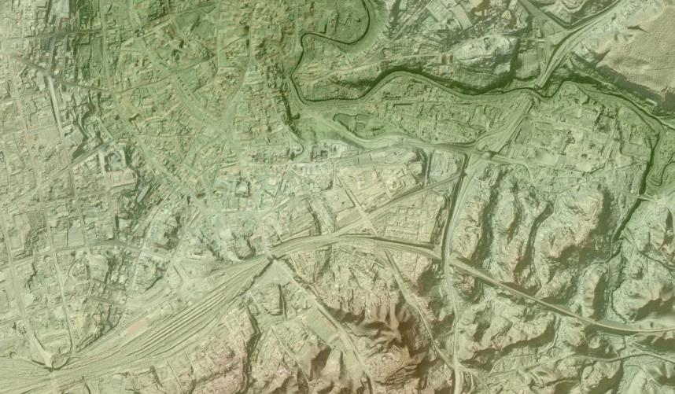

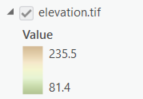
- Digital terrain model (DTM)
- Represents Earth’s ground/water level above sea level
- GeoTIFF raster format
- Height values in meters
- Coordinate system – projected
- Resolution (cell size) – centimeter level
- Raster name: elevation.tif

---

Raster Type Input: Clutter height

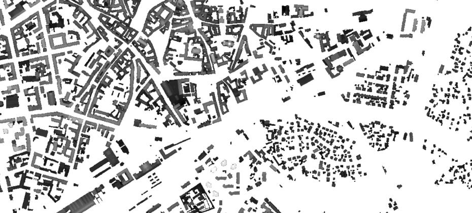

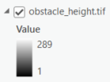
- Clutter height
- Represents objects height above elevation raster.
- GeoTIFF raster format
- Height values in meters
- Coordinate system – projected
- Resolution (cell size) – centimeter level
- Raster name: clutterHeight.tif

---

DTM vs. Surface
Tx
Visible
Rx
Visible
Rx
Surface grid
Tx
Obstacles grid
Visible Not visible
Rx Rx
Elevation grid

---

[Clutter classes](#kw:clutter-classification-values:ce-express-geodata)

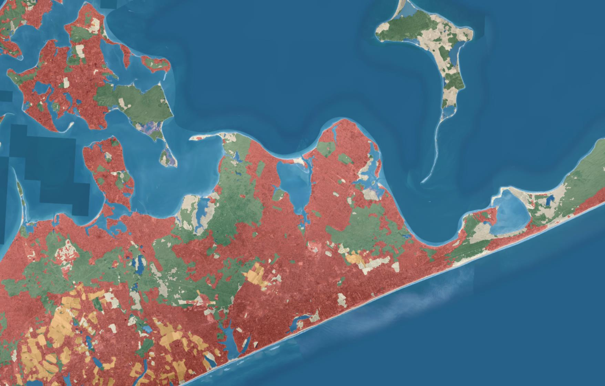

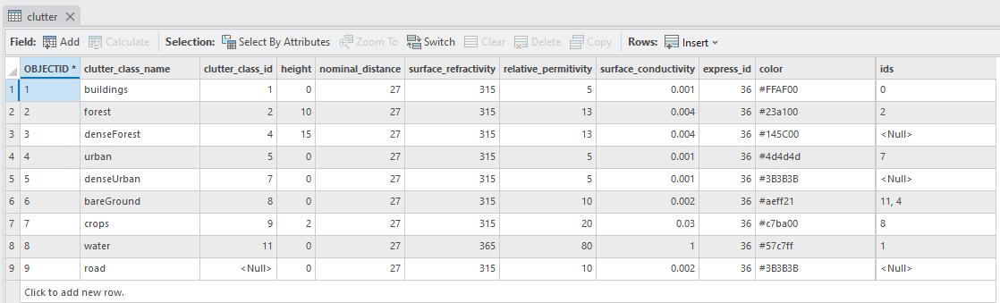
- [Clutter classes](#kw:clutter-classification-values:ce-express-geodata)
- Represents land use classes.
- GeoTIFF raster format
- Coordinate system – projected
- Resolution (cell size) – centimeter level
- Raster name: clutterClasses.tif

---

Clutter types
Corine Land Cover

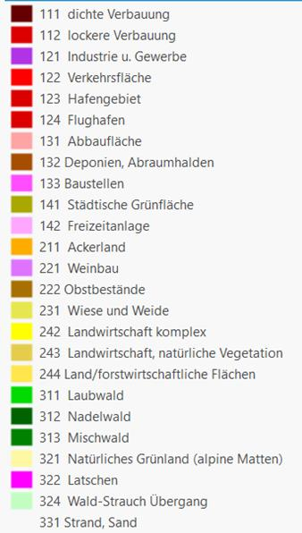

---

Raster from vector data
Following should be defined: input layer,
output raster cell size, data field that will be
converted to grid, output raster file name.
Note: if some features in input layer are selected,

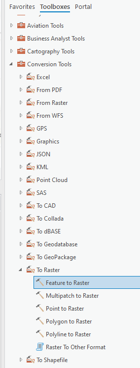

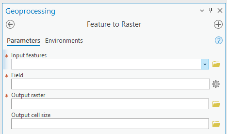
only selected ones will be converted.

---

Environment Settings

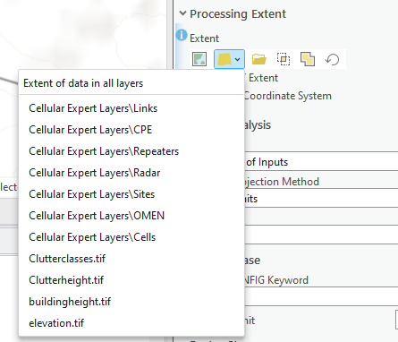

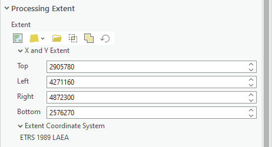

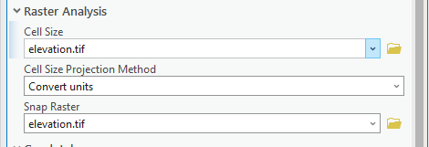

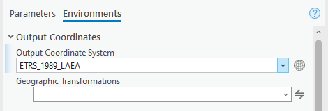

---

Raster Calculator

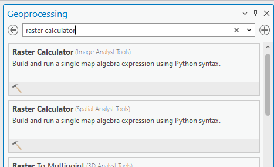

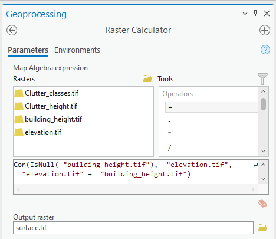

---

Model Builder
Automate your GIS tasks

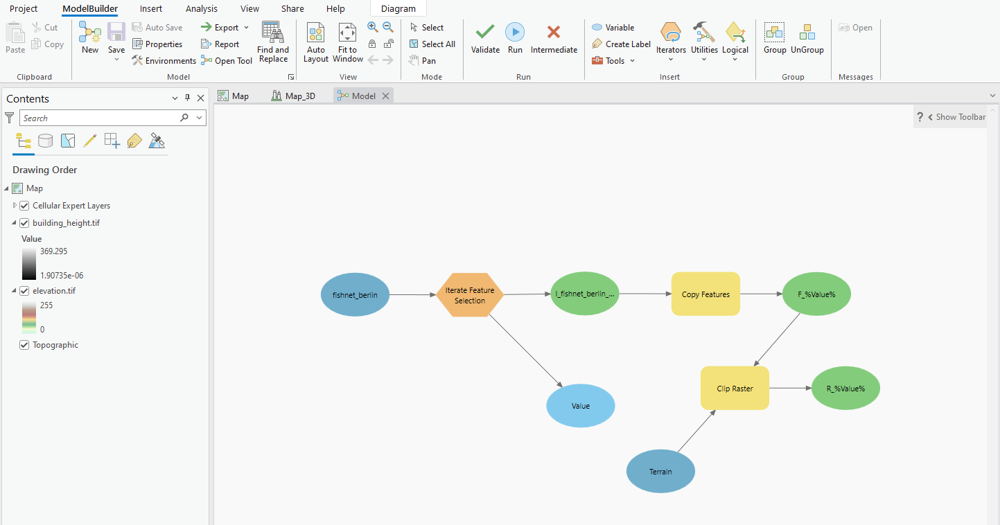

---

Questions?
www.cellular-expert.com

---
