# 02. Architecture

> **Version:** CE Pro v4.9

CE Products and Solutions
CE Desktop CE Express
For ArcGIS Pro For ArcGIS Enterprise
- Desktop, Single Use Radio Planning system • Web-based Radio Planning system
- Wireless planning tools, together with • Server-based, Multi User system
ArcGIS Pro functionality • Includes CE Inventory3D

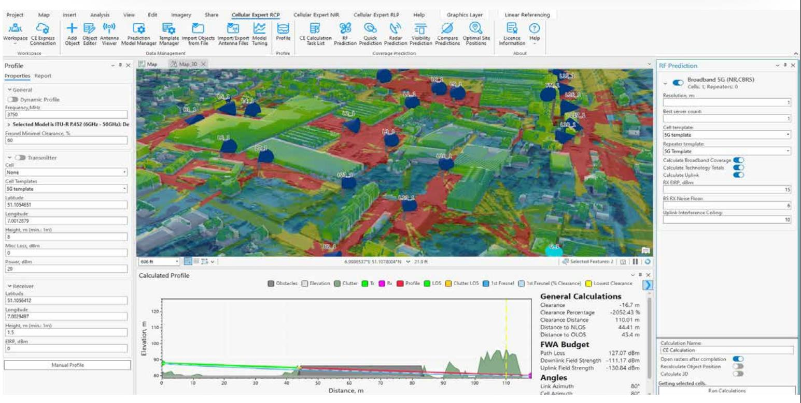

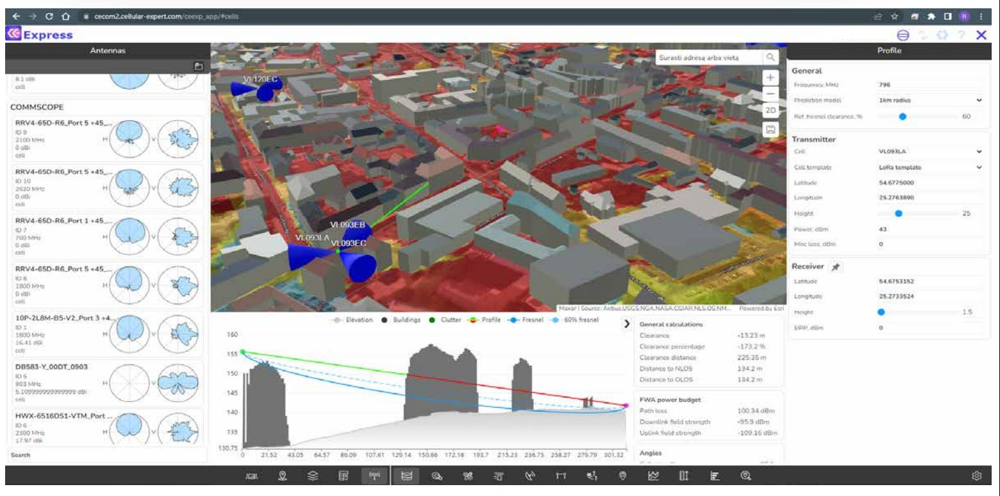

- Can be used as a client of CE Express system • Dashboard of Network Coverage Statistics

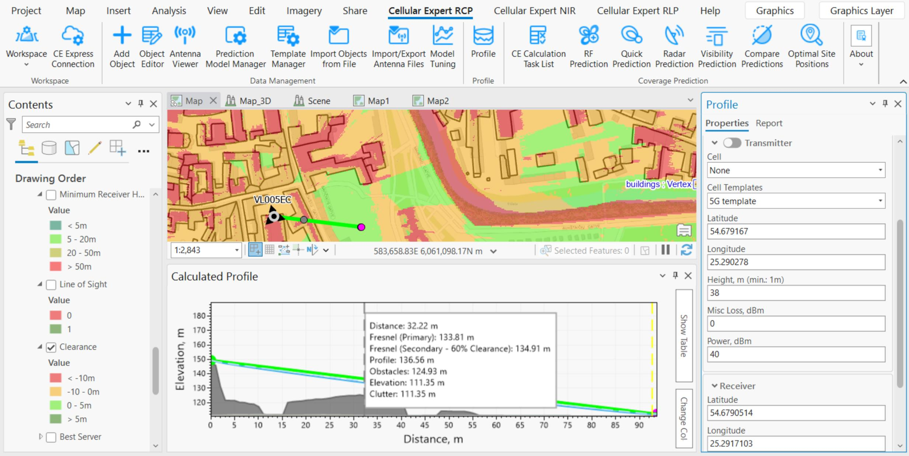
CE Customized solutions
ArcGIS CE COTS

---

CE Pro

---

CE Pro runs inside ArcGIS Pro. The image below shows a typical project with map view, Contents pane, and Catalog pane — the core layout you will use throughout all CE Pro work:

CE Pro tools appear as contextual tabs in the ArcGIS Pro ribbon:

---

Cellular Expert for ArcGIS Pro Architecture
Cellular Expert for ArcGIS Pro
RCP | RLP | EMF
Basic or higher license
ArcGIS Pro 3.1 and
above
Additional extensions are not
required
Local Database All files are saved in local disk

---

Cellular Expert for ArcGIS Pro

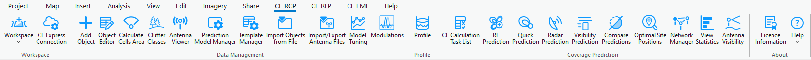

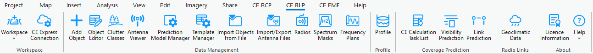

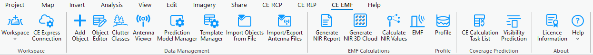
License Structure
- RCP – Radio Coverage Prediction
- RLP – Radio Link Prediction
- EMF – Electromagnetic Field

---

Geospatial Information

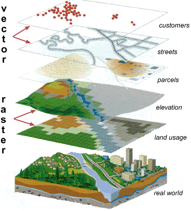

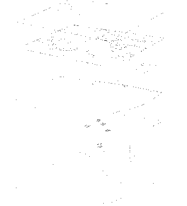
✓ Field measurements
✓ Network coverage
✓ Network data
✓ Demography
✓ Land cover / use
✓ Obstacles
✓ Elevation
✓ Surface

---

Project files
Project > Save Project/Save Project As

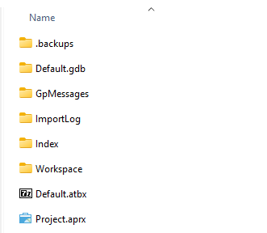

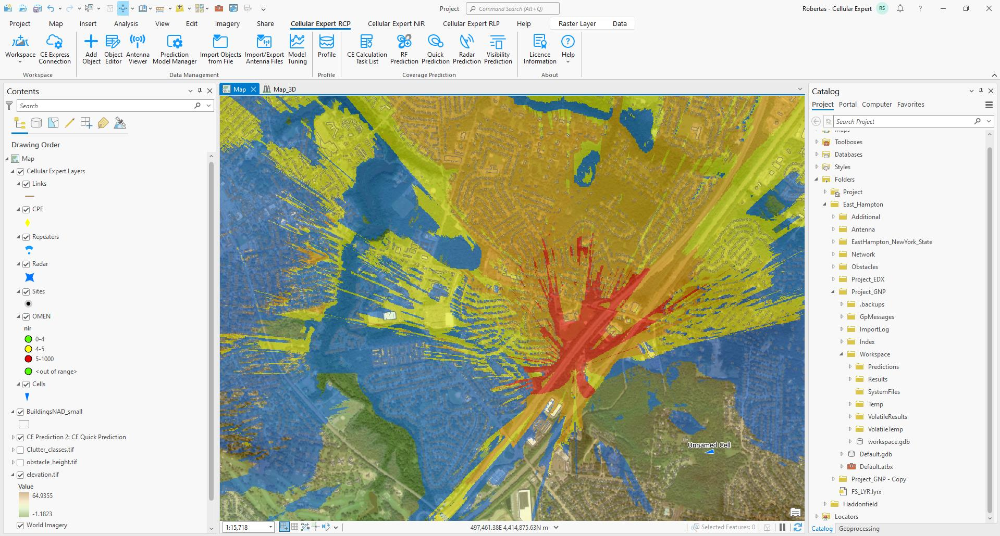

---

Cellular Expert Project Structure

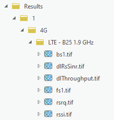

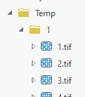

- Predictions
- Results
- SystemFiles
- Temp
- VolatileResults
- VolatileTemp
- Workspace.gdb

---

Workspace database files

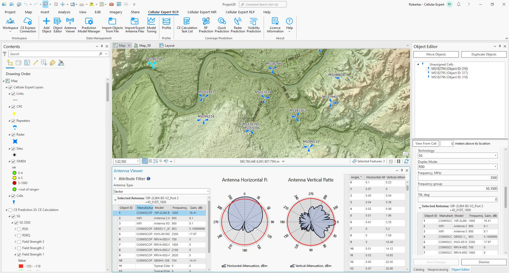

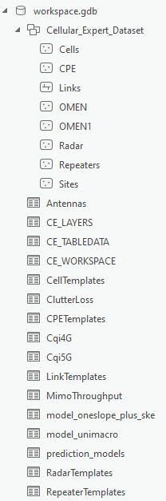

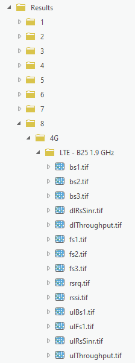

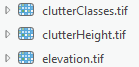
---

Environment
- Geographic data
- Cellular Expert Workspace

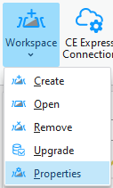

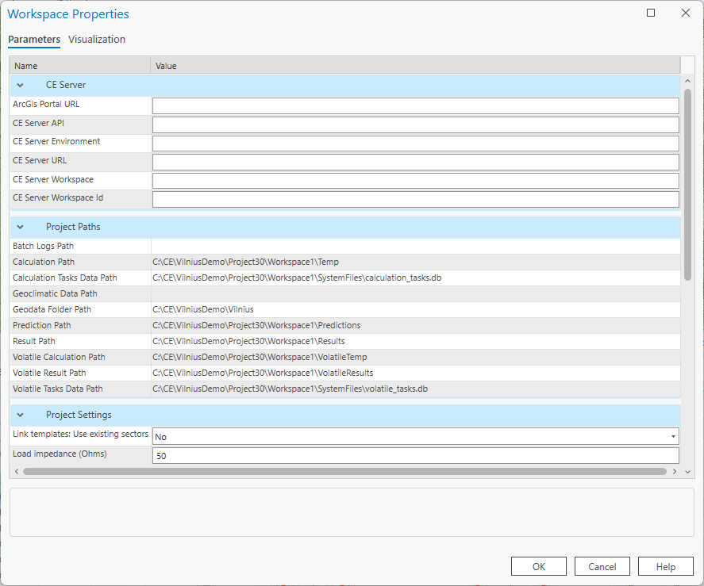
- Results

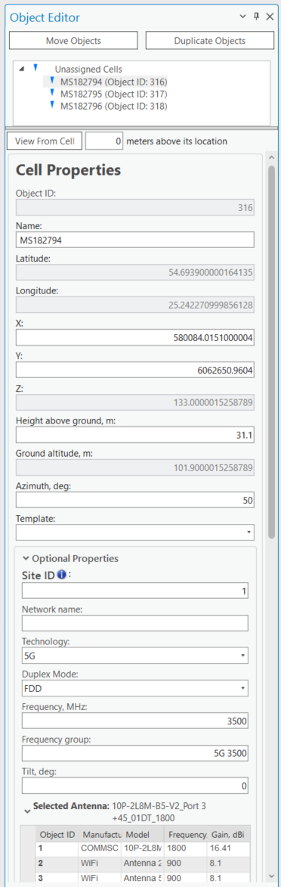

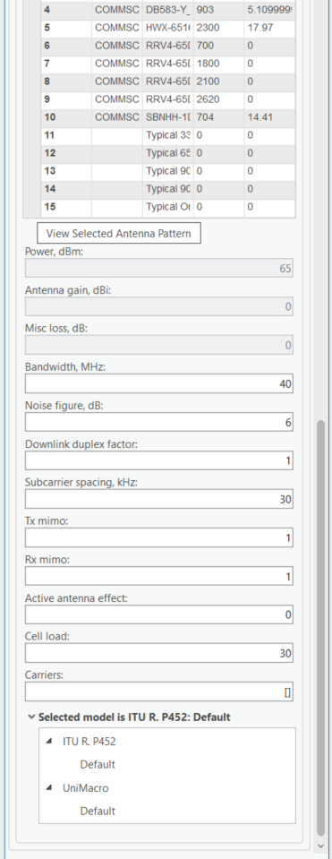

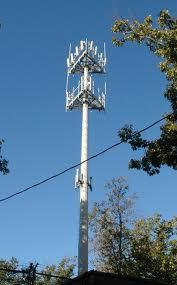

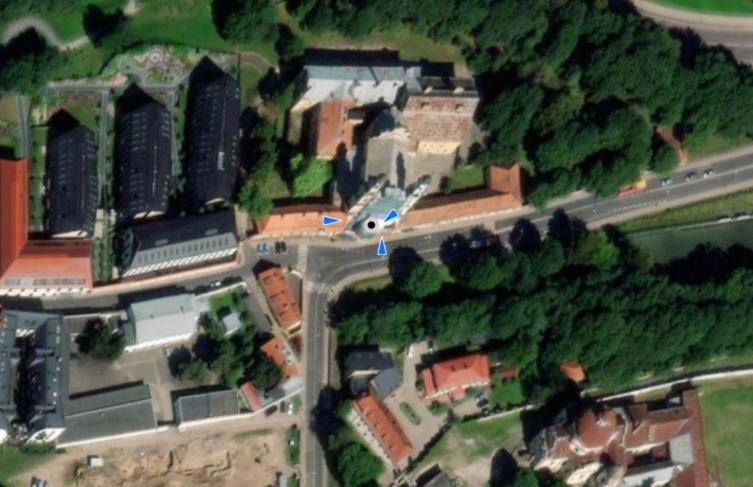

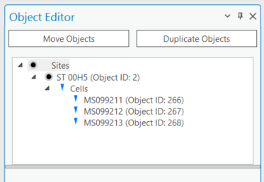
---

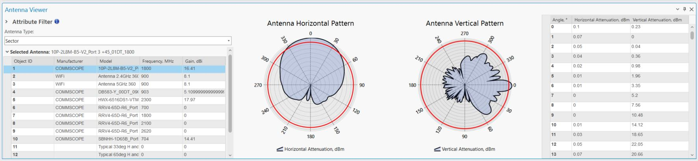

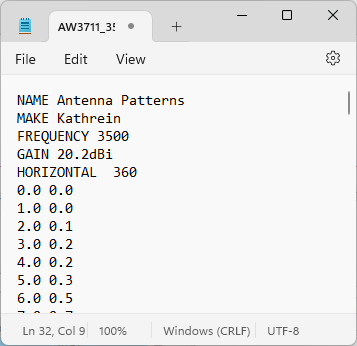

Cellular Expert Workspace

---

Inside Workspace
➢ Network Data
➢ Equipment Data
➢ Modelling Settings

---

Network Data Structure
RF prediction does not require Site
object. Cells can be created
Cell – logical
without Site object.
information
Cells
about sector:
Cell still has SiteID value, which
a set of channels can be define in the attributes.
SiteID is used for Carrier
Aggregation.
Site and Cell is connected through
Site – location point with
SiteID value.
unique identifier:
Site Base station SiteID must be Integer.
Site name is defined for Site object.
Cells

---

Cell
➢ 800 MHz
➢ 1800 MHz
➢ 2100 MHz

---

Site

---

Antenna

---

CE Path Loss [models](#kw:31-models:ce-express-tr-models) (10kHz - 350 GHz)
1. CEC ITU-R Model (100MHz – 6GHz) is a combination model intended for use in a variety of different radiocommunication systems which is derived explicitly
from ITU-R path loss modelling methods as follows:
a. Receive antenna in LOS condition – path loss calculated as FSL based on Recommendation ITU-R P.525 (ref URL);
b. Receive antenna in OLOS condition – total path loss modelled as a combination of basic FSL calculated based on Recommendation ITU-R P.525 (ref
URL) and [clutter](#kw:clutter-classification-values:ce-express-geodata) loss calculated based on Recommendation ITU-R P.2108 (ref URL);
c. Receive antenna in NLOS condition – path loss as a combination of basic FSL calculated based on Recommendation ITU-R P.525 (ref URL), additional
losses due to diffraction calculated based on Recommendation ITU-R P.526 (ref URL) and the [clutter](#kw:clutter-classification-values:ce-express-geodata) losses calculated based on Rec. ITU-R P.2108
(ref URL).
2. ITU-R P.452 Model (6GHz – 50GHz) is provided as a universally applicable model with very wide frequency range from 0.1-50 GHz. Its implementation is
based on the methodology described in the Recommendation ITU-R P.452 (ref URL). This model does not provide for definition of OLOS visibility condition;
instead it considers [clutter](#kw:clutter-classification-values:ce-express-geodata) as part of general obstacles category and accordingly distinguishes only two radio visibility cases:
a. Receive antenna in LOS condition – path loss modelled based on FSL principle;
b. Receive antenna in NLOS condition – total path loss modelled using a combination of basic transmission losses and losses due to diffraction.
3. LOS ITU-R P.525 Model (6GHz – 100GHz) is the FSL path loss calculated based on method in Recommendation ITU-R P.525 (ref URL). As such it could be
used for modelling of radio links where LOS is considered a necessary condition, e.g., for Fixed (Point-to-Point) Links or Mobile Systems in [mmWave](#kw:56-step-8-losonly-prediction-for-mmwave:ce-express-tr-[models](#kw:31-models:ce-express-tr-models)) bands.
4. UniMacro Model (400MHz – 3GHz) is the CE’s proprietary combination model developed over the years of practical experience with the operational planning
of cellular mobile networks in the frequency ranges from 400-2600 MHz. It had been fine tuned to produce coverage predictions that are most closely aligned
with what could be expected to be experienced by the actual mobile network users in the field. The model will model different path losses depending on radio
visibility conditions as follows:
a. Receive antenna in LOS condition – path loss modelled based on FSL principle;
b. Receive antenna in OLOS condition – path loss modelled using Extended Hata (Open Area) model with additional clutter loss calculated based on
Recommendation ITU-R P.2108 (ref URL);
c. Receive antenna in NLOS condition – path loss modelled using Extended Hata model with additional losses due to diffraction calculated based on
Recommendation ITU-R P.526 (ref URL) as well as clutter losses based on Rec. ITU-R P.2108 (ref URL).
5. ITU-R P.368 Model (10kHz – 30MHz)

---

CE prediction models

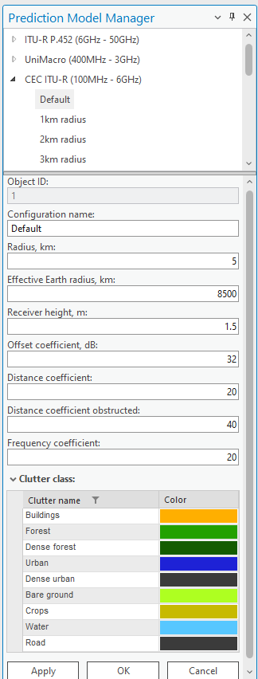

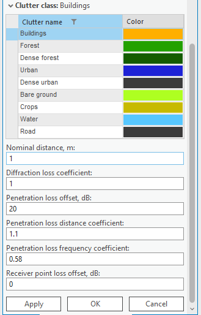

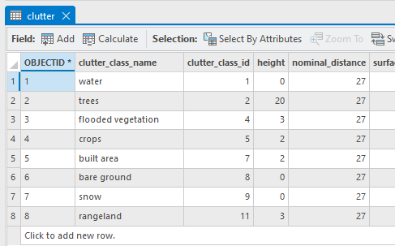

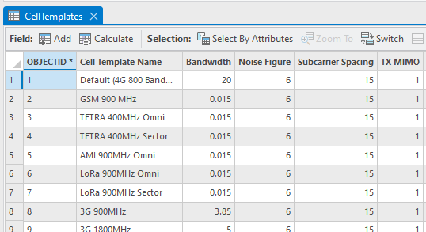

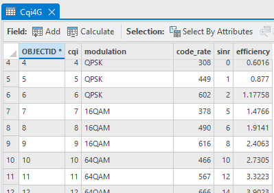

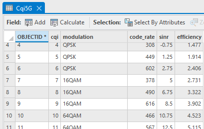

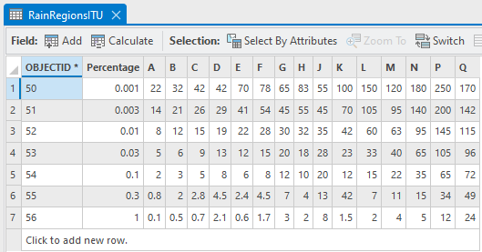
---

Other

---
