# 04. Creating Workspace

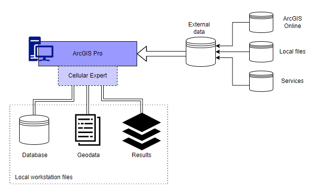


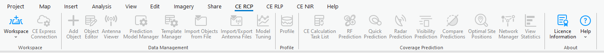

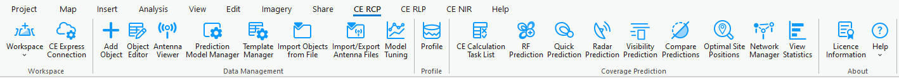

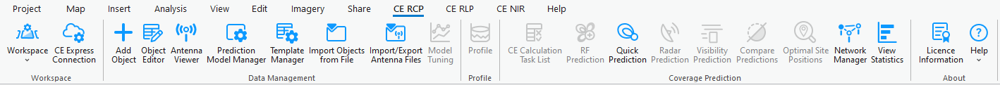
> **Version:** CE Pro v4.9

> **Version:** CE Pro v4.9

## What Is a Workspace?

A CE Pro Workspace is a geodatabase (`.gdb`) that stores all project data — cells, sites, antennas, links, and prediction results. Every CE Pro project must have one workspace before any RF work can begin.

---

## CE Tools State

The **CE Tools** tab in the ArcGIS Pro ribbon shows one of three states:

| State | Meaning |
|---|---|
| Workspace is not added | No workspace linked to this project yet |
| Workspace is added | Workspace found and geodata path is valid |
| Workspace is added, but Geodata is missing | Workspace exists but the geodata folder path is broken |

---

## Creating a New Workspace

When ArcGIS Pro opens, the start page lets you create a new project or open an existing one:

1. Open ArcGIS Pro and add a **Map** or **Local Scene** to your project
2. Click the **CE Desktop** tab in the ribbon
3. Click **Create Workspace**

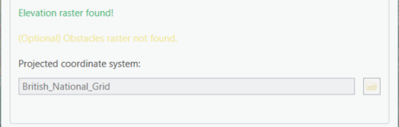

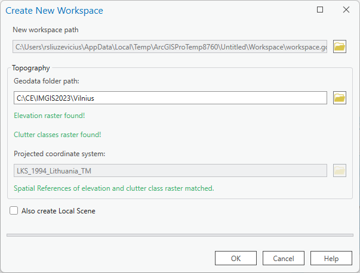


4. Fill in the required fields:

| Field | Description |
|---|---|
| New workspace path | Folder where the `.gdb` will be created |
| Geodata folder path | Path to your DTM / clutter / obstacle rasters |
| Projected coordinate system | Must match your geodata CRS (e.g., EPSG:3346 for Lithuania) |
| Also create Local Scene | Tick to add a 3D scene view automatically |

5. Click **Create** — CE Pro will build the geodatabase and populate it with the default schema

---

## Cellular Expert Project Structure


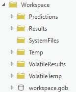

After creation, the workspace folder contains:

```
MyProject/
├── Predictions/          ← RF prediction output rasters
├── Results/              ← Processed result layers
├── SystemFiles/          ← Internal CE configuration files
├── Temp/                 ← Temporary calculation files
├── VolatileResults/      ← Short-lived result cache
├── VolatileTemp/         ← Short-lived temp cache
└── Workspace.gdb/        ← Main geodatabase (cells, sites, antennas, links)
```

---

## Cellular Expert Dataset Objects

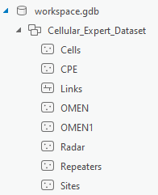


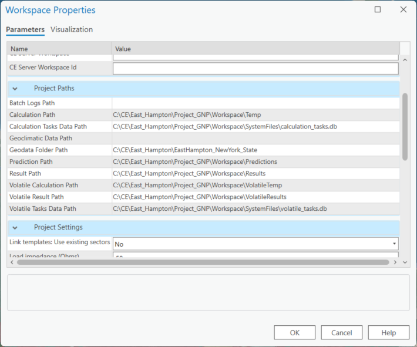
The `Workspace.gdb` contains the following feature classes:

| Object | Description |
|---|---|
| Cell | Radio cell with RF parameters (frequency, power, antenna, technology) |
| Site | Physical mast or rooftop location grouping one or more cells |
| Radar | Radar interference source object |
| Repeater | Signal repeater / booster |
| CPE | Customer Premises Equipment (fixed wireless terminal) |
| OMEN | Omni-directional microwave node |
| Link | Point-to-point microwave or RL link |

---

## Changing Project Paths

If you move the geodata folder or the workspace after creation:

1. Click **CE Desktop → Workspace → Settings**
2. Update the **Geodata path** to the new location
3. Update **Calculation paths** (Predictions, Results, Temp) if needed
4. Click **Apply**

---

## Project Settings and Rounding

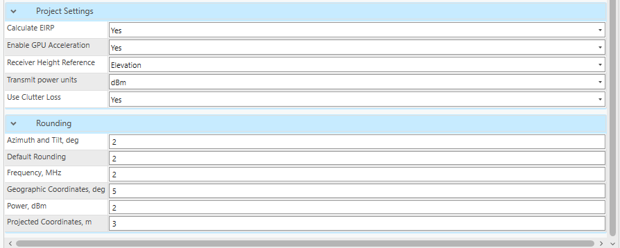

Under **CE Desktop → Workspace → Project Settings** you can configure:

- Coordinate display format (decimal degrees vs projected metres)
- Power units (dBm / dBW)
- Distance units (km / miles)
- Rounding precision for displayed values

---

## Workspace Upgrade

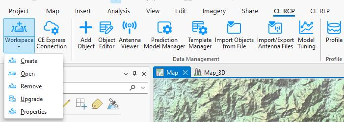


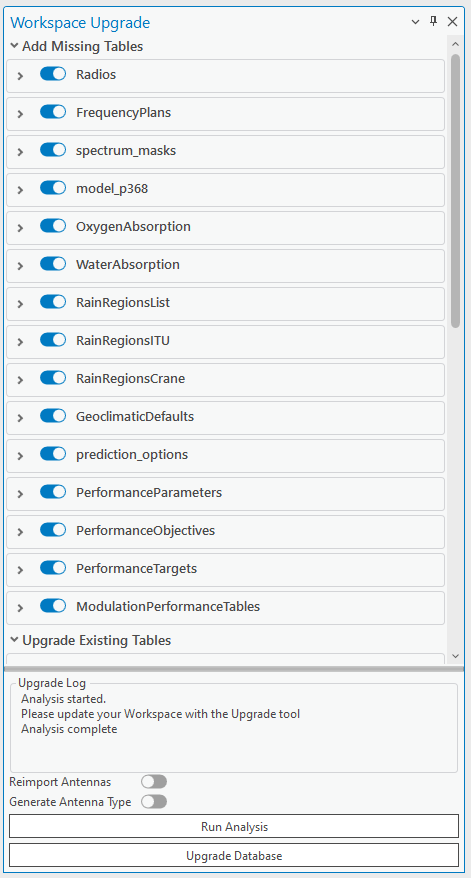

When you open a workspace created with an older CE version, CE Pro will detect a schema mismatch and prompt an upgrade:

1. Go to **CE Desktop → Workspace → Upgrade**
2. Review the list of new tables and fields that will be added
3. Click **Upgrade Database**

> Upgrade is non-destructive — existing data is preserved. Always back up the `.gdb` before upgrading.

---

**Exercise:** `C:\CE_Course\0. Descriptions\1. Create workspace.pdf`

**Contact:** info@cellular-expert.com | +370 5 2150575 | www.cellular-expert.com
