# 05. Line of Sight (Profile)

> **Version:** CE Pro v4.9

LOS and profile results are displayed in the ArcGIS Pro map view. The map canvas shows the terrain cross-section and any obstruction points:

The **Contents** and **Catalog** panes show the DEM, clutter, and obstacle layers required for LOS calculation:

---

## Geodata Layers Used

CE Pro uses three GIS data layers for precise RF propagation modelling:

| Layer | Description |
|-------|-------------|
| **DTM / DEM** | Digital Terrain Model — ground elevation above sea level |
| **Obstacles** | Buildings and structures above ground (principal impediments) |
| **Clutter** | Vegetation, crops, gardens — partially penetrable by radio waves |

Together these layers form the **DSM (Digital Surface Model)**:
```
DSM = DTM + Obstacles (buildings/vegetation)
```

---

## Point-to-Point Profile

### Input Parameters

| Category | Parameter |
|----------|-----------|
| Geodata | Elevation, Buildings, Clutter |
| RF | Frequency (MHz), Fresnel Zone (%), Earth radius factor |
| Transmitter | Height (m), Power (dBm) |
| Receiver | Height (m), Power (dBm) |

### Profile Calculation Results

**General Clearance:**

| Output | Description |
|--------|-------------|
| Clearance | Distance (m) between LOS line and highest obstacle |
| Clearance Percentage | Clearance as % of 1st Fresnel zone radius |
| Clearance Distance | Horizontal distance to first obstruction |
| Distance to NLOS | Distance at which path becomes NLOS |
| Distance to OLOS | Distance at which path becomes OLOS |

**Power Budget:**

| Output | Description |
|--------|-------------|
| Downlink FS | Downlink received signal (Free Space) |
| Uplink FS | Uplink received signal (Free Space) |
| FWA Downlink RSL | Fixed Wireless Access downlink received signal level |
| FWA Uplink RSL | Fixed Wireless Access uplink received signal level |

**Path Loss Breakdown:**

| Output | Description |
|--------|-------------|
| Total Path Loss | Sum of all loss components (dB) |
| Model Loss | Loss from selected propagation model |
| Diffraction Loss | Loss from obstacles per ITU-R P.526 |
| Penetration Loss | Outdoor-to-indoor loss (3GPP TR 38.901) |
| Receiver Clutter Loss | Loss due to clutter at receiver location |
| Clutter Loss | General clutter loss from ITU-R P.2108 |

**Angles:**
- Elevation angle of the LOS path (degrees)

---

## Fresnel Zone Clearance

The Fresnel zone radius at distance d from transmitter:

```
r = sqrt(λ × d1 × d2 / (d1 + d2))

where:
  λ  = wavelength (m)
  d1 = distance from Tx to obstacle (m)
  d2 = distance from obstacle to Rx (m)
```

Recommended minimum clearance: **60% of 1st Fresnel zone radius** to avoid significant diffraction loss.

---

## Visibility (Point-to-Area) Prediction

### Input Parameters

| Parameter | Description |
|-----------|-------------|
| Geodata | Elevation + Obstacles |
| Frequency (MHz) | Used for Fresnel zone calculation |
| Calculation radius (km) | Area around transmitter to analyse |
| Earth radius factor | Accounts for atmospheric refraction (typically k = 4/3) |
| Transmitter height (m) | Fixed antenna height |
| Receiver height (m) | Height of mobile UE |

### Visibility Result Layers

| Layer | Values | Description |
|-------|--------|-------------|
| Line of Sight | 0 / 1 | 0 = NLOS, 1 = LOS |
| Required Height for LoS | meters | Minimum receiver height to achieve LOS |
| Clearance | meters | Clearance distance at receiver point |

**Example:** If Clearance = 6.5 m, the LOS line passes 6.5 m above the highest obstacle at that location.

---

## Surface Models Compared

```
Surface grid     = DTM + Obstacles + Clutter (full DSM)
Elevation grid   = DTM only (bare earth)
Obstacles grid   = Buildings and structures only
```

Visual LOS check:
```
Tx ─────────────── Rx    (LOS — no obstruction)
Tx ──── [building] ─ Rx  (NLOS — building blocks path)
Tx ──── [trees] ─── Rx   (OLOS — partially penetrable)
```

---

## Dynamic Profile Mode

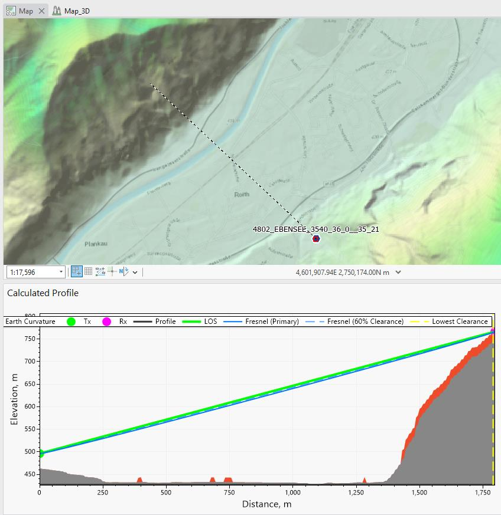

- **Fix transmitter** — anchor one end of the profile at a fixed cell/antenna location
- **Dynamic option** — move the receiver endpoint interactively on the map; profile updates in real time

---

## Profile Symbology

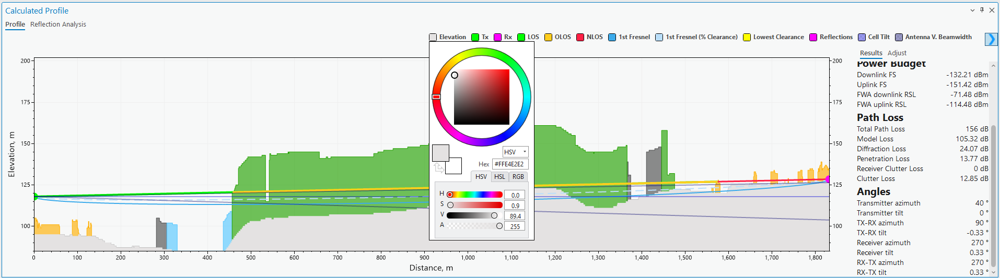

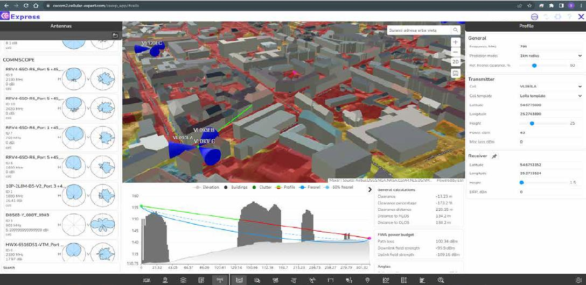

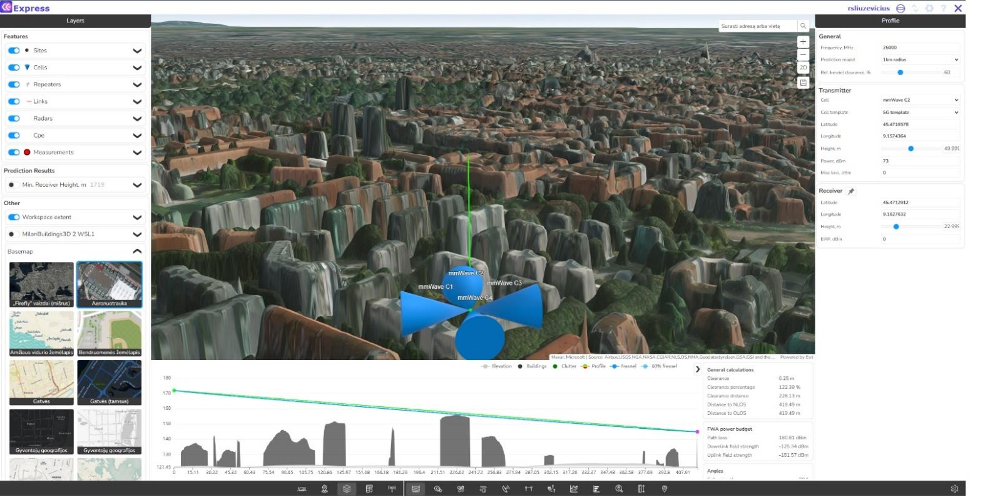
Define custom colours for each element displayed in the profile view:

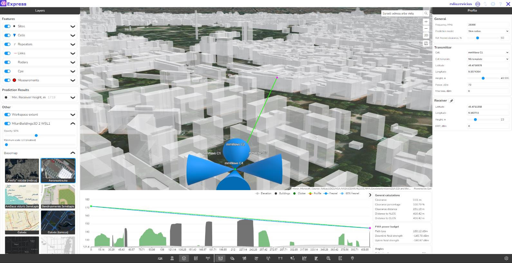

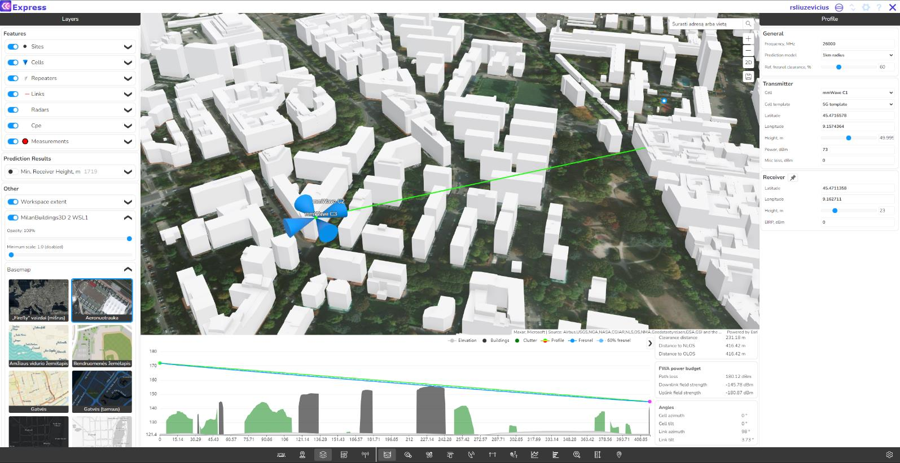
- Ground (DTM)

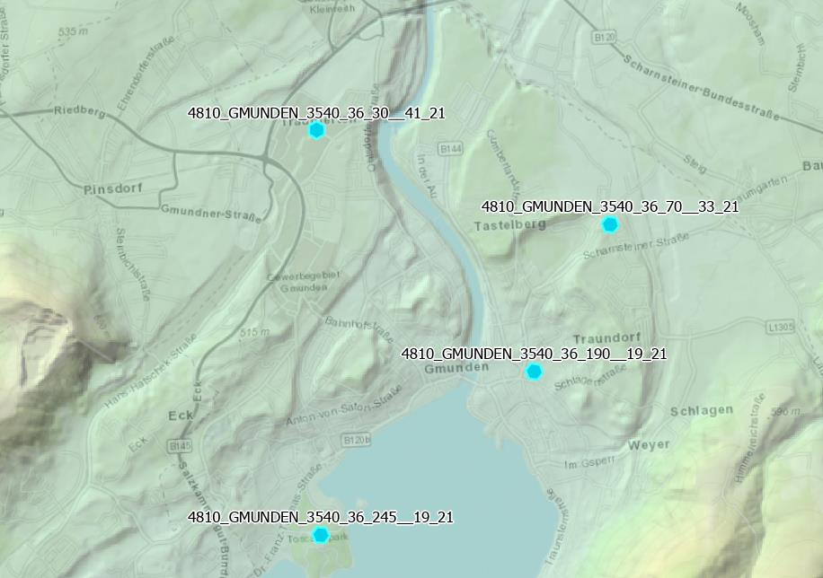

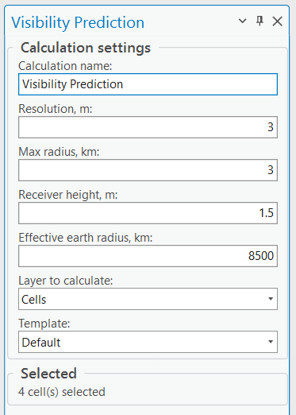
- Buildings / Obstacles


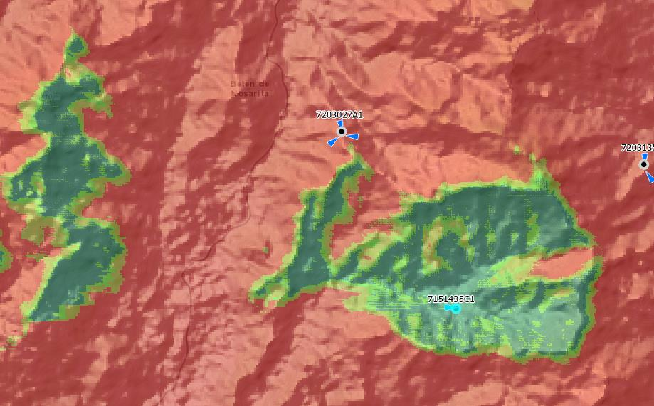
- Clutter / Vegetation

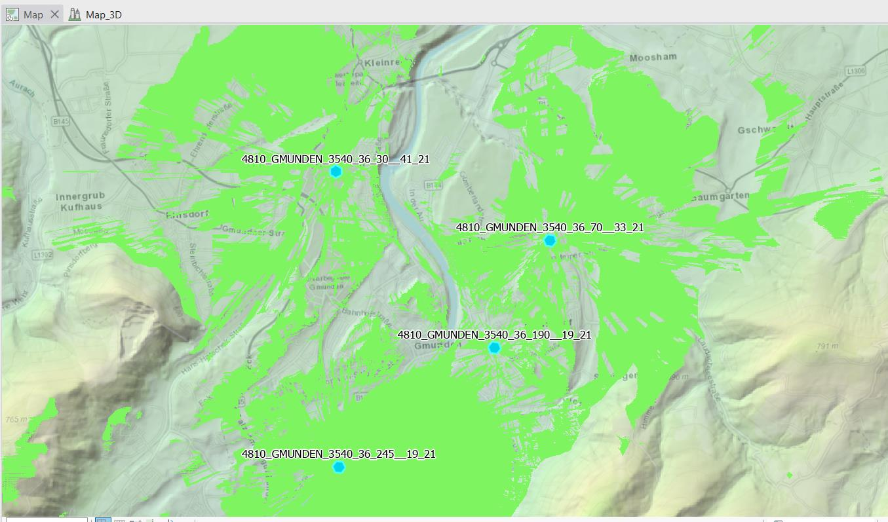
- LOS line

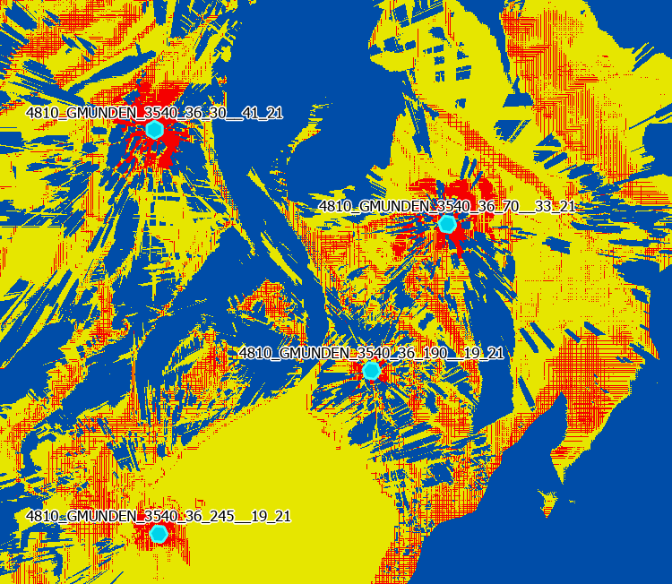

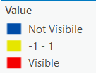
- Fresnel zone ellipse

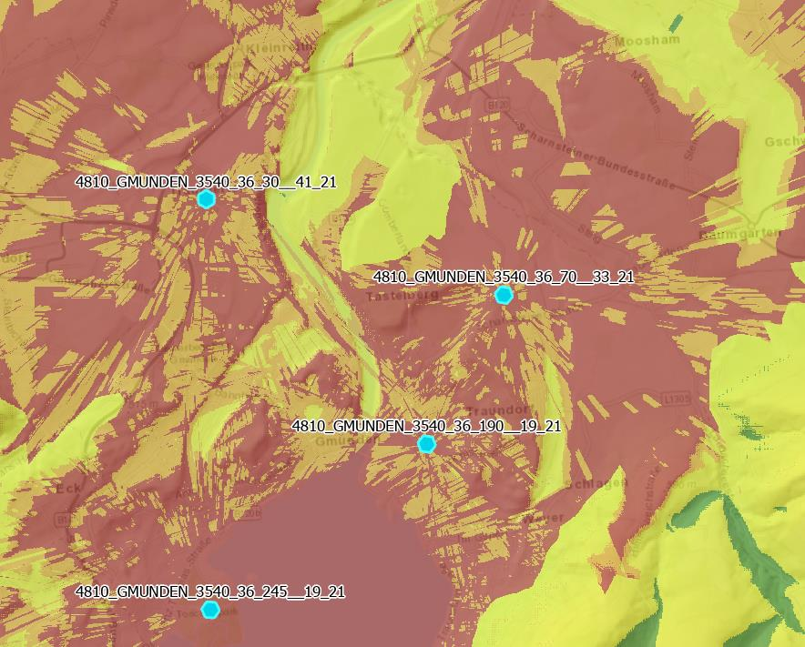

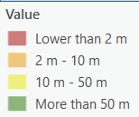

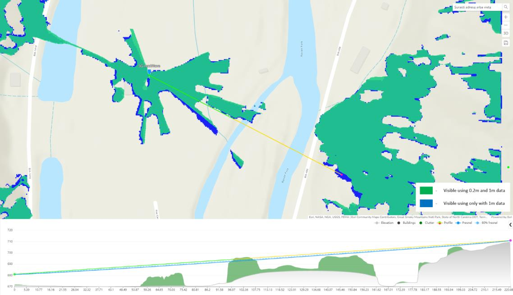

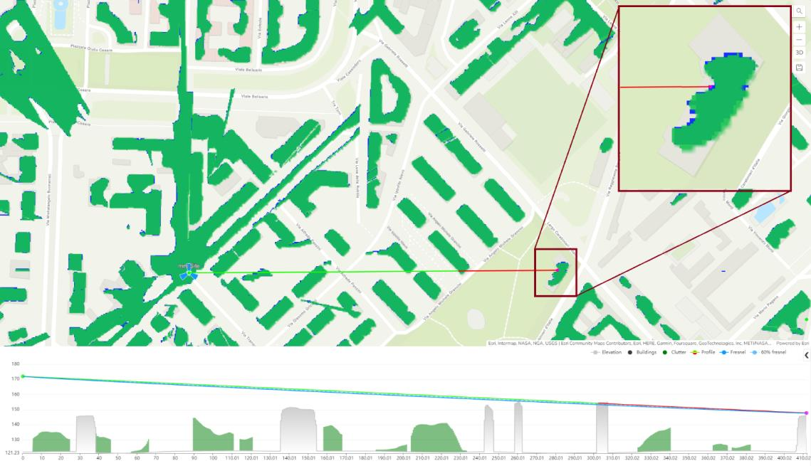
---

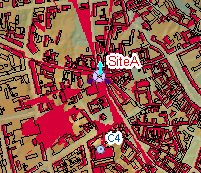

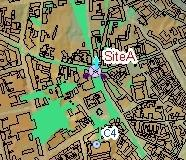

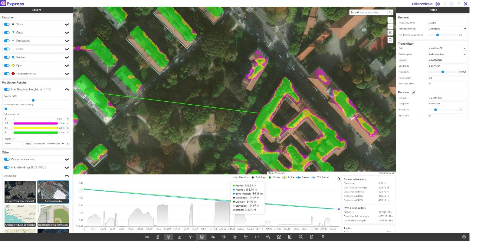
## 3D Profile View

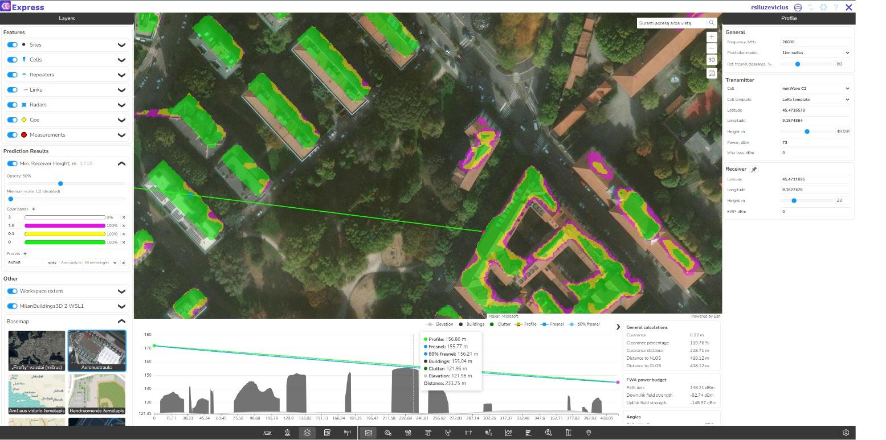

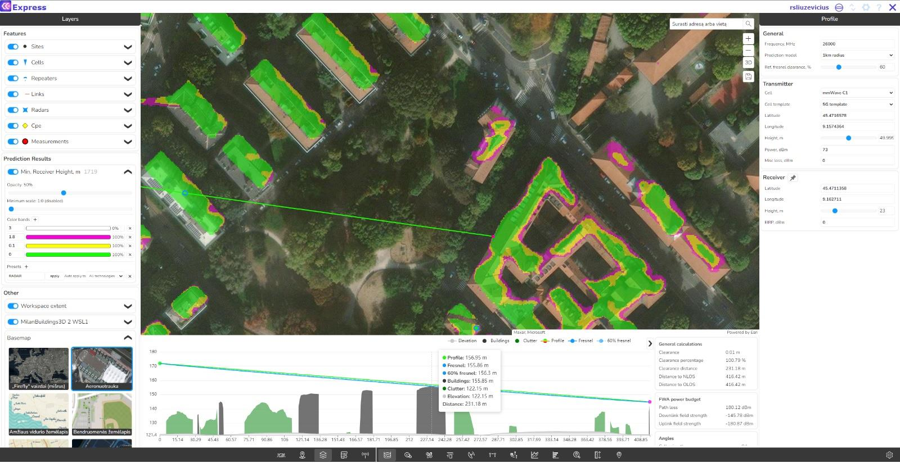
CE Pro can display the terrain profile in 3D, showing the transmitter, receiver, terrain, obstacles, and the LOS path in a three-dimensional view.

---

*Reference: CE Desktop Training — 2. Line of Sight (Profile)*
*Contact: info@cellular-expert.com | +370 5 2150575*
