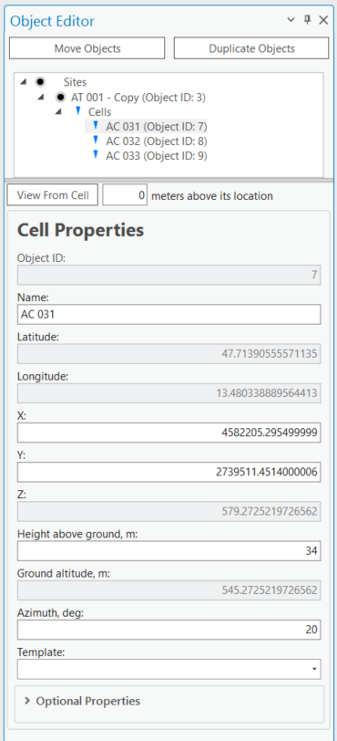
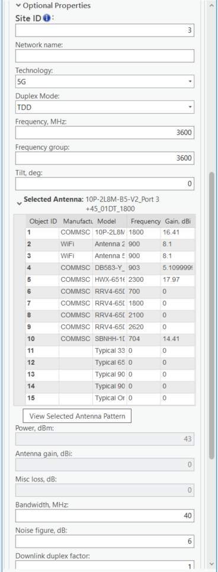
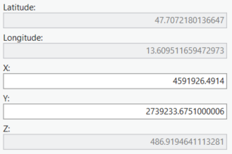
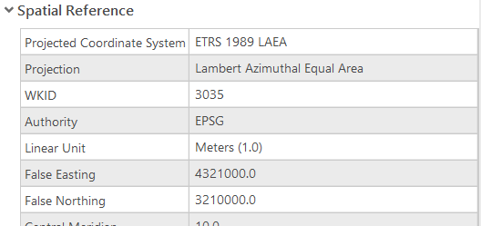
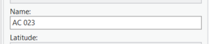
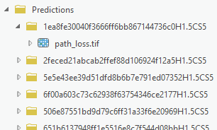
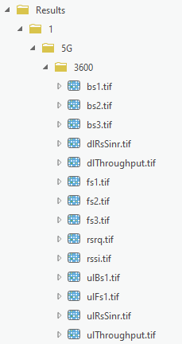
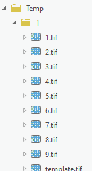

# 07. Cell Prediction

> **Version:** CE Pro v4.9

Cell prediction results are displayed as coverage rasters in the ArcGIS Pro map view:

Configure prediction parameters in the CE Pro pane before running:

---

## Cell Structure









Each cell in CE Pro has two categories of parameters:









**Physical parameters:**
- Coordinates (X/Y or Latitude/Longitude)
- Height (above ground)
- Azimuth (direction)

**Logical parameters:**
- Power (dBm or EIRP)
- Bandwidth (MHz)
- Frequency (MHz)
- Technology (2G/3G/4G/5G)

---

## Cell Coordinates

CE Pro supports two coordinate systems:

| System | Fields | Notes |
|--------|--------|-------|
| Projected (CRS) | X, Y | Meters in project CRS |
| Geographic (WGS 1984) | Longitude, Latitude | Decimal degrees |
| Z — total height above sea level | | Calculated from site height + cell height |

> **Note:** Cell name is a unique parameter per project. Best Server prediction also uses the cell name as identifier.

---

## Cell Parameters Reference

| CE Field | Units | Example | Description |
|----------|-------|---------|-------------|
| `cell_name` | text | `5G cell XXYY` | Unique cell identifier |
| `site_name` | text | `Site 55 ID` | Parent site identifier |
| `latitude` | decimal degrees | `49.9993` | Y coordinate in WGS 1984 |
| `longitude` | decimal degrees | `33.6573` | X coordinate in WGS 1984 |
| `height` | meters | `40` | Cell height above ground |
| `azimuth` | degrees (0–360) | `50` | Cell direction from north |
| `tilt` | degrees | `1` | Mechanical tilt angle |
| `frequency` | MHz | `3500` | Carrier frequency |
| `power` | dBm | `40` | Cell transmit power (or EIRP) |
| `antenna_gain` | dBi | `18.2` | Gain of assigned antenna |
| `misc_loss` | dB | `1` | Total cell miscellaneous loss |
| `bandwidth` | MHz | `0.015` | Cell bandwidth (required for 3G/4G/5G) |
| `subcarrier_spacing` | kHz | `15` | Subcarrier spacing (required for 5G) |
| `tx_mimo` | number | `4` | Transmitter MIMO config (1/2/4/8/16/32/64) |
| `rx_mimo` | number | `4` | Receiver MIMO config (1/2/4/8/16/32/64) |
| `cell_load` | % (0–100) | `30` | Real-time cell load for broadband calculations |
| `technology` | text | `2G` | Cell technology: 2G, 3G, 4G, or 5G |
| `antenna_id` | number | `1` | ID of assigned antenna pattern |

### Power vs EIRP

- If workspace parameter **Calculate EIRP = Yes**: enter cell transmit power — EIRP is calculated from power + antenna gain − misc loss
- If workspace parameter **Calculate EIRP = No**: `power` field represents EIRP directly

---

## RF Prediction Output Structure

CE Pro stores prediction results in a defined folder structure within the project:

```
Project/
├── Predictions/      — prediction configuration files
├── Results/          — output raster layers (coverage maps)
├── Temp/             — temporary calculation files
```

---

## Running a Cell Prediction

1. Open the **CE Desktop** tab in the ArcGIS Pro ribbon
2. Select one or more cells on the map
3. Click **RF Prediction** and choose prediction type:
   - **Signal Level** (dBm) — received signal power at UE
   - **Best Server** — which cell provides strongest signal per pixel
   - **SINR** — Signal to Interference + Noise Ratio
   - **Throughput** (Mbps) — estimated data rate
4. Set radius (km), resolution (m), and prediction model
5. Click **Run** — results appear as raster layers in the Contents pane

---

## Prediction Types Explained

| Type | Unit | Use Case |
|------|------|----------|
| Signal Level | dBm | Coverage threshold mapping |
| Best Server | cell name | Frequency planning, handover zones |
| SINR | dB | Interference analysis |
| Throughput | Mbps | Capacity and QoS planning |

---

*Reference: CE Desktop Training — 4. Cell Prediction*
*Contact: info@cellular-expert.com | +370 5 2150575*
