# 08. Prediction Models

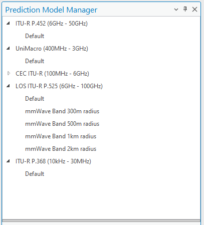


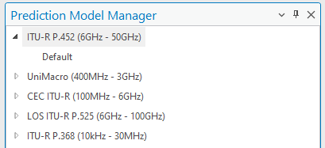


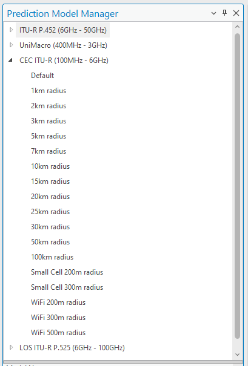

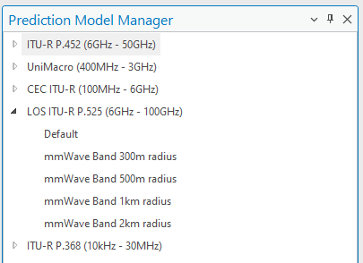

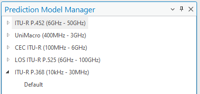
> **Version:** CE Pro v4.9


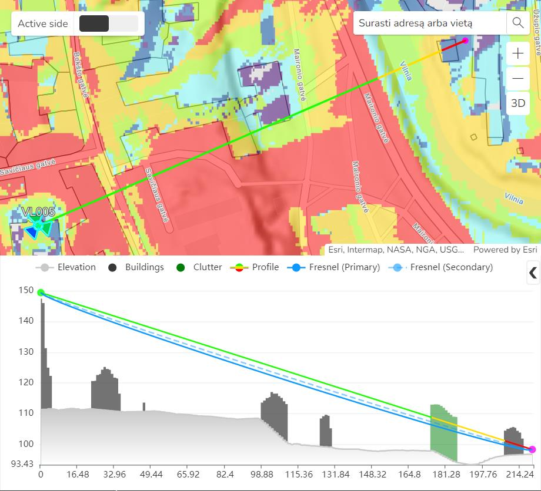

Prediction model output is displayed as a coverage raster on the active map:

Select the prediction model from the contextual CE Desktop tab in the ArcGIS Pro ribbon:

---

## Overview — Path Loss

The fundamental relationship used in CE Pro predictions:

```
Field Strength (dBm) = EIRP – Antenna Attenuation – Path Loss
```

CE Pro supports five path loss models covering 10 kHz – 100 GHz. Choose the model based on frequency band and environment.

---

## CE Path Loss Models

| Model | Frequency Range | Best For |
|-------|----------------|----------|
| CEC ITU-R | 100 MHz – 6 GHz | Cellular (2G/3G/4G/5G) |
| ITU-R P.452 | 6 GHz – 50 GHz | Microwave, mmWave |
| LOS ITU-R P.525 | 6 GHz – 100 GHz | Fixed point-to-point links |
| UniMacro | 400 MHz – 3 GHz | CE proprietary cellular model |
| ITU-R P.368 | 10 kHz – 30 MHz | HF/VHF ground wave |

---

## 1. CEC ITU-R Model (100 MHz – 6 GHz)

Combination model for cellular networks. Distinguishes three radio visibility conditions:

- **LOS** — Free Space Loss (ITU-R P.525)
- **OLOS** (Obstructed LOS) — FSL + Clutter Loss (ITU-R P.2108)
- **NLOS** — FSL + Diffraction Loss (ITU-R P.526) + Clutter Loss (ITU-R P.2108)

### Path Loss Equation (LOS / OLOS)

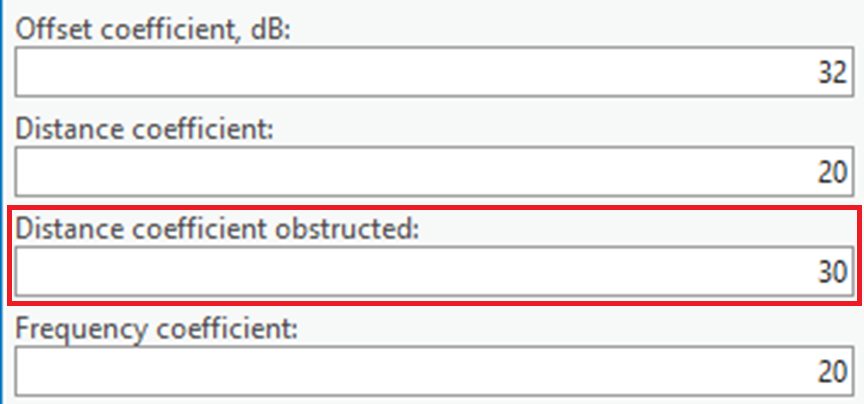

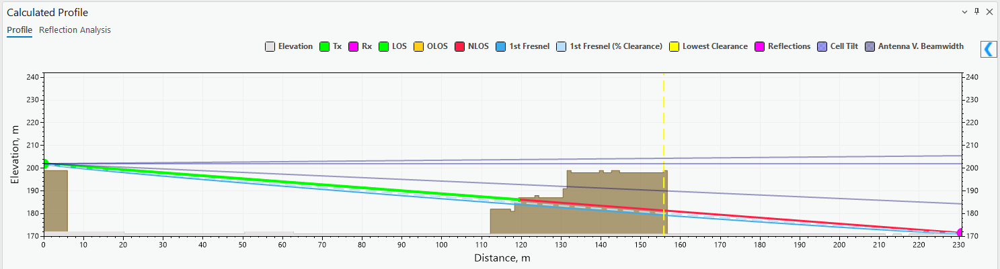


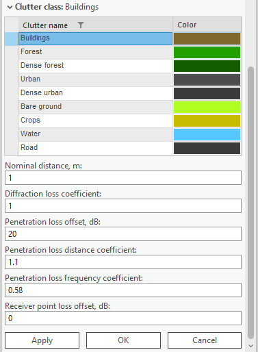
```
L = K_off + K_LogD × log(d) + K_LogF × log(f)
```

| Parameter | Description | Default |
|-----------|-------------|---------|
| K_off | Constant offset (dB) | 32 |
| K_LogD | Distance influence coefficient | 20 |
| K_LogF | Frequency influence coefficient | 20 |
| d | Distance (km) | — |
| f | Frequency (MHz) | — |

### Path Loss Equation (NLOS)

```
L = K_off + K_LogD_obs × log(d) + K_LogF × log(f)
```

K_LogD_obs (obstructed distance coefficient) default = **30**

### Clutter Loss

Estimated per **ITU-R P.2108** — Method 1: clutter shadowing loss with diffraction as dominant effect.


Solid obstacle (building) diffraction uses **Single Knife Edge (SKE)** per ITU-R P.526:

```
Tx ---d1--- [obstacle h > 0] ---d2--- Rx
```

### Penetration Loss (Outdoor → Indoor) — 3GPP TR 38.901

**Low-loss BEL Model** (traditional buildings):
```
L_glass     = 2.0 + 0.2f
L_concrete  = 5.0 + 4.0f
L_IIR_glass = 23.0 + 0.3f        (f = frequency in GHz)
```

**High-loss BEL Model** (modern thermally insulated buildings) uses higher wall penetration coefficients for the same materials.

---

## 2. ITU-R P.452 Model (6 GHz – 50 GHz)

Universal model (0.1–50 GHz) per **Recommendation ITU-R P.452**. Treats clutter as part of general obstacles — only LOS and NLOS are distinguished (no separate OLOS).

- **LOS** — Free Space Loss
- **NLOS** — Basic transmission loss + diffraction losses

---

## 3. LOS ITU-R P.525 Model (6 GHz – 100 GHz)

Pure Free Space Loss per **ITU-R P.525**. Use when LOS is guaranteed:

```
L = K_off + K_LogD × log(d) + K_LogF × log(f)
```
(Defaults: K_off = 32, K_LogD = 20, K_LogF = 20)

Use for fixed microwave links and 5G NR mmWave (FR2).

---

## 4. UniMacro Model (400 MHz – 3 GHz)

CE proprietary model, calibrated from real-world drive tests for cellular networks (400 MHz – 2600 MHz).

- **LOS** — Free Space Loss
- **OLOS** — Extended Hata (Open Area) + Clutter Loss (P.2108)
- **NLOS** — Extended Hata + Diffraction (P.526) + Clutter Loss (P.2108)

### 9999 Ericsson Path Loss Equation

```
L_H = a0 + a1×log(d) + a2×log(hB) + a3×log(hB)×log(d)
        + 3.2×[log(11.75×hM)]² + g(f)

g(f) = 44.49×log(f) – 4.78×[log(f)]²
```

| Parameter | Description | Default |
|-----------|-------------|---------|
| a0 | Constant offset — adjusts absolute level of loss curve | 36.8 |
| a1 | Distance coefficient — controls slope of curve | 30.2 |
| a2 | Transmitter height coefficient | -12.0 |
| a3 | Okumura-Hata multiplier for log(hB)×log(d) | 0.1 |
| hB | Base station antenna height (m) | — |
| hM | Mobile (UE) antenna height (m) | — |
| d | Distance (km) | — |
| f | Frequency (MHz) | — |

**Calibration (drive-test):**
- **a0** — shifts entire curve vertically (mean error correction)
- **a1** — changes slope of curve vs distance
- **a2** — adjusts loss relative to base station height
- **a3** — fine-tunes height-distance interaction

---

## 5. ITU-R P.368 (10 kHz – 30 MHz)

Ground wave propagation for HF/VHF broadcast and land mobile systems.

---

## Prediction Model Manager

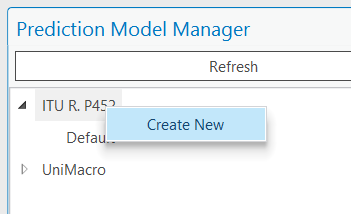


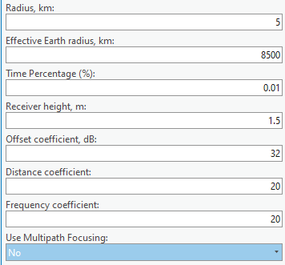
Navigate to: **Cellular Expert tab → Prediction Model Manager**

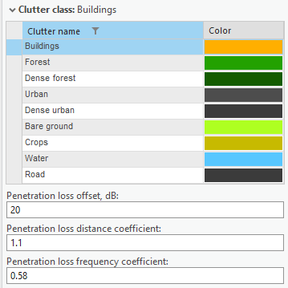


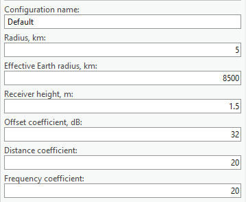
- The **Default** model cannot be deleted

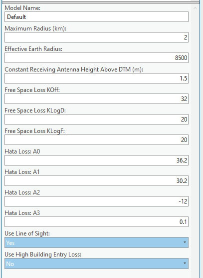
- New models copy parameters from Default as a starting point

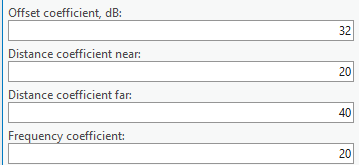
- Each model can be independently calibrated per environment


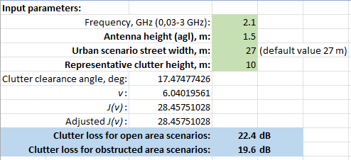

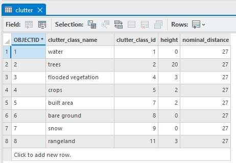
---

## Required Input Data

| Data | Required | Notes |
|------|----------|-------|
| DTM / DEM | ✅ Yes | Terrain elevation grid |
| Clutter classes | Optional | Improves OLOS/NLOS |
| Clutter height grid | Optional | Required for P.2108 |
| Receiver height | ✅ Yes | UE height above ground |
| Model coefficients | ✅ Yes | K_off, K_LogD, K_LogF |

---

*Reference: CE Desktop Training — 5. Prediction Models*
*Contact: info@cellular-expert.com | +370 5 2150575*
