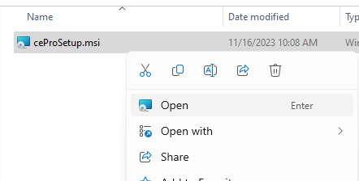
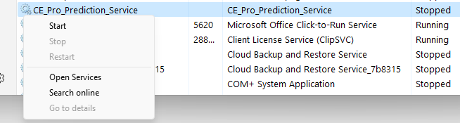
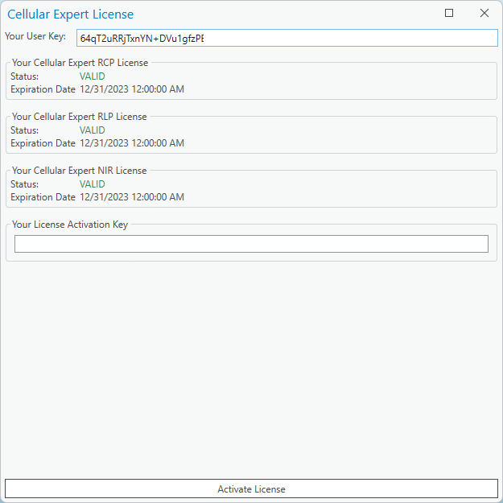

# Software Installation and Upgrades

## Installation Order

1. **ArcGIS Pro**
2. **Cellular Expert**

## Installing Cellular Expert

Installation requires administration rights.

1. Right-click **ceProSetup.msi** and select **Open**.

   

2. Follow the **Cellular Expert 4.0.8 for ArcGIS Pro** installer.

   

3. The installer displays a Quick Start guide:

   > **Quick Start guide:**
   >
   > 1. Start `CE_Pro_Prediction_Service`:
   >    1. Open **Task Manager** and navigate to the **Services** tab.
   >    2. Find `CE_Pro_Prediction_Service`.
   >    3. If the service is not running, right-click it and select **Start**.
   >
   > The following step is required for new users. If the Cellular Expert for ArcGIS Pro license has already been activated, please skip this step.
   >
   > You can activate the license in two ways:
   >
   > **First way:**

   

4. In **Task Manager → Services**, locate `CE_Pro_Prediction_Service`, right-click it, and select **Start**.

   

## Activating the Licence

1. Open an empty ArcGIS Pro project.

   

2. Open **Settings → Licensing**.
3. Enable the **Cellular Expert** extension.

   

4. Send your **User Key**, then click **Activate License**.

   

## License Information

1. Open **ArcGIS Pro**.
2. Add a new map to enable the CE tabs.
3. Open **Licence Information**.

   

   

## Upgrading Cellular Expert

1. **Delete Cellular Expert**
2. **Install Cellular Expert**

## Uninstallation

1. **Cellular Expert**
2. **ArcGIS Pro**

## Upgrading ArcGIS Pro

1. Run the ArcGIS Pro upgrade (Cellular Expert uninstallation is not required).
