# 10. RL / Microwave Link Prediction

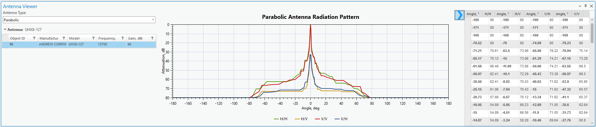


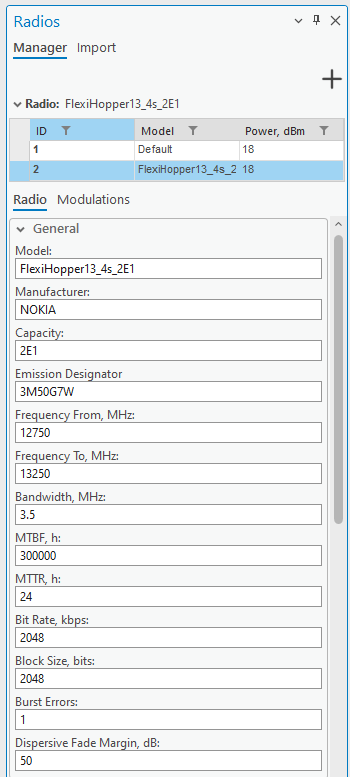

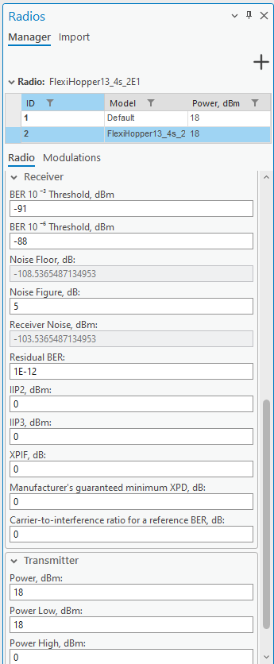

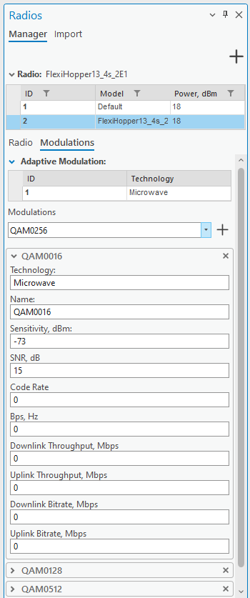
> **Version:** CE Pro v4.9

## Overview

RL and MW link paths and prediction results are displayed on the active map view:

For RL planning, arrange your ArcGIS Pro panes to keep the map, Contents, and CE Pro pane all visible at once:

---

CE Pro includes a full **Radio Link (RL) / Microwave planning** module for fixed point-to-point links. It covers power budget calculation, interference analysis, and geoclimatic availability.

---

## Equipment Library

Before planning links, set up the equipment library:

| Library Item | Description |
|---|---|
| **Antennas → Parabolic** | Parabolic dish antenna patterns |
| **Radio Models** | Tx/Rx equipment specs (power, sensitivity, modulations) |
| **Frequency Plans** | Channel plans and duplex spacing |

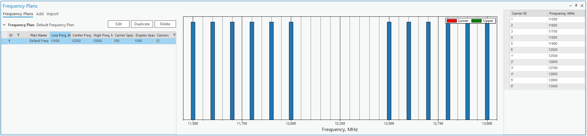
| **Spectrum Mask** | Out-of-band emission masks for interference checks |

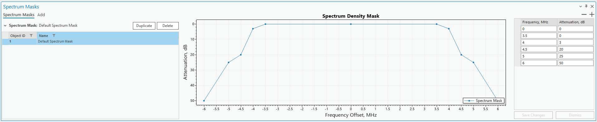

---

## Transmission Network

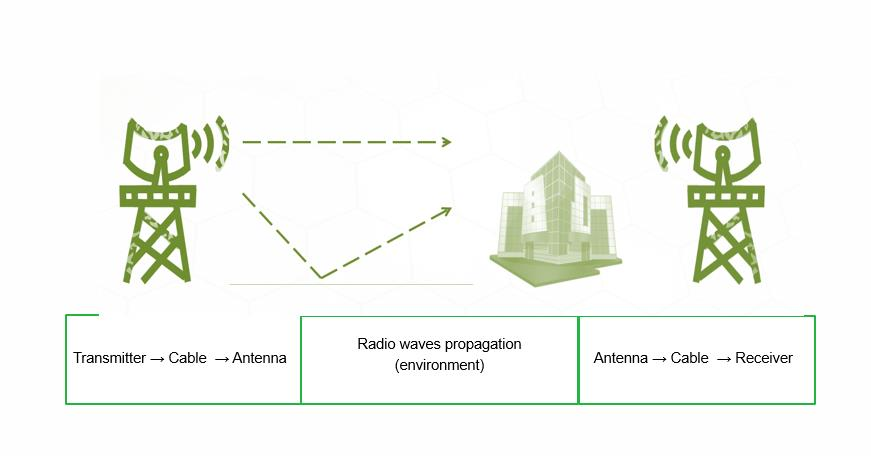

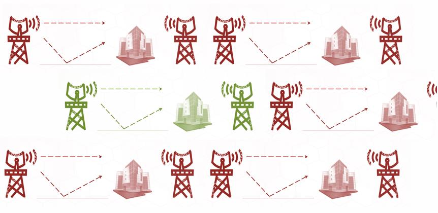

A transmission network in CE Pro is a collection of microwave links connecting sites. Links are drawn on the map between two site objects.

---

## Microwave Link Planning

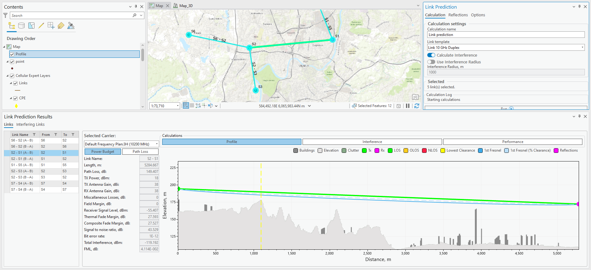

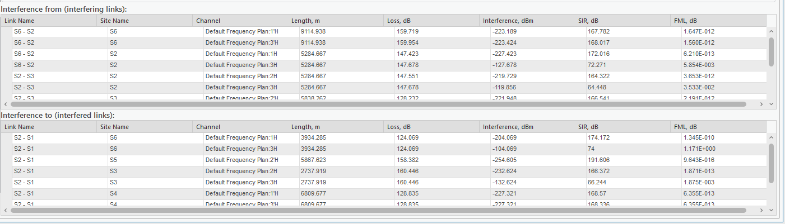


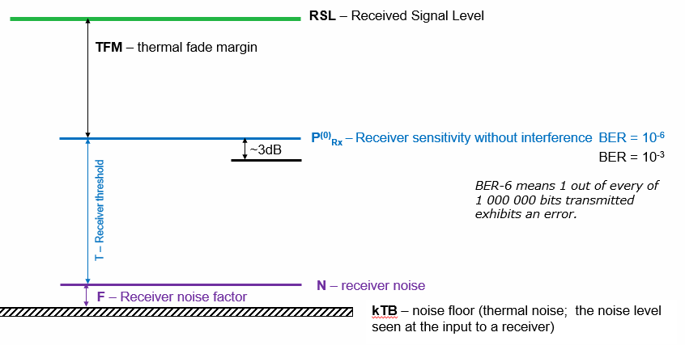
Each link provides the following analysis:

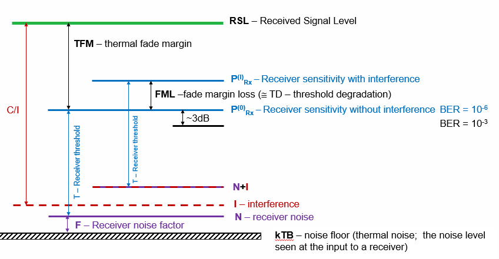


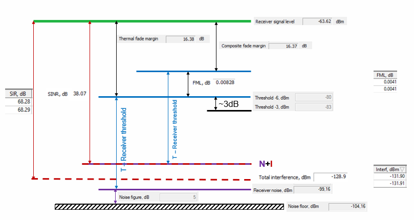
### Power Budget

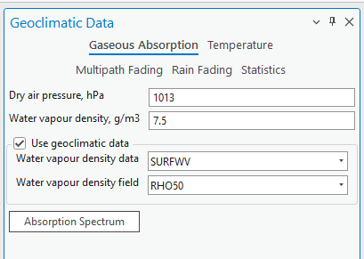

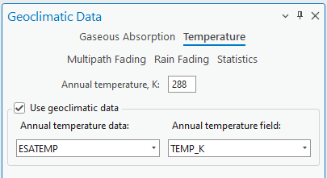

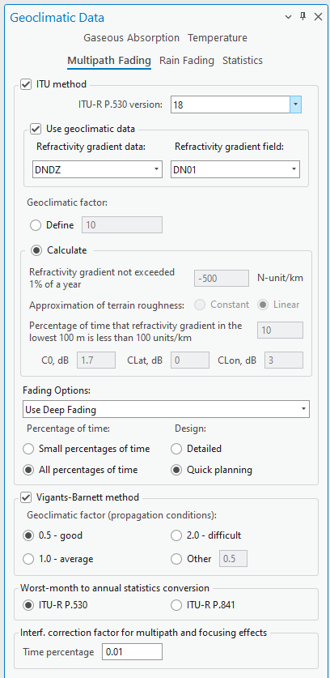

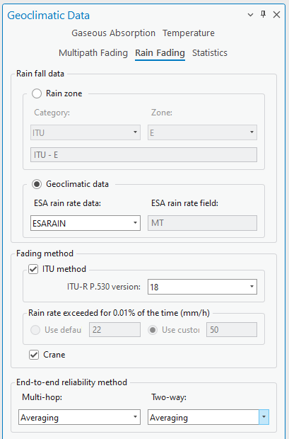

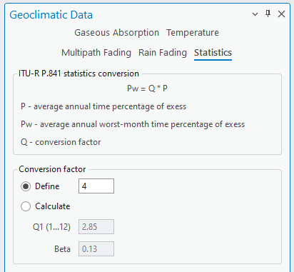


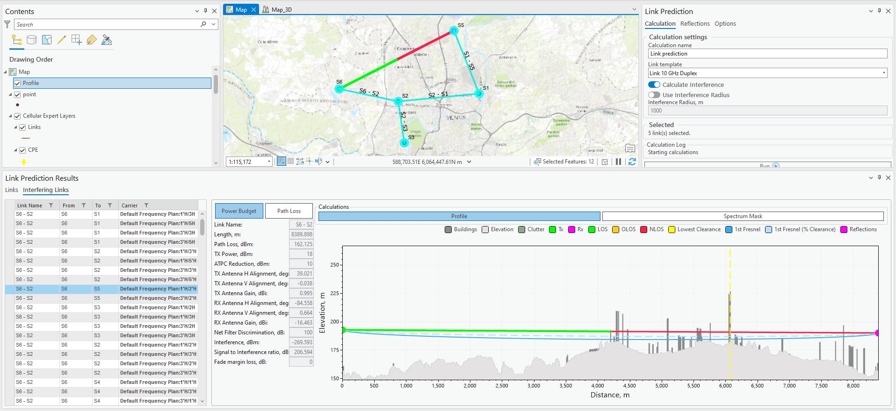

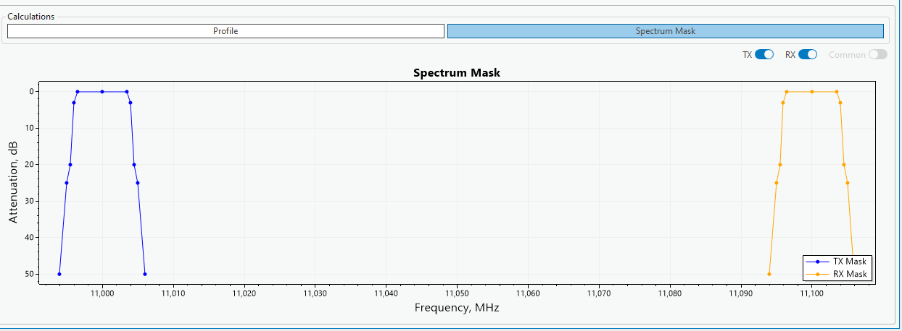
The received signal level (RSL) at each end of the link:

```
RSL = Tx Power + Tx Antenna Gain – Feeder Loss(Tx)
      – Free Space Path Loss
      – Atmospheric Absorption
      – Feeder Loss(Rx) + Rx Antenna Gain
```

Key indicators shown in the power budget panel:

| Indicator | Description |
|-----------|-------------|
| RSL (dBm) | Received Signal Level at each end |
| Threshold (dBm) | Minimum RSL for given modulation / BER |
| Fade Margin (dB) | RSL – Threshold (higher = better reliability) |
| EIRP (dBm) | Effective Isotropic Radiated Power |

### Free Space Path Loss

```
FSL (dB) = 20×log(d) + 20×log(f) + 92.45

where:
  d = distance in km
  f = frequency in GHz
```

### Path Loss Profile

Graphical view showing:
- Terrain cross-section between two link ends
- LOS line and Fresnel zone clearance
- Obstacle heights and clearance margins

---

## Geoclimatic Data

CE Pro uses geoclimatic data per **ITU-R P.530** to calculate:

| Parameter | Description |
|-----------|-------------|
| Rain attenuation | Rain fade probability (ITU-R P.838) |
| Multipath fading | Flat/dispersive fade probability |
| Availability | % annual availability based on fade margin |
| Outage seconds | Expected downtime per year |

---

## Interference Analysis

For each link, CE Pro calculates:

| Analysis | Description |
|----------|-------------|
| **Interference From** | Signals from other links interfering into this receiver |
| **Interference To** | This link's signal interfering into other receivers |

The interfering link view shows:
- Interfering link drawn on the map
- Carrier-to-Interference ratio (C/I)
- Power budget at the interfered receiver
- Path loss and profile of the interference path
- Spectrum mask overlap check

---

## Modulation Adaptive Thresholds

Modern microwave radios support adaptive modulation (AM). The radio model defines RSL thresholds for each modulation:

| Modulation | Typical RSL Threshold |
|-----------|----------------------|
| QPSK | −90 dBm |
| 16QAM | −84 dBm |
| 64QAM | −78 dBm |
| 256QAM | −72 dBm |
| 1024QAM | −65 dBm |

*(Exact values depend on radio model and bandwidth)*

---

## Antenna Selection

Parabolic dish antennas are characterised by:

| Parameter | Description |
|-----------|-------------|
| Diameter (m) | Dish size — affects gain and beamwidth |
| Gain (dBi) | Antenna gain at centre frequency |
| Beamwidth (°) | 3 dB beamwidth in azimuth and elevation |
| Front-to-Back ratio (dB) | Rejection of rear interference |
| Cross-polarisation (dB) | Isolation between polarisations |

---

*Reference: CE Desktop Training — 7. RL Introduction*
*Contact: info@cellular-expert.com | +370 5 2150575*
