# Data Types

All CE Pro data — sites, cells, prediction rasters, and geodata layers — is displayed in the ArcGIS Pro map view:

Geodata layers and network feature classes are managed in the **Contents** and **Catalog** panes:

## Data Types

Data can be:

1. **Vector**
   - Points

     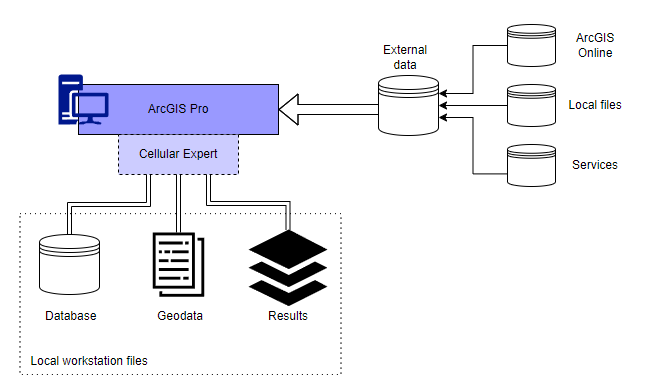
   - Lines

     
   - Polygons

     
2. **Raster**
   - GeoTIFF

     
3. **Tabular**

   

## Modelling Outdoor Coverage

The CE tools make use of three distinct GIS data layers to obtain high precision modelling of radio wave propagation losses:

1. **Digital Terrain Model** (DTM), also known as Digital Elevation Model (DEM), which describes Earth surface, i.e., path terrain profile in terms of ground elevation above uniform sea level.
2. **Obstacles layer**, delineating buildings and other such objects above Earth surface that may be considered to be principal impediments for radio wave propagation.
3. **[Clutter](#kw:clutter-classification-values:ce-express-geodata) layer**, delineating natural occurring or human cultivated ground cover that may be partially penetrable by radio waves, such as natural vegetation (e.g., forests, trees, bushes) or various crops, gardens, parks, etc.

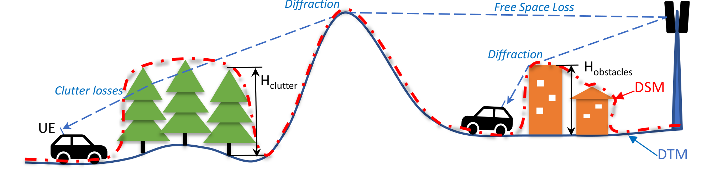

## Raster Type Input: Elevation

- **Digital terrain model (DTM)**
  - Represents Earth's ground/water level above sea level
  - GeoTIFF raster format
  - Height values in meters
  - Coordinate system – projected
  - Resolution (cell size) – centimeter level
  - Raster name: elevation.tif

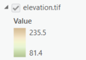

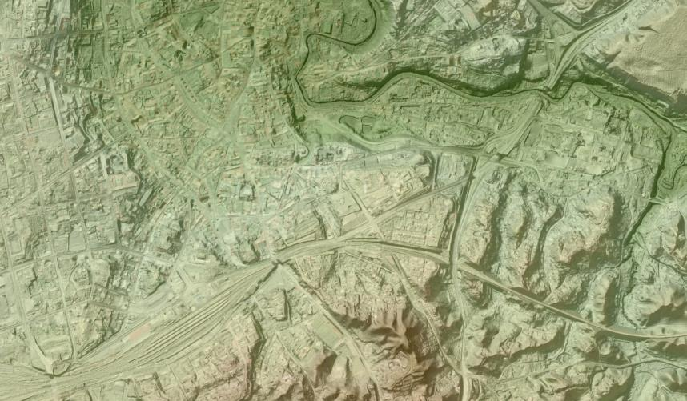

## Raster Type Input: Clutter Height

- **Clutter height**
  - Represents objects height above elevation raster.
  - GeoTIFF raster format
  - Height values in meters
  - Coordinate system – projected
  - Resolution (cell size) – centimeter level
  - Raster name: clutterHeight.tif

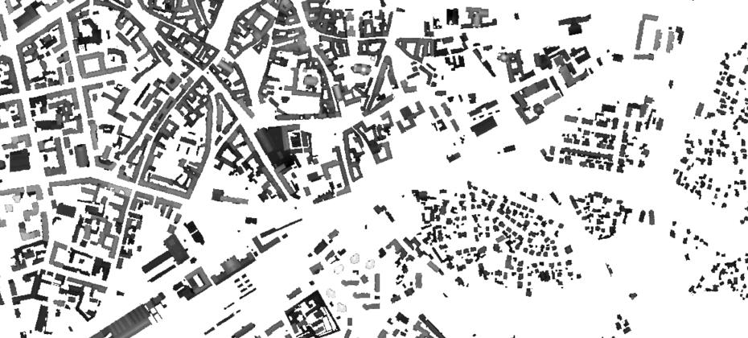

## DTM vs. Surface

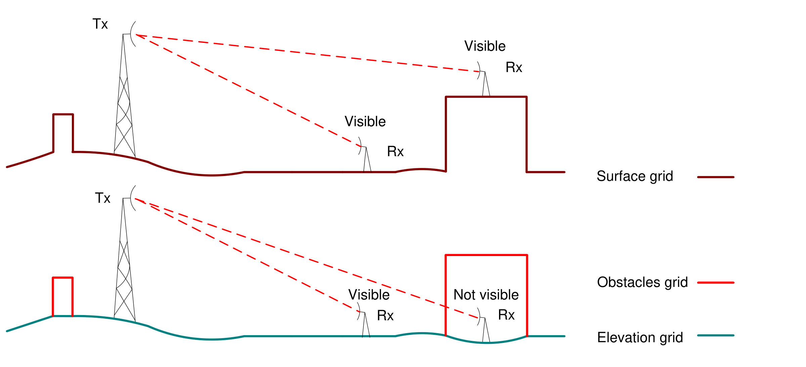

## Clutter Classes

- **[Clutter classes](#kw:clutter-classification-values:ce-express-geodata)**
  - Represents land use classes.
  - GeoTIFF raster format
  - Coordinate system – projected
  - Resolution (cell size) – centimeter level
  - Raster name: clutterClasses.tif

| OBJECTID | clutter_class_name | clutter_class_id | height | nominal_distance | surface_refractivity | relative_permitivity | surface_conductivity | express_id | color | ids |
|---|---|---|---|---|---|---|---|---|---|---|
| 1 | buildings | 1 | 0 | 27 | 315 | 5 | 0.001 | 36 | #FFAF00 | 0 |
| 2 | forest | 2 | 10 | 27 | 315 | 13 | 0.004 | 36 | #23a100 | 2 |
| 3 | denseForest | 4 | 15 | 27 | 315 | 13 | 0.004 | 36 | #145C00 | <Null> |
| 4 | urban | 5 | 0 | 27 | 315 | 5 | 0.001 | 36 | #4d4d4d | 7 |
| 5 | denseUrban | 7 | 0 | 27 | 315 | 5 | 0.001 | 36 | #3B3B3B | <Null> |
| 6 | bareGround | 8 | 0 | 27 | 315 | 10 | 0.002 | 36 | #aeff21 | 11, 4 |
| 7 | crops | 9 | 2 | 27 | 315 | 20 | 0.03 | 36 | #c7ba00 | 8 |
| 8 | water | 11 | 0 | 27 | 365 | 80 | 1 | 36 | #57c7ff | 1 |
| 9 | road | <Null> | 0 | 27 | 315 | 10 | 0.002 | 36 | #3B3B3B | <Null> |

## Clutter Types

**Corine Land Cover**

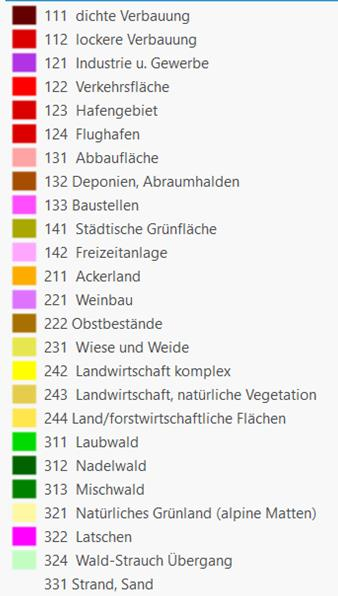

## Raster from Vector Data

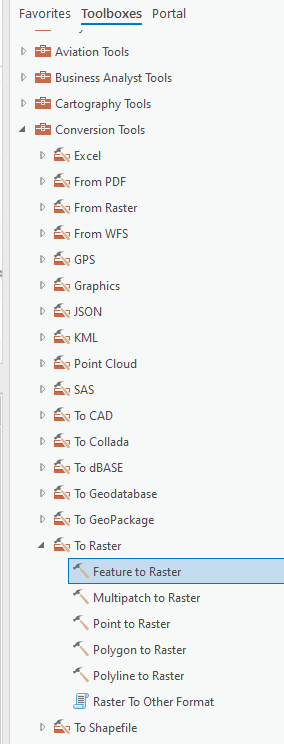

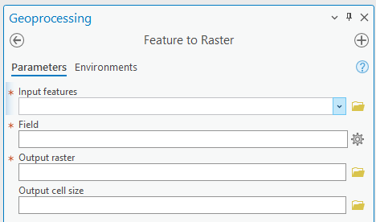

Following should be defined: input layer, output raster cell size, data field that will be converted to grid, output raster file name.

*Note:* if some features in input layer are selected, only selected ones will be converted.

## Environment Settings

## Raster Calculator

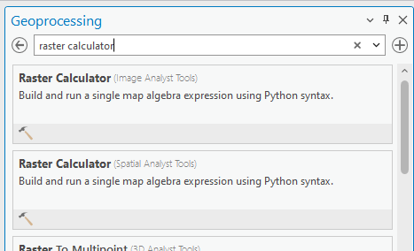

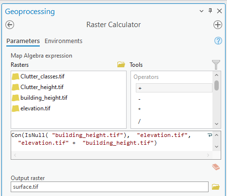

## Model Builder

**Automate your GIS tasks**

---