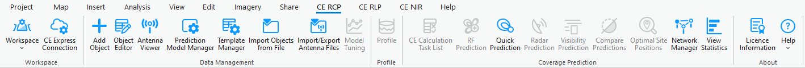
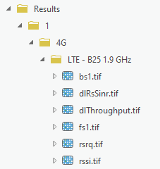
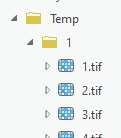
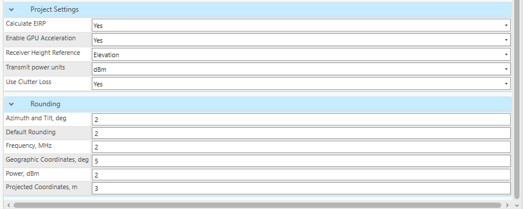

# Creating Workspace

## Cellular Expert for ArcGIS Pro Project

## CE Tools

- Workspace is not added

- Workspace is added

- Workspace is added, but Geodata is missing

## Create Workspace

- New workspace path
- Geodata folder path
- Projected coordinate system
- Also create Local Scene

## Cellular Expert Project Structure

- Predictions
- Results
- SystemFiles
- Temp
- VolatileResults
- VolatileTemp
- Workspace.gdb

## Cellular Expert Dataset

- Cell
- Site
- Radar
- Repeater
- CPE
- OMEN
- Link

## Change Project's Path

- Geodata
- Calculation paths

## Project Settings and Rounding

## Workspace Upgrade

- Automatically tracking database structure
- Workspace > Upgrade
- Provides information about new tables and fields
- Upgrade Database

