# Line of Sight (Profile)

## Modelling Outdoor Coverage

The CE tools make use of three distinct GIS data layers to obtain high precision modelling of radio wave propagation losses:

1. **Digital Terrain Model** (DTM), also known as Digital Elevation Model (DEM), which describes Earth surface, i.e., path terrain profile in terms of ground elevation above uniform sea level.
2. **Obstacles layer**, delineating buildings and other such objects above Earth surface that may be considered to be principal impediments for radio wave propagation.
3. **Clutter layer**, delineating natural occurring or human cultivated ground cover that may be partially penetrable by radio waves, such as natural vegetation (e.g., forests, trees, bushes) or various crops, gardens, parks, etc.

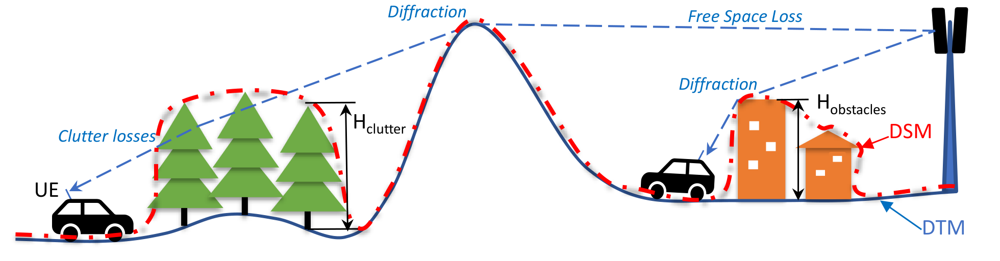

## Point to Point (Profile) Input

- Geodata
  - Elevation
  - Buildings
  - Clutter
- Frequency
- Fresnel zone (%)
- Earth radius
- Transmitter
  - Height
  - Power
- Receiver
  - Height
  - Power

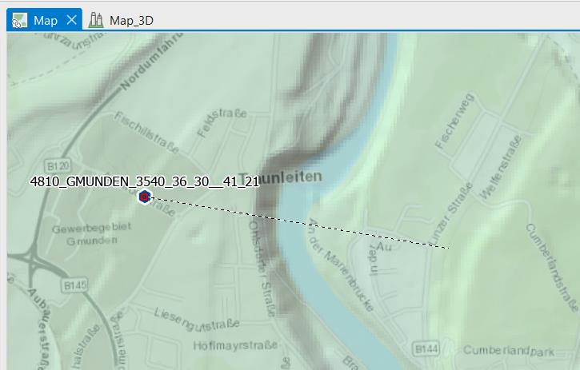

## Profile Calculations

- General
  - Clearance
  - Clearance Percentage
  - Clearance Distance
  - Distance to NLOS
  - Distance to OLOS
- Power Budget
  - Downlink FS
  - Uplink FS
  - FWA downlink RSL
  - FWA uplink RSL
- Path Loss
  - Total Path Loss
    - Model Loss
    - Diffraction Loss
    - Penetration Loss
    - Receiver Clutter Loss
    - Clutter Loss
- Angles

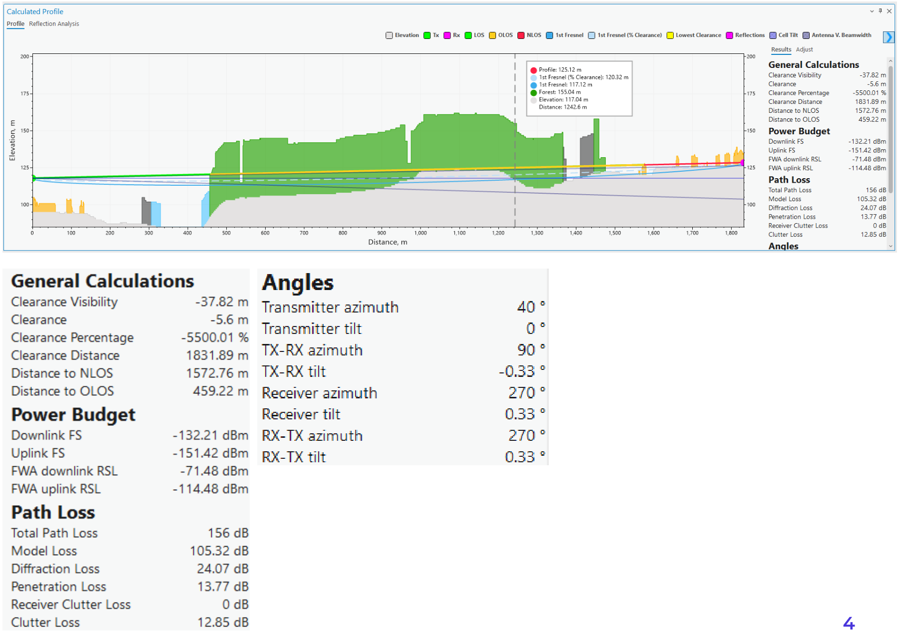

## Dynamic Profile

- Fix transmitter
- Dynamic option

## Profile Symbology

- Define colors for each object in profile

## Profile 3D

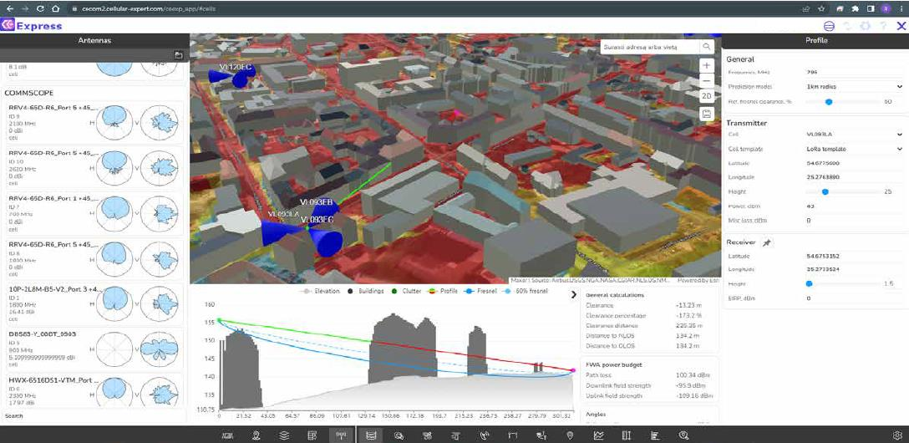

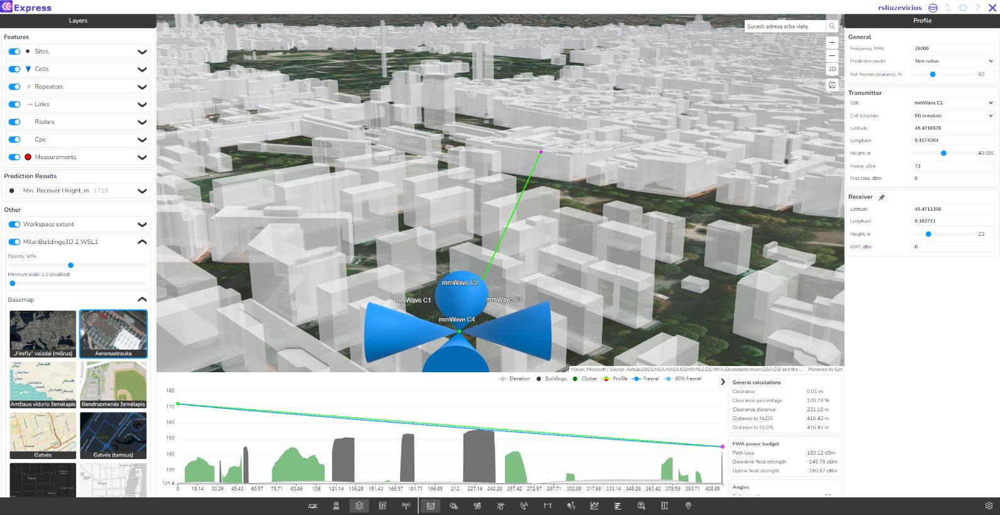

## Visibility Prediction Input

- Geodata
  - Elevation
  - Obstacle
- Frequency
- Calculation radius
- Earth radius
- Transmitter
- Receiver (height)

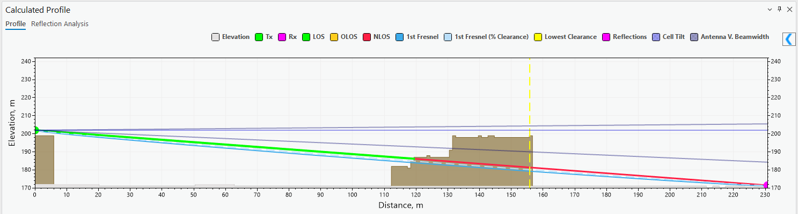

## Visibility Results

- Line of Sight
- Required height for LoS
- Clearance

## Visibility: Line of Sight

Possible values:

- 0
- 1

## Visibility: Clearance

- Clearance – clearance of visibility line between Tx to Rx as a distance in meters

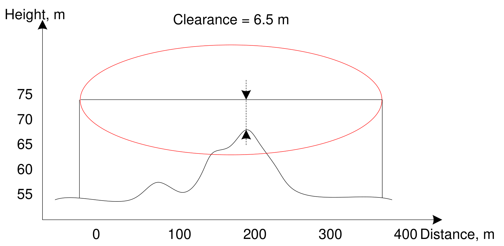

## Visibility: Minimum Receiver Height

- Receiver height – calculate required receiver heights to have a visibility

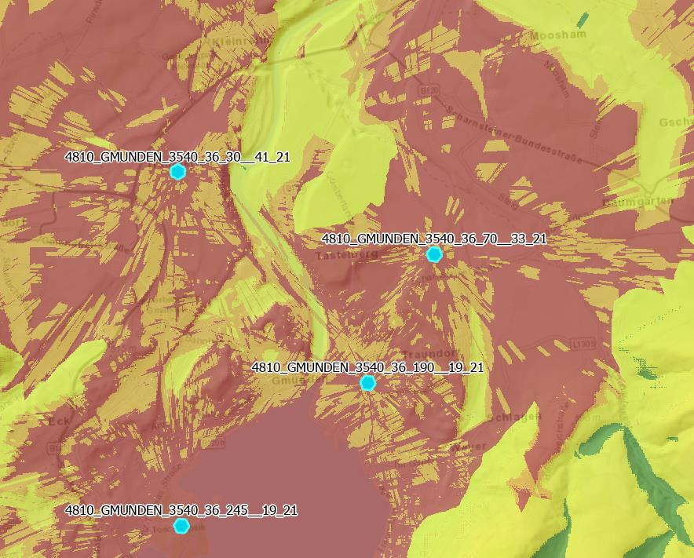

## Visibility: Line of Sight Sum Meter Topo Data

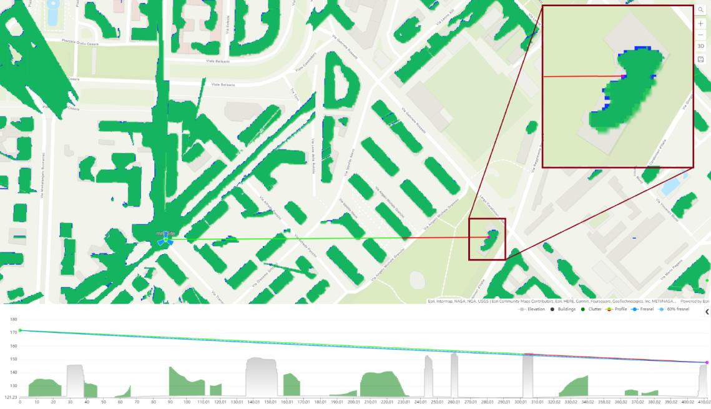

## Surface vs Elevation+Obstacles

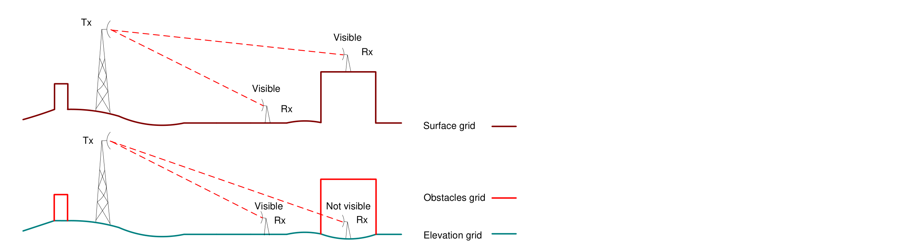

## Surface

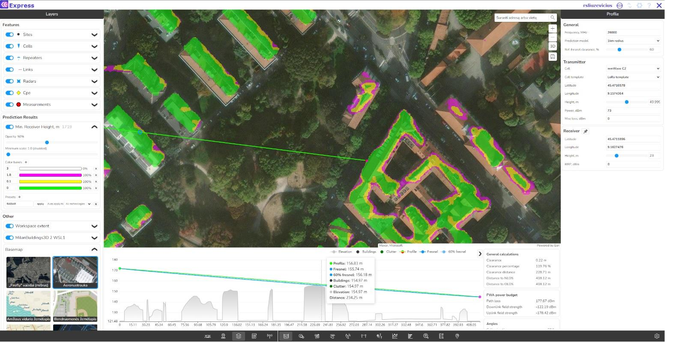

## DTM + Obstacles (Buildings/Vegetation)

## DTM + Buildings + Vegetation

