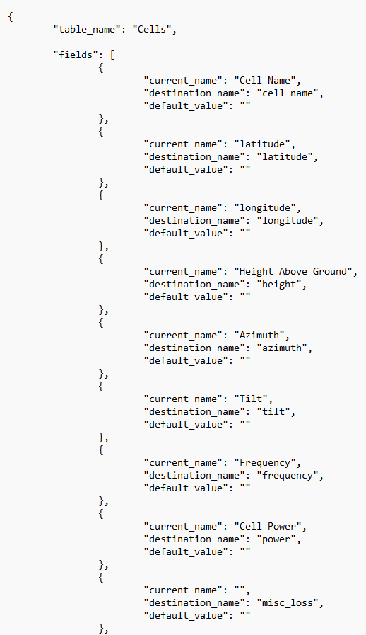
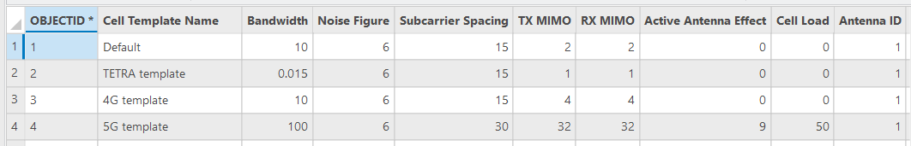

# Creating Objects

## Create Object

- Import from text (done in previous exercise)
- Create manually using Add Object tool:
  - Cell
  - Site
  - Repeater
  - CPE
  - Etc.
- Duplicate existing object or objects in the project
- Move existing object or objects in the project

## Steps to Create Cell

- Define location
  - Type specific coordinates in:
    - Projected coordinate system – X and Y coordinates
    - Geographical coordinate system – Latitude and Longitude coordinates
  - Click on the map: coordinates will be filled automatically from point defined on the map.
- Define direction (azimuth) – this will be required if Cell object coordinates will be taken by click on the map.
- Define name
- Choose Template or fill parameters manually

## Template

- Automatically fills the attributes
- Template Manager
- Own table

## Create Cell

**Cell** – logical information about sector: a set of channels

- RF prediction does not require Site object. Cells can be created without Site object.
- Cell still has SiteID value, which can be define in the attributes.
- SiteID is used for Carrier Aggregation.

**Site** – location point with unique identifier: Base station

- Site and Cell is connected through SiteID value.
- SiteID must be Integer.
- Site name is defined for Site object.

## Object Editor

- Open Object Editor
- Select features
- Double click on object
- Apply – to save changes
- Prediction model
- Antenna

## Move / Duplicate

- Object Editor
- Select objects
- Move / Duplicate
- Select point / Define coordinates
- Save