# Prediction Models

## Path Loss

```
Field Strength = EIRP – Antenna Attenuation – Path Loss
```

## Prediction Models

- ITU-R P.452 (6GHz to 50GHz)
- UniMacro (400MHz to 3GHz)
- CEC ITU-R (100MHz to 6GHz)
- LOS ITU-R P.525 (6GHz to 100 GHz)
- ITU-R P.368 (10kHz to 30MHz)

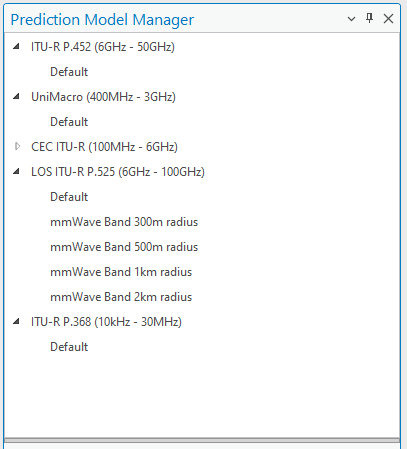

## CE Path Loss models (10kHz - 100 GHz)

1. **CEC ITU-R Model (100MHz – 6GHz)** is a combination model intended for use in a variety of different radiocommunication systems which is derived explicitly from ITU-R path loss modelling methods as follows:
   1. Receive antenna in LOS condition – path loss calculated as FSL based on [Recommendation ITU-R P.525](https://www.itu.int/rec/R-REC-P.525/en);
   2. Receive antenna in OLOS condition – total path loss modelled as a combination of basic FSL calculated based on [Recommendation ITU-R P.525](https://www.itu.int/rec/R-REC-P.525/en) and clutter loss calculated based on [Recommendation ITU-R P.2108](https://www.itu.int/rec/R-REC-P.2108/en);
   3. Receive antenna in NLOS condition – path loss as a combination of basic FSL calculated based on [Recommendation ITU-R P.525](https://www.itu.int/rec/R-REC-P.525/en), additional losses due to diffraction calculated based on [Recommendation ITU-R P.526](https://www.itu.int/rec/R-REC-P.526/en) and the clutter losses calculated based on [Rec. ITU-R P.2108](https://www.itu.int/rec/R-REC-P.2108/en).
2. **ITU-R P.452 Model (6GHz – 50GHz)** is provided as a universally applicable model with very wide frequency range from 0.1-50 GHz. Its implementation is based on the methodology described in the [Recommendation ITU-R P.452](https://www.itu.int/rec/R-REC-P.452/en). This model does not provide for definition of OLOS visibility condition; instead it considers clutter as part of general obstacles category and accordingly distinguishes only two radio visibility cases:
   1. Receive antenna in LOS condition – path loss modelled based on FSL principle;
   2. Receive antenna in NLOS condition – total path loss modelled using a combination of basic transmission losses and losses due to diffraction.
3. **LOS ITU-R P.525 Model (6GHz – 100GHz)** is the FSL path loss calculated based on method in [Recommendation ITU-R P.525](https://www.itu.int/rec/R-REC-P.525/en). As such it could be used for modelling of radio links where LOS is considered a necessary condition, e.g., for Fixed (Point-to-Point) Links or Mobile Systems in mmWave bands.
4. **UniMacro Model (400MHz – 3GHz)** is the CE's proprietary combination model developed over the years of practical experience with the operational planning of cellular mobile networks in the frequency ranges from 400-2600 MHz. It had been fine tuned to produce coverage predictions that are most closely aligned with what could be expected to be experienced by the actual mobile network users in the field. The model will model different path losses depending on radio visibility conditions as follows:
   1. Receive antenna in LOS condition – path loss modelled based on FSL principle;
   2. Receive antenna in OLOS condition – path loss modelled using Extended Hata (Open Area) model with additional clutter loss calculated based on [Recommendation ITU-R P.2108](https://www.itu.int/rec/R-REC-P.2108/en);
   3. Receive antenna in NLOS condition – path loss modelled using Extended Hata model with additional losses due to diffraction calculated based on [Recommendation ITU-R P.526](https://www.itu.int/rec/R-REC-P.526/en) as well as clutter losses based on [Rec. ITU-R P.2108](https://www.itu.int/rec/R-REC-P.2108/en).
5. **ITU-R P.368 (10kHz – 30MHz)**

## Prediction Models. Default

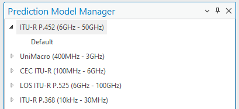


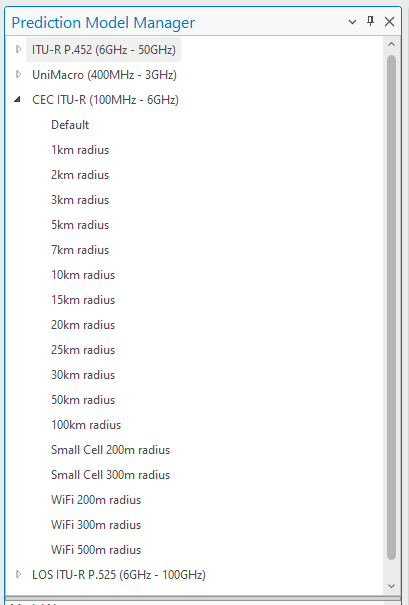


## 1. CEC ITU-R Model

- For frequencies from about 30 MHz to about 6 GHz.
- Modelling:
  - LOS
  - OLOS
  - NLOS
  
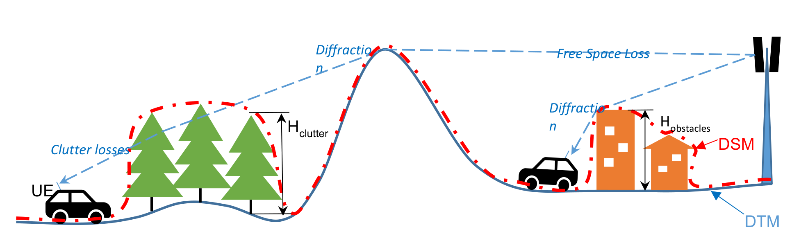

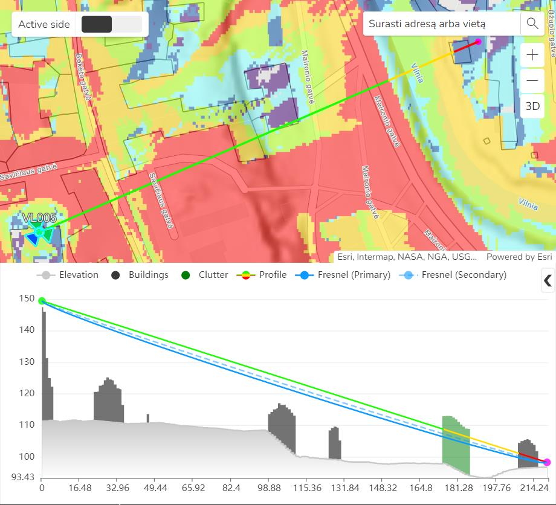

## Input Data

- **Geographic data**
  - Elevation
  - Clutter classes\*
  - Clutter height grid\*
- **Network data**
  - Receiver settings
- **Algorithm**
  - Prediction model settings

\* Optional

## Path Loss Equation (LOS / OLOS)

Path loss in dB:

```
L = K_off + K_LogD × log(d) + K_LogF × log(f)
```

- **Offset coefficient (K_Off)** - Constant offset (dBm). Default value 32
- **Distance coefficient (K_LogD)** - Distance influence coefficient. Default value 20
- **Frequency coefficient (K_LogF)** - Frequency influence coefficient. Default value 20

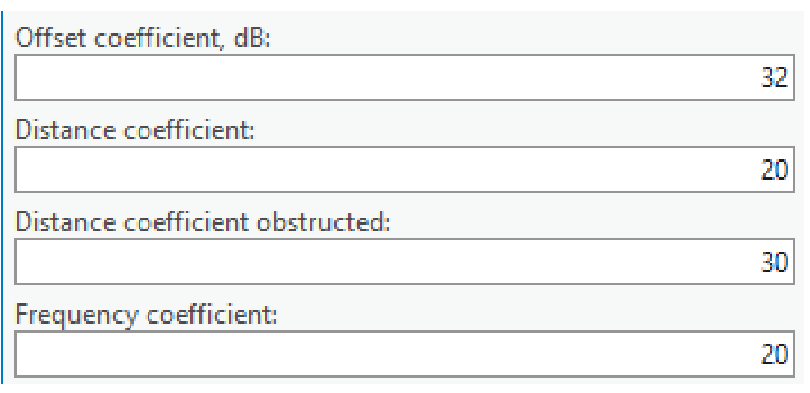

## Path Loss Equation (NLOS)

Path loss in dB:

```
L = K_off + K_LogD × log(d) + K_LogF × log(f)
```

- **Offset coefficient (K_Off)** - Constant offset (dBm). Default value 32
- **Distance coefficient obstructed (K_LogD)** - Distance influence coefficient. Default value 30
- **Frequency coefficient (K_LogF)** - Frequency influence coefficient. Default value 20


## Clutter

- **Diffraction loss for solid obstacle:**
  - Building clutter class
  - Elevation
- **Clutter loss**
  - Based on diffraction calculation
  - P.2108 Clutter Loss
- Penetration loss (Outdoor – Indoor)
- Receiver loss


## SKE Diffraction

Rec. ITU-R P.526

Idealized model of diffraction over a single obstruction.

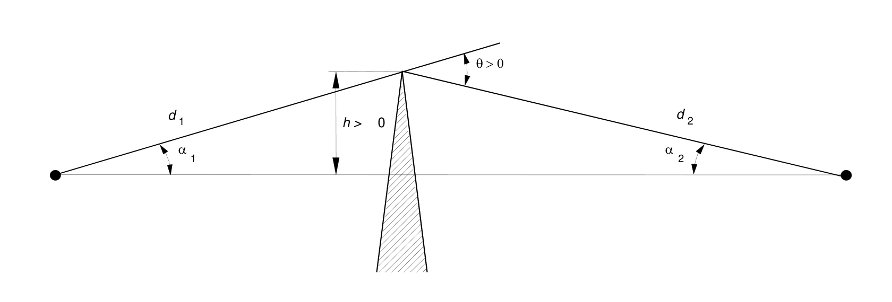

## Clutter LOS

P.2108 Clutter Loss Estimation

- Method 1: Additional clutter shadowing loss with diffraction as dominant effect


## Penetration Loss (Outdoor – Indoor)

CE Outdoor to Indoor Path Loss calculation is realised based on method recommended in [3GPP TR 38.901](https://portal.3gpp.org/desktopmodules/Specifications/SpecificationDetails.aspx?specificationId=3173). This method accounts for indoor portion of the total radio signal propagation path as shown in picture:

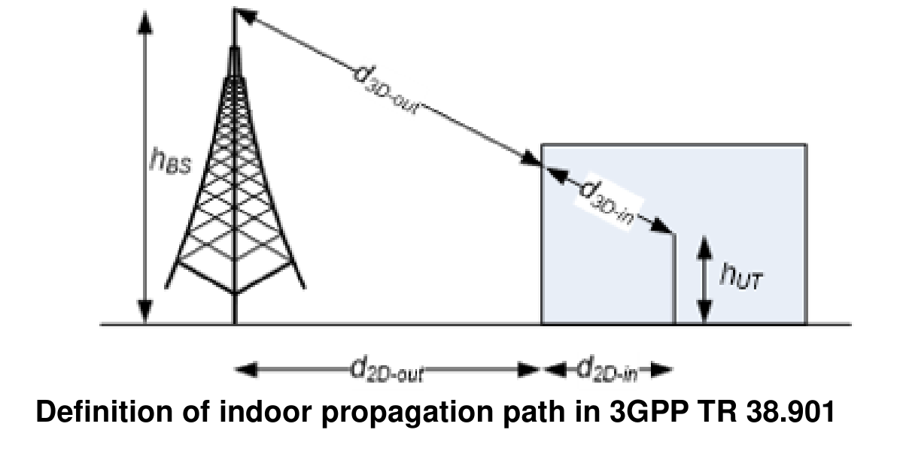

For general purpose modelling of typical building entry losses, two types of loss profiles are assumed:

- Low-loss BEL Model assumes a wall penetration losses characteristic of average traditional buildings;
- High-loss BEL Model assumes a wall penetration losses characteristic of modern thermally insulated buildings.

The corresponding BEL and building penetration losses are calculated as follows:

| Model | Path loss through external wall, PL_tw in [dB] | Indoor loss, PL_in in [dB] | Standard deviation, σ_P in [dB] |
|---|---|---|---|
| Low-loss model | 5 − 10×log10(0.3×10^(−L_glass/10) + 0.7×10^(−L_concrete/10)) | 0.5×d_2D-in | 4.4 |
| High-loss model | 5 − 10×log10(0.7×10^(−L_IIRglass/10) + 0.3×10^(−L_concrete/10)) | 0.5×d_2D-in | 6.5 |

Where:

```
L_glass    = 2 + 0.2f
L_concrete = 5 + 4f
L_IIRglass = 23 + 0.3f
```

f – frequency in GHz.

## Prediction Model Manager

- Cellular Expert tab > Prediction Model Manager
- Default can not be deleted and it takes parameters from it for new models


## 2. ITU-R P.452 Model

- For frequencies from about 6 GHz to about 100 GHz

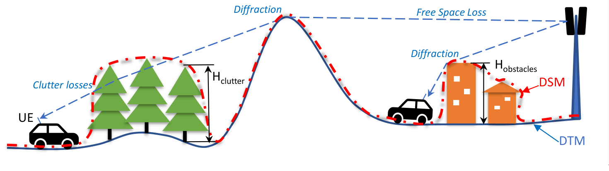

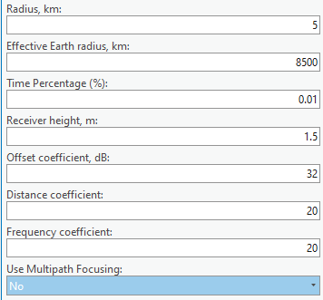

- Diffraction loss
  - Building clutter class
  - Elevation
- Penetration loss (Outdoor – Indoor)


## 3. LOS ITU-R P.525 Model

- For frequencies from about 6 GHz to about 100 GHz


## 4. UniMacro Model

- Frequency: ~ 100 MHz - 2 GHz (3 GHz)
- Distance: up to 100 km
- 9999 Model (Ericsson)


### Equation

- Line-Of-Sight Model Loss
- 9999 Ericsson
- Single Knife Edge Diffraction

### Path Loss Equation: 9999 Ericsson

Path loss in dB:

```
L_H = a0 + a1×log(d) + a2×log(hB) + a3×log(hB)×log(d) + 3.2×[log(11.75×hM)]² + g(f)

g(f) = 44.49×log(f) + 4.78×[log(f)]²
```

| Parameter | Description | Default Value |
|-----------|-------------|----------------|
| a0 | Constant offset in dB. This value is simply added to loss grid. By adjusting this value, the mean error can be minimized. It regulates the absolute level of the loss curve. | 36.8 |
| a1 | Distance influence coefficient. Physically it represents loss dependant on distance such as atmospheric (dust, hydrometeors, etc...) losses. It regulates slope of the curve. | 30.2 |
| a2 | Transmitter height influence coefficient. It is related to errors in DTM, real Earth curvature, etc. It regulates loss curve vertical position like the a0, but with respect to antenna height | -12.0 |
| a3 | Okumura-Hata type of multiplying factor for log(hB)log(d) | 0.1 |

**9999 Model is very convenient for calibration.** Empirical parameters a0-a3 can be deduced from the measured path loss dependence on distance – drive-tests.

- **a0** is a constant offset of path loss curve

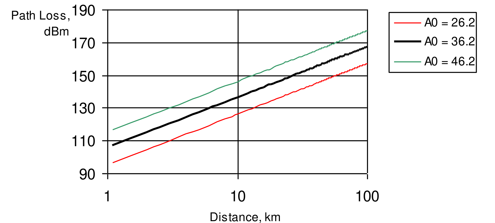

- **a1** regulates slope of the path loss curve

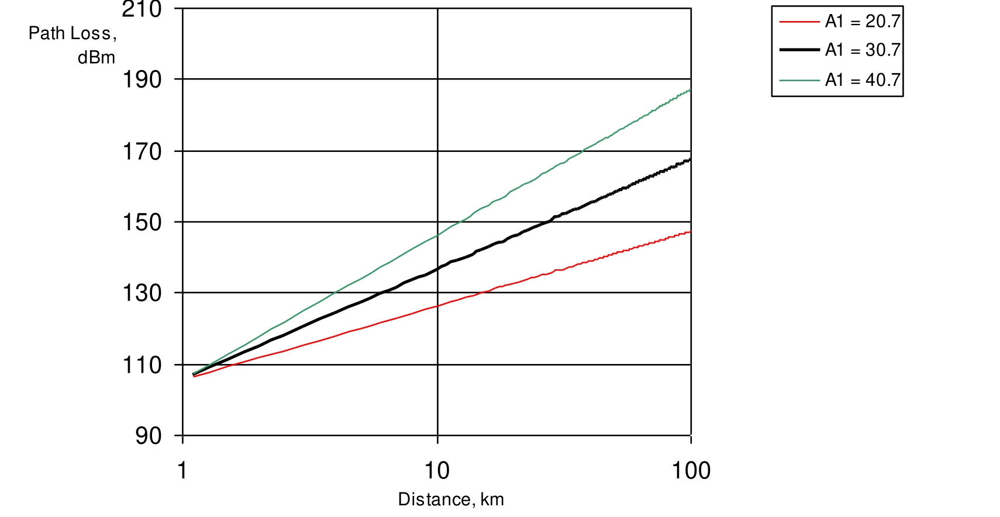

- **a2** regulates loss curve vertical position like a0, but with respect to antenna height

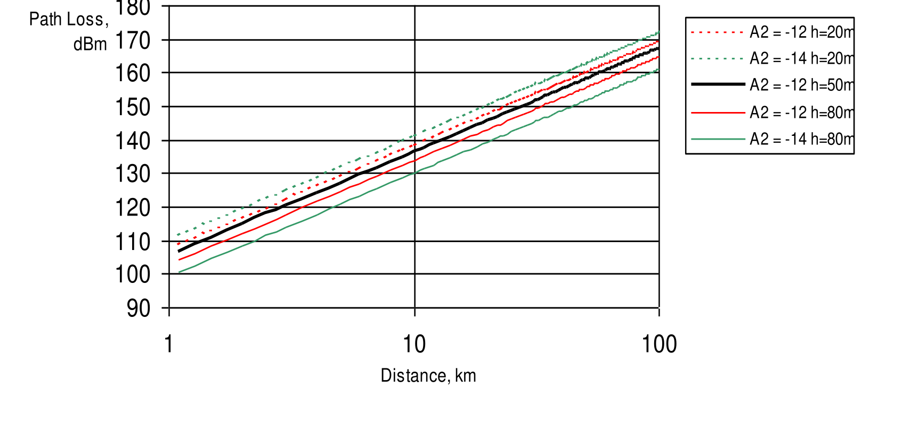

- **a3** defines slope of the path loss curve for different base station antenna heights

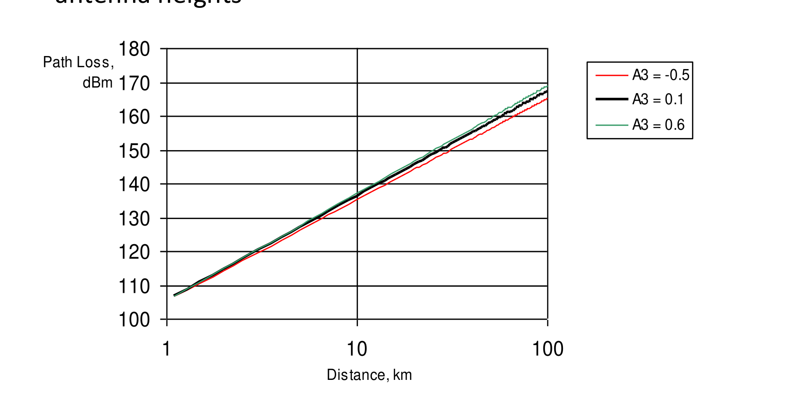

## 5. ITU-R P.368 Model

### Path loss equation

Path loss in dB:

```
L = K_off + K_LogD × log(d) + K_LogF × log(f)
```

- **K_Off** - Constant offset (dBm). Default value 32 (!)
- **K_LogD** - Distance influence coefficient. Default value 20
- **K_LogF** - Frequency influence coefficient. Default value 20


## Exercise

**Description:** `C:\CE_Course\0. Descriptions`
**Name:** `5. Prediction models.pdf`

*Reference: CE Desktop Training — 5. Prediction Models*
*Contact: info@cellular-expert.com | +370 5 2150575*
