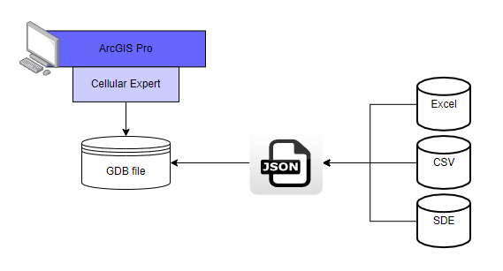
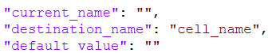

# Importing Data

## Network import for CE for ArcGIS Pro

- From:
  - Excel
  - CSV
  - SDE table
- To Cellular Expert Workspace:
  - gdb database

## [Network objects](#kw:object-types:ce-express-network-objects)

- Cells
- Sites (if siteid parameter is defined)

## Mapping file

- Json type file, can be edited with Notepad

## Mapping file structure

- **"current_name"** - name of the value that is written in the data file. As an example "freq_mhz" is a column name in the data file and will be changed to "frequency" when the mapping file is applied and objects are imported.
- **"destination_name"** - the proper name of the property (table column name) in the Cellular
- **"default_value"** – The default value applies when an object in the data file lacks a specific property. The same value will be applied for all imported objects.

## Cells: generate Cell Name

- Check option: Generate Cell Name
  - Latitude
  - Longitude
  - Azimuth
  - Frequency
  - Power
  - Height
  - Antenna gain

## Apply prediction model

- Polygon type feature class/shape file
- ModelID and ConfigID is a must
- Option appears when Import HCM patterns option is active.

## Parameters for Cell Object

- **cell_name** – cell identifier (recommended unique value).
- **latitude** - Decimal degrees Y type coordinate in the WGS 1984 geographical coordinate system.
- **longitude** - Decimal degrees X type coordinate in the WGS 1984 geographical coordinate system.
- **height** – Cell height above the terrain.
- **azimuth** - Cell direction from the North in degrees.
- **tilt** - Mechanical tilt value.
- **frequency** - Frequency value in MHz.
- **power** - Power value in dBm.
- **antenna_gain** - Antenna gain value from the applied antenna.
- **misc_loss** - Miscellaneous loss value in dB.
- **bandwidth** - Value in MHz. Required for 4G and 5G technologies. For other technologies define the value as 0.015.
- **noise_figure** - Value in dB. Required for 4G and 5G technologies.
- **downlink_duplex_factor** - Value range from 0 to 1. Required for 4G and 5G technologies, and used for Downlink Throughput calculations.
- **subcarrier_spacing** - Value in kHz. Required for 4G and 5G technologies. For other technologies define value 15.
- **tx_mimo** - Transmitter antenna count. Available values: 1, 2, 4, 8, 16, 32 and 64.
- **rx_mimo** - Receiver antenna count. Available values: 1, 2, 4, 8, 16, 32 and 64.
- **active_antenna_effect** - The parameter is dedicated to smart antenna modelling. The default value is 0, but if massive MIMO is used, a smart antenna effect can be included to lower the interference and boost throughput. Recommended values:
  - For MIMO 32x32 – value 6.
  - For MIMO 64x64 – value 9.
- **cell_load** - The parameter is described in percentages and varies from 0 to 100. It describes how the cell is loaded. The Cell load affects RSSI, RSRQ, DL Throughput calculations. For example, if the Cell load is higher, the DL Throughput is lower.
- **technology** - Describes the technology of cell. Possible values are 2G, 3G, 4G, 5G and WiFi.
- **prediction_model_id** – prediction model identification:
  - If value 1 – ITU-R P.452
  - If value 2 – UniMacro
  - If value 3 – CEC ITU-R
  - If value 4 – LOS ITU-R P.525
  - If value 5 – ITU-R P.368
- **prediction_model_configuration_id** – prediction model configuration identification in define prediction model (prediction_model_id value).
- **frequency_group** – helps to manage different frequency groups, RF prediction will do separate prediction for different frequency_group value automatically.
- **antenna_id** - antenna identification in the database.
- **duplex_mode** - Required for 4G and 5G technologies, possible values FDD or TDD.
- **site_id** – to automatically create Site object for cells, define site name field here. Must be a text format.

