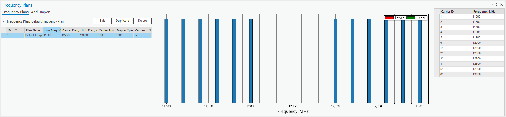
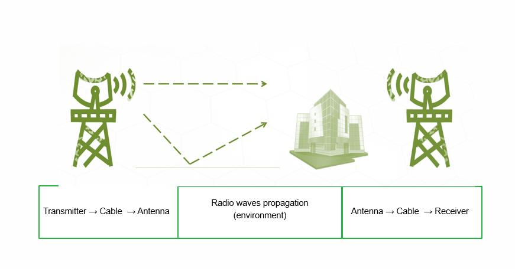
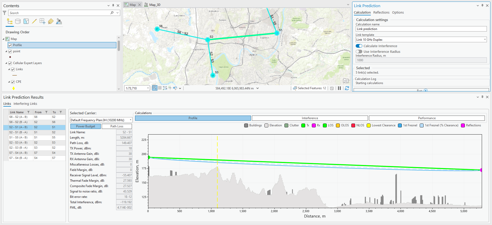
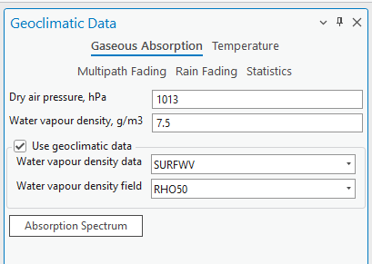
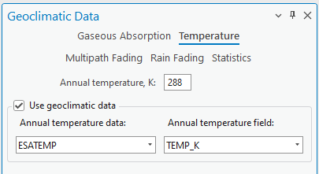
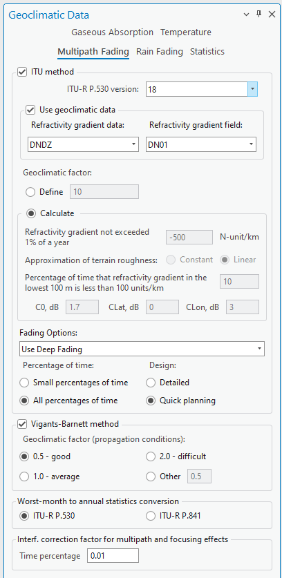

# RL Introduction

## Equipment

- Antennas > Parabolic
- Radio Models
- Frequency Plans
- Spectrum Mask

### Antennas

### Radio Models

### Frequency Plans

### Spectrum Mask

## Transmission Network

## Microwave Link Planning

- Power budget
- Path loss
- Profile graphical view
- Interference From
- Interference To

### Power Budget

### Geoclimatic Data

### Interfering Links

- Interfering link on the map
- Power budget
- Path loss
- Profile graphical view
- Spectrum Mask

